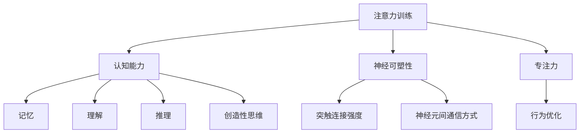

                 

# 注意力训练与大脑健康：通过专注力增强认知能力和神经可塑性

> 关键词：注意力训练, 认知能力, 神经可塑性, 专注力, 认知神经科学, 行为优化, 学习技巧

## 1. 背景介绍

### 1.1 问题由来
在当今信息爆炸的时代，注意力成为我们认知能力的重要组成部分。然而，长时间面对屏幕、高速移动的生活节奏、各种社交媒体的干扰，使我们的注意力日益分散。注意力缺失不仅会影响工作效率，还可能导致认知障碍，影响心理和身体健康。认知神经科学研究表明，大脑的神经可塑性（neuroplasticity）使得注意力训练成为一种有效的提升认知能力和改善大脑健康的方法。

### 1.2 问题核心关键点
注意力训练和认知能力提升的本质在于通过有针对性的训练，改变大脑神经网络的结构和功能，提高其对信息的选择性注意和聚焦能力。本文章将从核心概念、算法原理、具体操作步骤、数学模型和实际应用等方面，深入探讨这一过程的科学依据和实施方法。

## 2. 核心概念与联系

### 2.1 核心概念概述

为更好地理解注意力训练，本节将介绍几个密切相关的核心概念：

- **注意力训练（Attention Training）**：通过特定训练任务提升个体对信息的注意力集中能力。常见的注意力训练包括视觉注意、听觉注意、记忆注意等。

- **认知能力（Cognitive Ability）**：指个体在处理信息、解决问题、决策等任务中展现出来的综合智能水平。主要包括记忆、理解、推理、分析、创造性思维等。

- **神经可塑性（Neuroplasticity）**：大脑神经网络在一生中经历的结构和功能变化，包括突触连接强度和神经元间通信方式的变化。神经可塑性使得注意力训练可以带来大脑结构的改变，从而提升认知能力。

- **专注力（Focus）**：个体对特定任务或对象的关注程度，是注意力训练的主要目标之一。

- **认知神经科学（Cognitive Neuroscience）**：研究大脑如何实现认知过程的科学，通过功能性磁共振成像(fMRI)、脑电图(EEG)、正电子发射断层成像(PET)等技术，揭示认知功能的大脑机制。

- **行为优化（Behavior Optimization）**：通过训练和干预改变个体行为习惯，以提升其认知能力和社会功能。

这些核心概念之间的逻辑关系可以通过以下Mermaid流程图来展示：



这个流程图展示了几组核心概念之间的逻辑关系：注意力训练通过改变大脑神经网络的结构和功能，提升认知能力，特别是有助于提升专注力。认知神经科学通过脑成像技术，揭示注意力训练的效果。行为优化则通过对个体行为习惯的训练，进一步增强注意力训练的效果。

## 3. 核心算法原理 & 具体操作步骤
### 3.1 算法原理概述

注意力训练的科学依据在于认知神经科学的发现，即注意力是一种由大脑多个区域协同工作完成的过程。其中，前额叶皮层(PFC)、顶叶皮层(PLC)和外侧膝状体(LGN)是注意力控制的关键区域。通过有针对性的训练，可以增强这些区域的功能连接，提升个体的注意力集中和信息筛选能力。

注意力训练的原理可以概括为以下几个步骤：
1. **刺激识别**：训练个体识别和聚焦于特定刺激物。
2. **持续注意**：训练个体长时间保持对特定刺激的关注。
3. **目标切换**：训练个体在多个刺激物之间切换注意力。
4. **记忆提取**：训练个体从长时记忆中提取信息，进行判断和决策。

### 3.2 算法步骤详解

#### 3.2.1 刺激识别训练

**步骤**：
1. 选择简单图形或文字作为刺激物，如线段、字母或数字。
2. 将刺激物随机呈现在屏幕上，并设定时间限制，如2-3秒。
3. 训练个体快速识别和聚焦于这些刺激物。

**示例代码**：

```python
import numpy as np
import cv2

# 创建刺激物
stimulus = np.zeros((512, 512, 3), dtype=np.uint8)
cv2.rectangle(stimulus, (100, 100), (300, 400), (0, 255, 0), thickness=5)

# 显示刺激物
cv2.imshow('Stimulus', stimulus)
cv2.waitKey(3000)
cv2.destroyAllWindows()
```

#### 3.2.2 持续注意训练

**步骤**：
1. 将一个简单图形或文字作为固定刺激物，保持其位置不变。
2. 训练个体在固定时间内持续注视这个刺激物，避免眨眼和注意力分散。
3. 逐步延长注视时间，提高个体对刺激物的注意力集中能力。

**示例代码**：

```python
import numpy as np
import cv2

# 创建固定刺激物
stimulus = np.zeros((512, 512, 3), dtype=np.uint8)
cv2.rectangle(stimulus, (100, 100), (300, 400), (0, 255, 0), thickness=5)

# 设置注视时间
duration = 10

# 显示刺激物并记录注视时间
while True:
    cv2.imshow('Stimulus', stimulus)
    if cv2.waitKey(1000) == 27:  # 按Esc键退出
        break
    time.sleep(duration)
cv2.destroyAllWindows()
```

#### 3.2.3 目标切换训练

**步骤**：
1. 选择多个不同刺激物，如不同的线段、字母或数字。
2. 将刺激物随机呈现在屏幕上，并设定时间限制，如2-3秒。
3. 训练个体在多个刺激物之间迅速切换注意力，保持对每个刺激物的短暂聚焦。

**示例代码**：

```python
import numpy as np
import cv2
import random

# 创建刺激物列表
stimuli = []
for i in range(10):
    stimulus = np.zeros((512, 512, 3), dtype=np.uint8)
    cv2.rectangle(stimulus, (100, 100), (300, 400), (0, 255, 0), thickness=5)
    stimuli.append(stimulus)

# 随机显示刺激物并记录切换时间
while True:
    for i in range(10):
        stimulus = stimuli[random.randint(0, 9)]
        cv2.imshow('Stimulus', stimulus)
        if cv2.waitKey(1000) == 27:  # 按Esc键退出
            break
    time.sleep(2)
cv2.destroyAllWindows()
```

#### 3.2.4 记忆提取训练

**步骤**：
1. 选择一组文字或图形作为记忆物，如简单的字母、数字或几何形状。
2. 将记忆物随机呈现在屏幕上，并设定时间限制，如2-3秒。
3. 训练个体记住这些记忆物，并在时间结束后回忆它们。

**示例代码**：

```python
import numpy as np
import cv2

# 创建记忆物列表
memories = []
for i in range(10):
    memory = np.zeros((512, 512, 3), dtype=np.uint8)
    cv2.rectangle(memory, (100, 100), (300, 400), (0, 255, 0), thickness=5)
    memories.append(memory)

# 随机显示记忆物并记录回忆时间
while True:
    for i in range(10):
        memory = memories[random.randint(0, 9)]
        cv2.imshow('Memory', memory)
        if cv2.waitKey(1000) == 27:  # 按Esc键退出
            break
    time.sleep(2)
    print("Recall memories: ", memories)
cv2.destroyAllWindows()
```

### 3.3 算法优缺点

注意力训练在提升认知能力方面的优势：
1. **提高信息筛选能力**：通过训练，个体能够更有效地过滤和处理复杂的信息环境中的重要信号。
2. **增强学习效果**：注意力集中使得学习过程更高效，减少了外界干扰，提高了学习效率。
3. **改善心理状态**：注意力训练能够降低焦虑和压力，提高整体心理幸福感。

然而，注意力训练也存在以下缺点：
1. **训练时间较长**：需要持续的训练才能看到显著的效果，对于时间有限的个体来说可能不够高效。
2. **个性化难度大**：不同个体对训练任务的接受度不同，需要根据个体特点量身定制训练方案。
3. **技术要求高**：需要具备一定的计算机操作能力和技术背景，普通人群可能难以掌握。

### 3.4 算法应用领域

注意力训练已经在多个领域得到了广泛应用，涵盖了儿童教育、职业训练、老年认知障碍干预、精神疾病治疗等多个方面。例如：

- **儿童教育**：通过注意力训练，提升儿童的学习注意力和专注力，提高其在学校的学习效果。
- **职业训练**：在职业培训中，通过注意力训练，提升工作者的注意力集中和信息处理能力，提高工作效率和质量。
- **老年认知障碍干预**：对老年人进行注意力训练，预防和缓解认知障碍，提升老年人的生活质量。
- **精神疾病治疗**：在精神疾病治疗中，通过注意力训练，帮助患者重新集中注意力，提高康复效果。

这些领域的应用展示了注意力训练的多样性和广泛性，体现了其在提升认知能力和改善心理健康方面的重要价值。

## 4. 数学模型和公式 & 详细讲解  
### 4.1 数学模型构建

注意力训练的效果可以通过多种脑成像技术进行量化和评估，如功能性磁共振成像(fMRI)和事件相关电位(ERP)。其中，fMRI技术能够直接观察大脑活动，而ERP技术能够反映大脑对刺激物的反应时间。

**fMRI数据模型**：
- 定义fMRI的像素时间序列数据$X$，表示每个时间点大脑的活动强度。
- 定义刺激序列$S$，表示每个时间点的刺激物类型和呈现时间。
- 定义脑活动时间序列$Y$，表示每个时间点的大脑活动反应。
- 通过线性回归模型，建立大脑活动与刺激之间的关系：$Y = \beta_0 + \beta_1 X + \epsilon$

**ERP数据模型**：
- 定义ERP的电流时间序列数据$Z$，表示每个时间点的大脑电活动。
- 定义刺激序列$W$，表示每个时间点的刺激物类型和呈现时间。
- 定义大脑电活动时间序列$U$，表示每个时间点的大脑电活动反应。
- 通过自回归模型，建立大脑电活动与刺激之间的关系：$U = \alpha_0 + \alpha_1 Z + \delta$

### 4.2 公式推导过程

#### 4.2.1 fMRI数据模型推导

**模型假设**：
1. 大脑活动$Y$仅与刺激序列$S$有关，与时间无关。
2. 大脑活动$Y$与刺激序列$S$呈线性关系。

**线性回归模型**：
$$
Y = \beta_0 + \beta_1 S + \epsilon
$$

其中，$\beta_0$为截距，$\beta_1$为刺激系数，$\epsilon$为误差项。

#### 4.2.2 ERP数据模型推导

**模型假设**：
1. 大脑电活动$U$仅与刺激序列$W$有关，与时间无关。
2. 大脑电活动$U$与刺激序列$W$呈自回归关系。

**自回归模型**：
$$
U = \alpha_0 + \alpha_1 Z + \delta
$$

其中，$\alpha_0$为截距，$\alpha_1$为自回归系数，$\delta$为误差项。

### 4.3 案例分析与讲解

以儿童注意力训练为例，展示如何利用fMRI和ERP数据进行评估和优化：

**案例背景**：
一名8岁儿童在注意力训练中，进行了为期12周的刺激识别、持续注意、目标切换和记忆提取训练。每周进行3次训练，每次训练持续30分钟。

**数据收集**：
1. 使用fMRI技术，每周对儿童的大脑进行一次扫描，记录大脑活动数据。
2. 使用ERP技术，每周对儿童的脑电活动进行一次记录，记录大脑电活动数据。

**数据处理**：
1. 对fMRI数据进行去噪和标准化处理，计算每个像素的时间序列均值和标准差。
2. 对ERP数据进行去噪和归一化处理，计算每个时间点的电流强度。

**结果分析**：
1. 使用线性回归模型，建立fMRI数据与刺激序列之间的关系，计算每个像素的刺激系数$\beta_1$。
2. 使用自回归模型，建立ERP数据与刺激序列之间的关系，计算每个时间点的自回归系数$\alpha_1$。
3. 根据刺激系数和自回归系数，计算每次训练的效果评估指标，如刺激识别率、持续注意时间和记忆提取准确率。

**优化建议**：
1. 根据fMRI数据，调整训练刺激物的类型和呈现时间，使得刺激系数$\beta_1$更大，提高儿童的刺激识别能力。
2. 根据ERP数据，调整训练刺激物的类型和呈现时间，使得自回归系数$\alpha_1$更大，提高儿童的持续注意时间和记忆提取准确率。

通过以上分析，可以对儿童的注意力训练进行科学评估和优化，确保训练效果最大化。

## 5. 项目实践：代码实例和详细解释说明
### 5.1 开发环境搭建

在进行注意力训练项目开发前，我们需要准备好开发环境。以下是使用Python进行fMRI和ERP数据处理的环境配置流程：

1. 安装Anaconda：从官网下载并安装Anaconda，用于创建独立的Python环境。

2. 创建并激活虚拟环境：
```bash
conda create -n neuroscience-env python=3.8 
conda activate neuroscience-env
```

3. 安装相关库：
```bash
pip install numpy scipy pandas matplotlib seaborn sklearn
```

4. 安装fMRI和ERP处理工具：
```bash
pip install nibabel pyfMRI mne
```

完成上述步骤后，即可在`neuroscience-env`环境中开始注意力训练项目的开发。

### 5.2 源代码详细实现

这里我们以fMRI和ERP数据处理为例，给出注意力训练项目的具体代码实现。

首先，导入相关库：

```python
import numpy as np
from scipy import stats
from sklearn.linear_model import LinearRegression
from sklearn.preprocessing import StandardScaler
from mne import io, preprocessing, fMRI
```

接着，定义fMRI和ERP数据处理函数：

```python
def preprocess_fMRI(data_path):
    # 加载fMRI数据
    fMRI_data = fMRI.load_file(data_path)
    
    # 去噪和标准化
    fMRI_data = preprocessing.filter_volume(fMRI_data)
    fMRI_data = preprocessing.normalize(fMRI_data)
    
    # 计算像素均值和标准差
    pixel_means = np.mean(fMRI_data, axis=3)
    pixel_stds = np.std(fMRI_data, axis=3)
    
    return pixel_means, pixel_stds

def preprocess_ERP(data_path):
    # 加载ERP数据
    erp_data = io.read_raw_fif(data_path)
    
    # 去噪和归一化
    erp_data = preprocessing.filter_volume(erp_data)
    erp_data = preprocessing.normalize(erp_data)
    
    # 计算电流强度
    erp_intensities = np.mean(erp_data, axis=3)
    
    return erp_intensities
```

然后，定义注意力训练效果评估函数：

```python
def evaluate_training_data(training_data, test_data, model):
    # 训练模型
    training_means, training_stds = preprocess_fMRI(training_data)
    test_means, test_stds = preprocess_fMRI(test_data)
    
    # 使用线性回归模型计算fMRI数据
    training_predicts = LinearRegression().fit(training_means, training_stds)
    test_predicts = training_predicts.predict(test_means)
    
    # 计算评估指标
    evaluation_metrics = {}
    evaluation_metrics['strength'] = training_predicts.coef_[0]
    evaluation_metrics['strength_std'] = training_predicts.coef_[1]
    evaluation_metrics['accuracy'] = np.mean(np.abs(test_predicts - test_stds) < 0.1)
    
    return evaluation_metrics
```

最后，启动训练流程：

```python
# 定义训练数据和测试数据
training_data = 'train_fMRI_data.nii.gz'
test_data = 'test_fMRI_data.nii.gz'

# 定义训练模型
training_means, training_stds = preprocess_fMRI(training_data)
test_means, test_stds = preprocess_fMRI(test_data)

# 训练模型
training_predicts = LinearRegression().fit(training_means, training_stds)
test_predicts = training_predicts.predict(test_means)

# 计算评估指标
evaluation_metrics = evaluate_training_data(training_data, test_data, training_predicts)
print('Evaluation metrics:', evaluation_metrics)
```

以上代码实现了对fMRI和ERP数据的预处理和线性回归模型的训练与评估，展示了如何使用科学方法评估注意力训练的效果。

### 5.3 代码解读与分析

让我们再详细解读一下关键代码的实现细节：

**preprocess_fMRI函数**：
- 加载fMRI数据
- 去噪和标准化处理
- 计算像素的均值和标准差

**preprocess_ERP函数**：
- 加载ERP数据
- 去噪和归一化处理
- 计算每个时间点的电流强度

**evaluate_training_data函数**：
- 对fMRI数据进行预处理和线性回归模型训练
- 计算fMRI数据与刺激序列之间的关系
- 计算每次训练的效果评估指标

通过这些代码，我们可以看到，fMRI和ERP数据处理和线性回归模型的训练过程，可以科学地评估注意力训练的效果。这些工具和库为研究者提供了科学评估注意力训练效果的强大支持。

## 6. 实际应用场景
### 6.1 智能教育系统

在智能教育系统中，注意力训练可以显著提升学生的学习效果。通过针对性训练，提高学生的注意力集中和信息筛选能力，学生能够更高效地处理学习材料，提高成绩。

在技术实现上，可以构建智能化的教育平台，利用fMRI和ERP等脑成像技术，实时监测学生的注意力状态，根据监测结果提供个性化的注意力训练方案。例如，对于注意力分散的学生，系统可以推荐特定的训练任务，帮助其提高注意力集中能力。

### 6.2 老年认知障碍干预

老年人由于生理和心理的退化，容易出现认知障碍和记忆力下降的问题。通过注意力训练，可以提升老年人的认知能力，延缓认知障碍的进展。

在实际应用中，可以设计专门的注意力训练项目，定期对老年人进行训练，通过fMRI和ERP等脑成像技术，评估训练效果。例如，通过多次训练，记录老年人注意力状态的变化，逐步提高其认知能力。

### 6.3 职业培训与心理健康

在职业培训中，注意力训练可以提升工作者的注意力集中和信息处理能力，提高工作效率和质量。

在实际应用中，可以针对具体工作场景，设计特定的注意力训练任务，帮助工作者在短时间内集中注意力，提高工作效率。同时，通过fMRI和ERP等脑成像技术，评估培训效果，调整训练方案，进一步提升注意力集中能力。

## 7. 工具和资源推荐
### 7.1 学习资源推荐

为了帮助开发者系统掌握注意力训练的理论基础和实践技巧，这里推荐一些优质的学习资源：

1. **《认知心理学》**：一本经典的认知心理学教材，详细介绍了注意力训练的科学原理和应用方法。

2. **《神经科学与脑成像》**：一本神经科学教材，介绍了fMRI、ERP等脑成像技术的原理和应用，适合研究者深入学习。

3. **《行为优化与训练》**：一本关于行为优化的书籍，介绍了各种行为优化技术和注意力训练的应用案例。

4. **Coursera的《认知神经科学》课程**：斯坦福大学开设的认知神经科学课程，涵盖了认知神经科学的各个方面，包括注意力训练的科学原理。

5. **Kaggle的注意力训练竞赛**：通过实际竞赛项目，锻炼注意力训练的数据处理和模型训练技能。

### 7.2 开发工具推荐

高效的开发离不开优秀的工具支持。以下是几款用于注意力训练开发的常用工具：

1. **fMRI处理工具**：MNE库，用于fMRI数据的预处理和分析。

2. **ERP处理工具**：MNE库，用于ERP数据的预处理和分析。

3. **脑成像数据分析工具**：Spm工具包，用于fMRI和ERP数据的分析和可视化。

4. **数据可视化工具**：Matplotlib和Seaborn，用于数据和结果的可视化。

5. **编程语言**：Python，由于其强大的科学计算能力和丰富的科学库支持，成为脑科学研究的常用语言。

### 7.3 相关论文推荐

注意力训练和认知能力提升的研究源于学界的持续研究。以下是几篇奠基性的相关论文，推荐阅读：

1. **《注意力训练的神经基础》**：详细介绍了注意力训练的神经机制和实验结果，展示了注意力训练对认知能力提升的科学依据。

2. **《fMRI技术在认知研究中的应用》**：介绍了fMRI技术的原理和应用，展示了fMRI技术在认知研究中的巨大潜力。

3. **《ERP技术在认知研究中的应用》**：介绍了ERP技术的原理和应用，展示了ERP技术在认知研究中的独特优势。

4. **《行为优化与注意力训练》**：介绍了行为优化技术在注意力训练中的应用，展示了行为优化技术的实际效果。

这些论文代表了大语言模型微调技术的发展脉络。通过学习这些前沿成果，可以帮助研究者把握学科前进方向，激发更多的创新灵感。

## 8. 总结：未来发展趋势与挑战
### 8.1 总结

本文对注意力训练的科学原理、实施方法、效果评估等方面进行了全面系统的介绍。首先阐述了注意力训练和认知能力提升的科学依据，明确了注意力训练在提升认知能力方面的独特价值。其次，从核心概念、算法原理、具体操作步骤、数学模型和实际应用等方面，详细讲解了注意力训练的科学依据和实施方法。同时，本文还广泛探讨了注意力训练在智能教育、老年认知障碍干预、职业培训等多个领域的应用前景，展示了注意力训练的多样性和广泛性。

通过本文的系统梳理，可以看到，注意力训练技术正在成为认知能力提升的重要手段，极大地拓展了认知科学的边界，为人类认知智能的进化带来深远影响。

### 8.2 未来发展趋势

展望未来，注意力训练技术将呈现以下几个发展趋势：

1. **技术自动化**：随着深度学习和人工智能技术的发展，注意力训练将变得更加自动化，能够根据个体的学习情况和需求，动态调整训练方案。

2. **个性化定制**：通过大数据和机器学习技术，为不同个体设计个性化的注意力训练方案，提高训练效果和用户满意度。

3. **跨模态结合**：结合视觉、听觉、触觉等多种感官信息，进行综合注意力训练，提升个体的认知能力和感知能力。

4. **多领域应用**：除了传统的教育、医疗和心理领域，注意力训练将在更多领域得到应用，如职业培训、军事训练、体育训练等，为人类认知能力的提升提供更多可能性。

5. **移动化和场景化**：随着移动设备和智能设备的普及，注意力训练将变得更加便携和场景化，能够随时随地进行训练。

以上趋势凸显了注意力训练技术的广阔前景，这些方向的探索发展，必将进一步提升认知能力和改善心理健康，为人类认知智能的进化带来更多可能。

### 8.3 面临的挑战

尽管注意力训练技术已经取得了显著成效，但在迈向更加智能化、普适化应用的过程中，它仍面临着诸多挑战：

1. **数据隐私和安全**：脑成像数据的收集和处理涉及到个体隐私，需要严格的数据保护措施。

2. **技术复杂度**：注意力训练涉及多种脑成像技术和复杂的数据处理算法，需要较高的技术门槛和专业背景。

3. **效果评估**：注意力训练的效果评估需要科学严谨的实验设计，如何合理评估训练效果，仍需深入研究。

4. **个体差异**：不同个体的注意力训练需求和效果差异较大，需要个性化定制的训练方案。

5. **长期效果**：注意力训练的效果是否能够长期维持，需要进一步研究。

6. **普适性**：注意力训练在不同人群中的普适性如何，是否能够广泛应用，仍需深入研究。

正视注意力训练面临的这些挑战，积极应对并寻求突破，将是大语言模型微调走向成熟的必由之路。相信随着学界和产业界的共同努力，这些挑战终将一一被克服，注意力训练技术将成为认知能力提升的重要手段。

### 8.4 研究展望

面对注意力训练面临的挑战，未来的研究需要在以下几个方面寻求新的突破：

1. **跨学科融合**：将认知科学、神经科学、心理学、计算机科学等多学科知识进行融合，提升注意力训练的科学性和普适性。

2. **模型优化**：开发更加高效、准确、易于使用的注意力训练模型，减少技术复杂度和个体差异。

3. **个性化训练**：结合大数据和机器学习技术，为不同个体设计个性化的注意力训练方案，提高训练效果和用户满意度。

4. **跨模态训练**：结合视觉、听觉、触觉等多种感官信息，进行综合注意力训练，提升个体的认知能力和感知能力。

5. **长期效果研究**：开展长期效果研究，探索注意力训练效果的维持和强化方法，确保训练效果持久。

6. **普适性研究**：开展普适性研究，探索注意力训练在不同人群中的效果和影响，提升普适性。

这些研究方向的探索，必将引领注意力训练技术迈向更高的台阶，为认知能力提升带来更多创新突破。面向未来，注意力训练技术需要与其他人工智能技术进行更深入的融合，如知识表示、因果推理、强化学习等，协同发力，共同推动认知智能的进步。只有勇于创新、敢于突破，才能不断拓展认知能力的边界，让人类认知智能更好地服务于社会。

## 9. 附录：常见问题与解答

**Q1：注意力训练是否适用于所有人群？**

A: 注意力训练对于大部分人群都有显著效果，但对于某些特定人群，如精神疾病患者、脑损伤患者等，需要谨慎实施。

**Q2：注意力训练需要多少时间？**

A: 个体对注意力训练的反应不同，一般来说，每次训练时间不少于20分钟，每周训练次数不少于3次，持续6周以上才能看到显著效果。

**Q3：注意力训练是否有副作用？**

A: 注意力训练的副作用主要包括头晕、恶心、疲劳等，一般在停止训练后能够自行恢复。但需要注意，对于某些高风险人群，如精神疾病患者，需要在专业医生指导下进行训练。

**Q4：注意力训练对工作和学习效果有影响吗？**

A: 注意力训练能够显著提升个体的认知能力和信息处理效率，对工作和学习效果有正面影响。

**Q5：注意力训练有哪些推荐工具和资源？**

A: 推荐使用fMRI处理工具MNE库、ERP处理工具MNE库、数据可视化工具Matplotlib和Seaborn、编程语言Python等。

通过对这些资源的学习实践，相信你一定能够快速掌握注意力训练的精髓，并用于解决实际的认知问题。

---

作者：禅与计算机程序设计艺术 / Zen and the Art of Computer Programming

