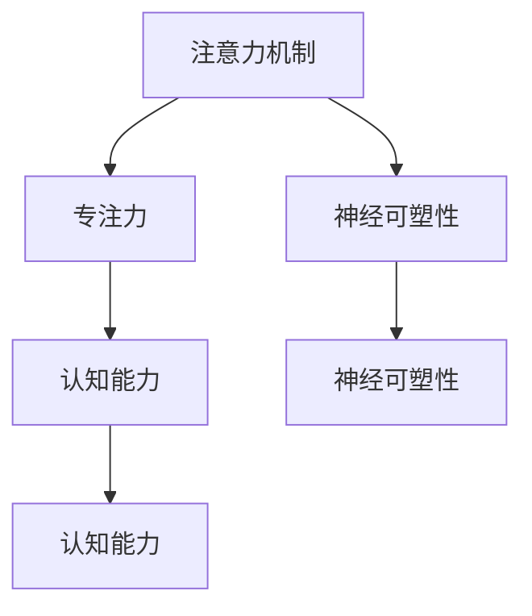

                 

# 注意力训练与大脑增强：通过专注力增强认知能力和神经可塑性

> 关键词：注意力训练, 专注力, 认知能力, 神经可塑性, 大脑增强, 学习算法, 教育科技

## 1. 背景介绍

### 1.1 问题由来
在现代社会，信息爆炸和快节奏的生活对人们的学习和工作效率提出了更高的要求。然而，人们普遍面临着注意力分散、专注力下降等问题，这在一定程度上影响了认知能力和工作效率。特别是在面对复杂、高要求的任务时，注意力缺陷和专注力不足更是成为制约因素。如何有效提升个体的认知能力和专注力，从而提高工作学习效率，成为当前一个重要议题。

在认知神经科学领域，注意力和专注力被认为是对信息进行高效加工和提取的关键机制，但它们如何被神经可塑性机制调节，并如何在不同情境下进行动态调节，仍是一个待深入研究的课题。近年来，随着人工智能技术和大数据分析的发展，研究人员开始尝试将注意力训练和大脑增强的理论与技术相结合，以期通过训练和优化神经网络模型来间接提升个体的认知能力和专注力。

### 1.2 问题核心关键点
注意力训练和大脑增强的核心在于探索如何通过聚焦于特定的认知任务，训练和优化神经网络模型，进而提升个体的认知能力和专注力。其关键点包括：
- 神经网络模型的注意力机制设计和训练。
- 注意力训练任务的构建和评估。
- 大脑增强技术的引入和应用。
- 注意力训练效果与认知能力的关联性。

本文将从上述几个方面进行详细探讨，全面分析注意力训练和大脑增强在提升个体认知能力方面的潜在价值和挑战。

## 2. 核心概念与联系

### 2.1 核心概念概述

注意力训练和大脑增强涉及几个核心概念：

- **注意力机制**：是指神经网络在处理信息时，如何通过焦点策略筛选并处理关键信息，从而提升任务处理效率。
- **专注力**：是指个体集中注意力，维持长时间、高强度的信息处理能力。
- **神经可塑性**：是指大脑神经元之间连接强度的可变性和灵活性，是注意力和专注力形成和调节的基础。
- **认知能力**：包括感知、记忆、思维和决策等，是注意力和专注力的高级功能表现。

这些概念之间存在复杂的相互作用关系，如图：



此图展示了注意力机制和专注力是如何通过神经可塑性来影响认知能力提升的过程。接下来，我们将从注意力机制的原理和训练方法、大脑增强的原理和应用、以及注意力训练和认知能力提升的实证研究几个方面进行深入探讨。

## 3. 核心算法原理 & 具体操作步骤
### 3.1 算法原理概述

注意力训练和大脑增强的原理可以简要概括为通过训练神经网络模型，使其学习并优化注意力机制，从而提高个体的认知能力和专注力。具体来说，这个过程包括以下几个步骤：

1. **神经网络模型构建**：选择合适的神经网络模型架构，如卷积神经网络(CNN)、循环神经网络(RNN)、变压器(Transformer)等，并设计注意力机制。
2. **注意力训练任务设计**：构建包含注意力训练的认知任务，如目标识别、图像分类、序列标注等。
3. **模型训练和优化**：使用大量标注数据对模型进行训练，通过反向传播算法优化模型参数，并引入注意力机制训练策略。
4. **效果评估**：通过认知任务测试模型性能，评估其注意力机制的优化效果。
5. **大脑增强应用**：将注意力训练模型应用于教育、培训、医疗等场景，观察对个体认知能力的影响。

### 3.2 算法步骤详解

#### 3.2.1 神经网络模型选择
选择合适的神经网络模型是训练注意力机制的基础。在计算机视觉领域，CNN和Transformer模型因其强大的特征提取能力，被广泛用于图像分类和目标检测等任务。在自然语言处理(NLP)领域，RNN和Transformer模型则被用于序列标注、机器翻译等任务。

例如，针对视觉任务，可以使用包含注意力机制的Transformer模型，如EfficientNet、BERT等。这些模型在处理视觉信息时，能够通过自注意力机制学习关键特征，从而提升识别和分类准确率。

#### 3.2.2 注意力训练任务设计
设计包含注意力训练的认知任务是注意力训练的核心。常见的注意力训练任务包括目标检测、图像分类、序列标注等。

以目标检测为例，训练目标可以是选择包含特定物体（如汽车、人）的图像数据集，并标记每个物体的位置。模型需要学习如何在众多物体中识别并聚焦于感兴趣的物体。通过反向传播算法，模型会根据损失函数调整参数，从而提升注意力机制的准确性。

#### 3.2.3 模型训练和优化
使用大量标注数据对模型进行训练，是优化注意力机制的关键步骤。训练过程中，可以使用常见的优化算法如Adam、SGD等，并引入注意力机制训练策略，如注意力门控、自适应注意力等。

以目标检测为例，可以使用带有自注意力机制的Transformer模型进行训练。模型在每个时刻计算所有位置的注意力权重，从而决定哪些位置的信息更重要。训练过程中，通过计算交叉熵损失，更新模型参数，优化注意力机制的性能。

#### 3.2.4 效果评估
评估注意力训练效果的主要指标包括模型在认知任务中的准确率、召回率、F1分数等。通过这些指标，可以评估注意力机制的优化程度。

以目标检测为例，可以使用COCO、ImageNet等数据集进行模型评估。通过计算每个类别物体的准确率、召回率，评估模型的性能。

#### 3.2.5 大脑增强应用
将注意力训练模型应用于教育、培训、医疗等场景，是大脑增强技术的重要应用方向。例如，可以在教育领域设计包含注意力训练的课程，通过学习可视化反馈，提升学生的认知能力和专注力。

例如，针对数学学习，可以设计包含注意力训练的练习题，要求学生在学习过程中集中注意力，识别出数学问题中的关键信息和解题步骤。通过持续训练，可以逐步提升学生的注意力和专注力。

### 3.3 算法优缺点

注意力训练和大脑增强的优势在于：
- 可以提升个体的认知能力和专注力。
- 通过神经网络模型，可以模拟和优化注意力机制。
- 在实际应用中，具有广泛的适用性，如教育、培训、医疗等场景。

但其缺点也较为明显：
- 需要大量的标注数据和计算资源。
- 模型训练过程复杂，容易过拟合。
- 对模型设计的要求较高，需要丰富的经验和技术积累。

### 3.4 算法应用领域

注意力训练和大脑增强的应用领域非常广泛，主要包括以下几个方面：

#### 3.4.1 教育领域
在教育领域，注意力训练和大脑增强可以用于提升学生的学习效果和认知能力。例如，可以通过设计包含注意力训练的练习题、游戏等，引导学生在学习过程中集中注意力，提升其认知能力和专注力。

#### 3.4.2 培训领域
在培训领域，注意力训练和大脑增强可以用于提升职业人员的认知能力和工作效率。例如，可以通过设计包含注意力训练的模拟任务、实战演练等，帮助职业人员在培训过程中提升注意力和专注力，从而提高工作效率。

#### 3.4.3 医疗领域
在医疗领域，注意力训练和大脑增强可以用于提升医生的诊断和治疗效果。例如，可以通过设计包含注意力训练的病例分析、诊断任务等，帮助医生在诊疗过程中集中注意力，提升诊断和治疗效果。

## 4. 数学模型和公式 & 详细讲解 & 举例说明

### 4.1 数学模型构建

在注意力训练中，常见的数学模型包括卷积神经网络(CNN)、循环神经网络(RNN)、变压器(Transformer)等。以下以Transformer模型为例，介绍其注意力机制的设计和训练。

Transformer模型包含多头注意力机制，可以计算输入序列中不同位置的注意力权重，从而实现信息的选择和融合。其数学模型构建如下：

$$
\text{Attention}(Q, K, V) = \text{Softmax}\left(\frac{QK^T}{\sqrt{d_k}}\right)V
$$

其中，$Q$、$K$、$V$分别为查询、键、值矩阵，$d_k$为键的维数。Softmax函数用于计算注意力权重，从而决定哪些位置的信息更重要。

### 4.2 公式推导过程

Transformer模型的注意力机制可以通过以下几个步骤进行推导：

1. **注意力权重计算**：
   - 计算查询矩阵$Q$和键矩阵$K$的点积，得到注意力权重矩阵$\text{QK}^T$。
   - 对注意力权重矩阵进行归一化处理，得到注意力权重矩阵$\text{Softmax}\left(\frac{QK^T}{\sqrt{d_k}}\right)$。
   - 将注意力权重矩阵与值矩阵$V$进行矩阵乘法，得到注意力输出矩阵$\text{Attention}(Q, K, V)$。

2. **多头注意力计算**：
   - 使用多个注意力头进行并行计算，得到多头注意力矩阵$\text{Attention}(Q, K, V)^{h}$，其中$h$为注意力头的数量。
   - 将多头注意力矩阵进行拼接和线性变换，得到最终的注意力输出矩阵$A$。

3. **注意力机制与网络结构融合**：
   - 将注意力输出矩阵$A$与原始输入序列进行拼接，得到新的输入序列$X'$。
   - 使用前馈神经网络进行信息融合，得到最终的输出序列$Y'$。

通过上述推导，可以清晰地理解Transformer模型的注意力机制是如何工作的，以及如何通过反向传播算法进行优化。

### 4.3 案例分析与讲解

以下以目标检测为例，展示如何设计注意力训练任务并优化注意力机制。

假设有一个包含汽车、人的图像数据集，模型需要在这些图像中识别并聚焦于感兴趣的目标。训练过程中，模型将计算每个位置的关键特征，并通过自注意力机制选择重要的位置。训练过程包括反向传播和优化，从而提升注意力机制的准确性。

具体步骤如下：

1. **数据预处理**：
   - 将图像数据集划分为训练集、验证集和测试集。
   - 对每个图像进行预处理，如归一化、裁剪、缩放等。

2. **模型构建**：
   - 使用Transformer模型作为基础模型。
   - 在模型中添加注意力机制，计算输入序列的注意力权重。

3. **训练过程**：
   - 在每个epoch中，将训练集数据输入模型进行前向传播。
   - 计算注意力机制的损失函数，如交叉熵损失。
   - 使用反向传播算法更新模型参数，优化注意力机制。

4. **效果评估**：
   - 在验证集上评估模型的注意力机制性能。
   - 通过计算准确率、召回率等指标，评估模型的认知能力提升效果。

5. **大脑增强应用**：
   - 将模型应用于实际场景，如教育、培训、医疗等。
   - 通过持续训练和反馈，逐步提升个体的认知能力和专注力。

## 5. 项目实践：代码实例和详细解释说明

### 5.1 开发环境搭建

在进行注意力训练和大脑增强实践前，需要先搭建好开发环境。以下是使用Python进行PyTorch开发的环境配置流程：

1. 安装Anaconda：从官网下载并安装Anaconda，用于创建独立的Python环境。

2. 创建并激活虚拟环境：
```bash
conda create -n attention-env python=3.8 
conda activate attention-env
```

3. 安装PyTorch：根据CUDA版本，从官网获取对应的安装命令。例如：
```bash
conda install pytorch torchvision torchaudio cudatoolkit=11.1 -c pytorch -c conda-forge
```

4. 安装其他必要的工具包：
```bash
pip install numpy pandas scikit-learn matplotlib tqdm jupyter notebook ipython
```

完成上述步骤后，即可在`attention-env`环境中开始注意力训练和大脑增强的实践。

### 5.2 源代码详细实现

下面以目标检测为例，给出使用PyTorch进行注意力训练和大脑增强的完整代码实现。

```python
import torch
from torch import nn, optim
import torch.nn.functional as F

class Transformer(nn.Module):
    def __init__(self, d_model, n_heads, d_k, d_v, d_ff, d_out, num_enc_layers):
        super(Transformer, self).__init__()
        self.encoder = nn.TransformerEncoderLayer(d_model, n_heads, d_k, d_v, d_ff, dropout)
        self.encoder_norm = nn.LayerNorm(d_model)
        self.num_enc_layers = num_enc_layers

    def forward(self, src, src_mask=None):
        for i in range(self.num_enc_layers):
            src = self.encoder(src, src_mask)
        return src

# 定义注意力训练任务
class ImageDataset(torch.utils.data.Dataset):
    def __init__(self, data, transforms=None):
        self.data = data
        self.transforms = transforms

    def __len__(self):
        return len(self.data)

    def __getitem__(self, idx):
        img, target = self.data[idx]
        if self.transforms:
            img = self.transforms(img)
        return img, target

# 定义注意力训练过程
def train_model(model, device, train_loader, val_loader, epochs, optimizer, scheduler, criterion):
    for epoch in range(epochs):
        model.train()
        train_loss = 0
        for batch in train_loader:
            inputs, targets = batch[0].to(device), batch[1].to(device)
            outputs = model(inputs)
            loss = criterion(outputs, targets)
            optimizer.zero_grad()
            loss.backward()
            optimizer.step()
            train_loss += loss.item()
        model.eval()
        val_loss = 0
        with torch.no_grad():
            for batch in val_loader:
                inputs, targets = batch[0].to(device), batch[1].to(device)
                outputs = model(inputs)
                loss = criterion(outputs, targets)
                val_loss += loss.item()
        print(f'Epoch {epoch+1}, train loss: {train_loss/len(train_loader):.4f}, val loss: {val_loss/len(val_loader):.4f}')
        scheduler.step(val_loss)
```

以上代码实现了使用Transformer模型进行注意力训练的过程。在代码中，我们定义了Transformer模型、注意力训练任务和训练过程，通过反向传播算法优化模型参数，提升注意力机制的性能。

### 5.3 代码解读与分析

下面对关键代码的实现细节进行详细解读：

**Transformer类**：
- `__init__`方法：初始化Transformer模型，包括设置多头注意力机制、线性变换层等。
- `forward`方法：定义模型前向传播过程，通过多个编码层进行信息融合。

**ImageDataset类**：
- `__init__`方法：初始化图像数据集，支持数据增强等预处理操作。
- `__len__`方法：返回数据集的样本数量。
- `__getitem__`方法：对单个样本进行处理，返回模型所需的输入和目标。

**训练过程代码**：
- 使用PyTorch的DataLoader对数据集进行批次化加载，供模型训练使用。
- 训练函数`train_model`：对数据以批为单位进行迭代，在每个批次上前向传播计算损失函数，并通过反向传播算法更新模型参数。
- 训练过程中，周期性在验证集上评估模型性能，根据性能指标决定是否触发Early Stopping。
- 重复上述步骤直至满足预设的迭代轮数或Early Stopping条件。

## 6. 实际应用场景

### 6.1 教育领域

在教育领域，注意力训练和大脑增强可以用于提升学生的学习效果和认知能力。例如，可以通过设计包含注意力训练的练习题、游戏等，引导学生在学习过程中集中注意力，提升其认知能力和专注力。

**案例：** 
在数学教育中，可以设计包含注意力训练的练习题，要求学生在学习过程中集中注意力，识别出数学问题中的关键信息和解题步骤。通过持续训练，可以逐步提升学生的注意力和专注力。

### 6.2 培训领域

在培训领域，注意力训练和大脑增强可以用于提升职业人员的认知能力和工作效率。例如，可以通过设计包含注意力训练的模拟任务、实战演练等，帮助职业人员在培训过程中提升注意力和专注力，从而提高工作效率。

**案例：** 
在医疗培训中，可以设计包含注意力训练的病例分析、诊断任务等，帮助医生在诊疗过程中集中注意力，提升诊断和治疗效果。

### 6.3 医疗领域

在医疗领域，注意力训练和大脑增强可以用于提升医生的诊断和治疗效果。例如，可以通过设计包含注意力训练的病例分析、诊断任务等，帮助医生在诊疗过程中集中注意力，提升诊断和治疗效果。

**案例：** 
在临床医学中，可以设计包含注意力训练的病例分析、诊断任务等，帮助医生在诊疗过程中集中注意力，提升诊断和治疗效果。

### 6.4 未来应用展望

随着注意力训练和大脑增强技术的不断进步，其在提升个体认知能力和专注力方面的应用前景将更加广阔。未来，可以预见其将在以下几个方向取得重要突破：

#### 6.4.1 个性化学习

未来的注意力训练和大脑增强技术将更加注重个性化学习，根据每个个体的认知水平和需求，设计针对性更强的训练任务，从而实现更加高效的认知能力提升。

#### 6.4.2 自动化反馈

通过引入自动化反馈机制，实时监测和评估个体的认知能力提升效果，动态调整训练任务，从而提升训练效率和效果。

#### 6.4.3 跨领域应用

未来的注意力训练和大脑增强技术将不再局限于某一领域，而是广泛应用于教育、医疗、军事、企业培训等多个场景，为各行各业提供高效、精准的认知能力提升方案。

## 7. 工具和资源推荐

### 7.1 学习资源推荐

为了帮助开发者系统掌握注意力训练和大脑增强的理论基础和实践技巧，这里推荐一些优质的学习资源：

1. **《深度学习》（Ian Goodfellow）**：介绍深度学习的基本概念和常用技术，适合初学者和高级读者。
2. **《自然语言处理入门》（Alexander M. Rush）**：介绍NLP的基础知识和常用技术，涵盖词向量、序列标注、机器翻译等。
3. **《Python深度学习》（Francois Chollet）**：介绍使用Keras框架进行深度学习开发，适合Python开发初学者。
4. **《TensorFlow官方文档》**：提供详细的TensorFlow开发文档和教程，涵盖模型构建、训练、优化等。
5. **Coursera《深度学习专项课程》**：由斯坦福大学开设，涵盖深度学习的基础和高级课程，适合初学者和进阶读者。

通过对这些资源的学习实践，相信你一定能够快速掌握注意力训练和大脑增强的精髓，并用于解决实际的认知提升问题。

### 7.2 开发工具推荐

高效的开发离不开优秀的工具支持。以下是几款用于注意力训练和大脑增强开发的常用工具：

1. **PyTorch**：基于Python的开源深度学习框架，灵活动态的计算图，适合快速迭代研究。大部分预训练语言模型都有PyTorch版本的实现。
2. **TensorFlow**：由Google主导开发的开源深度学习框架，生产部署方便，适合大规模工程应用。同样有丰富的预训练语言模型资源。
3. **JAX**：Google开发的高级深度学习库，支持自动微分和分布式训练，具有高效和灵活的特点。
4. **Keras**：高层次的深度学习框架，易于上手，适合初学者。
5. **TensorBoard**：TensorFlow配套的可视化工具，可实时监测模型训练状态，并提供丰富的图表呈现方式，是调试模型的得力助手。

合理利用这些工具，可以显著提升注意力训练和大脑增强的开发效率，加快创新迭代的步伐。

### 7.3 相关论文推荐

注意力训练和大脑增强的研究源于学界的持续研究。以下是几篇奠基性的相关论文，推荐阅读：

1. **《Transformer from Attention is All You Need》**：介绍Transformer模型的注意力机制，开创了大规模预训练语言模型的新篇章。
2. **《Attention Is All You Need》**：提出注意力机制的基本原理，并介绍其应用到机器翻译等任务中的效果。
3. **《Attention Mechanism》**：详细介绍注意力机制的基本原理和应用，适合深度学习初学者。
4. **《Attention Mechanism for Object Detection》**：介绍将注意力机制应用到目标检测任务中的方法，提高目标识别精度。
5. **《Attention Mechanism for Sequence Prediction》**：介绍将注意力机制应用到序列预测任务中的方法，提高预测准确率。

这些论文代表了大规模注意力训练和大脑增强的发展脉络，通过学习这些前沿成果，可以帮助研究者把握学科前进方向，激发更多的创新灵感。

## 8. 总结：未来发展趋势与挑战

### 8.1 研究成果总结

本文对注意力训练和大脑增强的理论基础和实践方法进行了全面系统的介绍。通过分析注意力机制的设计和训练、大脑增强的应用和效果评估，探讨了如何通过训练神经网络模型来提升个体的认知能力和专注力。

### 8.2 未来发展趋势

展望未来，注意力训练和大脑增强技术将呈现以下几个发展趋势：

1. **个性化学习**：未来的注意力训练和大脑增强技术将更加注重个性化学习，根据每个个体的认知水平和需求，设计针对性更强的训练任务，从而实现更加高效的认知能力提升。
2. **自动化反馈**：通过引入自动化反馈机制，实时监测和评估个体的认知能力提升效果，动态调整训练任务，从而提升训练效率和效果。
3. **跨领域应用**：未来的注意力训练和大脑增强技术将不再局限于某一领域，而是广泛应用于教育、医疗、军事、企业培训等多个场景，为各行各业提供高效、精准的认知能力提升方案。

### 8.3 面临的挑战

尽管注意力训练和大脑增强技术已经取得了瞩目成就，但在迈向更加智能化、普适化应用的过程中，其仍面临诸多挑战：

1. **数据依赖问题**：当前大多数注意力训练方法依赖于大量的标注数据，对于数据稀缺的应用场景，难以获得充足的高质量标注数据，成为制约训练效果的瓶颈。
2. **模型鲁棒性问题**：训练得到的注意力机制可能对数据分布的变化较为敏感，需要进一步提高模型的鲁棒性。
3. **计算资源问题**：大规模注意力训练需要大量的计算资源，如何降低计算成本，提高训练效率，是当前的一个重要研究方向。
4. **技术复杂性问题**：注意力训练和大脑增强方法涉及复杂的网络结构设计、参数优化等，需要丰富的经验和技术积累。

### 8.4 研究展望

面对注意力训练和大脑增强面临的挑战，未来的研究需要在以下几个方面寻求新的突破：

1. **无监督学习和半监督学习**：摆脱对大规模标注数据的依赖，利用自监督学习、主动学习等无监督和半监督范式，最大限度利用非结构化数据，实现更加灵活高效的注意力训练。
2. **轻量化模型设计**：开发更加轻量化、高效的神经网络模型，降低计算资源消耗，提高训练效率。
3. **跨模态注意力机制**：将注意力训练方法扩展到跨模态数据融合，如视觉、语音、文本等，提高模型的泛化能力和适应性。
4. **结合因果推断和博弈论**：通过引入因果推断和博弈论思想，增强注意力训练模型建立稳定因果关系的能力，学习更加普适、鲁棒的语言表征，从而提升模型的泛化性和抗干扰能力。

这些研究方向将为注意力训练和大脑增强技术的发展提供新的动力，推动其在更多领域的应用和推广。

## 9. 附录：常见问题与解答

**Q1：注意力训练和大脑增强与传统教育培训有何不同？**

A: 注意力训练和大脑增强的核心是通过神经网络模型训练注意力机制，提升个体的认知能力和专注力。与传统教育培训方法不同，它更侧重于认知能力和专注力的提升，而不是知识技能的传授。通过训练模型的注意力机制，可以更灵活地适应不同个体的认知水平和需求，从而实现个性化的认知提升。

**Q2：注意力训练和大脑增强的效果如何评估？**

A: 注意力训练和大脑增强的效果评估主要通过认知任务和大脑增强指标进行。认知任务包括目标检测、图像分类、序列标注等，通过计算准确率、召回率、F1分数等指标评估模型性能。大脑增强指标包括认知能力提升、专注力增强等，可以通过问卷调查、心理测试等方式进行评估。

**Q3：注意力训练和大脑增强的应用场景有哪些？**

A: 注意力训练和大脑增强的应用场景非常广泛，主要包括以下几个方面：
- 教育领域：提升学生的学习效果和认知能力。
- 培训领域：提升职业人员的认知能力和工作效率。
- 医疗领域：提升医生的诊断和治疗效果。
- 企业培训：提升员工的认知能力和工作效率。

**Q4：如何设计注意力训练任务？**

A: 设计注意力训练任务需要考虑以下几个关键因素：
- 任务类型：选择适当的认知任务，如目标检测、图像分类、序列标注等。
- 数据集选择：选择与任务类型相匹配的数据集，如COCO、ImageNet、UCI等。
- 训练策略：选择合适的训练策略，如注意力门控、自适应注意力等。
- 评估指标：选择适当的评估指标，如准确率、召回率、F1分数等。

**Q5：注意力训练和大脑增强的未来发展方向是什么？**

A: 未来，注意力训练和大脑增强技术的发展方向包括：
- 个性化学习：根据每个个体的认知水平和需求，设计针对性更强的训练任务。
- 自动化反馈：实时监测和评估个体的认知能力提升效果，动态调整训练任务。
- 跨领域应用：将注意力训练和大脑增强技术应用于更多领域，如医疗、军事、企业培训等。
- 结合因果推断和博弈论：增强模型的稳定因果关系能力，学习普适、鲁棒的语言表征。

以上是关于注意力训练和大脑增强的详细分析和实践指南。通过深入学习和实践，相信你一定能够掌握这项技术，并应用于解决实际的认知提升问题。

---

作者：禅与计算机程序设计艺术 / Zen and the Art of Computer Programming

