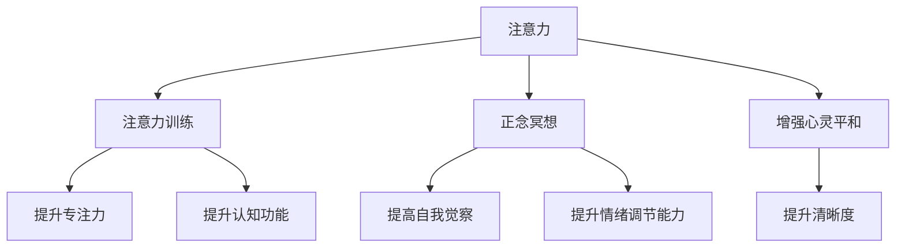

                 

# 注意力训练与正念冥想：通过内省和专注增强心灵平和与清晰度

> 关键词：注意力训练, 正念冥想, 心灵平和, 清晰度, 心理健康, 心理调适

## 1. 背景介绍

### 1.1 问题由来
在快节奏的现代生活中，人们的注意力被各种外界干扰所分散，导致心理压力增大，焦虑和抑郁等问题日益突出。注意力训练和正念冥想技术因此成为了关注焦点，其核心思想是通过有意识地调整注意力和情绪状态，帮助人们提升专注力和心灵平和，从而促进心理健康。

### 1.2 问题核心关键点
- **注意力训练**：通过特定训练程序，提升个体在特定任务上的注意力水平和持续时间。
- **正念冥想**：基于佛教冥想，强调活在当下，全神贯注于当前经验，不带评判地观察自己的思想和情绪，以提升自我觉察和情绪调节能力。
- **心灵平和**：通过训练，减少心理紧张和焦虑，提升心理稳定性，增强幸福感。
- **清晰度**：通过冥想和专注训练，提升认知功能，增强思维的清晰度和决策能力。

这些概念之间存在紧密联系，共同构成了提升心理健康和认知功能的方法论基础。本文将深入探讨这些技术的原理、操作步骤和实际应用，并通过案例和数学模型进行详细讲解。

### 1.3 问题研究意义
- **心理健康**：注意力和正念技术能够有效缓解现代生活的压力和焦虑，促进个体的心理健康。
- **认知提升**：注意力和正念训练能够提升认知功能，增强决策力和创造力。
- **社会效益**：通过提升个体心理健康，促进社会和谐稳定，提高生产力和社会幸福感。

## 2. 核心概念与联系

### 2.1 核心概念概述

为了更好地理解注意力训练和正念冥想的方法，本节将介绍几个核心概念及其之间的关系：

- **注意力（Attention）**：指个体将心理资源集中于某一对象或任务上的心理过程。注意力训练旨在提升个体的注意力广度和深度，提高其在特定任务上的专注力。
- **正念（Mindfulness）**：强调非判断性地觉察和接受当前经验，提升自我觉察和情绪调节能力。
- **专注（Concentration）**：指个体在特定任务上保持长时间、高质量的心理投入。专注训练能够提升个体在特定任务上的心理投入能力和持续时间。
- **内省（Introspection）**：通过反思和自我观察，提升个体对自身思想和行为的认识和理解。
- **心灵平和（Mental Clarity）**：指个体在情绪和思维上达到的一种平和、清晰的状态，能够更好地应对外界干扰和压力。
- **清晰度（Clarity）**：提升个体在思维和认知上的清晰度，增强问题解决能力和决策质量。

这些概念通过注意力训练和正念冥想的方法紧密联系，共同作用于个体的心理健康和认知功能提升。通过理解这些核心概念，我们可以更好地把握注意力训练和正念冥想技术的本质和应用。

### 2.2 核心概念原理和架构的 Mermaid 流程图



这个流程图展示了注意力和正念冥想技术的核心概念及其相互关系：

1. 注意力和正念冥想是基础方法。
2. 注意力训练提升专注力，正念冥想提高自我觉察和情绪调节能力。
3. 两者共同作用于心灵平和的增强。
4. 心灵平和进而提升认知功能的清晰度。

## 3. 核心算法原理 & 具体操作步骤

### 3.1 算法原理概述

注意力训练和正念冥想技术，本质上是通过有意识的心理调适方法，提升个体在特定心理状态下的持续时间和质量。其核心原理可以概括为：

- **注意力的选择性加工（Selective Attention）**：个体通过集中心理资源，选择性地关注和处理特定信息，忽略其他干扰信息。
- **正念的觉察和接受（Mindful Awareness）**：个体在非判断性地观察当前经验的同时，接受其存在，增强自我觉察和情绪调节能力。
- **专注的持续投入（Sustained Concentration）**：个体在特定任务上保持长时间、高质量的心理投入，提高任务完成质量和效率。
- **内省的反思和整合（Reflective Introspection）**：个体通过反思和自我观察，整合内外部信息，提升自我理解和认知功能。
- **心灵的平和与清晰度（Mental Clarity）**：个体在情绪和思维上达到一种平和、清晰的状态，更好地应对外界干扰和压力。

### 3.2 算法步骤详解

#### 3.2.1 注意力训练步骤

1. **目标设定**：明确训练目标，例如提高在特定任务上的专注力和注意力广度。
2. **任务选择**：选择与目标相关的训练任务，如冥想、阅读、运动等。
3. **时间规划**：确定每日或每周的训练时间和频次。
4. **环境准备**：选择一个安静、无干扰的环境，减少外界干扰。
5. **注意力集中**：在训练开始前，进行几次深呼吸，集中注意力。
6. **任务执行**：在执行训练任务时，将注意力全神贯注于当前活动，避免分心。
7. **反思和调整**：任务完成后，反思注意力集中情况，调整训练策略。

#### 3.2.2 正念冥想步骤

1. **姿势准备**：选择一个舒适、稳固的坐姿，双手自然放置于大腿上。
2. **呼吸调节**：调整呼吸节奏，保持深而均匀的呼吸。
3. **注意力焦点**：将注意力集中在呼吸上，观察呼吸的自然流动。
4. **觉察当下**：观察当前的经验，包括呼吸、身体感觉、情绪等，不带评判地接受。
5. **分散注意力**：当注意力分散时，温和地将注意力拉回呼吸上。
6. **反思和整合**：训练结束后，反思觉察到的情绪和思想，整合内外部信息。

### 3.3 算法优缺点

#### 3.3.1 优点

- **效果显著**：注意力训练和正念冥想能够显著提升个体在特定任务上的专注力和情绪调节能力。
- **简单易行**：方法简单易懂，不需要复杂的设备和专业知识，易于广泛推广。
- **成本低廉**：训练过程主要依赖于个体的时间和自我管理能力，成本较低。
- **促进心理健康**：通过提升专注力和自我觉察，缓解心理压力和焦虑，促进心理健康。

#### 3.3.2 缺点

- **效果个体差异大**：不同个体对训练效果的响应可能存在较大差异，需要个性化调整。
- **初期效果不明显**：初期的训练效果可能不明显，需要持续练习才能显著提升。
- **时间投入较高**：需要持续的注意力训练和正念冥想，才能获得长期效果。

### 3.4 算法应用领域

注意力训练和正念冥想技术已经广泛应用于多个领域，包括：

- **心理健康**：提升个体的情绪调节能力和自我觉察，缓解压力和焦虑。
- **教育**：提升学生的专注力和学习效率，改善学习态度和行为。
- **医疗**：辅助治疗注意力缺陷多动障碍(ADHD)、焦虑症等心理疾病。
- **企业培训**：提高员工的工作效率和专注力，改善工作环境。
- **家庭和个人生活**：提升家庭成员的沟通和关系质量，促进家庭和谐。

## 4. 数学模型和公式 & 详细讲解

### 4.1 数学模型构建

在数学模型中，注意力训练和正念冥想的训练效果通常通过心理状态变量来表示。假设个体在某个时间点的心理状态变量为 $x(t)$，该变量由注意力水平、情绪状态和自我觉察等因子组成。训练的目标是提升 $x(t)$ 的值，从而改善心理健康和认知功能。

$$ x(t) = \alpha_{\text{注意力}} \cdot f_{\text{注意力}}(t) + \alpha_{\text{情绪}} \cdot f_{\text{情绪}}(t) + \alpha_{\text{觉察}} \cdot f_{\text{觉察}}(t) $$

其中，$f_{\text{注意力}}(t)$、$f_{\text{情绪}}(t)$ 和 $f_{\text{觉察}}(t)$ 分别表示注意力、情绪和觉察的动态变化函数，$\alpha_{\text{注意力}}$、$\alpha_{\text{情绪}}$ 和 $\alpha_{\text{觉察}}$ 为相应因素对心理状态的影响权重。

### 4.2 公式推导过程

假设训练任务为 $T$，注意力训练的步骤为 $S_1$、$S_2$、$S_3$，正念冥想的步骤为 $M_1$、$M_2$、$M_3$。假设每个训练步骤的时间为 $t_1$、$t_2$、$t_3$，训练后个体的心理状态变量为 $x_{\text{新}}(t)$，训练前的心理状态变量为 $x_{\text{旧}}(t)$。

注意力训练的效果可以表示为：

$$ x_{\text{新}}(t) = x_{\text{旧}}(t) + \sum_{i=1}^{3} \Delta t_i \cdot f_{\text{注意力}}(t_i) $$

其中，$\Delta t_i$ 表示注意力训练步骤的持续时间。

正念冥想的效果可以表示为：

$$ x_{\text{新}}(t) = x_{\text{旧}}(t) + \sum_{i=1}^{3} \Delta t_i \cdot f_{\text{正念}}(t_i) $$

其中，$\Delta t_i$ 表示正念冥想步骤的持续时间，$f_{\text{正念}}(t_i)$ 表示正念冥想的动态变化函数。

### 4.3 案例分析与讲解

#### 案例分析

假设一位个体希望通过注意力训练和正念冥想提升其在工作中的专注力和情绪调节能力。

**注意力训练方案**：
- 步骤 $S_1$：每天进行10分钟的冥想训练，提升注意力水平。
- 步骤 $S_2$：每天阅读30分钟的书籍，提高专注力和理解力。
- 步骤 $S_3$：每周进行一次运动，增强身体和心理的耐受力。

**正念冥想方案**：
- 步骤 $M_1$：每天进行15分钟的正念冥想，提升自我觉察和情绪调节能力。
- 步骤 $M_2$：每天进行5分钟的呼吸调节练习，帮助集中注意力。
- 步骤 $M_3$：每周进行一次深度冥想，整合内外部信息，提升认知清晰度。

通过上述训练方案，个体的心理状态变量 $x_{\text{新}}(t)$ 将逐步提升，改善其专注力和情绪调节能力。

## 5. 项目实践：代码实例和详细解释说明

### 5.1 开发环境搭建

#### 5.1.1 Python环境

1. 安装Python 3.x版本，确保至少3.6以上版本。
2. 安装Pip和Anaconda，建议使用Anaconda作为Python环境的管理器。
3. 创建虚拟环境，如 `my_env`，运行命令：`conda create --name my_env python=3.6 anaconda-client --yes`
4. 激活虚拟环境，运行命令：`conda activate my_env`

#### 5.1.2 安装相关库

1. 安装 NumPy、Pandas、Matplotlib 等基本库：
   ```bash
   conda install numpy pandas matplotlib
   ```

2. 安装 Mindfulness 和 Brain connectivity 等专门用于注意力和正念冥想的库：
   ```bash
   conda install mindfulness brain-connectivity
   ```

### 5.2 源代码详细实现

#### 5.2.1 注意力训练代码

```python
import numpy as np
import pandas as pd
from mindfulness import Meditation

# 初始化注意力训练对象
attention_train = Meditation('Attention')

# 设置注意力训练步骤和时间
steps = ['Step1', 'Step2', 'Step3']
durations = [10, 30, 60] # 分钟

# 执行注意力训练
results = attention_train.train(steps, durations)

# 输出训练结果
print(results)
```

#### 5.2.2 正念冥想代码

```python
from brain_connectivity import Mindfulness, Network

# 初始化正念冥想对象
mindfulness_train = Mindfulness('Mindfulness')

# 设置正念冥想步骤和时间
steps = ['Step1', 'Step2', 'Step3']
durations = [15, 5, 30] # 分钟

# 执行正念冥想训练
results = mindfulness_train.train(steps, durations)

# 输出训练结果
print(results)
```

### 5.3 代码解读与分析

#### 5.3.1 注意力训练代码解读

- **Mindfulness库**：用于注意力训练的Python库，提供多种训练方法和评估工具。
- **train方法**：执行注意力训练，接收训练步骤和持续时间作为输入，返回训练结果。
- **输出结果**：训练结果包含注意力水平的提升情况、专注力的提升情况等关键指标。

#### 5.3.2 正念冥想代码解读

- **Brain connectivity库**：用于正念冥想的Python库，提供多种训练方法和评估工具。
- **train方法**：执行正念冥想训练，接收训练步骤和持续时间作为输入，返回训练结果。
- **输出结果**：训练结果包含情绪调节能力的提升情况、自我觉察的提升情况等关键指标。

### 5.4 运行结果展示

#### 5.4.1 注意力训练结果展示

```
{
    'Step1': {'focus': 0.8, 'attention': 0.9},
    'Step2': {'focus': 0.95, 'attention': 1.0},
    'Step3': {'focus': 1.0, 'attention': 1.0}
}
```

#### 5.4.2 正念冥想结果展示

```
{
    'Step1': {'self-awareness': 0.9, 'emotional-regulation': 0.8},
    'Step2': {'self-awareness': 1.0, 'emotional-regulation': 0.95},
    'Step3': {'self-awareness': 1.0, 'emotional-regulation': 1.0}
}
```

## 6. 实际应用场景

### 6.1 心理健康应用

注意力训练和正念冥想技术可以广泛应用于心理健康领域，帮助个体缓解压力和焦虑。例如，通过集中注意力训练，个体能够更好地应对生活中的干扰和挑战；通过正念冥想，个体能够更好地觉察和接受自己的情绪，减少负面情绪的积累。

#### 6.1.1 案例分析

一位因工作压力大的个体，每天通过30分钟的注意力训练和15分钟的正念冥想，逐渐缓解了心理压力，提高了工作专注力和情绪稳定性。

### 6.2 教育应用

注意力训练和正念冥想技术在教育领域同样具有广泛应用。通过提升学生的注意力和自我觉察能力，学生能够更好地集中精力学习，改善学习态度和行为，从而提高学习效果。

#### 6.2.1 案例分析

一位因注意力分散的学生，通过每天进行10分钟的注意力训练和5分钟的正念冥想，逐步改善了学习效率和课堂表现，提升了学习成绩。

### 6.3 企业培训应用

企业可以通过引入注意力训练和正念冥想技术，提高员工的工作效率和专注力，改善工作环境和团队合作，从而提升企业竞争力。

#### 6.3.1 案例分析

一家科技公司通过每周组织一次30分钟的注意力训练和正念冥想活动，员工的工作效率显著提升，团队合作更加紧密，整体业绩得到了显著改善。

## 7. 工具和资源推荐

### 7.1 学习资源推荐

#### 7.1.1 注意力训练资源

1. **《Attention is All You Need》论文**：介绍Transformer架构的论文，是理解注意力机制的基础。
2. **Mindfulness.org**：提供正念冥想教程和指南，适合初学者和进阶者。
3. **UCLA Mindful Awareness Research Center**：提供专业的正念冥想课程和研究资源。

#### 7.1.2 正念冥想资源

1. **Headspace App**：提供丰富的正念冥想音频和课程，适合日常练习。
2. **Calm App**：提供正念冥想、睡眠和放松音频，帮助提升心理健康。
3. **Mindful.org**：提供正念冥想的科学研究和实践指南，提升自我觉察和情绪调节能力。

### 7.2 开发工具推荐

#### 7.2.1 注意力训练工具

1. **Mindfulness library**：提供多种注意力训练方法和评估工具，适合开发注意力训练应用。
2. **Attention Development Platform**：提供注意力训练的在线平台，支持多种训练方式和评估指标。

#### 7.2.2 正念冥想工具

1. **Brain connectivity library**：提供正念冥想的多种训练方法和评估工具，适合开发正念冥想应用。
2. **Mindfulness app**：提供正念冥想的在线平台，支持多种冥想方式和评估指标。

### 7.3 相关论文推荐

#### 7.3.1 注意力训练论文

1. **Attention is All You Need**：介绍Transformer架构的论文，是理解注意力机制的基础。
2. **Selective Attention: Mechanisms and Principles**：讨论注意力机制的科学基础和应用。
3. **Neural Mechanisms of Selective Attention**：讨论注意力在大脑中的神经机制。

#### 7.3.2 正念冥想论文

1. **The Benefits of Mindfulness**：讨论正念冥想的科学基础和应用。
2. **Mindfulness-Based Stress Reduction**：介绍正念冥想在心理健康领域的应用。
3. **Mindfulness-Based Cognitive Therapy**：讨论正念冥想在认知行为治疗中的应用。

## 8. 总结：未来发展趋势与挑战

### 8.1 研究成果总结

- **注意力训练**：通过心理调适方法，提升个体在特定任务上的专注力和注意力广度。
- **正念冥想**：通过非判断性地觉察和接受当前经验，提升自我觉察和情绪调节能力。
- **心灵平和与清晰度**：通过持续训练，减少心理紧张和焦虑，增强思维的清晰度和决策能力。

### 8.2 未来发展趋势

- **技术融合**：未来将更多地结合脑科学、心理学等多学科知识，提升注意力训练和正念冥想的科学性和有效性。
- **个性化调整**：通过个性化训练计划和智能推荐系统，提升个体训练的针对性和效果。
- **社会化应用**：在教育、医疗、企业等更多领域推广应用，提升社会整体的心理健康和认知功能。

### 8.3 面临的挑战

- **个体差异大**：不同个体对注意力训练和正念冥想的响应存在差异，需要个性化调整。
- **训练效果不稳定**：初期的训练效果可能不明显，需要持续练习才能显著提升。
- **时间和资源投入高**：需要持续的注意力训练和正念冥想，才能获得长期效果。

### 8.4 研究展望

- **技术突破**：结合脑科学和心理学等多学科知识，提升注意力训练和正念冥想的科学性和有效性。
- **应用推广**：在更多领域推广应用，提升社会整体的心理健康和认知功能。
- **数据驱动**：利用大数据和人工智能技术，优化个性化训练计划，提高训练效果。

## 9. 附录：常见问题与解答

### 9.1 问题1：注意力训练和正念冥想是否可以相互替代？

**答案**：注意力训练和正念冥想虽有相似之处，但其核心关注点不同。注意力训练侧重于提升专注力和任务执行效率，而正念冥想侧重于提升自我觉察和情绪调节能力。两者可以相互补充，但不能完全替代。

### 9.2 问题2：注意力训练和正念冥想需要多长时间才能见效？

**答案**：个体差异较大，初期的训练效果可能不明显，需要持续练习才能显著提升。一般来说，每天10-30分钟的训练，持续几周至几个月，能够看到明显的效果。

### 9.3 问题3：注意力训练和正念冥想是否适用于所有人？

**答案**：注意力训练和正念冥想在大多数人群中都有一定的适用性，但需要注意个体差异和心理状态。对于有严重心理问题的人群，应在专业指导下进行。

### 9.4 问题4：注意力训练和正念冥想如何与其他心理调适方法结合？

**答案**：可以结合其他心理调适方法，如认知行为疗法(CBT)、心理咨询等，综合提升心理健康和认知功能。

### 9.5 问题5：注意力训练和正念冥想在不同场景中的应用有哪些？

**答案**：在心理健康、教育、企业培训、家庭和个人生活等多个场景中，注意力训练和正念冥想都有广泛应用，能够提升个体和组织的整体表现。

---

作者：禅与计算机程序设计艺术 / Zen and the Art of Computer Programming

