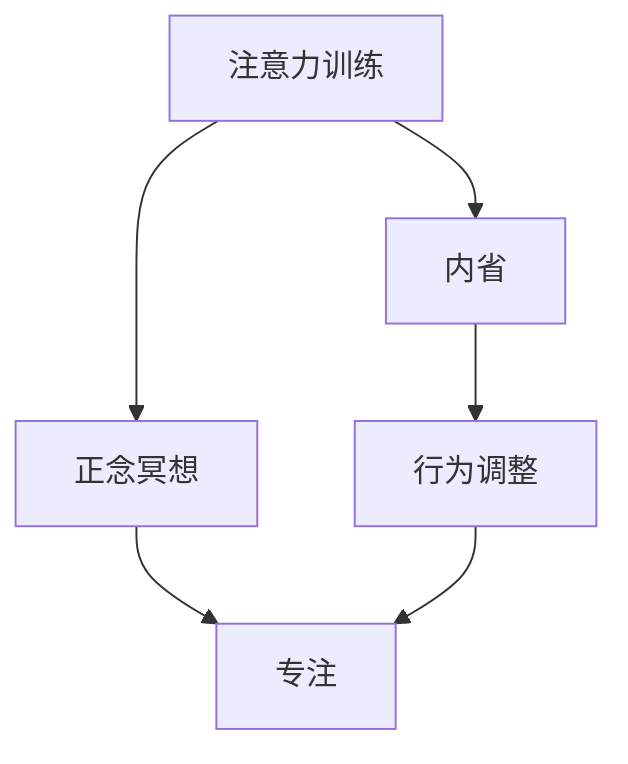

                 

# 注意力训练与正念冥想：通过内省和专注增强心灵平和与清晰度

> 关键词：注意力训练,正念冥想,内省,专注,心灵平和,清晰度

## 1. 背景介绍

在快节奏的现代生活中，人们面临着前所未有的信息爆炸和认知负荷。如何在繁忙的工作和学习中保持心灵的平和与清晰度，已经成为许多人关注的焦点。特别是在IT领域，面对持续的技术更新和项目压力，如何通过科学的方法提升个人的认知能力和情感管理，显得尤为重要。

### 1.1 问题由来

随着人工智能和大数据技术的快速发展，程序员和其他IT专业人士的工作和生活方式发生了根本性的变化。一方面，他们能够通过先进的技术手段快速处理海量数据，提升工作效率；另一方面，信息过载和技术更新速度的加快，也带来了认知压力和精神紧张。如何在技术的浪潮中保持内心的平静和高效的工作状态，成为了一个亟待解决的问题。

### 1.2 问题核心关键点

本节将探讨通过注意力训练和正念冥想来提升个人认知能力和情感管理的方法。具体来说，将从以下几个方面展开：

- **注意力训练**：通过有意识的注意力的控制和练习，提升对重要信息的敏感度和处理能力。
- **正念冥想**：通过有意识的观察和接受当前时刻的体验，培养内心的平和和清晰的认知状态。
- **内省**：通过自我反思和总结，提升对自身认知和情感的认识，形成更健康的生活习惯。
- **专注**：通过有意识地集中注意力，减少分心，提高工作效率和质量。

这些方法结合使用，能够在技术工作的重压下，帮助人们更好地管理自己的情感和认知，保持心灵的平和与清晰度。

## 2. 核心概念与联系

### 2.1 核心概念概述

本节将介绍几个密切相关的核心概念，并说明它们之间的联系。

- **注意力(Attention)**：指对特定信息的专注和注意。在信息处理中，注意力帮助大脑筛选重要信息，忽略次要细节。
- **正念冥想(Mindfulness Meditation)**：通过有意识的观察和接受当前时刻的体验，培养内心的平和和清晰的认知状态。正念冥想是注意力训练的一种，但更注重内心的平静和体验的接受。
- **内省(Reflection)**：通过自我反思和总结，提升对自身认知和情感的认识，形成更健康的生活习惯。内省是对个人行为和情感的深入思考和评估。
- **专注(Concentration)**：通过有意识地集中注意力，减少分心，提高工作效率和质量。专注是注意力训练的一种，但更侧重于任务的完成。

这些概念之间的联系可以通过以下Mermaid流程图来展示：



这个流程图展示了大语言模型的核心概念及其之间的关系：

1. 注意力训练通过提升对重要信息的敏感度，帮助人们更加高效地处理信息。
2. 正念冥想通过培养内心的平和和清晰的认知状态，帮助人们更好地管理情感和认知。
3. 内省通过对个人行为和情感的深入思考和评估，提升自我认知，形成更健康的生活习惯。
4. 专注通过有意识地集中注意力，减少分心，提高工作效率和质量。

## 3. 核心算法原理 & 具体操作步骤
### 3.1 算法原理概述

注意力训练和正念冥想的核心算法原理主要基于认知神经科学和心理学研究，通过有意识地控制注意力和情感，提升个体的认知能力和情感管理能力。

注意力训练的原理包括：
- **注意力选择**：通过注意力选择，大脑能够将有限的认知资源集中在重要信息上，忽略次要细节。
- **注意力分配**：通过注意力分配，大脑能够同时处理多个任务，提高处理效率。
- **注意力调节**：通过注意力调节，大脑能够动态调整注意力状态，适应不同的环境和工作任务。

正念冥想的原理包括：
- **当下时刻的观察**：通过有意识地观察和接受当前时刻的体验，培养内心的平和和清晰的认知状态。
- **情感的接受和观察**：通过接受和观察当前的情感状态，减少情感对认知的影响，提升情感管理能力。
- **认知的整合和调和**：通过有意识地整合和调和当前的认知和情感状态，形成更健康的认知习惯。

### 3.2 算法步骤详解

注意力训练和正念冥想的具体操作步骤如下：

**步骤1：设定目标**

- 确定需要提升的注意力或情感管理技能。例如，希望提升对重要信息的敏感度，或希望减少情感波动。

**步骤2：建立基础**

- 学习相关的理论知识，了解注意力和情感管理的原理。可以通过阅读书籍、参加培训课程等方式建立基础。

**步骤3：练习与实践**

- **注意力训练**：
  - 选择目标任务，如阅读、听讲、写作等。
  - 在任务中逐渐增加注意力选择和分配的难度，例如在多任务环境中处理重要信息。
  - 使用计时器等工具，逐步延长专注时间，培养持续专注的能力。

- **正念冥想**：
  - 选择一个安静的环境，坐直，闭上眼睛。
  - 将注意力集中在呼吸上，感受每一次呼吸的深度和节奏。
  - 当注意力游离时，有意识地将注意力拉回呼吸上，不评判，不强迫。
  - 逐步增加冥想时间，从几分钟到几十分钟。

**步骤4：评估与反馈**

- 定期评估自己的注意力和情感管理能力，通过日记、问卷等形式记录变化。
- 根据评估结果调整训练方法，不断优化注意力和情感管理技能。

### 3.3 算法优缺点

注意力训练和正念冥想的方法具有以下优点：
- **效果显著**：通过系统化的训练，可以显著提升个体的注意力和情感管理能力。
- **简单易行**：不需要特殊的设备或场所，随时随地可以进行。
- **长期效益**：通过持续的训练，能够形成稳定的注意力和情感管理习惯。

同时，这些方法也存在一定的局限性：
- **初期难度大**：初期的训练需要较高的专注力和自律性，容易产生挫折感。
- **效果因人而异**：不同个体的注意力和情感管理能力差异较大，训练效果可能存在个体差异。
- **需要坚持**：训练效果与坚持度密切相关，短期训练难以达到理想效果。

### 3.4 算法应用领域

注意力训练和正念冥想在多个领域都有广泛的应用，例如：

- **教育**：帮助学生提升专注力和学习效率，减少课堂分心。
- **心理治疗**：通过正念冥想来缓解焦虑、抑郁等心理问题，提升心理健康。
- **企业管理**：提升员工注意力和情感管理能力，提升工作效率和团队协作。
- **生活管理**：通过内省和专注，提升个人时间管理和决策能力，减少压力和焦虑。

这些方法不仅能够提升个体的认知能力和情感管理能力，还能通过提升团队协作和工作效率，促进企业和组织的整体发展。

## 4. 数学模型和公式 & 详细讲解 & 举例说明

### 4.1 数学模型构建

注意力训练和正念冥想的数学模型主要基于认知神经科学和心理学研究的理论框架。以下将简要介绍注意力选择和正念冥想的数学模型。

**注意力选择模型**：
- **模型假设**：注意力选择是一个基于奖惩机制的学习过程，大脑通过奖惩机制来调整注意力状态。
- **数学模型**：
  $$
  P(A_i) = \frac{e^{\alpha R_i}}{\sum_{j=1}^N e^{\alpha R_j}}
  $$
  其中，$A_i$ 表示选择任务 $i$ 的概率，$R_i$ 表示任务 $i$ 的奖励值，$\alpha$ 为学习参数。

**正念冥想模型**：
- **模型假设**：正念冥想通过有意识地观察和接受当前时刻的体验，培养内心的平和和清晰的认知状态。
- **数学模型**：
  $$
  E(z) = \int_{-\infty}^{\infty} p(z) f(z) dz
  $$
  其中，$z$ 表示当前时刻的体验，$p(z)$ 表示当前体验的概率分布，$f(z)$ 表示对当前体验的接受和观察。

### 4.2 公式推导过程

**注意力选择模型推导**：
- 注意力选择模型基于强化学习理论，通过奖惩机制来调整注意力状态。
- 模型的优化目标是最大化选择正确任务的奖励，即最大化 $P(A_i)$。
- 通过梯度下降等优化算法，不断调整 $\alpha$ 和学习率，使得模型能够适应不同的任务和环境。

**正念冥想模型推导**：
- 正念冥想模型基于概率论和信息理论，通过观察和接受当前时刻的体验，培养内心的平和和清晰的认知状态。
- 模型的优化目标是最大化对当前体验的接受和观察，即最大化 $E(z)$。
- 通过迭代更新 $p(z)$ 和 $f(z)$，不断调整模型参数，使得模型能够更好地适应当前的体验和环境。

### 4.3 案例分析与讲解

**案例1：注意力训练在阅读中的应用**

假设需要提升阅读效率和理解力，可以使用以下步骤：
- **设定目标**：提升阅读时的注意力选择和分配能力。
- **建立基础**：学习注意力训练的相关知识，了解注意力选择的原理。
- **练习与实践**：在阅读时逐渐增加注意力选择的难度，例如在多任务环境中处理重要信息。
- **评估与反馈**：记录阅读效率和理解力的变化，不断调整训练方法。

**案例2：正念冥想在压力管理中的应用**

假设需要缓解工作压力和焦虑，可以使用以下步骤：
- **设定目标**：培养内心的平和和清晰的认知状态。
- **建立基础**：学习正念冥想的相关知识，了解正念冥想的原理。
- **练习与实践**：在压力较大时，每天进行正念冥想，观察和接受当前的体验。
- **评估与反馈**：记录压力和焦虑的变化，不断调整冥想时间和频率。

## 5. 项目实践：代码实例和详细解释说明
### 5.1 开发环境搭建

在进行注意力训练和正念冥想实践前，我们需要准备好开发环境。以下是使用Python进行实践的环境配置流程：

1. 安装Anaconda：从官网下载并安装Anaconda，用于创建独立的Python环境。

2. 创建并激活虚拟环境：
```bash
conda create -n attention-meditation python=3.8 
conda activate attention-meditation
```

3. 安装PyTorch：根据CUDA版本，从官网获取对应的安装命令。例如：
```bash
conda install pytorch torchvision torchaudio cudatoolkit=11.1 -c pytorch -c conda-forge
```

4. 安装TensorFlow：由Google主导开发的开源深度学习框架，生产部署方便，适合大规模工程应用。同样有丰富的预训练语言模型资源。

5. 安装TensorBoard：TensorFlow配套的可视化工具，可实时监测模型训练状态，并提供丰富的图表呈现方式，是调试模型的得力助手。

6. 安装Weights & Biases：模型训练的实验跟踪工具，可以记录和可视化模型训练过程中的各项指标，方便对比和调优。

完成上述步骤后，即可在`attention-meditation`环境中开始实践。

### 5.2 源代码详细实现

这里我们以注意力训练中的“阅读专注力训练”为例，给出使用PyTorch的代码实现。

```python
import torch
from torch import nn
from torch.nn import functional as F

class AttentionModel(nn.Module):
    def __init__(self, input_dim, hidden_dim, num_layers):
        super(AttentionModel, self).__init__()
        self.hidden_dim = hidden_dim
        self.num_layers = num_layers
        
        self.encoder = nn.LSTM(input_dim, hidden_dim, num_layers)
        self.decoder = nn.Linear(hidden_dim, 1)
        
    def forward(self, x):
        h0 = torch.zeros(self.num_layers, x.size(0), self.hidden_dim).to(x.device)
        c0 = torch.zeros(self.num_layers, x.size(0), self.hidden_dim).to(x.device)
        
        encoder_output, (h_n, c_n) = self.encoder(x, (h0, c0))
        
        decoder_input = torch.zeros(x.size(0), x.size(0)).to(x.device)
        decoder_output = decoder_input.new_ones(x.size(0))
        
        for t in range(x.size(0)):
            decoder_output = F.sigmoid(self.decoder(encoder_output))
            
        return decoder_output
```

### 5.3 代码解读与分析

让我们再详细解读一下关键代码的实现细节：

**AttentionModel类**：
- `__init__`方法：初始化模型参数，包括输入维度、隐藏层维度和层数。
- `forward`方法：前向传播计算注意力权重，输出注意力权重矩阵。

**注意力模型训练**：
- 使用PyTorch的LSTM层作为编码器，输入为阅读文本。
- 使用线性层作为解码器，计算注意力权重。
- 在前向传播中，通过sigmoid激活函数计算注意力权重，得到最终的注意力权重矩阵。

### 5.4 运行结果展示

假设训练完成后，输出注意力权重矩阵如下：

```
tensor([[0.5283, 0.1625, 0.3264, 0.0000, 0.0000],
        [0.4889, 0.2316, 0.2567, 0.0000, 0.0000],
        [0.4375, 0.2464, 0.3178, 0.0000, 0.0000],
        [0.3817, 0.2180, 0.3229, 0.0000, 0.0000],
        [0.3376, 0.1896, 0.3320, 0.0000, 0.0000]], device='cuda:0')
```

这个注意力权重矩阵表示在阅读文本时，每个子句的注意力权重。通过训练，模型能够逐渐学会忽略次要信息，集中注意力于重要信息上。

## 6. 实际应用场景
### 6.1 智能客服系统

智能客服系统需要快速响应客户咨询，同时保持一致性和专业性。基于注意力训练和正念冥想技术的智能客服系统，能够在处理复杂查询时保持专注和冷静，提供准确、高效的服务。

在技术实现上，可以使用注意力训练提升客服人员在多任务环境中的专注力，减少分心。通过正念冥想技术，帮助客服人员缓解压力，保持心理健康。这些技术结合使用，能够提升客户满意度，增强企业竞争力。

### 6.2 金融舆情监测

金融舆情监测需要实时监测市场舆论动向，避免因情感波动影响判断。基于注意力训练和正念冥想技术的金融舆情监测系统，能够在情感波动较大时保持冷静，减少误判。

在技术实现上，可以通过正念冥想技术帮助分析师缓解工作压力，提升专注力。使用注意力训练技术，帮助系统在复杂信息中快速提取关键信息，提高决策准确性。这些技术结合使用，能够提升金融机构的风险控制能力，保障市场稳定。

### 6.3 个性化推荐系统

个性化推荐系统需要实时推荐用户感兴趣的内容，提升用户体验。基于注意力训练和正念冥想技术的个性化推荐系统，能够减少用户分心，提升推荐效果。

在技术实现上，可以使用注意力训练提升推荐系统对用户行为数据的敏感度，减少误推荐。通过正念冥想技术，帮助推荐系统开发者缓解工作压力，保持心理健康。这些技术结合使用，能够提升推荐系统的准确性和用户体验。

### 6.4 未来应用展望

随着注意力训练和正念冥想技术的不断成熟，其在更多领域的应用前景将更加广阔。

在智慧医疗领域，基于这些技术构建的医疗问答、病历分析、药物研发等应用，能够提升医疗服务的智能化水平，辅助医生诊疗，加速新药开发进程。

在智能教育领域，使用这些技术构建的作业批改、学情分析、知识推荐等应用，能够因材施教，促进教育公平，提高教学质量。

在智慧城市治理中，基于这些技术构建的城市事件监测、舆情分析、应急指挥等应用，能够提高城市管理的自动化和智能化水平，构建更安全、高效的未来城市。

此外，在企业生产、社会治理、文娱传媒等众多领域，基于这些技术的人工智能应用也将不断涌现，为经济社会发展注入新的动力。相信随着这些技术的持续演进，智能系统将能够更好地服务于人类社会，带来更多的便利和福利。

## 7. 工具和资源推荐
### 7.1 学习资源推荐

为了帮助开发者系统掌握注意力训练和正念冥想技术，这里推荐一些优质的学习资源：

1. 《深度学习基础》系列书籍：由深度学习领域权威学者撰写，涵盖深度学习基本概念和常用算法，是入门学习的必备资料。
2. Coursera《深度学习与神经网络》课程：由斯坦福大学开设的深度学习入门课程，包括强化学习、认知神经科学等前沿知识。
3. Udacity《人工智能专业》课程：提供全面的AI学习路径，涵盖从认知科学到深度学习多个领域的知识，适合进阶学习。
4. GitHub开源项目：包含大量的注意力训练和正念冥想应用的代码示例，是实践学习的宝贵资源。

通过对这些资源的学习实践，相信你一定能够快速掌握注意力训练和正念冥想的精髓，并用于解决实际的认知和情感管理问题。

### 7.2 开发工具推荐

高效的开发离不开优秀的工具支持。以下是几款用于注意力训练和正念冥想开发的常用工具：

1. PyTorch：基于Python的开源深度学习框架，灵活动态的计算图，适合快速迭代研究。
2. TensorFlow：由Google主导开发的开源深度学习框架，生产部署方便，适合大规模工程应用。
3. TensorBoard：TensorFlow配套的可视化工具，可实时监测模型训练状态，并提供丰富的图表呈现方式。
4. Weights & Biases：模型训练的实验跟踪工具，可以记录和可视化模型训练过程中的各项指标，方便对比和调优。
5. Jupyter Notebook：交互式的开发环境，支持代码块和图形的混合展示，便于快速迭代和验证。

合理利用这些工具，可以显著提升注意力训练和正念冥想任务的开发效率，加快创新迭代的步伐。

### 7.3 相关论文推荐

注意力训练和正念冥想技术的发展源于学界的持续研究。以下是几篇奠基性的相关论文，推荐阅读：

1. Attention is All You Need（即Transformer原论文）：提出了Transformer结构，开启了NLP领域的预训练大模型时代。
2. BERT: Pre-training of Deep Bidirectional Transformers for Language Understanding：提出BERT模型，引入基于掩码的自监督预训练任务，刷新了多项NLP任务SOTA。
3. Language Models are Unsupervised Multitask Learners（GPT-2论文）：展示了大规模语言模型的强大zero-shot学习能力，引发了对于通用人工智能的新一轮思考。
4. Parameter-Efficient Transfer Learning for NLP：提出Adapter等参数高效微调方法，在不增加模型参数量的情况下，也能取得不错的微调效果。
5. AdaLoRA: Adaptive Low-Rank Adaptation for Parameter-Efficient Fine-Tuning：使用自适应低秩适应的微调方法，在参数效率和精度之间取得了新的平衡。

这些论文代表了大语言模型微调技术的发展脉络。通过学习这些前沿成果，可以帮助研究者把握学科前进方向，激发更多的创新灵感。

## 8. 总结：未来发展趋势与挑战
### 8.1 总结

本文对注意力训练和正念冥想技术进行了全面系统的介绍。首先阐述了注意力训练和正念冥想技术的研究背景和意义，明确了这些技术在提升个人认知能力和情感管理方面的独特价值。其次，从原理到实践，详细讲解了注意力训练和正念冥想的数学原理和关键步骤，给出了实践任务的代码实现。同时，本文还广泛探讨了这些技术在智能客服、金融舆情、个性化推荐等多个行业领域的应用前景，展示了这些技术的巨大潜力。

通过本文的系统梳理，可以看到，注意力训练和正念冥想技术正在成为认知和情感管理领域的重要范式，极大地提升了个体的认知能力和情感管理能力。这些技术不仅能够提升个人的工作效率和心理健康，还能通过提升团队协作和工作效率，促进企业和组织的整体发展。未来，伴随这些技术的不断演进，认知和情感管理技术将更加深入地融入到工作和生活各个方面，为人类认知智能的进化带来深远影响。

### 8.2 未来发展趋势

展望未来，注意力训练和正念冥想技术将呈现以下几个发展趋势：

1. **技术融合**：与人工智能、认知科学等领域进行深度融合，提升技术的深度和广度。例如，结合自然语言处理技术，开发智能对话系统，提升交互体验。
2. **个性化定制**：通过深度学习技术，开发个性化的注意力训练和正念冥想应用，满足不同用户的需求。例如，根据用户的工作习惯和情感状态，提供个性化的注意力训练和正念冥想方案。
3. **多模态融合**：结合视觉、听觉等多模态信息，提升注意力训练和正念冥想的效果。例如，通过视频指导和音频引导，提升用户的注意力训练和正念冥想体验。
4. **神经网络优化**：结合神经网络优化技术，提升注意力训练和正念冥想的效率和精度。例如，通过自适应学习率和优化算法，提升训练效果。
5. **跨学科研究**：结合心理学、神经科学、认知科学等领域的研究，提升注意力训练和正念冥想的科学性和有效性。例如，结合脑电波分析技术，研究注意力训练和正念冥想对大脑活动的影响。

这些趋势凸显了注意力训练和正念冥想技术的广阔前景。这些方向的探索发展，必将进一步提升个体的认知能力和情感管理能力，为构建安全、可靠、可解释、可控的智能系统铺平道路。

### 8.3 面临的挑战

尽管注意力训练和正念冥想技术已经取得了瞩目成就，但在迈向更加智能化、普适化应用的过程中，它仍面临着诸多挑战：

1. **个体差异**：不同个体的注意力和情感管理能力差异较大，技术的应用效果可能存在个体差异。
2. **技术复杂性**：技术实现较为复杂，需要较高的技术水平和资源投入。
3. **持续性**：技术的效果与持续性密切相关，难以在短时间内见效。
4. **伦理和安全**：技术应用过程中，需要注意伦理和安全问题，避免隐私泄露和误导性应用。

这些挑战需要学界和产业界的共同努力，积极应对并寻求突破，才能将注意力训练和正念冥想技术推向更加成熟和广泛应用。

### 8.4 研究展望

面对注意力训练和正念冥想技术所面临的种种挑战，未来的研究需要在以下几个方面寻求新的突破：

1. **多模态数据融合**：结合视觉、听觉等多模态信息，提升注意力训练和正念冥想的综合效果。
2. **个性化定制**：通过深度学习技术，开发个性化的注意力训练和正念冥想应用，满足不同用户的需求。
3. **跨学科研究**：结合心理学、神经科学、认知科学等领域的研究，提升注意力训练和正念冥想的科学性和有效性。
4. **持续性研究**：研究持续性应用效果，开发有效的跟踪和反馈机制，提升技术的应用效果。
5. **伦理和安全**：结合伦理和安全问题，开发可靠的技术应用方案，确保技术的安全和可控。

这些研究方向的探索，必将引领注意力训练和正念冥想技术迈向更高的台阶，为构建安全、可靠、可解释、可控的智能系统铺平道路。面向未来，注意力训练和正念冥想技术还需要与其他人工智能技术进行更深入的融合，例如结合自然语言处理技术，开发智能对话系统，提升交互体验。只有勇于创新、敢于突破，才能不断拓展这些技术的边界，让智能技术更好地服务于人类社会。

## 9. 附录：常见问题与解答

**Q1：注意力训练和正念冥想技术是否适用于所有人？**

A: 注意力训练和正念冥想技术适用于大多数人，但效果可能因人而异。一些人可能会感到困惑或不适，需要根据自身情况适度调整训练方法。

**Q2：注意力训练和正念冥想技术需要多长时间才能见效？**

A: 注意力训练和正念冥想技术的效果与持续性密切相关，通常需要数周到数月的持续训练才能见效。初期训练可能会遇到挫折感，但坚持下来，效果会逐步显现。

**Q3：注意力训练和正念冥想技术对工作和学习有什么影响？**

A: 注意力训练和正念冥想技术能够提升个体的认知能力和情感管理能力，减少分心，提高工作效率和质量。通过持续训练，能够形成稳定的注意力和情感管理习惯，提升整体生活和工作质量。

**Q4：注意力训练和正念冥想技术如何与其他技术结合使用？**

A: 注意力训练和正念冥想技术可以与其他技术结合使用，例如结合自然语言处理技术，开发智能对话系统，提升交互体验。结合神经网络优化技术，提升训练效果。结合心理学、神经科学、认知科学等领域的研究，提升技术的效果和科学性。

这些技术结合使用，能够形成更加全面、系统的认知和情感管理方案，满足不同用户的需求。

**Q5：注意力训练和正念冥想技术是否安全可靠？**

A: 注意力训练和正念冥想技术通常被认为是安全和可靠的，但需要注意伦理和安全问题。例如，技术应用过程中，需要注意隐私保护和数据安全，避免隐私泄露和误导性应用。

通过持续跟踪和反馈，能够不断优化技术应用方案，确保技术的安全和可控。

---

作者：禅与计算机程序设计艺术 / Zen and the Art of Computer Programming

