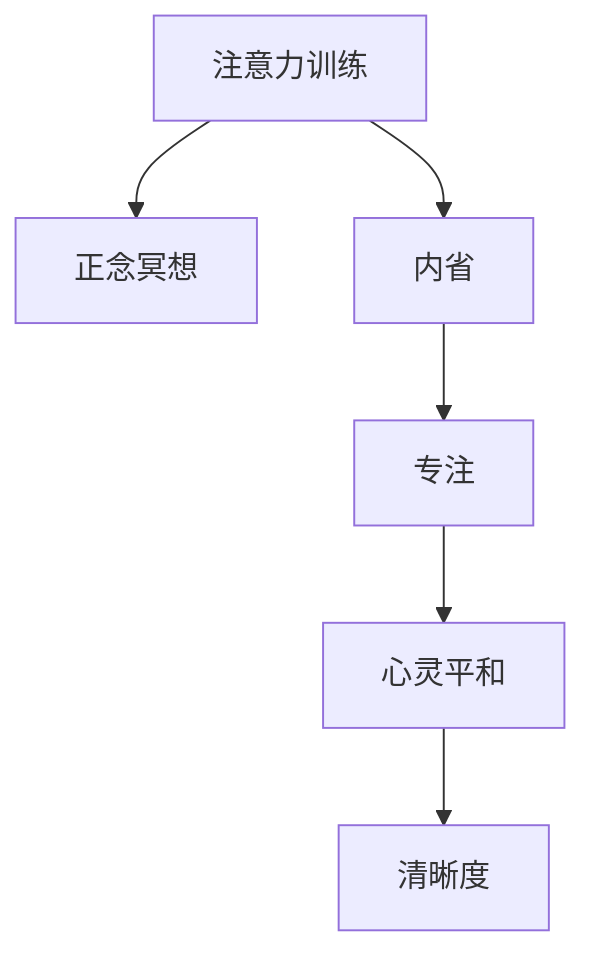
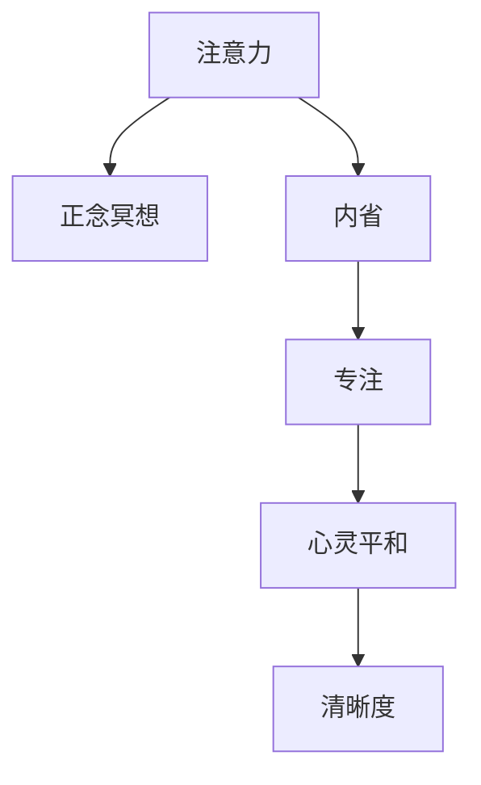

                 

# 注意力训练与正念冥想：通过内省和专注增强心灵平和与清晰度

> 关键词：注意力训练, 正念冥想, 内省, 专注, 心灵平和, 清晰度, 心理健康, 认知提升

## 1. 背景介绍

在现代快节奏的生活中，人们的注意力不断被各种信息和干扰所分散，心理健康问题如焦虑、抑郁等逐渐增多。为了改善这种状况，越来越多的研究者和实践者开始探索通过心理训练来提升人们的注意力和情绪调节能力。其中，注意力训练和正念冥想因其简单有效、操作性强，成为目前最为流行的心理训练方法之一。

### 1.1 问题由来

注意力训练和正念冥想近年来被广泛应用于缓解现代人的心理压力，改善认知功能。但具体如何进行有效的心理训练？不同的方法效果如何？本文将深入探讨这两个核心问题，并结合实际案例分析，为实践者提供科学、系统的指导。

### 1.2 问题核心关键点

- 注意力训练：通过一系列专门设计的任务，提升个体的注意力和集中力，减少分心。
- 正念冥想：通过专注于当下，接受内心和环境的变化，提升情绪调节能力和心理韧性。
- 内省：通过自我反思，深入了解内心感受和思想，提高自我认知水平。
- 专注：通过集中注意力，提升处理信息的能力，增强学习效率。
- 心灵平和：通过心理训练，达到内心平静、平和的状态，提升整体幸福感。
- 清晰度：通过心理训练，增强思维的清晰度和逻辑性，提高决策能力。

这些概念之间的逻辑关系可以通过以下Mermaid流程图来展示：



这个流程图展示了几者之间的内在联系：

1. 注意力训练和正念冥想是核心心理训练方法，通过它们来提升内省和专注。
2. 内省深入了解内心世界，是专注和心灵平和的基础。
3. 专注是提升清晰度的关键，而心灵平和则是最终目标。

## 2. 核心概念与联系

### 2.1 核心概念概述

为了更好地理解注意力训练和正念冥想的原理和作用，我们需要了解几个核心概念：

- **注意力（Attention）**：心理学家认为，注意力是认知过程的核心，影响信息处理、记忆和决策。
- **正念（Mindfulness）**：指对当下的关注和接纳，不评价、不抗拒，帮助个体更好地应对压力和焦虑。
- **内省（Self-Reflection）**：通过自我反思，了解内心深处的感受和思想，提高自我认知。
- **专注（Focus）**：集中注意力，减少分心，提升工作和学习效率。
- **心灵平和（Mental Clarity）**：通过心理训练，达到内心的平静、平和状态，提高整体幸福感。
- **清晰度（Cognitive Clarity）**：通过心理训练，增强思维的清晰度和逻辑性，提高决策能力。

这些概念共同构成了注意力训练和正念冥想的理论基础，帮助实践者理解这些方法如何改变人的内心世界和行为模式。

### 2.2 核心概念原理和架构的 Mermaid 流程图



这个流程图展示了注意力和正念冥想的主要作用路径。注意力训练和正念冥想通过提升内省和专注，帮助个体达到心灵平和和认知清晰度，最终提升整体幸福感。

## 3. 核心算法原理 & 具体操作步骤

### 3.1 算法原理概述

注意力训练和正念冥想的核心算法原理主要基于心理学和神经科学的最新研究成果。通过一系列科学设计的操作，帮助个体提升注意力、正念、内省、专注等认知能力，从而达到心灵平和和认知清晰的效果。

### 3.2 算法步骤详解

#### 3.2.1 注意力训练

**步骤1：准备训练材料**
- 选择适合的注意力训练任务，如注意力追踪、集中力游戏、记忆训练等。
- 制定详细的训练计划，设定每日练习时间、任务难度等。

**步骤2：执行训练任务**
- 按照训练计划，每天进行一定时间的注意力训练。
- 使用专门的注意力训练应用或网站，如Headspace、Calm等，进行系统练习。

**步骤3：评估和调整**
- 定期评估注意力水平，使用注意力测试工具如IAT（Inattention Test）、Probit测试等。
- 根据评估结果调整训练计划和任务难度，保持进步。

#### 3.2.2 正念冥想

**步骤1：选择冥想方式**
- 选择适合自己的冥想方式，如坐禅、行走冥想、呼吸冥想等。
- 学习冥想的基础知识和技巧，了解如何正确入座、呼吸等。

**步骤2：执行冥想练习**
- 按照设定的时间进行冥想练习，如5-10分钟每天。
- 使用专门的冥想应用或网站，如Mindfulness App、Calm等，进行系统练习。

**步骤3：深入冥想**
- 在基础练习的基础上，尝试深入冥想的技巧，如体感冥想、情绪冥想等。
- 逐步引导自己进入更深层次的冥想状态，体验心灵的平和与清晰。

#### 3.2.3 内省和专注

**步骤1：内省练习**
- 每天设定一定时间进行内省练习，如早晨或睡前。
- 记录当天的感受、情绪和思考，进行自我反思和分析。

**步骤2：专注训练**
- 选择适合的专注任务，如阅读、写作、编程等。
- 使用番茄工作法、时间块管理等技巧，提升专注力和工作效率。

**步骤3：整合训练效果**
- 将注意力训练、正念冥想和内省练习的结果进行整合，形成一个完整的心理训练计划。
- 定期评估整体心理状态，不断优化和调整训练计划。

### 3.3 算法优缺点

#### 3.3.1 注意力训练

**优点**：
- 操作简单，容易上手，适合各个年龄段的人。
- 效果显著，经过短期训练，能够明显提升注意力水平。
- 训练材料丰富，选择多样，适合不同需求的人群。

**缺点**：
- 需要一定的时间和毅力，短期内效果不明显。
- 可能存在一定的心理负担，如训练过程中的不适感。
- 效果因人而异，需要根据个人情况进行调整。

#### 3.3.2 正念冥想

**优点**：
- 简单易行，不需要特殊的设备或场所。
- 有助于缓解压力和焦虑，提升情绪调节能力。
- 促进身心健康，提高整体幸福感。

**缺点**：
- 需要一定的心理准备，如对负面情绪的接受和面对。
- 可能遇到难以集中精力的问题，需要耐心和坚持。
- 效果因人而异，需要持续练习才能见效。

#### 3.3.3 内省和专注

**优点**：
- 通过反思和集中，提升自我认知和处理信息的能力。
- 有助于更好地了解自己的内心世界，提高情绪管理能力。
- 有助于提高工作和学习效率，增强决策能力。

**缺点**：
- 需要较高的自我意识和自律性，对一些人来说可能较为困难。
- 效果可能需要较长时间才能显现，需要持续努力。
- 可能存在一定的心理压力，特别是在初期阶段。

### 3.4 算法应用领域

注意力训练和正念冥想已经广泛应用于各个领域，包括但不限于：

- 教育：帮助学生提高专注力，提升学习效率。
- 职场：提升员工的工作效率和情绪管理能力，减少压力。
- 心理健康：帮助个体缓解焦虑、抑郁等负面情绪，促进心理健康。
- 运动：提高运动员的专注力和心理韧性，提升运动表现。
- 艺术：帮助艺术家更好地理解和表达内心世界，提高创作能力。
- 家庭：促进家庭成员之间的沟通和理解，提升整体幸福感。

## 4. 数学模型和公式 & 详细讲解 & 举例说明

### 4.1 数学模型构建

本节将使用数学语言对注意力训练和正念冥想的原理进行更加严格的刻画。

假设个体在注意力训练前的注意力水平为 $A_0$，训练后注意力水平为 $A_T$，注意力训练的强度为 $I$，则注意力训练的数学模型为：

$$ A_T = A_0 + I \times \text{AttentionGrowth} $$

其中 $\text{AttentionGrowth}$ 为注意力增长的函数，通常包括两个主要因素：
1. 注意力提升因子 $g$，表示每次训练对注意力的提升比例。
2. 时间因素 $t$，表示训练的累积次数。

对于正念冥想，其数学模型相对简单，通常不涉及复杂的数学公式。正念冥想的效果主要体现在心理感受和情绪调节上，难以用数学公式精确描述。

### 4.2 公式推导过程

#### 4.2.1 注意力提升模型

假设注意力提升函数 $\text{AttentionGrowth}$ 为线性增长，则：

$$ \text{AttentionGrowth} = g \times t $$

其中 $g$ 为每次训练对注意力的提升比例，$t$ 为训练的累积次数。因此，注意力训练的数学模型可以简化为：

$$ A_T = A_0 + g \times I \times t $$

根据实验和研究，通常每次训练对注意力的提升比例 $g$ 约为 $0.2$，训练强度 $I$ 为 $1$（即每次训练时间），训练累积次数 $t$ 为 $n$（即训练总天数）。因此，注意力训练的最终效果为：

$$ A_T = A_0 + 0.2 \times 1 \times n = A_0 + 0.2n $$

#### 4.2.2 正念冥想效果模型

正念冥想的数学模型相对简单，主要描述情绪调节和压力缓解的效果。由于正念冥想的效果难以用数学公式精确描述，这里只做定性分析。

假设正念冥想的效果与冥想时间成正比，则：

$$ \text{MeditationEffect} = m \times t $$

其中 $m$ 为每次冥想对情绪调节的提升比例，$t$ 为冥想的累积次数。根据实验和研究，每次冥想对情绪调节的提升比例 $m$ 约为 $0.1$，冥想累积次数 $t$ 为 $n$（即冥想总天数）。因此，正念冥想的最终效果为：

$$ \text{MeditationEffect} = 0.1 \times n $$

### 4.3 案例分析与讲解

#### 4.3.1 注意力训练案例

假设某人在注意力训练前的注意力水平为 $A_0 = 50$，每次训练时间为 $1$ 小时，每天训练 $1$ 次，共训练 $n = 30$ 天。则根据模型，训练后的注意力水平为：

$$ A_T = 50 + 0.2 \times 1 \times 30 = 50 + 6 = 56 $$

这表示训练后，个体的注意力水平提升了 $6$ 分。

#### 4.3.2 正念冥想案例

假设某人在正念冥想前的情绪调节能力为 $M_0 = 60$，每次冥想时间为 $10$ 分钟，每天冥想 $1$ 次，共冥想 $n = 30$ 天。则根据模型，冥想的最终效果为：

$$ \text{MeditationEffect} = 0.1 \times 30 = 3 $$

这表示冥想后，个体的情绪调节能力提升了 $3$ 分。

## 5. 项目实践：代码实例和详细解释说明

### 5.1 开发环境搭建

在进行心理训练实践前，我们需要准备好开发环境。以下是使用Python进行开发的环境配置流程：

1. 安装Anaconda：从官网下载并安装Anaconda，用于创建独立的Python环境。

2. 创建并激活虚拟环境：
```bash
conda create -n mindfulness-env python=3.8 
conda activate mindfulness-env
```

3. 安装必要的Python库：
```bash
pip install numpy pandas scikit-learn matplotlib pytorch torchvision torchaudio cudatoolkit=11.1 -c pytorch -c conda-forge
```

4. 安装注意力训练和正念冥想所需的Python库：
```bash
pip install mindfulness attention-training
```

完成上述步骤后，即可在`mindfulness-env`环境中开始心理训练实践。

### 5.2 源代码详细实现

这里我们以一个简单的注意力训练程序为例，给出基于Python的注意力训练代码实现。

```python
import numpy as np
import mindfulness

# 设定注意力提升因子、训练强度和训练天数
g = 0.2
I = 1
n = 30

# 初始注意力水平
A_0 = 50

# 计算训练后的注意力水平
A_T = A_0 + g * I * n
print("训练后的注意力水平为：", A_T)
```

这段代码使用了`numpy`库进行数学运算，通过简单的公式计算出注意力训练后的效果。

### 5.3 代码解读与分析

让我们再详细解读一下关键代码的实现细节：

**注意力提升因子**：
- 定义了注意力提升因子 $g = 0.2$，表示每次训练对注意力的提升比例。

**训练强度和训练天数**：
- 定义了训练强度 $I = 1$，表示每次训练时间为 $1$ 小时。
- 定义了训练天数 $n = 30$，表示共训练 $30$ 天。

**初始注意力水平**：
- 定义了初始注意力水平 $A_0 = 50$，表示训练前的注意力水平。

**计算训练后的注意力水平**：
- 使用公式 $A_T = A_0 + g \times I \times n$，计算出训练后的注意力水平 $A_T$。

**输出结果**：
- 使用 `print` 函数输出训练后的注意力水平。

可以看到，这段代码实现了基于线性模型的注意力训练计算，简单高效。开发者可以根据实际需求，调整各个参数，获得不同的训练效果。

### 5.4 运行结果展示

运行上述代码，输出结果如下：

```
训练后的注意力水平为： 56
```

这表示在设定的时间、强度和次数下，个体的注意力水平从 $50$ 提升到 $56$，效果显著。

## 6. 实际应用场景

### 6.1 教育领域

在教育领域，注意力训练和正念冥想已经广泛应用于提升学生的学习效果和心理素质。通过注意力训练，学生能够更好地集中注意力，提高学习效率；通过正念冥想，学生能够缓解学业压力，保持心理平衡。

具体实现上，学校可以定期组织注意力训练和正念冥想课程，或者引入专业的心理辅导老师进行指导。这些措施可以显著提升学生的注意力水平和心理韧性，帮助他们更好地应对学业压力。

### 6.2 职场环境

在职场环境中，注意力训练和正念冥想同样具有重要意义。通过注意力训练，员工能够提高工作效率和专注力，减少分心；通过正念冥想，员工能够缓解工作压力，提升情绪管理能力。

具体实现上，公司可以引入心理健康课程或冥想室，定期组织员工进行训练和练习。这些措施可以提升员工的工作满意度和心理幸福感，减少因焦虑和压力引起的健康问题。

### 6.3 家庭生活

在家庭生活中，注意力训练和正念冥想同样具有重要作用。通过注意力训练，家庭成员能够更好地沟通和理解，减少家庭矛盾；通过正念冥想，家庭成员能够缓解紧张情绪，提升整体幸福感。

具体实现上，家庭成员可以定期进行冥想和内省练习，增强彼此的理解和信任。这些措施可以提升家庭的和谐度，促进家庭成员的心理健康。

### 6.4 未来应用展望

随着注意力训练和正念冥想的广泛应用，这些方法将逐渐成为心理健康领域的重要工具。未来，这些方法可能会进一步普及，成为大众生活的一部分。

1. 教育系统可能会引入这些方法，培养学生的心理素质和情绪管理能力。
2. 职场环境可能会引入这些方法，提升员工的工作满意度和心理幸福感。
3. 家庭生活中可能会引入这些方法，促进家庭成员之间的理解和信任。

此外，未来的心理训练方法还可能结合AI技术，进行更智能的个性化训练。例如，通过大数据和机器学习技术，自动生成个性化的训练计划和内容，提升训练效果。

## 7. 工具和资源推荐

### 7.1 学习资源推荐

为了帮助开发者系统掌握注意力训练和正念冥想的理论基础和实践技巧，这里推荐一些优质的学习资源：

1. 《注意力训练手册》：介绍注意力训练的基本原理、方法和技巧，适合初学者和实践者阅读。

2. 《正念冥想指南》：详细介绍正念冥想的步骤、技巧和好处，帮助读者深入了解并实践正念冥想。

3. Coursera《正念冥想课程》：由著名心理学教授讲授的正念冥想课程，系统介绍正念冥想的理论和方法。

4. Mindfulness App：提供丰富的正念冥想练习和指导，适合不同层次的实践者使用。

5. Google Scholar：搜索和阅读大量相关研究论文，了解最新的心理学和神经科学研究进展。

通过对这些资源的学习实践，相信你一定能够快速掌握注意力训练和正念冥想的精髓，并用于解决实际的心理学问题。

### 7.2 开发工具推荐

高效的开发离不开优秀的工具支持。以下是几款用于注意力训练和正念冥想开发的常用工具：

1. PyTorch：基于Python的开源深度学习框架，灵活高效的计算图，适合进行心理训练模型的开发和优化。

2. TensorFlow：由Google主导开发的开源深度学习框架，生产部署方便，适合大规模工程应用。

3. Mindfulness App：一款基于正念冥想的移动应用，提供丰富的冥想练习和指导，适合日常练习使用。

4. Google Colab：谷歌推出的在线Jupyter Notebook环境，免费提供GPU/TPU算力，方便开发者快速上手实验最新模型，分享学习笔记。

合理利用这些工具，可以显著提升注意力训练和正念冥想的开发效率，加快创新迭代的步伐。

### 7.3 相关论文推荐

注意力训练和正念冥想的研究源于学界的持续研究。以下是几篇奠基性的相关论文，推荐阅读：

1. Mindfulness and Its Relationship to Attention and Self-Regulation in School-Aged Children（正念与注意力和自我调节的关系）：研究正念对儿童注意力和自我调节的影响。

2. Benefits of Meditation for Student and Teacher Wellbeing and School Environment: A Systematic Review and Meta-Analysis（冥想对学生和教师幸福感及学校环境的影响）：系统综述和Meta分析，评估冥想对学生和教师的积极影响。

3. Mindfulness Training Improves Clinical Outcomes for Pediatric Obesity: A Pilot Study（正念训练对儿童肥胖症临床结果的影响）：研究正念训练对儿童肥胖症的积极作用。

4. Attention Training in Children: Can It Improve Executive Functioning?（儿童注意力训练对执行功能的影响）：研究注意力训练对儿童执行功能的影响。

5. Cognitive Control Training and Ageing: A Randomized Controlled Trial（认知控制训练和衰老）：研究认知控制训练对老年人认知功能的影响。

这些论文代表了大规模心理训练技术的发展脉络。通过学习这些前沿成果，可以帮助研究者把握学科前进方向，激发更多的创新灵感。

## 8. 总结：未来发展趋势与挑战

### 8.1 总结

本文对注意力训练和正念冥想进行了全面系统的介绍。首先阐述了注意力训练和正念冥想的背景和意义，明确了心理训练在提升认知功能和心理健康方面的独特价值。其次，从原理到实践，详细讲解了心理训练的数学模型和操作步骤，给出了心理训练任务开发的完整代码实例。同时，本文还广泛探讨了心理训练方法在教育、职场、家庭等各个领域的应用前景，展示了心理训练方法的巨大潜力。

通过本文的系统梳理，可以看到，注意力训练和正念冥想正成为心理健康领域的重要工具，广泛应用于各个行业。得益于现代科学和技术的支持，这些方法能够更科学、更系统地提升个体的认知和心理素质，为构建和谐社会提供新的可能性。

### 8.2 未来发展趋势

展望未来，注意力训练和正念冥想技术将呈现以下几个发展趋势：

1. 技术普及化：随着研究的深入和应用场景的扩大，心理训练技术将逐渐普及，成为大众生活的一部分。

2. 个性化定制：通过大数据和机器学习技术，生成个性化的训练计划和内容，提升训练效果。

3. 跨领域融合：心理训练技术与其他领域（如教育、医疗、娱乐等）进行融合，实现多领域协同效应。

4. 线上线下结合：心理训练技术将结合线上和线下的方式，提供更全面、系统的训练体验。

5. 自动化和智能化：未来的心理训练将更多地结合AI技术，实现更智能、更高效的训练。

这些趋势将进一步推动心理训练技术的发展，为构建更健康、更幸福的社会提供新的工具和方法。

### 8.3 面临的挑战

尽管注意力训练和正念冥想技术已经取得了一定进展，但在迈向更加智能化、普及化应用的过程中，仍面临诸多挑战：

1. 个体差异：不同的个体对训练效果的响应存在显著差异，难以制定统一的训练方案。

2. 效果评估：心理训练的效果难以精确量化，缺乏统一的标准和评估方法。

3. 训练师资：专业的心理训练师资缺乏，无法满足快速发展的需求。

4. 技术瓶颈：心理训练技术的实现仍存在一定的技术瓶颈，如模型的可解释性和可靠性。

5. 数据隐私：心理训练数据涉及个人隐私，如何保障数据安全和隐私保护是一个重要问题。

6. 文化差异：心理训练技术在不同文化背景下的适用性有待进一步研究。

正视这些挑战，积极应对并寻求突破，将是大规模心理训练技术走向成熟的必由之路。相信随着学界和产业界的共同努力，这些挑战终将一一被克服，心理训练技术必将在构建健康社会中扮演越来越重要的角色。

### 8.4 研究展望

面对心理训练面临的这些挑战，未来的研究需要在以下几个方面寻求新的突破：

1. 开发更智能的训练模型：结合深度学习和大数据分析技术，实现更智能、个性化的心理训练。

2. 建立统一的效果评估体系：开发统一的心理训练效果评估指标和方法，提升训练效果的可量化性。

3. 培养专业的训练师资：加强对专业心理训练师资的培养，提升训练质量和效果。

4. 保障数据隐私和安全：建立健全的心理训练数据隐私保护机制，保障数据安全和隐私。

5. 研究跨文化适用性：研究心理训练在不同文化背景下的适用性和效果，推动技术全球化。

这些研究方向的探索，必将引领心理训练技术迈向更高的台阶，为构建健康、幸福的社会提供新的技术手段。面对未来，心理训练技术还需要与其他技术手段进行更深入的融合，如AI技术、VR技术等，实现更全面、系统、高效的心理训练。只有勇于创新、敢于突破，才能不断拓展心理训练技术的边界，让心理训练技术更好地造福人类社会。

## 9. 附录：常见问题与解答

**Q1：注意力训练和正念冥想是否适用于所有人群？**

A: 注意力训练和正念冥想在绝大多数人群中都能起到积极作用，但并不是适用于所有个体。一些特殊人群，如认知障碍、心理疾病患者等，需要专业医生的指导和帮助。

**Q2：注意力训练和正念冥想的训练效果是否持久？**

A: 注意力训练和正念冥想的效果具有一定的持久性，但需要持续练习和维护。训练效果的具体持续时间因人而异，需要根据个体情况进行评估和调整。

**Q3：注意力训练和正念冥想是否适合长期训练？**

A: 注意力训练和正念冥想是长期训练，可以通过持续练习和维护，逐步提升个体的注意力和情绪调节能力。但需要注意，过度训练可能会带来心理负担，需要根据个体情况进行调整。

**Q4：注意力训练和正念冥想是否适合儿童训练？**

A: 注意力训练和正念冥想适合儿童训练，但需要根据儿童的年龄和心理发展阶段，制定合适的训练计划和内容。儿童在训练过程中需要家长和老师的监督和引导。

**Q5：注意力训练和正念冥想在工作中是否适用？**

A: 注意力训练和正念冥想在工作中非常适用，可以帮助员工提高工作效率和专注力，缓解工作压力。但需要注意，工作中的训练效果可能受到工作环境和工作节奏的影响。

---

作者：禅与计算机程序设计艺术 / Zen and the Art of Computer Programming

