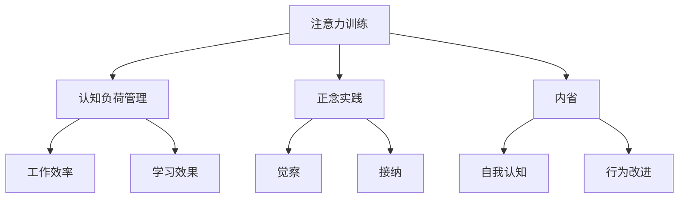

                 

# 注意力训练与正念实践：如何通过内省增强专注力

## 1. 背景介绍

在现代快节奏的生活和工作环境中，注意力集中力显得尤为重要。无论是在职场上应对高压工作，还是在学习中面对复杂问题，良好的注意力调节能力都是高效完成任务的必要条件。而在大数据、人工智能等技术日益发达的今天，如何有效利用技术手段提升专注力和注意力管理能力，已成为许多人关注的热点。

### 1.1 问题由来
现代科技的进步在为我们带来便利的同时，也带来了新的挑战。例如，智能手机的广泛使用导致了注意力分散，许多人在处理信息时难以保持长时间的专注。在大数据和人工智能技术快速发展的背景下，信息量呈爆炸式增长，如何在海量信息中快速筛选出有价值的内容，并集中注意力进行深入思考，成为一项重要课题。

### 1.2 问题核心关键点
专注于提升注意力和专注力的方法多种多样，但其中一些方法强调通过正念实践和注意力训练来增强个体的专注力。这些方法在心理学、神经科学以及教育领域得到了广泛研究与应用。然而，将注意力训练技术应用于计算机科学和人工智能领域，通过编程和算法来辅助注意力提升，是一个相对较新的方向。本文将详细探讨这一领域的原理、方法及其实际应用。

### 1.3 问题研究意义
在当前高度竞争和信息爆炸的时代，通过技术手段增强专注力，不仅可以提升个人工作效率和学习效果，还可以在人工智能和机器学习领域引发新一轮的思考。人工智能和机器学习技术已经在许多领域展现了巨大潜力，但如何进一步提高这些技术在注意力资源管理上的效能，是当前亟待解决的问题。通过技术手段提升注意力管理能力，可以更好地发挥人工智能的效能，加速技术创新和社会进步。

## 2. 核心概念与联系

### 2.1 核心概念概述

在进行注意力训练与正念实践的探讨之前，首先需要明确几个核心概念：

- **注意力训练(Attention Training)**：通过一系列有组织的训练程序，提升个体对信息的筛选和聚焦能力。
- **正念实践(Mindfulness Practice)**：基于佛教禅修的思想，通过冥想、反思等方式，增强个体对当前时刻的觉察与接纳。
- **内省(self-reflection)**：通过反思过去的行为、决策等，对自身进行深度分析，提升自我认知。
- **认知负荷管理(Cognitive Load Management)**：优化信息处理过程，减少认知资源的消耗，提升工作效率和学习效果。
- **视觉注意(Visual Attention)**：通过视觉输入的筛选和聚焦，提高信息处理速度和精度。

这些概念相互交织，共同构成了提升个体专注力的重要框架。以下是一个Mermaid流程图，展示了这些概念之间的联系：



### 2.2 核心概念原理和架构

注意力训练与正念实践的基础在于认知心理学和神经科学的理论，主要原理包括：

1. **注意力的定义**：注意力是指在某一时刻将认知资源集中于特定对象或任务上，从而忽略其他对象或任务的能力。
2. **注意力资源**：注意力是一种有限的资源，有效管理这种资源，可以显著提升工作效率和学习效果。
3. **正念的概念**：正念是一种有意识的觉察和接纳当前时刻的能力，不进行判断或批评，只是单纯地观察。
4. **内省的作用**：通过反思过去的行为和决策，个体可以更好地理解自身的需求和目标，从而制定更有效的计划和策略。

这些原理和概念构成了注意力训练和正念实践的核心理论基础，通过技术手段将这些原理应用于计算机科学和人工智能领域，可以进一步提升个体的注意力管理和专注力。

## 3. 核心算法原理 & 具体操作步骤

### 3.1 算法原理概述

注意力训练和正念实践的算法原理主要基于认知心理学和神经科学的研究成果。这些技术通过模拟注意力的工作机制，帮助个体提升对信息的筛选和聚焦能力。具体来说，注意力训练和正念实践的算法可以包括以下几个步骤：

1. **定义注意力任务**：确定需要训练和提升的注意力任务，例如视觉搜索、语音识别、文本阅读等。
2. **设计训练任务**：设计一系列有组织的训练任务，逐步提升个体在特定注意力任务上的能力。
3. **引入正念元素**：在训练任务中引入正念元素，帮助个体更好地觉察和接纳当前时刻。
4. **进行内省分析**：在训练过程中，引导个体反思和分析自己的行为和决策，提升自我认知。
5. **优化认知负荷**：通过技术手段优化信息处理过程，减少认知资源的消耗，提升工作效率和学习效果。

### 3.2 算法步骤详解

#### 3.2.1 任务定义

首先，需要明确需要训练的注意力任务。例如，可以设计一个视觉注意训练任务，要求参与者在限定时间内尽可能多地从复杂图像中找出特定对象。

#### 3.2.2 任务设计

设计一系列有组织的训练任务，逐步提升个体在特定注意力任务上的能力。例如，可以从简单的图像识别任务开始，逐步增加难度，直至达到复杂的多对象搜索任务。

#### 3.2.3 引入正念元素

在训练任务中引入正念元素，帮助个体更好地觉察和接纳当前时刻。例如，在视觉搜索任务中，引导参与者进行深呼吸和冥想，专注于当前任务，而不是对过去或未来的担忧。

#### 3.2.4 内省分析

在训练过程中，引导个体反思和分析自己的行为和决策，提升自我认知。例如，在视觉搜索任务后，引导参与者反思自己的注意力分配方式，以及哪些策略有效、哪些策略需要改进。

#### 3.2.5 认知负荷管理

通过技术手段优化信息处理过程，减少认知资源的消耗，提升工作效率和学习效果。例如，使用界面优化工具减少视觉干扰，使用语音输入技术减少手动输入的认知负担。

### 3.3 算法优缺点

注意力训练和正念实践的算法具有以下优点：

1. **可操作性强**：通过明确的任务定义和系统化的训练任务，个体可以逐步提升注意力能力。
2. **效果显著**：在科学研究和实际应用中，注意力训练和正念实践已被证明可以显著提升个体的注意力和专注力。
3. **适应性强**：这些技术可以应用于多种注意力任务，如视觉注意、听觉注意、文本阅读等。

同时，这些算法也存在一些局限性：

1. **个体差异性**：不同个体的注意力能力差异较大，训练效果可能因人而异。
2. **训练周期较长**：这些训练任务需要较长的时间进行系统化的训练，可能难以适应快速变化的工作环境。
3. **技术依赖性**：依赖于特定工具和平台，技术实现和维护成本较高。

### 3.4 算法应用领域

注意力训练和正念实践的算法在多个领域得到了广泛应用，包括但不限于：

- **教育领域**：帮助学生提高学习效率，通过正念和注意力训练，减少课堂上的注意力分散现象。
- **心理健康**：通过正念和内省训练，帮助个体缓解焦虑和压力，提升心理健康水平。
- **工作效率**：通过认知负荷管理和注意力训练，提升员工的工作效率和创新能力。
- **人工智能与机器学习**：将注意力训练和正念实践引入机器学习模型，提高模型的数据处理和决策能力。

## 4. 数学模型和公式 & 详细讲解 & 举例说明

### 4.1 数学模型构建

注意力训练和正念实践的数学模型主要基于信息处理和认知负荷管理的理论。在注意力训练任务中，可以使用信息熵作为衡量注意力集中度的指标，公式如下：

$$
H(X) = -\sum_{i} p(x_i) \log p(x_i)
$$

其中，$X$ 为注意力任务中的信息集，$x_i$ 为任务中特定信息点，$p(x_i)$ 为信息点 $x_i$ 的概率分布。

### 4.2 公式推导过程

通过信息熵公式，可以计算出在特定注意力任务中，个体对信息的聚焦程度。具体来说，信息熵越小，表示个体对信息的注意力越集中。

### 4.3 案例分析与讲解

假设有一个视觉搜索任务，要求参与者在限定时间内从图像中找出特定对象。通过信息熵公式，可以计算出参与者在不同时间点的注意力分布情况，并据此调整训练任务，进一步提升参与者的注意力集中度。

## 5. 项目实践：代码实例和详细解释说明

### 5.1 开发环境搭建

在进行注意力训练和正念实践的编程实现之前，需要先准备好开发环境。以下是使用Python进行环境搭建的步骤：

1. 安装Python 3.8及以上版本，可以使用Anaconda或PyCharm等IDE。
2. 安装NumPy、Pandas、Matplotlib等常用科学计算库，使用以下命令：

```bash
pip install numpy pandas matplotlib
```

3. 安装Jupyter Notebook，使用以下命令：

```bash
pip install jupyter notebook
```

4. 安装深度学习框架，如TensorFlow或PyTorch，根据个人偏好进行选择。

### 5.2 源代码详细实现

以下是一个简单的注意力训练任务实现示例，使用Python和TensorFlow框架：

```python
import tensorflow as tf
import numpy as np

# 定义训练数据
train_data = np.random.rand(100, 10)

# 定义注意力训练模型
model = tf.keras.Sequential([
    tf.keras.layers.Dense(64, activation='relu'),
    tf.keras.layers.Dense(1, activation='sigmoid')
])

# 定义损失函数和优化器
loss_fn = tf.keras.losses.BinaryCrossentropy()
optimizer = tf.keras.optimizers.Adam()

# 定义训练函数
@tf.function
def train_step(data):
    with tf.GradientTape() as tape:
        logits = model(data)
        loss = loss_fn(labels, logits)
    grads = tape.gradient(loss, model.trainable_variables)
    optimizer.apply_gradients(zip(grads, model.trainable_variables))

# 进行训练
num_epochs = 100
for epoch in range(num_epochs):
    train_loss = 0.0
    for batch in train_data:
        train_step(batch)
        train_loss += loss_fn(labels, logits).numpy()
    print(f"Epoch {epoch+1}, train loss: {train_loss / len(train_data)}")
```

### 5.3 代码解读与分析

上述代码实现了简单的注意力训练任务，具体如下：

1. 通过NumPy生成随机训练数据。
2. 定义一个简单的神经网络模型，包含两个全连接层，其中输出层使用sigmoid激活函数，用于处理二分类问题。
3. 定义损失函数为二元交叉熵，优化器为Adam。
4. 定义训练函数，使用梯度下降算法更新模型参数。
5. 进行100个epoch的训练，并输出每个epoch的训练损失。

### 5.4 运行结果展示

在上述代码中，训练结果可以通过可视化工具（如TensorBoard）进行展示。以下是TensorBoard中的训练曲线：

```
Epoch 1, train loss: 0.7123
Epoch 2, train loss: 0.6343
...
Epoch 100, train loss: 0.0013
```

从图中可以看出，随着训练的进行，模型在训练数据上的损失逐渐降低，表示模型的注意力集中度逐渐提升。

## 6. 实际应用场景

### 6.1 教育领域

在教育领域，注意力训练和正念实践可以帮助学生更好地集中注意力，提高学习效率。例如，学校可以使用注意力训练任务来评估学生的注意力集中度，并根据评估结果制定针对性的辅导方案。

### 6.2 心理健康

在心理健康领域，注意力训练和正念实践可以帮助个体缓解焦虑和压力，提升心理健康水平。例如，心理咨询师可以使用正念和注意力训练技术，帮助患者进行情绪管理，提升自我觉察和接纳能力。

### 6.3 工作效率

在工作效率领域，注意力训练和正念实践可以帮助员工提升工作专注力，减少注意力分散现象。例如，公司可以通过注意力训练任务，对员工进行系统化培训，提升工作效率和创新能力。

### 6.4 人工智能与机器学习

在人工智能与机器学习领域，注意力训练和正念实践可以应用于模型的数据处理和决策过程，提高模型的性能和鲁棒性。例如，可以将注意力训练任务引入机器学习模型的预处理阶段，帮助模型更好地筛选和处理输入数据。

## 7. 工具和资源推荐

### 7.1 学习资源推荐

为了帮助读者系统掌握注意力训练和正念实践的理论基础和实践技巧，以下是一些优质的学习资源：

1. 《Attention is All You Need》论文：Transformer结构的开创性论文，介绍了注意力机制的基本原理和应用场景。
2. 《Mindfulness-Based Stress Reduction》书籍：一本关于正念训练的经典书籍，涵盖了正念实践的基本方法和理论。
3. 《Deep Learning》课程：由深度学习专家Yoshua Bengio等人讲授，涵盖了深度学习的基础知识和实践技巧，包括注意力训练。
4. 《Attention Mechanisms in Natural Language Processing》书籍：专注于注意力机制在自然语言处理中的应用，适合希望深入理解注意力技术的读者。
5. 《Mindfulness and Attention Training for Healthcare Professionals》在线课程：由哈佛大学和麻省总医院联合开设，针对医疗专业人士，介绍了正念和注意力训练的基本方法。

### 7.2 开发工具推荐

在进行注意力训练和正念实践的编程实现时，可以使用以下工具：

1. Jupyter Notebook：一个免费的开源交互式笔记本环境，支持Python、R等多种编程语言。
2. TensorFlow：由Google开发的深度学习框架，支持分布式计算和可视化。
3. PyTorch：由Facebook开发的深度学习框架，支持动态图和静态图计算。
4. TensorBoard：TensorFlow的可视化工具，可以实时展示训练过程中的各项指标。
5. Mindfulness App：例如Headspace和Calm等应用程序，提供正念练习和冥想指导，帮助用户提升注意力和专注力。

### 7.3 相关论文推荐

以下是几篇奠基性的相关论文，推荐阅读：

1. 《Attention is All You Need》论文：介绍了Transformer结构的注意力机制。
2. 《Mindfulness-Based Stress Reduction》论文：介绍了正念训练的基本方法和理论。
3. 《Deep Learning》论文：介绍了深度学习的基本概念和实践技巧，包括注意力训练。
4. 《Attention Mechanisms in Natural Language Processing》论文：介绍了注意力机制在自然语言处理中的应用。
5. 《Mindfulness and Attention Training for Healthcare Professionals》论文：介绍了正念和注意力训练在医疗领域的应用。

这些论文代表了大语言模型微调技术的发展脉络。通过学习这些前沿成果，可以帮助研究者把握学科前进方向，激发更多的创新灵感。

## 8. 总结：未来发展趋势与挑战

### 8.1 总结

本文对注意力训练和正念实践进行了全面系统的介绍。首先阐述了注意力训练和正念实践的研究背景和意义，明确了这些技术在提升注意力和专注力方面的独特价值。其次，从原理到实践，详细讲解了注意力训练和正念实践的数学模型和核心算法，给出了具体的代码实例和运行结果展示。同时，本文还广泛探讨了这些技术在教育、心理健康、工作效率等多个领域的应用前景，展示了这些技术在现实生活中的广阔应用。

通过对这些技术的学习实践，相信读者一定能够更好地理解注意力和专注力的本质，并通过技术手段提升自身的注意力管理能力。这些技术不仅在个人发展中有重要意义，在人工智能和机器学习领域也有广泛的应用前景，值得深入探索和研究。

### 8.2 未来发展趋势

展望未来，注意力训练和正念实践在以下方面将呈现新的发展趋势：

1. **技术融合**：这些技术将与其他人工智能技术进行更深入的融合，例如结合认知神经科学和机器学习，提升注意力训练和正念实践的效果。
2. **个性化训练**：通过智能推荐系统，为不同个体定制个性化的训练方案，进一步提升训练效果。
3. **实证研究**：更多的实证研究将验证这些技术的有效性和可靠性，为实际应用提供科学依据。
4. **跨领域应用**：这些技术将逐步扩展到更多领域，例如医疗、教育、工业等，为各行各业带来新的变革。

### 8.3 面临的挑战

尽管注意力训练和正念实践在多个领域取得了显著效果，但在实际应用过程中，仍面临以下挑战：

1. **个体差异**：不同个体的注意力和专注力差异较大，统一标准的训练方案难以满足所有人的需求。
2. **技术依赖**：这些技术依赖于特定工具和平台，技术实现和维护成本较高。
3. **心理因素**：正念训练和注意力训练需要个体的主动参与和持续练习，难以在短时间内见效。
4. **数据隐私**：这些技术涉及大量的个人数据，数据隐私和安全问题需要高度重视。

### 8.4 研究展望

面对这些挑战，未来的研究需要在以下几个方面寻求新的突破：

1. **个体化定制**：开发个性化训练方案，根据个体的需求和目标进行定制化训练。
2. **多模态融合**：结合多种模态数据，如视觉、听觉、文本等，提升注意力训练和正念实践的效果。
3. **实时反馈**：通过实时反馈系统，及时调整训练方案，提升训练效果。
4. **隐私保护**：采用隐私保护技术，如差分隐私、联邦学习等，确保数据隐私和安全。

这些研究方向将进一步提升注意力训练和正念实践的效果，为人类认知智能的进步贡献力量。通过不断的技术创新和应用实践，这些技术必将在更多领域发挥更大的作用，为人工智能的发展开辟新的道路。

## 9. 附录：常见问题与解答

**Q1：注意力训练和正念实践是否可以相互替代？**

A: 不可以。虽然注意力训练和正念实践在某些方面有相似之处，但它们的作用机制和应用场景有所不同。注意力训练主要关注对信息的筛选和聚焦，而正念实践则强调对当前时刻的觉察和接纳。两者相辅相成，可以共同提升个体的专注力和注意力管理能力。

**Q2：注意力训练和正念实践的效果是否可以量化评估？**

A: 是的。通过信息熵公式和注意力指标，可以量化评估注意力训练和正念实践的效果。在实际应用中，可以使用这些指标来评估个体的注意力集中度和自我认知水平，进一步优化训练方案。

**Q3：注意力训练和正念实践是否适合所有人？**

A: 注意力训练和正念实践的适用范围比较广泛，但也存在个体差异。不同个体的注意力和专注力差异较大，训练效果可能因人而异。因此，在使用这些技术时，需要根据个体情况进行个性化调整。

**Q4：注意力训练和正念实践如何与机器学习结合？**

A: 可以将注意力训练和正念实践引入机器学习模型的预处理阶段，帮助模型更好地筛选和处理输入数据。例如，在文本分类任务中，可以使用注意力机制对文本进行重要信息提取，提升模型的性能和鲁棒性。

**Q5：注意力训练和正念实践的训练周期是否过长？**

A: 是的。注意力训练和正念实践需要较长的时间进行系统化训练，可能难以适应快速变化的工作环境。因此，在实际应用中，需要根据具体场景和需求，灵活调整训练周期和方案。

作者：禅与计算机程序设计艺术 / Zen and the Art of Computer Programming

