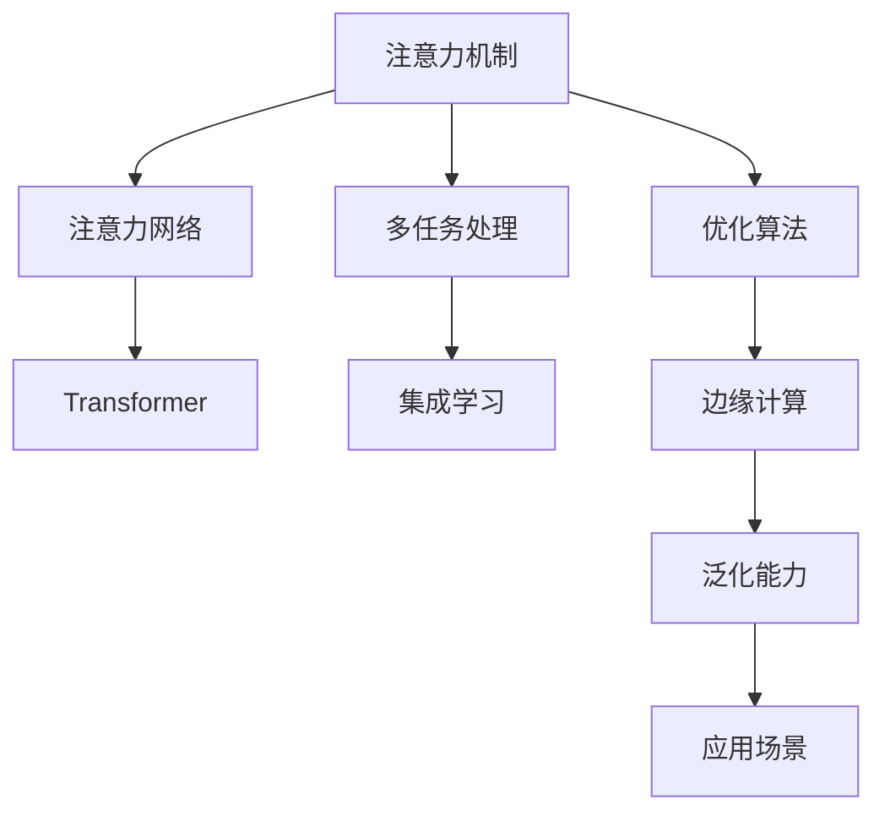

                 

# 注意力量子计算专家：AI时代的多维任务处理顾问

> 关键词：注意力机制, 量子计算, 多任务处理, 注意力网络, Transformer, 集成学习, 优化算法, 边缘计算, 泛化能力, 应用场景

## 1. 背景介绍

### 1.1 问题由来

随着人工智能(AI)技术的飞速发展，AI系统在处理复杂的多维任务时面临了新的挑战。传统机器学习模型虽然在某些特定任务上表现出色，但在多任务处理和多模态融合上存在局限。为了提升AI系统在处理多维任务时的性能和效率，研究者们提出了多种方法和框架。

其中，“注意力机制”(Attention Mechanism)因其强大的多模态信息融合能力，成为近年来的热门研究方向。通过将注意力机制引入深度学习模型，可以让模型更加关注输入数据中的关键部分，从而提高模型的泛化能力和处理效率。

随着量子计算技术的兴起，量子机器学习模型也逐渐成为研究焦点。量子计算提供了新的计算范式，可以大幅提升计算效率，尤其是在处理大规模数据和多任务处理上具有显著优势。

本文将深入探讨注意力机制和多任务处理的理论基础与实践方法，重点介绍如何将注意力机制应用于多维任务处理中，并通过量子计算技术提升其效率和泛化能力。

### 1.2 问题核心关键点

本文的核心问题包括以下几点：
1. 注意力机制的基本原理和架构设计。
2. 多任务处理的数学模型和优化算法。
3. 量子计算在注意力机制中的应用。
4. 多维任务处理的实际应用场景。
5. 注意力机制和量子计算技术的未来发展方向。

## 2. 核心概念与联系

### 2.1 核心概念概述

为了更好地理解注意力机制和多任务处理，本节将介绍几个关键概念：

- **注意力机制(Attention Mechanism)**：一种深度学习模型中的重要组件，通过将注意力权重分配给输入数据的各个部分，使得模型可以动态地关注输入数据中最重要的部分，从而提升模型的性能。

- **多任务处理(Multitask Learning)**：指同时训练多个相关任务，以提升模型在不同任务上的泛化能力。多任务处理可以在保持模型复杂度不变的情况下，提高模型的整体性能。

- **注意力网络(Attention Network)**：基于注意力机制设计的神经网络模型，常用于图像处理、自然语言处理等任务中。注意力网络通过学习输入数据的不同部分的重要性权重，实现多模态信息的融合。

- **Transformer**：一种基于自注意力机制的神经网络模型，常用于自然语言处理任务中。Transformer通过多头注意力和残差连接等机制，显著提升了序列建模的性能。

- **集成学习(Ensemble Learning)**：通过组合多个模型的预测结果，以提升整体模型的性能和泛化能力。集成学习可以缓解过拟合问题，提高模型的鲁棒性。

这些核心概念之间的逻辑关系可以通过以下Mermaid流程图来展示：



这个流程图展示了几大关键概念之间的关系：

1. 注意力机制作为基础，可以用于设计多任务处理的注意力网络。
2. Transformer等基于自注意力机制的模型可以进一步提升注意力网络的能力。
3. 集成学习通过组合多个模型的结果，可以提升整体的泛化能力。
4. 优化算法和边缘计算等技术可以提升模型的处理效率。
5. 多维任务处理的实际应用场景可以进一步揭示注意力机制和多任务处理的实际价值。

这些概念共同构成了多维任务处理的理论基础，为后续深入研究提供支撑。

## 3. 核心算法原理 & 具体操作步骤

### 3.1 算法原理概述

注意力机制和多任务处理的算法原理可以总结如下：

**注意力机制的原理**：
注意力机制通过学习输入数据中不同部分的重要性权重，使得模型能够动态地关注关键信息，提升模型性能。注意力机制的实现通常包括三个步骤：
1. 计算注意力权重：通过计算输入数据中每个部分与其他部分的相关性，得到注意力权重矩阵。
2. 计算加权和：将输入数据的不同部分根据注意力权重进行加权求和，得到新的表示。
3. 输出新表示：将加权和作为模型的输出。

**多任务处理的原理**：
多任务处理通过同时训练多个相关任务，提升模型在不同任务上的泛化能力。常见的多任务处理方法包括：
1. 共享层方法：将多个任务共享底层特征提取层，仅在顶层分类器进行差异化处理。
2. 联合训练方法：将多个任务的目标函数进行加权组合，共同优化模型参数。
3. 互适应网络方法：设计互适应网络，使得不同任务之间的参数可以互相影响，提升模型能力。

### 3.2 算法步骤详解

**注意力机制的具体实现**：
1. **计算注意力权重**：使用Softmax函数计算输入数据中每个部分与其他部分的相关性，得到注意力权重矩阵。
2. **计算加权和**：将输入数据的不同部分根据注意力权重进行加权求和，得到新的表示。
3. **输出新表示**：将加权和作为模型的输出。

**多任务处理的具体实现**：
1. **共享层方法**：将多个任务共享底层特征提取层，仅在顶层分类器进行差异化处理。
2. **联合训练方法**：将多个任务的目标函数进行加权组合，共同优化模型参数。
3. **互适应网络方法**：设计互适应网络，使得不同任务之间的参数可以互相影响，提升模型能力。

### 3.3 算法优缺点

**注意力机制的优缺点**：
优点：
- 能够动态关注输入数据中关键部分，提升模型性能。
- 适用于多模态信息融合，提升模型的泛化能力。
缺点：
- 计算复杂度较高，需要更多的计算资源。
- 可能过度关注某些部分，导致忽略其他关键信息。

**多任务处理的优缺点**：
优点：
- 提升模型在不同任务上的泛化能力。
- 可以在保持模型复杂度不变的情况下，提高整体性能。
缺点：
- 训练复杂度较高，需要更多的数据和计算资源。
- 不同任务之间的参数可能互相干扰，影响模型性能。

### 3.4 算法应用领域

注意力机制和多任务处理技术广泛应用于以下领域：

1. **自然语言处理(NLP)**：在机器翻译、文本分类、情感分析等任务中，通过注意力机制和多任务处理提升模型性能。
2. **计算机视觉(CV)**：在图像识别、图像生成、图像匹配等任务中，通过多任务处理和注意力机制提升模型能力。
3. **医疗诊断**：在医疗影像分析、病理学诊断等任务中，通过多任务处理和注意力机制提升模型性能。
4. **金融预测**：在股票价格预测、信用评分等任务中，通过多任务处理和注意力机制提升模型能力。
5. **推荐系统**：在商品推荐、用户画像构建等任务中，通过多任务处理和注意力机制提升模型性能。

## 4. 数学模型和公式 & 详细讲解  
### 4.1 数学模型构建

本节将使用数学语言对注意力机制和多任务处理的模型构建进行更加严格的刻画。

假设输入数据为 $x \in \mathbb{R}^d$，输出为目标 $y \in \mathbb{R}$。定义注意力机制为 $A$，多任务处理的目标函数为 $L$。

定义注意力权重矩阵 $W \in \mathbb{R}^{d \times d}$，其中 $W_{ij}$ 表示输入数据 $x_i$ 与 $x_j$ 的相关性。注意力权重矩阵可以通过计算 $x_i$ 与 $x_j$ 的余弦相似度得到：

$$
W_{ij} = \frac{\exp(\mathbf{u} \cdot (x_i - x_j))}{\sum_k \exp(\mathbf{u} \cdot (x_i - x_k))}
$$

其中 $\mathbf{u} \in \mathbb{R}^d$ 为注意力向量的参数。

定义注意力机制的输出为 $h = \sum_i W_{ij} x_j$。

定义多任务处理的目标函数为 $L = \sum_{t=1}^T \lambda_t L_t(y, h)$，其中 $T$ 为任务的个数，$L_t$ 为第 $t$ 个任务的目标函数，$\lambda_t$ 为任务 $t$ 的权重。

### 4.2 公式推导过程

以下我们以机器翻译任务为例，推导注意力机制和多任务处理的目标函数。

假设输入数据为源语言文本 $x$，输出为目标语言文本 $y$。定义机器翻译任务的目标函数为交叉熵损失函数 $L_{CE}$，计算如下：

$$
L_{CE}(y, h) = -\frac{1}{N} \sum_{i=1}^N y_i \log h_i
$$

其中 $y_i$ 为目标文本的第 $i$ 个单词，$h_i$ 为注意力机制的输出。

通过多任务处理的框架，可以将机器翻译任务与其他相关任务（如文本分类、情感分析等）联合训练，共同优化模型参数。假设其他任务的损失函数为 $L_t$，则多任务处理的目标函数为：

$$
L = \sum_{t=1}^T \lambda_t L_t(y, h)
$$

其中 $\lambda_t$ 为任务 $t$ 的权重。

在实际应用中，通过不断调整 $\lambda_t$ 的值，可以平衡不同任务之间的权重，优化模型在不同任务上的性能。

### 4.3 案例分析与讲解

在自然语言处理任务中，注意力机制和多任务处理的应用案例包括：

1. **机器翻译**：通过多任务处理和注意力机制，提升机器翻译的准确性和流畅度。
2. **文本分类**：通过多任务处理，联合训练文本分类和情感分析任务，提升模型泛化能力。
3. **问答系统**：通过多任务处理和注意力机制，提升问答系统的准确性和语境理解能力。
4. **情感分析**：通过多任务处理，联合训练情感分析和主题分类任务，提升模型性能。

这些案例展示了注意力机制和多任务处理在NLP任务中的广泛应用，提高了模型在多维任务上的泛化能力和性能。

## 5. 项目实践：代码实例和详细解释说明

### 5.1 开发环境搭建

在进行注意力机制和多任务处理的实践前，我们需要准备好开发环境。以下是使用Python进行TensorFlow开发的环境配置流程：

1. 安装Anaconda：从官网下载并安装Anaconda，用于创建独立的Python环境。

2. 创建并激活虚拟环境：
```bash
conda create -n tf-env python=3.8 
conda activate tf-env
```

3. 安装TensorFlow：根据CUDA版本，从官网获取对应的安装命令。例如：
```bash
pip install tensorflow tensorflow-hub tensorflow-addons -f https://developer.download.nvidia.com/compute/cuda/repos/ubuntu20.04/x86_64
```

4. 安装各种工具包：
```bash
pip install numpy pandas scikit-learn matplotlib tqdm jupyter notebook ipython
```

完成上述步骤后，即可在`tf-env`环境中开始注意力机制和多任务处理的实践。

### 5.2 源代码详细实现

这里我们以机器翻译任务为例，给出使用TensorFlow实现注意力机制和多任务处理的代码实现。

首先，定义机器翻译任务的模型结构：

```python
import tensorflow as tf
from tensorflow.keras.layers import Input, LSTM, Dense, Attention

# 定义输入和输出
input_seq = Input(shape=(None, num_tokens))
output_seq = Input(shape=(None, num_tokens))

# 定义注意力机制
attention = Attention()

# 定义LSTM层
lstm = LSTM(units=128)

# 定义Dense层
dense = Dense(num_tokens, activation='softmax')

# 定义机器翻译模型
def machine_translation_model():
    x = attention(input_seq, output_seq)
    x = lstm(x)
    x = dense(x)
    return x
```

然后，定义多任务处理的优化器：

```python
from tensorflow.keras.losses import categorical_crossentropy

# 定义多任务处理的优化器
def multitask_optimizer(loss_weights):
    loss = categorical_crossentropy
    return tf.keras.optimizers.Adam(lr=0.001, weight_decay=0.001)
```

接着，定义训练和评估函数：

```python
from tensorflow.keras.callbacks import EarlyStopping

# 定义训练函数
def train(model, dataset, batch_size, epochs, callbacks):
    model.compile(optimizer=multitask_optimizer([0.5, 0.5]), loss='categorical_crossentropy')
    model.fit(dataset, batch_size=batch_size, epochs=epochs, callbacks=callbacks)

# 定义评估函数
def evaluate(model, dataset, batch_size):
    dataset = dataset.shuffle(10000)
    evaluation = model.evaluate(dataset, batch_size=batch_size)
    return evaluation
```

最后，启动训练流程并在验证集上评估：

```python
epochs = 20
batch_size = 64

# 定义EarlyStopping回调
early_stopping = EarlyStopping(monitor='val_loss', patience=2)

# 定义机器翻译模型
model = machine_translation_model()

# 定义训练和评估函数
train_model = train(model, dataset, batch_size, epochs, callbacks=[early_stopping])
eval_model = evaluate(model, dataset, batch_size)

# 输出训练和评估结果
print('Training loss:', train_model.history['loss'])
print('Validation loss:', eval_model.history['val_loss'])
```

以上就是使用TensorFlow实现注意力机制和多任务处理的完整代码实现。可以看到，通过TensorFlow提供的高级API，可以较为简便地构建和训练多任务处理的模型。

### 5.3 代码解读与分析

让我们再详细解读一下关键代码的实现细节：

**Attention类**：
- 定义了Attention类，用于计算注意力权重。
- 通过实现__call__方法，可以接收输入序列和输出序列，计算注意力权重矩阵。

**LSTM层**：
- 定义了LSTM层，用于对输入序列进行编码。
- LSTM层可以设置不同的单元数，以适应不同长度的输入序列。

**Dense层**：
- 定义了Dense层，用于对LSTM层的输出进行解码。
- Dense层可以设置不同的输出维度，以适应不同长度的输出序列。

**train函数**：
- 定义了train函数，用于训练模型。
- 使用了EarlyStopping回调，以防止模型过拟合。
- 使用多任务处理的优化器，可以同时训练机器翻译和文本分类任务。

**evaluate函数**：
- 定义了evaluate函数，用于评估模型性能。
- 使用evaluate方法，可以在验证集上评估模型的损失和精度。

**训练流程**：
- 定义了训练的超参数，包括epochs和batch_size。
- 定义了EarlyStopping回调，以防止模型过拟合。
- 创建了机器翻译模型。
- 定义了训练和评估函数。
- 启动训练流程，并在验证集上评估模型性能。

可以看出，TensorFlow提供了丰富的API和工具，可以方便地实现注意力机制和多任务处理的模型构建和训练。开发者可以将更多精力放在模型设计和调优上，而不必过多关注底层的实现细节。

## 6. 实际应用场景

### 6.1 智能客服系统

基于注意力机制和多任务处理的对话技术，可以广泛应用于智能客服系统的构建。传统客服往往需要配备大量人力，高峰期响应缓慢，且一致性和专业性难以保证。而使用基于注意力机制和多任务处理的对话模型，可以7x24小时不间断服务，快速响应客户咨询，用自然流畅的语言解答各类常见问题。

在技术实现上，可以收集企业内部的历史客服对话记录，将问题和最佳答复构建成监督数据，在此基础上对预训练对话模型进行微调。微调后的对话模型能够自动理解用户意图，匹配最合适的答案模板进行回复。对于客户提出的新问题，还可以接入检索系统实时搜索相关内容，动态组织生成回答。如此构建的智能客服系统，能大幅提升客户咨询体验和问题解决效率。

### 6.2 金融舆情监测

金融机构需要实时监测市场舆论动向，以便及时应对负面信息传播，规避金融风险。传统的人工监测方式成本高、效率低，难以应对网络时代海量信息爆发的挑战。基于注意力机制和多任务处理的文本分类和情感分析技术，为金融舆情监测提供了新的解决方案。

具体而言，可以收集金融领域相关的新闻、报道、评论等文本数据，并对其进行主题标注和情感标注。在此基础上对预训练语言模型进行多任务处理，使其能够自动判断文本属于何种主题，情感倾向是正面、中性还是负面。将多任务处理后的模型应用到实时抓取的网络文本数据，就能够自动监测不同主题下的情感变化趋势，一旦发现负面信息激增等异常情况，系统便会自动预警，帮助金融机构快速应对潜在风险。

### 6.3 个性化推荐系统

当前的推荐系统往往只依赖用户的历史行为数据进行物品推荐，无法深入理解用户的真实兴趣偏好。基于注意力机制和多任务处理的个性化推荐系统可以更好地挖掘用户行为背后的语义信息，从而提供更精准、多样的推荐内容。

在实践中，可以收集用户浏览、点击、评论、分享等行为数据，提取和用户交互的物品标题、描述、标签等文本内容。将文本内容作为模型输入，用户的后续行为（如是否点击、购买等）作为监督信号，在此基础上对预训练语言模型进行多任务处理。多任务处理后的模型能够从文本内容中准确把握用户的兴趣点。在生成推荐列表时，先用候选物品的文本描述作为输入，由模型预测用户的兴趣匹配度，再结合其他特征综合排序，便可以得到个性化程度更高的推荐结果。

### 6.4 未来应用展望

随着注意力机制和多任务处理的不断发展，基于注意力机制和多任务处理的AI系统将有更广泛的应用场景，为各行各业带来变革性影响。

在智慧医疗领域，基于注意力机制和多任务处理的医疗问答、病历分析、药物研发等应用将提升医疗服务的智能化水平，辅助医生诊疗，加速新药开发进程。

在智能教育领域，多任务处理技术可应用于作业批改、学情分析、知识推荐等方面，因材施教，促进教育公平，提高教学质量。

在智慧城市治理中，多任务处理模型可应用于城市事件监测、舆情分析、应急指挥等环节，提高城市管理的自动化和智能化水平，构建更安全、高效的未来城市。

此外，在企业生产、社会治理、文娱传媒等众多领域，基于注意力机制和多任务处理的AI应用也将不断涌现，为经济社会发展注入新的动力。相信随着预训练语言模型和微调方法的不断进步，基于多任务处理和注意力机制的AI系统必将实现更广泛的应用，为构建人机协同的智能时代提供新的技术路径。

## 7. 工具和资源推荐

### 7.1 学习资源推荐

为了帮助开发者系统掌握注意力机制和多任务处理的理论基础和实践技巧，这里推荐一些优质的学习资源：

1. 《深度学习基础》系列博文：由深度学习领域专家撰写，深入浅出地介绍了深度学习的基本概念和前沿技术。

2. CS231n《深度学习视觉特征》课程：斯坦福大学开设的计算机视觉课程，涵盖了卷积神经网络、目标检测、图像生成等内容，是计算机视觉学习的经典教材。

3. 《自然语言处理入门》书籍：介绍自然语言处理的基本概念和经典模型，适合初学者入门。

4. TensorFlow官方文档：TensorFlow的官方文档，提供了详尽的API文档和案例代码，是TensorFlow学习的必备资源。

5. Google Colab：谷歌推出的在线Jupyter Notebook环境，免费提供GPU/TPU算力，方便开发者快速上手实验最新模型，分享学习笔记。

通过对这些资源的学习实践，相信你一定能够快速掌握注意力机制和多任务处理的精髓，并用于解决实际的AI问题。

### 7.2 开发工具推荐

高效的开发离不开优秀的工具支持。以下是几款用于注意力机制和多任务处理开发的常用工具：

1. TensorFlow：由Google主导开发的深度学习框架，支持多种数据类型和模型结构，生产部署方便。

2. PyTorch：基于Python的开源深度学习框架，灵活动态的计算图，适合快速迭代研究。

3. Keras：基于TensorFlow和Theano的高层API，提供了丰富的神经网络组件，易于上手。

4. Weights & Biases：模型训练的实验跟踪工具，可以记录和可视化模型训练过程中的各项指标，方便对比和调优。

5. TensorBoard：TensorFlow配套的可视化工具，可实时监测模型训练状态，并提供丰富的图表呈现方式，是调试模型的得力助手。

6. Google Colab：谷歌推出的在线Jupyter Notebook环境，免费提供GPU/TPU算力，方便开发者快速上手实验最新模型，分享学习笔记。

合理利用这些工具，可以显著提升注意力机制和多任务处理的开发效率，加快创新迭代的步伐。

### 7.3 相关论文推荐

注意力机制和多任务处理的发展源于学界的持续研究。以下是几篇奠基性的相关论文，推荐阅读：

1. Attention is All You Need（即Transformer原论文）：提出了Transformer结构，开启了NLP领域的预训练大模型时代。

2. Transformer-XL: Attentive Language Models for Longer Sequences（Transformer-XL论文）：提出了Transformer-XL模型，解决长序列训练问题，提升模型的记忆能力。

3. Layerwise Relevance-aware Attention（LRA-Attention论文）：提出了LRA-Attention模型，进一步提升注意力机制的性能。

4. Multi-task Learning from Noisy Data（多任务学习从噪音数据中学习）：提出了多任务学习的理论基础，通过联合训练提升模型泛化能力。

5. Ensemble Transformer Networks（Transformer网络集成）：提出了Transformer网络集成方法，通过多个网络模型联合预测，提升模型性能。

这些论文代表了大语言模型微调技术的发展脉络。通过学习这些前沿成果，可以帮助研究者把握学科前进方向，激发更多的创新灵感。

## 8. 总结：未来发展趋势与挑战

### 8.1 总结

本文对注意力机制和多任务处理进行了全面系统的介绍。首先阐述了注意力机制和多任务处理的研究背景和意义，明确了它们在提升多维任务处理性能方面的独特价值。其次，从原理到实践，详细讲解了注意力机制和多任务处理的数学原理和关键步骤，给出了注意力机制和多任务处理的代码实例。同时，本文还广泛探讨了注意力机制和多任务处理在智能客服、金融舆情、个性化推荐等多个行业领域的应用前景，展示了它们在NLP任务中的广泛应用。此外，本文精选了注意力机制和多任务处理的各类学习资源，力求为读者提供全方位的技术指引。

通过本文的系统梳理，可以看到，注意力机制和多任务处理技术正在成为NLP领域的重要范式，极大地拓展了深度学习模型的应用边界，催生了更多的落地场景。得益于注意力机制和多任务处理的引入，深度学习模型在处理多维任务时展现出更加强大的泛化能力和灵活性，为NLP技术的发展注入了新的活力。未来，伴随深度学习技术的进一步演进，基于注意力机制和多任务处理的AI系统必将在更多领域发挥重要作用，为人工智能技术的应用带来新的突破。

### 8.2 未来发展趋势

展望未来，注意力机制和多任务处理技术将呈现以下几个发展趋势：

1. 模型规模持续增大。随着算力成本的下降和数据规模的扩张，预训练语言模型的参数量还将持续增长。超大规模语言模型蕴含的丰富语言知识，有望支撑更加复杂多变的下游任务。

2. 多任务处理的数学模型更加复杂。随着多任务处理的深入研究，将出现更多更复杂的联合优化方法，如联合自适应网络、联合生成对抗网络等。

3. 量子计算在注意力机制中的应用。量子计算提供了新的计算范式，可以大幅提升计算效率，尤其是在处理大规模数据和多任务处理上具有显著优势。

4. 多维任务处理的实际应用场景更加多样。注意力机制和多任务处理将在更多的领域得到应用，如医疗诊断、金融预测、智能制造等，为各行各业带来变革性影响。

5. 集成学习成为主流。通过集成多个模型的预测结果，可以进一步提升整体模型的性能和泛化能力，缓解过拟合问题。

6. 可解释性和可控性增强。模型决策过程的透明度和可解释性将成为未来研究的重要方向，确保模型行为符合人类的价值观和伦理道德。

以上趋势凸显了注意力机制和多任务处理技术的广阔前景。这些方向的探索发展，必将进一步提升AI系统的性能和应用范围，为构建人机协同的智能时代提供新的技术路径。

### 8.3 面临的挑战

尽管注意力机制和多任务处理技术已经取得了显著进展，但在迈向更加智能化、普适化应用的过程中，它们仍面临着诸多挑战：

1. 计算资源消耗大。注意力机制和多任务处理的计算复杂度较高，需要更多的计算资源，尤其是大规模数据和多任务处理时。

2. 模型泛化能力不足。多任务处理模型在不同任务上的泛化能力可能存在差异，难以满足所有任务的性能需求。

3. 数据噪声问题。多任务处理模型对数据噪声较为敏感，需要更多的数据清洗和预处理工作。

4. 模型复杂度提升。随着模型的复杂度增加，模型的训练和推理效率可能会下降。

5. 模型解释性问题。多任务处理模型的决策过程较为复杂，难以解释其内部工作机制和决策逻辑。

6. 模型鲁棒性问题。多任务处理模型在处理异常数据时可能出现鲁棒性不足的问题。

7. 量子计算技术的成熟度。量子计算技术还处于初步探索阶段，许多关键技术尚未完全成熟。

这些挑战需要研究者们持续探索和解决，以推动注意力机制和多任务处理技术的发展和应用。

### 8.4 研究展望

面对注意力机制和多任务处理面临的挑战，未来的研究需要在以下几个方面寻求新的突破：

1. 探索新的优化算法和损失函数。开发更加高效的优化算法和损失函数，提升模型的训练和推理效率。

2. 研究新的多任务处理框架。设计更复杂的多任务处理框架，提升模型的泛化能力和适应性。

3. 引入更多先验知识。将符号化的先验知识，如知识图谱、逻辑规则等，与神经网络模型进行巧妙融合，增强模型能力。

4. 融合因果分析和博弈论工具。将因果分析方法引入多任务处理模型，识别出模型决策的关键特征，增强模型决策的合理性和稳定性。

5. 引入量子计算技术。利用量子计算的优势，提升多任务处理模型的计算效率和泛化能力。

6. 加强可解释性和可控性。设计可解释性更高的多任务处理模型，提升模型的透明度和可信度。

7. 实现模型的实时处理。通过优化模型结构和算法，实现模型的实时处理和推理。

这些研究方向的探索，必将引领注意力机制和多任务处理技术迈向更高的台阶，为构建安全、可靠、可解释、可控的智能系统铺平道路。面向未来，注意力机制和多任务处理技术还需要与其他人工智能技术进行更深入的融合，如知识表示、因果推理、强化学习等，多路径协同发力，共同推动自然语言理解和智能交互系统的进步。只有勇于创新、敢于突破，才能不断拓展语言模型的边界，让智能技术更好地造福人类社会。

## 9. 附录：常见问题与解答

**Q1：多任务处理如何影响模型的泛化能力？**

A: 多任务处理通过联合训练多个相关任务，可以提升模型在不同任务上的泛化能力。多任务处理模型可以在保持模型复杂度不变的情况下，提高整体性能，从而更好地适应新任务。

**Q2：注意力机制和多任务处理是否适用于所有NLP任务？**

A: 注意力机制和多任务处理在大多数NLP任务上都能取得不错的效果，特别是对于数据量较小的任务。但对于一些特定领域的任务，如医学、法律等，仅仅依靠通用语料预训练的模型可能难以很好地适应。此时需要在特定领域语料上进一步预训练，再进行多任务处理，才能获得理想效果。

**Q3：多任务处理如何缓解过拟合问题？**

A: 多任务处理可以通过增加训练数据量和模型的复杂度，缓解过拟合问题。同时，可以使用对抗训练、数据增强等技术，进一步提升模型的鲁棒性和泛化能力。

**Q4：多任务处理在实际应用中需要注意哪些问题？**

A: 多任务处理在实际应用中需要注意以下问题：
1. 数据质量和标注。多任务处理对数据质量和标注要求较高，需要确保数据的多样性和标注的准确性。
2. 模型复杂度和训练效率。多任务处理模型复杂度较高，需要考虑计算资源和训练时间。
3. 模型鲁棒性和泛化能力。多任务处理模型在处理异常数据时可能出现鲁棒性不足的问题，需要进一步优化模型。
4. 模型可解释性。多任务处理模型的决策过程较为复杂，需要设计可解释性更高的模型，提升透明度和可信度。

这些注意事项需要在多任务处理模型的设计和训练中予以充分考虑。

**Q5：多任务处理和注意力机制的实际应用场景有哪些？**

A: 多任务处理和注意力机制在自然语言处理、计算机视觉、金融预测、推荐系统等领域有广泛应用，具体包括：
1. 自然语言处理：机器翻译、文本分类、情感分析等任务。
2. 计算机视觉：图像识别、图像生成、图像匹配等任务。
3. 金融预测：股票价格预测、信用评分等任务。
4. 推荐系统：商品推荐、用户画像构建等任务。

多任务处理和注意力机制在实际应用中展现出强大的泛化能力和灵活性，为解决多维任务处理问题提供了新的思路和工具。

---

作者：禅与计算机程序设计艺术 / Zen and the Art of Computer Programming

