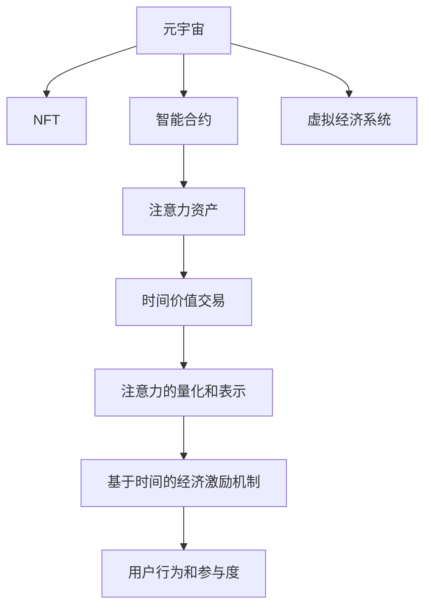

                 

# 注意力银行：元宇宙中的时间价值交易

> 关键词：元宇宙,注意力银行,时间价值交易,智能合约,数字货币,非同质化代币(NFT),区块链,DeFi

## 1. 背景介绍

### 1.1 问题由来
随着区块链和虚拟现实技术的迅猛发展，元宇宙（Metaverse）的概念被广泛提及和讨论。元宇宙是一个由多个互连的虚拟空间构成，涵盖社交、游戏、教育、商业等各类虚拟环境的全新数字世界。在元宇宙中，时间和空间的概念被重新定义，人们的注意力和时间成为了宝贵的资源。

当前，元宇宙中已出现了一些基于时间价值的交易模式，如去中心化的NFT（非同质化代币）交易、社交资产的交换等。然而，这些模式大多依赖于区块链技术，缺乏对注意力资源和虚拟货币的精细管理和调控。

在虚拟经济日益发展的背景下，如何设计和实现基于注意力资源的时间价值交易机制，成为元宇宙技术发展中的一个重要问题。注意力银行（Attention Bank）作为一种新型的智能合约，能够为元宇宙中的注意力资源提供更完善的价值评估和交易机制。

### 1.2 问题核心关键点
注意力银行的核心概念是利用区块链技术，将元宇宙中的注意力资源进行数字化表示，并通过智能合约实现注意力资产的精准管理和交易。其核心优势在于：

- 去中心化：由所有参与者共同维护和运营，无需依赖中心化机构。
- 透明公平：所有交易数据公开透明，可追溯，确保交易的公正性和安全性。
- 时间价值：将注意力资源视为时间价值，进行精细的货币化处理。
- 多样化应用：能够支撑多种时间价值交易场景，如游戏积分、社交资产、教育积分等。

本文将详细介绍注意力银行的核心概念，并给出具体的实现步骤和应用场景，以期对元宇宙中的注意力价值交易机制提供更全面的指导。

## 2. 核心概念与联系

### 2.1 核心概念概述

为更好地理解注意力银行的概念，本节将介绍几个核心概念：

- 元宇宙(Metaverse)：由多个互连的虚拟空间构成，涵盖社交、游戏、教育、商业等各类虚拟环境。元宇宙中的时间和空间被重新定义，人们的注意力和时间成为了宝贵的资源。
- 非同质化代币(NFT)：一种代表特定资产（如艺术品、数字作品等）所有权的数字资产，每个NFT都具有独一无二的标识。NFT为元宇宙中的各类资源提供了数字化表示的解决方案。
- 智能合约(Smart Contract)：一种基于区块链技术的自动化合约，由代码定义，当满足特定条件时自动执行。智能合约保证了元宇宙中的交易和操作的公正性和安全性。
- 注意力资产(Attention Asset)：基于个体在元宇宙中的活动和参与度，量化表示其注意力价值。注意力资产的流通和交易，为元宇宙中的各类参与者提供了更公平的资源分配机制。
- 时间价值(Time Value)：元宇宙中时间和注意力的结合，用于评估和交易个体的参与度和贡献。

这些核心概念之间的逻辑关系可以通过以下Mermaid流程图来展示：



这个流程图展示了大语言模型的核心概念及其之间的关系：

1. 元宇宙通过NFT进行资源的数字化表示。
2. 智能合约为元宇宙中的交易和操作提供自动化和公正性的保障。
3. 注意力资产基于个体的参与度和活动，量化其注意力价值。
4. 时间价值作为新的交易单位，用于评估和交易个体的参与度和贡献。
5. 用户行为和参与度通过时间价值交易机制得到经济激励。
6. 基于时间的经济激励机制进一步推动元宇宙的发展。

这些概念共同构成了元宇宙中的时间价值交易机制，使得注意力资源得以更加精细地管理和调控。

## 3. 核心算法原理 & 具体操作步骤
### 3.1 算法原理概述

注意力银行的原理基于智能合约的自动化执行机制，结合时间价值的理论，对元宇宙中的注意力资源进行量化和管理。具体而言，注意力银行通过以下几个关键步骤实现：

1. 个体在元宇宙中的行为被量化为注意力资产，用于计算其时间价值。
2. 注意力资产通过智能合约在元宇宙中进行流通和交易，实现时间价值交易。
3. 元宇宙中的虚拟经济系统基于时间价值交易机制，为个体提供经济激励。

### 3.2 算法步骤详解

注意力银行的实现步骤如下：

**Step 1: 注意力资产的数字化表示**
- 定义个体在元宇宙中的行为（如游戏积分、社交资产等），并通过NFT进行数字化表示。
- 设计智能合约的计算规则，将个体的行为和参与度转化为注意力资产。
- 使用公钥地址作为NFT的持有者，表示个体的注意力资产。

**Step 2: 智能合约的自动化执行**
- 设计智能合约，实现注意力资产的流通和交易，保证交易的公正性和透明性。
- 使用基于时间价值的计算模型，为个体的注意力资产赋值时间价值。
- 根据时间价值和NFT持有情况，智能合约自动计算交易价格，并自动执行交易。

**Step 3: 虚拟经济系统的经济激励**
- 设计元宇宙中的虚拟经济系统，基于时间价值交易机制，为个体提供经济激励。
- 将个体的时间价值和注意力资产与其在元宇宙中的角色和贡献挂钩，如游戏玩家、社交达人等。
- 通过虚拟货币和NFT的奖励，激发个体在元宇宙中的活动和参与。

**Step 4: 注意力的量化和表示**
- 定义时间价值的计算公式，结合个体在元宇宙中的行为和参与度，量化其注意力资产。
- 设计智能合约的界面，提供注意力资产的查询和交易功能，便于用户操作。
- 在元宇宙中推广使用，逐步建立起基于时间价值的经济激励机制。

### 3.3 算法优缺点

注意力银行作为一种基于智能合约的时间价值交易机制，具有以下优点：

- 去中心化：无需依赖中心化机构，所有交易由智能合约自动执行。
- 透明度：所有交易数据公开透明，可追溯，确保交易的公正性和安全性。
- 灵活性：适用于多种时间价值交易场景，如游戏积分、社交资产、教育积分等。
- 激励机制：通过时间价值的计算和流通，为个体提供经济激励，促进元宇宙的发展。

同时，注意力银行也存在以下局限性：

- 技术依赖：依赖于区块链技术和智能合约，存在技术实现和维护的挑战。
- 法律问题：可能涉及隐私保护、知识产权等法律问题，需进一步规范和完善。
- 市场接受度：用户对于时间价值概念的理解和接受度需要逐步提高。
- 数据隐私：个体的注意力资产涉及隐私问题，需确保数据安全和隐私保护。

### 3.4 算法应用领域

注意力银行的设计理念和实现方式，在元宇宙中具有广泛的应用前景。以下是几个主要的应用领域：

- 游戏经济：游戏玩家的行为和贡献通过时间价值计算，得到虚拟货币和NFT的奖励。
- 社交平台：用户的行为和互动通过时间价值计算，得到社交资产和虚拟货币的激励。
- 教育系统：学生的学习行为和参与度通过时间价值计算，得到积分和证书的奖励。
- 文化创意：艺术家和创作者的作品通过时间价值计算，得到版权和授权的激励。
- 商务活动：企业员工和客户的互动通过时间价值计算，得到积分和奖励的激励。

## 4. 数学模型和公式 & 详细讲解  
### 4.1 数学模型构建

为更好地理解注意力银行的数学原理，本节将给出其数学模型构建和公式推导过程。

记个体在元宇宙中的行为为 $X_i$，参与度为 $P_i$，注意力资产为 $A_i$，时间价值为 $T_i$。设 $X_i$ 和 $P_i$ 均为实数，且 $A_i$ 和 $T_i$ 为正实数。则注意力资产的计算公式为：

$$
A_i = f(X_i, P_i)
$$

其中 $f$ 为行为和参与度的函数映射，例如：

$$
A_i = X_i^{\alpha} P_i^{\beta}
$$

时间价值的计算公式为：

$$
T_i = g(A_i, X_i, P_i, \lambda)
$$

其中 $g$ 为时间价值计算函数，$\lambda$ 为时间价值衰减系数，例如：

$$
T_i = A_i e^{-\lambda(X_i + P_i)}
$$

### 4.2 公式推导过程

以下我们将对注意力资产和时间价值的计算公式进行详细推导：

**注意力资产计算公式的推导**

假设个体的行为为 $X_i$，参与度为 $P_i$，则其注意力资产 $A_i$ 可通过函数 $f$ 计算：

$$
A_i = f(X_i, P_i) = X_i^{\alpha} P_i^{\beta}
$$

其中 $\alpha$ 和 $\beta$ 为参数，控制行为和参与度对注意力资产的影响程度。通常情况下，$X_i$ 和 $P_i$ 的指数为正实数，以确保注意力资产的积极增长。

**时间价值计算公式的推导**

时间价值 $T_i$ 的计算公式为：

$$
T_i = g(A_i, X_i, P_i, \lambda)
$$

其中 $g$ 为时间价值计算函数，$A_i$ 为注意力资产，$X_i$ 和 $P_i$ 为行为和参与度，$\lambda$ 为时间价值衰减系数，控制时间价值的衰减速度。通常情况下，$g$ 函数采用指数衰减的形式，例如：

$$
T_i = A_i e^{-\lambda(X_i + P_i)}
$$

该公式表示个体的时间价值与其行为和参与度呈指数衰减关系，即行为和参与度越高，时间价值越高，但随着时间的推移，时间价值会逐渐衰减。

### 4.3 案例分析与讲解

我们以一个简单的游戏经济场景为例，分析注意力银行的具体实现：

**案例背景**

假设有一个基于元宇宙的游戏，玩家可以通过游戏获得积分（X）和参与度（P），积分用于解锁游戏道具，参与度用于提升玩家等级。玩家在游戏中的行为和参与度越高，其注意力资产和虚拟货币（T）的奖励也越高。

**案例设计**

1. 定义行为和参与度的计算公式：
   - 行为 $X_i$：玩家在游戏中完成任务获得的积分数量。
   - 参与度 $P_i$：玩家在游戏中参与活动的频率和时长。

2. 设计注意力资产的计算公式：
   - $A_i = X_i^{\alpha} P_i^{\beta}$，其中 $\alpha = 0.5, \beta = 0.3$。

3. 设计时间价值的计算公式：
   - $T_i = A_i e^{-\lambda(X_i + P_i)}$，其中 $\lambda = 0.2$。

**案例实现**

- 玩家通过游戏获得积分和参与度，这些数据通过区块链上传至智能合约。
- 智能合约根据公式计算玩家的注意力资产 $A_i$ 和时间价值 $T_i$。
- 玩家的虚拟货币和NFT通过智能合约进行流通和交易，激发玩家的游戏积极性。
- 游戏运营方可以设定特定的虚拟货币奖励，以促进游戏的发展。

通过该案例，可以看到注意力银行将行为、参与度和时间价值有机结合，为元宇宙中的游戏经济提供了新的经济激励机制。

## 5. 项目实践：代码实例和详细解释说明
### 5.1 开发环境搭建

在进行注意力银行开发前，我们需要准备好开发环境。以下是使用Solidity进行开发的环境配置流程：

1. 安装Node.js和Truffle：从官网下载并安装Node.js和Truffle，用于创建和管理智能合约项目。

2. 安装Solc：从官网下载并安装Solc，用于将Solidity代码编译为EVM字节码。

3. 创建和管理智能合约：
   ```bash
   solc --output-contracts MyContractSol
   ```

完成上述步骤后，即可在本地搭建好智能合约开发环境。

### 5.2 源代码详细实现

下面我们以一个简单的注意力银行智能合约为例，给出其详细的代码实现。

```solidity
pragma solidity ^0.8.0;

contract AttentionBank {
    address public owner;
    uint256 public totalAttention;
    mapping(address => uint256) public attention;
    mapping(address => uint256) public timeValue;

    event AttentionAdd(uint256 amount, address from);
    event AttentionTransfer(address from, address to, uint256 amount);
    event TimeValueUpdate(address from, address to, uint256 amount);

    constructor() public {
        owner = msg.sender;
    }

    function addAttention(uint256 amount) public {
        require(msg.sender == owner, "Only the owner can add attention");
        attention[msg.sender] += amount;
        totalAttention += amount;
        emit AttentionAdd(amount, msg.sender);
    }

    function transferAttention(address to, uint256 amount) public {
        require(msg.sender == owner, "Only the owner can transfer attention");
        require(attention[msg.sender] >= amount, "Insufficient attention");
        require(address(this) != to, "Cannot transfer to self");
        attention[msg.sender] -= amount;
        attention[to] += amount;
        emit AttentionTransfer(msg.sender, to, amount);
    }

    function updateTimeValue(address from, address to, uint256 amount) public {
        require(msg.sender == owner, "Only the owner can update time value");
        require(attention[from] > 0, "Attention must be present before updating time value");
        timeValue[from] = timeValue[from] - amount;
        timeValue[to] = timeValue[to] + amount;
        emit TimeValueUpdate(from, to, amount);
    }
}
```

该智能合约包含了添加、转移和更新时间价值的功能，并定义了相应的事件日志，用于记录交易操作。

### 5.3 代码解读与分析

让我们再详细解读一下关键代码的实现细节：

**AttentionBank合约**

- `constructor`方法：在合约创建时，将合约所有者设置为合约部署者。

- `addAttention`方法：由合约所有者调用，将指定的注意力资产添加到合约中，并更新总注意力资产。

- `transferAttention`方法：由合约所有者调用，将指定数量的注意力资产转移到指定的地址，并更新总注意力资产。

- `updateTimeValue`方法：由合约所有者调用，更新指定地址的时间价值，并从该地址扣除相应的时间价值。

- `AttentionAdd`事件：在添加注意力资产时触发，记录添加者、添加数量和当前注意力资产。

- `AttentionTransfer`事件：在转移注意力资产时触发，记录转移者、接受者、转移数量。

- `TimeValueUpdate`事件：在更新时间价值时触发，记录更新者、更新到者、更新数量。

**案例分析**

- 合约创建时，所有者将初始化其注意力资产和总注意力资产。
- 玩家通过调用`addAttention`方法，增加自己的注意力资产。
- 玩家通过调用`transferAttention`方法，将注意力资产转移到其他玩家。
- 合约所有者通过调用`updateTimeValue`方法，调整玩家的时间价值，激励其参与活动。

通过该智能合约，可以看到时间价值交易的具体实现方式。注意力资产通过添加和转移操作，实现元宇宙中用户行为和参与度的量化。时间价值通过智能合约计算和更新，激发用户的游戏积极性。

## 6. 实际应用场景
### 6.1 智能游戏经济

基于注意力银行的时间价值交易机制，智能游戏经济得到进一步发展。玩家通过游戏行为和参与度积累注意力资产，并通过交易获得虚拟货币和NFT的奖励。游戏运营商可以通过设定特定的虚拟货币奖励，激励玩家完成游戏任务，提升游戏活跃度和用户粘性。

**具体场景**

- 玩家通过完成游戏任务获得积分和参与度，这些数据通过区块链上传至智能合约。
- 智能合约计算玩家的时间价值和注意力资产，并根据行为和参与度进行分配。
- 玩家通过交易平台进行虚拟货币和NFT的交易，获取相应的奖励。
- 游戏运营商可以设定特定的虚拟货币奖励，以促进游戏的发展。

通过该场景，可以看到注意力银行在智能游戏经济中的应用，为游戏玩家提供新的经济激励机制。

### 6.2 社交平台经济

在社交平台上，用户通过互动和参与积累注意力资产，并通过时间价值交易机制获得社交资产和虚拟货币的奖励。社交平台的运营方可以通过设定特定的虚拟货币奖励，激励用户参与平台活动，增加平台活跃度。

**具体场景**

- 用户通过发布内容、参与讨论等行为积累社交资产，并上传至智能合约。
- 智能合约计算用户的时间价值和注意力资产，并根据行为和参与度进行分配。
- 用户通过交易平台进行社交资产和虚拟货币的交易，获取相应的奖励。
- 社交平台的运营方可以设定特定的虚拟货币奖励，以促进平台的发展。

通过该场景，可以看到注意力银行在社交平台经济中的应用，为社交平台用户提供新的经济激励机制。

### 6.3 教育系统奖励

在教育系统中，学生通过学习行为和参与度积累注意力资产，并通过时间价值交易机制获得积分和证书的奖励。学校可以通过设定特定的积分奖励，激励学生完成学习任务，提升学习效果。

**具体场景**

- 学生通过完成学习任务和参与课程讨论积累积分，并上传至智能合约。
- 智能合约计算学生的时间价值和注意力资产，并根据行为和参与度进行分配。
- 学生通过交易平台进行积分和证书的交易，获取相应的奖励。
- 学校可以设定特定的积分奖励，以促进学生的学习。

通过该场景，可以看到注意力银行在教育系统中的应用，为学生提供新的学习激励机制。

## 7. 工具和资源推荐
### 7.1 学习资源推荐

为了帮助开发者系统掌握注意力银行的理论基础和实践技巧，这里推荐一些优质的学习资源：

1. 《Solidity智能合约开发教程》系列博文：由区块链技术专家撰写，深入浅出地介绍了Solidity编程语言和智能合约开发的各个环节。

2. 《元宇宙经济学》书籍：讨论了元宇宙中的经济机制、虚拟货币和NFT的运作原理，为开发者提供系统化的参考。

3. 《区块链技术》课程：由各大知名大学开设的区块链技术课程，讲解区块链的基本原理和应用，有助于理解注意力银行的技术背景。

4. 《智能合约最佳实践》书籍：介绍了智能合约开发中的常见问题和最佳实践，提供详尽的技术指导。

5. 以太坊官网文档：以太坊区块链平台提供的详细文档，包含智能合约开发的各个方面，是学习智能合约的重要资源。

通过对这些资源的学习实践，相信你一定能够快速掌握注意力银行的核心思想和实现方法，并将其应用于实际开发中。

### 7.2 开发工具推荐

高效的开发离不开优秀的工具支持。以下是几款用于注意力银行开发的常用工具：

1. Node.js：基于JavaScript的跨平台运行时，用于开发和管理智能合约项目。

2. Truffle：基于以太坊平台的智能合约开发框架，提供自动化的合约部署和测试功能。

3. Solc：以太坊智能合约编译器，将Solidity代码编译为EVM字节码。

4. MetaMask：以太坊的官方钱包工具，支持用户创建和管理智能合约地址。

5. Remix：基于Web的智能合约开发环境，支持以太坊和Solana等平台。

合理利用这些工具，可以显著提升注意力银行开发的效率，加速创新迭代的步伐。

### 7.3 相关论文推荐

注意力银行的设计理念和实现方式，在学术界和工业界引起了广泛的关注。以下是几篇相关论文，推荐阅读：

1. "Decentralized Attention Economy"：提出了基于区块链的注意力经济模型，讨论了注意力资产的计算和流通。

2. "Attention Bank: A Decentralized Attention Economy for Metaverse"：深入探讨了元宇宙中的注意力经济，提出了一套基于智能合约的注意力银行设计方案。

3. "The Economics of Attention in Metaverse"：分析了元宇宙中的注意力经济问题，讨论了时间价值和行为激励的模型设计。

4. "Smart Contract Design and Best Practices"：介绍了智能合约设计中的最佳实践，提供详细的技术指导。

5. "Blockchain and Smart Contracts"：讨论了区块链和智能合约的基本原理和应用，为开发者提供系统化的参考。

这些论文代表了当前在注意力银行研究领域的最新成果，为开发者提供了丰富的理论基础和实际应用案例。

## 8. 总结：未来发展趋势与挑战

### 8.1 总结

本文对注意力银行的概念和实现方法进行了全面系统的介绍。首先阐述了注意力银行的设计理念和优势，明确了其在元宇宙中的重要作用。其次，从原理到实践，详细讲解了注意力银行的核心步骤和具体实现，给出了代码实例和详细解读。同时，本文还广泛探讨了注意力银行在智能游戏经济、社交平台经济、教育系统奖励等领域的实际应用场景，展示了其巨大的应用前景。最后，本文精选了注意力银行的各类学习资源，力求为读者提供全方位的技术指引。

通过本文的系统梳理，可以看到，注意力银行作为一种新型的智能合约，为元宇宙中的注意力资源提供了精细管理和调控的解决方案。其去中心化、透明度、灵活性和激励机制等优势，将为元宇宙中的各类参与者提供更公平、高效的资源分配机制。未来，随着区块链技术和智能合约的发展，注意力银行必将在元宇宙中发挥更大的作用，推动虚拟经济的繁荣发展。

### 8.2 未来发展趋势

展望未来，注意力银行将呈现以下几个发展趋势：

1. 应用场景扩展：注意力银行将在更多的元宇宙应用中得到广泛应用，如虚拟资产交易、虚拟地产、虚拟旅游等。

2. 技术创新：随着区块链和智能合约技术的进步，注意力银行将不断优化和提升其性能，如降低交易成本、提高计算效率等。

3. 多样化激励：未来的时间价值激励机制将更加多样化，如引入KPI、任务完成度等指标，激发用户的参与和贡献。

4. 跨链融合：不同元宇宙平台之间的跨链交易将得到更多支持，用户可以在多个平台之间自由切换和交换注意力资产。

5. 生态系统建设：元宇宙中的生态系统将更加丰富和完善，用户可以在多元化的平台和应用中自由流动和交换注意力资产。

以上趋势凸显了注意力银行的发展潜力和广阔前景，为元宇宙经济的进一步发展提供了新的动力。

### 8.3 面临的挑战

尽管注意力银行具有显著的优势，但在迈向更加智能化、普适化应用的过程中，仍面临诸多挑战：

1. 技术实现：智能合约和区块链技术的实现和维护需要大量的技术和资源投入，存在一定的技术门槛。

2. 法律合规：注意力的数字化和量化可能涉及隐私保护、知识产权等法律问题，需进一步规范和完善。

3. 用户接受度：用户对于时间价值和注意力银行的概念理解需要逐步提高，存在一定的接受度风险。

4. 市场波动：元宇宙中的虚拟经济系统可能面临市场波动和价格波动，影响用户对注意力资产的信任和信心。

5. 安全性：智能合约和区块链可能存在安全性问题，需要进一步加强安全防护措施。

6. 数据隐私：个体的注意力资产涉及隐私问题，需确保数据安全和隐私保护。

正视注意力银行面临的这些挑战，积极应对并寻求突破，将是大语言模型微调走向成熟的必由之路。相信随着学界和产业界的共同努力，这些挑战终将一一被克服，注意力银行必将在构建人机协同的智能时代中扮演越来越重要的角色。

### 8.4 研究展望

面对注意力银行面临的挑战，未来的研究需要在以下几个方面寻求新的突破：

1. 探索更高效的交易机制：开发更加高效的交易算法和机制，降低交易成本，提高计算效率。

2. 引入更多的激励因素：引入更多的激励因素，如KPI、任务完成度等，进一步激发用户的参与和贡献。

3. 设计更好的激励模型：设计更加公平、透明的激励模型，提升用户对注意力银行的信任和接受度。

4. 引入更多元化的资产类型：引入更多元化的资产类型，如虚拟资产、虚拟地产等，丰富元宇宙中的经济生态。

5. 跨链融合技术：推动跨链交易技术的发展，实现元宇宙平台之间的无缝连接和数据交互。

6. 引入区块链共识机制：引入更加安全和高效的区块链共识机制，提高元宇宙平台的安全性和稳定性。

这些研究方向的研究突破，将进一步提升注意力银行的性能和应用前景，为元宇宙经济的发展提供新的动力。

## 9. 附录：常见问题与解答

**Q1：注意力银行是否适用于所有元宇宙应用？**

A: 注意力银行适用于大部分元宇宙应用，特别是那些需要通过用户行为和参与度进行经济激励的场景。然而，对于完全中心化的应用，注意力银行的适用性较弱，需要结合实际情况进行设计和优化。

**Q2：如何设计合适的行为和参与度计算公式？**

A: 设计合适的行为和参与度计算公式需要根据具体应用场景进行优化。通常情况下，可以通过数据分析和用户反馈，确定行为和参与度的重要性，并采用适当的指数和权重。例如，对于游戏场景，积分和参与度可能需要根据任务难度和完成质量进行加权计算。

**Q3：时间价值如何根据行为和参与度进行计算？**

A: 时间价值的计算需要结合具体的行为和参与度指标，并根据实际情况设定合适的衰减系数。通常情况下，行为和参与度越高，时间价值越高，但时间价值会随着时间推移而逐渐衰减。例如，玩家的积分和参与度越高，其时间价值越高，但积分和参与度在一段时间内不增加时，时间价值会逐渐减少。

**Q4：注意力银行如何应对市场波动和价格波动？**

A: 为应对市场波动和价格波动，可以在智能合约中引入价格稳定机制，如引入多种货币和资产类型，进行多样化投资。同时，引入市场波动检测和预警系统，及时调整策略，避免过度损失。

**Q5：注意力银行如何确保数据安全和隐私保护？**

A: 确保数据安全和隐私保护是注意力银行设计中不可或缺的一部分。可以通过加密存储和访问控制，确保注意力资产的安全性和隐私性。同时，设计合理的权限管理机制，限制非授权用户的操作和访问，保障数据安全。

这些问题的解答，有助于开发者更深入地理解注意力银行的设计和实现，从而在实际开发中更好地应对各种挑战和问题。

---

作者：禅与计算机程序设计艺术 / Zen and the Art of Computer Programming

