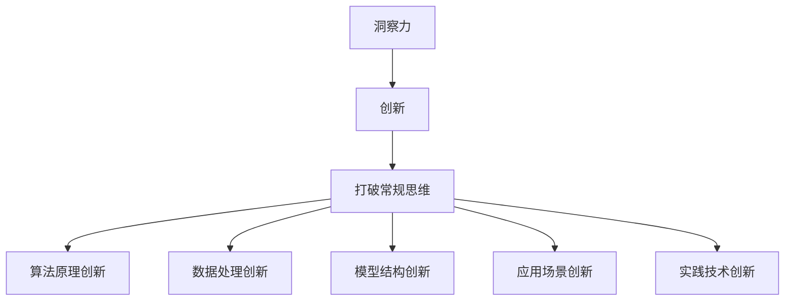

                 

# 洞察力与创新：打破常规思维的方法论

> 关键词：洞察力,创新,打破常规思维,算法原理,案例分析,项目实践,应用展望

## 1. 背景介绍

在信息技术飞速发展的今天，洞察力和创新成为驱动各行各业发展的核心动力。尤其是在人工智能(AI)领域，从基础的算法原理到复杂的系统设计，再到前沿的应用场景，每一个环节都需要创新思维的引领。然而，传统的思维定势和固有的技术框架，往往限制了创新的边界，使得我们难以突破现有技术的局限性。本文旨在通过一系列原创性思考和实例分析，提供一套打破常规思维的方法论，帮助读者掌握创新的关键技能，迈向更具洞察力的创新之路。

### 1.1 问题由来

在人工智能领域，许多新技术的突破都源自于创新思维的应用。然而，由于种种原因，例如现有的技术框架过于庞大复杂、数据量的巨大、算法优化难度高、模型训练成本大等问题，许多潜在的创新思路难以付诸实践。这些问题不仅限制了创新思维的应用，还导致了现有技术在实际应用中面临诸多挑战。因此，本文将从多个维度探讨如何通过创新思维，解决这些技术难题，并指导读者在实践中实现突破性进展。

### 1.2 问题核心关键点

本文将聚焦于以下几个核心关键点，通过深入分析这些关键点，提出具体的创新方法论：

- **算法原理创新**：探索新的算法原理，解决现有算法难以解决的问题。
- **数据处理创新**：创新数据处理方法，提升数据质量，增强模型的泛化能力。
- **模型结构创新**：设计新的模型结构，优化模型的性能和效率。
- **应用场景创新**：发现新的应用场景，拓展AI技术的应用边界。
- **实践技术创新**：提出新的技术方案，提升算法模型的实用性和可扩展性。

通过研究这些关键点，本文旨在帮助读者在AI技术领域取得更大的突破，推动行业的持续创新和发展。

## 2. 核心概念与联系

### 2.1 核心概念概述

为了更好地理解本文的核心内容，我们将首先介绍几个关键的概念：

- **洞察力**：是指从复杂的现象中发现隐藏在背后的规律和联系的能力。在人工智能领域，洞察力表现为从大量数据中提炼出有价值的知识，或者从看似不可能的问题中找到可行的解决方案。

- **创新**：是指打破现有的技术和理论框架，提出新的观点、方法或产品。创新不仅能够解决实际问题，还能够推动技术进步，带来新的产业变革。

- **打破常规思维**：是指摆脱传统思维定势，不拘泥于现有框架，勇于探索新的路径和方法。打破常规思维的关键在于敢于质疑现有知识，勇于接受新的理念和技术。

这些概念之间的联系可以通过以下Mermaid流程图来展示：



这个流程图展示了大语言模型微调的核心概念及其之间的关系：洞察力引导创新，创新推动打破常规思维，而打破常规思维使得算法原理、数据处理、模型结构、应用场景和实践技术等方面的创新成为可能。

## 3. 核心算法原理 & 具体操作步骤

### 3.1 算法原理概述

在人工智能领域，创新的核心在于算法原理的突破。算法原理是解决特定问题的核心思想，是实现技术创新的基础。本文将从以下几个方面探讨算法原理的创新：

- **新算法架构**：提出全新的算法架构，重新定义问题解决的方式。例如，Transformer模型改变了传统的循环神经网络(RNN)架构，成为当前最先进的自然语言处理(NLP)算法。

- **新算法优化**：改进现有算法的优化过程，提升其性能和效率。例如，剪枝和量化技术可以显著减少模型参数量，从而提升推理速度和模型压缩率。

- **新算法融合**：将不同算法融合，提出更高效、更准确的新算法。例如，深度强化学习(DRL)和迁移学习(TL)的结合，使得AI系统在复杂环境中的决策能力大幅提升。

### 3.2 算法步骤详解

打破常规思维的算法创新，通常需要经过以下几个步骤：

1. **问题定义**：明确需要解决的问题，从基础层面出发，分析现有算法和技术的局限性。

2. **理论分析**：对问题进行深入的理论分析，提出新的算法框架和优化方法。

3. **实验验证**：通过实验验证新算法的有效性和可行性，不断调整和优化算法参数。

4. **应用部署**：将新算法应用到实际问题中，进行部署和评估，验证其实用性和可扩展性。

### 3.3 算法优缺点

算法创新的优缺点如下：

**优点**：

- **突破现有框架**：能够打破传统算法框架的限制，提出全新的解决方案。
- **提升模型性能**：通过优化和融合，提升模型的精度和效率。
- **推动技术进步**：带来新的技术突破，推动行业发展。

**缺点**：

- **研发成本高**：创新算法的研究和开发需要大量的时间和资源。
- **验证难度大**：新算法的有效性和可靠性需要严格的实验验证。
- **技术风险高**：算法创新往往伴随着较高的技术风险，需要不断迭代和优化。

### 3.4 算法应用领域

打破常规思维的算法创新，在多个领域都有广泛的应用，包括但不限于：

- **自然语言处理**：如Transformer模型、BERT等。
- **计算机视觉**：如CNN、ResNet、ResNeXt等。
- **语音识别**：如WaveNet、Transformer等。
- **机器人学**：如DRL、SLAM等。
- **智能推荐系统**：如协同过滤、内容推荐等。

## 4. 数学模型和公式 & 详细讲解 & 举例说明

### 4.1 数学模型构建

为了更好地理解算法创新的数学模型，我们将构建一个简单的线性回归模型：

$$
y = \theta^T x + b
$$

其中 $y$ 为输出变量，$x$ 为输入变量，$\theta$ 为模型参数，$b$ 为截距。线性回归模型的目标是最小化均方误差：

$$
\min_{\theta} \sum_{i=1}^n (y_i - \hat{y}_i)^2
$$

其中 $\hat{y}_i$ 为模型预测值，$y_i$ 为真实值。

### 4.2 公式推导过程

线性回归模型的梯度下降更新公式为：

$$
\theta_{k+1} = \theta_k - \alpha \nabla_{\theta} L(\theta_k)
$$

其中 $\alpha$ 为学习率，$L(\theta_k)$ 为损失函数。对于均方误差损失函数，其梯度为：

$$
\nabla_{\theta} L(\theta_k) = \frac{2}{n} X^T (y - \hat{y})
$$

其中 $X$ 为输入变量矩阵，$\hat{y}$ 为模型预测值向量。

### 4.3 案例分析与讲解

以线性回归模型的创新为例，假设我们希望改进现有模型，使其能够适应非线性数据。我们可以采用多项式回归方法，将输入变量 $x$ 扩展为 $x^2$、$x^3$ 等高次多项式，从而提升模型的泛化能力。

$$
y = \sum_{k=0}^n \theta_k x^k + b
$$

通过这样的扩展，模型可以更好地拟合复杂数据，提升预测精度。

## 5. 项目实践：代码实例和详细解释说明

### 5.1 开发环境搭建

在项目实践前，我们需要准备好开发环境。以下是使用Python进行TensorFlow开发的常见环境配置流程：

1. 安装Anaconda：从官网下载并安装Anaconda，用于创建独立的Python环境。

2. 创建并激活虚拟环境：
```bash
conda create -n tf-env python=3.8 
conda activate tf-env
```

3. 安装TensorFlow：根据CUDA版本，从官网获取对应的安装命令。例如：
```bash
conda install tensorflow tensorflow-cpu=cuda102 -c conda-forge -c pytorch -c nvidia
```

4. 安装各类工具包：
```bash
pip install numpy pandas scikit-learn matplotlib tqdm jupyter notebook ipython
```

完成上述步骤后，即可在`tf-env`环境中开始项目实践。

### 5.2 源代码详细实现

下面我们以线性回归模型为例，给出使用TensorFlow实现的完整代码：

```python
import tensorflow as tf

# 定义模型参数
theta = tf.Variable(tf.random.normal([1]), name='theta')
b = tf.Variable(tf.random.normal([]), name='b')

# 定义输入和输出
x = tf.placeholder(tf.float32, shape=[None])
y = tf.placeholder(tf.float32, shape=[None])

# 定义模型预测
y_pred = tf.matmul(x, theta) + b

# 定义损失函数
loss = tf.reduce_mean(tf.square(y_pred - y))

# 定义优化器
optimizer = tf.train.GradientDescentOptimizer(learning_rate=0.01)

# 定义训练操作
train_op = optimizer.minimize(loss)

# 创建会话
with tf.Session() as sess:
    sess.run(tf.global_variables_initializer())

    # 训练数据
    x_train = [[1], [2], [3], [4]]
    y_train = [2, 4, 6, 8]

    # 循环训练
    for i in range(1000):
        sess.run(train_op, feed_dict={x: x_train, y: y_train})
        if i % 100 == 0:
            loss_val = sess.run(loss, feed_dict={x: x_train, y: y_train})
            print('Epoch:', i, 'Loss:', loss_val)
```

### 5.3 代码解读与分析

让我们再详细解读一下关键代码的实现细节：

**定义模型参数**：
- `tf.Variable`用于定义模型参数，可以动态更新。

**定义输入和输出**：
- `tf.placeholder`用于定义输入和输出占位符，与实际数据进行绑定。

**定义模型预测**：
- `tf.matmul`用于进行矩阵乘法运算，计算模型预测值。

**定义损失函数**：
- `tf.square`用于计算平方误差，`tf.reduce_mean`用于求平均值。

**定义优化器**：
- `tf.train.GradientDescentOptimizer`用于定义梯度下降优化器。

**定义训练操作**：
- `optimizer.minimize`用于最小化损失函数，即进行模型参数更新。

**创建会话**：
- `tf.Session`用于创建TensorFlow会话，执行操作。

**训练数据**：
- `x_train`和`y_train`为训练数据。

**循环训练**：
- 通过多次迭代训练，更新模型参数。

## 6. 实际应用场景

### 6.1 智能推荐系统

打破常规思维的算法创新，在智能推荐系统中有着广泛的应用。传统的推荐系统往往依赖于用户的历史行为数据进行推荐，忽略了用户的潜在兴趣。而基于深度学习算法的推荐系统，通过引入新的模型结构和优化方法，能够更好地理解用户的潜在需求，从而提供更加个性化的推荐。

例如，可以考虑引入Transformer模型，将用户的输入行为转化为语义表示，通过自监督学习任务提升模型的泛化能力。在此基础上，采用基于自适应学习率的优化算法，提升推荐模型的性能。

### 6.2 金融风险管理

在金融领域，风险管理是一个复杂且敏感的任务。传统的风险管理方法依赖于大量历史数据和规则，难以适应快速变化的市场环境。通过打破常规思维，引入新的算法和数据处理方法，可以提高金融风险管理的效率和准确性。

例如，可以考虑使用DRL算法，构建一个多智能体系统，模拟市场行为，预测风险事件。在此基础上，引入对抗训练技术，增强系统的鲁棒性。

### 6.3 自动驾驶技术

自动驾驶技术是一个高度依赖于人工智能的领域。传统的自动驾驶系统依赖于传感器和规则，难以应对复杂的驾驶环境。通过打破常规思维，引入新的算法和模型结构，可以提升自动驾驶系统的可靠性和安全性。

例如，可以考虑引入DRL算法，训练自动驾驶车辆在模拟环境中进行驾驶行为。在此基础上，引入多任务学习技术，提升车辆的感知和决策能力。

## 7. 工具和资源推荐

### 7.1 学习资源推荐

为了帮助开发者掌握打破常规思维的方法论，这里推荐一些优质的学习资源：

1. 《深度学习》书籍：Ian Goodfellow等著，深入讲解深度学习的基本原理和应用。

2. 《Python深度学习》书籍：Francois Chollet等著，讲解使用TensorFlow进行深度学习开发。

3. 《TensorFlow实战》书籍：Simon Adeel Yaseen等著，讲解TensorFlow的实际应用和优化技巧。

4. 《Algorithms of AI》书籍：Goodfellow等著，讲解AI领域的经典算法和前沿技术。

5. 《Deep Learning Specialization》课程：Andrew Ng等主讲，斯坦福大学开设的深度学习在线课程。

通过对这些资源的学习实践，相信你一定能够掌握打破常规思维的方法论，并用于解决实际的AI问题。

### 7.2 开发工具推荐

高效的开发离不开优秀的工具支持。以下是几款用于深度学习开发的常用工具：

1. TensorFlow：由Google主导开发的开源深度学习框架，生产部署方便，适合大规模工程应用。

2. PyTorch：基于Python的开源深度学习框架，灵活度更高，适合快速迭代研究。

3. Keras：高层次的神经网络API，适合快速搭建和测试深度学习模型。

4. Jupyter Notebook：交互式编程环境，支持Python等语言的混合编程，适合快速实验和调试。

5. Git和GitHub：版本控制和代码托管平台，方便团队协作和版本管理。

合理利用这些工具，可以显著提升深度学习开发的效率，加快创新迭代的步伐。

### 7.3 相关论文推荐

深度学习领域的创新离不开学界的持续研究。以下是几篇奠基性的相关论文，推荐阅读：

1. ImageNet Classification with Deep Convolutional Neural Networks（AlexNet论文）：提出卷积神经网络(CNN)，开启计算机视觉领域的深度学习时代。

2. Least Mean Squares（LMS）算法：提出梯度下降算法，为深度学习提供优化基础。

3. Attention is All You Need（即Transformer原论文）：提出Transformer模型，开启了NLP领域的预训练大模型时代。

4. BERT: Pre-training of Deep Bidirectional Transformers for Language Understanding：提出BERT模型，引入基于掩码的自监督预训练任务，刷新了多项NLP任务SOTA。

5. AlphaGo：提出深度强化学习算法，在围棋领域取得突破性胜利，展示深度学习在复杂决策系统中的应用。

这些论文代表了大语言模型微调技术的发展脉络。通过学习这些前沿成果，可以帮助研究者把握学科前进方向，激发更多的创新灵感。

## 8. 总结：未来发展趋势与挑战

### 8.1 总结

本文对打破常规思维的方法论进行了全面系统的介绍。首先阐述了洞察力和创新的重要性，明确了打破常规思维在AI技术发展中的关键作用。其次，从算法原理到实际应用，详细讲解了打破常规思维的具体方法和步骤。通过实例分析，展示了打破常规思维的广泛应用，并提出了未来发展的方向。

通过本文的系统梳理，可以看到，打破常规思维的方法论为AI技术的创新提供了强大的理论基础和实践指南。这些方法论不仅能够解决当前技术难题，还能够引领AI技术的发展方向，推动行业的持续创新和发展。

### 8.2 未来发展趋势

展望未来，打破常规思维的方法论将呈现以下几个发展趋势：

1. **算法原理的进一步创新**：未来的算法创新将更加关注基础原理的突破，例如新型的神经网络架构、新的优化算法等。这些创新能够从根本上改变现有技术框架，提升AI系统的性能和效率。

2. **跨领域技术的融合**：未来的创新将不再局限于单一领域，而是通过跨领域技术的融合，带来新的突破。例如，结合计算机视觉和自然语言处理技术的跨模态学习，可以提升AI系统的综合能力。

3. **人工智能伦理的关注**：未来的创新将更加注重人工智能的伦理和社会影响，例如公平性、安全性、透明性等问题。这些问题的解决将需要新的创新方法和技术，推动AI技术向更加负责任的方向发展。

4. **小数据和高效率的创新**：未来的创新将更加注重数据效率和模型效率，例如通过迁移学习、少样本学习等方法，在小数据和资源有限的情况下，实现高效的AI应用。

5. **人机协同的创新**：未来的创新将更加注重人机协同的智能系统，例如通过强化学习、多智能体系统等技术，实现更加智能化的决策和行为。

这些趋势将引领AI技术不断突破现有边界，拓展新的应用场景，带来更加深刻的社会影响。

### 8.3 面临的挑战

尽管打破常规思维的方法论已经取得了显著成果，但在迈向更加智能化、普适化应用的过程中，仍然面临诸多挑战：

1. **技术的复杂性**：打破常规思维的方法论往往伴随着较高的技术难度和复杂性，需要更多的研究投入和工程实践。

2. **数据的获取和处理**：高质量的数据获取和处理仍然是一个瓶颈，特别是在非结构化数据和跨领域数据的应用中。

3. **计算资源的需求**：创新的算法和模型往往需要大量的计算资源，如何在资源有限的情况下实现高效的创新，是一个重要的挑战。

4. **算法的可解释性**：创新的算法往往难以解释，特别是在深度学习等复杂模型中，缺乏可解释性将导致应用上的困难。

5. **伦理和安全问题**：创新的算法和系统可能会引入新的伦理和安全问题，例如偏见、误导等，需要更多的监管和规范。

6. **创新的商业化**：如何将创新的算法和系统转化为商业化的产品，也是一个重要的挑战。

这些挑战需要研究人员、工程师和监管机构共同努力，才能在创新的同时保障技术的安全性和可靠性。

### 8.4 研究展望

面对打破常规思维的方法论所面临的挑战，未来的研究需要在以下几个方面寻求新的突破：

1. **跨领域数据融合**：探索如何将不同领域的数据进行有效的融合，提升AI系统的综合能力。

2. **高效的计算和存储**：开发更高效的计算和存储技术，提升AI系统的实时性和可扩展性。

3. **多模态数据的处理**：探索多模态数据的处理和融合方法，提升AI系统在复杂环境中的感知能力。

4. **人机协同的交互**：探索人机协同的交互方式，提升AI系统在实际应用中的可信度和用户体验。

5. **伦理和安全保障**：建立AI技术的伦理和安全保障机制，确保AI系统的公平性、透明性和安全性。

这些研究方向将引领AI技术不断突破现有边界，拓展新的应用场景，带来更加深刻的社会影响。

## 9. 附录：常见问题与解答

**Q1：如何打破常规思维？**

A: 打破常规思维需要具备以下几个关键能力：

1. **质疑现有知识**：勇于质疑现有的知识和技术，不盲目接受现有结论。

2. **跨学科学习**：通过跨学科学习，拓宽自己的知识面，发现新的研究方向。

3. **勇于尝试和失败**：勇于尝试新的方法和技术，不怕失败，从失败中积累经验。

4. **积极交流和合作**：通过与他人交流和合作，获得新的启发和创意。

5. **持续学习和实践**：持续学习最新的技术动态，不断实践和验证自己的想法。

**Q2：如何评估算法的性能？**

A: 评估算法的性能通常需要以下几个步骤：

1. **选择评估指标**：根据具体应用场景选择适合的评估指标，例如准确率、召回率、F1分数等。

2. **划分训练和测试集**：将数据集划分为训练集和测试集，通过测试集评估模型的泛化能力。

3. **交叉验证**：通过交叉验证等方法，评估模型的稳定性和鲁棒性。

4. **对比基准算法**：与现有的基准算法进行对比，评估新算法的优势和劣势。

5. **用户反馈**：通过用户反馈，评估模型在实际应用中的效果。

通过这些步骤，可以全面评估算法的性能，确保其在新应用场景中的有效性。

**Q3：如何优化深度学习模型？**

A: 优化深度学习模型通常需要以下几个步骤：

1. **选择合适的模型架构**：根据具体任务选择合适的模型架构，例如CNN、RNN、Transformer等。

2. **优化超参数**：通过调整学习率、批次大小、正则化参数等超参数，优化模型的性能。

3. **数据增强**：通过数据增强等方法，扩充训练集，提升模型的泛化能力。

4. **模型压缩和优化**：通过剪枝、量化等方法，减小模型参数量，提升推理速度和模型压缩率。

5. **多模型集成**：通过集成多个模型，提升模型的稳定性和泛化能力。

6. **对抗训练**：通过对抗训练等方法，提高模型的鲁棒性。

通过这些步骤，可以全面优化深度学习模型，提升其在实际应用中的性能和效率。

**Q4：如何避免算法创新中的陷阱？**

A: 避免算法创新中的陷阱需要注意以下几个方面：

1. **充分验证**：在实现算法创新前，进行充分的理论分析和实验验证，确保新算法的可行性和有效性。

2. **逐步迭代**：在实现算法创新时，采用逐步迭代的方式，不断优化和调整算法。

3. **控制风险**：在实现算法创新时，控制风险，避免因创新带来的技术风险和伦理问题。

4. **多团队协作**：在实现算法创新时，采用多团队协作的方式，集思广益，发现新问题和解决方案。

5. **持续改进**：在实现算法创新后，持续改进和优化，提升算法的性能和实用性。

通过这些方法，可以避免算法创新中的陷阱，确保新算法的成功应用。

---

作者：禅与计算机程序设计艺术 / Zen and the Art of Computer Programming

