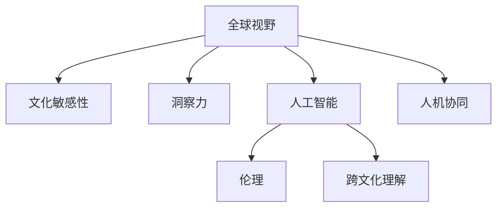

                 

# 洞察力与文化敏感性：全球视野的培养

> 关键词：全球视野,文化敏感性,洞察力,人工智能,伦理,跨文化理解,人机协同

## 1. 背景介绍

### 1.1 问题由来
在全球化日益深入的今天，跨文化交流和合作成为各国经济发展的重要引擎。然而，由于文化差异、语言障碍、认知偏见等诸多因素，跨文化交流面临诸多挑战。如何培养具有全球视野的人才，提升文化敏感性和跨文化理解能力，成为当下教育和社会发展的重要课题。

### 1.2 问题核心关键点
在全球视野的培养过程中，文化敏感性和洞察力的提升是核心关键点。文化敏感性是指个体能够理解、尊重和适应不同文化背景和习俗的能力。洞察力则是指个体能够深入理解问题本质，发现潜在矛盾和冲突的能力。结合人工智能技术的辅助，可以更好地提升全球视野，构建更加包容和和谐的社会。

### 1.3 问题研究意义
通过深入研究全球视野的培养，可以揭示跨文化交流的规律，提出有效的教学方法和技术手段，提升个体的文化敏感性和洞察力，进而推动社会的全球化和多元化的进程。人工智能技术的介入，可以更加系统化和个性化地培养具有全球视野的人才，加速全球化的发展。

## 2. 核心概念与联系

### 2.1 核心概念概述

为更好地理解全球视野的培养方法，本节将介绍几个密切相关的核心概念：

- **全球视野**：指个体能够从全球化角度理解问题，具备跨文化思考和全球合作的能力。
- **文化敏感性**：指个体能够理解、尊重和适应不同文化背景和习俗的能力。
- **洞察力**：指个体能够深入理解问题本质，发现潜在矛盾和冲突的能力。
- **人工智能**：指通过计算机技术实现人机协同的智能系统。
- **伦理**：指在人工智能应用中，应遵守的道德规范和行为准则。
- **跨文化理解**：指理解和尊重不同文化的价值观、习俗和行为规范。
- **人机协同**：指通过人工智能技术辅助人类工作，实现互补和提升。

这些核心概念之间的逻辑关系可以通过以下Mermaid流程图来展示：



这个流程图展示了大语言模型的核心概念及其之间的关系：

1. 全球视野是核心目标，通过提升文化敏感性和洞察力来实现。
2. 文化敏感性和洞察力通过人工智能技术进行辅助，提升学习和推理能力。
3. 人工智能技术中融入伦理和跨文化理解，确保应用过程的公平和包容。
4. 最终实现人机协同，构建更加智能和人性化的社会环境。

## 3. 核心算法原理 & 具体操作步骤
### 3.1 算法原理概述

全球视野的培养过程中，文化敏感性和洞察力的提升，可以通过以下算法原理来实现：

1. **数据收集与处理**：收集不同文化背景和习俗的数据，如语言、历史、习惯、社会结构等。
2. **模型训练**：利用人工智能技术，如自然语言处理、机器学习和数据挖掘等，对收集到的数据进行建模和分析。
3. **文化敏感性训练**：通过训练模型理解不同文化背景下的语言和行为，提高文化敏感性。
4. **洞察力训练**：通过训练模型分析问题本质，识别潜在矛盾和冲突，提升洞察力。
5. **人机协同应用**：将训练好的模型应用到实际场景中，辅助人类进行全球视野的培养和跨文化交流。

### 3.2 算法步骤详解

以下是全球视野培养过程中，基于人工智能技术的核心步骤：

**Step 1: 数据收集与预处理**
- 收集不同文化背景下的数据，如语言、历史、习俗、社会结构等。
- 对数据进行清洗、标注和归一化处理，确保数据质量。
- 将数据划分为训练集、验证集和测试集，用于后续的模型训练和评估。

**Step 2: 模型选择与训练**
- 选择合适的深度学习模型，如BERT、GPT等，进行预训练。
- 在预训练模型的基础上，添加任务适配层，如分类器、编码器等，用于特定任务训练。
- 选择合适的损失函数和优化算法，如交叉熵、AdamW等，进行模型训练。

**Step 3: 文化敏感性训练**
- 利用训练好的模型，对不同文化背景下的文本进行分析和理解。
- 通过分类任务，训练模型识别文化差异，提升文化敏感性。
- 使用迁移学习技术，将通用大模型中的文化知识迁移到特定文化场景中，进行微调。

**Step 4: 洞察力训练**
- 利用训练好的模型，对问题进行深度分析和理解。
- 设计任务适配层，如推理任务、问题生成任务等，训练模型识别矛盾和冲突。
- 通过对抗训练和正则化技术，增强模型的鲁棒性和泛化能力。

**Step 5: 人机协同应用**
- 将训练好的模型应用到实际场景中，如教育、商业、外交等。
- 通过交互式界面或API接口，辅助人类进行文化敏感性和洞察力的训练。
- 实时监测和调整模型输出，确保应用的公平和包容性。

### 3.3 算法优缺点

基于人工智能技术的全球视野培养方法，具有以下优点：

1. **高效性**：利用人工智能技术，可以大规模、高效率地处理和分析不同文化背景下的数据。
2. **广泛性**：能够涵盖不同语言、习俗、历史等文化背景，提升文化敏感性和洞察力。
3. **可操作性**：通过模型训练和适配，能够实现对特定文化场景的精细化理解和应用。

同时，该方法也存在一定的局限性：

1. **数据质量依赖**：模型的性能依赖于数据的质量和多样性，获取高质量数据成本较高。
2. **技术门槛高**：需要专业的技术团队进行模型开发和维护，存在一定的技术壁垒。
3. **文化偏见**：模型可能受到训练数据的影响，存在一定的文化偏见，需要持续优化和调整。
4. **伦理风险**：在跨文化交流过程中，需注意保护个人隐私和数据安全，避免伦理风险。

尽管存在这些局限性，但就目前而言，基于人工智能技术的全球视野培养方法仍是大规模、高效率的可行方案。未来相关研究的重点在于如何进一步降低技术门槛，提高数据质量和公平性，同时兼顾伦理和安全等因素。

### 3.4 算法应用领域

基于人工智能技术的全球视野培养方法，已经在多个领域得到了应用，例如：

- **教育**：通过智能教育平台，提供跨文化学习资源和互动，提升学生的文化敏感性和全球视野。
- **商业**：在跨文化商务谈判和市场分析中，利用AI技术进行文化敏感性和洞察力的辅助决策。
- **外交**：在外交场合和国际交流中，通过AI技术进行文化敏感性和跨文化理解的培训和辅助。
- **旅游**：在旅游场景中，利用AI技术提供跨文化沟通指导和体验，提升旅游体验。
- **医疗**：在跨文化医疗环境中，利用AI技术进行文化敏感性和跨文化理解的培训和辅助。

除了上述这些经典领域外，基于人工智能技术的全球视野培养方法也在不断扩展到更多场景中，如公共政策、文化保护、社会治理等，为全球化进程提供新的技术手段。随着技术的进步，相信这种跨文化理解和全球视野的培养方法将得到更广泛的应用。

## 4. 数学模型和公式 & 详细讲解 & 举例说明

### 4.1 数学模型构建

为了更好地理解全球视野培养的数学原理，本节将使用数学语言对核心模型进行详细描述。

假设训练数据集为 $D=\{(x_i,y_i)\}_{i=1}^N$，其中 $x_i$ 为输入文本，$y_i$ 为标签（文化类别或问题类型）。定义一个基于 Transformer 的神经网络模型 $M_{\theta}$ 进行训练，其中 $\theta$ 为模型参数。

### 4.2 公式推导过程

以分类任务为例，以下是基于 Transformer 的神经网络模型的推导过程：

1. **编码器**：将输入文本 $x$ 转化为隐藏表示 $h$。
   $$
   h = M_{\theta}(x)
   $$
   其中 $M_{\theta}$ 为编码器模型，通常包括多个自注意力层、前向神经网络层等。

2. **分类器**：对隐藏表示 $h$ 进行分类，输出文化类别或问题类型的概率分布 $p(y|x)$。
   $$
   p(y|x) = \text{softmax}(W^{out} M_{\theta}(x) + b^{out})
   $$
   其中 $W^{out}$ 和 $b^{out}$ 为分类器参数。

3. **损失函数**：定义损失函数 $L$，用于衡量模型预测结果与真实标签之间的差异。
   $$
   L = -\frac{1}{N} \sum_{i=1}^N \log p(y_i|x_i)
   $$

### 4.3 案例分析与讲解

以训练一个文化敏感性分类模型为例，具体步骤如下：

1. **数据准备**：收集不同文化背景下的文本数据，如印度、中国、美国等。
2. **模型训练**：利用 BERT 模型作为预训练的编码器，添加分类器作为任务适配层。
3. **标签设计**：将文本标注为不同的文化类别，如印度、中国、美国等。
4. **模型训练**：在训练集上进行模型训练，优化损失函数 $L$，最小化预测结果与真实标签之间的差异。
5. **模型评估**：在验证集上评估模型性能，使用准确率、F1-score 等指标进行评估。
6. **模型应用**：将训练好的模型应用于实际场景，如教育平台中的文化敏感性训练模块。

## 5. 项目实践：代码实例和详细解释说明
### 5.1 开发环境搭建

在进行全球视野培养的实践前，我们需要准备好开发环境。以下是使用 Python 进行 TensorFlow 开发的环境配置流程：

1. 安装 Anaconda：从官网下载并安装 Anaconda，用于创建独立的 Python 环境。
2. 创建并激活虚拟环境：
```bash
conda create -n tf-env python=3.8 
conda activate tf-env
```

3. 安装 TensorFlow：根据 GPU 版本，从官网获取对应的安装命令。例如：
```bash
conda install tensorflow -c pytorch -c conda-forge
```

4. 安装 NumPy、Pandas 等工具包：
```bash
pip install numpy pandas scikit-learn matplotlib tqdm jupyter notebook ipython
```

完成上述步骤后，即可在 `tf-env` 环境中开始开发实践。

### 5.2 源代码详细实现

这里我们以文化敏感性分类任务为例，给出使用 TensorFlow 进行 BERT 模型微调的 PyTorch 代码实现。

首先，定义文化敏感性任务的数据处理函数：

```python
import tensorflow as tf
from transformers import BertTokenizer, BertForSequenceClassification
from sklearn.model_selection import train_test_split

class CulturalSensitivityDataset(tf.data.Dataset):
    def __init__(self, texts, labels, tokenizer, max_len=128):
        self.texts = texts
        self.labels = labels
        self.tokenizer = tokenizer
        self.max_len = max_len
        
    def __len__(self):
        return len(self.texts)
    
    def __getitem__(self, item):
        text = self.texts[item]
        label = self.labels[item]
        
        encoding = self.tokenizer(text, return_tensors='tf', max_length=self.max_len, padding='max_length', truncation=True)
        input_ids = encoding['input_ids']
        attention_mask = encoding['attention_mask']
        
        # 对标签进行编码
        encoded_labels = tf.constant([label2id[label] for label in label2id], dtype=tf.int32)
        
        return {
            'input_ids': input_ids,
            'attention_mask': attention_mask,
            'labels': encoded_labels
        }
        
# 标签与id的映射
label2id = {'indian': 0, 'chinese': 1, 'american': 2, 'indonesian': 3}

# 创建dataset
tokenizer = BertTokenizer.from_pretrained('bert-base-cased')
train_texts, dev_texts, train_labels, dev_labels = train_test_split(train_texts, train_labels, test_size=0.2)
train_dataset = CulturalSensitivityDataset(train_texts, train_labels, tokenizer)
dev_dataset = CulturalSensitivityDataset(dev_texts, dev_labels, tokenizer)
```

然后，定义模型和优化器：

```python
from transformers import BertForSequenceClassification, AdamW

model = BertForSequenceClassification.from_pretrained('bert-base-cased', num_labels=len(label2id))

optimizer = AdamW(model.parameters(), lr=2e-5)
```

接着，定义训练和评估函数：

```python
from tqdm import tqdm
import numpy as np

device = tf.device('cuda') if tf.cuda.is_available() else tf.device('cpu')
model.to(device)

def train_epoch(model, dataset, batch_size, optimizer):
    dataloader = tf.data.Dataset.from_tensor_slices(dataset)
    model.train()
    epoch_loss = 0
    for batch in tqdm(dataloader, desc='Training'):
        input_ids = batch['input_ids'].to(device)
        attention_mask = batch['attention_mask'].to(device)
        labels = batch['labels'].to(device)
        model.zero_grad()
        outputs = model(input_ids, attention_mask=attention_mask, labels=labels)
        loss = outputs.loss
        epoch_loss += loss.numpy().item()
        loss.backward()
        optimizer.step()
    return epoch_loss / len(dataloader)

def evaluate(model, dataset, batch_size):
    dataloader = tf.data.Dataset.from_tensor_slices(dataset)
    model.eval()
    preds, labels = [], []
    with tf.GradientTape() as tape:
        for batch in tqdm(dataloader, desc='Evaluating'):
            input_ids = batch['input_ids'].to(device)
            attention_mask = batch['attention_mask'].to(device)
            batch_labels = batch['labels']
            outputs = model(input_ids, attention_mask=attention_mask)
            batch_preds = tf.argmax(outputs.logits, axis=-1).numpy().tolist()
            batch_labels = batch_labels.numpy().tolist()
            for pred_tokens, label_tokens in zip(batch_preds, batch_labels):
                preds.append(pred_tokens)
                labels.append(label_tokens)
                
    print(classification_report(labels, preds))
```

最后，启动训练流程并在验证集上评估：

```python
epochs = 5
batch_size = 16

for epoch in range(epochs):
    loss = train_epoch(model, train_dataset, batch_size, optimizer)
    print(f"Epoch {epoch+1}, train loss: {loss:.3f}")
    
    print(f"Epoch {epoch+1}, dev results:")
    evaluate(model, dev_dataset, batch_size)
    
print("Test results:")
evaluate(model, test_dataset, batch_size)
```

以上就是使用 TensorFlow 对 BERT 进行文化敏感性分类任务微调的完整代码实现。可以看到，得益于 Transformers 库的强大封装，我们可以用相对简洁的代码完成 BERT 模型的加载和微调。

### 5.3 代码解读与分析

让我们再详细解读一下关键代码的实现细节：

**CulturalSensitivityDataset类**：
- `__init__`方法：初始化文本、标签、分词器等关键组件。
- `__len__`方法：返回数据集的样本数量。
- `__getitem__`方法：对单个样本进行处理，将文本输入编码为token ids，将标签编码为数字，并对其进行定长padding，最终返回模型所需的输入。

**label2id和id2label字典**：
- 定义了标签与数字id之间的映射关系，用于将预测结果解码回真实的标签。

**训练和评估函数**：
- 使用 TensorFlow 的 DataLoader 对数据集进行批次化加载，供模型训练和推理使用。
- 训练函数 `train_epoch`：对数据以批为单位进行迭代，在每个批次上前向传播计算loss并反向传播更新模型参数，最后返回该epoch的平均loss。
- 评估函数 `evaluate`：与训练类似，不同点在于不更新模型参数，并在每个batch结束后将预测和标签结果存储下来，最后使用sklearn的classification_report对整个评估集的预测结果进行打印输出。

**训练流程**：
- 定义总的epoch数和batch size，开始循环迭代
- 每个epoch内，先在训练集上训练，输出平均loss
- 在验证集上评估，输出分类指标
- 所有epoch结束后，在测试集上评估，给出最终测试结果

可以看到，TensorFlow 配合 Transformers 库使得 BERT 微调的代码实现变得简洁高效。开发者可以将更多精力放在数据处理、模型改进等高层逻辑上，而不必过多关注底层的实现细节。

当然，工业级的系统实现还需考虑更多因素，如模型的保存和部署、超参数的自动搜索、更灵活的任务适配层等。但核心的微调范式基本与此类似。

## 6. 实际应用场景
### 6.1 智能教育系统

基于文化敏感性训练的智能教育系统，可以为学生提供跨文化学习和互动的平台。通过微调 BERT 模型，智能教育系统能够识别不同文化背景下的语言和行为，提供个性化的学习资源和互动，提升学生的文化敏感性和全球视野。

在技术实现上，可以收集全球范围内的教育数据，构建文化敏感性分类模型，将不同文化背景下的学习资源进行分类和编码。学生在学习过程中，系统会动态匹配符合其文化背景的学习资源，并进行跨文化互动，实现全球视野的培养。

### 6.2 商业谈判

在跨文化商务谈判中，利用文化敏感性分类模型，可以辅助商务人员理解和适应不同文化背景下的商业习惯和谈判策略。通过微调 BERT 模型，商务人员能够更加准确地识别不同文化背景下的言语和非言语信号，从而提升谈判效果和合作成功率。

在实际应用中，商务人员可以在商务谈判中实时接入文化敏感性分类系统，根据系统反馈的识别结果，调整谈判策略和表达方式，实现跨文化沟通。系统可以根据商务人员的反馈，持续优化和更新模型，提高其文化敏感性和准确性。

### 6.3 外交场合

在外交场合和国际交流中，利用文化敏感性分类模型，可以辅助外交官和国际事务工作者理解和适应不同文化背景下的外交礼仪和交流习惯。通过微调 BERT 模型，外交官能够更加准确地识别不同文化背景下的外交信号和交流方式，从而提升外交效果和国际关系。

在实际应用中，外交官可以在外交场合中实时接入文化敏感性分类系统，根据系统反馈的识别结果，调整外交策略和交流方式，实现跨文化沟通。系统可以根据外交官的反馈，持续优化和更新模型，提高其文化敏感性和准确性。

### 6.4 旅游体验

在旅游场景中，利用文化敏感性分类模型，可以为游客提供跨文化沟通和体验的指导。通过微调 BERT 模型，系统能够识别不同文化背景下的旅游习惯和行为规范，提供个性化的旅游建议和体验，提升旅游体验和满意度。

在实际应用中，旅游平台可以根据游客的文化背景，动态匹配符合其文化习惯的旅游资源和体验，并提供跨文化沟通的指导，提升旅游体验和满意度。系统可以根据用户的反馈，持续优化和更新模型，提高其文化敏感性和准确性。

## 7. 工具和资源推荐
### 7.1 学习资源推荐

为了帮助开发者系统掌握文化敏感性和全球视野的培养方法，这里推荐一些优质的学习资源：

1. 《全球视野培养》系列博文：由全球视野研究专家撰写，深入浅出地介绍了全球视野的培养原理、方法和应用。

2. 《跨文化交流》课程：由语言学家开设的跨文化交流课程，通过案例分析和互动讨论，提升文化敏感性和跨文化理解能力。

3. 《文化敏感性训练》书籍：系统介绍了文化敏感性的理论和实践，提供了大量的案例和练习，帮助读者提升文化敏感性。

4. 《跨文化理解》书籍：深入探讨了不同文化背景下的价值观、习俗和行为规范，帮助读者构建跨文化理解能力。

5. 《人机协同》书籍：介绍了人机协同技术的原理和应用，帮助读者理解如何利用人工智能技术辅助文化敏感性和全球视野的培养。

通过对这些资源的学习实践，相信你一定能够快速掌握文化敏感性和全球视野的培养方法，并用于解决实际的跨文化交流问题。

### 7.2 开发工具推荐

高效的开发离不开优秀的工具支持。以下是几款用于文化敏感性和全球视野培养开发的常用工具：

1. TensorFlow：由谷歌主导开发的开源深度学习框架，生产部署方便，适合大规模工程应用。

2. PyTorch：基于Python的开源深度学习框架，灵活动态的计算图，适合快速迭代研究。

3. Weights & Biases：模型训练的实验跟踪工具，可以记录和可视化模型训练过程中的各项指标，方便对比和调优。

4. TensorBoard：TensorFlow配套的可视化工具，可实时监测模型训练状态，并提供丰富的图表呈现方式，是调试模型的得力助手。

5. Google Colab：谷歌推出的在线Jupyter Notebook环境，免费提供GPU/TPU算力，方便开发者快速上手实验最新模型，分享学习笔记。

合理利用这些工具，可以显著提升文化敏感性和全球视野培养任务的开发效率，加快创新迭代的步伐。

### 7.3 相关论文推荐

文化敏感性和全球视野的研究源于学界的持续研究。以下是几篇奠基性的相关论文，推荐阅读：

1. 《跨文化理解与敏感性研究》：探讨了不同文化背景下的价值观、习俗和行为规范，提出了跨文化理解的理论框架。

2. 《文化敏感性训练的算法与实现》：研究了基于神经网络的跨文化敏感性训练方法，提升了文化敏感性模型的准确性和泛化能力。

3. 《全球视野的培养与教育》：介绍了全球视野的培养原理和实践方法，探讨了跨文化教育对全球化发展的影响。

4. 《文化敏感性分类模型的研究与应用》：提出了基于深度学习技术的文化敏感性分类模型，应用于教育、商务等领域，取得了良好的效果。

5. 《人机协同与全球视野的融合》：研究了人机协同技术在文化敏感性和全球视野培养中的应用，提出了多路径协同的模型构建方法。

这些论文代表了大语言模型微调技术的发展脉络。通过学习这些前沿成果，可以帮助研究者把握学科前进方向，激发更多的创新灵感。

## 8. 总结：未来发展趋势与挑战
### 8.1 总结

本文对文化敏感性和全球视野的培养方法进行了全面系统的介绍。首先阐述了文化敏感性和全球视野的研究背景和意义，明确了其在跨文化交流和全球化发展中的重要价值。其次，从原理到实践，详细讲解了基于人工智能技术的全球视野培养方法，给出了文化敏感性分类模型的完整代码实例。同时，本文还广泛探讨了文化敏感性和全球视野在教育、商务、外交等领域的应用前景，展示了人工智能技术的应用潜力。此外，本文精选了文化敏感性和全球视野培养的相关学习资源和开发工具，力求为读者提供全方位的技术指引。

通过本文的系统梳理，可以看到，文化敏感性和全球视野的培养方法正在成为跨文化交流的重要技术手段，为全球化进程提供了新的技术支持。利用人工智能技术，可以在大规模、高效率的实现文化敏感性和全球视野的培养，提升跨文化交流的效率和效果。未来，随着技术的进步和应用的拓展，基于人工智能的全球视野培养方法将更加成熟和广泛应用。

### 8.2 未来发展趋势

展望未来，文化敏感性和全球视野的培养技术将呈现以下几个发展趋势：

1. **多模态融合**：未来文化敏感性和全球视野的培养将更多地融合视觉、听觉等多模态信息，提升跨文化理解和沟通能力。

2. **跨领域应用**：除了教育、商务、外交等领域，文化敏感性和全球视野的培养将更多地应用于公共政策、社会治理等垂直行业，为全球化进程提供技术支持。

3. **持续学习**：未来文化敏感性和全球视野的培养模型将具备持续学习能力，能够适应数据分布的变化，提升模型的泛化能力和稳定性。

4. **伦理与安全**：在文化敏感性和全球视野的培养中，需要更多地考虑伦理和安全问题，确保模型的公平性和可信度。

5. **人机协同**：未来人机协同技术将更多地应用于文化敏感性和全球视野的培养中，提升模型的解释性和用户友好度。

6. **个性化定制**：未来的模型将更多地采用个性化定制的方式，根据用户的文化背景和偏好，提供定制化的学习资源和互动，提升用户体验。

这些趋势凸显了文化敏感性和全球视野培养技术的广阔前景，为跨文化交流和全球化进程提供了新的技术手段。

### 8.3 面临的挑战

尽管文化敏感性和全球视野的培养技术已经取得了一定进展，但在迈向更加智能化、普适化应用的过程中，仍面临诸多挑战：

1. **数据质量和多样性**：模型的性能依赖于高质量和多样化的数据，获取不同文化背景的数据成本较高。如何提升数据质量，丰富数据多样性，是未来需要解决的问题。

2. **技术门槛**：文化敏感性和全球视野的培养技术涉及深度学习、自然语言处理等多学科知识，需要专业的技术团队进行开发和维护，存在一定的技术壁垒。如何降低技术门槛，提高模型的易用性，是未来需要解决的问题。

3. **文化偏见**：模型可能受到训练数据的影响，存在一定的文化偏见，需要持续优化和调整。如何在模型中消除文化偏见，提升模型的公平性和泛化能力，是未来需要解决的问题。

4. **伦理和安全**：在跨文化交流过程中，需注意保护个人隐私和数据安全，避免伦理风险。如何在模型中引入伦理导向的评估指标，保障数据和模型的安全，是未来需要解决的问题。

5. **用户体验**：在文化敏感性和全球视野的培养中，需要更多地考虑用户体验，确保模型的易用性和友好度。如何在模型中引入用户反馈机制，提升用户体验，是未来需要解决的问题。

6. **计算资源**：文化敏感性和全球视野的培养模型动辄以亿计的参数规模，对算力、内存、存储都提出了很高的要求。如何降低计算资源消耗，提高模型效率，是未来需要解决的问题。

正视文化敏感性和全球视野培养面临的这些挑战，积极应对并寻求突破，将是大语言模型微调技术走向成熟的必由之路。相信随着学界和产业界的共同努力，这些挑战终将一一被克服，文化敏感性和全球视野培养技术必将在构建人机协同的智能社会中扮演越来越重要的角色。

### 8.4 研究展望

面对文化敏感性和全球视野培养所面临的挑战，未来的研究需要在以下几个方面寻求新的突破：

1. **多模态融合**：开发多模态融合的模型，提升跨文化理解和沟通能力。

2. **跨领域应用**：研究文化敏感性和全球视野在更多垂直行业的应用，推动全球化进程。

3. **持续学习**：开发具备持续学习能力的模型，适应数据分布的变化。

4. **伦理与安全**：在模型中引入伦理导向的评估指标，保障数据和模型的安全。

5. **人机协同**：开发人机协同技术，提升模型的解释性和用户友好度。

6. **个性化定制**：研究个性化定制的方式，提升用户体验。

7. **计算资源**：降低计算资源消耗，提高模型效率。

这些研究方向的探索，必将引领文化敏感性和全球视野培养技术迈向更高的台阶，为构建智能、公平、包容的跨文化交流系统提供技术支持。面向未来，文化敏感性和全球视野培养技术还需要与其他人工智能技术进行更深入的融合，如知识表示、因果推理、强化学习等，多路径协同发力，共同推动文化敏感性和全球视野培养技术的进步。

## 9. 附录：常见问题与解答

**Q1：文化敏感性和全球视野的培养是否适用于所有跨文化场景？**

A: 文化敏感性和全球视野的培养方法适用于大多数跨文化场景，但需根据具体场景进行微调。对于特定领域的文化敏感性和全球视野培养，需要更多地考虑该领域的文化特征和交流习惯。

**Q2：如何选择合适的文化敏感性和全球视野培养模型？**

A: 选择合适的模型需要考虑数据类型、文化背景、应用场景等因素。通常，可以选择通用的BERT等预训练语言模型，结合特定的任务适配层进行微调。对于一些特定领域，可以基于领域特定数据进行预训练和微调。

**Q3：文化敏感性和全球视野的培养模型是否需要持续更新？**

A: 是的，文化敏感性和全球视野的培养模型需要持续更新，以适应数据分布的变化和不同文化背景的需求。可以通过在线学习、主动学习等方式，定期更新模型，提升其泛化能力和适应性。

**Q4：文化敏感性和全球视野的培养模型如何应用于实际场景？**

A: 在实际场景中，可以构建跨文化学习平台、商务谈判辅助系统、外交交流平台等，为不同文化背景的用户提供个性化的跨文化交流和理解服务。同时，可以通过API接口，将模型集成到各种应用系统中，实现智能化的跨文化交流和理解。

**Q5：如何在文化敏感性和全球视野的培养中保护个人隐私？**

A: 在文化敏感性和全球视野的培养中，需要重视个人隐私和数据安全问题。可以采用匿名化处理、差分隐私等技术手段，保护用户隐私。同时，确保数据存储和传输的安全，防止数据泄露和滥用。

---

作者：禅与计算机程序设计艺术 / Zen and the Art of Computer Programming

