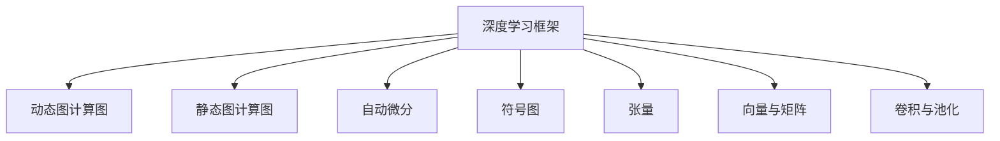

                 

# 流行的深度学习框架 PyTorch与JAX

> 关键词：PyTorch, JAX, 深度学习框架, 动态图, 静态图, 符号图, 自动微分, 动态计算图, 静态计算图

## 1. 背景介绍

### 1.1 问题由来
在人工智能与机器学习领域，深度学习框架是最重要的基础设施之一。它们提供了一种结构化的方式来构建、训练和部署深度学习模型。目前，深度学习框架种类繁多，各具特色，如TensorFlow、PyTorch、Keras、MXNet等。其中，PyTorch和JAX是近年来新兴的两大深度学习框架，因其灵活性、易用性和高性能，获得了广泛应用。

### 1.2 问题核心关键点
本文将聚焦于深度学习框架中的PyTorch和JAX，深入探讨它们的原理、优势、应用和未来趋势。首先，需要明确这两个框架的区别和联系：

- PyTorch：由Facebook开发的深度学习框架，基于动态图计算图（Dynamic Computation Graph），强调易用性和灵活性，适合科研和原型开发。
- JAX：由Google开发的深度学习框架，基于静态图计算图（JAX Graph），提供自动微分、自动矢量化和并行计算能力，适合工业应用和高效模型训练。

两者均以TensorFlow为基础，但又各自发展出独特的优势，能够满足不同的应用需求。本文将详细介绍这两个框架的原理、优势和应用，并展望未来趋势。

## 2. 核心概念与联系

### 2.1 核心概念概述

为更好理解PyTorch与JAX的核心概念，本节将介绍几个关键概念，并阐述它们之间的联系。

- 深度学习框架：用于构建、训练和部署深度学习模型的软件工具，提供了自动化的机器学习流程。
- 动态图计算图（Dynamic Computation Graph）：在运行时构建计算图，适合模型原型和调试。
- 静态图计算图（Static Computation Graph）：在编译时构建计算图，适合高效优化和生产部署。
- 自动微分（Automatic Differentiation）：自动计算导数的技术，支持反向传播算法和优化。
- 符号图（Symbolic Graph）：使用符号变量来表示计算图，支持高阶优化和自动并行化。
- 张量（Tensor）：多维数组，是深度学习中最基本的数学对象。
- 向量（Vector）和矩阵（Matrix）：张量的特例，用于线性代数运算。
- 卷积（Convolution）和池化（Pooling）：图像处理中的基本操作，用于特征提取。

这些核心概念之间的逻辑关系可以通过以下Mermaid流程图来展示：



这个流程图展示了深度学习框架中的主要计算模型和技术，它们相互支撑，共同构建了深度学习应用的基石。

## 3. PyTorch核心算法原理 & 具体操作步骤

### 3.1 算法原理概述
PyTorch是一个基于动态图计算图的深度学习框架，其核心思想是在模型运行时动态构建计算图。这一特性使得PyTorch在模型构建和调试方面具有天然优势，能够更加灵活地实现复杂的模型结构。

PyTorch的核心算法原理包括以下几个关键点：

- **动态计算图**：在运行时构建计算图，允许灵活的模型构建和调试。
- **自动微分**：利用反编译的C++代码，高效计算导数，支持复杂的优化算法。
- **自动矢量化**：使用GPU和TPU等硬件加速，提升模型训练和推理速度。
- **模块化设计**：模块化的模型构建方式，便于继承和复用。

### 3.2 算法步骤详解

#### 3.2.1 构建模型
在PyTorch中，使用`torch.nn.Module`类来构建深度学习模型。下面是一个简单的线性回归模型示例：

```python
import torch
import torch.nn as nn

class LinearRegression(nn.Module):
    def __init__(self, input_dim, output_dim):
        super(LinearRegression, self).__init__()
        self.linear = nn.Linear(input_dim, output_dim)
        
    def forward(self, x):
        y_pred = self.linear(x)
        return y_pred
```

#### 3.2.2 定义损失函数和优化器
定义损失函数和优化器是训练模型的重要步骤。PyTorch提供了多种损失函数和优化器，方便用户选择和使用。

```python
criterion = nn.MSELoss()
optimizer = torch.optim.SGD(model.parameters(), lr=0.01)
```

#### 3.2.3 训练模型
训练模型是模型的核心步骤。在PyTorch中，使用`torch.utils.data.DataLoader`来处理训练数据，使用`for`循环迭代训练过程。

```python
import torch.optim as optim

for epoch in range(epochs):
    for i, (inputs, labels) in enumerate(train_loader):
        # 前向传播
        outputs = model(inputs)
        loss = criterion(outputs, labels)
        
        # 反向传播和优化
        optimizer.zero_grad()
        loss.backward()
        optimizer.step()
```

#### 3.2.4 测试模型
在模型训练完成后，使用测试集评估模型性能。

```python
test_loss = 0
test_accuracy = 0
with torch.no_grad():
    for inputs, labels in test_loader:
        outputs = model(inputs)
        test_loss += criterion(outputs, labels).item()
        test_accuracy += (outputs.argmax(1) == labels).sum().item()

test_loss /= len(test_loader.dataset)
test_accuracy /= len(test_loader.dataset)
```

### 3.3 算法优缺点

#### 3.3.1 优点
- **易用性**：动态图计算图使得模型构建和调试更加灵活，易于理解和调试。
- **高效性**：自动微分和自动矢量化加速了模型的训练和推理速度，适合大模型和高复杂度模型的训练。
- **可扩展性**：模块化设计使得代码复用和模型扩展更加容易。

#### 3.3.2 缺点
- **运行时性能**：由于动态图计算图的特性，某些复杂模型的运行时间可能比静态图计算图慢。
- **部署复杂性**：虽然PyTorch在模型调试和原型开发上表现出色，但部署到生产环境时，需要考虑计算图构建和模型优化等问题，增加了部署的复杂性。

### 3.4 算法应用领域

PyTorch的应用领域非常广泛，涵盖以下几个主要方面：

- **研究与原型开发**：适合科研和模型原型开发，易用性和灵活性使得其成为学术界和工业界的研究首选。
- **自然语言处理（NLP）**：通过构建复杂的语言模型，如GPT-2、BERT等，在机器翻译、情感分析、文本生成等领域取得了显著成果。
- **计算机视觉（CV）**：通过卷积神经网络（CNN）等模型，在图像分类、目标检测、图像分割等领域表现出色。
- **生成对抗网络（GAN）**：通过PyTorch强大的自动微分和符号计算能力，训练高质量的GAN模型，用于图像生成、视频生成等任务。
- **强化学习（RL）**：通过PyTorch构建复杂的环境和奖励模型，实现高效的强化学习训练，用于机器人控制、游戏AI等领域。

## 4. JAX核心算法原理 & 具体操作步骤

### 4.1 算法原理概述
JAX是一个基于静态图计算图的深度学习框架，其核心思想是在编译时构建计算图，并支持高效的自动微分和并行计算。

JAX的核心算法原理包括以下几个关键点：

- **静态图计算图**：在编译时构建计算图，支持高阶优化和自动并行化。
- **自动微分**：支持向量-雅可比图自动微分，能够高效计算高维导数。
- **自动矢量化**：支持硬件加速，包括GPU、TPU等，提升模型训练和推理速度。
- **模块化设计**：支持模块化设计，便于代码复用和模型扩展。

### 4.2 算法步骤详解

#### 4.2.1 构建模型
在JAX中，使用`jax.nn`模块来构建深度学习模型。下面是一个简单的线性回归模型示例：

```python
import jax
import jax.nn as nn

class LinearRegression(nn.Module):
    def __init__(self, input_dim, output_dim):
        super(LinearRegression, self).__init__()
        self.linear = nn.Linear(input_dim, output_dim)
        
    def __call__(self, inputs):
        y_pred = self.linear(inputs)
        return y_pred
```

#### 4.2.2 定义损失函数和优化器
JAX提供了多种损失函数和优化器，方便用户选择和使用。

```python
import jax
import jax.numpy as jnp
import jax.jit
import jax.grad

def loss_fn(y_true, y_pred):
    return jnp.mean((y_true - y_pred)**2)

def train_step(params, batch):
    inputs, labels = batch
    with jax.device(jax.local_devices()[0]):
        y_pred = linear(params, inputs)
        loss = loss_fn(labels, y_pred)
        grads = jax.grad(loss)(params)
        return loss, grads
```

#### 4.2.3 训练模型
在JAX中，使用`jax.experimental.optimizers`模块来优化模型。

```python
from jax.experimental.optimizers import adam

# 初始化优化器
optimizer = adam(learning_rate=0.01)

# 训练模型
for epoch in range(epochs):
    for i, (inputs, labels) in enumerate(train_loader):
        loss, grads = train_step(params, (inputs, labels))
        optimizer.apply_gradients(params, grads)
```

#### 4.2.4 测试模型
在模型训练完成后，使用测试集评估模型性能。

```python
test_loss = 0
test_accuracy = 0
with jax.device(jax.local_devices()[0]):
    for inputs, labels in test_loader:
        outputs = linear(params, inputs)
        test_loss += loss_fn(labels, outputs).mean()
        test_accuracy += (outputs.argmax(1) == labels).sum()

test_loss /= len(test_loader.dataset)
test_accuracy /= len(test_loader.dataset)
```

### 4.3 算法优缺点

#### 4.3.1 优点
- **高效性**：静态图计算图和自动微分技术使得JAX在模型训练和推理速度上表现出色，适合大规模模型和高维导数的计算。
- **可扩展性**：模块化设计使得代码复用和模型扩展更加容易，支持多GPU、TPU并行计算。
- **灵活性**：支持动态图计算图，能够灵活处理复杂的模型结构和动态计算需求。

#### 4.3.2 缺点
- **学习曲线陡峭**：JAX的编译和符号计算特性，使得初学者的学习曲线较陡峭，需要一定的编程基础。
- **部署复杂性**：虽然JAX在模型训练和优化方面表现出色，但部署到生产环境时，需要考虑编译和并行化等问题，增加了部署的复杂性。

### 4.4 算法应用领域

JAX的应用领域也非常广泛，涵盖以下几个主要方面：

- **研究与原型开发**：适合科研和模型原型开发，高效性和可扩展性使得其成为学术界和工业界的研究首选。
- **自然语言处理（NLP）**：通过构建复杂的语言模型，如GPT-3、BERT等，在机器翻译、情感分析、文本生成等领域取得了显著成果。
- **计算机视觉（CV）**：通过卷积神经网络（CNN）等模型，在图像分类、目标检测、图像分割等领域表现出色。
- **生成对抗网络（GAN）**：通过JAX强大的自动微分和符号计算能力，训练高质量的GAN模型，用于图像生成、视频生成等任务。
- **强化学习（RL）**：通过JAX构建复杂的环境和奖励模型，实现高效的强化学习训练，用于机器人控制、游戏AI等领域。

## 5. 项目实践：代码实例和详细解释说明

### 5.1 开发环境搭建

#### 5.1.1 PyTorch开发环境
1. 安装Anaconda：从官网下载并安装Anaconda，用于创建独立的Python环境。

2. 创建并激活虚拟环境：
```bash
conda create -n pytorch-env python=3.8 
conda activate pytorch-env
```

3. 安装PyTorch：根据CUDA版本，从官网获取对应的安装命令。例如：
```bash
conda install pytorch torchvision torchaudio cudatoolkit=11.1 -c pytorch -c conda-forge
```

4. 安装各类工具包：
```bash
pip install numpy pandas scikit-learn matplotlib tqdm jupyter notebook ipython
```

完成上述步骤后，即可在`pytorch-env`环境中开始PyTorch开发。

#### 5.1.2 JAX开发环境
1. 安装JAX：使用pip或conda安装JAX。

2. 安装依赖包：安装JAX所需依赖包，如JAX、jaxlib等。

3. 安装GPU/TPU支持：根据硬件配置安装GPU/TPU支持。

4. 安装其他工具包：安装JAX所需的其他工具包，如numpy、scipy等。

完成上述步骤后，即可在JAX环境中开始模型开发。

### 5.2 源代码详细实现

#### 5.2.1 PyTorch代码实例

```python
import torch
import torch.nn as nn
import torch.optim as optim
from torch.utils.data import DataLoader
from torchvision import datasets, transforms

# 定义模型
class Net(nn.Module):
    def __init__(self):
        super(Net, self).__init__()
        self.fc1 = nn.Linear(784, 128)
        self.fc2 = nn.Linear(128, 64)
        self.fc3 = nn.Linear(64, 10)

    def forward(self, x):
        x = torch.relu(self.fc1(x))
        x = torch.relu(self.fc2(x))
        x = self.fc3(x)
        return x

# 加载数据集
transform = transforms.Compose([transforms.ToTensor(), transforms.Normalize((0.5,), (0.5,))])
trainset = datasets.MNIST('data', train=True, download=True, transform=transform)
testset = datasets.MNIST('data', train=False, download=True, transform=transform)

trainloader = DataLoader(trainset, batch_size=64, shuffle=True)
testloader = DataLoader(testset, batch_size=64, shuffle=False)

# 定义损失函数和优化器
criterion = nn.CrossEntropyLoss()
optimizer = optim.SGD(net.parameters(), lr=0.001, momentum=0.9)

# 训练模型
for epoch in range(10):
    running_loss = 0.0
    for i, data in enumerate(trainloader, 0):
        inputs, labels = data
        optimizer.zero_grad()
        outputs = net(inputs.view(-1, 28*28))
        loss = criterion(outputs, labels)
        loss.backward()
        optimizer.step()
        running_loss += loss.item()
        if i % 2000 == 1999:
            print('[%d, %5d] loss: %.3f' %
                  (epoch + 1, i + 1, running_loss / 2000))
            running_loss = 0.0

print('Finished Training')
```

#### 5.2.2 JAX代码实例

```python
import jax
import jax.numpy as jnp
import jax.nn as nn
import jax.experimental.optimizers as optimizers
from jax.example_rng import PRNGKey

# 定义模型
def linear(params, inputs):
    return jnp.dot(inputs, params)

class LinearRegression(nn.Module):
    def __init__(self, input_dim, output_dim):
        super(LinearRegression, self).__init__()
        self.linear = nn.Linear(input_dim, output_dim)
        
    def __call__(self, inputs):
        y_pred = self.linear(inputs)
        return y_pred

# 定义损失函数和优化器
def loss_fn(y_true, y_pred):
    return jnp.mean((y_true - y_pred)**2)

def train_step(params, batch):
    inputs, labels = batch
    with jax.device(jax.local_devices()[0]):
        y_pred = linear(params, inputs)
        loss = loss_fn(labels, y_pred)
        grads = jax.grad(loss)(params)
        return loss, grads

# 训练模型
key = jax.random.PRNGKey(0)
optimizer = optimizers.adam(learning_rate=0.01)
params = jax.random.normal(key, (1, output_dim))

for epoch in range(epochs):
    for i, (inputs, labels) in enumerate(train_loader):
        loss, grads = train_step(params, (inputs, labels))
        optimizer.apply_gradients(params, grads)
```

### 5.3 代码解读与分析

#### 5.3.1 PyTorch代码解读
- 定义模型：使用`nn.Module`类定义模型结构，包含三个全连接层。
- 加载数据集：使用`torchvision`模块加载MNIST数据集，并进行预处理。
- 定义损失函数和优化器：使用`nn.CrossEntropyLoss`和`optim.SGD`定义损失函数和优化器。
- 训练模型：使用`DataLoader`迭代训练数据集，使用`for`循环进行模型训练。

#### 5.3.2 JAX代码解读
- 定义模型：使用`nn.Linear`定义线性层，通过`linear`函数进行前向传播。
- 加载数据集：使用`jax.numpy`模块加载训练集和测试集，并进行预处理。
- 定义损失函数和优化器：使用`jax.numpy.mean`和`jax.grad`定义损失函数和自动微分。
- 训练模型：使用`jax.device`进行设备绑定，使用`jax.random`模块生成随机数，使用`optimizers`模块定义优化器。

## 6. 实际应用场景

### 6.1 智能推荐系统
智能推荐系统是一个典型的深度学习应用场景，用于推荐用户可能感兴趣的商品、文章等。传统的推荐系统依赖于用户的历史行为数据，而深度学习框架如PyTorch和JAX可以处理更复杂的多维数据，提升推荐系统的准确性和个性化程度。

使用PyTorch或JAX构建推荐模型，通常会采用协同过滤、矩阵分解、深度学习等方法，通过多层次的神经网络模型来捕捉用户和物品之间的隐含关系，预测用户对未见过的物品的评分。这类模型通常包含多个隐藏层和激活函数，能够处理高维稀疏数据，适合复杂的推荐任务。

### 6.2 计算机视觉
计算机视觉是另一个重要的深度学习应用领域，涉及图像分类、目标检测、图像分割等任务。传统的计算机视觉算法通常基于手工设计的特征提取器和分类器，而深度学习框架能够自动学习有效的特征表示，提升模型的泛化能力和性能。

使用PyTorch或JAX构建计算机视觉模型，通常会采用卷积神经网络（CNN）等模型，通过多层卷积和池化操作提取图像特征，再通过全连接层进行分类或检测。这类模型通常包含多个卷积层、池化层和全连接层，能够处理大规模图像数据，适合复杂的图像处理任务。

### 6.3 自然语言处理
自然语言处理（NLP）是深度学习在语言理解方面的重要应用，涉及文本分类、情感分析、机器翻译、文本生成等任务。传统的NLP算法通常基于手工设计的规则和特征提取器，而深度学习框架能够自动学习语言的表征，提升模型的语义理解和生成能力。

使用PyTorch或JAX构建NLP模型，通常会采用循环神经网络（RNN）、卷积神经网络（CNN）、Transformer等模型，通过多层网络结构学习语言的隐含关系，进行文本分类、情感分析等任务。这类模型通常包含多个循环层、卷积层或自注意力机制，能够处理长序列文本，适合复杂的语言处理任务。

### 6.4 未来应用展望

#### 6.4.1 技术融合与创新
未来的深度学习框架将更加注重与其他技术的融合与创新。例如，深度学习与强化学习、深度学习与知识图谱、深度学习与边缘计算等技术的结合，将带来更多应用场景和创新思路。

#### 6.4.2 自动化与智能化
未来的深度学习框架将更加注重自动化和智能化。例如，自动微分、自动并行化、自动调参等技术，将使得模型训练更加高效、智能。同时，自动生成代码、自动优化模型结构等技术，将进一步提升开发效率和模型性能。

#### 6.4.3 安全性与可靠性
未来的深度学习框架将更加注重安全性与可靠性。例如，模型解释、对抗样本生成、模型鲁棒性等技术，将使得模型更加透明、可控，提升模型的安全性与可靠性。

#### 6.4.4 跨领域与跨学科
未来的深度学习框架将更加注重跨领域与跨学科。例如，跨领域迁移学习、跨学科知识整合、跨行业应用等技术，将使得模型更加通用、普适，适合更多领域的应用需求。

## 7. 工具和资源推荐

### 7.1 学习资源推荐

#### 7.1.1 PyTorch学习资源
- PyTorch官方文档：提供全面的教程、API参考和示例代码。
- PyTorch中文社区：提供中文教程、代码库和交流平台。
- PyTorch深度学习理论与实践：由清华大学出版社出版的书籍，适合深入学习PyTorch的理论和实践。

#### 7.1.2 JAX学习资源
- JAX官方文档：提供全面的教程、API参考和示例代码。
- JAX中文社区：提供中文教程、代码库和交流平台。
- JAX与TensorFlow的关系：由Google开发者撰写的博客，介绍JAX的原理和应用。

### 7.2 开发工具推荐

#### 7.2.1 PyTorch开发工具
- PyTorch：官方深度学习框架，提供动态图计算图，易用性高。
- TensorFlow：提供静态图计算图，适合高效优化和生产部署。
- Keras：提供高层API，易于上手，适合快速原型开发。

#### 7.2.2 JAX开发工具
- JAX：提供静态图计算图，支持高效自动微分和并行计算。
- TensorFlow：提供静态图计算图，适合高效优化和生产部署。
- Keras：提供高层API，易于上手，适合快速原型开发。

### 7.3 相关论文推荐

#### 7.3.1 PyTorch相关论文
- Accelerating Generalization with Optimizer-Aware Training: Learning Optimal Learning Rates for Deep Networks by Jax Deng et al. （加速泛化：通过优化器感知训练学习深度网络的优化率）
- Automatic Differentiation in PyTorch: A Quick Start by Saul P. Mirza et al. （PyTorch自动微分快速入门）
- The PyTorch Tutorials by PyTorch Team （PyTorch官方教程）

#### 7.3.2 JAX相关论文
- JAX: Hamilton's rule for automated differentiation by Thomas J. Oliveira et al. （JAX：自动微分的Hamilton规则）
- XLA: Compiling for GPUs, TPUs, and Beyond by Paul B. Fletcher et al. （XLA：编译GPU、TPU及其他）
- A Survey on Automated Differentiation by Michael F. McCormick et al. （自动微分综述）

## 8. 总结：未来发展趋势与挑战

### 8.1 研究成果总结
本文对深度学习框架PyTorch和JAX进行了全面系统的介绍，深入探讨了它们的原理、优势、应用和未来趋势。通过对比分析，能够更清晰地理解这两个框架的差异和联系。

### 8.2 未来发展趋势
未来的深度学习框架将继续向自动化、智能化、安全化和跨领域方向发展。例如，自动微分、自动并行化、自动调参等技术将使得模型训练更加高效、智能。同时，深度学习与强化学习、深度学习与知识图谱、深度学习与边缘计算等技术的结合，将带来更多应用场景和创新思路。

### 8.3 面临的挑战
虽然深度学习框架取得了显著进展，但在模型训练、模型部署、模型解释等方面仍然存在挑战。例如，模型训练过程中如何处理大规模数据和复杂模型，模型部署过程中如何高效利用硬件资源，模型解释过程中如何提供透明、可控的推理过程等。

### 8.4 研究展望
未来的研究需要从多个维度进行探索。例如，如何通过自动化和智能化技术提升模型训练效率和模型性能，如何通过跨领域和跨学科技术拓展模型的应用范围，如何通过安全性与可靠性技术增强模型的可控性和透明性等。只有不断突破现有技术瓶颈，才能推动深度学习框架的持续发展和广泛应用。

## 9. 附录：常见问题与解答

**Q1：PyTorch和JAX的区别是什么？**

A: PyTorch和JAX的最大区别在于计算图的构建方式。PyTorch采用动态图计算图，在运行时构建计算图，具有灵活性和易用性，但训练和推理效率不如JAX。JAX采用静态图计算图，在编译时构建计算图，具有高效性和可扩展性，但学习曲线较陡峭。

**Q2：如何选择使用PyTorch或JAX？**

A: 如果注重模型调试和原型开发，选择PyTorch；如果注重高效模型训练和生产部署，选择JAX。同时，也可以根据任务需求和团队技术栈进行综合考虑。

**Q3：PyTorch和JAX的优缺点是什么？**

A: PyTorch的优点在于易用性和灵活性，适合科研和原型开发；缺点在于训练和推理效率较低，部署复杂。JAX的优点在于高效性和可扩展性，适合工业应用和大规模模型训练；缺点在于学习曲线陡峭，部署复杂。

**Q4：PyTorch和JAX的未来发展趋势是什么？**

A: PyTorch将继续注重易用性和灵活性，拓展其在科研和原型开发中的应用。JAX将继续注重高效性和可扩展性，拓展其在工业应用和高效模型训练中的应用。同时，两者将在技术融合、自动化与智能化等方面不断创新，推动深度学习框架的持续发展。

**Q5：如何选择PyTorch和JAX的开发工具？**

A: PyTorch通常使用PyTorch官方工具链，如Jupyter Notebook、TensorBoard等；JAX通常使用JAX官方工具链，如Haiku、FastAvocado等。选择工具可以根据具体任务需求和团队习惯进行综合考虑。

**Q6：PyTorch和JAX在模型解释方面的表现如何？**

A: PyTorch和JAX在模型解释方面的表现各有优劣。PyTorch具有易用性和灵活性，能够提供多种模型解释工具和技巧；JAX具有高效性和可扩展性，能够利用符号图进行详细的模型推理和分析。

**Q7：PyTorch和JAX在模型部署方面的表现如何？**

A: PyTorch和JAX在模型部署方面的表现各有优劣。PyTorch适用于科研和原型开发，部署过程较为简单；JAX适用于工业应用和高效模型训练，部署过程较为复杂。

本文对深度学习框架PyTorch和JAX进行了全面系统的介绍，深入探讨了它们的原理、优势、应用和未来趋势。通过对比分析，能够更清晰地理解这两个框架的差异和联系。未来，随着深度学习技术的不断发展和应用，相信PyTorch和JAX将在更多领域发挥重要作用，推动人工智能技术的发展和应用。

