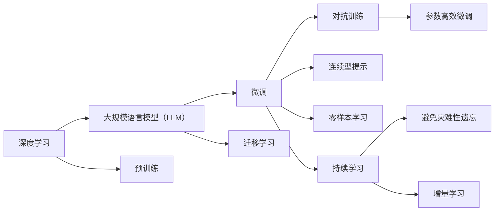

                 

# 深入理解AI、LLM和深度学习：一门全面的课程

## 1. 背景介绍

### 1.1 问题由来

人工智能（AI）、大规模语言模型（LLM）和深度学习（DL）技术的迅速发展，正在深刻改变我们的世界。从语音识别到图像处理，从自然语言理解到机器人学习，这些技术的进步正在打开新的可能性。然而，理解和应用这些技术，需要系统的知识体系和深入的理解。

### 1.2 问题核心关键点

在现代AI研究中，深度学习特别是深度神经网络已经成为核心技术，它通过模拟人脑神经网络的结构和功能，来实现对数据的高度拟合和抽象。在NLP领域，大规模语言模型LLM作为深度学习的重要分支，利用海量的文本数据进行预训练，学习到广泛的语义和语法知识。基于这些模型，研究人员和工程师可以构建诸如自动问答、机器翻译、文本生成等高效应用，这些应用正在改变各行业的工作方式。

当前，深度学习和LLM技术主要面临的问题包括：
- **计算资源需求高**：大规模模型需要高性能的计算资源进行训练和推理。
- **数据依赖性强**：模型的表现很大程度上依赖于训练数据的数量和质量。
- **泛化能力有限**：模型在未见过的数据上的表现往往不如预期，泛化能力有限。
- **可解释性不足**：黑盒模型的决策过程难以解释，缺乏可解释性。
- **公平性问题**：模型可能学习到数据中的偏见，导致输出结果不公平。

### 1.3 问题研究意义

系统深入理解AI、LLM和深度学习，对于推动这些技术的发展，促进其广泛应用具有重要意义：
1. **加速技术进步**：深入的理论研究可以加速技术演进，推动更多创新应用的出现。
2. **提升应用效果**：通过对核心技术的理解，可以更好地设计应用，提升整体效果。
3. **促进产业落地**：掌握核心技术，有助于将前沿研究转化为实际应用，推动产业升级。
4. **培养人才**：深入学习这些技术，可以培养更多AI领域的高端人才，促进技术传播和普及。

## 2. 核心概念与联系

### 2.1 核心概念概述

为了更好地理解AI、LLM和深度学习，我们首先介绍一些关键概念：

- **深度学习**：通过多层次的神经网络结构，自动提取数据的高层次特征。
- **大规模语言模型（LLM）**：如BERT、GPT-3等，通过预训练在大规模无标签文本上学习广泛的语义和语法知识。
- **预训练**：使用无标签数据进行训练，学习通用的语言表示。
- **微调（Fine-Tuning）**：在有标注数据上进行训练，针对特定任务进行优化。
- **迁移学习**：利用预训练模型在不同任务之间的知识迁移，提升模型性能。
- **对抗训练**：在训练数据中加入对抗样本，增强模型的鲁棒性。
- **参数高效微调**：只调整少量参数，提高微调效率。
- **连续型提示（Prompt）**：通过特定格式的输入文本引导模型输出。
- **零样本学习**：模型在没有见过特定任务的训练样本的情况下，直接输出结果。
- **持续学习（Continual Learning）**：模型能够不断学习新知识，避免遗忘旧知识。

这些概念构成了AI、LLM和深度学习的核心框架，彼此之间相互联系，形成完整的技术体系。

### 2.2 核心概念原理和架构的 Mermaid 流程图



这个流程图展示了深度学习和LLM的核心概念及其相互联系：

1. 深度学习通过多层网络结构自动提取特征。
2. 大规模语言模型通过预训练学习广泛的语义和语法知识。
3. 微调用于针对特定任务优化模型，提高性能。
4. 迁移学习通过知识迁移，实现模型在不同任务之间的泛化。
5. 对抗训练和参数高效微调用于提高模型的鲁棒性和效率。
6. 连续型提示和零样本学习用于引导模型输出，减少微调参数。
7. 持续学习用于模型不断学习新知识，避免遗忘旧知识。

这些概念共同构成了AI、LLM和深度学习的基础框架，为后续的学习和应用提供了必要的理论基础。

## 3. 核心算法原理 & 具体操作步骤

### 3.1 算法原理概述

深度学习和LLM的核心算法是神经网络，特别是卷积神经网络（CNN）和递归神经网络（RNN）及其变体如LSTM和GRU。这些网络通过反向传播算法，最小化预测与真实标签之间的误差，从而调整网络参数，优化模型性能。

在深度学习和LLM中，模型通常分为编码器和解码器两个部分，编码器用于提取特征，解码器用于生成输出。模型通过反向传播算法，根据损失函数计算梯度，更新参数以最小化损失。

### 3.2 算法步骤详解

深度学习和LLM的具体算法步骤如下：

1. **数据准备**：收集并处理训练数据，包括数据清洗、预处理、划分训练集、验证集和测试集等。
2. **模型选择**：选择合适的模型结构，如CNN、RNN、LSTM、GRU等。
3. **预训练**：在大规模无标签数据上，使用自监督学习任务如语言建模进行预训练。
4. **微调**：在特定任务上，使用少量有标签数据进行有监督学习，调整模型参数以匹配任务需求。
5. **评估**：在测试集上评估模型性能，调整超参数以优化模型效果。
6. **应用**：将训练好的模型应用于实际问题中，进行推理预测。

### 3.3 算法优缺点

深度学习和LLM具有以下优点：
- **自动特征提取**：能够自动提取数据的高层次特征，减少手动设计特征的复杂度。
- **高性能**：在处理大规模数据时，表现出优秀的性能。
- **泛化能力强**：通过预训练和迁移学习，模型在未见过的数据上也能表现良好。

同时，也存在一些缺点：
- **计算资源需求高**：模型训练和推理需要高性能计算资源。
- **数据依赖性强**：模型性能高度依赖于训练数据的质量和数量。
- **可解释性不足**：黑盒模型难以解释其内部工作机制。
- **公平性问题**：可能学习到数据中的偏见，导致输出结果不公平。

### 3.4 算法应用领域

深度学习和LLM已经在诸多领域得到广泛应用，如自然语言处理、计算机视觉、语音识别、机器人学习等。

- **自然语言处理（NLP）**：如自动问答、机器翻译、文本生成、命名实体识别等。
- **计算机视觉（CV）**：如图像分类、目标检测、人脸识别等。
- **语音识别**：如语音转文字、语音合成等。
- **机器人学习**：如自动驾驶、机器人视觉、语音交互等。

## 4. 数学模型和公式 & 详细讲解 & 举例说明

### 4.1 数学模型构建

深度学习和LLM的数学模型通常基于神经网络，包括多层感知器（MLP）、卷积神经网络（CNN）、递归神经网络（RNN）等。

- **多层感知器**：最基础的神经网络模型，包括输入层、隐藏层和输出层。
- **卷积神经网络**：用于图像处理，通过卷积操作提取特征。
- **递归神经网络**：用于处理序列数据，如文本和时间序列数据。

以RNN为例，其数学模型为：

$$
\begin{align*}
h_t &= f(W_h x_t + U_h h_{t-1} + b_h) \\
\hat{y}_t &= g(W_y h_t + b_y)
\end{align*}
$$

其中，$h_t$ 为隐藏状态，$f$ 和 $g$ 为激活函数，$W_h$、$U_h$ 和 $b_h$ 为权重和偏置项。

### 4.2 公式推导过程

深度学习和LLM的推导过程主要涉及反向传播算法，用于计算梯度并更新模型参数。

以RNN为例，其反向传播算法的推导如下：

1. **前向传播**：计算每个时间步的隐藏状态 $h_t$。
2. **损失函数计算**：根据输出 $\hat{y}_t$ 和真实标签 $y_t$ 计算损失函数。
3. **反向传播**：根据链式法则，计算损失函数对参数的梯度。
4. **参数更新**：使用梯度下降等优化算法更新模型参数。

### 4.3 案例分析与讲解

以BERT模型为例，其预训练过程包括两个任务：
- **掩码语言模型（Masked Language Model, MLM）**：随机掩盖部分输入词，训练模型预测被掩盖的词。
- **下一句预测（Next Sentence Prediction, NSP）**：随机将两个句子组合在一起，训练模型预测它们的顺序。

通过预训练，BERT模型学习了广泛的语义和语法知识，提升了在特定任务上的性能。

## 5. 项目实践：代码实例和详细解释说明

### 5.1 开发环境搭建

要进行深度学习和LLM项目实践，需要准备以下环境：

1. **Python**：选择Python 3.7及以上版本。
2. **深度学习框架**：如TensorFlow、PyTorch、Keras等。
3. **数据集**：准备用于训练和测试的数据集，如IMDB电影评论数据集、CIFAR-10图像数据集等。
4. **GPU**：安装NVIDIA GPU并配置好CUDA和cuDNN。

### 5.2 源代码详细实现

以下是使用PyTorch框架实现RNN模型训练的代码示例：

```python
import torch
import torch.nn as nn
import torch.optim as optim

class RNN(nn.Module):
    def __init__(self, input_size, hidden_size, output_size):
        super(RNN, self).__init__()
        self.hidden_size = hidden_size
        self.i2h = nn.Linear(input_size + hidden_size, hidden_size)
        self.i2o = nn.Linear(input_size + hidden_size, output_size)
        self.softmax = nn.LogSoftmax(dim=1)

    def forward(self, input, hidden):
        combined = torch.cat((input, hidden), 1)
        hidden = self.i2h(combined)
        output = self.i2o(combined)
        output = self.softmax(output)
        return output, hidden

    def initHidden(self):
        return torch.zeros(1, self.hidden_size)

# 准备数据
inputs = torch.randn(10, 5, 10)  # 10个时间步，5个特征，10个输出
targets = torch.randn(10, 5, 10)
hidden = torch.zeros(1, 1, 5)

# 初始化模型和优化器
model = RNN(5, 10, 10)
optimizer = optim.Adam(model.parameters())

# 训练过程
for i in range(100):
    hidden = model.initHidden()
    output, next_hidden = model(inputs[i], hidden)
    loss = nn.NLLLoss()(output, targets[i])
    optimizer.zero_grad()
    loss.backward()
    optimizer.step()

    if i % 10 == 0:
        print("Epoch: {}, Loss: {:.3f}".format(i, loss.item()))
```

### 5.3 代码解读与分析

- **模型定义**：定义RNN模型结构，包括输入层、隐藏层和输出层。
- **数据准备**：生成模拟输入和目标数据，用于训练和测试。
- **模型训练**：使用Adam优化器，进行前向传播、损失计算和反向传播。
- **输出结果**：每十个epoch输出一次损失，记录训练过程。

### 5.4 运行结果展示

训练过程中，损失值会逐渐减小，模型的预测结果会逐步提高。在训练结束后，可以使用测试集对模型进行评估。

## 6. 实际应用场景

### 6.1 自动问答系统

自动问答系统通过深度学习和LLM，能够自动理解用户的问题，并给出准确的回答。例如，IBM的Watson问答系统，通过深度学习和自然语言处理，为医生提供高效的疾病诊断和知识查询服务。

### 6.2 机器翻译

机器翻译通过深度学习和LLM，能够实现自然语言之间的自动翻译。例如，Google的神经机器翻译（NMT）系统，通过深度学习模型，实现了高质量的文本翻译。

### 6.3 文本生成

文本生成是深度学习和LLM的重要应用之一，能够生成逼真的自然语言文本。例如，GPT-3模型，能够自动生成小说、新闻报道、代码等文本。

### 6.4 未来应用展望

深度学习和LLM的未来发展趋势包括：
- **超大规模模型**：随着计算资源和数据规模的增长，模型规模将持续增大，性能将进一步提升。
- **参数高效微调**：未来将出现更多参数高效的微调方法，提高微调效率和精度。
- **多模态融合**：深度学习和LLM将与计算机视觉、语音处理等技术结合，实现多模态信息融合。
- **无监督学习**：引入无监督学习范式，减少对标注数据的依赖。
- **对抗训练**：通过对抗样本训练，提高模型的鲁棒性和泛化能力。
- **可解释性**：发展可解释性模型，提高模型的透明度和可信度。

## 7. 工具和资源推荐

### 7.1 学习资源推荐

为了更好地掌握深度学习和LLM，以下是一些优质的学习资源：

1. **深度学习课程**：如Andrew Ng的《深度学习》课程、吴恩达的《深度学习专项课程》等。
2. **NLP相关书籍**：如《NLP with Python》、《Sequence Models》等。
3. **LLM研究论文**：如BERT、GPT系列论文。
4. **开源项目**：如TensorFlow、PyTorch、HuggingFace等。
5. **在线社区**：如GitHub、Stack Overflow等。

### 7.2 开发工具推荐

深度学习和LLM的开发需要高性能计算资源和丰富的工具支持，以下是一些推荐的开发工具：

1. **深度学习框架**：如TensorFlow、PyTorch、Keras等。
2. **GPU加速**：如NVIDIA CUDA、cuDNN等。
3. **分布式计算**：如Dask、Horovod等。
4. **模型可视化**：如TensorBoard、Netron等。
5. **代码管理**：如Git、GitHub等。

### 7.3 相关论文推荐

深度学习和LLM的研究领域广泛，以下是一些关键的学术论文：

1. **深度学习**：如《Deep Learning》、《ImageNet Classification with Deep Convolutional Neural Networks》等。
2. **LLM**：如《Attention is All You Need》、《BERT: Pre-training of Deep Bidirectional Transformers for Language Understanding》等。
3. **NLP**：如《A Survey on Transfer Learning for Natural Language Processing》、《A Survey on Sequence to Sequence Models》等。

## 8. 总结：未来发展趋势与挑战

### 8.1 总结

本文系统介绍了深度学习和LLM的基本原理和实践方法，包括模型构建、训练和优化过程。通过丰富的实例和案例分析，深入讲解了深度学习和LLM在实际应用中的关键技术和方法。

### 8.2 未来发展趋势

深度学习和LLM的未来发展趋势包括：
- **模型规模增大**：随着计算资源的增长，模型规模将持续增大，性能将进一步提升。
- **参数高效微调**：出现更多参数高效的微调方法，提高微调效率和精度。
- **多模态融合**：与计算机视觉、语音处理等技术结合，实现多模态信息融合。
- **无监督学习**：引入无监督学习范式，减少对标注数据的依赖。
- **对抗训练**：提高模型的鲁棒性和泛化能力。
- **可解释性**：提高模型的透明度和可信度。

### 8.3 面临的挑战

深度学习和LLM在发展过程中面临以下挑战：
- **计算资源需求高**：需要高性能的计算资源。
- **数据依赖性强**：模型性能高度依赖于训练数据的质量和数量。
- **可解释性不足**：黑盒模型难以解释其内部工作机制。
- **公平性问题**：可能学习到数据中的偏见，导致输出结果不公平。

### 8.4 研究展望

未来深度学习和LLM的研究方向包括：
- **理论研究**：深入研究深度学习的数学基础和优化算法。
- **应用探索**：探索深度学习和LLM在更多领域的应用，如医疗、金融、智能制造等。
- **可解释性**：发展可解释性模型，提高模型的透明度和可信度。
- **隐私保护**：保护用户隐私，确保数据安全。

总之，深度学习和LLM作为AI领域的重要分支，正处于快速发展之中。通过不断探索和创新，我们有望在未来实现更广泛的应用和突破。

## 9. 附录：常见问题与解答

### Q1: 深度学习和LLM有哪些优势和劣势？

A: 深度学习和LLM的优势包括：
- **自动特征提取**：能够自动提取数据的高层次特征。
- **高性能**：在处理大规模数据时表现出优秀的性能。
- **泛化能力强**：通过预训练和迁移学习，模型在未见过的数据上也能表现良好。

劣势包括：
- **计算资源需求高**：模型训练和推理需要高性能计算资源。
- **数据依赖性强**：模型性能高度依赖于训练数据的质量和数量。
- **可解释性不足**：黑盒模型难以解释其内部工作机制。
- **公平性问题**：可能学习到数据中的偏见，导致输出结果不公平。

### Q2: 如何进行参数高效微调？

A: 参数高效微调（PEFT）是通过只调整部分模型参数，提高微调效率和精度的方法。常用的PEFT方法包括：
- **Adapter**：在现有模型的基础上添加或修改几个可训练层。
- **Prompt Tuning**：通过修改输入文本的格式，引导模型输出，减少微调参数。
- **LoRA**：通过低秩分解，只调整部分模型参数，保持其余部分不变。

### Q3: 如何进行对抗训练？

A: 对抗训练是通过在训练数据中加入对抗样本，增强模型的鲁棒性和泛化能力。具体步骤如下：
1. **生成对抗样本**：通过小扰动生成对抗样本。
2. **训练模型**：在训练数据中加入对抗样本，使用对抗训练算法。
3. **评估模型**：在测试集上评估模型性能，检查是否过拟合。

### Q4: 如何提高深度学习的可解释性？

A: 提高深度学习的可解释性主要通过以下方法：
1. **模型可视化**：使用工具如TensorBoard、Netron等，可视化模型内部结构和工作过程。
2. **特征解释**：使用特征重要性分析方法，解释模型的关键特征。
3. **可解释模型**：使用可解释模型，如决策树、线性模型等，提高模型透明度。

总之，深度学习和LLM作为AI领域的重要分支，正处于快速发展之中。通过不断探索和创新，我们有望在未来实现更广泛的应用和突破。

---

作者：禅与计算机程序设计艺术 / Zen and the Art of Computer Programming

