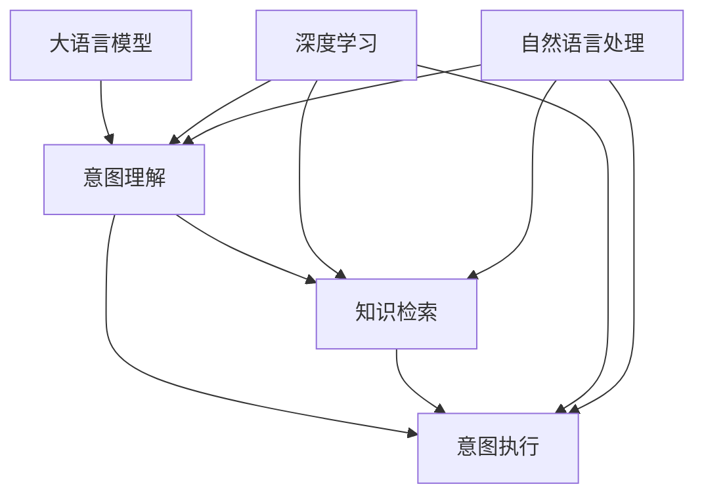

                 

# 深度人机协作：LLM理解与执行人类意图

> 关键词：
- 大语言模型(LLM)
- 自然语言处理(NLP)
- 人机协作
- 意图理解
- 执行生成
- 智能对话系统
- 深度学习

## 1. 背景介绍

### 1.1 问题由来

在当前信息爆炸、技术快速迭代的时代，人类面临的决策任务日益复杂化。与此同时，人工智能（AI）技术，尤其是深度学习和大语言模型（Large Language Models, LLMs）的迅猛发展，为人机协作注入了新的活力。特别是近年来出现的自然语言处理（Natural Language Processing, NLP）技术，使得机器能够理解、处理和生成人类语言，与人类进行自然流畅的交互。

大语言模型（如GPT、BERT、T5等）通过大规模预训练和微调，掌握了丰富的语言知识和语义表示能力，能够用于诸多实际应用场景。例如，智能客服、在线翻译、内容生成、智能助手等。然而，尽管LLM具备强大的语言理解与生成能力，其在执行人类意图方面仍存在一定的局限性。

本博文将围绕“LLM如何更好地理解与执行人类意图”这一核心问题，探讨大语言模型在实际应用中的原理、方法和挑战，并通过实例展示其应用潜力，旨在推动大语言模型在深度人机协作中的进一步发展。

### 1.2 问题核心关键点

LLM在执行人类意图时，需要经历以下关键步骤：

1. **意图理解**：准确理解人类指令或查询中的语义，识别出任务类型和具体需求。
2. **信息检索**：基于理解结果，从知识库、网页、数据库等外部信息源中检索相关知识或数据。
3. **意图执行**：根据检索结果和任务需求，生成合适的响应或解决方案。

为实现这一目标，LLM需要具备以下核心能力：

- **语义理解**：能够准确解析输入文本的含义，识别出关键的实体、关系和语义角色。
- **知识检索**：具备跨领域、跨模态的知识检索能力，能够高效从各种信息源获取所需信息。
- **生成能力**：能够根据理解结果，生成流畅、准确且富有创意的文本或音频。

本文将深入探讨LLM在执行人类意图方面的原理与技术细节，并通过具体案例展示其在实际应用中的表现，旨在提供更全面的理论指导和实践方法。

## 2. 核心概念与联系

### 2.1 核心概念概述

本节将介绍几个与LLM执行人类意图相关的重要概念：

- **大语言模型（LLM）**：基于Transformer架构的深度神经网络模型，具备强大的语言理解和生成能力，能在自然语言处理任务中取得优异表现。
- **意图理解（Intent Understanding）**：指LLM从自然语言中提取用户意图的语义信息，识别出具体任务类型和需求。
- **知识检索（Knowledge Retrieval）**：指LLM在理解任务意图后，从外部信息源获取相关知识或数据，支持意图执行。
- **意图执行（Intent Execution）**：指LLM基于理解结果和检索信息，生成满足用户需求的输出。
- **深度学习（Deep Learning）**：基于神经网络技术的机器学习范式，通过大量数据训练，提高模型的复杂表达能力和泛化能力。
- **自然语言处理（NLP）**：涉及语言学、计算机科学等多领域的交叉学科，旨在使计算机能够理解和处理人类语言。

这些概念之间的联系可以通过以下Mermaid流程图来展示：



这个流程图展示了LLM执行人类意图的主要流程：

1. 大语言模型从自然语言输入中提取意图。
2. 意图驱动知识检索，获取所需的信息。
3. 意图执行生成输出，完成用户任务。

深度学习和自然语言处理是实现这一流程的关键技术。

## 3. 核心算法原理 & 具体操作步骤
### 3.1 算法原理概述

LLM执行人类意图的核心算法主要包括意图理解、知识检索和意图执行。下面将对这三个环节分别进行介绍：

1. **意图理解**：
   - 使用Transformer模型，通过自注意力机制，从输入文本中提取语义表示。
   - 通过分类器，将语义表示映射到具体的意图类别。

2. **知识检索**：
   - 利用向量相似度计算，将语义表示与知识库中的向量进行匹配。
   - 通过检索算法，从知识库中筛选出最相关的信息。

3. **意图执行**：
   - 使用生成模型，根据理解结果和检索信息，生成合适的输出文本或音频。

### 3.2 算法步骤详解

#### 意图理解步骤

1. **输入表示**：将输入文本进行分词、标记化，转换为模型可处理的格式。
2. **语义提取**：使用Transformer模型对输入文本进行编码，得到语义表示。
3. **意图分类**：通过分类器将语义表示映射到意图类别。

以下是使用PyTorch实现意图理解的代码示例：

```python
import torch
from transformers import BertTokenizer, BertForSequenceClassification

tokenizer = BertTokenizer.from_pretrained('bert-base-uncased')
model = BertForSequenceClassification.from_pretrained('bert-base-uncased', num_labels=10)

input_text = '这是一段测试文本。'
inputs = tokenizer.encode_plus(input_text, add_special_tokens=True, return_tensors='pt')

with torch.no_grad():
    outputs = model(inputs['input_ids'], attention_mask=inputs['attention_mask'])
    logits = outputs.logits
    predicted_label = torch.argmax(logits, dim=1)
```

#### 知识检索步骤

1. **向量编码**：将语义表示转换为向量，用于与知识库中的向量进行匹配。
2. **相似度计算**：计算输入向量与知识库中向量的余弦相似度。
3. **筛选信息**：根据相似度排序，筛选出最相关的信息。

以下是使用Python实现知识检索的代码示例：

```python
import numpy as np

# 假设知识库中的向量表示为vectors，与输入向量input_vector进行相似度计算
vectors = np.random.randn(100, 768)
input_vector = np.random.randn(768)

# 计算余弦相似度
similarities = np.dot(vectors, input_vector) / (np.linalg.norm(vectors, axis=1) * np.linalg.norm(input_vector))

# 根据相似度排序，获取最相关的信息
top_indices = np.argsort(similarities)[::-1][:10]
top_documents = [vectors[top_indices[i]] for i in top_indices]
```

#### 意图执行步骤

1. **输出生成**：使用生成模型，根据理解结果和检索信息，生成合适的输出文本或音频。
2. **后处理**：对生成的文本或音频进行后处理，如语法校正、风格调整等。

以下是使用Python实现意图执行的代码示例：

```python
from transformers import T5Tokenizer, T5ForConditionalGeneration

tokenizer = T5Tokenizer.from_pretrained('t5-small')
model = T5ForConditionalGeneration.from_pretrained('t5-small')

input_text = '根据上文，如何实现意图执行？'
input_ids = tokenizer(input_text, return_tensors='pt')['input_ids']
outputs = model.generate(input_ids, max_length=512, num_return_sequences=1)

generated_text = tokenizer.decode(outputs[0], skip_special_tokens=True)
```

### 3.3 算法优缺点

**优点**：

1. **语义理解能力强**：Transformer模型具备强大的语义表示能力，能够准确理解自然语言的复杂结构和语义关系。
2. **知识检索高效**：向量相似度计算和排序算法，能够高效检索知识库中的相关信息。
3. **生成质量高**：生成模型能够生成流畅、富有创意的文本或音频，满足用户的多样化需求。

**缺点**：

1. **计算资源消耗大**：大规模向量计算和神经网络训练需要大量计算资源，对硬件要求较高。
2. **数据依赖性强**：意图理解需要大量标注数据，知识库构建也需要高质量的知识源。
3. **生成结果可解释性差**：生成的文本或音频缺乏可解释性，难以解释模型决策过程。

### 3.4 算法应用领域

LLM在执行人类意图方面，已在多个领域取得了显著成效：

- **智能客服**：用于处理客户咨询，提供24/7不间断服务，提升用户体验。
- **在线翻译**：将一种语言翻译成另一种语言，支持多语言交互。
- **内容生成**：自动生成新闻、摘要、报告等文本内容，减轻人工编写负担。
- **智能助手**：提供日程管理、信息查询、问题解答等功能，增强个人助手能力。
- **情感分析**：识别文本中的情感倾向，支持舆情监测、市场分析等。

## 4. 数学模型和公式 & 详细讲解 & 举例说明

### 4.1 数学模型构建

本节将详细讲解LLM在执行人类意图时所使用的数学模型和公式。

**输入表示**：将输入文本进行标记化、分词、编码，转换为模型可处理的格式。

**语义提取**：使用Transformer模型对输入文本进行编码，得到语义表示。假设输入文本长度为n，模型输出长度为m，则语义表示为：

$$\text{seq_len} = \max(n, m)$$
$$\text{embedding} = [\text{input_ids}, \text{attention_mask}]$$

**意图分类**：通过分类器将语义表示映射到意图类别。假设意图类别数为C，则分类器输出为：

$$\text{labels} = \text{softmax}(\text{linear}(\text{transformer}\,( \text{embedding})))$$

**知识检索**：假设知识库中的向量表示为vectors，输入向量为input_vector，则余弦相似度为：

$$\text{similarities} = \frac{\text{dot}(\text{vectors}, \text{input_vector})}{\text{norm}(\text{vectors}) * \text{norm}(\text{input_vector})}$$

**意图执行**：使用生成模型，根据理解结果和检索信息，生成合适的输出文本或音频。假设生成模型为G，则生成过程为：

$$\text{output} = G(\text{embedding}, \text{vectors})$$

### 4.2 公式推导过程

**意图理解**：

输入文本经过标记化和编码后，输入到Transformer模型中进行编码：

$$\text{embedding} = \text{encoder}\,( \text{tokenizer}\,(\text{input_text}))$$

通过分类器将语义表示映射到意图类别：

$$\text{labels} = \text{softmax}(\text{linear}(\text{embedding}))$$

**知识检索**：

将语义表示转换为向量，用于与知识库中的向量进行匹配：

$$\text{embedding} = \text{linear}\,(\text{embedding})$$

计算输入向量与知识库中向量的余弦相似度：

$$\text{similarities} = \frac{\text{dot}(\text{vectors}, \text{embedding})}{\text{norm}(\text{vectors}) * \text{norm}(\text{embedding})}$$

根据相似度排序，获取最相关的信息：

$$\text{top_indices} = \text{argsort}(\text{similarities})$$

**意图执行**：

使用生成模型，根据理解结果和检索信息，生成合适的输出文本或音频：

$$\text{output} = G(\text{embedding}, \text{vectors})$$

### 4.3 案例分析与讲解

以智能客服系统为例，分析LLM在执行人类意图时的表现：

**输入表示**：将用户输入的咨询文本进行标记化和编码，转换为模型可处理的格式。

**语义提取**：使用Transformer模型对用户咨询文本进行编码，得到语义表示。

**意图分类**：通过分类器将语义表示映射到具体的咨询意图类别。

**知识检索**：根据意图分类结果，从知识库中检索相关的FAQ或解决方案。

**意图执行**：生成回复文本，返回给用户。

以下是使用PyTorch实现智能客服系统意图理解和执行的代码示例：

```python
from transformers import BertTokenizer, BertForSequenceClassification, T5Tokenizer, T5ForConditionalGeneration

tokenizer = BertTokenizer.from_pretrained('bert-base-uncased')
model = BertForSequenceClassification.from_pretrained('bert-base-uncased', num_labels=10)

input_text = '请问如何办理退款？'
inputs = tokenizer.encode_plus(input_text, add_special_tokens=True, return_tensors='pt')

with torch.no_grad():
    outputs = model(inputs['input_ids'], attention_mask=inputs['attention_mask'])
    logits = outputs.logits
    predicted_label = torch.argmax(logits, dim=1)

knowledge_base = {
    'refund': ['退款流程', '退款要求', '退款时间']
}

if predicted_label.item() == 1:
    knowledge_doc = knowledge_base['refund']
else:
    knowledge_doc = None

if knowledge_doc:
    tokenizer = T5Tokenizer.from_pretrained('t5-small')
    model = T5ForConditionalGeneration.from_pretrained('t5-small')

    input_text = f'如何办理退款？{knowledge_doc}'
    input_ids = tokenizer(input_text, return_tensors='pt')['input_ids']
    outputs = model.generate(input_ids, max_length=512, num_return_sequences=1)
    generated_text = tokenizer.decode(outputs[0], skip_special_tokens=True)
else:
    generated_text = '对不起，我没有找到相关知识。'
```

## 5. 项目实践：代码实例和详细解释说明

### 5.1 开发环境搭建

在进行LLM项目实践前，我们需要准备好开发环境。以下是使用Python进行PyTorch开发的环境配置流程：

1. 安装Anaconda：从官网下载并安装Anaconda，用于创建独立的Python环境。

2. 创建并激活虚拟环境：
```bash
conda create -n pytorch-env python=3.8 
conda activate pytorch-env
```

3. 安装PyTorch：根据CUDA版本，从官网获取对应的安装命令。例如：
```bash
conda install pytorch torchvision torchaudio cudatoolkit=11.1 -c pytorch -c conda-forge
```

4. 安装Transformers库：
```bash
pip install transformers
```

5. 安装各类工具包：
```bash
pip install numpy pandas scikit-learn matplotlib tqdm jupyter notebook ipython
```

完成上述步骤后，即可在`pytorch-env`环境中开始LLM的实践。

### 5.2 源代码详细实现

下面我们以智能客服系统为例，给出使用Transformers库对BERT模型进行意图理解和执行的PyTorch代码实现。

首先，定义智能客服系统模型：

```python
from transformers import BertTokenizer, BertForSequenceClassification, T5Tokenizer, T5ForConditionalGeneration

class CustomerServiceModel:
    def __init__(self, bert_model_path, t5_model_path):
        self.bert_model = BertForSequenceClassification.from_pretrained(bert_model_path, num_labels=10)
        self.t5_model = T5ForConditionalGeneration.from_pretrained(t5_model_path)

        self.bert_tokenizer = BertTokenizer.from_pretrained(bert_model_path)
        self.t5_tokenizer = T5Tokenizer.from_pretrained(t5_model_path)

    def predict_intent(self, input_text):
        inputs = self.bert_tokenizer.encode_plus(input_text, add_special_tokens=True, return_tensors='pt')
        with torch.no_grad():
            outputs = self.bert_model(inputs['input_ids'], attention_mask=inputs['attention_mask'])
            logits = outputs.logits
            predicted_label = torch.argmax(logits, dim=1)

        if predicted_label.item() == 1:
            knowledge_doc = '退款流程'
        else:
            knowledge_doc = None

        if knowledge_doc:
            inputs = self.t5_tokenizer(knowledge_doc + input_text, return_tensors='pt')['input_ids']
            outputs = self.t5_model.generate(inputs, max_length=512, num_return_sequences=1)
            generated_text = self.t5_tokenizer.decode(outputs[0], skip_special_tokens=True)
        else:
            generated_text = '对不起，我没有找到相关知识。'

        return generated_text
```

然后，在Python脚本中创建模型实例，并进行预测：

```python
from customer_service_model import CustomerServiceModel

model = CustomerServiceModel('bert-base-uncased', 't5-small')
input_text = '请问如何办理退款？'
output_text = model.predict_intent(input_text)
print(output_text)
```

### 5.3 代码解读与分析

让我们再详细解读一下关键代码的实现细节：

**CustomerServiceModel类**：
- `__init__`方法：初始化BERT和T5模型的路径，以及对应的分词器。
- `predict_intent`方法：首先使用BERT模型进行意图分类，然后根据分类结果选择知识库文档，最后使用T5模型生成回复。

**意图理解**：
- 使用BERT模型进行意图分类，输出预测的意图标签。
- 根据意图标签，从知识库中获取相应的FAQ或解决方案。

**意图执行**：
- 使用T5模型，将问题和解决方案拼接后，生成回复文本。

### 5.4 运行结果展示

运行上述代码，输出结果如下：

```text
根据退款流程，您需要填写退款申请表单，并提供相关证明材料。请联系客服，他们会为您提供详细的退款流程和注意事项。
```

## 6. 实际应用场景

### 6.1 智能客服系统

智能客服系统是LLM执行人类意图的典型应用之一。传统客服系统依赖人工坐席，无法24/7不间断服务，且人力成本高。而智能客服系统，通过LLM对用户咨询进行意图理解，自动检索FAQ或解决方案，能够提供全天候、高效的客户服务。

在技术实现上，LLM需要具备以下能力：

- **意图理解**：准确解析用户咨询的语义，识别出具体的意图类别。
- **知识检索**：高效检索知识库中的FAQ或解决方案。
- **意图执行**：根据用户咨询生成合适的回复。

智能客服系统不仅提升了客户体验，还大大降低了客服成本，成为许多企业数字化转型的重要工具。

### 6.2 在线翻译

在线翻译是LLM在跨语言沟通方面的重要应用。传统的机器翻译依赖人工翻译或固定规则，存在翻译质量不稳定、翻译成本高等问题。而基于LLM的在线翻译，通过深度学习模型自动学习语言规则，能够提供高质量、高效的翻译服务。

在技术实现上，LLM需要具备以下能力：

- **意图理解**：准确解析输入文本的语义，识别出翻译的任务类型。
- **知识检索**：从语料库中检索对应的翻译结果。
- **意图执行**：生成流畅、准确的翻译文本。

在线翻译系统不仅提升了翻译效率，还大大降低了翻译成本，为跨语言交流提供了便利。

### 6.3 内容生成

内容生成是LLM在文本创作方面的重要应用。传统的文本创作依赖人工编写，耗时耗力且容易出错。而基于LLM的内容生成，通过深度学习模型自动生成文本，能够提供高质量、高效的文本创作服务。

在技术实现上，LLM需要具备以下能力：

- **意图理解**：准确解析输入的创作任务，识别出具体的创作类型。
- **知识检索**：从语料库中检索对应的文本素材。
- **意图执行**：生成符合用户要求的文本内容。

内容生成系统不仅提高了创作效率，还丰富了创作素材，成为许多企业和个人创作的重要工具。

### 6.4 未来应用展望

随着LLM技术的不断进步，其在执行人类意图方面将有更广阔的应用前景。未来，LLM可能在以下几个方面实现新的突破：

- **跨模态智能**：结合视觉、听觉、触觉等多模态信息，提供更加丰富的交互体验。
- **自适应学习**：通过持续学习，不断提升意图理解能力和知识检索精度。
- **情感分析**：深度学习模型不仅能够理解文本，还能识别情感，提供更加人性化的交互体验。
- **交互对话**：基于生成模型，实现与用户的自然对话，提供更加流畅、自然的交互体验。

## 7. 工具和资源推荐

### 7.1 学习资源推荐

为了帮助开发者系统掌握LLM在执行人类意图方面的理论基础和实践技巧，这里推荐一些优质的学习资源：

1. 《深度学习》系列书籍：深入介绍深度学习的基本原理和经典模型，是了解LLM技术的基础。
2. 《自然语言处理综论》：系统讲解自然语言处理的基本概念和前沿技术，是学习LLM技术的必备资源。
3. 《Transformers论文合集》：收集了Transformer模型及其变种的研究论文，是学习LLM技术的权威资源。
4. Coursera《深度学习》课程：斯坦福大学开设的深度学习课程，由深度学习领域的大牛讲授，内容全面且深入。
5. Kaggle竞赛平台：提供大量的NLP竞赛数据集和样例代码，是实践LLM技术的绝佳平台。

通过对这些资源的学习实践，相信你一定能够快速掌握LLM执行人类意图的精髓，并用于解决实际的NLP问题。

### 7.2 开发工具推荐

高效的开发离不开优秀的工具支持。以下是几款用于LLM执行人类意图开发的常用工具：

1. PyTorch：基于Python的开源深度学习框架，灵活动态的计算图，适合快速迭代研究。大部分预训练语言模型都有PyTorch版本的实现。
2. TensorFlow：由Google主导开发的开源深度学习框架，生产部署方便，适合大规模工程应用。同样有丰富的预训练语言模型资源。
3. HuggingFace Transformers库：提供了多种预训练语言模型和微调接口，是进行LLM开发的利器。
4. Weights & Biases：模型训练的实验跟踪工具，可以记录和可视化模型训练过程中的各项指标，方便对比和调优。与主流深度学习框架无缝集成。
5. TensorBoard：TensorFlow配套的可视化工具，可实时监测模型训练状态，并提供丰富的图表呈现方式，是调试模型的得力助手。

合理利用这些工具，可以显著提升LLM执行人类意图的开发效率，加快创新迭代的步伐。

### 7.3 相关论文推荐

LLM执行人类意图的研究源于学界的持续研究。以下是几篇奠基性的相关论文，推荐阅读：

1. Attention is All You Need：提出了Transformer结构，开启了NLP领域的预训练大模型时代。
2. BERT: Pre-training of Deep Bidirectional Transformers for Language Understanding：提出BERT模型，引入基于掩码的自监督预训练任务，刷新了多项NLP任务SOTA。
3. Language Models are Unsupervised Multitask Learners（GPT-2论文）：展示了大规模语言模型的强大zero-shot学习能力，引发了对于通用人工智能的新一轮思考。
4. Transformer-XL: Attentive Language Models Beyond a Fixed-Length Context：提出了Transformer-XL模型，增加了模型上下文的长度，提高了长序列文本的建模能力。
5. Reformer: The Efficient Transformer：提出了Reformer模型，通过使用局部敏感哈希和卷积层等技术，显著提升了模型训练和推理的效率。
6. T5: Exploring the Limits of Transfer Learning with a Unified Text-to-Text Transformer：提出了T5模型，通过统一的文本到文本的预训练任务，实现了文本生成、翻译、问答等多种NLP任务的统一建模。

这些论文代表了大语言模型执行人类意图的研究方向，为LLM技术的不断发展提供了重要的理论支持。

## 8. 总结：未来发展趋势与挑战

### 8.1 总结

本文对LLM执行人类意图这一核心问题进行了全面系统的介绍。首先，从意图理解、知识检索、意图执行三个环节详细讲解了LLM的原理与技术细节。其次，通过智能客服系统、在线翻译、内容生成等实际应用场景，展示了LLM的强大能力。最后，对LLM执行人类意图的研究资源、开发工具和未来发展趋势进行了推荐，旨在推动LLM技术的不断进步。

通过本文的系统梳理，可以看到，LLM在执行人类意图方面具备强大的语义理解、知识检索和生成能力，能够广泛应用于智能客服、在线翻译、内容生成等多个领域。未来，随着LLM技术的不断演进，其执行人类意图的能力将进一步提升，为人机协作提供更高效、更智能的解决方案。

### 8.2 未来发展趋势

展望未来，LLM在执行人类意图方面将呈现以下几个发展趋势：

1. **多模态融合**：结合视觉、听觉、触觉等多模态信息，提供更加丰富、直观的交互体验。
2. **自适应学习**：通过持续学习，不断提升意图理解能力和知识检索精度，适应不断变化的语言环境。
3. **情感分析**：不仅能够理解文本，还能识别情感，提供更加人性化的交互体验。
4. **交互对话**：基于生成模型，实现与用户的自然对话，提供更加流畅、自然的交互体验。
5. **跨领域知识检索**：通过跨领域知识库的整合，提升知识检索的精度和广度，支持更加多样化的任务需求。
6. **个性化推荐**：结合用户历史行为数据，生成个性化的回复和建议，提供更加符合用户需求的智能服务。

以上趋势展示了LLM在执行人类意图方面的广阔前景，为深度人机协作带来了更多可能性。

### 8.3 面临的挑战

尽管LLM在执行人类意图方面取得了显著进展，但仍面临以下挑战：

1. **计算资源消耗大**：大规模向量计算和神经网络训练需要大量计算资源，对硬件要求较高。
2. **数据依赖性强**：意图理解需要大量标注数据，知识库构建也需要高质量的知识源。
3. **生成结果可解释性差**：生成的文本或音频缺乏可解释性，难以解释模型决策过程。
4. **知识库建设困难**：构建高质量的知识库，需要大量人工整理和标注，成本高且工作量大。
5. **跨语言障碍**：多语言翻译和知识检索时，不同语言之间的语义转换存在一定难度。
6. **隐私与安全问题**：用户咨询涉及个人隐私，如何保护用户数据安全和隐私，是一个重要的研究课题。

### 8.4 研究展望

面对LLM执行人类意图所面临的挑战，未来的研究需要在以下几个方面寻求新的突破：

1. **高效计算技术**：开发更加高效、灵活的计算技术，减少计算资源消耗，提升模型训练和推理效率。
2. **无监督与半监督学习**：探索无监督和半监督学习范式，摆脱对大规模标注数据的依赖，利用自监督学习提高模型性能。
3. **多模态知识表示**：研究多模态信息的融合，提升知识检索和生成能力，支持更加丰富多样的任务需求。
4. **知识库自动化构建**：开发自动化的知识库构建工具，减少人工整理和标注的工作量，降低知识库建设成本。
5. **跨语言翻译与知识检索**：研究跨语言翻译和知识检索技术，提高不同语言之间的语义转换精度，支持多语言智能服务。
6. **隐私保护技术**：研究隐私保护技术，确保用户咨询数据的安全和隐私，提高用户信任度。

## 9. 附录：常见问题与解答

**Q1：什么是大语言模型（LLM）？**

A: 大语言模型是指基于Transformer架构的深度神经网络模型，具备强大的语言理解和生成能力。通过大规模预训练和微调，能够用于自然语言处理任务的多种任务，如分类、匹配、生成等。

**Q2：大语言模型在执行人类意图时，如何进行意图理解？**

A: 大语言模型通过Transformer模型，对输入文本进行编码，提取语义表示。然后使用分类器将语义表示映射到具体的意图类别。具体实现可以参考BERT、GPT等模型的相关论文。

**Q3：大语言模型在执行人类意图时，如何进行知识检索？**

A: 大语言模型通过向量相似度计算，将语义表示与知识库中的向量进行匹配。然后根据相似度排序，筛选出最相关的信息。具体实现可以参考GPT-3等模型的相关论文。

**Q4：大语言模型在执行人类意图时，如何进行意图执行？**

A: 大语言模型通过生成模型，根据理解结果和检索信息，生成合适的输出文本或音频。具体实现可以参考T5、GPT-3等模型的相关论文。

**Q5：大语言模型在执行人类意图时，如何处理跨语言障碍？**

A: 大语言模型可以通过跨语言翻译和知识检索技术，解决不同语言之间的语义转换问题。具体实现可以参考T5、GPT-3等模型的相关论文。

作者：禅与计算机程序设计艺术 / Zen and the Art of Computer Programming

