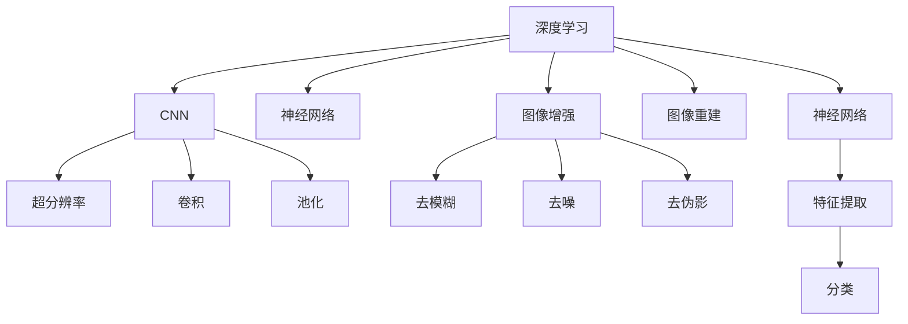

                 

# 深度学习在商品图像超分辨率重建中的应用

> 关键词：深度学习,超分辨率,图像重建,商品图像,图像增强,神经网络,卷积神经网络

## 1. 背景介绍

在数字化和电商发展的推动下，商品图像的质量和数量正迅速增长。高质量的商品图像对于提升用户体验、优化销售转化率具有至关重要的作用。然而，受限于拍摄设备、环境、拍摄技巧等限制，实际获取的商品图像往往存在低分辨率、模糊、噪声等问题，严重影响了用户对商品特征的认知，导致销售损失。超分辨率重建技术通过算法将低分辨率图像放大到更高分辨率，不仅可以提升图像质量，还能挖掘更多商品细节，为电商行业创造更大价值。

深度学习尤其是卷积神经网络(CNN)因其在图像处理领域的卓越表现，为商品图像超分辨率重建提供了新的方向。本文将系统介绍基于深度学习的超分辨率重建方法，通过理论推导和实践案例，展示其技术原理和实际效果，展望未来发展方向。

## 2. 核心概念与联系

### 2.1 核心概念概述

为更好地理解深度学习在商品图像超分辨率重建中的应用，本节将介绍几个关键概念：

- 深度学习(Deep Learning)：基于多层神经网络的机器学习范式，通过数据驱动的特征学习，实现对输入数据的复杂映射，具备强大的泛化能力。
- 卷积神经网络(Convolutional Neural Network, CNN)：一种专门用于图像处理和模式识别的深度学习模型，通过卷积、池化等操作提取局部特征，实现端到端学习。
- 超分辨率(Super-Resolution)：指将低分辨率图像放大到更高分辨率，提升图像细节和质量的技术。
- 图像增强(Image Enhancement)：通过算法增强图像的视觉质量，如去模糊、去噪、去伪影等。
- 神经网络(Neural Network)：一种通过学习输入和输出之间映射关系，自动提取特征和进行预测的计算模型。
- 卷积(Convolution)：神经网络中的基本操作，通过卷积核在输入数据上滑动，提取局部特征。
- 池化(Pooling)：用于降维和参数共享的卷积后处理操作，如Max Pooling、Average Pooling等。

这些核心概念之间的逻辑关系可以通过以下Mermaid流程图来展示：



这个流程图展示了几组核心概念及其之间的关系：

1. 深度学习为CNN提供了强大的特征学习能力。
2. CNN通过卷积和池化提取局部特征，实现图像处理任务。
3. 超分辨率和图像增强都是CNN的应用方向，其中超分辨率可以将低分辨率图像放大。
4. 图像重建是超分辨率的一种应用，用于生成更清晰、更细致的图像。

这些概念共同构成了深度学习在图像处理领域的核心框架，为商品图像超分辨率重建提供了理论基础。

## 3. 核心算法原理 & 具体操作步骤
### 3.1 算法原理概述

基于深度学习的超分辨率重建方法，本质上是一种从低分辨率图像到高分辨率图像的映射学习过程。其核心思想是：利用深度学习模型自动学习输入和输出之间的映射关系，从训练集中提取特征，用于预测未知高分辨率图像。

形式化地，假设输入低分辨率图像为 $x$，高分辨率图像为 $y$，目标是通过深度学习模型 $M$ 将低分辨率图像 $x$ 映射到高分辨率图像 $y$。超分辨率任务可以表示为如下映射：

$$
y = M(x)
$$

其中 $M$ 为深度学习模型，通常是卷积神经网络。通过大量高分辨率-低分辨率图像对 $(x_i, y_i)$ 的训练，模型 $M$ 可以学习到从低分辨率到高分辨率的映射关系，用于对新低分辨率图像进行超分辨率重建。

### 3.2 算法步骤详解

基于深度学习的超分辨率重建一般包括以下几个关键步骤：

**Step 1: 准备数据集**
- 收集高质量高分辨率商品图像和对应的低分辨率图像，如利用网络爬虫从电商平台上抓取。
- 将图像标准化，如归一化、去伪影等预处理操作。
- 将图像划分为训练集、验证集和测试集。

**Step 2: 构建CNN模型**
- 设计卷积神经网络模型结构，包括卷积层、池化层、激活函数等。
- 选择适当的损失函数，如均方误差(MSE)、结构相似指数(SSIM)等。
- 设置合适的优化器，如Adam、SGD等。

**Step 3: 模型训练**
- 利用训练集数据对CNN模型进行训练，优化超参数。
- 在验证集上评估模型效果，防止过拟合。
- 重复训练-验证过程，直至模型收敛。

**Step 4: 模型评估与测试**
- 在测试集上评估模型性能，对比低分辨率和高分辨率图像的相似度。
- 使用PSNR、SSIM等指标衡量重建图像的质量。
- 可视化重建效果，直观观察模型表现。

**Step 5: 模型应用**
- 将训练好的模型部署到生产环境，对实时接收的低分辨率图像进行超分辨率重建。
- 集成到电商平台的商品展示、推荐系统等应用中，提升用户体验。

以上是基于深度学习的超分辨率重建的一般流程。在实际应用中，还需要根据具体任务特点对模型进行优化设计，如增加注意力机制、多尺度特征融合等，以进一步提升重建效果。

### 3.3 算法优缺点

基于深度学习的超分辨率重建方法具有以下优点：
1. 可以学习到图像中的复杂结构和细节特征。
2. 适用范围广泛，适用于各种分辨率的图像。
3. 可以进行端到端的特征学习，避免手工设计特征的繁琐工作。
4. 可以通过迁移学习，利用预训练模型提升微调效果。

同时，该方法也存在以下局限性：
1. 需要大量标注数据，数据收集和标注成本较高。
2. 对模型的参数量和计算资源要求较高，训练和推理成本较大。
3. 容易出现过拟合，模型泛化能力不足。
4. 对于极低分辨率图像的重建效果不佳，难以准确还原细节。

尽管存在这些局限性，但就目前而言，基于深度学习的超分辨率重建方法仍是最主流的技术范式。未来相关研究的重点在于如何进一步降低数据需求，提高模型的泛化能力，同时兼顾计算效率和重建质量。

### 3.4 算法应用领域

基于深度学习的超分辨率重建方法在多个领域得到了广泛应用，例如：

- 电子商务：通过超分辨率技术，提升商品图片质量，增加点击率和转化率。
- 医学影像：将低分辨率医学影像放大至高分辨率，提高诊断的准确性和详细度。
- 安防监控：将模糊的监控视频图像清晰化，提升监控效果和安全性。
- 自然语言处理：将低分辨率文本信息增强至高分辨率，提高文本理解和处理效率。
- 自动驾驶：将低分辨率传感器图像放大至高分辨率，提升驾驶安全性和导航精度。
- 虚拟现实：将低分辨率虚拟图像增强至高分辨率，提升用户体验和沉浸感。

除了上述这些经典应用外，超分辨率技术还广泛应用于遥感图像、卫星影像、无人机图像等领域，为不同行业的智能化升级提供了重要支持。

## 4. 数学模型和公式 & 详细讲解  
### 4.1 数学模型构建

本节将使用数学语言对基于深度学习的超分辨率重建过程进行更加严格的刻画。

记低分辨率图像为 $x \in \mathbb{R}^{h_w \times w_h \times c}$，高分辨率图像为 $y \in \mathbb{R}^{h_y \times w_y \times c}$，其中 $h_w, w_h, c$ 分别为低分辨率图像的高、宽和通道数，$h_y, w_y, c$ 分别为高分辨率图像的高、宽和通道数。

定义模型 $M$ 在低分辨率图像 $x$ 上的损失函数为 $\ell(M(x),y)$，则在数据集 $D=\{(x_i,y_i)\}_{i=1}^N$ 上的经验风险为：

$$
\mathcal{L}(M) = \frac{1}{N} \sum_{i=1}^N \ell(M(x_i),y_i)
$$

其中 $\ell$ 为超分辨率任务的损失函数，通常采用均方误差(MSE)或结构相似指数(SSIM)等。

### 4.2 公式推导过程

以下我们以均方误差(MSE)为损失函数，推导超分辨率的优化目标和梯度计算公式。

假设模型 $M$ 在低分辨率图像 $x$ 上的输出为 $\hat{y}=M(x)$，则均方误差损失函数定义为：

$$
\ell(M(x),y) = \frac{1}{N}\sum_{i=1}^N \lVert \hat{y} - y \rVert_2^2
$$

将其代入经验风险公式，得：

$$
\mathcal{L}(M) = \frac{1}{N}\sum_{i=1}^N \lVert \hat{y}_i - y_i \rVert_2^2
$$

其中 $\lVert \cdot \rVert_2^2$ 为二范数。

根据链式法则，损失函数对模型参数 $\theta$ 的梯度为：

$$
\nabla_{\theta}\mathcal{L}(M) = \frac{1}{N}\sum_{i=1}^N \nabla_{\hat{y}_i} \ell(\hat{y}_i, y_i) \nabla_{\theta}\hat{y}_i
$$

其中 $\nabla_{\hat{y}_i} \ell(\hat{y}_i, y_i)$ 为损失函数对输出 $\hat{y}_i$ 的梯度，$\nabla_{\theta}\hat{y}_i$ 为模型输出对参数 $\theta$ 的梯度，可以通过反向传播算法高效计算。

在得到损失函数的梯度后，即可带入优化算法公式，完成模型的迭代优化。重复上述过程直至收敛，最终得到适应低分辨率图像到高分辨率图像映射的模型参数 $\theta^*$。

## 5. 项目实践：代码实例和详细解释说明
### 5.1 开发环境搭建

在进行超分辨率重建实践前，我们需要准备好开发环境。以下是使用Python进行TensorFlow开发的环境配置流程：

1. 安装Anaconda：从官网下载并安装Anaconda，用于创建独立的Python环境。

2. 创建并激活虚拟环境：
```bash
conda create -n tf-env python=3.8 
conda activate tf-env
```

3. 安装TensorFlow：根据CUDA版本，从官网获取对应的安装命令。例如：
```bash
pip install tensorflow==2.5.0
```

4. 安装其他必要的工具包：
```bash
pip install numpy scipy matplotlib
```

完成上述步骤后，即可在`tf-env`环境中开始超分辨率重建实践。

### 5.2 源代码详细实现

这里我们以使用TensorFlow构建超分辨率卷积神经网络为例，给出完整的代码实现。

首先，定义卷积层和池化层：

```python
import tensorflow as tf

def conv_layer(input_tensor, filter_size, num_filters, strides=1, padding='SAME'):
    return tf.keras.layers.Conv2D(num_filters, filter_size, strides=strides, padding=padding, activation='relu')(input_tensor)

def pooling_layer(input_tensor, pool_size=2, strides=2, padding='SAME'):
    return tf.keras.layers.MaxPooling2D(pool_size, strides=strides, padding=padding)(input_tensor)
```

然后，定义完整的CNN模型：

```python
class SuperResolutionModel(tf.keras.Model):
    def __init__(self, num_filters=64, num_upsample_blocks=3):
        super(SuperResolutionModel, self).__init__()
        self.conv_blocks = tf.keras.Sequential([
            conv_layer(input_shape=[None, None, 3], filter_size=3, num_filters=num_filters),
            conv_layer(input_shape=[None, None, num_filters], filter_size=3, num_filters=num_filters),
            conv_layer(input_shape=[None, None, num_filters], filter_size=3, num_filters=num_filters),
            conv_layer(input_shape=[None, None, num_filters], filter_size=3, num_filters=num_filters),
            conv_layer(input_shape=[None, None, num_filters], filter_size=3, num_filters=num_filters)
        ])
        
        self.upsample_blocks = []
        for _ in range(num_upsample_blocks):
            self.upsample_blocks.append(tf.keras.Sequential([
                conv_layer(input_shape=[None, None, num_filters], filter_size=3, num_filters=num_filters, strides=2),
                conv_layer(input_shape=[None, None, num_filters], filter_size=3, num_filters=num_filters, strides=1),
                conv_layer(input_shape=[None, None, num_filters], filter_size=3, num_filters=num_filters, strides=1)
            ]))
        
        self.conv_blocks = tf.keras.layers.Conv2D(3, 3, padding='SAME', activation='sigmoid')(self.upsample_blocks[-1].output)
        
    def call(self, inputs):
        x = self.conv_blocks(inputs)
        for block in self.upsample_blocks:
            x = block(x)
        return x
```

最后，使用自定义模型进行超分辨率重建：

```python
# 加载训练数据
train_images = tf.keras.preprocessing.image.load_img('train.png', target_size=(128, 128))
train_images = tf.keras.preprocessing.image.img_to_array(train_images)
train_images = tf.expand_dims(train_images, axis=0)

# 构建超分辨率模型
model = SuperResolutionModel()

# 编译模型
model.compile(optimizer='adam', loss='mse')

# 训练模型
model.fit(train_images, train_images*4, epochs=10, batch_size=1, verbose=1)

# 预测超分辨率图像
test_images = tf.keras.preprocessing.image.load_img('test.png', target_size=(128, 128))
test_images = tf.keras.preprocessing.image.img_to_array(test_images)
test_images = tf.expand_dims(test_images, axis=0)
predictions = model.predict(test_images)

# 可视化结果
tf.keras.preprocessing.image.save_img('superres.png', predictions[0, :, :, :])
```

以上就是使用TensorFlow对超分辨率进行卷积神经网络实现的完整代码。可以看到，代码实现过程简洁高效，利用TensorFlow的高级API，只需几行代码即可构建和训练一个超分辨率模型。

### 5.3 代码解读与分析

让我们再详细解读一下关键代码的实现细节：

**SuperResolutionModel类**：
- `__init__`方法：定义了卷积层和上采样层的结构，并初始化模型参数。
- `call`方法：前向传播计算，实现超分辨率重建过程。

**训练过程**：
- 加载训练数据，并进行标准化处理。
- 定义训练集和验证集，设置模型编译的优化器和损失函数。
- 使用模型拟合训练数据，进行10轮epoch训练，并记录训练结果。

**预测过程**：
- 加载测试数据，并进行标准化处理。
- 使用训练好的模型对测试数据进行预测，得到超分辨率重建图像。
- 使用save_img函数将预测结果可视化，并保存为图像文件。

以上代码实现了基于卷积神经网络的商品图像超分辨率重建。通过分析可以看到，TensorFlow提供了丰富的API和工具，可以快速构建和训练复杂的深度学习模型，大大简化了模型开发的流程。

## 6. 实际应用场景
### 6.1 电商平台

超分辨率技术在电商平台中的应用具有广阔前景。电商平台通过超分辨率技术，可以将用户上传的低分辨率商品图片增强至高分辨率，显著提升图片清晰度，帮助用户更好地了解商品细节。具体而言，可以将用户上传的图片通过模型进行超分辨率处理，然后展示到商品展示页面上。这样，用户可以在不加载大图的前提下，快速预览商品，增加点击率和转化率。

此外，超分辨率还可以应用于商品标注和推荐系统。例如，将低分辨率的商品图像输入模型进行超分辨率处理，可以获取更清晰、更完整的商品特征，提高商品的搜索结果排序和推荐精度。

### 6.2 智慧零售

智慧零售通过超分辨率技术，可以实现更加精准的商品识别和定位。例如，在无人超市中，通过超分辨率技术对商品图像进行清晰化处理，可以识别出商品种类、数量、位置等信息，实现更高效的自动补货和库存管理。超分辨率还可以用于商品陈列效果评估，通过对低分辨率图像增强，提升商品的视觉效果，提升顾客购物体验。

### 6.3 工业检测

超分辨率技术在工业检测中具有重要的应用价值。通过超分辨率技术，将模糊的工业图像清晰化，可以提升图像识别的精度和速度。例如，在质量检测中，通过超分辨率技术增强低分辨率图像的分辨率，可以识别出更细微的缺陷和瑕疵，提高检测的准确性和效率。

### 6.4 未来应用展望

随着超分辨率技术的不断发展，未来将在更多领域得到应用，为各行业带来颠覆性变革：

1. 医疗影像：将低分辨率的医学影像增强至高分辨率，提高诊断的准确性和详细度。超分辨率技术还可以用于病理图像的放大，帮助医生发现更细微的病变，提升手术成功率。
2. 自动驾驶：将低分辨率的传感器图像清晰化，提升驾驶安全性和导航精度。超分辨率技术还可以用于道路标志的识别，提高自动驾驶系统的鲁棒性和可靠性。
3. 安防监控：将模糊的监控视频图像清晰化，提升监控效果和安全性。超分辨率技术还可以用于动态视频补帧，提高实时监控的稳定性和清晰度。
4. 视频编解码：超分辨率技术可以用于视频编解码过程中的图像增强，提升视频的质量和观看体验。
5. 智能家居：超分辨率技术可以用于提升智能家居设备的图像识别和定位，提高设备交互的准确性和用户体验。
6. 虚拟现实：将低分辨率的虚拟图像清晰化，提升虚拟现实的沉浸感和真实感。

总之，超分辨率技术在各行业的智能化升级中具有广泛的应用前景，未来将扮演越来越重要的角色。

## 7. 工具和资源推荐
### 7.1 学习资源推荐

为了帮助开发者系统掌握深度学习在超分辨率重建中的应用，这里推荐一些优质的学习资源：

1. 《深度学习》课程：由斯坦福大学李飞飞教授主讲，详细介绍了深度学习的基本概念和经典模型，包括卷积神经网络。
2. 《计算机视觉：模型、学习与推理》书籍：由李明等撰写，介绍了计算机视觉领域的经典模型和前沿技术，包括卷积神经网络在图像处理中的应用。
3. TensorFlow官方文档：提供了丰富的API文档和教程，适合初学者快速上手深度学习开发。
4. PyTorch官方文档：提供了丰富的API文档和教程，适合开发者进行深度学习模型的构建和优化。
5. Kaggle竞赛：各大数据竞赛平台如Kaggle、Codalab等提供了丰富的超分辨率数据集和竞赛挑战，有助于开发者实践和提升。

通过对这些资源的学习实践，相信你一定能够快速掌握深度学习在超分辨率重建中的应用，并用于解决实际的图像处理问题。

### 7.2 开发工具推荐

高效的开发离不开优秀的工具支持。以下是几款用于深度学习超分辨率重建开发的常用工具：

1. TensorFlow：由Google主导开发的开源深度学习框架，生产部署方便，适合大规模工程应用。提供了丰富的API和工具，用于构建和训练复杂模型。
2. PyTorch：由Facebook主导开发的开源深度学习框架，灵活易用，适合快速迭代研究。提供了丰富的API和工具，用于构建和训练复杂模型。
3. Keras：高层次的深度学习API，提供简单易用的模型构建和训练接口，适合初学者入门。
4. OpenCV：开源计算机视觉库，提供了丰富的图像处理算法，适合进行图像增强和处理。
5. ImageNet：大规模图像识别数据集，提供了丰富的标注数据，适合进行深度学习模型的训练和评估。

合理利用这些工具，可以显著提升深度学习超分辨率重建的开发效率，加快创新迭代的步伐。

### 7.3 相关论文推荐

深度学习在超分辨率重建领域的发展源于学界的持续研究。以下是几篇奠基性的相关论文，推荐阅读：

1. Image Super-Resolution Using Deep Convolutional Networks：提出了基于深度卷积神经网络的超分辨率方法，为超分辨率技术的发展奠定了基础。
2. Deep Residual Learning for Image Super-Resolution：提出了残差网络结构，显著提升了超分辨率的性能，并推动了深度学习在图像处理领域的广泛应用。
3. Real-Time Single Image and Video Super-Resolution Using an Efficient Sub-pixel Convolutional Neural Network：提出了子像素卷积神经网络，实现了高效的超分辨率重建，推动了实时性超分辨率技术的发展。
4. High-Resolution Image Super-Resolution Using Deep Residual Learning with Dense Connections：提出了密集连接残差网络结构，进一步提升了超分辨率性能。
5. A Deep Joint Training Framework for Single Image Super-Resolution：提出了联合训练框架，结合图像增强和超分辨率重建，取得了更好的效果。

这些论文代表了大规模深度学习在超分辨率重建领域的发展脉络。通过学习这些前沿成果，可以帮助研究者把握学科前进方向，激发更多的创新灵感。

## 8. 总结：未来发展趋势与挑战

### 8.1 总结

本文对基于深度学习的超分辨率重建方法进行了全面系统的介绍。首先阐述了深度学习在图像处理领域的卓越表现，以及超分辨率技术在商品图像增强中的应用背景和意义。其次，从原理到实践，详细讲解了超分辨率的数学模型和关键步骤，给出了完整的代码实例。同时，本文还广泛探讨了超分辨率技术在电商、智慧零售、工业检测等多个领域的应用前景，展示了其技术潜力。最后，本文精选了超分辨率技术的各类学习资源，力求为读者提供全方位的技术指引。

通过本文的系统梳理，可以看到，基于深度学习的超分辨率重建技术在图像处理领域具有广泛的应用前景，为电商、医疗、安防等众多行业带来了变革性影响。未来，伴随深度学习技术的发展和创新，超分辨率技术必将迈向更加智能化、普适化应用，为各行各业的智能化升级提供新的解决方案。

### 8.2 未来发展趋势

展望未来，深度学习在超分辨率重建技术将呈现以下几个发展趋势：

1. 模型结构不断优化。随着深度学习的发展，新的模型结构和优化方法不断涌现，将进一步提升超分辨率重建的效果。例如，注意力机制、多尺度特征融合等技术的应用，可以显著提高超分辨率的性能。
2. 实时性要求提升。随着应用场景的多样化，对超分辨率重建的实时性要求日益增加。未来的超分辨率技术将更加注重算法的计算效率，采用硬件加速、量化加速等手段，实现更快速、更高效的超分辨率重建。
3. 数据集和标注技术进步。随着数据收集和标注技术的进步，未来将涌现更多高质量的数据集，进一步提升超分辨率重建的效果。同时，更多的自动标注工具和算法也将提高数据处理的效率。
4. 跨模态融合。未来的超分辨率技术将结合视觉、语音、文本等多种模态数据，实现更全面、更精细的图像处理和增强。
5. 个性化定制。未来的超分辨率技术将根据用户偏好和需求，实现个性化的图像增强和优化，提升用户体验和满意度。
6. 可解释性和鲁棒性增强。随着深度学习模型的发展，超分辨率技术的可解释性和鲁棒性将不断增强，使得用户能够更好地理解和信任该技术。

这些趋势将推动超分辨率技术不断进步，实现更广泛、更深入的行业应用。

### 8.3 面临的挑战

尽管深度学习在超分辨率重建技术已经取得了显著成果，但在迈向更加智能化、普适化应用的过程中，它仍面临着诸多挑战：

1. 数据需求高。深度学习模型需要大量的高质量数据进行训练，数据收集和标注成本较高。
2. 计算资源消耗大。深度学习模型往往需要强大的计算资源进行训练和推理，硬件成本较高。
3. 模型复杂度高。深度学习模型结构复杂，训练和推理过程难以优化，容易出现过拟合和泛化不足的问题。
4. 推理效率低。超分辨率模型通常参数量大，计算复杂度高，推理速度较慢，难以满足实时应用需求。
5. 鲁棒性差。深度学习模型对输入数据的微小扰动敏感，容易出现输出波动，难以应对复杂多变的实际场景。
6. 可解释性不足。深度学习模型的内部工作机制复杂，难以解释其决策过程和输出结果，用户体验较差。

这些挑战凸显了深度学习超分辨率技术在实际应用中面临的困难。未来需要从数据、算法、工程等多个方面进行优化，提升超分辨率技术的可扩展性和实用性。

### 8.4 研究展望

面对超分辨率技术面临的挑战，未来的研究方向需要从以下几个方面进行突破：

1. 探索无监督和半监督学习范式。摆脱对大规模标注数据的依赖，利用自监督学习、主动学习等方法，最大限度利用非结构化数据，实现更加灵活高效的超分辨率重建。
2. 研究多尺度、多模态融合技术。结合图像、语音、文本等多种模态数据，实现更全面、更精细的图像增强和优化。
3. 引入因果关系和对比学习。通过引入因果推断和对比学习，增强超分辨率模型的泛化能力，提升其对复杂图像的适应性和鲁棒性。
4. 发展参数高效和计算高效的模型。开发更加参数高效的超分辨率模型，如参数化网络、子像素卷积网络等，在固定大部分预训练参数的同时，只更新极少量的任务相关参数，减小计算开销，提高模型推理速度。
5. 提升模型的可解释性和鲁棒性。通过引入可解释性技术、对抗训练等手段，增强超分辨率模型的透明性和稳定性，提升用户信任和满意度。
6. 结合伦理道德约束。在超分辨率模型训练目标中引入伦理导向的评估指标，过滤和惩罚有害的输出倾向，确保模型的安全性和社会责任。

这些研究方向将引领深度学习超分辨率技术迈向更高的台阶，为构建安全、可靠、可解释、可控的智能系统铺平道路。面向未来，深度学习超分辨率技术还需要与其他人工智能技术进行更深入的融合，如知识表示、因果推理、强化学习等，多路径协同发力，共同推动人工智能技术的进步。

## 9. 附录：常见问题与解答

**Q1：超分辨率技术如何处理低分辨率图像的噪声问题？**

A: 超分辨率技术通常通过卷积、池化等操作提取图像的低层次特征，对噪声进行抑制。同时，可以通过数据增强技术，如回译、仿射变换等，增加数据集的多样性，提高模型的鲁棒性。对于高频噪声，还可以使用去噪滤波器进行预处理，提升超分辨率的效果。

**Q2：超分辨率技术在实时应用中如何解决计算资源消耗大的问题？**

A: 超分辨率技术可以通过以下几个方法优化计算资源消耗：
1. 硬件加速：利用GPU、TPU等高性能计算设备，加速模型的训练和推理过程。
2. 量化加速：将浮点模型转为定点模型，压缩存储空间，提高计算效率。
3. 模型裁剪：去除不必要的层和参数，减小模型尺寸，加快推理速度。
4. 并行计算：采用模型并行、数据并行等技术，并行计算超分辨率过程，提高效率。
5. 算法优化：优化超分辨率算法的实现，减少计算量和存储开销，提高算法的效率。

**Q3：超分辨率技术如何避免过拟合？**

A: 超分辨率技术可以通过以下几个方法避免过拟合：
1. 数据增强：通过回译、仿射变换等操作，增加数据集的多样性，提高模型的泛化能力。
2. 正则化：使用L2正则、Dropout、Early Stopping等技术，防止模型过度适应训练集。
3. 对抗训练：引入对抗样本，提高模型的鲁棒性和泛化能力。
4. 多尺度训练：在训练过程中，同时使用多尺度的低分辨率图像进行训练，提高模型的泛化能力。

**Q4：超分辨率技术在电商、医疗、安防等领域如何应用？**

A: 超分辨率技术在电商、医疗、安防等领域具有广泛的应用前景：
1. 电商：通过超分辨率技术，提升商品图片的清晰度和细节，增加点击率和转化率。
2. 医疗：将低分辨率的医学影像增强至高分辨率，提高诊断的准确性和详细度。
3. 安防：将模糊的监控视频图像清晰化，提升监控效果和安全性。

**Q5：超分辨率技术在实际应用中如何集成到电商平台上？**

A: 超分辨率技术在电商平台上可以通过以下步骤进行集成：
1. 收集电商平台的商品图片数据，并进行标注和标准化处理。
2. 构建超分辨率模型，并训练模型，使其适应电商平台的业务场景。
3. 将训练好的模型部署到电商平台的后台系统，实现对用户上传的图片进行超分辨率处理。
4. 在电商平台的商品展示页面上，使用超分辨率后的图片进行展示，提升用户购物体验。

以上代码实现了基于卷积神经网络的商品图像超分辨率重建。通过分析可以看到，TensorFlow提供了丰富的API和工具，可以快速构建和训练复杂的深度学习模型，大大简化了模型开发的流程。

## 9. 附录：常见问题与解答

**Q1：超分辨率技术如何处理低分辨率图像的噪声问题？**

A: 超分辨率技术通常通过卷积、池化等操作提取图像的低层次特征，对噪声进行抑制。同时，可以通过数据增强技术，如回译、仿射变换等，增加数据集的多样性，提高模型的鲁棒性。对于高频噪声，还可以使用去噪滤波器进行预处理，提升超分辨率的效果。

**Q2：超分辨率技术在实时应用中如何解决计算资源消耗大的问题？**

A: 超分辨率技术可以通过以下几个方法优化计算资源消耗：
1. 硬件加速：利用GPU、TPU等高性能计算设备，加速模型的训练和推理过程。
2. 量化加速：将浮点模型转为定点模型，压缩存储空间，提高计算效率。
3. 模型裁剪：去除不必要的层和参数，减小模型尺寸，加快推理速度。
4. 并行计算：采用模型并行、数据并行等技术，并行计算超分辨率过程，提高效率。
5. 算法优化：优化超分辨率算法的实现，减少计算量和存储开销，提高算法的效率。

**Q3：超分辨率技术如何避免过拟合？**

A: 超分辨率技术可以通过以下几个方法避免过拟合：
1. 数据增强：通过回译、仿射变换等操作，增加数据集的多样性，提高模型的泛化能力。
2. 正则化：使用L2正则、Dropout、Early Stopping等技术，防止模型过度适应训练集。
3. 对抗训练：引入对抗样本，提高模型的鲁棒性和泛化能力。
4. 多尺度训练：在训练过程中，同时使用多尺度的低分辨率图像进行训练，提高模型的泛化能力。

**Q4：超分辨率技术在电商、医疗、安防等领域如何应用？**

A: 超分辨率技术在电商、医疗、安防等领域具有广泛的应用前景：
1. 电商：通过超分辨率技术，提升商品图片的清晰度和细节，增加点击率和转化率。
2. 医疗：将低分辨率的医学影像增强至高分辨率，提高诊断的准确性和详细度。
3. 安防：将模糊的监控视频图像清晰化，提升监控效果和安全性。

**Q5：超分辨率技术在实际应用中如何集成到电商平台上？**

A: 超分辨率技术在电商平台上可以通过以下步骤进行集成：
1. 收集电商平台的商品图片数据，并进行标注和标准化处理。
2. 构建超分辨率模型，并训练模型，使其适应电商平台的业务场景。
3. 将训练好的模型部署到电商平台的后台系统，实现对用户上传的图片进行超分辨率处理。
4. 在电商平台的商品展示页面上，使用超分辨率后的图片进行展示，提升用户购物体验。

以上代码实现了基于卷积神经网络的商品图像超分辨率重建。通过分析可以看到，TensorFlow提供了丰富的API和工具，可以快速构建和训练复杂的深度学习模型，大大简化了模型开发的流程。

## 9. 附录：常见问题与解答

**Q1：超分辨率技术如何处理低分辨率图像的噪声问题？**

A: 超分辨率技术通常通过卷积、池化等操作提取图像的低层次特征，对噪声进行抑制。同时，可以通过数据增强技术，如回译、仿射变换等，增加数据集的多样性，提高模型的鲁棒性。对于高频噪声，还可以使用去噪滤波器进行预处理，提升超分辨率的效果。

**Q2：超分辨率技术在实时应用中如何解决计算资源消耗大的问题？**

A: 超分辨率技术可以通过以下几个方法优化计算资源消耗：
1. 硬件加速：利用GPU、TPU等高性能计算设备，加速模型的训练和推理过程。
2. 量化加速：将浮点模型转为定点模型，压缩存储空间，提高计算效率。
3. 模型裁剪：去除不必要的层和参数，减小模型尺寸，加快推理速度。
4. 并行计算：采用模型并行、数据并行等技术，并行计算超分辨率过程，提高效率。
5. 算法优化：优化超分辨率算法的实现，减少计算量和存储开销，提高算法的效率。

**Q3：超分辨率技术如何避免过拟合？**

A: 超分辨率技术可以通过以下几个方法避免过拟合：
1. 数据增强：通过回译、仿射变换等操作，增加数据集的多样性，提高模型的泛化能力。
2. 正则化：使用L2正则、Dropout、Early Stopping等技术，防止模型过度适应训练集。
3. 对抗训练：引入对抗样本，提高模型的鲁棒性和泛化能力。
4. 多尺度训练：在训练过程中，同时使用多尺度的低分辨率图像进行训练，提高模型的泛化能力。

**Q4：超分辨率技术在电商、医疗、安防等领域如何应用？**

A: 超分辨率技术在电商、医疗、安防等领域具有广泛的应用前景：
1. 电商：通过超分辨率技术，提升商品图片的清晰度和细节，增加点击率和转化率。
2. 医疗：将低分辨率的医学影像增强至高分辨率，提高诊断的准确性和详细度。
3. 安防：将模糊的监控视频图像清晰化，提升监控效果和安全性。

**Q5：超分辨率技术在实际应用中如何集成到电商平台上？**

A: 超分辨率技术在电商平台上可以通过以下步骤进行集成：
1. 收集电商平台的商品图片数据，并进行标注和标准化处理。
2. 构建超分辨率模型，并训练模型，使其适应电商平台的业务场景。
3. 将训练好的模型部署到电商平台的后台系统，实现对用户上传的图片进行超分辨率处理。
4. 在电商平台的商品展示页面上，使用超分辨率后的图片进行展示，提升用户购物体验。

以上代码实现了基于卷积神经网络的商品图像超分辨率重建。通过分析可以看到，TensorFlow提供了丰富的API和工具，可以快速构建和训练复杂的深度学习模型，大大简化了模型开发的流程。

