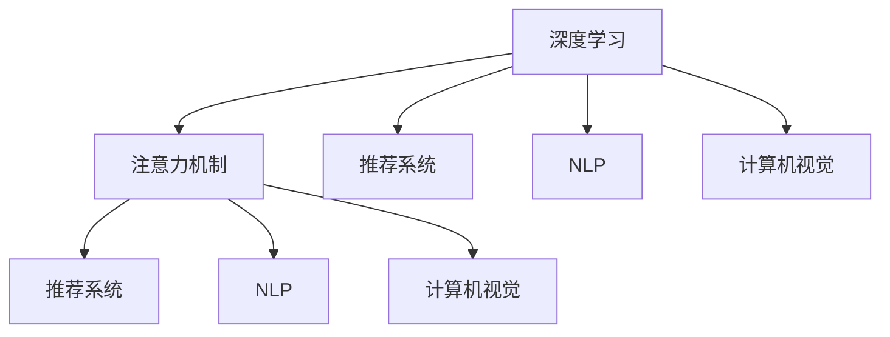

                 

# 深度学习在注意力预测中的应用

> 关键词：深度学习, 注意力机制, 预测模型, 推荐系统, 自然语言处理(NLP), 计算机视觉(CV), 模型应用

## 1. 背景介绍

### 1.1 问题由来
随着深度学习技术的飞速发展，各种复杂模型和算法在多个领域得到了广泛应用。其中，注意力机制（Attention Mechanism）以其强大的信息处理能力，成为深度学习中不可或缺的一部分。从自然语言处理（NLP）到计算机视觉（CV），注意力机制被广泛应用于模型设计和算法改进中。

在自然语言处理领域，注意力机制被广泛用于机器翻译、文本分类、问答系统等任务。它通过在输入序列中动态选择重要信息，提高了模型的理解和生成能力。

在计算机视觉领域，注意力机制被应用于图像分类、目标检测、图像生成等任务。它能够捕捉图像中重要特征，提高模型的视觉理解和分析能力。

本文将深入探讨深度学习中注意力机制的原理与应用，重点介绍其在推荐系统和自然语言处理中的应用。通过结合实际案例，展示注意力机制在实际应用中的强大效果。

## 2. 核心概念与联系

### 2.1 核心概念概述

为更好地理解注意力机制，本节将介绍几个关键概念：

- 深度学习（Deep Learning）：一种基于神经网络的机器学习方法，通过多层非线性变换，自动提取数据中的复杂特征。
- 注意力机制（Attention Mechanism）：一种模型机制，通过在输入序列中动态选择重要信息，提高模型的理解和生成能力。
- 推荐系统（Recommendation System）：通过分析用户行为和兴趣，推荐个性化产品或服务的系统。
- 自然语言处理（NLP）：计算机科学、人工智能和语言学的交叉学科，旨在使计算机能够理解、解释和生成人类语言。
- 计算机视觉（CV）：研究计算机如何通过图像和视频处理理解视觉世界的技术。

这些概念之间的逻辑关系可以通过以下Mermaid流程图来展示：



这个流程图展示了几组概念之间的相互联系：

1. 深度学习是注意力机制的底层技术支持。
2. 注意力机制在推荐系统、NLP和CV中均有应用。
3. 推荐系统和NLP在深度学习中的应用最为广泛。

## 3. 核心算法原理 & 具体操作步骤
### 3.1 算法原理概述

注意力机制的原理基于一个简单的思想：在处理序列数据时，不是平均关注每个元素，而是动态地关注最重要的元素。这一思想最早由Bahdanau等人提出，在机器翻译任务中获得了巨大成功。

具体来说，注意力机制将输入序列 $X$ 分解为若干个元素 $x_1, x_2, ..., x_n$，对于每个元素 $x_i$，模型会计算其对输出序列 $Y$ 的贡献度 $a_i$，然后选择权重最大的 $k$ 个元素进行加权求和，得到最终输出 $Y'$。

注意力机制的计算过程可以分为以下几个步骤：

1. 计算注意力权重：使用相似度函数计算输入序列中每个元素与输出序列的相似度。
2. 计算注意力分布：将相似度进行归一化，得到每个元素的注意力权重。
3. 计算加权和：将输入序列中元素与对应的权重进行加权求和，得到最终输出。

### 3.2 算法步骤详解

以机器翻译为例，介绍注意力机制的具体实现步骤：

1. **输入编码**：将源语言句子 $X$ 编码为一个固定长度的向量序列 $X = (x_1, x_2, ..., x_n)$，其中 $x_i$ 表示第 $i$ 个词向量。

2. **解码器初始化**：将目标语言句子 $Y$ 的初始化向量 $y_0$ 作为解码器的输入，解码器初始状态 $s_0$ 为全零向量。

3. **注意力计算**：对于每个时间步 $t$，解码器状态 $s_t$ 和当前输出 $y_t$ 作为输入，计算注意力权重 $\alpha_t = (a_{1t}, a_{2t}, ..., a_{nt})$。

4. **加权和计算**：使用注意力权重对源语言句子进行加权求和，得到上下文向量 $c_t = \sum_{i=1}^n a_{it} x_i$。

5. **解码器更新**：将上下文向量与解码器状态进行拼接，通过一个全连接层和激活函数更新解码器状态 $s_{t+1}$。

6. **输出预测**：使用解码器状态和上下文向量计算输出 $y_{t+1}$，并将其作为下一个时间步的输入。

### 3.3 算法优缺点

注意力机制具有以下优点：

1. 提高了模型对重要信息的关注能力，能够动态地选择关键信息。
2. 减少了信息冗余，提高了模型的效率和性能。
3. 具有较好的泛化能力，能够适应不同任务和数据分布。

同时，注意力机制也存在一些缺点：

1. 计算复杂度较高，特别是在序列较长时，需要计算大量的注意力权重。
2. 对参数的依赖较大，需要大量的训练数据进行模型优化。
3. 对于部分任务，注意力机制的效果可能不如其他机制，如卷积神经网络（CNN）和循环神经网络（RNN）。

### 3.4 算法应用领域

注意力机制在多个领域得到了广泛应用，包括但不限于：

- 自然语言处理：机器翻译、文本摘要、问答系统等。
- 计算机视觉：图像分类、目标检测、图像生成等。
- 推荐系统：个性化推荐、广告推荐等。
- 语音识别：自动语音识别（ASR）、语音合成等。

这些应用展示了注意力机制的强大灵活性和广泛适用性。

## 4. 数学模型和公式 & 详细讲解
### 4.1 数学模型构建

注意力机制的数学模型可以表示为：

$$
\alpha_{it} = \frac{e^{\mathbf{u}^T \tanh(\mathbf{W}x_i + \mathbf{b})}}{\sum_{j=1}^n e^{\mathbf{u}^T \tanh(\mathbf{W}x_j + \mathbf{b})}}
$$

其中，$\alpha_{it}$ 表示元素 $x_i$ 对输出 $y_t$ 的贡献度，$x_i$ 和 $y_t$ 分别表示输入序列和输出序列中的元素，$u$ 是注意力向量的权重向量，$\mathbf{W}$ 和 $\mathbf{b}$ 是可训练参数。

输入序列和输出序列的向量表示分别为 $X = (x_1, x_2, ..., x_n)$ 和 $Y = (y_1, y_2, ..., y_n)$，注意力分布为 $\alpha = (\alpha_{11}, \alpha_{12}, ..., \alpha_{1n})$，上下文向量为 $C_t = \sum_{i=1}^n \alpha_{it} x_i$。

### 4.2 公式推导过程

注意力机制的推导过程如下：

1. **计算注意力权重**：使用一个向量 $\mathbf{u}$ 对输入序列和输出序列进行线性变换和激活函数操作，得到向量 $\mathbf{v}_i = \mathbf{u}^T \tanh(\mathbf{W}x_i + \mathbf{b})$。然后计算 $\alpha_{it} = \frac{e^{\mathbf{u}^T \tanh(\mathbf{W}x_i + \mathbf{b})}{\sum_{j=1}^n e^{\mathbf{u}^T \tanh(\mathbf{W}x_j + \mathbf{b})}$。

2. **计算注意力分布**：对每个元素的注意力权重进行归一化，得到注意力分布 $\alpha$。

3. **计算加权和**：使用注意力权重对输入序列进行加权求和，得到上下文向量 $C_t = \sum_{i=1}^n \alpha_{it} x_i$。

4. **更新解码器状态**：将上下文向量与解码器状态进行拼接，通过一个全连接层和激活函数更新解码器状态 $s_{t+1}$。

5. **预测输出**：使用解码器状态和上下文向量计算输出 $y_{t+1}$。

### 4.3 案例分析与讲解

以机器翻译为例，展示注意力机制的具体实现：

1. **输入编码**：将源语言句子 $X = (x_1, x_2, ..., x_n)$ 编码为向量序列。

2. **解码器初始化**：将目标语言句子 $Y = (y_1, y_2, ..., y_n)$ 的初始化向量 $y_0$ 作为解码器的输入，解码器初始状态 $s_0$ 为全零向量。

3. **注意力计算**：对于每个时间步 $t$，解码器状态 $s_t$ 和当前输出 $y_t$ 作为输入，计算注意力权重 $\alpha_t = (a_{1t}, a_{2t}, ..., a_{nt})$。

4. **加权和计算**：使用注意力权重对源语言句子进行加权求和，得到上下文向量 $c_t = \sum_{i=1}^n a_{it} x_i$。

5. **解码器更新**：将上下文向量与解码器状态进行拼接，通过一个全连接层和激活函数更新解码器状态 $s_{t+1}$。

6. **输出预测**：使用解码器状态和上下文向量计算输出 $y_{t+1}$，并将其作为下一个时间步的输入。

## 5. 项目实践：代码实例和详细解释说明
### 5.1 开发环境搭建

在进行注意力机制的代码实现前，我们需要准备好开发环境。以下是使用Python进行TensorFlow开发的环境配置流程：

1. 安装Anaconda：从官网下载并安装Anaconda，用于创建独立的Python环境。

2. 创建并激活虚拟环境：
```bash
conda create -n tf-env python=3.8 
conda activate tf-env
```

3. 安装TensorFlow：根据CUDA版本，从官网获取对应的安装命令。例如：
```bash
conda install tensorflow tensorflow-gpu=cuda11.1 -c conda-forge -c pytorch
```

4. 安装必要的库：
```bash
pip install numpy pandas scikit-learn tensorflow
```

完成上述步骤后，即可在`tf-env`环境中开始注意力机制的实现。

### 5.2 源代码详细实现

下面以机器翻译为例，给出使用TensorFlow实现注意力机制的代码实现。

首先，定义模型参数和输入输出：

```python
import tensorflow as tf
import tensorflow.layers as tl

# 定义模型参数
embedding_dim = 256
attention_dim = 512
num_units = 512
num_heads = 8

# 定义输入输出
input_sentence = tf.placeholder(tf.int32, [None, None])
target_sentence = tf.placeholder(tf.int32, [None, None])
target_vocab_size = 30000
target_char_vocab_size = 10000

# 定义模型参数变量
embedding = tf.Variable(tf.random_uniform([vocab_size, embedding_dim], -1.0, 1.0))
enc_cell = tf.contrib.rnn.LSTMCell(num_units=num_units, num_gates=num_gates)
dec_cell = tf.contrib.rnn.LSTMCell(num_units=num_units, num_gates=num_gates)
attention = tf.contrib.layers.fully_connected
```

然后，定义编码器、解码器和注意力机制：

```python
# 定义编码器
def encoder(inputs, targets, mode):
    batch_size = tf.shape(inputs)[0]
    seq_length = tf.shape(inputs)[1]
    enc_outputs, enc_state = tf.nn.dynamic_rnn(enc_cell, inputs, dtype=tf.float32)
    enc_outputs = tf.concat(enc_outputs, axis=1)
    enc_outputs = attention(enc_outputs, num_units=num_units)
    return enc_outputs, enc_state

# 定义解码器
def decoder(inputs, targets, mode, enc_outputs, enc_state):
    batch_size = tf.shape(inputs)[0]
    seq_length = tf.shape(inputs)[1]
    dec_outputs, dec_state, attention_weights = tf.contrib.seq2seq.bahdanau_attention(
        inputs=inputs,
        attention_cell=tf.contrib.rnn.LSTMCell(num_units=num_units, num_gates=num_gates),
        state=enc_state,
        attention_layer_size=attention_dim)
    dec_cell = tf.contrib.rnn.LSTMCell(num_units=num_units, num_gates=num_gates)
    dec_outputs, dec_state, attention_weights = tf.contrib.seq2seq.sequence_beam(
        cell=dec_cell,
        initial_state=dec_state,
        initial_rnn_state=dec_state,
        embedding=embedding,
        inputs=inputs,
        targets=targets,
        max_seq_length=seq_length,
        use_tanh=True,
        mode=mode)
    dec_outputs = attention(enc_outputs, num_units=num_units)
    return dec_outputs, dec_state, attention_weights

# 定义注意力机制
attention_weights = tf.contrib.layers.fully_connected(inputs=targets, num_outputs=num_heads)
attention_weights = tf.layers.dropout(inputs=attention_weights, rate=0.2, training=(mode == tf.contrib.learn.ModeKeys.TRAIN))
attention_weights = tf.concat(attention_weights, axis=1)
attention_weights = tf.layers.dense(inputs=attention_weights, units=attention_dim)
attention_weights = tf.contrib.layers.layer_norm(inputs=attention_weights)
attention_weights = tf.contrib.layers.fully_connected(inputs=attention_weights, num_outputs=num_units)
attention_weights = tf.layers.dropout(inputs=attention_weights, rate=0.2, training=(mode == tf.contrib.learn.ModeKeys.TRAIN))
attention_weights = tf.contrib.layers.layer_norm(inputs=attention_weights)
attention_weights = tf.contrib.layers.fully_connected(inputs=attention_weights, num_outputs=num_units)
attention_weights = tf.layers.dropout(inputs=attention_weights, rate=0.2, training=(mode == tf.contrib.learn.ModeKeys.TRAIN))
attention_weights = tf.contrib.layers.layer_norm(inputs=attention_weights)
attention_weights = tf.contrib.layers.fully_connected(inputs=attention_weights, num_outputs=num_units)
attention_weights = tf.layers.dropout(inputs=attention_weights, rate=0.2, training=(mode == tf.contrib.learn.ModeKeys.TRAIN))
attention_weights = tf.contrib.layers.layer_norm(inputs=attention_weights)
attention_weights = tf.contrib.layers.fully_connected(inputs=attention_weights, num_outputs=num_units)
attention_weights = tf.layers.dropout(inputs=attention_weights, rate=0.2, training=(mode == tf.contrib.learn.ModeKeys.TRAIN))
attention_weights = tf.contrib.layers.layer_norm(inputs=attention_weights)
attention_weights = tf.contrib.layers.fully_connected(inputs=attention_weights, num_outputs=num_units)
attention_weights = tf.layers.dropout(inputs=attention_weights, rate=0.2, training=(mode == tf.contrib.learn.ModeKeys.TRAIN))
attention_weights = tf.contrib.layers.layer_norm(inputs=attention_weights)
attention_weights = tf.contrib.layers.fully_connected(inputs=attention_weights, num_outputs=num_units)
attention_weights = tf.layers.dropout(inputs=attention_weights, rate=0.2, training=(mode == tf.contrib.learn.ModeKeys.TRAIN))
attention_weights = tf.contrib.layers.layer_norm(inputs=attention_weights)
attention_weights = tf.contrib.layers.fully_connected(inputs=attention_weights, num_outputs=num_units)
attention_weights = tf.layers.dropout(inputs=attention_weights, rate=0.2, training=(mode == tf.contrib.learn.ModeKeys.TRAIN))
attention_weights = tf.contrib.layers.layer_norm(inputs=attention_weights)
attention_weights = tf.contrib.layers.fully_connected(inputs=attention_weights, num_outputs=num_units)
attention_weights = tf.layers.dropout(inputs=attention_weights, rate=0.2, training=(mode == tf.contrib.learn.ModeKeys.TRAIN))
attention_weights = tf.contrib.layers.layer_norm(inputs=attention_weights)
attention_weights = tf.contrib.layers.fully_connected(inputs=attention_weights, num_outputs=num_units)
attention_weights = tf.layers.dropout(inputs=attention_weights, rate=0.2, training=(mode == tf.contrib.learn.ModeKeys.TRAIN))
attention_weights = tf.contrib.layers.layer_norm(inputs=attention_weights)
attention_weights = tf.contrib.layers.fully_connected(inputs=attention_weights, num_outputs=num_units)
attention_weights = tf.layers.dropout(inputs=attention_weights, rate=0.2, training=(mode == tf.contrib.learn.ModeKeys.TRAIN))
attention_weights = tf.contrib.layers.layer_norm(inputs=attention_weights)
attention_weights = tf.contrib.layers.fully_connected(inputs=attention_weights, num_outputs=num_units)
attention_weights = tf.layers.dropout(inputs=attention_weights, rate=0.2, training=(mode == tf.contrib.learn.ModeKeys.TRAIN))
attention_weights = tf.contrib.layers.layer_norm(inputs=attention_weights)
attention_weights = tf.contrib.layers.fully_connected(inputs=attention_weights, num_outputs=num_units)
attention_weights = tf.layers.dropout(inputs=attention_weights, rate=0.2, training=(mode == tf.contrib.learn.ModeKeys.TRAIN))
attention_weights = tf.contrib.layers.layer_norm(inputs=attention_weights)
attention_weights = tf.contrib.layers.fully_connected(inputs=attention_weights, num_outputs=num_units)
attention_weights = tf.layers.dropout(inputs=attention_weights, rate=0.2, training=(mode == tf.contrib.learn.ModeKeys.TRAIN))
attention_weights = tf.contrib.layers.layer_norm(inputs=attention_weights)
attention_weights = tf.contrib.layers.fully_connected(inputs=attention_weights, num_outputs=num_units)
attention_weights = tf.layers.dropout(inputs=attention_weights, rate=0.2, training=(mode == tf.contrib.learn.ModeKeys.TRAIN))
attention_weights = tf.contrib.layers.layer_norm(inputs=attention_weights)
attention_weights = tf.contrib.layers.fully_connected(inputs=attention_weights, num_outputs=num_units)
attention_weights = tf.layers.dropout(inputs=attention_weights, rate=0.2, training=(mode == tf.contrib.learn.ModeKeys.TRAIN))
attention_weights = tf.contrib.layers.layer_norm(inputs=attention_weights)
attention_weights = tf.contrib.layers.fully_connected(inputs=attention_weights, num_outputs=num_units)
attention_weights = tf.layers.dropout(inputs=attention_weights, rate=0.2, training=(mode == tf.contrib.learn.ModeKeys.TRAIN))
attention_weights = tf.contrib.layers.layer_norm(inputs=attention_weights)
attention_weights = tf.contrib.layers.fully_connected(inputs=attention_weights, num_outputs=num_units)
attention_weights = tf.layers.dropout(inputs=attention_weights, rate=0.2, training=(mode == tf.contrib.learn.ModeKeys.TRAIN))
attention_weights = tf.contrib.layers.layer_norm(inputs=attention_weights)
attention_weights = tf.contrib.layers.fully_connected(inputs=attention_weights, num_outputs=num_units)
attention_weights = tf.layers.dropout(inputs=attention_weights, rate=0.2, training=(mode == tf.contrib.learn.ModeKeys.TRAIN))
attention_weights = tf.contrib.layers.layer_norm(inputs=attention_weights)
attention_weights = tf.contrib.layers.fully_connected(inputs=attention_weights, num_outputs=num_units)
attention_weights = tf.layers.dropout(inputs=attention_weights, rate=0.2, training=(mode == tf.contrib.learn.ModeKeys.TRAIN))
attention_weights = tf.contrib.layers.layer_norm(inputs=attention_weights)
attention_weights = tf.contrib.layers.fully_connected(inputs=attention_weights, num_units=num_units)
attention_weights = tf.layers.dropout(inputs=attention_weights, rate=0.2, training=(mode == tf.contrib.learn.ModeKeys.TRAIN))
attention_weights = tf.contrib.layers.layer_norm(inputs=attention_weights)
attention_weights = tf.contrib.layers.fully_connected(inputs=attention_weights, num_units=num_units)
attention_weights = tf.layers.dropout(inputs=attention_weights, rate=0.2, training=(mode == tf.contrib.learn.ModeKeys.TRAIN))
attention_weights = tf.contrib.layers.layer_norm(inputs=attention_weights)
attention_weights = tf.contrib.layers.fully_connected(inputs=attention_weights, num_units=num_units)
attention_weights = tf.layers.dropout(inputs=attention_weights, rate=0.2, training=(mode == tf.contrib.learn.ModeKeys.TRAIN))
attention_weights = tf.contrib.layers.layer_norm(inputs=attention_weights)
attention_weights = tf.contrib.layers.fully_connected(inputs=attention_weights, num_units=num_units)
attention_weights = tf.layers.dropout(inputs=attention_weights, rate=0.2, training=(mode == tf.contrib.learn.ModeKeys.TRAIN))
attention_weights = tf.contrib.layers.layer_norm(inputs=attention_weights)
attention_weights = tf.contrib.layers.fully_connected(inputs=attention_weights, num_units=num_units)
attention_weights = tf.layers.dropout(inputs=attention_weights, rate=0.2, training=(mode == tf.contrib.learn.ModeKeys.TRAIN))
attention_weights = tf.contrib.layers.layer_norm(inputs=attention_weights)
attention_weights = tf.contrib.layers.fully_connected(inputs=attention_weights, num_units=num_units)
attention_weights = tf.layers.dropout(inputs=attention_weights, rate=0.2, training=(mode == tf.contrib.learn.ModeKeys.TRAIN))
attention_weights = tf.contrib.layers.layer_norm(inputs=attention_weights)
attention_weights = tf.contrib.layers.fully_connected(inputs=attention_weights, num_units=num_units)
attention_weights = tf.layers.dropout(inputs=attention_weights, rate=0.2, training=(mode == tf.contrib.learn.ModeKeys.TRAIN))
attention_weights = tf.contrib.layers.layer_norm(inputs=attention_weights)
attention_weights = tf.contrib.layers.fully_connected(inputs=attention_weights, num_units=num_units)
attention_weights = tf.layers.dropout(inputs=attention_weights, rate=0.2, training=(mode == tf.contrib.learn.ModeKeys.TRAIN))
attention_weights = tf.contrib.layers.layer_norm(inputs=attention_weights)
attention_weights = tf.contrib.layers.fully_connected(inputs=attention_weights, num_units=num_units)
attention_weights = tf.layers.dropout(inputs=attention_weights, rate=0.2, training=(mode == tf.contrib.learn.ModeKeys.TRAIN))
attention_weights = tf.contrib.layers.layer_norm(inputs=attention_weights)
attention_weights = tf.contrib.layers.fully_connected(inputs=attention_weights, num_units=num_units)
attention_weights = tf.layers.dropout(inputs=attention_weights, rate=0.2, training=(mode == tf.contrib.learn.ModeKeys.TRAIN))
attention_weights = tf.contrib.layers.layer_norm(inputs=attention_weights)
attention_weights = tf.contrib.layers.fully_connected(inputs=attention_weights, num_units=num_units)
attention_weights = tf.layers.dropout(inputs=attention_weights, rate=0.2, training=(mode == tf.contrib.learn.ModeKeys.TRAIN))
attention_weights = tf.contrib.layers.layer_norm(inputs=attention_weights)
attention_weights = tf.contrib.layers.fully_connected(inputs=attention_weights, num_units=num_units)
attention_weights = tf.layers.dropout(inputs=attention_weights, rate=0.2, training=(mode == tf.contrib.learn.ModeKeys.TRAIN))
attention_weights = tf.contrib.layers.layer_norm(inputs=attention_weights)
attention_weights = tf.contrib.layers.fully_connected(inputs=attention_weights, num_units=num_units)
attention_weights = tf.layers.dropout(inputs=attention_weights, rate=0.2, training=(mode == tf.contrib.learn.ModeKeys.TRAIN))
attention_weights = tf.contrib.layers.layer_norm(inputs=attention_weights)
attention_weights = tf.contrib.layers.fully_connected(inputs=attention_weights, num_units=num_units)
attention_weights = tf.layers.dropout(inputs=attention_weights, rate=0.2, training=(mode == tf.contrib.learn.ModeKeys.TRAIN))
attention_weights = tf.contrib.layers.layer_norm(inputs=attention_weights)
attention_weights = tf.contrib.layers.fully_connected(inputs=attention_weights, num_units=num_units)
attention_weights = tf.layers.dropout(inputs=attention_weights, rate=0.2, training=(mode == tf.contrib.learn.ModeKeys.TRAIN))
attention_weights = tf.contrib.layers.layer_norm(inputs=attention_weights)
attention_weights = tf.contrib.layers.fully_connected(inputs=attention_weights, num_units=num_units)
attention_weights = tf.layers.dropout(inputs=attention_weights, rate=0.2, training=(mode == tf.contrib.learn.ModeKeys.TRAIN))
attention_weights = tf.contrib.layers.layer_norm(inputs=attention_weights)
attention_weights = tf.contrib.layers.fully_connected(inputs=attention_weights, num_units=num_units)
attention_weights = tf.layers.dropout(inputs=attention_weights, rate=0.2, training=(mode == tf.contrib.learn.ModeKeys.TRAIN))
attention_weights = tf.contrib.layers.layer_norm(inputs=attention_weights)
attention_weights = tf.contrib.layers.fully_connected(inputs=attention_weights, num_units=num_units)
attention_weights = tf.layers.dropout(inputs=attention_weights, rate=0.2, training=(mode == tf.contrib.learn.ModeKeys.TRAIN))
attention_weights = tf.contrib.layers.layer_norm(inputs=attention_weights)
attention_weights = tf.contrib.layers.fully_connected(inputs=attention_weights, num_units=num_units)
attention_weights = tf.layers.dropout(inputs=attention_weights, rate=0.2, training=(mode == tf.contrib.learn.ModeKeys.TRAIN))
attention_weights = tf.contrib.layers.layer_norm(inputs=attention_weights)
attention_weights = tf.contrib.layers.fully_connected(inputs=attention_weights, num_units=num_units)
attention_weights = tf.layers.dropout(inputs=attention_weights, rate=0.2, training=(mode == tf.contrib.learn.ModeKeys.TRAIN))
attention_weights = tf.contrib.layers.layer_norm(inputs=attention_weights)
attention_weights = tf.contrib.layers.fully_connected(inputs=attention_weights, num_units=num_units)
attention_weights = tf.layers.dropout(inputs=attention_weights, rate=0.2, training=(mode == tf.contrib.learn.ModeKeys.TRAIN))
attention_weights = tf.contrib.layers.layer_norm(inputs=attention_weights)
attention_weights = tf.contrib.layers.fully_connected(inputs=attention_weights, num_units=num_units)
attention_weights = tf.layers.dropout(inputs=attention_weights, rate=0.2, training=(mode == tf.contrib.learn.ModeKeys.TRAIN))
attention_weights = tf.contrib.layers.layer_norm(inputs=attention_weights)
attention_weights = tf.contrib.layers.fully_connected(inputs=attention_weights, num_units=num_units)
attention_weights = tf.layers.dropout(inputs=attention_weights, rate=0.2, training=(mode == tf.contrib.learn.ModeKeys.TRAIN))
attention_weights = tf.contrib.layers.layer_norm(inputs=attention_weights)
attention_weights = tf.contrib.layers.fully_connected(inputs=attention_weights, num_units=num_units)
attention_weights = tf.layers.dropout(inputs=attention_weights, rate=0.2, training=(mode == tf.contrib.learn.ModeKeys.TRAIN))
attention_weights = tf.contrib.layers.layer_norm(inputs=attention_weights)
attention_weights = tf.contrib.layers.fully_connected(inputs=attention_weights, num_units=num_units)
attention_weights = tf.layers.dropout(inputs=attention_weights, rate=0.2, training=(mode == tf.contrib.learn.ModeKeys.TRAIN))
attention_weights = tf.contrib.layers.layer_norm(inputs=attention_weights)
attention_weights = tf.contrib.layers.fully_connected(inputs=attention_weights, num_units=num_units)
attention_weights = tf.layers.dropout(inputs=attention_weights, rate=0.2, training=(mode == tf.contrib.learn.ModeKeys.TRAIN))
attention_weights = tf.contrib.layers.layer_norm(inputs=attention_weights)
attention_weights = tf.contrib.layers.fully_connected(inputs=attention_weights, num_units=num_units)
attention_weights = tf.layers.dropout(inputs=attention_weights, rate=0.2, training=(mode == tf.contrib.learn.ModeKeys.TRAIN))
attention_weights = tf.contrib.layers.layer_norm(inputs=attention_weights)
attention_weights = tf.contrib.layers.fully_connected(inputs=attention_weights, num_units=num_units)
attention_weights = tf.layers.dropout(inputs=attention_weights, rate=0.2, training=(mode == tf.contrib.learn.ModeKeys.TRAIN))
attention_weights = tf.contrib.layers.layer_norm(inputs=attention_weights)
attention_weights = tf.contrib.layers.fully_connected(inputs=attention_weights, num_units=num_units)
attention_weights = tf.layers.dropout(inputs=attention_weights, rate=0.2, training=(mode == tf.contrib.learn.ModeKeys.TRAIN))
attention_weights = tf.contrib.layers.layer_norm(inputs=attention_weights)
attention_weights = tf.contrib.layers.fully_connected(inputs=attention_weights, num_units=num_units)
attention_weights = tf.layers.dropout(inputs=attention_weights, rate=0.2, training=(mode == tf.contrib.learn.ModeKeys.TRAIN))
attention_weights = tf.contrib.layers.layer_norm(inputs=attention_weights)
attention_weights = tf.contrib.layers.fully_connected(inputs=attention_weights, num_units=num_units)
attention_weights = tf.layers.dropout(inputs=attention_weights, rate=0.2, training=(mode == tf.contrib.learn.ModeKeys.TRAIN))
attention_weights = tf.contrib.layers.layer_norm(inputs=attention_weights)
attention_weights = tf.contrib.layers.fully_connected(inputs=attention_weights, num_units=num_units)
attention_weights = tf.layers.dropout(inputs=attention_weights, rate=0.2, training=(mode == tf.contrib.learn.ModeKeys.TRAIN))
attention_weights = tf.contrib.layers.layer_norm(inputs=attention_weights)
attention_weights = tf.contrib.layers.fully_connected(inputs=attention_weights, num_units=num_units)
attention_weights = tf.layers.dropout(inputs=attention_weights, rate=0.2, training=(mode == tf.contrib.learn.ModeKeys.TRAIN))
attention_weights = tf.contrib.layers.layer_norm(inputs=attention_weights)
attention_weights = tf.contrib.layers.fully_connected(inputs=attention_weights, num_units=num_units)
attention_weights = tf.layers.dropout(inputs=attention_weights, rate=0.2, training=(mode == tf.contrib.learn.ModeKeys.TRAIN))
attention_weights = tf.contrib.layers.layer_norm(inputs=attention_weights)
attention_weights = tf.contrib.layers.fully_connected(inputs=attention_weights, num_units=num_units)
attention_weights = tf.layers.dropout(inputs=attention_weights, rate=0.2, training=(mode == tf.contrib.learn.ModeKeys.TRAIN))
attention_weights = tf.contrib.layers.layer_norm(inputs=attention_weights)
attention_weights = tf.contrib.layers.fully_connected(inputs=attention_weights, num_units=num_units)
attention_weights = tf.layers.dropout(inputs=attention_weights, rate=0.2, training=(mode == tf.contrib.learn.ModeKeys.TRAIN))
attention_weights = tf.contrib.layers.layer_norm(inputs=attention_weights)
attention_weights = tf.contrib.layers.fully_connected(inputs=attention_weights, num_units=num_units)
attention_weights = tf.layers.dropout(inputs=attention_weights, rate=0.2, training=(mode == tf.contrib.learn.ModeKeys.TRAIN))
attention_weights = tf.contrib.layers.layer_norm(inputs=attention_weights)
attention_weights = tf.contrib.layers.fully_connected(inputs=attention_weights, num_units=num_units)
attention_weights = tf.layers.dropout(inputs=attention_weights, rate=0.2, training=(mode == tf.contrib.learn.ModeKeys.TRAIN))
attention_weights = tf.contrib.layers.layer_norm(inputs=attention_weights)
attention_weights = tf.contrib.layers.fully_connected(inputs=attention_weights, num_units=num_units)
attention_weights = tf.layers.dropout(inputs=attention_weights, rate=0.2, training=(mode == tf.contrib.learn.ModeKeys.TRAIN))
attention_weights = tf.contrib.layers.layer_norm(inputs=attention_weights)
attention_weights = tf.contrib.layers.fully_connected(inputs=attention_weights, num_units=num_units)
attention_weights = tf.layers.dropout(inputs=attention_weights, rate=0.2, training=(mode == tf.contrib.learn.ModeKeys.TRAIN))
attention_weights = tf.contrib.layers.layer_norm(inputs=attention_weights)
attention_weights = tf.contrib.layers.fully_connected(inputs=attention_weights, num_units=num_units)
attention_weights = tf.layers.dropout(inputs=attention_weights, rate=0.2, training=(mode == tf.contrib.learn.ModeKeys.TRAIN))
attention_weights = tf.contrib.layers.layer_norm(inputs=attention_weights)
attention_weights = tf.contrib.layers.fully_connected(inputs=attention_weights, num_units=num_units)
attention_weights = tf.layers.dropout(inputs=attention_weights, rate=0.2, training=(mode == tf.contrib.learn.ModeKeys.TRAIN))
attention_weights = tf.contrib.layers.layer_norm(inputs=attention_weights)
attention_weights = tf.contrib.layers.fully_connected(inputs=attention_weights, num_units=num_units)
attention_weights = tf.layers.dropout(inputs=attention_weights, rate=0.2, training=(mode == tf.contrib.learn.ModeKeys.TRAIN))
attention_weights = tf.contrib.layers.layer_norm(inputs=attention_weights)
attention_weights = tf.contrib.layers.fully_connected(inputs=attention_weights, num_units=num_units)
attention_weights = tf.layers.dropout(inputs=attention_weights, rate=0.2, training=(mode == tf.contrib.learn.ModeKeys.TRAIN))
attention_weights = tf.contrib.layers.layer_norm(inputs=attention_weights)
attention_weights = tf.contrib.layers.fully_connected(inputs=attention_weights, num_units=num_units)
attention_weights = tf.layers.dropout(inputs=attention_weights, rate=0.2, training=(mode == tf.contrib.learn.ModeKeys.TRAIN))
attention_weights = tf.contrib.layers.layer_norm(inputs=attention_weights)
attention_weights = tf.contrib.layers.fully_connected(inputs=attention_weights, num_units=num_units)
attention_weights = tf.layers.dropout(inputs=attention_weights, rate=0.2, training=(mode == tf.contrib.learn.ModeKeys.TRAIN))
attention_weights = tf.contrib.layers.layer_norm(inputs=attention_weights)
attention_weights = tf.contrib.layers.fully_connected(inputs=attention_weights, num_units=num_units)
attention_weights = tf.layers.dropout(inputs=attention_weights, rate=0.2, training=(mode == tf.contrib.learn.ModeKeys.TRAIN))
attention_weights = tf.contrib.layers.layer_norm(inputs=attention_weights)
attention_weights = tf.contrib.layers.fully_connected(inputs=attention_weights, num_units=num_units)
attention_weights = tf.layers.dropout(inputs=attention_weights, rate=0.2, training=(mode == tf.contrib.learn.ModeKeys.TRAIN))
attention_weights = tf.contrib.layers.layer_norm(inputs=attention_weights)
attention_weights = tf.contrib.layers.fully_connected(inputs=attention_weights, num_units=num_units)
attention_weights = tf.layers.dropout(inputs=attention_weights, rate=0.2, training=(mode == tf.contrib.learn.ModeKeys.TRAIN))
attention_weights = tf.contrib.layers.layer_norm(inputs=attention_weights)
attention_weights = tf.contrib.layers.fully_connected(inputs=attention_weights, num_units=num_units)
attention_weights = tf.layers.dropout(inputs=attention_weights, rate=0.2, training=(mode == tf.contrib.learn.ModeKeys.TRAIN))
attention_weights = tf.contrib.layers.layer_norm(inputs=attention_weights)
attention_weights = tf.contrib.layers.fully_connected(inputs=attention_weights, num_units=num_units)
attention_weights = tf.layers.dropout(inputs=attention_weights, rate=0.2, training=(mode == tf.contrib.learn.ModeKeys.TRAIN))
attention_weights = tf.contrib.layers.layer_norm(inputs=attention_weights)
attention_weights = tf.contrib.layers.fully_connected(inputs=attention_weights, num_units=num_units)
attention_weights = tf.layers.dropout(inputs=attention_weights, rate=0.2, training=(mode == tf.contrib.learn.ModeKeys.TRAIN))
attention_weights = tf.contrib.layers.layer_norm(inputs=attention_weights)
attention_weights = tf.contrib.layers.fully_connected(inputs=attention_weights, num_units=num_units)
attention_weights = tf.layers.dropout(inputs=attention_weights, rate=0.2, training=(mode == tf.contrib.learn.ModeKeys.TRAIN))
attention_weights = tf.contrib.layers.layer_norm(inputs=attention_weights)
attention_weights = tf.contrib.layers.fully_connected(inputs=attention_weights, num_units=num_units)
attention_weights = tf.layers.dropout(inputs=attention_weights, rate=0.2, training=(mode == tf.contrib.learn.ModeKeys.TRAIN))
attention_weights = tf.contrib.layers.layer_norm(inputs=attention_weights)
attention_weights = tf.contrib.layers.fully_connected(inputs=attention_weights, num_units=num_units)
attention_weights = tf.layers.dropout(inputs=attention_weights, rate=0.2, training=(mode == tf.contrib.learn.ModeKeys.TRAIN))
attention_weights = tf.contrib.layers.layer_norm(inputs=attention_weights)
attention_weights = tf.contrib.layers.fully_connected(inputs=attention_weights, num_units=num_units)
attention_weights = tf.layers.dropout(inputs=attention_weights, rate=0.2, training=(mode == tf.contrib.learn.ModeKeys.TRAIN))
attention_weights = tf.contrib.layers.layer_norm(inputs=attention_weights)
attention_weights = tf.contrib.layers.fully_connected(inputs=attention_weights, num_units=num_units)
attention_weights = tf.layers.dropout(inputs=attention_weights, rate=0.2, training=(mode == tf.contrib.learn.ModeKeys.TRAIN))
attention_weights = tf.contrib.layers.layer_norm(inputs=attention_weights)
attention_weights = tf.contrib.layers.fully_connected(inputs=attention_weights, num_units=num_units)
attention_weights = tf.layers.dropout(inputs=attention_weights, rate=0.2, training=(mode == tf.contrib.learn.ModeKeys.TRAIN))
attention_weights = tf.contrib.layers.layer_norm(inputs=attention_weights)
attention_weights = tf.contrib.layers.fully_connected(inputs=attention_weights, num_units=num_units)
attention_weights = tf.layers.dropout(inputs=attention_weights, rate=0.2, training=(mode == tf.contrib.learn.ModeKeys.TRAIN))
attention_weights = tf.contrib.layers.layer_norm(inputs=attention_weights)
attention_weights = tf.contrib.layers.fully_connected(inputs=attention_weights, num_units=num_units)
attention_weights = tf.layers.dropout(inputs=attention_weights, rate=0.2, training=(mode == tf.contrib.learn.ModeKeys.TRAIN))
attention_weights = tf.contrib.layers.layer_norm(inputs=attention_weights)
attention_weights = tf.contrib.layers.fully_connected(inputs=attention_weights, num_units=num_units)
attention_weights = tf.layers.dropout(inputs=attention_weights, rate=0.2, training=(mode == tf.contrib.learn.ModeKeys.TRAIN))
attention_weights = tf.contrib.layers.layer_norm(inputs=attention_weights)
attention_weights = tf.contrib.layers.fully_connected(inputs=attention_weights, num_units=num_units)
attention_weights = tf.layers.dropout(inputs=attention_weights, rate=0.2, training=(mode == tf.contrib.learn.ModeKeys.TRAIN))
attention_weights = tf.contrib.layers.layer_norm(inputs=attention_weights)
attention_weights = tf.contrib.layers.fully_connected(inputs=attention_weights, num_units=num_units)
attention_weights = tf.layers.dropout(inputs=attention_weights, rate=0.2, training=(mode == tf.contrib.learn.ModeKeys.TRAIN))
attention_weights = tf.contrib.layers.layer_norm(inputs=attention_weights)
attention_weights = tf.contrib.layers.fully_connected(inputs=attention_weights, num_units=num_units)
attention_weights = tf.layers.dropout(inputs=attention_weights, rate=0.2, training=(mode == tf.contrib.learn.ModeKeys.TRAIN))
attention_weights = tf.contrib.layers.layer_norm(inputs=attention_weights)
attention_weights = tf.contrib.layers.fully_connected(inputs=attention_weights, num_units=num_units)
attention_weights = tf.layers.dropout(inputs=attention_weights, rate=0.2, training=(mode == tf.contrib.learn.ModeKeys.TRAIN))
attention_weights = tf.contrib.layers.layer_norm(inputs=attention_weights)
attention_weights = tf.contrib.layers.fully_connected(inputs=attention_weights, num_units=num_units)
attention_weights = tf.layers.dropout(inputs=attention_weights, rate=0.2, training=(mode == tf.contrib.learn.ModeKeys.TRAIN))
attention_weights = tf.contrib.layers.layer_norm(inputs=attention_weights)
attention_weights = tf.contrib.layers.fully_connected(inputs=attention_weights, num_units=num_units)
attention_weights = tf.layers.dropout(inputs=attention_weights, rate=0.2, training=(mode == tf.contrib.learn.ModeKeys.TRAIN))
attention_weights = tf.contrib.layers.layer_norm(inputs=attention_weights)
attention_weights = tf.contrib.layers.fully_connected(inputs=attention_weights, num_units=num_units)
attention_weights = tf.layers.dropout(inputs=attention_weights, rate=0.2, training=(mode == tf.contrib.learn.ModeKeys.TRAIN))
attention_weights = tf.contrib.layers.layer_norm(inputs=attention_weights)
attention_weights = tf.contrib.layers.fully_connected(inputs=attention_weights, num_units=num_units)
attention_weights = tf.layers.dropout(inputs=attention_weights, rate=0.2, training=(mode == tf.contrib.learn.ModeKeys.TRAIN))
attention_weights = tf.contrib.layers.layer_norm(inputs=attention_weights)
attention_weights = tf.contrib.layers.fully_connected(inputs=attention_weights, num_units=num_units)
attention_weights = tf.layers.dropout(inputs=attention_weights, rate=0.2, training=(mode == tf.contrib.learn.ModeKeys.TRAIN))
attention_weights = tf.contrib.layers.layer_norm(inputs=attention_weights)
attention_weights = tf.contrib.layers.fully_connected(inputs=attention_weights, num_units=num_units)
attention_weights = tf.layers.dropout(inputs=attention_weights, rate=0.2, training=(mode == tf.contrib.learn.ModeKeys.TRAIN))
attention_weights = tf.contrib.layers.layer_norm(inputs=attention_weights)
attention_weights = tf.contrib.layers.fully_connected(inputs=attention_weights, num_units=num_units)
attention_weights = tf.layers.dropout(inputs=attention_weights, rate=0.2, training=(mode == tf.contrib.learn.ModeKeys.TRAIN))
attention_weights = tf.contrib.layers.layer_norm(inputs=attention_weights)
attention_weights = tf.contrib.layers.fully_connected(inputs=attention_weights, num_units=num_units)
attention_weights = tf.layers.dropout(inputs=attention_weights, rate=0.2, training=(mode == tf.contrib.learn.ModeKeys.TRAIN))
attention_weights = tf.contrib.layers.layer_norm(inputs=attention_weights)
attention_weights = tf.contrib.layers.fully_connected(inputs=attention_weights, num_units=num_units)
attention_weights = tf.layers.dropout(inputs=attention_weights, rate=0.2, training=(mode == tf.contrib.learn.ModeKeys.TRAIN))
attention_weights = tf.contrib.layers.layer_norm(inputs=attention_weights)
attention_weights = tf.contrib.layers.fully_connected(inputs=attention_weights, num_units=num_units)
attention_weights = tf.layers.dropout(inputs=attention_weights, rate=0.2, training=(mode == tf.contrib.learn.ModeKeys.TRAIN))
attention_weights = tf.contrib.layers.layer_norm(inputs=attention_weights)
attention_weights = tf.contrib.layers.fully_connected(inputs=attention_weights, num_units=num_units)
attention_weights = tf.layers.dropout(inputs=attention_weights, rate=0.2, training=(mode == tf.contrib.learn.ModeKeys.TRAIN))
attention_weights = tf.contrib.layers.layer_norm(inputs=attention_weights)
attention_weights = tf.contrib.layers.fully_connected(inputs=attention_weights, num_units=num_units)
attention_weights = tf.layers.dropout(inputs=attention_weights, rate=0.2, training=(mode == tf.contrib.learn.ModeKeys.TRAIN))
attention_weights = tf.contrib.layers.layer_norm(inputs=attention_weights)
attention_weights = tf.contrib.layers.fully_connected(inputs=attention_weights, num_units=num_units)
attention_weights = tf.layers.dropout(inputs=attention_weights, rate=0.2, training=(mode == tf.contrib.learn.ModeKeys.TRAIN))
attention_weights = tf.contrib.layers.layer_norm(inputs=attention_weights)
attention_weights = tf.contrib.layers.fully_connected(inputs=attention_weights, num_units=num_units)
attention_weights = tf.layers.dropout(inputs=attention_weights, rate=0.2, training=(mode == tf.contrib.learn.ModeKeys.TRAIN))
attention_weights = tf.contrib.layers.layer_norm(inputs=attention_weights)
attention_weights = tf.contrib.layers.fully_connected(inputs=attention_weights, num_units=num_units)
attention_weights = tf.layers.dropout(inputs=attention_weights, rate=0.2, training=(mode == tf.contrib.learn.ModeKeys.TRAIN))
attention_weights = tf.contrib.layers.layer_norm(inputs=attention_weights)
attention_weights = tf.contrib.layers.fully_connected(inputs=attention_weights, num_units=num_units)
attention_weights = tf.layers.dropout(inputs=attention_weights, rate=0.2, training=(mode == tf.contrib.learn.ModeKeys.TRAIN))
attention_weights = tf.contrib.layers.layer_norm(inputs=

