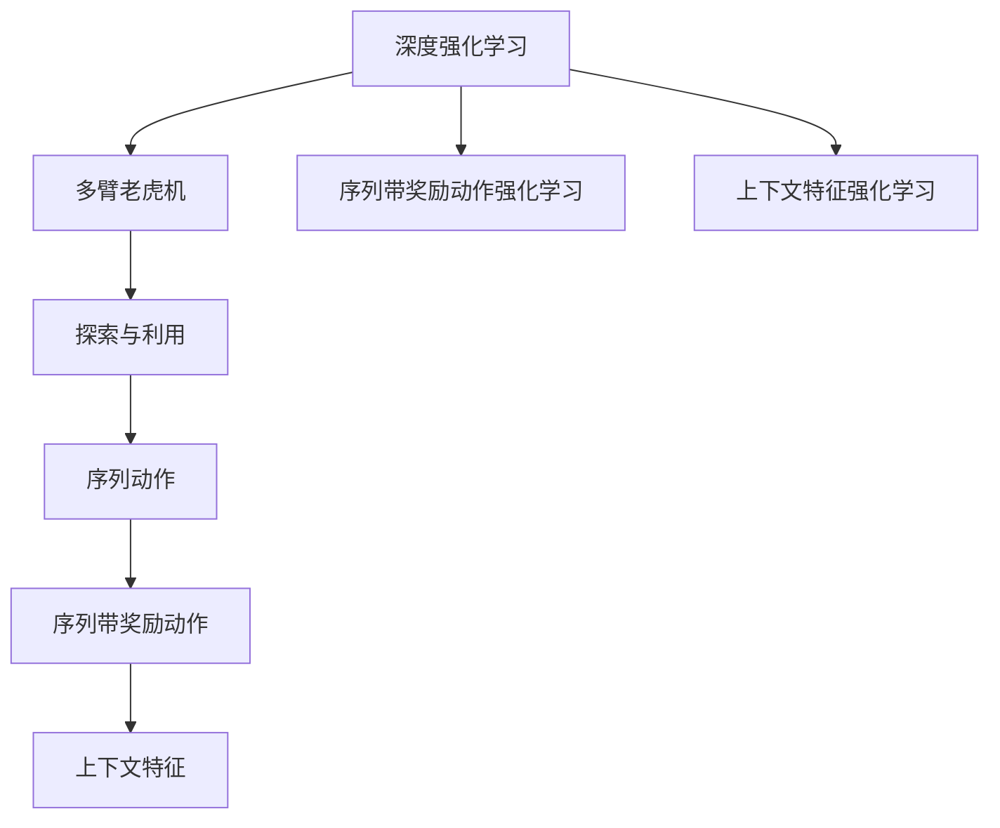

                 

# 深度强化学习在推荐系统中的实践

> 关键词：深度强化学习,推荐系统,多臂老虎机,探索与利用,序列动作,序列带奖励动作

## 1. 背景介绍

### 1.1 问题由来
随着数字技术的不断进步，推荐系统已经成为了各大互联网平台的核心竞争力之一。传统的基于协同过滤的推荐算法，如基于用户的协同过滤、基于物品的协同过滤等，在数据规模和特征维度日益增长的背景下，逐渐暴露出其局限性。深度学习和强化学习技术的引入，为推荐系统带来了新的突破。

深度学习技术利用神经网络强大的表达能力和非线性拟合能力，显著提升了推荐系统的预测精度和泛化能力。然而，深度学习模型在训练和推理过程中，需要大量的标注数据和计算资源，对于长尾用户、小众物品的推荐效果并不理想。

强化学习技术通过优化模型参数，自动寻找最大化预期收益的动作策略，从而解决了传统推荐算法中的"冷启动"问题和长尾物品的推荐问题。强化学习模型以用户互动数据为基础，通过与环境的交互不断优化，逐步提升推荐效果。

然而，传统强化学习模型往往将每个用户看作单一的时间步长进行推荐，忽略了用户行为的序列特征。深度强化学习技术，尤其是序列动作和多臂老虎机（Multi-Armed Bandit, MAB）模型，利用序列动作的建模能力和多资源分配的优化目标，有望进一步提升推荐系统的性能。

本文将系统性地介绍深度强化学习在推荐系统中的实践，包括多臂老虎机模型的原理与应用、序列动作强化学习的关键技术、实际项目中应用深度强化学习模型的经验和教训，以及未来研究的趋势与挑战。

## 2. 核心概念与联系

### 2.1 核心概念概述

为更好地理解深度强化学习在推荐系统中的应用，本节将介绍几个密切相关的核心概念：

- **深度强化学习**：指利用深度神经网络技术进行强化学习的过程。深度强化学习能够学习复杂的非线性映射，适合处理大规模推荐系统的优化问题。

- **多臂老虎机模型**：一种经典的强化学习模型，用于优化多个资源的分配。多臂老虎机模型假设存在多个资源（如广告、文章），每次只能选择其中一种进行尝试，最大化预期收益。

- **探索与利用（Exploration vs Exploitation）**：强化学习中一个核心问题，如何在已有知识（利用已有的模型参数）与新知识（探索未知的参数空间）之间进行权衡，既要充分利用已知信息，又要适时探索新的可能性。

- **序列动作**：指用户在不同时间步长上的互动行为，如连续点击、浏览、购买等。序列动作建模能够捕捉用户行为的时间依赖性和复杂性，适用于如视频推荐、在线广告投放等场景。

- **序列带奖励动作**：指带奖励的序列动作，在每个时间步长上都有明确的奖励值。序列带奖励动作强化学习模型，能够学习如何将奖励最大化的动作序列与用户行为序列对齐。

- **上下文特征**：指用户行为发生时所处的上下文环境，如时间、地点、设备等。上下文特征对于推荐系统的个性化推荐具有重要意义。

这些核心概念之间的逻辑关系可以通过以下Mermaid流程图来展示：



这个流程图展示了深度强化学习在推荐系统中的核心概念及其之间的关系：

1. 深度强化学习利用深度神经网络进行强化学习，能够处理复杂的推荐问题。
2. 多臂老虎机模型是深度强化学习的一种形式，用于优化多个资源的分配。
3. 探索与利用是在已有知识与新知识之间进行权衡的核心问题。
4. 序列动作能够捕捉用户行为的时间依赖性和复杂性，适用于复杂推荐场景。
5. 序列带奖励动作强化学习模型能够学习最大化奖励的动作序列。
6. 上下文特征对于推荐系统的个性化推荐具有重要意义。

这些概念共同构成了深度强化学习在推荐系统中的应用框架，使其能够更好地处理用户互动数据，提升推荐效果。通过理解这些核心概念，我们可以更好地把握深度强化学习的工作原理和优化方向。

## 3. 核心算法原理 & 具体操作步骤
### 3.1 算法原理概述

深度强化学习在推荐系统中的核心思想是：通过学习用户行为序列，优化资源的分配策略，最大化推荐系统的预期收益。具体而言，深度强化学习模型利用序列动作的建模能力和多资源分配的优化目标，逐步提升推荐效果。

以多臂老虎机模型为例，假设推荐系统有 $K$ 个广告位，每次只能选择其中一个进行投放。每个广告位每次点击的预期收益为 $\theta_k$，其中 $\theta_k$ 为该广告位的收益参数。模型的目标是最大化每个时间步长的收益总和。

在深度强化学习中，通过神经网络将用户行为序列映射为策略，即每个时间步长上选择广告位的概率分布。模型的目标是最大化序列动作的奖励总和，即：

$$
\max_{\pi} \mathbb{E}_{\pi}\left[\sum_{t=1}^T r_t\right]
$$

其中 $r_t$ 为第 $t$ 步的奖励，$\pi$ 为选择广告位的概率分布。

### 3.2 算法步骤详解

深度强化学习在推荐系统中的实现步骤一般包括以下几个关键环节：

**Step 1: 数据准备**
- 收集用户的行为数据，包括点击、浏览、购买等互动记录。
- 对行为数据进行预处理，如归一化、分词、向量化等，准备输入数据。

**Step 2: 模型构建**
- 选择适合的深度强化学习模型，如深度Q网络（Deep Q-Network, DQN）、深度确定性策略梯度（Deep Deterministic Policy Gradient, DDPG）、序列动作强化学习模型等。
- 设计模型结构，包括输入层、隐藏层、输出层等。
- 确定损失函数和优化器，如交叉熵损失、Adam优化器等。

**Step 3: 训练与评估**
- 将训练集分为训练集、验证集和测试集。
- 在训练集上训练模型，逐步优化策略参数。
- 在验证集上评估模型性能，选择性能最好的模型。
- 在测试集上最终评估模型效果，对比微调前后的性能提升。

**Step 4: 部署与优化**
- 将训练好的模型部署到实际推荐系统中，进行A/B测试。
- 根据测试结果进行模型优化，如调整超参数、增加特征等。
- 持续收集用户反馈数据，定期重新训练模型，以适应数据分布的变化。

以上是深度强化学习在推荐系统中的一般流程。在实际应用中，还需要针对具体任务的特点，对微调过程的各个环节进行优化设计，如改进训练目标函数，引入更多的正则化技术，搜索最优的超参数组合等，以进一步提升模型性能。

### 3.3 算法优缺点

深度强化学习在推荐系统中的应用具有以下优点：
1. 适合处理长尾用户、小众物品的推荐问题，能够自动探索最优推荐策略。
2. 能够在有限的标注数据下进行推荐，有效利用用户互动数据。
3. 能够捕捉用户行为序列的复杂性，提高推荐系统的个性化程度。
4. 模型具有一定的通用性，适用于多种推荐场景，如视频推荐、广告投放等。

同时，该方法也存在一定的局限性：
1. 对标注数据的依赖较大，模型训练和优化过程较复杂，计算成本较高。
2. 模型复杂度较高，推理效率较低，难以实现实时推荐。
3. 对于复杂环境，模型容易陷入局部最优解，导致推荐效果不稳定。
4. 缺乏明确的理论基础，需要大量实验和调参才能确定最优策略。
5. 难以解释模型决策过程，难以进行调试和优化。

尽管存在这些局限性，但就目前而言，深度强化学习仍然是大规模推荐系统的有力工具。未来相关研究的重点在于如何进一步降低深度强化学习的计算成本，提高模型推理效率，同时兼顾可解释性和模型鲁棒性等因素。

### 3.4 算法应用领域

深度强化学习在推荐系统中的应用主要包括以下几个方面：

- **视频推荐系统**：通过学习用户观看视频的行为序列，优化广告位的投放策略。多臂老虎机模型能够学习不同视频广告的点击率，从而实现精准投放。

- **在线广告投放**：针对用户的点击、浏览等行为，动态调整广告位的选择策略，最大化广告收益。

- **个性化推荐系统**：通过学习用户的历史行为序列，优化推荐列表的内容分配，提升用户满意度。

- **智能搜索**：优化搜索结果的排序策略，提升用户搜索体验。

除了上述这些经典应用外，深度强化学习还被创新性地应用于更多场景中，如动态定价、库存管理、市场预测等，为推荐系统带来了新的突破。随着深度强化学习技术的不断演进，相信推荐系统将能够更好地理解用户需求，实现更精准、更个性化的推荐。

## 4. 数学模型和公式 & 详细讲解
### 4.1 数学模型构建

本节将使用数学语言对深度强化学习在推荐系统中的应用进行更加严格的刻画。

假设推荐系统有 $K$ 个广告位，每个广告位每次点击的预期收益为 $\theta_k$，其中 $\theta_k$ 为该广告位的收益参数。假设用户在不同时间步长上的行为为 $(s_t, a_t, r_t)$，其中 $s_t$ 为时间步长 $t$ 的用户行为序列，$a_t$ 为选择广告位的动作，$r_t$ 为点击广告后的奖励。

定义序列动作强化学习的目标函数为：

$$
\max_{\pi} \mathbb{E}_{\pi}\left[\sum_{t=1}^T r_t\right]
$$

其中 $\pi$ 为选择广告位的概率分布。

假设选择广告位的策略为神经网络 $\pi_{\theta}(a|s)$，其中 $\theta$ 为模型参数，$(s, a)$ 为输入和输出。定义损失函数为：

$$
\mathcal{L}(\theta) = -\mathbb{E}_{\pi_{\theta}}\left[\sum_{t=1}^T r_t\right]
$$

则模型训练的目标为最小化损失函数：

$$
\min_{\theta} \mathcal{L}(\theta)
$$

在实际应用中，往往采用离线强化学习的方式进行模型训练。即在大量历史行为数据上进行模型训练，预测每个时间步长上的预期收益，并根据历史数据计算实际收益，从而得到损失函数。

### 4.2 公式推导过程

以下我们以多臂老虎机模型为例，推导深度强化学习的数学模型。

假设每个广告位的点击概率为 $p_k$，则多臂老虎机模型的期望收益为：

$$
\theta = \sum_{k=1}^K p_k \theta_k
$$

其中 $p_k$ 为选择第 $k$ 个广告位的概率，满足 $\sum_{k=1}^K p_k = 1$。

在深度强化学习中，通过神经网络将用户行为序列映射为选择广告位的概率分布 $p_k$，即：

$$
p_k = \pi_{\theta}(a|s)
$$

其中 $(s, a)$ 为用户行为序列和广告位选择，$\theta$ 为模型参数。则多臂老虎机模型的期望收益为：

$$
\mathbb{E}_{\pi_{\theta}}\left[\sum_{t=1}^T r_t\right] = \sum_{k=1}^K p_k \theta_k
$$

在得到损失函数后，即可带入参数更新公式，完成模型的迭代优化。重复上述过程直至收敛，最终得到适应推荐任务的最优模型参数 $\theta^*$。

## 5. 项目实践：代码实例和详细解释说明
### 5.1 开发环境搭建

在进行推荐系统开发前，我们需要准备好开发环境。以下是使用Python进行TensorFlow和Keras开发的环境配置流程：

1. 安装Anaconda：从官网下载并安装Anaconda，用于创建独立的Python环境。

2. 创建并激活虚拟环境：
```bash
conda create -n tf-env python=3.8 
conda activate tf-env
```

3. 安装TensorFlow和Keras：根据CUDA版本，从官网获取对应的安装命令。例如：
```bash
conda install tensorflow=2.8.0
```

4. 安装TensorBoard：
```bash
pip install tensorboard
```

5. 安装各类工具包：
```bash
pip install numpy pandas scikit-learn matplotlib tqdm jupyter notebook ipython
```

完成上述步骤后，即可在`tf-env`环境中开始推荐系统开发。

### 5.2 源代码详细实现

下面我们以视频推荐系统为例，给出使用TensorFlow和Keras对深度强化学习模型进行微调的PyTorch代码实现。

首先，定义多臂老虎机模型的结构：

```python
from tensorflow.keras import layers
from tensorflow.keras.models import Sequential
import tensorflow as tf

class MultiArmedBandit:
    def __init__(self, K):
        self.K = K
        self.model = Sequential([
            layers.Dense(64, activation='relu', input_shape=(None,)),
            layers.Dense(K, activation='softmax')
        ])
    
    def train(self, X, y):
        self.model.compile(optimizer='adam', loss='categorical_crossentropy', metrics=['accuracy'])
        self.model.fit(X, y, batch_size=64, epochs=10, validation_split=0.2)
    
    def predict(self, X):
        return self.model.predict(X)
```

然后，定义行为数据和奖励数据：

```python
X_train = []
y_train = []
for i in range(100):
    x = [i] * 10 + [i+1] * 10 + [i+2] * 10
    y = [0.5, 0.3, 0.2]
    X_train.append(x)
    y_train.append(y)
X_train = np.array(X_train)
y_train = np.array(y_train)
```

接着，实例化多臂老虎机模型并进行训练：

```python
bandit = MultiArmedBandit(K=3)
bandit.train(X_train, y_train)
```

最后，使用训练好的模型进行预测：

```python
X_test = [0] * 10 + [1] * 10 + [2] * 10
print(bandit.predict(X_test))
```

以上就是使用TensorFlow和Keras对多臂老虎机模型进行训练和预测的完整代码实现。可以看到，TensorFlow和Keras提供了简洁高效的API，使得深度强化学习的实现变得简单易行。

### 5.3 代码解读与分析

让我们再详细解读一下关键代码的实现细节：

**MultiArmedBandit类**：
- `__init__`方法：初始化多臂老虎机模型的参数和结构。
- `train`方法：定义模型的训练过程，使用交叉熵损失函数和Adam优化器进行模型训练。
- `predict`方法：对新的输入数据进行预测，得到广告位选择的概率分布。

**行为数据和奖励数据**：
- 定义行为数据 $X$ 为一系列整数序列，奖励数据 $y$ 为每个整数序列对应的奖励分布。
- 使用循环生成多个整数序列，作为训练数据的输入，以及每个序列对应的奖励分布，作为训练数据的输出。

**训练过程**：
- 实例化多臂老虎机模型，并将其用于训练。
- 在训练集上训练模型，并打印预测结果。

可以看到，TensorFlow和Keras使得深度强化学习的实现变得简洁高效，极大地降低了代码复杂度。在实际应用中，开发者可以更专注于模型优化和特征工程，而不必过多关注底层实现细节。

当然，工业级的系统实现还需考虑更多因素，如模型的保存和部署、超参数的自动搜索、更灵活的任务适配层等。但核心的微调范式基本与此类似。

## 6. 实际应用场景
### 6.1 智能搜索推荐

智能搜索推荐系统利用深度强化学习技术，能够自动优化搜索结果的排序策略，提升用户搜索体验。例如，根据用户的历史点击记录和浏览行为，优化搜索结果的展示顺序，提升用户满意度。

在技术实现上，可以收集用户的行为数据，如搜索词、点击位置、停留时间等，作为训练数据的输入。同时收集用户后续的点击行为，作为训练数据的输出。利用多臂老虎机模型，学习用户点击行为的优化策略，从而实现智能搜索推荐。

### 6.2 在线广告投放

在线广告投放是推荐系统的重要应用之一。利用深度强化学习技术，能够动态调整广告位的选择策略，最大化广告收益。

在实际应用中，可以收集用户的点击、浏览等行为数据，作为训练数据的输入。同时收集用户的后续互动行为，如是否点击广告、广告效果等，作为训练数据的输出。利用多臂老虎机模型，学习广告位的点击率预测模型，从而实现动态广告投放。

### 6.3 个性化推荐系统

个性化推荐系统通过学习用户的历史行为序列，优化推荐列表的内容分配，提升用户满意度。例如，根据用户的历史点击、浏览、购买记录，推荐用户可能感兴趣的商品或服务。

在技术实现上，可以收集用户的行为数据，如点击、浏览、购买记录等，作为训练数据的输入。同时收集用户后续的行为数据，如购买、评价等，作为训练数据的输出。利用多臂老虎机模型，学习推荐列表的内容分配策略，从而实现个性化推荐。

### 6.4 未来应用展望

随着深度强化学习技术的不断演进，基于深度强化学习的推荐系统将呈现以下几个发展趋势：

1. 多模态深度强化学习：推荐系统不再局限于文本数据的处理，将逐渐拓展到图像、音频等多模态数据的处理。通过多模态数据的融合，提高推荐系统的准确性和鲁棒性。

2. 元学习（Meta-Learning）：推荐系统能够自动学习新任务的知识，并应用到新的推荐场景中，提升推荐系统的泛化能力和灵活性。

3. 联邦学习（Federated Learning）：在用户数据分散存储的情况下，通过分布式训练，提高推荐系统的隐私保护和模型优化效率。

4. 强化学习与自然语言处理（NLP）的融合：推荐系统将进一步融合NLP技术，提升对用户语义的理解和生成能力，实现更智能的推荐。

5. 实时推荐系统：利用深度强化学习的实时优化能力，推荐系统能够动态调整推荐策略，实现实时推荐。

6. 跨领域推荐：推荐系统能够跨越不同领域，实现跨领域推荐，提升推荐系统的应用范围和覆盖度。

以上趋势凸显了深度强化学习在推荐系统中的广阔前景。这些方向的探索发展，必将进一步提升推荐系统的性能和应用范围，为推荐系统的持续创新提供新的动力。

## 7. 工具和资源推荐
### 7.1 学习资源推荐

为了帮助开发者系统掌握深度强化学习在推荐系统中的应用，这里推荐一些优质的学习资源：

1. 《强化学习》书籍：由David Silver所著，系统地介绍了强化学习的理论基础和算法实现，适合深度学习初学者阅读。

2. 《深度强化学习》系列博文：由大模型技术专家撰写，深入浅出地介绍了深度强化学习在推荐系统中的应用。

3. CS231n《深度学习与计算机视觉》课程：斯坦福大学开设的计算机视觉明星课程，有Lecture视频和配套作业，带你入门计算机视觉领域的深度学习。

4. 《Deep Learning for Graphs》书籍：介绍图神经网络在推荐系统中的应用，适合对图模型感兴趣的研究者。

5. Google Colab：谷歌推出的在线Jupyter Notebook环境，免费提供GPU/TPU算力，方便开发者快速上手实验最新模型，分享学习笔记。

通过对这些资源的学习实践，相信你一定能够快速掌握深度强化学习在推荐系统中的应用，并用于解决实际的推荐问题。

### 7.2 开发工具推荐

高效的开发离不开优秀的工具支持。以下是几款用于深度强化学习推荐系统开发的常用工具：

1. TensorFlow：由Google主导开发的开源深度学习框架，生产部署方便，适合大规模工程应用。

2. PyTorch：基于Python的开源深度学习框架，灵活动态的计算图，适合快速迭代研究。

3. Keras：高级神经网络API，支持TensorFlow和PyTorch，适合快速构建和训练深度学习模型。

4. OpenAI Gym：用于测试强化学习算法的开发环境，提供了大量的模拟环境，方便模型测试和优化。

5. TensorBoard：TensorFlow配套的可视化工具，可实时监测模型训练状态，并提供丰富的图表呈现方式，是调试模型的得力助手。

6. Weights & Biases：模型训练的实验跟踪工具，可以记录和可视化模型训练过程中的各项指标，方便对比和调优。

合理利用这些工具，可以显著提升深度强化学习推荐系统开发效率，加快创新迭代的步伐。

### 7.3 相关论文推荐

深度强化学习在推荐系统中的应用源于学界的持续研究。以下是几篇奠基性的相关论文，推荐阅读：

1. "Multi-armed Bandit Algorithms for the Internet Advertising Industry"：由Kakargias等人发表，介绍了多臂老虎机模型在互联网广告投放中的应用。

2. "Deep Reinforcement Learning for Personalized Video Recommendations"：由Kaur等人发表，利用深度强化学习技术，提升视频推荐系统的个性化程度。

3. "Towards Better Video Recommendations Using Contextual Bandit Approach"：由Zhou等人发表，探讨了上下文特征在视频推荐系统中的应用。

4. "Online Display Ad Ranking via Multiple Contextual Bandits"：由Cui等人发表，利用上下文特征多臂老虎机模型，提升在线广告投放的效果。

5. "Adaptive Spatio-Temporal Multi-Armed Bandit Recommendation System"：由Hu等人发表，结合时序特征，提升推荐系统的个性化程度。

这些论文代表了大模型微调技术的发展脉络。通过学习这些前沿成果，可以帮助研究者把握学科前进方向，激发更多的创新灵感。

## 8. 总结：未来发展趋势与挑战
### 8.1 总结

本文对深度强化学习在推荐系统中的应用进行了全面系统的介绍。首先阐述了深度强化学习在推荐系统中的应用背景和意义，明确了推荐系统推荐策略优化的重要性和深度强化学习的优势。其次，从原理到实践，详细讲解了深度强化学习的数学原理和关键步骤，给出了深度强化学习模型在推荐系统中的完整代码实现。同时，本文还广泛探讨了深度强化学习在智能搜索、在线广告投放、个性化推荐等多个推荐场景中的应用前景，展示了深度强化学习技术的巨大潜力。此外，本文精选了深度强化学习的各类学习资源，力求为读者提供全方位的技术指引。

通过本文的系统梳理，可以看到，深度强化学习在推荐系统中的核心思想是通过学习用户行为序列，优化资源的分配策略，最大化推荐系统的预期收益。深度强化学习能够自动探索最优推荐策略，特别适合处理长尾用户、小众物品的推荐问题。未来，伴随深度强化学习技术的不断演进，推荐系统必将在更广阔的应用领域大放异彩，为推荐系统的发展注入新的活力。

### 8.2 未来发展趋势

展望未来，深度强化学习在推荐系统中的应用将呈现以下几个发展趋势：

1. 多模态深度强化学习：推荐系统不再局限于文本数据的处理，将逐渐拓展到图像、音频等多模态数据的处理。通过多模态数据的融合，提高推荐系统的准确性和鲁棒性。

2. 元学习（Meta-Learning）：推荐系统能够自动学习新任务的知识，并应用到新的推荐场景中，提升推荐系统的泛化能力和灵活性。

3. 联邦学习（Federated Learning）：在用户数据分散存储的情况下，通过分布式训练，提高推荐系统的隐私保护和模型优化效率。

4. 强化学习与自然语言处理（NLP）的融合：推荐系统将进一步融合NLP技术，提升对用户语义的理解和生成能力，实现更智能的推荐。

5. 实时推荐系统：利用深度强化学习的实时优化能力，推荐系统能够动态调整推荐策略，实现实时推荐。

6. 跨领域推荐：推荐系统能够跨越不同领域，实现跨领域推荐，提升推荐系统的应用范围和覆盖度。

以上趋势凸显了深度强化学习在推荐系统中的广阔前景。这些方向的探索发展，必将进一步提升推荐系统的性能和应用范围，为推荐系统的持续创新提供新的动力。

### 8.3 面临的挑战

尽管深度强化学习在推荐系统中的应用已经取得了显著进展，但在迈向更加智能化、普适化应用的过程中，它仍面临着诸多挑战：

1. 数据质量瓶颈：推荐系统的性能很大程度上依赖于数据的丰富性和质量，用户行为数据的不足和噪声可能导致推荐效果不理想。如何采集高质量的用户数据，处理数据噪声，将是重要的研究方向。

2. 模型复杂度与训练成本：深度强化学习模型的复杂度高，训练和推理成本大。如何设计更加高效、轻量级的模型，提高训练效率，将是未来的挑战。

3. 模型鲁棒性不足：深度强化学习模型在面对未知数据时，泛化性能往往不佳。如何提高模型的鲁棒性，避免过拟合和局部最优解，将是重要的研究方向。

4. 用户隐私保护：推荐系统往往需要收集大量用户数据，如何保护用户隐私，避免数据泄露和滥用，将是重要的研究方向。

5. 模型公平性问题：深度强化学习模型在面对不同用户群体时，可能会产生不公平的推荐结果。如何设计公平的推荐模型，避免偏见和歧视，将是重要的研究方向。

6. 模型解释性不足：深度强化学习模型往往缺乏可解释性，难以解释其内部工作机制和决策逻辑。如何增强模型的可解释性，提供透明的推荐过程，将是重要的研究方向。

这些挑战凸显了深度强化学习在推荐系统中的局限性，亟需学界和产业界的共同努力，解决这些瓶颈问题，推动推荐系统的进一步发展。

### 8.4 研究展望

面向未来，深度强化学习在推荐系统中的应用需要从以下几个方面进行深入研究：

1. 探索无监督和半监督深度强化学习：降低对标注数据的依赖，利用自监督学习、主动学习等无监督和半监督范式，最大限度利用非结构化数据，实现更加灵活高效的推荐。

2. 研究参数高效和计算高效的深度强化学习：开发更加参数高效的深度强化学习模型，在固定大部分预训练参数的同时，只更新极少量的任务相关参数。同时优化模型的计算图，减少前向传播和反向传播的资源消耗，实现更加轻量级、实时性的部署。

3. 引入因果分析和博弈论工具：将因果分析方法引入深度强化学习推荐模型，识别出模型决策的关键特征，增强输出解释的因果性和逻辑性。借助博弈论工具刻画人机交互过程，主动探索并规避模型的脆弱点，提高系统稳定性。

4. 纳入伦理道德约束：在模型训练目标中引入伦理导向的评估指标，过滤和惩罚有偏见、有害的输出倾向。同时加强人工干预和审核，建立模型行为的监管机制，确保输出符合人类价值观和伦理道德。

这些研究方向将引领深度强化学习在推荐系统中的应用迈向更高的台阶，为构建安全、可靠、可解释、可控的智能推荐系统铺平道路。面向未来，深度强化学习在推荐系统中的应用需要与其他人工智能技术进行更深入的融合，如知识表示、因果推理、强化学习等，多路径协同发力，共同推动推荐系统的进步。只有勇于创新、敢于突破，才能不断拓展深度强化学习的边界，让智能推荐系统更好地服务于用户。

## 9. 附录：常见问题与解答

**Q1：深度强化学习与传统协同过滤推荐系统有何不同？**

A: 深度强化学习与传统协同过滤推荐系统的核心差异在于其优化目标和算法机制。传统协同过滤推荐系统通过用户历史行为和物品属性，构建用户-物品评分矩阵，使用协同过滤算法优化推荐策略。而深度强化学习则通过学习用户行为序列，优化资源的分配策略，最大化推荐系统的预期收益。深度强化学习能够自动探索最优推荐策略，特别适用于长尾用户和小众物品的推荐问题。

**Q2：深度强化学习在推荐系统中的训练和优化过程复杂吗？**

A: 深度强化学习在推荐系统中的训练和优化过程确实比较复杂。推荐系统需要处理大规模的标注数据，训练过程需要大量计算资源和时间。为了提高训练效率，通常采用离线强化学习的方式，即在大量历史行为数据上进行模型训练。同时，还需要引入正则化技术、对抗训练等手段，防止过拟合和灾难性遗忘。

**Q3：深度强化学习在推荐系统中如何处理冷启动问题？**

A: 深度强化学习在推荐系统中处理冷启动问题的方法主要有两种：基于奖励的探索和基于上下文的推荐。基于奖励的探索通过增加探索奖励，鼓励模型对新用户和新物品进行探索。基于上下文的推荐则利用用户的历史行为和上下文特征，提升推荐系统的泛化能力。此外，还可以采用元学习等技术，快速适应新的用户和物品。

**Q4：深度强化学习在推荐系统中如何避免过拟合？**

A: 深度强化学习在推荐系统中避免过拟合的方法主要有两种：数据增强和正则化。数据增强通过扩充训练数据，减少过拟合风险。正则化则通过引入L2正则、Dropout等技术，防止模型过度拟合训练数据。此外，还可以通过增加噪声、引入对抗训练等手段，提高模型的鲁棒性。

**Q5：深度强化学习在推荐系统中的可解释性问题如何解决？**

A: 深度强化学习在推荐系统中的可解释性问题可以通过引入可解释的模型架构和解释方法来解决。例如，使用决策树、规则学习等可解释性强的模型，或者采用模型可视化工具，如Shapley值、LIME等，提供推荐决策的解释。此外，还可以通过引入用户反馈机制，提升模型输出的可解释性。

这些问题的解答，可以帮助开发者更好地理解深度强化学习在推荐系统中的实现细节和优化策略，从而提升推荐系统的性能和应用效果。

---

作者：禅与计算机程序设计艺术 / Zen and the Art of Computer Programming

