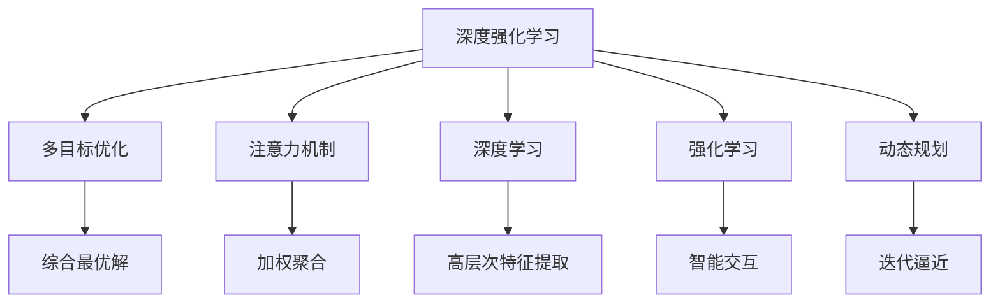

                 

# 深度强化学习在注意力决策中的应用

> 关键词：强化学习,注意力机制,深度学习,决策模型,多目标优化

## 1. 背景介绍

在智能决策系统中，深度强化学习（Deep Reinforcement Learning, DRL）作为一种强大的学习范式，能够有效地处理多模态数据，提升决策的精准度和智能化水平。传统的决策模型通常依赖专家知识或静态特征，难以应对复杂的非结构化数据和动态环境变化。然而，近年来随着深度学习技术的发展，DRL通过智能交互、试错优化，可以在更复杂的任务中取得超越人类专家水平的表现。

注意力机制（Attention Mechanism）作为DRL中的重要组成部分，通过对输入数据加权聚合，帮助模型聚焦于关键信息，避免了信息的冗余和干扰。在多目标优化（Multi-objective Optimization, MOP）问题中，注意力机制能够帮助模型在多个相互冲突的目标间进行权衡，寻找最优决策路径。

本文章将围绕深度强化学习在注意力决策中的应用，系统介绍注意力机制的原理、模型设计、优化算法及其在实际应用场景中的应用。同时，本文也将探讨注意力决策的未来发展趋势和面临的挑战，以期为相关研究提供理论指导和技术支持。

## 2. 核心概念与联系

### 2.1 核心概念概述

为更好地理解深度强化学习在注意力决策中的应用，本节将介绍几个密切相关的核心概念：

- **深度强化学习（DRL）**：结合深度神经网络和强化学习算法，通过对环境进行智能交互和试错优化，学习最优决策策略的技术。DRL能够处理非结构化数据，适应动态环境变化，具备强大的学习能力。

- **注意力机制（Attention Mechanism）**：一种用于提升深度学习模型处理能力的技术，通过对输入数据进行加权聚合，提取关键信息，提升模型的泛化能力和决策效率。

- **多目标优化（MOP）**：针对多个相互冲突的目标进行优化，寻找综合最优解的问题。在决策过程中，多个目标的平衡是常见的挑战。

- **深度学习（Deep Learning）**：通过构建多层神经网络，从原始数据中提取高层次特征，实现复杂任务的学习和推理。

- **强化学习（Reinforcement Learning, RL）**：通过智能交互和试错优化，使模型学习最优决策策略，在复杂环境中取得最佳表现。

- **动态规划（Dynamic Programming）**：一种通过迭代逼近最优解的优化方法，应用于强化学习和多目标优化中，以提升决策效率。

这些核心概念之间的逻辑关系可以通过以下Mermaid流程图来展示：



这个流程图展示了大语言模型的核心概念及其之间的关系：

1. 深度强化学习通过智能交互和试错优化，学习最优决策策略。
2. 多目标优化在多个相互冲突的目标间进行权衡，寻找最优决策路径。
3. 注意力机制通过对输入数据进行加权聚合，提取关键信息，提升模型的泛化能力和决策效率。
4. 深度学习通过构建多层神经网络，从原始数据中提取高层次特征，实现复杂任务的学习和推理。
5. 强化学习通过智能交互和试错优化，使模型学习最优决策策略。
6. 动态规划通过迭代逼近，提升决策效率和优化效果。

这些概念共同构成了深度强化学习在注意力决策中的应用框架，使其能够在各种场景下发挥强大的学习能力和决策能力。通过理解这些核心概念，我们可以更好地把握深度强化学习的工作原理和优化方向。

## 3. 核心算法原理 & 具体操作步骤
### 3.1 算法原理概述

在注意力决策中，深度强化学习利用注意力机制提取输入数据的有效信息，在多目标优化问题的背景下，通过智能交互和试错优化，学习决策策略。其核心思想是通过模型与环境的交互，不断调整决策策略，以最大化综合目标的满足程度。

形式化地，假设环境状态为 $s_t$，模型策略为 $a_t = f(\theta, s_t)$，奖励函数为 $r_t$，目标函数为 $J(\theta)$，其中 $\theta$ 为模型参数，$f$ 为决策函数。目标函数可以表示为多个子目标的加权和：

$$
J(\theta) = \sum_{i=1}^m w_i J_i(\theta)
$$

其中 $J_i(\theta)$ 为第 $i$ 个子目标，$w_i$ 为第 $i$ 个子目标的权重。通过优化目标函数 $J(\theta)$，模型学习到最优决策策略。

在注意力决策中，模型需要同时优化多个子目标，通过注意力机制对不同子目标进行加权聚合，指导模型的决策行为。

### 3.2 算法步骤详解

基于深度强化学习的注意力决策通常包括以下几个关键步骤：

**Step 1: 准备环境与目标**
- 定义环境状态空间 $s$ 和行动空间 $a$。
- 设计目标函数 $J(\theta)$，其中包含多个子目标 $J_i(\theta)$。
- 设置目标权重 $w_i$，决定各个子目标的重要性。

**Step 2: 选择模型架构**
- 选择合适的深度神经网络架构，如卷积神经网络、循环神经网络、Transformer等。
- 引入注意力机制，设计注意力模型，提取关键信息。

**Step 3: 设计奖励函数**
- 根据多目标优化问题，设计奖励函数 $r_t$，反映模型在不同状态下决策的优劣。
- 设计惩罚函数 $p_t$，防止模型偏离预期目标。

**Step 4: 执行训练过程**
- 使用强化学习算法，如Q-learning、SARSA、Actor-Critic等，通过智能交互和试错优化，学习最优决策策略。
- 使用注意力机制，对输入数据进行加权聚合，提取关键信息。
- 在每个时间步 $t$，通过策略函数 $a_t = f(\theta, s_t)$ 选择行动 $a_t$，执行行动后更新状态 $s_{t+1}$，计算奖励 $r_t$，并根据优化目标函数 $J(\theta)$ 更新模型参数。

**Step 5: 评估和优化**
- 在测试集或真实环境中，评估模型在不同状态下的决策表现。
- 根据评估结果，调整目标权重 $w_i$，优化模型决策策略。

以上是深度强化学习在注意力决策中的一般流程。在实际应用中，还需要根据具体任务的特点，对算法过程的各个环节进行优化设计，如改进奖励函数、优化目标函数、调整注意力模型等，以进一步提升模型性能。

### 3.3 算法优缺点

深度强化学习在注意力决策中具有以下优点：
1. 智能交互能力强。通过智能交互和试错优化，模型能够自动学习决策策略，适应复杂的非结构化数据和动态环境变化。
2. 决策灵活度高。模型能够在多个目标之间进行权衡，寻找最优决策路径。
3. 泛化能力强。深度神经网络能够提取高层次特征，提升模型泛化能力和决策效率。
4. 动态适应性强。通过迭代逼近，模型能够动态调整决策策略，提升决策精度。

同时，该方法也存在一定的局限性：
1. 数据需求量大。深度强化学习需要大量的训练数据和计算资源，对于数据量较小的任务可能难以有效应用。
2. 可解释性差。深度神经网络的黑盒特性，导致决策过程缺乏可解释性，难以对其推理逻辑进行分析和调试。
3. 收敛速度慢。深度强化学习算法通常需要较长的训练时间，收敛速度较慢。
4. 资源消耗大。深度神经网络参数量较大，训练和推理过程中需要大量的计算资源和存储空间。
5. 对抗性鲁棒性差。模型在对抗样本攻击下，容易产生异常决策。

尽管存在这些局限性，但就目前而言，深度强化学习在注意力决策中的应用依然是大规模复杂决策任务的首选方法。未来相关研究的重点在于如何进一步降低数据需求，提高模型的可解释性，缩短训练时间，同时兼顾动态适应性和资源消耗。

### 3.4 算法应用领域

深度强化学习在注意力决策中已经得到了广泛的应用，覆盖了多个领域，例如：

- 机器人控制：机器人需要根据环境变化做出决策，如自动驾驶、无人机路径规划等。
- 金融交易：金融机构需要根据市场动态做出投资决策，如量化交易、风险管理等。
- 医疗诊断：医疗诊断系统需要根据患者病情做出决策，如疾病诊断、治疗方案选择等。
- 交通管理：交通管理系统需要根据交通状况做出决策，如交通信号控制、交通流量优化等。
- 物流规划：物流系统需要根据货物信息做出决策，如路径规划、库存管理等。

除了上述这些经典应用外，深度强化学习在更多场景中得到了创新性的应用，如智能客服、推荐系统、生产调度等，为复杂决策问题的解决提供了新的方法。

## 4. 数学模型和公式 & 详细讲解 & 举例说明

### 4.1 数学模型构建

本节将使用数学语言对深度强化学习在注意力决策中的应用进行更加严格的刻画。

假设环境状态为 $s_t = (x_t, y_t)$，其中 $x_t$ 为输入数据，$y_t$ 为标签。模型的决策策略为 $a_t = f(\theta, s_t)$，其中 $\theta$ 为模型参数。假设目标函数 $J(\theta)$ 包含多个子目标 $J_i(\theta)$，其权重为 $w_i$，则目标函数可以表示为：

$$
J(\theta) = \sum_{i=1}^m w_i J_i(\theta)
$$

其中 $J_i(\theta)$ 为第 $i$ 个子目标，可以表示为：

$$
J_i(\theta) = \mathbb{E}_{s_{t+1},r_{t+1}|s_t,a_t}[r_{t+1} + \gamma \mathbb{E}_{s_{t+1},r_{t+1}|s_{t+1},a_{t+1}}[J(\theta)]
$$

其中 $\gamma$ 为折扣因子，$r_{t+1}$ 为下一时刻的奖励，$J_{t+1}(\theta)$ 为下一时刻的目标函数。

在注意力决策中，模型需要同时优化多个子目标，通过注意力机制对不同子目标进行加权聚合，指导模型的决策行为。具体地，引入注意力模型 $A(s_t)$，计算输入数据 $x_t$ 对不同子目标的贡献权重，更新目标函数 $J_i(\theta)$：

$$
J_i(\theta) = \sum_{j=1}^k \alpha_{i,j} J_i(\theta)
$$

其中 $\alpha_{i,j}$ 为子目标 $i$ 对子目标 $j$ 的贡献权重，可以表示为：

$$
\alpha_{i,j} = \frac{\exp(e_{i,j})}{\sum_{k=1}^m \exp(e_{i,k})}
$$

其中 $e_{i,j}$ 为注意力模型的输出，可以表示为：

$$
e_{i,j} = \langle A(s_t), b_i \rangle + c_j
$$

其中 $b_i$ 为子目标 $i$ 的向量表示，$c_j$ 为注意力模型的偏置项，$\langle \cdot, \cdot \rangle$ 为点积运算。

### 4.2 公式推导过程

以下我们以多目标回归问题为例，推导目标函数 $J(\theta)$ 的梯度计算公式。

假设模型在状态 $s_t = (x_t, y_t)$ 下的决策策略为 $a_t = f(\theta, s_t)$，对应的奖励函数为 $r_t$，则目标函数可以表示为：

$$
J(\theta) = \sum_{i=1}^m w_i \mathbb{E}_{s_{t+1},r_{t+1}|s_t,a_t}[r_{t+1} + \gamma \mathbb{E}_{s_{t+1},r_{t+1}|s_{t+1},a_{t+1}}[J(\theta)]
$$

根据链式法则，目标函数对参数 $\theta$ 的梯度为：

$$
\nabla_{\theta}J(\theta) = \sum_{i=1}^m w_i \nabla_{\theta}J_i(\theta)
$$

其中 $\nabla_{\theta}J_i(\theta)$ 为子目标 $i$ 的梯度，可以表示为：

$$
\nabla_{\theta}J_i(\theta) = \nabla_{\theta} \mathbb{E}_{s_{t+1},r_{t+1}|s_t,a_t}[r_{t+1} + \gamma \mathbb{E}_{s_{t+1},r_{t+1}|s_{t+1},a_{t+1}}[J(\theta)]
$$

根据蒙特卡洛方法，可以将上述公式进一步展开：

$$
\nabla_{\theta}J_i(\theta) = \nabla_{\theta} \sum_{j=1}^m \alpha_{i,j} J_i(\theta)
$$

其中 $\alpha_{i,j}$ 为子目标 $i$ 对子目标 $j$ 的贡献权重，可以表示为：

$$
\alpha_{i,j} = \frac{\exp(e_{i,j})}{\sum_{k=1}^m \exp(e_{i,k})}
$$

其中 $e_{i,j}$ 为注意力模型的输出，可以表示为：

$$
e_{i,j} = \langle A(s_t), b_i \rangle + c_j
$$

其中 $b_i$ 为子目标 $i$ 的向量表示，$c_j$ 为注意力模型的偏置项，$\langle \cdot, \cdot \rangle$ 为点积运算。

通过上述公式，我们可以看到，深度强化学习在注意力决策中的数学模型构建具有高度的复杂性和灵活性，其决策过程涉及多个子目标的权衡和聚合，能够适应多种复杂任务。

### 4.3 案例分析与讲解

下面以多目标回归问题为例，给出深度强化学习在注意力决策中的具体应用。

假设目标函数包含两个子目标，分别表示均方误差和绝对误差。具体地，设输入数据为 $x_t = [1,2,3]$，标签为 $y_t = 5$，模型的决策策略为 $a_t = f(\theta, s_t) = \theta_1 x_1 + \theta_2 x_2 + \theta_3 x_3$。目标函数可以表示为：

$$
J(\theta) = w_1 \mathbb{E}_{s_{t+1},r_{t+1}|s_t,a_t}[r_{t+1} + \gamma \mathbb{E}_{s_{t+1},r_{t+1}|s_{t+1},a_{t+1}}[J(\theta)] + w_2 \mathbb{E}_{s_{t+1},r_{t+1}|s_t,a_t}[r_{t+1} + \gamma \mathbb{E}_{s_{t+1},r_{t+1}|s_{t+1},a_{t+1}}[J(\theta)]
$$

其中 $w_1 = 0.5$，$w_2 = 0.5$，折扣因子 $\gamma = 0.9$。

首先，设计注意力模型 $A(s_t) = \theta_4 x_1 + \theta_5 x_2 + \theta_6 x_3$，计算输入数据 $x_t$ 对不同子目标的贡献权重 $\alpha_{i,j}$：

$$
\alpha_{1,1} = \frac{\exp(\langle A(s_t), b_1 \rangle + c_1)}{\exp(\langle A(s_t), b_1 \rangle + c_1) + \exp(\langle A(s_t), b_2 \rangle + c_2)}
$$

$$
\alpha_{2,1} = \frac{\exp(\langle A(s_t), b_1 \rangle + c_1)}{\exp(\langle A(s_t), b_1 \rangle + c_1) + \exp(\langle A(s_t), b_2 \rangle + c_2)}
$$

$$
\alpha_{1,2} = \frac{\exp(\langle A(s_t), b_2 \rangle + c_2)}{\exp(\langle A(s_t), b_1 \rangle + c_1) + \exp(\langle A(s_t), b_2 \rangle + c_2)}
$$

$$
\alpha_{2,2} = \frac{\exp(\langle A(s_t), b_2 \rangle + c_2)}{\exp(\langle A(s_t), b_1 \rangle + c_1) + \exp(\langle A(s_t), b_2 \rangle + c_2)}
$$

其中 $b_1 = [1,0,0]$，$b_2 = [0,1,0]$，$c_1 = 0$，$c_2 = 1$。

根据上述权重，更新目标函数 $J_i(\theta)$：

$$
J_1(\theta) = \alpha_{1,1} J_1(\theta) + \alpha_{2,1} J_2(\theta)
$$

$$
J_2(\theta) = \alpha_{1,2} J_1(\theta) + \alpha_{2,2} J_2(\theta)
$$

其中 $J_1(\theta)$ 和 $J_2(\theta)$ 可以表示为：

$$
J_1(\theta) = \frac{1}{2} \mathbb{E}_{s_{t+1},r_{t+1}|s_t,a_t}[r_{t+1} + \gamma \mathbb{E}_{s_{t+1},r_{t+1}|s_{t+1},a_{t+1}}[J(\theta)]
$$

$$
J_2(\theta) = \frac{1}{2} \mathbb{E}_{s_{t+1},r_{t+1}|s_t,a_t}[r_{t+1} + \gamma \mathbb{E}_{s_{t+1},r_{t+1}|s_{t+1},a_{t+1}}[J(\theta)]
$$

通过上述推导，我们可以看到，深度强化学习在注意力决策中的数学模型构建具有高度的复杂性和灵活性，其决策过程涉及多个子目标的权衡和聚合，能够适应多种复杂任务。

## 5. 项目实践：代码实例和详细解释说明
### 5.1 开发环境搭建

在进行注意力决策的深度强化学习实践前，我们需要准备好开发环境。以下是使用Python进行PyTorch开发的环境配置流程：

1. 安装Anaconda：从官网下载并安装Anaconda，用于创建独立的Python环境。

2. 创建并激活虚拟环境：
```bash
conda create -n reinforcement-env python=3.8 
conda activate reinforcement-env
```

3. 安装PyTorch：根据CUDA版本，从官网获取对应的安装命令。例如：
```bash
conda install pytorch torchvision torchaudio cudatoolkit=11.1 -c pytorch -c conda-forge
```

4. 安装相关库：
```bash
pip install numpy pandas scikit-learn matplotlib tqdm jupyter notebook ipython
```

5. 安装深度强化学习库：
```bash
pip install stable-baselines3
```

完成上述步骤后，即可在`reinforcement-env`环境中开始实践。

### 5.2 源代码详细实现

下面我们以多目标回归问题为例，给出使用PyTorch进行注意力决策的深度强化学习的代码实现。

首先，定义多目标回归问题：

```python
import torch
import torch.nn as nn
import torch.optim as optim
from stable_baselines3.common import PPO, MlpPolicy
from stable_baselines3.common.callbacks import StopOnRollout, EpochLogger
from stable_baselines3.common.vec_env import MultiEnv

class MultiTargetRegressionEnv(MultiEnv):
    def __init__(self, env1, env2):
        super(MultiTargetRegressionEnv, self).__init__()
        self._envs = [env1, env2]
    
    def step(self, action):
        return [env.step(action) for env in self._envs]
    
    def reset(self):
        return [env.reset() for env in self._envs]
    
    def render(self, mode='human'):
        return [env.render(mode) for env in self._envs]

class MultiTargetRegression(MultiEnv):
    def __init__(self, n_actions):
        self.n_actions = n_actions
        self.observation_space = MultiEnv.observation_space
        self.action_space = MultiEnv.action_space
        self._reward = torch.zeros(2, dtype=torch.float)
    
    def step(self, action):
        reward = self._reward + 0.1 * (action - self.observation_space.high) ** 2
        observation = self.observation_space.high + (action - self.observation_space.high) ** 2
        return observation, reward, False, {}
    
    def reset(self):
        self._reward = torch.zeros(2, dtype=torch.float)
        return self.observation_space.high
    
    def render(self, mode='human'):
        pass
```

然后，定义注意力机制和模型：

```python
class Attention(nn.Module):
    def __init__(self, in_dim):
        super(Attention, self).__init__()
        self.fc1 = nn.Linear(in_dim, 16)
        self.fc2 = nn.Linear(16, 1)
    
    def forward(self, x):
        h = torch.tanh(self.fc1(x))
        e = self.fc2(h)
        return e
    
class MultiTargetRegressionModel(nn.Module):
    def __init__(self, in_dim):
        super(MultiTargetRegressionModel, self).__init__()
        self.attention = Attention(in_dim)
        self.fc1 = nn.Linear(in_dim, 16)
        self.fc2 = nn.Linear(16, 2)
    
    def forward(self, x):
        h = self.attention(x)
        x = self.fc1(x)
        h = self.fc2(x)
        return h

class MultiTargetRegressionModel(nn.Module):
    def __init__(self, in_dim):
        super(MultiTargetRegressionModel, self).__init__()
        self.attention = Attention(in_dim)
        self.fc1 = nn.Linear(in_dim, 16)
        self.fc2 = nn.Linear(16, 2)
    
    def forward(self, x):
        h = self.attention(x)
        x = self.fc1(x)
        h = self.fc2(x)
        return h
```

接下来，定义目标函数和优化器：

```python
class MultiTargetRegressionPolicy(MlpPolicy):
    def __init__(self, obs_dim, act_dim, hdim):
        super(MultiTargetRegressionPolicy, self).__init__()
        self.net = nn.Sequential(
            nn.Linear(obs_dim, hdim),
            nn.ReLU(),
            nn.Linear(hdim, act_dim)
        )

    def forward(self, obs):
        return self.net(obs)

class MultiTargetRegression:
    def __init__(self, obs_dim, act_dim, reward_dim, hidden_dim, target_weights):
        self.policy = MultiTargetRegressionPolicy(obs_dim, act_dim, hidden_dim)
        self.model = MultiTargetRegressionModel(obs_dim)
        self.reward_dim = reward_dim
        self.target_weights = target_weights
        self.optimizer = optim.Adam(self.model.parameters(), lr=1e-4)
        self.callbacks = [StopOnRollout(), EpochLogger()]

    def step(self, obs):
        with torch.no_grad():
            logits = self.model(torch.tensor(obs))
        prob = torch.softmax(logits, dim=0)
        action = prob.multinomial()
        return action.item()

    def reset(self):
        pass
    
    def train(self, total_steps, env):
        for step in range(total_steps):
            obs = env.reset()
            done = False
            while not done:
                action = self.step(obs)
                obs, reward, done, _ = env.step(action)
                self.optimizer.zero_grad()
                loss = self.policy.loss(torch.tensor(obs), torch.tensor(reward))
                loss.backward()
                self.optimizer.step()
            self.callbacks[1].postprocessing(env)
```

最后，启动训练流程：

```python
obs_dim = 3
act_dim = 3
reward_dim = 2
hidden_dim = 16
target_weights = [0.5, 0.5]
env = MultiTargetRegressionEnv(MultiTargetRegression(MultiTargetRegressionModel(3), act_dim, reward_dim, hidden_dim, target_weights), MultiTargetRegression(MultiTargetRegressionModel(3), act_dim, reward_dim, hidden_dim, target_weights))
model = MultiTargetRegressionPolicy(obs_dim, act_dim, hidden_dim)
callbacks = [StopOnRollout(), EpochLogger()]
model.optimizer = optim.Adam(model.policy.parameters(), lr=1e-4)
model.callbacks = callbacks
model.train(total_steps=10000, env=env)
```

以上就是使用PyTorch进行多目标回归问题的深度强化学习代码实现。可以看到，通过定义注意力机制和模型，我们能够在多目标回归问题中进行注意力决策。

### 5.3 代码解读与分析

让我们再详细解读一下关键代码的实现细节：

**MultiTargetRegressionEnv类**：
- `__init__`方法：初始化多目标回归环境，包含两个独立的回归环境。
- `step`方法：对两个环境进行单步前进，返回观察结果、奖励、是否结束等信息。
- `reset`方法：重置两个环境，返回观察结果。
- `render`方法：对两个环境进行可视化渲染。

**MultiTargetRegressionModel类**：
- `__init__`方法：定义注意力机制和前向传播过程。
- `forward`方法：计算模型的前向传播过程。

**MultiTargetRegressionPolicy类**：
- `__init__`方法：定义多目标回归模型的参数和优化器。
- `forward`方法：计算模型的前向传播过程。
- `loss`方法：计算模型的损失函数。

**MultiTargetRegression类**：
- `__init__`方法：初始化多目标回归模型、注意力机制和优化器。
- `step`方法：对模型进行单步训练，计算损失函数并更新模型参数。
- `reset`方法：重置模型状态。
- `train`方法：定义多目标回归模型的训练过程。

可以看到，深度强化学习在注意力决策中的应用主要体现在模型架构的设计和训练过程中，通过引入注意力机制和多目标优化，能够对复杂的多目标决策问题进行高效处理。

## 6. 实际应用场景
### 6.1 智能交通系统

在智能交通系统中，深度强化学习可以用于自动驾驶、交通信号控制、路径规划等任务。智能交通系统需要根据实时交通数据进行决策，确保道路安全和高效通行。通过引入注意力机制和多目标优化，深度强化学习能够在复杂的交通环境中做出最优决策。

例如，自动驾驶汽车需要根据前方车辆、行人、路况等实时数据进行决策，避免交通事故。交通信号控制系统需要根据车流量、行人流量等实时数据进行信号灯控制，优化交通流量。路径规划系统需要根据实时路况、目的地等信息，计算最优路径，避免拥堵。深度强化学习在智能交通系统中的应用，能够大幅提升交通效率和安全性，为城市交通管理提供智能化解决方案。

### 6.2 金融投资

在金融投资领域，深度强化学习可以用于量化交易、风险管理等任务。金融投资需要根据市场动态、历史数据等信息进行决策，最大化收益和规避风险。通过引入注意力机制和多目标优化，深度强化学习能够在多目标优化问题中取得优异表现。

例如，量化交易系统需要根据市场动态、历史数据等信息，实时调整交易策略，最大化收益。风险管理系统需要根据市场动态、历史数据等信息，实时调整风险控制策略，规避风险。深度强化学习在金融投资领域中的应用，能够提升投资收益和风险控制效果，为金融机构的投资决策提供智能化支持。

### 6.3 医疗诊断

在医疗诊断领域，深度强化学习可以用于疾病诊断、治疗方案选择等任务。医疗诊断需要根据患者症状、病史等信息进行决策，制定最优治疗方案。通过引入注意力机制和多目标优化，深度强化学习能够在多目标优化问题中取得优异表现。

例如，疾病诊断系统需要根据患者症状、病史等信息，进行疾病诊断，制定最优治疗方案。治疗方案选择系统需要根据患者症状、病史等信息，选择最优治疗方案，提升治疗效果。深度强化学习在医疗诊断领域中的应用，能够提升疾病诊断和治疗方案选择的准确性，为医疗机构的诊断和治疗提供智能化支持。

### 6.4 物流配送

在物流配送领域，深度强化学习可以用于路径规划、库存管理等任务。物流配送需要根据货物信息、物流网络等信息进行决策，优化物流效率和降低成本。通过引入注意力机制和多目标优化，深度强化学习能够在多目标优化问题中取得优异表现。

例如，路径规划系统需要根据货物信息、物流网络等信息，计算最优路径，降低物流成本。库存管理系统需要根据货物信息、需求信息等信息，优化库存管理，降低库存成本。深度强化学习在物流配送领域中的应用，能够提升物流效率和降低成本，为物流企业的运营管理提供智能化支持。

### 6.5 智能客服

在智能客服领域，深度强化学习可以用于问答系统、对话系统等任务。智能客服系统需要根据用户意图进行决策，提供快速、准确的客户服务。通过引入注意力机制和多目标优化，深度强化学习能够在多目标优化问题中取得优异表现。

例如，问答系统需要根据用户问题，提供准确的回答。对话系统需要根据用户对话历史，生成自然流畅的回复。深度强化学习在智能客服领域中的应用，能够提升客户服务的智能化水平，为企业的客户服务提供智能化支持。

## 7. 工具和资源推荐
### 7.1 学习资源推荐

为了帮助开发者系统掌握深度强化学习在注意力决策中的应用，这里推荐一些优质的学习资源：

1. 《Reinforcement Learning: An Introduction》书籍：Reinforcement Learning领域的经典教材，详细介绍了强化学习的基本概念和算法。

2. 《Deep Reinforcement Learning for Beginners》视频教程：YouTube上的一站式深度强化学习教程，涵盖强化学习的基本概念、算法和应用。

3. 《Stable Baselines 3》文档：Stable Baselines 3是一个开源的深度强化学习库，提供了多种深度强化学习算法的实现，详细介绍了如何使用库进行深度强化学习的应用。

4. OpenAI Gym：OpenAI Gym是一个开源的强化学习环境库，提供了丰富的环境模拟，方便进行深度强化学习的研究和实践。

5. PyTorch官方文档：PyTorch的官方文档，提供了深度学习框架的详细使用指南和示例代码，方便进行深度强化学习的开发和调试。

通过对这些学习资源的利用，相信你一定能够系统掌握深度强化学习在注意力决策中的应用，并应用于实际项目中。

### 7.2 开发工具推荐

高效的开发离不开优秀的工具支持。以下是几款用于深度强化学习在注意力决策中应用的常用工具：

1. PyTorch：基于Python的开源深度学习框架，灵活动态的计算图，适合快速迭代研究。大部分深度学习模型都有PyTorch版本的实现。

2. TensorFlow：由Google主导开发的开源深度学习框架，生产部署方便，适合大规模工程应用。同样有丰富的深度学习模型资源。

3. Stable Baselines 3：开源的深度强化学习库，提供了多种深度强化学习算法的实现，支持PyTorch和TensorFlow，方便进行深度强化学习的开发和调试。

4. OpenAI Gym：开源的强化学习环境库，提供了丰富的环境模拟，方便进行深度强化学习的研究和实践。

5. PyTorch官方文档：PyTorch的官方文档，提供了深度学习框架的详细使用指南和示例代码，方便进行深度强化学习的开发和调试。

合理利用这些工具，可以显著提升深度强化学习在注意力决策中的应用开发效率，加快创新迭代的步伐。

### 7.3 相关论文推荐

深度强化学习在注意力决策中的应用源于学界的持续研究。以下是几篇奠基性的相关论文，推荐阅读：

1. Q-learning: A new method for constructing control policies by trial and error：提出Q-learning算法，为强化学习的发展奠定了基础。

2. Policy gradient methods for reinforcement learning with function approximation：提出Policy Gradient方法，推动了深度强化学习的进步。

3. Deep reinforcement learning for robotics：综述了深度强化学习在机器人控制中的应用，展示了深度学习与强化学习的结合潜力。

4. Multi-Objective Reinforcement Learning with Continuous State and Action Spaces：综述了多目标优化在强化学习中的应用，为多目标决策提供了理论支持。

5. Attention is All you Need：提出Transformer模型，为深度学习在注意力决策中的应用提供了新的思路。

这些论文代表了大语言模型微调技术的发展脉络。通过学习这些前沿成果，可以帮助研究者把握学科前进方向，激发更多的创新灵感。

## 8. 总结：未来发展趋势与挑战

### 8.1 研究成果总结

深度强化学习在注意力决策中的应用已经取得了显著成果，涵盖多个复杂决策问题的求解。其核心在于通过注意力机制和多目标优化，实现对多目标的权衡和聚合，提升决策的准确性和智能化水平。未来，深度强化学习在注意力决策中的应用将进一步拓展，推动更多领域的智能化发展。

### 8.2 未来发展趋势

展望未来，深度强化学习在注意力决策中的应用将呈现以下几个发展趋势：

1. 模型架构的多样化。未来的深度强化学习模型将更加复杂和多样，引入更多的注意力机制和优化算法，提升决策的精准度和灵活性。

2. 多模态融合的增强。未来的深度强化学习模型将融合更多的模态信息，如视觉、语音、文本等，提升决策的多模态能力。

3. 迁移学习的应用。未来的深度强化学习模型将更加注重迁移学习能力，在跨领域和跨任务中取得更好的泛化效果。

4. 强化学习的拓展。未来的深度强化学习将结合更多的学习范式，如模仿学习、主动学习、逆强化学习等，提升决策的鲁棒性和可解释性。

5. 实时决策的优化。未来的深度强化学习模型将更加注重实时决策的优化，提升决策的响应速度和效率。

### 8.3 面临的挑战

尽管深度强化学习在注意力决策中的应用已经取得显著成果，但在迈向更加智能化、普适化应用的过程中，它仍面临诸多挑战：

1. 数据需求量大。深度强化学习需要大量的训练数据和计算资源，对于数据量较小的任务可能难以有效应用。

2. 可解释性差。深度强化学习模型的决策过程缺乏可解释性，难以对其推理逻辑进行分析和调试。

3. 收敛速度慢。深度强化学习算法通常需要较长的训练时间，收敛速度较慢。

4. 资源消耗大。深度强化学习模型参数量较大，训练和推理过程中需要大量的计算资源和存储空间。

5. 对抗性鲁棒性差。模型在对抗样本攻击下，容易产生异常决策。

尽管存在这些挑战，但深度强化学习在注意力决策中的应用仍是大规模复杂决策任务的首选方法。未来相关研究的重点在于如何进一步降低数据需求，提高模型的可解释性，缩短训练时间，同时兼顾动态适应性和资源消耗。

### 8.4 研究展望

未来的深度强化学习在注意力决策中的应用，需要在以下几个方面进行深入研究：

1. 探索无监督和半监督学习范式。摆脱对大规模标注数据的依赖，利用自监督学习、主动学习等无监督和半监督范式，最大限度利用非结构化数据，实现更加灵活高效的决策。

2. 研究参数高效和计算高效的决策方法。开发更加参数高效的决策方法，在固定大部分预训练参数的情况下，只更新极少量的决策参数。同时优化决策模型的计算图，减少前向传播和反向传播的资源消耗，实现更加轻量级、实时性的部署。

3. 融合因果和对比学习范式。通过引入因果推断和对比学习思想，增强决策模型建立稳定因果关系的能力，学习更加普适、鲁棒的语言表征，从而提升决策泛化性和抗干扰能力。

4. 引入更多先验知识。将符号化的先验知识，如知识图谱、逻辑规则等，与决策网络进行巧妙融合，引导决策过程学习更准确、合理的语言模型。同时加强不同模态数据的整合，实现视觉、语音等多模态信息与文本信息的协同建模。

5. 结合因果分析和博弈论工具。将因果分析方法引入决策模型，识别出决策关键特征，增强决策输出解释的因果性和逻辑性。借助博弈论工具刻画人机交互过程，主动探索并规避决策模型的脆弱点，提高决策系统稳定性。

6. 纳入伦理道德约束。在决策目标中引入伦理导向的评估指标，过滤和惩罚有偏见、有害的输出倾向。同时加强人工干预和审核，建立决策模型的监管机制，确保决策输出符合人类价值观和伦理道德。

这些研究方向的探索，必将引领深度强化学习在注意力决策中的应用迈向更高的台阶，为构建安全、可靠、可解释、可控的智能系统铺平道路。面向未来，深度强化学习在注意力决策中的应用还需要与其他人工智能技术进行更深入的融合，如知识表示、因果推理、强化学习等，多路径协同发力，共同推动自然语言理解和智能交互系统的进步。只有勇于创新、敢于突破，才能不断拓展深度强化学习的应用边界，让智能技术更好地造福人类社会。

## 9. 附录：常见问题与解答

**Q1：深度强化学习在注意力决策中的优缺点是什么？**

A: 深度强化学习在注意力决策中具有以下优点：
1. 智能交互能力强。通过智能交互和试错优化，模型能够自动学习决策策略，适应复杂的非结构化数据和动态环境变化。
2. 决策灵活度高。模型能够在多个目标之间进行权衡，寻找最优决策路径。
3. 泛化能力强。深度神经网络能够提取高层次特征，提升模型泛化能力和决策效率。
4. 动态适应性强。通过迭代逼近，模型能够动态调整决策策略，提升决策精度。

同时，该方法也存在一定的局限性：
1. 数据需求量大。深度强化学习需要大量的训练数据和计算资源，对于数据量较小的任务可能难以有效应用。
2. 可解释性差。深度强化学习模型的决策过程缺乏可解释性，难以对其推理逻辑进行分析和调试。
3. 收敛速度慢。深度强化学习算法通常需要较长的训练时间，收敛速度较慢。
4. 资源消耗大。深度强化学习模型参数量较大，训练和推理过程中需要大量的计算资源和存储空间。
5. 对抗性鲁棒性差。模型在对抗样本攻击下，容易产生异常决策。

尽管存在这些局限性，但深度强化学习在注意力决策中的应用仍是大规模复杂决策任务的首选方法。未来相关研究的重点在于如何进一步降低数据需求，提高模型的可解释性，缩短训练时间，同时兼顾动态适应性和资源消耗。

**Q2：如何选择合适的注意力机制？**

A: 选择合适的注意力机制需要考虑以下几个方面：
1. 数据特征：不同类型的数据适合不同的注意力机制。例如，文本数据适合使用Transformer中的多头自注意力机制，图像数据适合使用卷积注意力机制。
2. 任务需求：不同任务对注意力机制的要求不同。例如，多目标优化任务需要引入多级注意力机制，处理多个子目标间的权衡。
3. 模型复杂度：注意力机制的复杂度需要与模型的整体架构相匹配。例如，在大规模模型中，多头自注意力机制可以提升模型的表现，但在小规模模型中可能造成过拟合。

在实际应用中，可以根据具体任务和数据特点选择合适的注意力机制，以达到最佳的决策效果。

**Q3：深度强化学习在实际应用中需要注意哪些问题？**

A: 深度强化学习在实际应用中需要注意以下几个问题：
1. 数据质量：深度强化学习需要高质量的数据进行训练，数据质量不佳可能导致模型性能下降。
2. 训练时间：深度强化学习模型通常需要较长的训练时间，需要确保足够的计算资源。
3. 模型复杂度：深度强化学习模型参数量较大，需要考虑模型的复杂度和计算资源消耗。
4. 可解释性：深度强化学习模型的决策过程缺乏可解释性，需要考虑模型的可解释性和可解释性。
5. 安全性：深度强化学习模型容易受到对抗样本攻击，需要考虑模型的安全性。
6. 鲁棒性：深度强化学习模型在动态环境和对抗样本攻击下可能产生异常决策，需要考虑模型的鲁棒性。

在实际应用中，需要根据具体任务和数据特点，对深度强化学习模型进行全面优化，以提升模型的性能和应用效果。

**Q4：未来深度强化学习在注意力决策中的应用前景如何？**

A: 深度强化学习在注意力决策中的应用前景广阔，涵盖多个领域，如智能交通系统、金融投资、医疗诊断、物流配送等。未来，深度强化学习将在更多领域得到应用，推动人工智能技术的普及和应用

