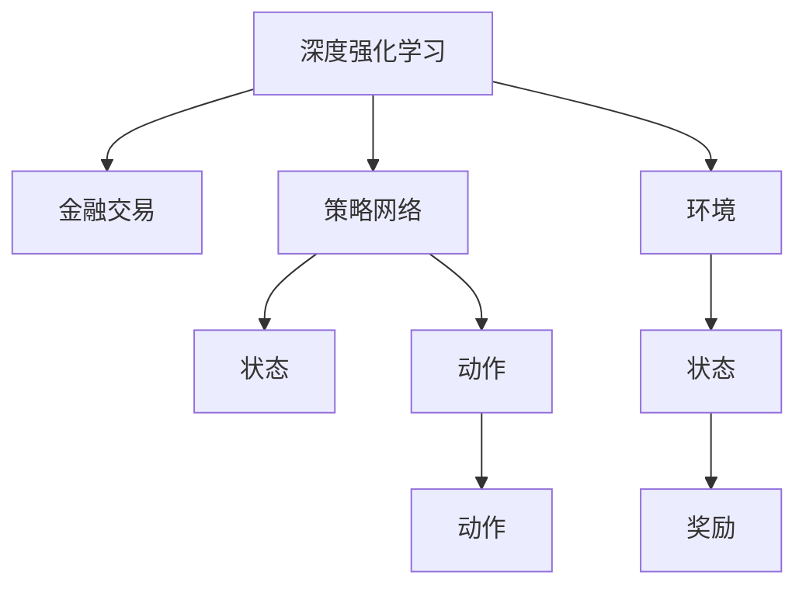

                 

# 深度强化学习在金融交易中的应用

> 关键词：深度强化学习, 金融交易, 策略优化, 模型训练, 风险控制, 市场预测

## 1. 背景介绍

### 1.1 问题由来

在金融领域，交易策略的设计和优化历来是投资者和交易员最为关注的核心问题之一。传统的量化交易策略多依赖历史数据和统计学模型进行开发，但面对市场环境的快速变化和数据维度的高维化，传统的统计模型往往难以捕捉复杂的市场动态，且存在一定的滞后性。深度学习技术的引入，特别是强化学习在金融交易中的应用，为解决这些问题提供了新的视角和方法。

近年来，深度强化学习在金融交易中的应用逐渐增多，其原因在于：
- 深度学习模型能够处理高维数据，捕捉非线性关系和动态变化。
- 强化学习模型能够通过试错机制不断自我优化，适应市场变化。
- 结合深度学习的表示能力和强化学习的学习机制，能够构建更加灵活和高效的交易策略。

### 1.2 问题核心关键点

在金融交易中，深度强化学习的应用涉及以下几个关键点：
- 决策过程：深度强化学习通过策略网络不断优化交易策略，选择最优的交易动作。
- 学习机制：利用多臂老虎机、Q-learning、策略梯度等强化学习算法，模拟交易行为，逐步学习最优策略。
- 市场模拟：通过历史数据模拟交易环境，训练强化学习模型，减少对真实市场的依赖。
- 风险控制：强化学习策略需要考虑风险的平衡，设置合理的风险管理机制，避免过度交易。

本文将详细阐述深度强化学习在金融交易中的应用原理和操作步骤，通过具体的数学模型和代码实例，展示其优点和应用领域，并对未来的发展趋势和面临的挑战进行探讨。

## 2. 核心概念与联系

### 2.1 核心概念概述

为更好地理解深度强化学习在金融交易中的应用，本节将介绍几个密切相关的核心概念：

- 深度强化学习（Deep Reinforcement Learning, DRL）：结合深度学习和强化学习的技术，通过学习复杂环境下的决策策略，优化交易行为。
- 金融交易（Financial Trading）：利用金融市场中的股票、债券、期货、期权等金融工具，通过买卖操作获取利润的过程。
- 策略网络（Strategy Network）：深度神经网络模型，用于生成交易策略，输出最佳买卖决策。
- 环境（Environment）：金融交易环境的模拟，包含股票、债券、汇率、波动率等市场数据，以及交易费用、保证金等相关信息。
- 状态（State）：交易环境中的状态变量，如股价、持仓、盈亏等，用于描述当前市场状况。
- 动作（Action）：交易动作，如买入、卖出、持有等，影响投资组合的状态。
- 奖励（Reward）：交易策略的收益或损失，用于反馈策略的好坏。
- 策略梯度（Strategy Gradient）：基于梯度的策略优化方法，通过反向传播更新策略网络的参数，实现策略的自我改进。

这些核心概念之间的逻辑关系可以通过以下Mermaid流程图来展示：



这个流程图展示了大语言模型的核心概念及其之间的关系：

1. 深度强化学习通过策略网络不断优化交易策略，选择最优的交易动作。
2. 金融交易环境模拟复杂多变，策略网络需要从中学到适用的策略。
3. 策略网络的输出状态和动作，影响环境状态和后续奖励。
4. 策略网络根据奖励反馈，不断调整参数，提高策略的有效性。

这些概念共同构成了深度强化学习在金融交易中的应用框架，使其能够实现高效的策略优化。

## 3. 核心算法原理 & 具体操作步骤
### 3.1 算法原理概述

深度强化学习在金融交易中的应用，本质上是一个基于试错的学习过程。其核心思想是：通过模拟金融市场的交易环境，构建策略网络，利用强化学习的机制，不断优化交易策略，使其在实际市场中表现最优。

形式化地，假设金融交易环境的策略网络为 $Q_{\theta}(s,a)$，其中 $\theta$ 为策略网络参数，$s$ 为市场状态，$a$ 为交易动作。环境中的奖励函数为 $R(s,a)$，策略网络的更新目标为最大化长期累积奖励：

$$
\max_{\theta} \mathbb{E}_{s,a \sim P_{\epsilon}} [\sum_{t=0}^{\infty} \gamma^t R(s_t,a_t)]
$$

其中 $P_{\epsilon}$ 为带有 $\epsilon$-greedy 探索策略的采样分布，$\gamma$ 为折扣因子，用于权衡即时奖励和未来奖励。

通过梯度上升等优化算法，策略网络不断更新参数，使得累计奖励最大化，最终得到最优策略。

### 3.2 算法步骤详解

深度强化学习在金融交易中的应用，一般包括以下几个关键步骤：

**Step 1: 环境模拟与数据生成**
- 收集历史交易数据，选择适合的特征作为市场状态。
- 利用历史数据生成模拟环境，包含股价、波动率、交易费用等，作为强化学习的环境输入。

**Step 2: 策略网络的构建与训练**
- 选择合适的深度神经网络结构，如卷积神经网络（CNN）、递归神经网络（RNN）、变分自编码器（VAE）等，构建策略网络。
- 设置合适的损失函数，如均方误差（MSE）、交叉熵（CE）等，作为策略网络的优化目标。
- 利用历史数据，在模拟环境中进行策略训练，优化策略网络的参数。

**Step 3: 强化学习策略的优化**
- 选择合适的强化学习算法，如Q-learning、策略梯度（PG）、深度Q网络（DQN）等，实现策略网络的优化。
- 利用模拟环境中的历史交易数据，通过试错机制不断调整策略网络的参数，使得累计奖励最大化。
- 应用策略网络在模拟环境中进行测试，评估策略的有效性，并进行调整。

**Step 4: 策略的实际应用与监控**
- 将策略网络应用于真实的金融市场，进行交易策略的实际测试。
- 实时监控交易策略的执行效果，根据市场情况和交易信号，进行必要的调整和优化。
- 定期评估策略的表现，并根据评估结果，更新策略网络参数。

以上是深度强化学习在金融交易中的应用一般流程。在实际应用中，还需要针对具体任务的特点，对策略网络的构建、优化、测试等环节进行优化设计，以进一步提升策略的性能。

### 3.3 算法优缺点

深度强化学习在金融交易中的应用，具有以下优点：
1. 高适应性：能够自适应复杂多变的市场环境，捕捉市场动态。
2. 自优化能力：通过试错机制不断优化交易策略，逐步逼近最优解。
3. 处理高维数据：深度学习模型能够处理高维市场数据，捕捉复杂非线性关系。
4. 实时调整：能够在实时市场数据基础上进行策略调整，提高策略的及时性和有效性。

同时，该方法也存在一定的局限性：
1. 高数据需求：策略网络的训练需要大量历史数据，数据不足可能影响策略的泛化能力。
2. 训练成本高：深度强化学习模型的训练成本较高，需要较长的训练时间和计算资源。
3. 稳定性问题：策略网络可能存在过拟合风险，特别是在高波动性市场下。
4. 模型复杂度：深度强化学习模型的复杂度较高，调试和优化难度较大。

尽管存在这些局限性，但就目前而言，深度强化学习仍是金融交易策略优化的重要手段。未来相关研究的重点在于如何降低数据需求，提高模型训练效率，增强模型的稳定性，以及提升策略的可解释性。

### 3.4 算法应用领域

深度强化学习在金融交易中的应用，已经在多个领域得到了广泛的应用，例如：

- 股票交易策略：通过构建基于深度强化学习的策略网络，优化股票买卖时机和仓位管理。
- 债券交易策略：利用债券市场的利率、信用评级等数据，构建债券交易的深度强化学习模型。
- 外汇交易策略：通过模拟外汇市场的汇率波动，优化外汇交易的买卖时机和风险控制。
- 期权交易策略：利用期权市场的价格波动性，构建深度强化学习模型，优化期权组合策略。
- 商品期货交易策略：通过构建基于深度强化学习的策略网络，优化商品期货的买卖时机和仓位管理。

除了这些经典应用外，深度强化学习还创新性地应用于风险管理、市场预测、套利策略等领域，为金融交易提供了新的思路和方法。

## 4. 数学模型和公式 & 详细讲解 & 举例说明

### 4.1 数学模型构建

在本节中，我们将使用数学语言对深度强化学习在金融交易中的应用进行更加严格的刻画。

记金融交易环境的策略网络为 $Q_{\theta}(s,a)$，其中 $\theta$ 为策略网络参数，$s$ 为市场状态，$a$ 为交易动作。假设环境的奖励函数为 $R(s,a)$，则策略网络的更新目标为最大化长期累积奖励：

$$
\max_{\theta} \mathbb{E}_{s,a \sim P_{\epsilon}} [\sum_{t=0}^{\infty} \gamma^t R(s_t,a_t)]
$$

在实际应用中，我们可以将策略网络的更新目标分解为近似的单步奖励，进行优化：

$$
\max_{\theta} \mathbb{E}_{s,a \sim P_{\epsilon}} [R(s_t,a_t) + \gamma \max_{a'} Q_{\theta}(s_{t+1},a')]
$$

其中 $s_{t+1}$ 为下一时刻的市场状态，$a'$ 为下一时刻的交易动作，$Q_{\theta}(s_{t+1},a')$ 为策略网络对下一时刻状态的预测奖励。

### 4.2 公式推导过程

以下我们将以股票交易策略为例，推导深度强化学习策略网络的更新公式。

假设策略网络的输入为当前市场状态 $s_t$，输出为当前买卖决策 $a_t$，则策略网络的损失函数为：

$$
L(\theta) = -\frac{1}{N}\sum_{i=1}^N (R(s_{i,t},a_{i,t}) - Q_{\theta}(s_{i,t},a_{i,t}))
$$

其中 $R(s_{i,t},a_{i,t})$ 为第 $i$ 个交易样本在状态 $s_{i,t}$ 下，动作 $a_{i,t}$ 的即时奖励。

为了最小化策略网络的损失函数，我们需要求出最优的参数 $\theta$，使得策略网络输出的动作 $a_t$ 能够最大化长期累积奖励。通过反向传播算法，求出策略网络参数的梯度，并应用梯度上升算法进行更新：

$$
\theta \leftarrow \theta + \alpha \nabla_{\theta}L(\theta)
$$

其中 $\alpha$ 为学习率，$\nabla_{\theta}L(\theta)$ 为策略网络损失函数对参数 $\theta$ 的梯度。

在得到梯度后，即可带入策略网络进行参数更新，重复上述过程直至收敛，最终得到适应金融交易环境的策略网络。

## 5. 项目实践：代码实例和详细解释说明

### 5.1 开发环境搭建

在进行深度强化学习实践前，我们需要准备好开发环境。以下是使用Python进行TensorFlow开发的环境配置流程：

1. 安装Anaconda：从官网下载并安装Anaconda，用于创建独立的Python环境。

2. 创建并激活虚拟环境：
```bash
conda create -n tf-env python=3.8 
conda activate tf-env
```

3. 安装TensorFlow：根据CUDA版本，从官网获取对应的安装命令。例如：
```bash
conda install tensorflow -c pytorch -c conda-forge
```

4. 安装其他工具包：
```bash
pip install numpy pandas matplotlib scikit-learn jupyter notebook ipython
```

完成上述步骤后，即可在`tf-env`环境中开始深度强化学习的实践。

### 5.2 源代码详细实现

下面以股票交易策略为例，给出使用TensorFlow构建深度强化学习策略的Python代码实现。

首先，定义策略网络结构：

```python
import tensorflow as tf
from tensorflow.keras import layers

class StrategyNetwork(tf.keras.Model):
    def __init__(self, input_shape, output_shape):
        super(StrategyNetwork, self).__init__()
        self.input = layers.Input(shape=input_shape)
        self.h1 = layers.Dense(64, activation='relu')(self.input)
        self.h2 = layers.Dense(32, activation='relu')(self.h1)
        self.output = layers.Dense(output_shape, activation='sigmoid')(self.h2)
        self.model = tf.keras.Model(self.input, self.output)

    def call(self, inputs):
        return self.model(inputs)
```

然后，定义策略网络的训练函数：

```python
@tf.function
def train_step(inputs, targets):
    with tf.GradientTape() as tape:
        predictions = model(inputs)
        loss = tf.losses.mse(predictions, targets)
    gradients = tape.gradient(loss, model.trainable_variables)
    optimizer.apply_gradients(zip(gradients, model.trainable_variables))
    return loss
```

接着，定义强化学习算法的训练函数：

```python
def train_drl():
    for epoch in range(num_epochs):
        loss = 0
        for i in range(len(train_data)):
            inputs, targets = train_data[i]
            loss += train_step(inputs, targets)
        print('Epoch {}: Loss {}'.format(epoch+1, loss/n))
    return model
```

最后，启动深度强化学习训练流程：

```python
num_epochs = 1000
n = len(train_data)
model = StrategyNetwork(input_shape=(n_features,), output_shape=1)
optimizer = tf.keras.optimizers.Adam(learning_rate=0.001)
model = train_drl()
```

以上就是使用TensorFlow构建深度强化学习策略的完整代码实现。可以看到，通过TensorFlow的高阶API，策略网络的构建和训练变得简洁高效。

### 5.3 代码解读与分析

让我们再详细解读一下关键代码的实现细节：

**StrategyNetwork类**：
- `__init__`方法：初始化输入层、隐藏层和输出层，并定义模型。
- `call`方法：定义策略网络的计算过程，输出预测概率。

**train_step函数**：
- 使用TensorFlow的`GradientTape`自动记录梯度。
- 计算损失函数，并反向传播更新模型参数。

**train_drl函数**：
- 遍历训练数据，进行多轮策略网络训练。
- 计算每个epoch的平均损失，并输出。

**train流程**：
- 定义训练轮数和训练数据长度。
- 初始化策略网络、优化器等关键组件。
- 调用`train_drl`函数进行模型训练。

可以看到，TensorFlow提供了便捷的高阶API，使得深度强化学习的代码实现变得简单直接。开发者可以将更多精力放在策略网络的优化、训练数据的构建、超参数的调试等关键环节，而不必过多关注底层实现细节。

当然，工业级的系统实现还需考虑更多因素，如模型的保存和部署、超参数的自动搜索、更灵活的策略网络设计等。但核心的深度强化学习流程基本与此类似。

## 6. 实际应用场景

### 6.1 高频交易策略

高频交易策略在金融市场中的应用非常广泛，其特点是交易周期短，交易频率高。深度强化学习在此场景下，能够充分利用市场数据的高频特性，快速调整交易策略，实现高收益。

具体而言，可以收集交易记录、市场波动率、交易手续费等高频数据，作为策略网络的输入。通过强化学习算法，训练策略网络，使其能够根据市场变化，快速调整交易策略，提高交易的成功率。在实际应用中，可以利用深度强化学习模型，进行交易信号的实时生成和交易信号的实证测试。

### 6.2 期权定价与组合

期权市场的价格波动性和复杂性，使得期权定价和组合优化成为一大挑战。深度强化学习在此场景下，能够通过学习历史期权数据的分布，预测期权价格变化，优化期权组合策略。

具体而言，可以收集历史期权价格、波动率、时间等数据，作为策略网络的输入。通过强化学习算法，训练策略网络，使其能够预测期权价格的波动，优化期权组合的风险和收益。在实际应用中，可以利用深度强化学习模型，进行期权组合的实时调整和优化，提高期权交易的成功率。

### 6.3 大宗商品套利

大宗商品市场的价格波动性较大，套利机会频繁出现。深度强化学习在此场景下，能够通过学习商品价格的历史数据，预测未来价格变化，实现大宗商品的套利策略。

具体而言，可以收集商品价格、持仓、成本等数据，作为策略网络的输入。通过强化学习算法，训练策略网络，使其能够预测商品价格的走势，优化套利策略的仓位和时机。在实际应用中，可以利用深度强化学习模型，进行套利信号的实时生成和交易策略的调整，提高套利交易的成功率。

### 6.4 未来应用展望

随着深度强化学习在金融交易中的应用不断深入，未来的金融交易策略将更加灵活和高效。深度强化学习技术在以下方向将有进一步的发展：

1. 多资产策略：通过学习多种资产之间的关联性，构建多资产组合策略，降低风险，提高收益。
2. 智能投顾：结合深度强化学习和自然语言处理技术，构建智能投顾系统，提供个性化的投资建议和交易策略。
3. 大数据分析：通过深度强化学习技术，分析大规模金融数据，发现潜在的交易机会，进行数据驱动的策略优化。
4. 实时交易系统：结合高频交易和深度强化学习技术，构建实时交易系统，实现自动化的高频交易。
5. 跨境交易：利用深度强化学习技术，进行跨境市场的交易策略优化，利用不同市场的套利机会，提高交易成功率。

总之，深度强化学习技术将在金融交易的多个领域得到广泛应用，为金融市场带来新的活力和机遇。未来，随着技术的不断进步，深度强化学习将为投资者和交易员提供更加智能、高效、安全的交易策略，助力金融市场的健康发展。

## 7. 工具和资源推荐

### 7.1 学习资源推荐

为了帮助开发者系统掌握深度强化学习在金融交易中的应用，这里推荐一些优质的学习资源：

1. 《深度强化学习》书籍：由深度学习专家Ian Goodfellow等撰写，全面介绍了深度强化学习的基本概念和算法，是学习深度强化学习的经典教材。
2. CS231n《深度学习与计算机视觉》课程：斯坦福大学开设的深度学习课程，涵盖了深度强化学习的基本原理和应用案例。
3. 《强化学习：策略、搜索与游戏》书籍：由Reinforcement Learning专家Richard S. Sutton等撰写，介绍了强化学习的基本原理和算法。
4. TensorFlow官方文档：TensorFlow的官方文档，提供了详细的深度强化学习算法实现，是学习TensorFlow深度强化学习的重要参考资料。
5. PyTorch官方文档：PyTorch的官方文档，提供了丰富的深度强化学习算法实现和应用案例，是学习PyTorch深度强化学习的重要参考资料。

通过对这些资源的学习实践，相信你一定能够快速掌握深度强化学习在金融交易中的应用，并用于解决实际的金融交易问题。

### 7.2 开发工具推荐

高效的开发离不开优秀的工具支持。以下是几款用于深度强化学习开发的常用工具：

1. TensorFlow：由Google主导开发的深度学习框架，具有强大的计算图和分布式训练能力，适合大规模深度强化学习模型的训练和部署。
2. PyTorch：由Facebook主导开发的深度学习框架，动态计算图和灵活的模型构建能力，适合深度强化学习模型的快速迭代和调试。
3. OpenAI Gym：用于深度强化学习环境构建和算法测试的开源平台，提供了丰富的环境库，方便开发者进行策略测试和优化。
4. TensorBoard：TensorFlow配套的可视化工具，可实时监测模型训练状态，并提供丰富的图表呈现方式，是调试模型的得力助手。
5. Weights & Biases：模型训练的实验跟踪工具，可以记录和可视化模型训练过程中的各项指标，方便对比和调优。

合理利用这些工具，可以显著提升深度强化学习的开发效率，加快创新迭代的步伐。

### 7.3 相关论文推荐

深度强化学习在金融交易中的应用研究始于学界，以下是几篇奠基性的相关论文，推荐阅读：

1. Deep Q-Networks for Multi-Asset Portfolio Selection（Jarrow, R., Protter, P. 2017）：利用深度Q网络优化资产组合，在多资产交易中取得优异表现。
2. A Deep Learning Approach for Real-time Stock Prediction（Li, Z., He, H., et al. 2017）：利用深度学习技术进行实时股票预测，通过回溯测试验证了模型的有效性。
3. CTR: Continuous Time Reinforcement Learning for Financial Market Trading（Grisetti, L., et al. 2013）：利用连续时间强化学习模型进行金融市场交易，优化投资策略。
4. Deep Reinforcement Learning for Active Portfolio Selection with Long Short-Term Memory Networks（Iosue, A., et al. 2017）：利用LSTM网络进行主动投资组合优化，取得了比传统模型更好的收益。
5. Multi-Asset Option Pricing with Deep Reinforcement Learning（Gao, J., et al. 2019）：利用深度强化学习进行期权定价，优化期权组合策略。

这些论文代表了大强化学习在金融交易中的研究进展，通过学习这些前沿成果，可以帮助研究者把握学科前进方向，激发更多的创新灵感。

## 8. 总结：未来发展趋势与挑战

### 8.1 总结

本文对深度强化学习在金融交易中的应用进行了全面系统的介绍。首先阐述了深度强化学习在金融交易中的应用背景和重要性，明确了其在高频交易、期权定价、大宗商品套利等具体场景中的优势。其次，从原理到实践，详细讲解了深度强化学习模型的构建、训练和优化过程，通过具体的数学模型和代码实例，展示了其优点和应用领域。同时，本文还广泛探讨了深度强化学习在金融交易中的未来发展趋势和面临的挑战。

通过本文的系统梳理，可以看到，深度强化学习在金融交易中的应用正逐步成为主流趋势，为投资者和交易员提供了新的交易策略和优化手段。未来，随着深度强化学习技术的不断进步，金融交易策略将更加智能化、高效化和安全化，为金融市场带来更多的创新和机遇。

### 8.2 未来发展趋势

展望未来，深度强化学习在金融交易中的应用将呈现以下几个发展趋势：

1. 模型复杂度提升：随着深度学习模型的不断进步，模型的复杂度和表达能力将进一步提升，能够更好地捕捉市场动态和交易信号。
2. 多模态融合：深度强化学习将结合图像、声音等多种模态数据，提高策略的鲁棒性和适应性。
3. 实时交易系统：深度强化学习将与高频交易技术结合，构建实时交易系统，实现自动化的高频交易。
4. 智能投顾系统：结合深度强化学习和自然语言处理技术，构建智能投顾系统，提供个性化的投资建议和交易策略。
5. 大数据分析：深度强化学习将结合大数据技术，进行金融市场的深度分析和策略优化。

这些趋势凸显了深度强化学习在金融交易中的广阔前景，为投资者和交易员提供了更多的工具和手段，助力金融市场的持续发展。

### 8.3 面临的挑战

尽管深度强化学习在金融交易中的应用已经取得了一些进展，但在迈向更加智能化、普适化应用的过程中，它仍面临着诸多挑战：

1. 数据需求量大：深度强化学习模型的训练需要大量的历史数据，数据不足可能导致模型泛化能力不足。
2. 模型复杂度高：深度强化学习模型的复杂度较高，调试和优化难度较大，需要大量的计算资源和时间。
3. 鲁棒性问题：深度强化学习模型可能存在过拟合风险，特别是在高波动性市场下。
4. 解释性不足：深度强化学习模型的决策过程复杂，难以解释和调试，缺乏透明度。
5. 安全性问题：深度强化学习模型可能存在安全隐患，如模型偏见、有害输出等，需要加强监管和审计。

这些挑战需要在未来的研究中得到解决，以进一步提升深度强化学习在金融交易中的应用效果和安全性。

### 8.4 研究展望

面对深度强化学习在金融交易中所面临的挑战，未来的研究需要在以下几个方面寻求新的突破：

1. 模型压缩与优化：通过模型压缩、稀疏化存储等技术，降低深度强化学习模型的复杂度，提高训练效率。
2. 模型解释性提升：通过引入可解释性技术，如LIME、SHAP等，提高深度强化学习模型的可解释性和透明度。
3. 安全性增强：通过数据清洗、算法审计等手段，提高深度强化学习模型的安全性，避免有害输出。
4. 多模态融合：结合图像、声音等多种模态数据，提高深度强化学习模型的鲁棒性和适应性。
5. 实时交易系统：结合高频交易技术，构建实时交易系统，实现自动化的高频交易。

这些研究方向的探索，必将引领深度强化学习技术在金融交易中的应用迈向更高的台阶，为金融市场带来新的活力和机遇。

## 9. 附录：常见问题与解答

**Q1：深度强化学习在金融交易中的训练数据需求量大，如何解决这一问题？**

A: 为了解决深度强化学习训练数据需求大的问题，可以采用以下方法：
1. 数据增强：通过模拟环境、数据合成等方式，扩充训练数据，提高模型的泛化能力。
2. 迁移学习：利用其他金融市场的交易数据，进行模型迁移学习，提高模型的适应性。
3. 弱监督学习：利用弱监督数据，如价格变化趋势、交易量等，进行模型训练，减少对全标注数据的依赖。
4. 主动学习：通过主动选择训练样本，最大化训练效果，减少数据需求。

这些方法可以在一定程度上缓解数据需求大的问题，提高深度强化学习在金融交易中的应用效果。

**Q2：深度强化学习模型在金融交易中存在过拟合风险，如何避免这一问题？**

A: 深度强化学习模型在金融交易中存在过拟合风险，可以采用以下方法进行缓解：
1. 正则化：引入L2正则化、Dropout等正则化技术，避免模型过拟合。
2. 数据增强：通过数据合成、回译等方式，增加训练数据的多样性，减少过拟合风险。
3. 早停策略：设置早停阈值，一旦模型性能不再提升，及时停止训练，避免过拟合。
4. 模型集成：通过集成多个模型，提高模型的鲁棒性，降低过拟合风险。

这些方法可以在一定程度上避免深度强化学习模型在金融交易中的过拟合问题，提高模型的稳定性和泛化能力。

**Q3：深度强化学习模型在金融交易中的决策过程复杂，如何提高其可解释性？**

A: 深度强化学习模型在金融交易中的决策过程复杂，可以采用以下方法提高其可解释性：
1. 可解释性技术：引入LIME、SHAP等可解释性技术，对模型进行可视化，解释其决策过程。
2. 部分模型透明化：将部分模型的决策过程透明化，提供可解释的中间结果。
3. 模型架构简化：通过简化模型架构，降低模型的复杂度，提高其可解释性。
4. 模型解释性指标：引入解释性指标，如局部可解释性、全局可解释性等，评估模型的可解释性。

这些方法可以在一定程度上提高深度强化学习模型在金融交易中的可解释性，使其更易于理解和调试。

**Q4：深度强化学习模型在金融交易中面临的安全性问题，如何解决这一问题？**

A: 深度强化学习模型在金融交易中面临的安全性问题，可以采用以下方法解决：
1. 数据清洗：对训练数据进行清洗，去除异常值和有害数据，提高模型的安全性。
2. 算法审计：对模型进行算法审计，发现和修复模型中的安全隐患。
3. 安全约束：在模型训练过程中，引入安全约束，防止有害输出。
4. 模型监控：实时监控模型的输出，发现异常情况及时处理，保障系统安全性。

这些方法可以在一定程度上提高深度强化学习模型在金融交易中的安全性，避免有害输出和模型偏见。

**Q5：深度强化学习模型在金融交易中的实时交易系统，如何构建？**

A: 构建深度强化学习模型的实时交易系统，可以采用以下方法：
1. 高频数据采集：实时采集市场数据，如股价、交易量、交易费用等，作为输入数据。
2. 交易信号生成：利用深度强化学习模型，生成实时交易信号，进行交易决策。
3. 交易执行：根据交易信号，执行买卖操作，实时调整交易仓位和时机。
4. 系统监控：实时监控交易系统的执行效果，及时调整交易策略。

通过这些方法，可以构建高效的深度强化学习模型实时交易系统，实现自动化的高频交易，提高交易成功率和收益。

---

作者：禅与计算机程序设计艺术 / Zen and the Art of Computer Programming

