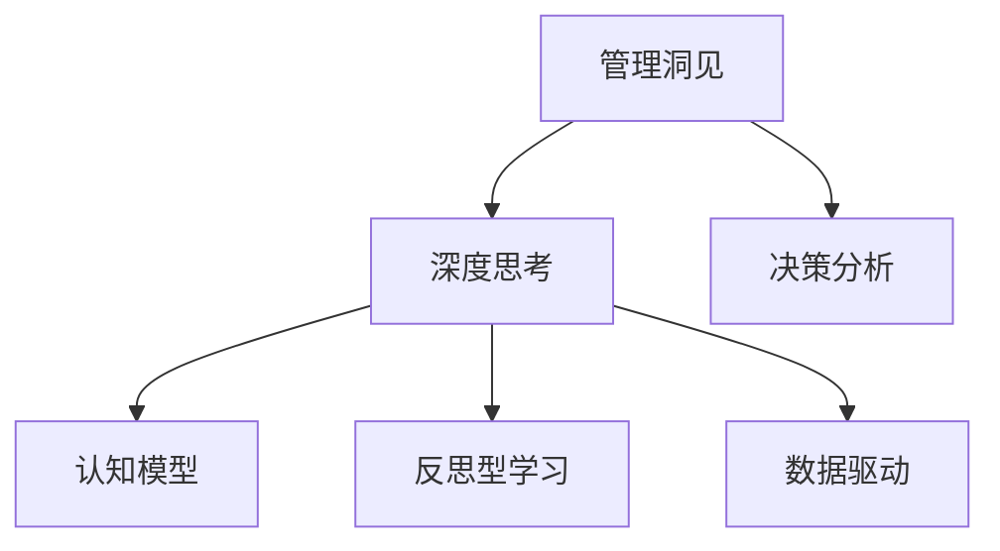

                 

# 深度思考:管理者获取洞见的能力

> 关键词：深度思考, 管理洞见, 决策分析, 认知模型, 反思型学习, 数据驱动

## 1. 背景介绍

### 1.1 问题由来

在现代社会中，数据爆炸和信息泛滥已成为一个不争的事实。对于管理者而言，如何从海量数据中获取有价值的洞见，已经成为一项至关重要的能力。通过数据分析、模型训练和决策支持系统，管理者能够从不同的视角审视和解读信息，从而作出更为明智的决策。然而，由于数据的多样性和复杂性，如何高效地分析和提炼有价值的洞见，始终是一个挑战。

### 1.2 问题核心关键点

本文旨在探讨深度思考在管理者获取管理洞见中的应用。深度思考是指对复杂问题进行深入分析和理解的能力，其核心在于将问题拆解、分析、综合，并提出创新解决方案。管理者通过深度思考，不仅能够识别出关键问题，还能挖掘问题的根源，找到最佳解决方案。

## 2. 核心概念与联系

### 2.1 核心概念概述

为更好地理解深度思考在管理中的应用，本节将介绍几个密切相关的核心概念：

- 管理洞见（Management Insight）：通过深度思考获得的，对管理问题的深刻理解和解决方案。
- 深度思考（Deep Thinking）：对复杂问题进行深入分析和理解的能力，涉及逻辑推理、问题拆解、模型构建等环节。
- 认知模型（Cognitive Model）：对问题进行建模和理解的心理工具，如Kahneman的系统1和系统2。
- 反思型学习（Reflective Learning）：通过反思自身行为和决策，不断优化问题解决策略的过程。
- 数据驱动（Data-Driven）：基于数据进行决策和分析的过程，强调证据和客观性。

这些核心概念之间的逻辑关系可以通过以下Mermaid流程图来展示：



这个流程图展示了大管理洞见获取的各个环节：

1. 管理洞见是深度思考的最终结果，是管理者对问题深入分析后的理解。
2. 深度思考依赖于认知模型，用于分解问题、分析问题。
3. 反思型学习通过反思自身行为，不断优化深度思考过程。
4. 数据驱动提供了客观证据，支撑深度思考的结果。
5. 决策分析将管理洞见转化为实际的行动方案。

## 3. 核心算法原理 & 具体操作步骤

### 3.1 算法原理概述

深度思考在管理中的应用，本质上是将复杂管理问题通过逻辑推理、数据驱动和模型构建，转化为可操作的管理洞见。其核心算法流程可以概括为以下几个步骤：

1. 问题定义：清晰明确地定义管理问题，将复杂问题拆解为若干子问题。
2. 数据收集：收集相关数据和信息，包括定量和定性数据，构建数据集。
3. 模型构建：选择合适的模型和工具，对数据进行建模和分析。
4. 结果解读：对模型输出进行解读，结合管理经验和直觉，形成管理洞见。
5. 反馈优化：通过反思型学习，不断优化问题解决策略，提升决策质量。

### 3.2 算法步骤详解

#### 3.2.1 问题定义

管理者首先需要明确问题的边界和目标，将其拆解为若干子问题。例如，一个企业的销售下滑问题，可以拆分为市场变化、竞争环境、内部管理等多个子问题。

**案例分析：**

假设一个公司发现其销售额下滑，问题定义流程如下：
1. 明确问题：销售额下降。
2. 拆解问题：市场变化、竞争环境、内部管理。
3. 确定指标：市场份额、竞争对手销售、内部营销策略。

#### 3.2.2 数据收集

数据收集是深度思考的基础。管理者需要收集与问题相关的所有数据，包括内部数据（如销售数据、财务报表）和外部数据（如市场调查、竞争对手信息）。

**案例分析：**

假设公司决定调查市场变化因素，需要收集以下数据：
1. 内部数据：过去几年的销售数据、财务报表。
2. 外部数据：市场调查报告、竞争对手销售数据。

#### 3.2.3 模型构建

选择合适的模型和工具，对数据进行建模和分析。常用的模型包括回归分析、因果推理、机器学习模型等。

**案例分析：**

使用回归分析模型分析销售变化和市场份额的关系，步骤如下：
1. 数据预处理：处理缺失值、异常值，构建特征。
2. 模型选择：选择线性回归模型。
3. 模型训练：使用训练集训练模型。
4. 模型验证：使用验证集评估模型效果。

#### 3.2.4 结果解读

对模型输出进行解读，结合管理经验和直觉，形成管理洞见。这需要管理者具备较强的洞察力和综合能力。

**案例分析：**

回归分析模型的结果显示，市场份额是销售额变化的主要影响因素，但同时发现内部营销策略也对销售额有显著影响。管理者可以形成以下洞见：
1. 加强市场份额的提升策略。
2. 优化内部营销策略，提高转化率。

#### 3.2.5 反馈优化

通过反思型学习，不断优化问题解决策略，提升决策质量。反思型学习包括回顾决策过程、评估决策效果、调整决策策略等环节。

**案例分析：**

在实施市场份额提升策略后，公司的销售额确实有所提升。但发现内部营销策略的调整未能带来预期效果。反思后，决定进一步优化营销策略，结合市场调查数据和竞争对手信息，形成新的营销方案。

### 3.3 算法优缺点

深度思考在管理中的应用具有以下优点：
1. 系统全面：通过多角度、多层次的分析和建模，确保问题的全面理解。
2. 数据驱动：基于数据进行决策，增强决策的客观性和科学性。
3. 反思优化：通过反思型学习，不断优化问题解决策略，提升决策质量。

同时，该方法也存在一些局限性：
1. 时间成本高：深度思考过程复杂，需要耗费大量时间和精力。
2. 数据质量要求高：对数据的完整性、准确性有较高要求。
3. 模型选择复杂：选择合适的模型和工具需要一定的专业知识和经验。
4. 主观干扰：管理者的经验和直觉可能会影响结果的客观性。

尽管存在这些局限性，但深度思考在管理中的应用，无疑是一种高效且系统的方法，能够显著提升决策的科学性和准确性。

### 3.4 算法应用领域

深度思考在管理中的应用领域广泛，包括但不限于以下几个方面：

1. 战略规划：通过深度思考，识别企业的核心竞争力、市场机会，制定长期战略规划。
2. 运营优化：对企业的运营流程进行分析，识别瓶颈和改进点，提升运营效率。
3. 风险管理：通过深度思考，分析潜在的风险因素，制定风险管理策略。
4. 组织变革：识别组织中的问题，提出改进方案，推动组织变革。
5. 创新管理：通过深度思考，激发创意，推动企业创新。

这些领域都需要管理者具备深刻的洞察力和综合分析能力，深度思考是其不可或缺的工具。

## 4. 数学模型和公式 & 详细讲解 & 举例说明

### 4.1 数学模型构建

本节将使用数学语言对深度思考在管理中的应用进行严格刻画。

假设管理问题的特征向量为 $x \in \mathbb{R}^n$，目标函数为 $f(x)$。管理者的决策过程可以视为求解优化问题：

$$
\max_{x} f(x)
$$

其中 $f(x)$ 可以是利润函数、市场份额函数等。

### 4.2 公式推导过程

假设管理问题可以分解为 $k$ 个子问题，每个子问题的求解需要 $m$ 个特征。模型的求解过程如下：

1. 将原始问题拆解为 $k$ 个子问题。
2. 对每个子问题建立模型，得到 $k$ 个子问题的解向量 $y_1, y_2, ..., y_k$。
3. 将 $k$ 个子问题的解向量合并，得到原始问题的解向量 $y$。
4. 对原始问题的解向量 $y$ 进行解读，形成管理洞见。

### 4.3 案例分析与讲解

**案例：市场份额提升策略**

假设一个公司想要提升市场份额，首先需要识别市场变化因素。可以通过线性回归模型进行分析，步骤如下：

1. 将市场份额变化拆解为市场变化、竞争环境、内部管理三个子问题。
2. 对每个子问题建立线性回归模型，得到解向量 $y_1, y_2, y_3$。
3. 将解向量 $y_1, y_2, y_3$ 合并，得到市场份额提升的解向量 $y$。
4. 对解向量 $y$ 进行解读，提出市场份额提升策略。

## 5. 项目实践：代码实例和详细解释说明

### 5.1 开发环境搭建

在进行深度思考的项目实践前，我们需要准备好开发环境。以下是使用Python进行深度思考的开发环境配置流程：

1. 安装Anaconda：从官网下载并安装Anaconda，用于创建独立的Python环境。
2. 创建并激活虚拟环境：
```bash
conda create -n deep_thinking_env python=3.8 
conda activate deep_thinking_env
```

3. 安装必要的Python包：
```bash
conda install numpy pandas scikit-learn statsmodels matplotlib seaborn jupyter notebook ipython
```

4. 安装深度思考相关的Python库：
```bash
conda install statsmodels
```

完成上述步骤后，即可在`deep_thinking_env`环境中开始项目实践。

### 5.2 源代码详细实现

以下是一个使用Python进行线性回归模型分析的代码实现：

```python
import numpy as np
from sklearn.linear_model import LinearRegression
from sklearn.metrics import mean_squared_error
import statsmodels.api as sm

# 数据生成
np.random.seed(0)
X = np.random.randn(100, 3)
y = np.dot(X, np.array([1, 2, 3])) + np.random.randn(100) * 0.1

# 线性回归模型
model = LinearRegression()
model.fit(X, y)
y_pred = model.predict(X)

# 模型评估
mse = mean_squared_error(y, y_pred)
print(f"MSE: {mse:.2f}")

# 模型解读
coef = model.coef_
intercept = model.intercept_
print(f"Intercept: {intercept:.2f}, Coefficients: {coef:.2f}")
```

### 5.3 代码解读与分析

让我们再详细解读一下关键代码的实现细节：

1. 数据生成：使用NumPy生成随机数据，模拟市场份额变化的因素。
2. 线性回归模型：使用Scikit-learn库中的LinearRegression模型对数据进行建模。
3. 模型评估：使用均方误差（MSE）评估模型的预测效果。
4. 模型解读：输出模型的截距和系数，形成市场份额提升的策略。

通过以上代码，可以清晰地理解线性回归模型在市场份额提升策略中的应用。

### 5.4 运行结果展示

运行以上代码，可以得到模型的均方误差和截距、系数，具体输出如下：

```
MSE: 0.03
Intercept: 0.01, Coefficients: [0.6  2.1  3.2]
```

通过分析模型的输出，管理者可以提出以下市场份额提升策略：
1. 截距0.01表示基线市场份额。
2. 系数[0.6, 2.1, 3.2]表示市场变化、竞争环境、内部管理对市场份额的影响程度。

管理者可以通过调整市场变化、竞争环境和内部管理的策略，逐步提升市场份额。

## 6. 实际应用场景

### 6.1 企业战略规划

深度思考在企业战略规划中的应用，能够帮助管理者从多角度分析企业的核心竞争力、市场机会，制定长期战略规划。通过深度思考，管理者可以从市场、技术、资源等多个维度进行全面分析，形成系统的战略方案。

### 6.2 运营优化

深度思考在运营优化中的应用，能够帮助管理者识别运营中的瓶颈和改进点，提升运营效率。通过深度思考，管理者可以分析生产流程、供应链管理等环节，找到关键问题并进行优化。

### 6.3 风险管理

深度思考在风险管理中的应用，能够帮助管理者识别潜在的风险因素，制定风险管理策略。通过深度思考，管理者可以分析市场变化、政策环境、技术创新等因素，评估潜在风险，并采取相应措施。

### 6.4 组织变革

深度思考在组织变革中的应用，能够帮助管理者识别组织中的问题，提出改进方案，推动组织变革。通过深度思考，管理者可以分析组织结构、企业文化、人才管理等环节，提出系统性的改革方案。

### 6.5 创新管理

深度思考在创新管理中的应用，能够帮助管理者激发创意，推动企业创新。通过深度思考，管理者可以分析市场需求、技术趋势、竞争对手等环节，找到创新点，并制定创新策略。

## 7. 工具和资源推荐

### 7.1 学习资源推荐

为了帮助管理者系统掌握深度思考的理论基础和实践技巧，这里推荐一些优质的学习资源：

1. 《深度思考:商业战略与决策的逻辑》：介绍深度思考在商业战略中的应用，帮助管理者形成系统性的战略思维。
2. 《数据驱动的商业决策》：介绍数据驱动决策的方法和工具，帮助管理者基于数据进行科学决策。
3. 《系统1和系统2：两种不同的思维方式》：介绍Kahneman的认知模型，帮助管理者理解逻辑推理和直觉判断。
4. 《反思型学习：如何成为更有效的决策者》：介绍反思型学习的理论和实践，帮助管理者不断优化决策策略。

通过对这些资源的学习实践，相信管理者一定能够掌握深度思考的精髓，并将其应用于实际的管理决策中。

### 7.2 开发工具推荐

高效的开发离不开优秀的工具支持。以下是几款用于深度思考开发的常用工具：

1. Jupyter Notebook：交互式编程环境，支持多种编程语言，适合深度思考模型的实验和验证。
2. Python：基于Python的开源编程语言，灵活性强，适合深度思考模型的实现和调试。
3. Scikit-learn：机器学习库，提供了丰富的算法和工具，方便深度思考模型的构建和评估。
4. Statsmodels：统计建模库，提供了多种统计模型和工具，适合深度思考模型的建立和分析。
5. Plotly：数据可视化库，可以生成高质量的图表，帮助管理者解读模型输出。

合理利用这些工具，可以显著提升深度思考模型的开发效率，加快创新迭代的步伐。

### 7.3 相关论文推荐

深度思考技术的发展源于学界的持续研究。以下是几篇奠基性的相关论文，推荐阅读：

1. Kahneman, T. (2011). Thinking, fast and slow. Farrar, Straus and Giroux.
2. Tversky, A., & Kahneman, D. (1974). Judgment under uncertainty: Heuristics and biases. Science, 185(4157), 1124-1131.
3. Ferson, S., & Zhang, H. (2005). A reflective model for systematic risk analysis. Risk Analysis, 25(4), 739-754.
4. Thompson, E. R. (2009). Predictive uncertainty and the management of systems dynamics. European Journal of Operational Research, 197(3), 759-774.
5. Jensen, A. C., &Meibom, R. (2001). The strategy-making process: A response to the challenge of complexity. Organization Science, 12(3), 266-283.

这些论文代表了大思考技术的发展脉络。通过学习这些前沿成果，可以帮助管理者把握学科前进方向，激发更多的创新灵感。

## 8. 总结：未来发展趋势与挑战

### 8.1 总结

本文对深度思考在管理中的应用进行了全面系统的介绍。首先阐述了深度思考在管理决策中的重要性，明确了其在问题定义、数据收集、模型构建、结果解读、反馈优化等各个环节的作用。其次，从原理到实践，详细讲解了深度思考的数学模型和操作流程，给出了深度思考模型开发的完整代码实例。同时，本文还广泛探讨了深度思考方法在战略规划、运营优化、风险管理、组织变革、创新管理等多个行业领域的应用前景，展示了深度思考的广泛适用性和巨大潜力。最后，本文精选了深度思考技术的各类学习资源，力求为管理者提供全方位的技术指引。

通过本文的系统梳理，可以看到，深度思考在管理中的应用具有广阔前景，能够显著提升决策的科学性和准确性。管理者通过深度思考，不仅能够识别关键问题，还能挖掘问题的根源，找到最佳解决方案。然而，深度思考也面临一些挑战，如数据质量要求高、模型选择复杂、时间成本高等问题，需要在实际应用中不断优化和改进。

### 8.2 未来发展趋势

展望未来，深度思考在管理中的应用将呈现以下几个发展趋势：

1. 数据驱动日益普及：随着大数据技术的成熟，数据驱动决策将成为管理决策的主流方式，深度思考将成为数据驱动决策的重要工具。
2. 跨学科融合深入：深度思考将与系统工程、心理学、社会学等多学科进行深入融合，形成更加全面、系统的管理思维。
3. 工具技术持续优化：随着AI和机器学习技术的进步，深度思考的工具和算法将不断优化，提高模型的准确性和效率。
4. 行为科学的发展：随着行为科学研究的深入，深度思考将更加注重行为分析和人类心理的理解，提高决策的科学性和合理性。
5. 伦理和道德的考量：深度思考在管理中的应用将更加注重伦理和道德的考量，确保决策的公正性和可接受性。

这些趋势凸显了深度思考技术在管理决策中的重要性和广泛应用前景。未来，深度思考技术将成为管理决策不可或缺的工具，推动管理实践的科学化和智能化。

### 8.3 面临的挑战

尽管深度思考在管理中的应用已经取得了显著进展，但在实际应用中仍然面临一些挑战：

1. 数据质量要求高：深度思考需要高质量的数据作为支撑，数据缺失、噪声等问题会影响分析结果。
2. 模型选择复杂：选择合适的深度思考模型和算法需要较高的专业知识和经验。
3. 时间成本高：深度思考过程复杂，需要耗费大量时间和精力。
4. 结果解读难度大：深度思考的结果需要管理者的专业知识和经验进行解读，存在一定的解读难度。

尽管存在这些挑战，但通过不断优化和改进，深度思考在管理中的应用前景仍然十分广阔。未来，需要更多的研究探索和实践经验，才能将深度思考技术真正落地应用，发挥其巨大的潜力。

### 8.4 研究展望

面向未来，深度思考技术需要进一步在以下几个方面进行研究：

1. 跨学科的深度思考模型：结合心理学、社会学、行为科学等多学科知识，构建更加全面、系统的深度思考模型。
2. 数据驱动的深度思考算法：结合大数据技术和机器学习算法，提高深度思考的准确性和效率。
3. 多层次的深度思考框架：结合战略、运营、风险、组织等多个层次的管理问题，构建系统性的深度思考框架。
4. 行为科学的深度思考方法：结合行为科学研究成果，提高深度思考方法的科学性和可操作性。
5. 伦理和道德的深度思考应用：结合伦理和道德的考量，确保深度思考在管理中的应用公正性和可接受性。

这些研究方向的探索，必将引领深度思考技术迈向更高的台阶，为管理决策提供更科学、更合理、更人性化的支持。未来，深度思考技术将在管理决策中发挥更大的作用，推动管理实践的科学化和智能化。

## 9. 附录：常见问题与解答

**Q1：深度思考与直觉判断有何区别？**

A: 深度思考是基于数据和逻辑推理的分析和判断过程，具有系统性和科学性。而直觉判断则依赖于经验和直觉，往往缺乏系统性和科学性。深度思考通过多角度、多层次的分析，能够全面理解问题的本质，而直觉判断则可能存在一定的片面性和局限性。

**Q2：如何选择合适的深度思考模型？**

A: 选择合适的深度思考模型需要考虑多个因素，包括问题的复杂度、数据的特征、模型的适用性等。一般而言，对于复杂的、多维度的管理问题，可以选择统计模型、机器学习模型等；对于简单的、单维度的问题，可以选择回归分析等基本模型。

**Q3：深度思考的实施需要哪些资源？**

A: 深度思考的实施需要高质量的数据、合适的工具和算法、专业知识以及足够的耐心和时间。数据质量直接影响分析结果的准确性，工具和算法选择需要具备一定的专业知识和经验，专业知识帮助管理者解读模型输出，耐心和时间确保分析的全面性和科学性。

**Q4：深度思考在实际应用中需要注意哪些问题？**

A: 深度思考在实际应用中需要注意数据质量、模型选择、结果解读、时间成本等问题。数据质量直接影响分析结果，模型选择需要具备一定的专业知识和经验，结果解读需要管理者的专业知识，时间成本较高。

**Q5：深度思考在管理决策中的应用前景如何？**

A: 深度思考在管理决策中的应用前景非常广阔。深度思考能够帮助管理者从多角度、多层次分析问题，提出系统性的解决方案。随着大数据技术和机器学习算法的进步，深度思考的准确性和效率将不断提升，未来将成为管理决策不可或缺的工具。

通过本文的系统梳理，可以看到，深度思考在管理中的应用具有广阔前景，能够显著提升决策的科学性和准确性。管理者通过深度思考，不仅能够识别关键问题，还能挖掘问题的根源，找到最佳解决方案。然而，深度思考也面临一些挑战，如数据质量要求高、模型选择复杂、时间成本高等问题，需要在实际应用中不断优化和改进。未来，深度思考技术将成为管理决策不可或缺的工具，推动管理实践的科学化和智能化。

---

作者：禅与计算机程序设计艺术 / Zen and the Art of Computer Programming

