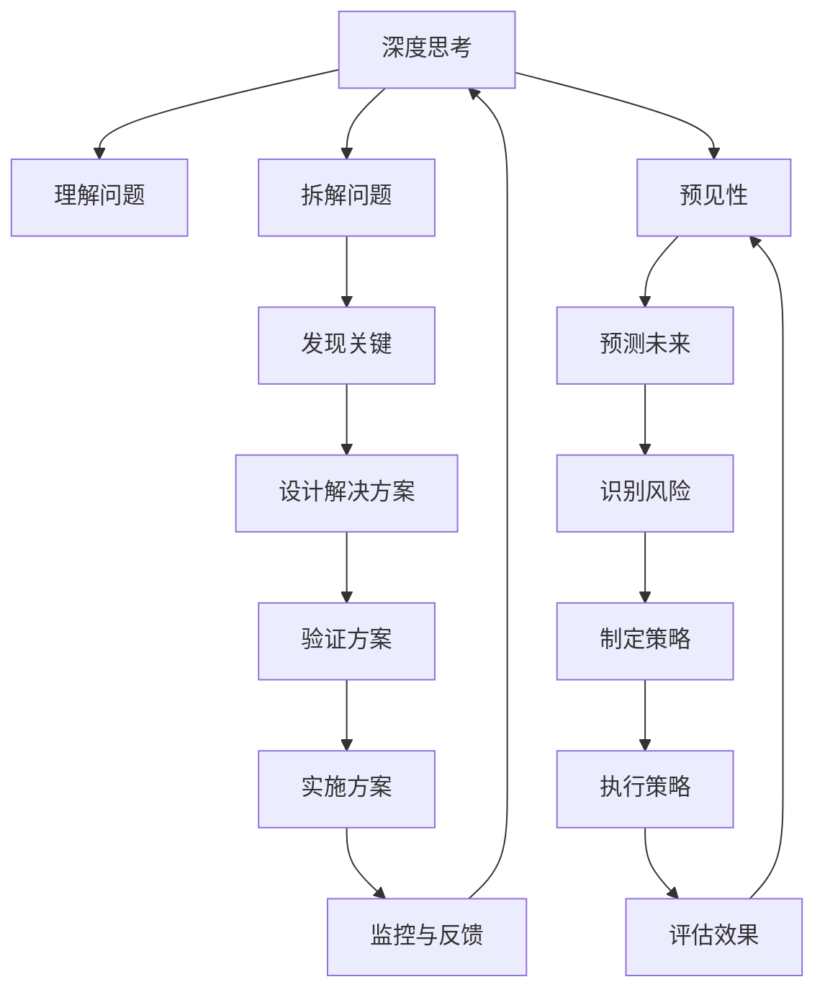

                 

## 1. 背景介绍

在快速发展的科技行业中，深度思考已经成为企业管理与决策中不可或缺的一环。预见性，作为深度思考的核心要素，对于决策者了解未来的趋势、规避潜在风险、制定长远规划具有至关重要的作用。本文将深入探讨深度思考与管理预见性之间的关系，分析其重要性，并提供一系列的实践建议。

## 2. 核心概念与联系

### 2.1 核心概念概述

深度思考（Deep Thinking）指的是在复杂问题上，通过多层次、多维度、多视角的思考方式，全面、深入、细致地分析和理解问题的本质和关键，从而形成有深度、有洞见的解决方案。深度思考强调的是深入问题核心的能力，能够将复杂问题拆解为可控的、可操作的小问题，从而找到最优的解决方案。

预见性（Forecasting）则是指在了解当前数据和环境的基础上，对未来趋势、可能发生的事件以及其对组织的影响进行预测的能力。预见性是管理决策过程中重要的一环，能够帮助组织在面临不确定性时，提前布局，减少风险。

### 2.2 核心概念原理和架构的 Mermaid 流程图



这个流程图中，深度思考（A）通过理解问题（B）、拆解问题（C）、发现关键（D）、设计解决方案（E）、验证方案（F）、实施方案（G）、监控与反馈（H）等多个步骤，最终实现预见性（I）的提升。预见性通过预测未来（J）、识别风险（K）、制定策略（L）、执行策略（M）、评估效果（N）等多个环节，保证深度思考的准确性和有效性。

## 3. 核心算法原理 & 具体操作步骤

### 3.1 算法原理概述

深度思考与预见性的关系，体现在通过深度思考获得的信息，经过分析、推理，形成对未来趋势的预测。这种预测并不是随机猜测，而是基于对现有数据、环境、社会等多维度信息的全面分析，同时结合专家的经验与智慧，从而得到科学合理的预见。

### 3.2 算法步骤详解

1. **信息收集**：全面收集与决策问题相关的信息，包括历史数据、当前市场状况、竞争情况、技术进展等。

2. **数据处理**：对收集到的数据进行清洗、整理、分析，得出有价值的洞察。

3. **专家咨询**：邀请相关领域专家进行讨论，获取他们的见解和建议。

4. **模型构建**：使用数学模型、统计模型、预测模型等工具，构建预见性模型。

5. **场景模拟**：模拟不同决策情景，预测未来可能的发展路径。

6. **评估与调整**：根据模拟结果，评估不同决策的优劣，必要时进行调整优化。

7. **决策制定**：综合以上信息，制定最终的决策方案。

8. **实施与监控**：将决策方案付诸实施，并对执行情况进行监控和调整。

### 3.3 算法优缺点

**优点**：

- **全面性**：深度思考和预见性结合，能够全面考虑各个因素，避免片面判断。
- **系统性**：通过系统化分析，提升决策的科学性和合理性。
- **灵活性**：可以灵活应对变化，及时调整策略。

**缺点**：

- **复杂性**：涉及的信息量大，分析过程复杂。
- **时间成本**：信息收集、数据处理、模型构建等环节耗时较长。
- **资源需求**：需要大量数据和计算资源，对组织的资源配置要求较高。

### 3.4 算法应用领域

深度思考与预见性广泛应用于企业战略规划、产品开发、市场预测、风险管理等多个领域。例如：

- **企业战略规划**：通过对市场环境、竞争对手、技术趋势等信息的深度思考，预测未来趋势，制定战略方向。
- **产品开发**：通过分析用户需求、市场趋势，预见未来技术发展方向，指导产品研发。
- **市场预测**：利用历史数据和市场动态，预测未来市场走势，制定营销策略。
- **风险管理**：通过深度思考，识别潜在风险，制定应对措施，保障组织安全。

## 4. 数学模型和公式 & 详细讲解 & 举例说明

### 4.1 数学模型构建

在构建预见性模型时，我们通常使用回归模型、时间序列模型、机器学习模型等。以时间序列模型为例，我们通过历史数据来预测未来趋势。模型构建的公式如下：

$$
\hat{y}_t = \beta_0 + \sum_{i=1}^{p} \beta_i y_{t-i} + \epsilon_t
$$

其中，$\hat{y}_t$ 为预测值，$y_t$ 为实际值，$\beta_i$ 为模型参数，$p$ 为滞后阶数，$\epsilon_t$ 为随机误差。

### 4.2 公式推导过程

以回归模型为例，假设我们收集到了历史数据 $\{y_1, y_2, ..., y_n\}$，我们可以通过最小二乘法求得最佳拟合直线：

$$
\beta = (X^T X)^{-1} X^T y
$$

其中，$X$ 为自变量矩阵，$y$ 为目标变量向量。将最佳拟合直线代入模型，得到预测公式：

$$
\hat{y}_t = \beta_0 + \sum_{i=1}^{p} \beta_i y_{t-i}
$$

### 4.3 案例分析与讲解

假设一家电商公司需要预测下一季度的销售额。他们收集到了过去五年的季度销售数据，并采用线性回归模型进行预测。通过模型推导，得到了最佳拟合直线，从而预测下一季度的销售额。

## 5. 项目实践：代码实例和详细解释说明

### 5.1 开发环境搭建

要实现深度思考与预见性的结合，我们可以使用Python语言和Scikit-Learn库。首先，需要安装Python和Scikit-Learn库：

```bash
pip install python
pip install scikit-learn
```

### 5.2 源代码详细实现

下面是一个简单的线性回归模型的Python代码实现：

```python
import pandas as pd
from sklearn.linear_model import LinearRegression

# 加载数据
data = pd.read_csv('sales_data.csv')

# 设置回归模型
X = data.drop('sales', axis=1)
y = data['sales']
model = LinearRegression()

# 训练模型
model.fit(X, y)

# 预测下一季度销售额
forecast = model.predict(X.iloc[[-1]])
print(f'下一季度的销售额预测为：{forecast[0]}')
```

### 5.3 代码解读与分析

- **数据加载**：使用pandas库加载历史销售数据。
- **模型设置**：使用scikit-learn库中的LinearRegression类，设置线性回归模型。
- **模型训练**：使用fit方法，根据历史数据训练模型。
- **模型预测**：使用predict方法，预测下一季度的销售额。

### 5.4 运行结果展示

训练模型后，将下一季度的销售数据代入模型，得到预测结果。该结果可以作为管理层制定战略的依据之一。

## 6. 实际应用场景

### 6.1 智能制造

深度思考与预见性在智能制造中非常重要。通过对生产数据、市场需求、技术趋势的全面分析，能够预测生产设备的需求、原材料价格波动，从而优化生产计划，降低成本。

### 6.2 医疗健康

在医疗健康领域，深度思考与预见性可以帮助医疗机构预测疫情趋势、药物需求，提前储备医疗资源，优化诊疗流程，提高医疗效率。

### 6.3 金融投资

深度思考与预见性在金融投资中具有重要应用价值。通过分析经济数据、市场动态、政策变化等，预测股票价格波动、货币汇率走势，制定投资策略，控制风险。

### 6.4 未来应用展望

随着技术的发展，深度思考与预见性将更加广泛地应用于各个领域。例如：

- **自动驾驶**：通过对路况、天气等信息的深度分析，预测驾驶行为，提高行车安全。
- **智能电网**：通过能源需求、电力供应的数据，预测电力负荷变化，优化电网运行。
- **智能家居**：通过家庭设备的数据，预测用户行为，优化家居管理。

## 7. 工具和资源推荐

### 7.1 学习资源推荐

- **《深度思考与预见性》系列博文**：由深度思考专家撰写，介绍了深度思考的原理、方法、工具。
- **《统计学习方法》书籍**：统计学习领域的经典教材，包含时间序列、回归模型等基础知识。
- **Coursera《深度学习基础》课程**：由斯坦福大学教授主讲，介绍深度学习的基本概念和应用。

### 7.2 开发工具推荐

- **Python**：功能强大的编程语言，广泛应用于深度学习、数据分析等领域。
- **Scikit-Learn**：简单易用的机器学习库，包含多种回归、分类、聚类模型。
- **TensorFlow**：谷歌开发的深度学习框架，支持大规模的模型训练和推理。

### 7.3 相关论文推荐

- **《深度学习在医疗健康领域的应用》**：介绍了深度学习在医疗健康中的预见性应用。
- **《基于时间序列的金融市场预测》**：分析了时间序列模型在金融市场预测中的应用。
- **《智能制造中的深度学习与预见性》**：讨论了深度学习在智能制造中的预见性应用。

## 8. 总结：未来发展趋势与挑战

### 8.1 研究成果总结

深度思考与管理预见性的结合，为管理决策提供了科学的依据，提升了决策的准确性和前瞻性。但该方法也面临信息处理量大、复杂度高、资源需求高等挑战。

### 8.2 未来发展趋势

未来，深度思考与预见性将更深入地融合，借助大数据、人工智能、物联网等技术，提升决策效率和准确性。例如：

- **大数据分析**：利用大数据分析工具，处理海量数据，挖掘洞察。
- **人工智能**：结合机器学习、深度学习等技术，提升预见性模型的精度。
- **物联网**：通过传感器采集实时数据，提供更及时的决策支持。

### 8.3 面临的挑战

尽管深度思考与管理预见性带来了诸多好处，但仍面临以下挑战：

- **数据质量**：数据的准确性和完整性直接影响预见性模型的精度。
- **计算资源**：深度思考与预见性需要大量计算资源，如何优化计算过程，降低成本。
- **模型解释性**：深度学习模型往往是“黑盒”，如何提高模型的可解释性，增强决策的可信度。

### 8.4 研究展望

未来，研究重点将集中在以下几个方向：

- **模型可解释性**：开发可解释性更强的深度学习模型，提高决策的透明度和可信度。
- **模型集成**：将多种预见性模型集成，提升综合预测能力。
- **跨领域应用**：将深度思考与预见性应用于更多领域，拓展其应用范围。

## 9. 附录：常见问题与解答

**Q1: 深度思考和管理预见性有什么关系？**

A: 深度思考通过全面、深入、细致地分析问题，形成有洞见的解决方案。管理预见性则是在全面分析的基础上，预测未来趋势，制定长期规划。深度思考为预见性提供科学的依据，预见性通过决策指导深度思考，二者相辅相成。

**Q2: 如何进行深度思考？**

A: 进行深度思考，需要以下步骤：
1. 收集全面信息。
2. 多维度、多视角分析问题。
3. 分解问题，找到关键点。
4. 设计多种解决方案，综合比较。
5. 验证方案，选择最优解。
6. 实施方案，监控效果。

**Q3: 预见性模型有哪些？**

A: 常见的预见性模型包括：
1. 线性回归模型。
2. 时间序列模型。
3. 机器学习模型。
4. 深度学习模型。
5. 统计分析模型。

**Q4: 深度思考与预见性面临哪些挑战？**

A: 深度思考与管理预见性面临以下挑战：
1. 数据质量。
2. 计算资源。
3. 模型解释性。
4. 时间成本。

**Q5: 深度思考与预见性的应用有哪些？**

A: 深度思考与管理预见性广泛应用于以下领域：
1. 企业战略规划。
2. 产品开发。
3. 市场预测。
4. 风险管理。

---

作者：禅与计算机程序设计艺术 / Zen and the Art of Computer Programming

