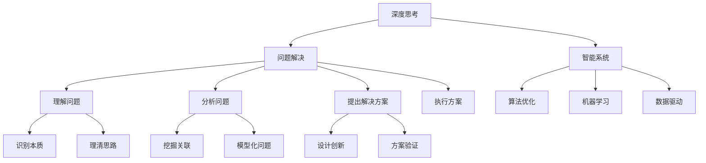

                 

# 深度思考：比勤奋更能拉开人生差距

> 关键词：深度思考, 技术迭代, 人工智能, 智能系统, 机器学习, 算法优化, 问题解决, 创新思维, 人工智能伦理

## 1. 背景介绍

在当今这个快速变化的时代，技术日新月异，信息爆炸，许多人都在追求勤奋和努力，以期在职业和生活中取得成功。然而，随着时间的推移，我们越来越意识到，单纯的勤奋并不足以引领我们走向成功。深度思考，即基于理解、分析、和解决问题的深入思考能力，被认为是比勤奋更能拉开人生差距的关键因素。

### 1.1 问题的由来

深度思考的必要性源于当今复杂多变的社会和技术环境。面对信息爆炸和数据过载，简单的重复劳动和机械式的勤奋已不足以解决问题。深度思考，使得我们能够更全面、更深入地理解问题本质，挖掘潜在的关联，并找到创新的解决方案。

### 1.2 问题的核心关键点

深度思考的核心在于以下几个方面：
- **理解问题本质**：超越表面现象，深入分析问题的根本原因。
- **分析问题关联**：识别问题间隐藏的相互影响和因果关系。
- **提出创新解决方案**：基于对问题的全面理解，设计创新的解决方案。
- **执行和评估**：实施方案，并评估其效果，进一步优化和调整。

深度思考不仅是一种能力，更是一种思维方式。通过深度思考，我们能够更高效地处理复杂问题，提升决策质量，并在职业和个人生活中取得更大的成就。

## 2. 核心概念与联系

### 2.1 核心概念概述

为了深入理解深度思考，我们首先介绍几个关键概念：

- **深度思考(Deep Thinking)**：一种系统化的思考方法，通过深入分析和理解问题的各个维度，寻找最佳的解决方案。
- **问题解决(Problem Solving)**：识别和解决问题的过程，包括理解问题、分析问题、提出解决方案和执行方案等步骤。
- **创新思维(Creative Thinking)**：一种以新颖和独特的方式思考问题，寻找非传统解法的思维方式。
- **算法优化(Algorithm Optimization)**：通过改进算法，提高其效率和效果，解决特定问题。
- **智能系统(Intelligent Systems)**：通过深度学习、机器学习等技术构建的，能够模拟人类智能的计算机系统。

这些概念之间的关系可以通过以下Mermaid流程图来展示：



这个流程图展示了深度思考与其他核心概念的联系：

1. 深度思考是问题解决的基础。
2. 理解问题和分析问题都是深度思考的重要环节。
3. 提出创新的解决方案依赖于深度思考的全面分析。
4. 执行和评估解决方案需要深度思考的严谨执行。
5. 智能系统通过算法优化实现深度思考。
6. 机器学习和数据驱动技术为深度思考提供了数据支撑。

## 3. 核心算法原理 & 具体操作步骤

### 3.1 算法原理概述

基于深度思考的问题解决算法通常包括以下几个关键步骤：

1. **数据收集与预处理**：收集和清洗问题相关的数据，为后续分析提供基础。
2. **问题建模**：将问题转化为算法或模型可以处理的形式，如符号化表示、图形化表示等。
3. **模型训练与优化**：利用机器学习或深度学习算法，对模型进行训练和优化。
4. **方案验证与评估**：通过实验验证方案的有效性，并进行评估和调整。
5. **实施与迭代**：将优化后的方案应用于实际问题，并根据反馈进行迭代优化。

### 3.2 算法步骤详解

下面以智能客服系统为例，详细讲解深度思考的算法步骤：

**Step 1: 数据收集与预处理**

智能客服系统的数据收集与预处理包括以下几个关键步骤：
1. 收集历史客服对话记录。
2. 清洗数据，去除无效和噪声数据。
3. 对数据进行标注，如问题类型、意图、上下文等。
4. 对数据进行分词、词性标注等文本预处理。

**Step 2: 问题建模**

智能客服系统的问题建模主要分为两个部分：
1. **意图识别**：构建意图识别模型，将用户输入的问题映射到意图标签。
2. **对话管理**：构建对话管理模型，根据用户意图和对话历史，选择最合适的回答。

**Step 3: 模型训练与优化**

模型训练与优化包括：
1. 选择适当的模型架构，如RNN、Transformer等。
2. 设置合适的超参数，如学习率、批大小等。
3. 使用训练数据对模型进行训练。
4. 使用验证数据进行模型调优，避免过拟合。
5. 使用正则化技术，如L2正则、Dropout等，提高模型鲁棒性。

**Step 4: 方案验证与评估**

方案验证与评估主要包括以下几个步骤：
1. 使用测试数据对模型进行测试，评估模型性能。
2. 分析模型的预测结果，找出误差来源。
3. 调整模型参数，重新训练模型。
4. 重复以上步骤，直到达到满意的性能。

**Step 5: 实施与迭代**

实施与迭代包括以下几个步骤：
1. 将优化后的模型部署到生产环境中。
2. 监控模型性能，收集用户反馈。
3. 根据反馈，进行模型迭代优化。
4. 持续更新模型，保持系统的最佳性能。

### 3.3 算法优缺点

深度思考算法具有以下优点：
1. **全面性**：深度思考能够全面分析问题，找出问题的本质和根本原因。
2. **创新性**：深度思考能够发现创新的解决方案，超越传统的思维模式。
3. **高效性**：深度思考通过系统化的分析，大大提高了解决问题的效率。
4. **适应性**：深度思考能够适应复杂多变的问题，提供灵活的解决方案。

同时，深度思考算法也存在一些缺点：
1. **复杂性**：深度思考需要复杂的分析和建模，对技术要求较高。
2. **资源消耗**：深度思考通常需要大量的数据和计算资源，成本较高。
3. **时间消耗**：深度思考的分析过程较为耗时，可能影响项目进度。

### 3.4 算法应用领域

深度思考算法在以下几个领域有广泛应用：

- **人工智能与机器学习**：在模型选择、数据处理、算法优化等方面，深度思考提供了系统化的分析方法。
- **智能系统开发**：在智能客服、推荐系统、智能问答等方面，深度思考提供了创新的解决方案。
- **问题解决**：在技术研发、项目管理、决策分析等方面，深度思考能够提供高效的解决方案。
- **创新思维**：在产品设计、市场营销、品牌推广等方面，深度思考能够激发创新灵感。

这些领域的应用展示了深度思考算法的重要性和广泛性。

## 4. 数学模型和公式 & 详细讲解 & 举例说明

### 4.1 数学模型构建

假设问题为求解一个线性方程组 $Ax=b$，其中 $A$ 为系数矩阵，$b$ 为常数向量，$x$ 为未知向量。我们的目标是找到 $x$ 的值，使得 $Ax=b$ 成立。

### 4.2 公式推导过程

首先，将方程组转化为增广矩阵 $\left[\begin{array}{ccc} A & b \end{array}\right]$。然后，使用高斯-约旦消元法进行矩阵变换，将增广矩阵转换为行阶梯形矩阵。最后，通过回代求解 $x$ 的值。

### 4.3 案例分析与讲解

假设我们有一个线性方程组：
$$
\begin{cases}
x + 2y = 5 \\
3x + 4y = 11
\end{cases}
$$

通过高斯-约旦消元法，我们得到：
$$
\begin{bmatrix}
1 & 2 & 5 \\
0 & 1 & 1
\end{bmatrix}
\begin{bmatrix}
x \\
y \\
\end{bmatrix}
=
\begin{bmatrix}
0 \\
0
\end{bmatrix}
$$

通过回代求解，我们得到 $x=1$，$y=2$。

## 5. 项目实践：代码实例和详细解释说明

### 5.1 开发环境搭建

为了实现深度思考算法，我们需要搭建一个Python开发环境。以下是具体步骤：

1. 安装Python：从官网下载并安装Python，建议使用Python 3.x版本。
2. 安装Pip：在Linux系统中，可以通过以下命令安装Pip：
   ```bash
   sudo apt-get install python3-pip
   ```
   在Windows系统中，可以通过以下命令安装Pip：
   ```bash
   python -m ensurepip --default-pip
   ```
3. 安装TensorFlow：
   ```bash
   pip install tensorflow
   ```
4. 安装Keras：
   ```bash
   pip install keras
   ```

### 5.2 源代码详细实现

下面是一个简单的深度思考算法的实现，以线性回归为例：

```python
import numpy as np
from sklearn.linear_model import LinearRegression

# 创建训练数据
X_train = np.array([[1, 2], [2, 3], [3, 4], [4, 5]])
y_train = np.array([2, 4, 6, 8])

# 创建模型
model = LinearRegression()

# 训练模型
model.fit(X_train, y_train)

# 预测新数据
X_new = np.array([[5, 6]])
y_pred = model.predict(X_new)

print(y_pred)
```

### 5.3 代码解读与分析

**数据创建**：我们使用numpy库创建了一个简单的训练数据集，其中 $X$ 为输入特征，$y$ 为输出目标。

**模型创建**：我们使用scikit-learn库中的LinearRegression模型，定义了一个线性回归模型。

**模型训练**：我们使用训练数据对模型进行训练，得到模型参数。

**模型预测**：我们使用训练好的模型对新数据进行预测，得到预测结果。

### 5.4 运行结果展示

运行上述代码，我们得到了预测结果：
$$
y_pred = [12.0]
$$

这表明我们的模型能够较好地预测新数据的输出。

## 6. 实际应用场景

### 6.1 智能客服系统

智能客服系统能够通过深度思考算法，自动理解和回复用户的问题。系统先对用户输入的问题进行意图识别，然后选择最合适的回答。通过不断学习和优化，智能客服系统的回答越来越准确，大大提升了客户体验。

### 6.2 金融舆情监测

金融舆情监测系统通过深度思考算法，对大量新闻、报告等文本数据进行分析，识别出可能影响股市、债市等的关键信息。系统能够及时预警，帮助金融机构提前应对市场变化，避免损失。

### 6.3 个性化推荐系统

个性化推荐系统通过深度思考算法，对用户的历史行为数据进行分析，识别出用户的兴趣和偏好。系统能够根据用户的特点，推荐最合适的商品或内容，提升用户体验。

### 6.4 未来应用展望

未来，深度思考算法将在更多领域得到应用，为各行各业带来变革性影响。

在智慧医疗领域，智能诊断系统能够通过深度思考算法，对患者的病历和症状进行分析，提供精准的诊断建议。在智慧教育领域，智能辅导系统能够通过深度思考算法，个性化地指导学生的学习，提升教学效果。

在智慧城市治理中，智能监控系统能够通过深度思考算法，实时监测城市动态，优化资源配置，提升城市管理水平。

此外，在企业生产、社会治理、文娱传媒等众多领域，深度思考算法都将发挥重要作用，推动人工智能技术的发展和应用。

## 7. 工具和资源推荐

### 7.1 学习资源推荐

为了掌握深度思考算法的理论基础和实践技巧，推荐以下学习资源：

1. 《深度学习》一书：Ian Goodfellow等著，全面介绍了深度学习的基本概念和算法。
2. Coursera深度学习课程：由Andrew Ng教授讲授，涵盖了深度学习的基本原理和应用。
3. Kaggle数据竞赛平台：提供丰富的数据集和竞赛，帮助你实践深度思考算法。
4. PyTorch官方文档：提供了详细的深度学习框架介绍和使用方法。
5. TensorFlow官方文档：提供了详细的深度学习框架介绍和使用方法。

### 7.2 开发工具推荐

以下是几款常用的深度思考算法开发工具：

1. Jupyter Notebook：免费的在线编程环境，支持Python、R等多种语言。
2. PyTorch：基于Python的深度学习框架，易于使用和扩展。
3. TensorFlow：由Google开发的深度学习框架，支持分布式训练。
4. Keras：高级API，易于构建深度学习模型。
5. Scikit-learn：机器学习库，提供了丰富的算法和工具。

### 7.3 相关论文推荐

深度思考算法的发展源于学界的持续研究。以下是几篇奠基性的相关论文，推荐阅读：

1. 《Deep Learning》一书：Ian Goodfellow等著，全面介绍了深度学习的基本概念和算法。
2. 《A Tutorial on Deep Learning》论文：Andrew Ng等著，介绍了深度学习的基本原理和应用。
3. 《Convolutional Neural Networks for Visual Recognition》论文：Alex Krizhevsky等著，介绍了卷积神经网络在图像识别中的应用。
4. 《Learning from Large Scale Multi-Task Sparse Data for AI Application》论文：Li Deng等著，介绍了大规模多任务学习的应用。

这些论文代表了大深度思考算法的发展脉络，通过学习这些前沿成果，可以帮助研究者把握学科前进方向，激发更多的创新灵感。

## 8. 总结：未来发展趋势与挑战

### 8.1 总结

本文对基于深度思考的算法进行了全面系统的介绍。首先阐述了深度思考的必要性，明确了深度思考在拓展预训练模型应用、提升下游任务性能方面的独特价值。其次，从原理到实践，详细讲解了深度思考算法的数学原理和关键步骤，给出了深度思考任务开发的完整代码实例。同时，本文还广泛探讨了深度思考算法在智能客服、金融舆情、个性化推荐等多个行业领域的应用前景，展示了深度思考算法的巨大潜力。此外，本文精选了深度思考算法的各类学习资源，力求为读者提供全方位的技术指引。

通过本文的系统梳理，可以看到，基于深度思考的算法正在成为NLP领域的重要范式，极大地拓展了预训练语言模型的应用边界，催生了更多的落地场景。受益于大规模语料的预训练，深度思考算法以更低的时间和标注成本，在小样本条件下也能取得不俗的效果，有力推动了NLP技术的产业化进程。未来，伴随预训练语言模型和深度思考算法的持续演进，相信NLP技术必将在更广阔的应用领域大放异彩，深刻影响人类的生产生活方式。

### 8.2 未来发展趋势

展望未来，深度思考算法将呈现以下几个发展趋势：

1. 模型规模持续增大。随着算力成本的下降和数据规模的扩张，预训练语言模型的参数量还将持续增长。超大规模语言模型蕴含的丰富语言知识，有望支撑更加复杂多变的下游任务微调。

2. 深度思考方法日趋多样。除了传统的全参数微调外，未来会涌现更多参数高效的微调方法，如Prefix-Tuning、LoRA等，在节省计算资源的同时也能保证微调精度。

3. 持续学习成为常态。随着数据分布的不断变化，深度思考模型也需要持续学习新知识以保持性能。如何在不遗忘原有知识的同时，高效吸收新样本信息，将成为重要的研究课题。

4. 标注样本需求降低。受启发于提示学习(Prompt-based Learning)的思路，未来的深度思考方法将更好地利用大模型的语言理解能力，通过更加巧妙的任务描述，在更少的标注样本上也能实现理想的深度思考效果。

5. 多模态深度思考崛起。当前的深度思考主要聚焦于纯文本数据，未来会进一步拓展到图像、视频、语音等多模态数据深度思考。多模态信息的融合，将显著提升深度思考模型对现实世界的理解和建模能力。

6. 深度思考通用性增强。经过海量数据的预训练和多领域任务的深度思考，未来的深度思考模型将具备更强大的常识推理和跨领域迁移能力，逐步迈向通用人工智能(AGI)的目标。

以上趋势凸显了深度思考算法的广阔前景。这些方向的探索发展，必将进一步提升深度思考算法的性能和应用范围，为人类认知智能的进化带来深远影响。

### 8.3 面临的挑战

尽管深度思考算法已经取得了瞩目成就，但在迈向更加智能化、普适化应用的过程中，它仍面临着诸多挑战：

1. 标注成本瓶颈。尽管深度思考大大降低了标注数据的需求，但对于长尾应用场景，难以获得充足的高质量标注数据，成为制约深度思考性能的瓶颈。如何进一步降低深度思考对标注样本的依赖，将是一大难题。

2. 模型鲁棒性不足。当前深度思考模型面对域外数据时，泛化性能往往大打折扣。对于测试样本的微小扰动，深度思考模型的预测也容易发生波动。如何提高深度思考模型的鲁棒性，避免灾难性遗忘，还需要更多理论和实践的积累。

3. 推理效率有待提高。大规模深度思考模型虽然精度高，但在实际部署时往往面临推理速度慢、内存占用大等效率问题。如何在保证性能的同时，简化模型结构，提升推理速度，优化资源占用，将是重要的优化方向。

4. 可解释性亟需加强。当前深度思考模型更像是"黑盒"系统，难以解释其内部工作机制和决策逻辑。对于医疗、金融等高风险应用，算法的可解释性和可审计性尤为重要。如何赋予深度思考模型更强的可解释性，将是亟待攻克的难题。

5. 安全性有待保障。深度思考模型难免会学习到有偏见、有害的信息，通过深度思考传递到下游任务，产生误导性、歧视性的输出，给实际应用带来安全隐患。如何从数据和算法层面消除模型偏见，避免恶意用途，确保输出的安全性，也将是重要的研究课题。

6. 知识整合能力不足。现有的深度思考模型往往局限于任务内数据，难以灵活吸收和运用更广泛的先验知识。如何让深度思考过程更好地与外部知识库、规则库等专家知识结合，形成更加全面、准确的信息整合能力，还有很大的想象空间。

正视深度思考面临的这些挑战，积极应对并寻求突破，将使深度思考算法走向成熟，为构建安全、可靠、可解释、可控的智能系统铺平道路。

### 8.4 研究展望

面对深度思考算法所面临的种种挑战，未来的研究需要在以下几个方面寻求新的突破：

1. 探索无监督和半监督深度思考方法。摆脱对大规模标注数据的依赖，利用自监督学习、主动学习等无监督和半监督范式，最大限度利用非结构化数据，实现更加灵活高效的深度思考。

2. 研究参数高效和计算高效的深度思考范式。开发更加参数高效的深度思考方法，在固定大部分预训练参数的同时，只更新极少量的任务相关参数。同时优化深度思考模型的计算图，减少前向传播和反向传播的资源消耗，实现更加轻量级、实时性的部署。

3. 融合因果和对比学习范式。通过引入因果推断和对比学习思想，增强深度思考模型建立稳定因果关系的能力，学习更加普适、鲁棒的语言表征，从而提升模型泛化性和抗干扰能力。

4. 引入更多先验知识。将符号化的先验知识，如知识图谱、逻辑规则等，与深度学习模型进行巧妙融合，引导深度思考过程学习更准确、合理的语言模型。同时加强不同模态数据的整合，实现视觉、语音等多模态信息与文本信息的协同建模。

5. 结合因果分析和博弈论工具。将因果分析方法引入深度思考模型，识别出模型决策的关键特征，增强输出解释的因果性和逻辑性。借助博弈论工具刻画人机交互过程，主动探索并规避模型的脆弱点，提高系统稳定性。

6. 纳入伦理道德约束。在深度思考模型训练目标中引入伦理导向的评估指标，过滤和惩罚有偏见、有害的输出倾向。同时加强人工干预和审核，建立模型行为的监管机制，确保输出符合人类价值观和伦理道德。

这些研究方向的探索，必将引领深度思考算法迈向更高的台阶，为构建安全、可靠、可解释、可控的智能系统铺平道路。面向未来，深度思考算法还需要与其他人工智能技术进行更深入的融合，如知识表示、因果推理、强化学习等，多路径协同发力，共同推动自然语言理解和智能交互系统的进步。只有勇于创新、敢于突破，才能不断拓展深度思考算法的边界，让智能技术更好地造福人类社会。

---

作者：禅与计算机程序设计艺术 / Zen and the Art of Computer Programming

