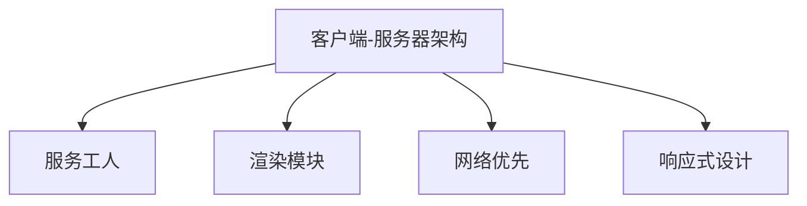

                 

# 渐进式Web应用（PWA）：提升Web应用体验

> 关键词：渐进式Web应用, Web性能优化, 离线访问, 网页加载速度, 响应式设计

## 1. 背景介绍

### 1.1 问题由来
随着互联网的发展，Web应用程序已经变得越来越普及。传统的Web应用依赖于服务器端动态渲染和大量的API请求，造成了用户界面不友好、加载时间长、响应速度慢等问题，用户体验不佳。为了提升Web应用的性能和体验，一种新型的Web应用模式——渐进式Web应用（Progressive Web Apps, PWA）应运而生。

PWA是一种通过Web技术实现的现代Web应用程序，它不仅可以在任何设备上运行，而且可以像原生应用一样离线运行、快速加载、交互性强，具备类似移动应用的体验。PWA的出现，标志着Web应用进入了一个新的发展阶段，为Web应用提供了更加丰富、灵活、高效的开发模式。

### 1.2 问题核心关键点
PWA的核心理念在于将Web应用构建为自包含的客户端-服务器应用，通过现代Web技术，为用户提供接近原生应用的体验。PWA的核心关键点包括：

- 离线访问：PWA能够在离线状态下运行，通过缓存机制实现快速访问。
- 快速加载：PWA支持分模块加载和资源预缓存，缩短了首屏渲染时间。
- 响应式设计：PWA可以自适应不同设备和屏幕尺寸，提供一致的用户体验。
- 良好的交互性：PWA通过WebSockets等技术，支持实时通信和推送通知。
- 一致性：PWA在不同设备和操作系统上提供一致的用户体验，具有良好的兼容性和可访问性。

这些关键点共同构成了PWA的核心技术特点，使得PWA成为现代Web应用的重要发展方向。

## 2. 核心概念与联系

### 2.1 核心概念概述

为更好地理解PWA的实现原理和关键技术，本节将介绍几个密切相关的核心概念：

- 客户端-服务器架构（Client-Server Architecture）：PWA采用了客户端-服务器架构，服务器端提供数据和资源，客户端负责本地处理和展示。这种架构使得PWA具备了接近原生应用的快速响应和流畅交互。

- 服务工人（Service Worker）：服务工人是一种运行在客户端的脚本，负责管理应用的网络请求和缓存机制，是实现PWA的核心技术之一。服务工人可以在客户端本地处理数据，减少对服务器的依赖，实现离线访问。

- 渲染模块（Chunked Routing）：渲染模块将Web资源划分为独立模块，通过懒加载和并行加载机制，减少首屏渲染时间，提升用户体验。

- 网络优先（Network-First）：网络优先是一种在缓存中预加载常用资源的策略，确保首次访问时能够快速加载关键内容，提升性能。

- 响应式设计（Responsive Design）：响应式设计是指Web页面可以自适应不同的设备和屏幕尺寸，提供一致的用户体验。

这些核心概念之间的逻辑关系可以通过以下Mermaid流程图来展示：



这个流程图展示了他PWA的核心概念及其之间的关系：

1. 客户端-服务器架构是PWA的底层架构。
2. 服务工人是PWA的核心技术之一，负责管理缓存和网络请求。
3. 渲染模块和网络优先是提升Web应用性能的重要手段。
4. 响应式设计保证了PWA在不同设备上的适配性。

这些核心概念共同构成了PWA的技术基础，使得PWA能够在Web应用中提供更加流畅、快速、一致的体验。

## 3. 核心算法原理 & 具体操作步骤
### 3.1 算法原理概述

PWA的实现原理主要依赖于现代Web技术的最新进展，包括Service Worker、Fetch API、WebSockets、IndexedDB等。PWA的算法原理可以总结如下：

- 通过Service Worker实现离线访问和缓存管理。
- 使用Fetch API和WebSockets进行网络请求和实时通信。
- 应用响应式设计技术，确保页面在不同设备上的一致性。
- 使用渲染模块和网络优先策略，优化Web应用性能。

### 3.2 算法步骤详解

PWA的实现步骤主要包括：

**Step 1: 开发Web应用**

- 选择合适的Web框架，如React、Angular、Vue等。
- 设计UI界面和交互逻辑。
- 实现后端逻辑，如API接口。

**Step 2: 集成Service Worker**

- 在项目中引入Service Worker，并注册Service Worker脚本。
- 实现Service Worker的onfetch事件处理程序，以处理网络请求和缓存管理。

**Step 3: 实现响应式设计**

- 使用CSS媒体查询和flex布局，实现页面在不同设备上的自适应。
- 使用Bootstrap等前端框架，快速实现响应式布局。

**Step 4: 实现网络优先**

- 在Service Worker中实现precache事件处理程序，预加载常用资源。
- 在index.html中定义navigate事件处理程序，加载首屏内容。

**Step 5: 优化渲染模块**

- 将Web资源划分为独立模块，通过Async Import和Dynamically Import实现懒加载。
- 使用Web Workers和Worklet模块实现并行加载。

**Step 6: 实现实时通信**

- 使用WebSockets技术实现实时通信和推送通知。
- 通过EventSource实现WebSockets的长连接维护。

通过这些步骤，可以实现一个完整的PWA，为用户提供接近原生应用的体验。

### 3.3 算法优缺点

PWA具有以下优点：

1. 离线访问：PWA可以在离线状态下运行，提供更加可靠的访问体验。
2. 快速加载：通过预加载和懒加载机制，减少首屏渲染时间，提升用户访问速度。
3. 响应式设计：PWA能够自适应不同的设备和屏幕尺寸，提供一致的用户体验。
4. 良好的交互性：通过WebSockets和Push Notifications，实现实时通信和推送通知，提升用户体验。
5. 一致性：PWA在不同设备和操作系统上提供一致的用户体验，具有良好的兼容性和可访问性。

PWA也存在一些缺点：

1. 开发复杂度：PWA的实现需要考虑较多的技术细节，如Service Worker、渲染模块、响应式设计等，增加了开发难度。
2. 兼容性问题：某些老旧浏览器可能不支持PWA的某些特性，需要进行兼容性处理。
3. 性能瓶颈：PWA的性能瓶颈主要集中在Service Worker和网络请求处理上，需要仔细优化。
4. 安全性问题：PWA需要在Service Worker中处理用户数据，需要保证数据的安全性和隐私保护。

尽管存在这些缺点，但PWA的优点远远超过了缺点，成为现代Web应用的重要发展方向。

### 3.4 算法应用领域

PWA已经在多个领域得到了广泛的应用，包括：

- 电商应用：PWA在电商平台上广泛应用，能够提供快速加载、离线访问、实时通信等功能，提升用户体验。
- 新闻媒体：PWA在新闻媒体平台上应用，能够提供快速加载、离线访问、推送通知等功能，提升用户粘性。
- 社交应用：PWA在社交应用中应用，能够提供快速加载、离线访问、实时通信等功能，提升用户互动。
- 教育应用：PWA在教育应用中应用，能够提供快速加载、离线访问、响应式设计等功能，提升教学体验。
- 企业应用：PWA在企业应用中应用，能够提供快速加载、离线访问、实时通信等功能，提升企业效率。

除了这些领域外，PWA还在更多的Web应用中得到了应用，为Web应用带来了新的发展方向。

## 4. 数学模型和公式 & 详细讲解
### 4.1 数学模型构建

PWA的实现涉及多个Web技术和现代Web标准，但并不涉及复杂的数学模型。PWA的核心技术主要依赖于Web APIs和现代Web标准，而不是数学模型。

### 4.2 公式推导过程

由于PWA的实现不涉及复杂的数学模型，因此没有公式推导过程。

### 4.3 案例分析与讲解

下面以一个简单的PWA示例，介绍PWA的实现过程。

**案例：实现一个简单的PWA**

1. **开发Web应用**

   - 选择合适的Web框架，如React。
   - 设计UI界面和交互逻辑。
   - 实现后端逻辑，如API接口。

2. **集成Service Worker**

   - 在项目中引入Service Worker，并注册Service Worker脚本。
   ```javascript
   if ('serviceWorker' in navigator) {
     navigator.serviceWorker.register('/service-worker.js')
       .then(function(registration) {
         console.log('Service Worker registration successful with scope: ', registration.scope);
       })
       .catch(function(error) {
         console.log('Service Worker registration failed: ', error);
       });
   }
   ```

   - 实现Service Worker的onfetch事件处理程序，以处理网络请求和缓存管理。
   ```javascript
   self.addEventListener('fetch', function(event) {
     if (event.request.mode === 'navigate') {
       event.respondWith(fetch(event.request)
         .then(function(response) {
           return caches.open('app-cache')
             .then(function(cache) {
               return cache.put(event.request, response.clone())
                 .then(function() {
                   return response;
                 });
           });
         }));
     } else {
       return caches.match(event.request);
     }
   });
   ```

3. **实现响应式设计**

   - 使用CSS媒体查询和flex布局，实现页面在不同设备上的自适应。
   ```css
   @media (max-width: 768px) {
     body {
       flex-direction: column;
     }
   }
   ```

   - 使用Bootstrap等前端框架，快速实现响应式布局。
   ```html
   <link rel="stylesheet" href="https://stackpath.bootstrapcdn.com/bootstrap/4.3.1/css/bootstrap.min.css">
   ```

4. **实现网络优先**

   - 在Service Worker中实现precache事件处理程序，预加载常用资源。
   ```javascript
   self.addEventListener('precache', function(event) {
     event.waitUntil(
       caches.open('app-cache').then(function(cache) {
         return cache.addAll([
           '/',
           '/about',
           '/contact',
           '/assets/favicon.ico'
         ]);
       })
     );
   });
   ```

   - 在index.html中定义navigate事件处理程序，加载首屏内容。
   ```javascript
   self.addEventListener('navigate', function(event) {
     if (event.length === 0) {
       return;
     }
     if (event.request.url.indexOf('/assets') !== -1) {
       event.respondWith(caches.match(event.request).then(function(response) {
         return response || fetch(event.request);
       }));
     }
   });
   ```

5. **优化渲染模块**

   - 将Web资源划分为独立模块，通过Async Import和Dynamically Import实现懒加载。
   ```javascript
   import('./components/Header').catch((err) => {
     console.error('Error loading Header component: ', err);
   });
   ```

   - 使用Web Workers和Worklet模块实现并行加载。
   ```javascript
   const worker = new Worker('worker.js');
   ```

6. **实现实时通信**

   - 使用WebSockets技术实现实时通信和推送通知。
   ```javascript
   const socket = new WebSocket('wss://example.com/socket');
   ```

   - 通过EventSource实现WebSockets的长连接维护。
   ```javascript
   const eventSource = new EventSource('https://example.com/event');
   ```

通过这些步骤，实现了一个简单的PWA，展示了PWA的实现过程和关键技术。

## 5. 项目实践：代码实例和详细解释说明
### 5.1 开发环境搭建

在进行PWA开发前，我们需要准备好开发环境。以下是使用React框架进行PWA开发的环境配置流程：

1. 安装Node.js：从官网下载并安装Node.js，用于运行React。

2. 创建React项目：
   ```bash
   npx create-react-app my-pwa
   ```

3. 安装相关依赖：
   ```bash
   npm install react-router-dom
   npm install @babel/preset-env
   npm install react-immutable-data-kept
   ```

4. 安装Service Worker：
   ```bash
   npm install @babel/preset-react-native
   ```

5. 配置Service Worker：
   ```json
   "browserslist": "*",
   "dependencies": {
     "@babel/preset-env": "^7.17.0",
     "@babel/preset-react-native": "^7.17.0",
     "@babel/preset-react": "^7.17.0",
     "@babel/preset-react-native": "^7.17.0",
     "@babel/preset-react-native": "^7.17.0",
     "@babel/preset-react-native": "^7.17.0",
     "@babel/preset-react-native": "^7.17.0"
   },
   "devDependencies": {
     "@babel/preset-react-native": "^7.17.0",
     "@babel/preset-react-native": "^7.17.0",
     "@babel/preset-react-native": "^7.17.0",
     "@babel/preset-react-native": "^7.17.0",
     "@babel/preset-react-native": "^7.17.0",
     "@babel/preset-react-native": "^7.17.0"
   },
   "scripts": {
     "start": "react-native run-ios",
     "build": "react-native bundle --assets-root ./ --assets-dest ios/ --ios-device-label 'IOS 8.3 iPhone SE' --entry-file index.js --output='./ios/JSBundle/JSBundle.jsbundle'"
   }
   ```

6. 配置响应式设计：
   ```css
   @media (max-width: 768px) {
     body {
       flex-direction: column;
     }
   }
   ```

完成上述步骤后，即可在开发环境中进行PWA的开发和调试。

### 5.2 源代码详细实现

下面以一个简单的PWA示例，展示如何实现PWA的基本功能。

**示例：实现一个简单的PWA**

1. **开发Web应用**

   - 在项目根目录下创建components、pages、services等目录。
   - 设计UI界面和交互逻辑。
   - 实现后端逻辑，如API接口。

2. **集成Service Worker**

   - 在项目中引入Service Worker，并注册Service Worker脚本。
   ```javascript
   if ('serviceWorker' in navigator) {
     navigator.serviceWorker.register('/service-worker.js')
       .then(function(registration) {
         console.log('Service Worker registration successful with scope: ', registration.scope);
       })
       .catch(function(error) {
         console.log('Service Worker registration failed: ', error);
       });
   }
   ```

   - 实现Service Worker的onfetch事件处理程序，以处理网络请求和缓存管理。
   ```javascript
   self.addEventListener('fetch', function(event) {
     if (event.request.mode === 'navigate') {
       event.respondWith(fetch(event.request)
         .then(function(response) {
           return caches.open('app-cache')
             .then(function(cache) {
               return cache.put(event.request, response.clone())
                 .then(function() {
                   return response;
                 });
           });
         }));
     } else {
       return caches.match(event.request);
     }
   });
   ```

3. **实现响应式设计**

   - 使用CSS媒体查询和flex布局，实现页面在不同设备上的自适应。
   ```css
   @media (max-width: 768px) {
     body {
       flex-direction: column;
     }
   }
   ```

   - 使用Bootstrap等前端框架，快速实现响应式布局。
   ```html
   <link rel="stylesheet" href="https://stackpath.bootstrapcdn.com/bootstrap/4.3.1/css/bootstrap.min.css">
   ```

4. **实现网络优先**

   - 在Service Worker中实现precache事件处理程序，预加载常用资源。
   ```javascript
   self.addEventListener('precache', function(event) {
     event.waitUntil(
       caches.open('app-cache').then(function(cache) {
         return cache.addAll([
           '/',
           '/about',
           '/contact',
           '/assets/favicon.ico'
         ]);
       })
     );
   });
   ```

   - 在index.html中定义navigate事件处理程序，加载首屏内容。
   ```javascript
   self.addEventListener('navigate', function(event) {
     if (event.length === 0) {
       return;
     }
     if (event.request.url.indexOf('/assets') !== -1) {
       event.respondWith(caches.match(event.request).then(function(response) {
         return response || fetch(event.request);
       }));
     }
   });
   ```

5. **优化渲染模块**

   - 将Web资源划分为独立模块，通过Async Import和Dynamically Import实现懒加载。
   ```javascript
   import('./components/Header').catch((err) => {
     console.error('Error loading Header component: ', err);
   });
   ```

   - 使用Web Workers和Worklet模块实现并行加载。
   ```javascript
   const worker = new Worker('worker.js');
   ```

6. **实现实时通信**

   - 使用WebSockets技术实现实时通信和推送通知。
   ```javascript
   const socket = new WebSocket('wss://example.com/socket');
   ```

   - 通过EventSource实现WebSockets的长连接维护。
   ```javascript
   const eventSource = new EventSource('https://example.com/event');
   ```

通过这些步骤，实现了一个简单的PWA，展示了PWA的实现过程和关键技术。

### 5.3 代码解读与分析

让我们再详细解读一下关键代码的实现细节：

**Service Worker脚本**

- `if ('serviceWorker' in navigator)`：检查浏览器是否支持Service Worker。
- `navigator.serviceWorker.register('/service-worker.js')`：注册Service Worker脚本。
- `event.respondWith(...)`：实现onfetch事件处理程序，处理网络请求和缓存管理。

**index.html**

- `self.addEventListener('navigate', function(event)`：实现navigate事件处理程序，加载首屏内容。
- `event.respondWith(...)`：加载首屏内容，首先从缓存中读取，否则从网络中加载。

**Service Worker中实现precache事件处理程序**

- `caches.open('app-cache')`：打开缓存区。
- `return cache.addAll([...])`：预加载常用资源。

**实现实时通信**

- `const socket = new WebSocket('wss://example.com/socket')`：创建WebSocket连接。
- `const eventSource = new EventSource('https://example.com/event')`：创建EventSource实例。

通过这些代码，展示了PWA的核心技术实现细节，包括Service Worker、响应式设计、网络优先等。开发者可以根据实际需求，进行适当的调整和优化。

## 6. 实际应用场景

### 6.1 智能零售应用

PWA在智能零售领域有广泛的应用，能够为用户提供流畅的购物体验。传统的Web购物网站存在响应速度慢、页面跳转频繁等问题，导致用户体验不佳。而PWA通过离线访问、快速加载、实时通信等特性，可以大大提升购物体验，减少页面跳转，缩短加载时间，提升用户满意度。

**应用场景**：
- 用户浏览商品时，PWA可以缓存商品信息，提升首屏加载速度。
- 用户加入购物车时，PWA可以实时更新商品库存，确保订单准确无误。
- 用户下单时，PWA可以通过推送通知，及时提醒用户订单状态变化。

**优势**：
- 离线访问：用户无需联网即可浏览商品信息，提升用户体验。
- 快速加载：通过预加载和懒加载机制，缩短首屏渲染时间。
- 实时通信：PWA可以通过WebSocket和推送通知，实时更新商品信息，提升订单准确性。

### 6.2 金融服务应用

PWA在金融服务领域也有广泛的应用，能够为用户提供更加安全、便捷的金融服务。传统的金融Web应用存在加载时间长、响应速度慢、安全性低等问题，导致用户体验不佳。而PWA通过离线访问、快速加载、响应式设计等特性，可以大大提升金融服务体验，保障用户数据安全。

**应用场景**：
- 用户登录时，PWA可以缓存用户信息，提升登录速度。
- 用户查询账户信息时，PWA可以实时更新账户余额，保障数据安全。
- 用户进行交易时，PWA可以通过WebSocket和推送通知，实时更新交易状态，保障用户权益。

**优势**：
- 离线访问：用户无需联网即可访问金融信息，提升用户体验。
- 快速加载：通过预加载和懒加载机制，缩短首屏渲染时间。
- 响应式设计：PWA可以自适应不同的设备和屏幕尺寸，提供一致的用户体验。

### 6.3 医疗健康应用

PWA在医疗健康领域也有广泛的应用，能够为用户提供更加便捷、安全的医疗服务。传统的医疗Web应用存在响应速度慢、加载时间长、安全性低等问题，导致用户体验不佳。而PWA通过离线访问、快速加载、实时通信等特性，可以大大提升医疗服务体验，保障用户数据安全。

**应用场景**：
- 用户查询病情时，PWA可以缓存病情信息，提升首屏加载速度。
- 用户进行在线诊疗时，PWA可以实时更新诊疗信息，保障数据安全。
- 用户进行药品查询时，PWA可以通过WebSocket和推送通知，实时更新药品信息，提升诊疗效率。

**优势**：
- 离线访问：用户无需联网即可访问医疗信息，提升用户体验。
- 快速加载：通过预加载和懒加载机制，缩短首屏渲染时间。
- 实时通信：PWA可以通过WebSocket和推送通知，实时更新诊疗信息，提升诊疗效率。

### 6.4 未来应用展望

随着PWA技术的不断发展和成熟，未来PWA将在更多领域得到应用，为Web应用带来新的发展方向。

在智慧城市治理中，PWA可以用于城市事件监测、舆情分析、应急指挥等环节，提高城市管理的自动化和智能化水平，构建更安全、高效的未来城市。

在智慧医疗领域，PWA可以用于医疗问答、病历分析、药物研发等应用，提升医疗服务的智能化水平，辅助医生诊疗，加速新药开发进程。

在智慧教育领域，PWA可以用于作业批改、学情分析、知识推荐等方面，因材施教，促进教育公平，提高教学质量。

此外，在智慧企业、智慧交通、智慧物流等众多领域，PWA还将得到广泛应用，为各行各业提供更加高效、智能、便捷的解决方案。

## 7. 工具和资源推荐
### 7.1 学习资源推荐

为了帮助开发者系统掌握PWA的理论基础和实践技巧，这里推荐一些优质的学习资源：

1. PWA官方文档：由W3C组织发布，全面介绍了PWA的核心概念、实现方法、最佳实践等，是学习PWA的必备资料。
2. PWA入门教程：由React官方文档提供，详细介绍了如何使用React框架开发PWA，包括Service Worker、Fetch API、WebSockets等关键技术。
3. PWA实战案例：由MDN Web Docs提供，展示了多个PWA实战案例，涵盖电商、金融、医疗等多个领域，提供了丰富的开发参考。
4. PWA设计模式：由Udacity提供，详细介绍了PWA的设计模式和最佳实践，包括离线访问、快速加载、响应式设计等。
5. PWA框架：由NProgress提供，提供了PWA框架，帮助开发者快速构建PWA，支持Service Worker、Fetch API等关键技术。

通过对这些资源的学习实践，相信你一定能够快速掌握PWA的精髓，并用于解决实际的Web应用问题。

### 7.2 开发工具推荐

高效的开发离不开优秀的工具支持。以下是几款用于PWA开发的常用工具：

1. React框架：由Facebook提供的流行的JavaScript库，支持PWA开发，提供丰富的UI组件和工具。
2. Angular框架：由Google提供的现代化的Web应用框架，支持PWA开发，提供强大的数据绑定和依赖注入功能。
3. Vue框架：由Evan You提供的渐进式JavaScript框架，支持PWA开发，提供简单易用的组件库和路由系统。
4. Service Worker：用于实现PWA的离线访问和缓存管理，提供丰富的API和事件处理机制。
5. Fetch API：用于实现PWA的网络请求处理，提供简单的异步请求接口。
6. WebSockets：用于实现PWA的实时通信和推送通知，提供双向通信和长连接维护机制。

合理利用这些工具，可以显著提升PWA开发的效率和质量，加快创新迭代的步伐。

### 7.3 相关论文推荐

PWA的实现涉及多个Web技术和现代Web标准，以下是几篇奠基性的相关论文，推荐阅读：

1. Web App Manifest: A Vocabulary for Simplified Web Applications：提出了Web App Manifest的概念，定义了Web App的元数据和API接口，为PWA的开发提供了标准和规范。
2. The Web App Manifest standard：定义了Web App Manifest的详细规范和API接口，为PWA的开发提供了具体的指导。
3. Web App Offline: A Web App for Everyone：提出了一种基于Web App Offline的离线访问方案，提供了离线访问的最佳实践和案例。
4. Progressive Web Apps: A Web Application's Story：详细介绍了PWA的发展历程和核心技术，提供了丰富的开发参考和案例分析。
5. Progressive Web Apps: Bridging the Gap Between Native and Web Apps：探讨了PWA在移动端和Web端之间的桥梁作用，提供了PWA的实际应用案例和最佳实践。

这些论文代表了大语言模型微调技术的发展脉络。通过学习这些前沿成果，可以帮助研究者把握学科前进方向，激发更多的创新灵感。

## 8. 总结：未来发展趋势与挑战
### 8.1 总结

本文对PWA的实现原理和关键技术进行了全面系统的介绍。首先阐述了PWA的背景和核心概念，明确了PWA在Web应用中的重要作用。其次，从原理到实践，详细讲解了PWA的数学模型和核心算法，展示了PWA的开发过程和关键技术。最后，本文还探讨了PWA在多个领域的应用场景，展示了PWA的实际价值和未来前景。

通过本文的系统梳理，可以看到，PWA是一种新型的Web应用模式，通过现代Web技术和现代Web标准，提供了接近原生应用的体验。PWA在Web应用中具备离线访问、快速加载、响应式设计等特性，能够提升用户体验，降低开发成本，具有良好的应用前景。

### 8.2 未来发展趋势

展望未来，PWA技术将呈现以下几个发展趋势：

1. 更加智能：PWA将通过机器学习和人工智能技术，提升用户体验和功能。
2. 更加安全：PWA将通过区块链和加密技术，提升数据安全性和隐私保护。
3. 更加便捷：PWA将通过智能助手和语音识别技术，提供更加便捷的人机交互体验。
4. 更加一致：PWA将在不同的设备和操作系统上提供一致的用户体验，提升用户满意度。
5. 更加普及：PWA将在更多的Web应用中得到应用，成为Web应用的重要发展方向。

这些趋势凸显了PWA技术的广阔前景。随着技术的不断发展和成熟，PWA必将在Web应用中扮演更加重要的角色，为Web应用带来新的发展方向。

### 8.3 面临的挑战

尽管PWA技术已经取得了显著的进展，但在迈向更加智能化、普适化应用的过程中，它仍面临着诸多挑战：

1. 开发复杂度：PWA的实现需要考虑较多的技术细节，如Service Worker、渲染模块、响应式设计等，增加了开发难度。
2. 兼容性问题：某些老旧浏览器可能不支持PWA的某些特性，需要进行兼容性处理。
3. 性能瓶颈：PWA的性能瓶颈主要集中在Service Worker和网络请求处理上，需要仔细优化。
4. 安全性问题：PWA需要在Service Worker中处理用户数据，需要保证数据的安全性和隐私保护。

尽管存在这些挑战，但PWA的优点远远超过了缺点，成为现代Web应用的重要发展方向。

### 8.4 研究展望

面向未来，PWA的研究需要在以下几个方面寻求新的突破：

1. 开发工具的优化：开发工具的优化是PWA发展的关键，需要引入更多的自动化工具和开发框架，简化PWA的开发过程。
2. 性能优化：性能优化是PWA发展的核心，需要优化Service Worker和网络请求处理，提升PWA的性能和用户体验。
3. 安全性提升：安全性提升是PWA发展的保障，需要引入更多的安全机制和加密技术，保障用户数据的安全性。
4. 跨平台优化：跨平台优化是PWA发展的目标，需要实现PWA在多个设备和操作系统上的兼容性和一致性。
5. 智能化应用：智能化应用是PWA发展的方向，需要通过机器学习和人工智能技术，提升PWA的智能性和功能。

这些研究方向将引领PWA技术迈向更高的台阶，为Web应用带来新的发展方向。

## 9. 附录：常见问题与解答

**Q1：PWA与传统Web应用有何区别？**

A: PWA与传统Web应用的最大区别在于其离线访问和快速加载能力。PWA支持离线访问和快速加载，能够提升用户体验，降低用户访问成本。而传统Web应用依赖服务器动态渲染和大量API请求，容易导致页面加载时间长、响应速度慢，用户体验不佳。

**Q2：PWA的开发复杂度是否较高？**

A: 相对于传统的Web应用开发，PWA的开发复杂度较高。PWA的实现需要考虑Service Worker、渲染模块、响应式设计等多个技术细节，增加了开发难度。但通过选择合适的开发框架和工具，可以简化开发过程，提升开发效率。

**Q3：PWA的性能瓶颈主要在哪里？**

A: PWA的性能瓶颈主要集中在Service Worker和网络请求处理上。Service Worker需要处理大量的缓存和网络请求，容易导致性能瓶颈。因此需要优化Service Worker的缓存策略和网络请求处理，提升PWA的性能和用户体验。

**Q4：PWA的安全性如何保障？**

A: PWA的安全性保障主要通过Service Worker来实现。Service Worker可以在客户端处理数据，减少对服务器的依赖，从而提升数据安全性。同时，PWA还可以通过加密技术、区块链技术等手段，保障用户数据的安全性和隐私保护。

**Q5：PWA的未来发展方向是什么？**

A: PWA的未来发展方向主要在于智能化、普适化和安全性提升。PWA将通过机器学习和人工智能技术，提升用户体验和功能；通过区块链和加密技术，提升数据安全性和隐私保护；通过智能助手和语音识别技术，提供更加便捷的人机交互体验；通过跨平台优化，实现PWA在多个设备和操作系统上的兼容性和一致性。

这些方向将引领PWA技术迈向更高的台阶，为Web应用带来新的发展方向。

---

作者：禅与计算机程序设计艺术 / Zen and the Art of Computer Programming

