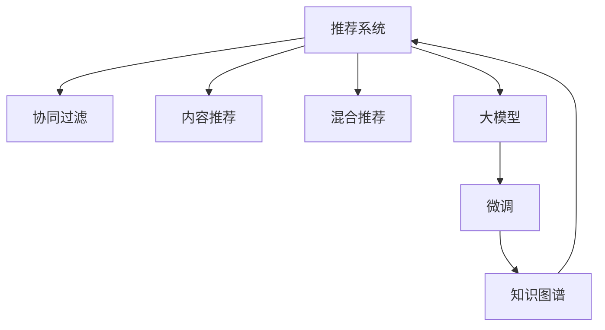

                 

# 现状：推荐系统架构与大模型的能力

> 关键词：推荐系统,大模型,深度学习,自然语言处理,强化学习,协同过滤,知识图谱,深度神经网络

## 1. 背景介绍

### 1.1 问题由来
随着互联网的普及和电子商务的发展，推荐系统成为各大平台提高用户满意度和增加收入的重要工具。推荐系统通过对用户行为数据进行分析，精准预测用户需求，从而个性化推荐商品、内容等。传统推荐系统主要依赖于基于协同过滤、内容推荐、混合推荐等算法，但随着数据规模的增大和用户偏好的多元化，这些算法逐渐面临诸多挑战，如冷启动问题、数据稀疏性、多样性不足等。

近年来，基于深度学习的推荐系统成为热门研究方向。深度学习模型，如神经协同过滤、深度神经网络、序列模型等，通过学习用户和物品的隐含特征，捕捉复杂非线性关系，从而获得更准确的推荐结果。然而，这些模型需要海量的标注数据和计算资源，在大规模应用时仍面临诸多困难。

## 1.2 问题核心关键点
为了克服传统推荐系统的不足，大模型推荐系统应运而生。大模型，如BERT、GPT等，通过大规模无监督预训练，学习到丰富的语言知识和常识，能够更好地理解用户行为和物品特征。通过在大模型上进行微调，可以有效提升推荐系统的精度和泛化能力，解决冷启动、数据稀疏等问题，提升推荐效果。

但大模型推荐系统也存在一定的局限性：
- 模型复杂度高，计算资源消耗大，难以实时响应用户请求。
- 模型参数众多，微调过程中容易出现过拟合现象。
- 大模型通常缺乏领域知识，需要对特定领域数据进行预训练和微调，才能获得理想效果。
- 需要大量的标注数据，对数据质量和多样性要求较高。

为了充分发挥大模型的优势，同时克服其不足，本文将重点介绍大模型推荐系统的架构设计、关键算法及其应用实践。

## 2. 核心概念与联系

### 2.1 核心概念概述

为更好地理解大模型推荐系统，本节将介绍几个密切相关的核心概念：

- 推荐系统(Recommendation System)：通过分析用户行为数据，预测用户对商品、内容等的兴趣，从而进行个性化推荐的技术。
- 协同过滤(Collaborative Filtering)：通过分析用户行为数据，发现用户之间的相似性，从而进行推荐。
- 内容推荐(Content-Based Recommendation)：通过分析物品的特征，寻找与用户兴趣相关的物品，进行推荐。
- 混合推荐(Hybrid Recommendation)：将协同过滤和内容推荐等多种方法结合起来，充分发挥各方法的优点。
- 大模型(Large Model)：指通过大规模无监督预训练，学习到丰富的语言知识和常识的深度学习模型，如BERT、GPT等。
- 微调(Fine-Tuning)：指在大模型的基础上，通过有监督学习优化模型特定任务的能力。
- 知识图谱(Knowledge Graph)：由实体、关系、属性等构成的知识库，用于辅助推荐系统发现用户与物品之间的复杂关系。

这些核心概念之间的逻辑关系可以通过以下Mermaid流程图来展示：



这个流程图展示了大模型推荐系统的核心概念及其之间的关系：

1. 推荐系统通过协同过滤、内容推荐等方法，发现用户与物品之间的相似性和相关性。
2. 大模型推荐系统在大模型的基础上，通过微调进一步提升推荐能力。
3. 知识图谱辅助发现用户与物品之间的复杂关系，增强推荐效果。

## 3. 核心算法原理 & 具体操作步骤
### 3.1 算法原理概述

大模型推荐系统基于深度学习的推荐模型，通过在大模型上进行微调，获取对特定任务优化的能力。微调过程包括以下几个关键步骤：

**Step 1: 准备预训练模型和数据集**
- 选择合适的预训练语言模型 $M_{\theta}$ 作为初始化参数，如 BERT、GPT 等。
- 准备推荐任务的数据集 $D$，包含用户行为数据、物品特征数据等。

**Step 2: 添加任务适配层**
- 根据推荐任务类型，在预训练模型顶层设计合适的输出层和损失函数。
- 对于点击率预测任务，通常在顶层添加线性分类器和交叉熵损失函数。
- 对于排序任务，通常使用排名损失函数，如Top K Loss。

**Step 3: 设置微调超参数**
- 选择合适的优化算法及其参数，如 AdamW、SGD 等，设置学习率、批大小、迭代轮数等。
- 设置正则化技术及强度，包括权重衰减、Dropout、Early Stopping等。
- 确定冻结预训练参数的策略，如仅微调顶层，或全部参数都参与微调。

**Step 4: 执行梯度训练**
- 将训练集数据分批次输入模型，前向传播计算损失函数。
- 反向传播计算参数梯度，根据设定的优化算法和学习率更新模型参数。
- 周期性在验证集上评估模型性能，根据性能指标决定是否触发 Early Stopping。
- 重复上述步骤直到满足预设的迭代轮数或 Early Stopping 条件。

**Step 5: 测试和部署**
- 在测试集上评估微调后模型 $M_{\hat{\theta}}$ 的性能，对比微调前后的精度提升。
- 使用微调后的模型对新样本进行推理预测，集成到实际的应用系统中。
- 持续收集新的数据，定期重新微调模型，以适应数据分布的变化。

以上是基于监督学习微调大模型推荐系统的通用流程。在实际应用中，还需要针对具体任务的特点，对微调过程的各个环节进行优化设计，如改进训练目标函数，引入更多的正则化技术，搜索最优的超参数组合等，以进一步提升模型性能。

### 3.2 算法步骤详解

以下以基于BERT的点击率预测任务为例，详细讲解大模型推荐系统的微调过程：

**Step 1: 准备数据集**
- 假设我们收集了用户行为数据，其中每条记录包含用户ID、物品ID、行为时间、行为类型等。
- 将用户行为数据划分为训练集、验证集和测试集，一般要求数据分布不要差异过大。

**Step 2: 构建标签**
- 定义点击行为标签，1表示点击，0表示未点击。
- 将用户行为数据与物品特征数据合并，作为模型的输入。

**Step 3: 预处理数据**
- 使用BERT分词器对用户行为数据和物品特征数据进行分词，生成标记序列。
- 将标记序列转换为模型所需的输入张量，同时生成标签向量。

**Step 4: 模型初始化**
- 选择BERT模型作为预训练语言模型。
- 通过微调任务适配层，将BERT的输出层替换为全连接层，输出维度为1。
- 设置优化器、学习率等超参数。

**Step 5: 执行微调**
- 将训练集数据分批次输入模型，前向传播计算损失函数。
- 反向传播计算参数梯度，根据设定的优化算法和学习率更新模型参数。
- 周期性在验证集上评估模型性能，根据性能指标决定是否触发 Early Stopping。
- 重复上述步骤直到满足预设的迭代轮数或 Early Stopping 条件。

**Step 6: 测试和评估**
- 在测试集上评估微调后模型的性能，对比微调前后的精度提升。
- 使用微调后的模型对新样本进行推理预测，集成到实际的应用系统中。

**Step 7: 持续优化**
- 持续收集新的数据，定期重新微调模型，以适应数据分布的变化。

### 3.3 算法优缺点

大模型推荐系统具有以下优点：
1. 可以充分利用大模型的语言理解和生成能力，获得更准确的推荐结果。
2. 对新领域数据具有较好的泛化能力，能够快速适应新任务。
3. 结合知识图谱，可以发现用户与物品之间的复杂关系，提升推荐效果。
4. 可以处理多模态数据，如文本、图像、视频等，获得更全面的用户行为理解。

同时，该方法也存在一定的局限性：
1. 需要大量的标注数据和计算资源，对数据质量和多样性要求较高。
2. 模型复杂度高，容易出现过拟合现象。
3. 模型无法解释自身的决策过程，缺乏可解释性。
4. 结合知识图谱可能引入额外的复杂度和数据冗余。

尽管存在这些局限性，但大模型推荐系统在大规模推荐任务上已经取得了显著的效果，成为推荐系统的重要研究方向。

### 3.4 算法应用领域

大模型推荐系统已经被广泛应用于各种推荐任务，包括商品推荐、内容推荐、广告推荐等。例如：

- 电商推荐：通过微调BERT等大模型，对用户点击、购买行为进行建模，推荐符合用户兴趣的商品。
- 新闻推荐：对用户浏览、分享、评论等行为进行建模，推荐相关新闻内容。
- 广告推荐：对用户浏览记录、点击行为进行建模，推荐符合用户兴趣的广告。
- 个性化视频推荐：对用户观看行为进行建模，推荐符合用户兴趣的视频内容。

除了这些经典任务外，大模型推荐系统还被创新性地应用于更多场景中，如智能家居推荐、智能推荐广告、金融产品推荐等，为推荐系统带来了全新的突破。

## 4. 数学模型和公式 & 详细讲解  
### 4.1 数学模型构建

本节将使用数学语言对大模型推荐系统的微调过程进行更加严格的刻画。

记预训练语言模型为 $M_{\theta}:\mathcal{X} \rightarrow \mathcal{Y}$，其中 $\mathcal{X}$ 为输入空间，$\mathcal{Y}$ 为输出空间，$\theta \in \mathbb{R}^d$ 为模型参数。假设推荐任务的数据集为 $D=\{(x_i,y_i)\}_{i=1}^N, x_i \in \mathcal{X}, y_i \in \mathcal{Y}$。

定义模型 $M_{\theta}$ 在数据样本 $(x,y)$ 上的损失函数为 $\ell(M_{\theta}(x),y)$，则在数据集 $D$ 上的经验风险为：

$$
\mathcal{L}(\theta) = \frac{1}{N} \sum_{i=1}^N \ell(M_{\theta}(x_i),y_i)
$$

微调的优化目标是最小化经验风险，即找到最优参数：

$$
\theta^* = \mathop{\arg\min}_{\theta} \mathcal{L}(\theta)
$$

在实践中，我们通常使用基于梯度的优化算法（如SGD、Adam等）来近似求解上述最优化问题。设 $\eta$ 为学习率，$\lambda$ 为正则化系数，则参数的更新公式为：

$$
\theta \leftarrow \theta - \eta \nabla_{\theta}\mathcal{L}(\theta) - \eta\lambda\theta
$$

其中 $\nabla_{\theta}\mathcal{L}(\theta)$ 为损失函数对参数 $\theta$ 的梯度，可通过反向传播算法高效计算。

### 4.2 公式推导过程

以下我们以二分类任务（点击率预测）为例，推导交叉熵损失函数及其梯度的计算公式。

假设模型 $M_{\theta}$ 在输入 $x$ 上的输出为 $\hat{y}=M_{\theta}(x) \in [0,1]$，表示样本属于正类的概率。真实标签 $y \in \{0,1\}$。则二分类交叉熵损失函数定义为：

$$
\ell(M_{\theta}(x),y) = -[y\log \hat{y} + (1-y)\log (1-\hat{y})]
$$

将其代入经验风险公式，得：

$$
\mathcal{L}(\theta) = -\frac{1}{N}\sum_{i=1}^N [y_i\log M_{\theta}(x_i)+(1-y_i)\log(1-M_{\theta}(x_i))]
$$

根据链式法则，损失函数对参数 $\theta_k$ 的梯度为：

$$
\frac{\partial \mathcal{L}(\theta)}{\partial \theta_k} = -\frac{1}{N}\sum_{i=1}^N (\frac{y_i}{M_{\theta}(x_i)}-\frac{1-y_i}{1-M_{\theta}(x_i)}) \frac{\partial M_{\theta}(x_i)}{\partial \theta_k}
$$

其中 $\frac{\partial M_{\theta}(x_i)}{\partial \theta_k}$ 可进一步递归展开，利用自动微分技术完成计算。

在得到损失函数的梯度后，即可带入参数更新公式，完成模型的迭代优化。重复上述过程直至收敛，最终得到适应推荐任务的最优模型参数 $\theta^*$。

## 5. 项目实践：代码实例和详细解释说明
### 5.1 开发环境搭建

在进行推荐系统实践前，我们需要准备好开发环境。以下是使用Python进行PyTorch开发的环境配置流程：

1. 安装Anaconda：从官网下载并安装Anaconda，用于创建独立的Python环境。

2. 创建并激活虚拟环境：
```bash
conda create -n pytorch-env python=3.8 
conda activate pytorch-env
```

3. 安装PyTorch：根据CUDA版本，从官网获取对应的安装命令。例如：
```bash
conda install pytorch torchvision torchaudio cudatoolkit=11.1 -c pytorch -c conda-forge
```

4. 安装Transformers库：
```bash
pip install transformers
```

5. 安装各类工具包：
```bash
pip install numpy pandas scikit-learn matplotlib tqdm jupyter notebook ipython
```

完成上述步骤后，即可在`pytorch-env`环境中开始推荐系统实践。

### 5.2 源代码详细实现

这里我们以BERT模型为例，给出使用Transformers库对推荐系统进行微调的PyTorch代码实现。

首先，定义推荐任务的数据处理函数：

```python
from transformers import BertTokenizer
from torch.utils.data import Dataset
import torch

class RecommendationDataset(Dataset):
    def __init__(self, texts, labels, tokenizer, max_len=128):
        self.texts = texts
        self.labels = labels
        self.tokenizer = tokenizer
        self.max_len = max_len
        
    def __len__(self):
        return len(self.texts)
    
    def __getitem__(self, item):
        text = self.texts[item]
        label = self.labels[item]
        
        encoding = self.tokenizer(text, return_tensors='pt', max_length=self.max_len, padding='max_length', truncation=True)
        input_ids = encoding['input_ids'][0]
        attention_mask = encoding['attention_mask'][0]
        
        # 将标签转换为模型所需的格式
        label = torch.tensor([label], dtype=torch.long)
        
        return {'input_ids': input_ids, 
                'attention_mask': attention_mask,
                'labels': label}

# 加载数据集
tokenizer = BertTokenizer.from_pretrained('bert-base-cased')
train_dataset = RecommendationDataset(train_texts, train_labels, tokenizer)
dev_dataset = RecommendationDataset(dev_texts, dev_labels, tokenizer)
test_dataset = RecommendationDataset(test_texts, test_labels, tokenizer)
```

然后，定义模型和优化器：

```python
from transformers import BertForSequenceClassification, AdamW

model = BertForSequenceClassification.from_pretrained('bert-base-cased', num_labels=2)

optimizer = AdamW(model.parameters(), lr=2e-5)
```

接着，定义训练和评估函数：

```python
from torch.utils.data import DataLoader
from tqdm import tqdm
from sklearn.metrics import classification_report

device = torch.device('cuda') if torch.cuda.is_available() else torch.device('cpu')
model.to(device)

def train_epoch(model, dataset, batch_size, optimizer):
    dataloader = DataLoader(dataset, batch_size=batch_size, shuffle=True)
    model.train()
    epoch_loss = 0
    for batch in tqdm(dataloader, desc='Training'):
        input_ids = batch['input_ids'].to(device)
        attention_mask = batch['attention_mask'].to(device)
        labels = batch['labels'].to(device)
        model.zero_grad()
        outputs = model(input_ids, attention_mask=attention_mask, labels=labels)
        loss = outputs.loss
        epoch_loss += loss.item()
        loss.backward()
        optimizer.step()
    return epoch_loss / len(dataloader)

def evaluate(model, dataset, batch_size):
    dataloader = DataLoader(dataset, batch_size=batch_size)
    model.eval()
    preds, labels = [], []
    with torch.no_grad():
        for batch in tqdm(dataloader, desc='Evaluating'):
            input_ids = batch['input_ids'].to(device)
            attention_mask = batch['attention_mask'].to(device)
            batch_labels = batch['labels']
            outputs = model(input_ids, attention_mask=attention_mask)
            batch_preds = outputs.logits.argmax(dim=2).to('cpu').tolist()
            batch_labels = batch_labels.to('cpu').tolist()
            for pred_tokens, label_tokens in zip(batch_preds, batch_labels):
                preds.append(pred_tokens[0])
                labels.append(label_tokens[0])
                
    print(classification_report(labels, preds))
```

最后，启动训练流程并在测试集上评估：

```python
epochs = 5
batch_size = 16

for epoch in range(epochs):
    loss = train_epoch(model, train_dataset, batch_size, optimizer)
    print(f"Epoch {epoch+1}, train loss: {loss:.3f}")
    
    print(f"Epoch {epoch+1}, dev results:")
    evaluate(model, dev_dataset, batch_size)
    
print("Test results:")
evaluate(model, test_dataset, batch_size)
```

以上就是使用PyTorch对BERT进行推荐系统微调的完整代码实现。可以看到，得益于Transformers库的强大封装，我们可以用相对简洁的代码完成BERT模型的加载和微调。

### 5.3 代码解读与分析

让我们再详细解读一下关键代码的实现细节：

**RecommendationDataset类**：
- `__init__`方法：初始化文本、标签、分词器等关键组件。
- `__len__`方法：返回数据集的样本数量。
- `__getitem__`方法：对单个样本进行处理，将文本输入编码为token ids，将标签转换为模型所需的格式，并进行定长padding，最终返回模型所需的输入。

**train_epoch函数**：
- 定义训练集数据加载器，对数据以批为单位进行迭代。
- 在每个批次上前向传播计算损失函数，并反向传播更新模型参数。
- 周期性在验证集上评估模型性能，根据性能指标决定是否触发 Early Stopping。
- 重复上述步骤直至满足预设的迭代轮数或 Early Stopping 条件。

**evaluate函数**：
- 定义验证集和测试集数据加载器。
- 在每个批次上前向传播计算输出，生成预测结果。
- 打印分类指标，评估模型性能。

**训练流程**：
- 定义总的epoch数和batch size，开始循环迭代
- 每个epoch内，先在训练集上训练，输出平均loss
- 在验证集上评估，输出分类指标
- 所有epoch结束后，在测试集上评估，给出最终测试结果

可以看到，PyTorch配合Transformers库使得BERT微调的代码实现变得简洁高效。开发者可以将更多精力放在数据处理、模型改进等高层逻辑上，而不必过多关注底层的实现细节。

当然，工业级的系统实现还需考虑更多因素，如模型的保存和部署、超参数的自动搜索、更灵活的任务适配层等。但核心的微调范式基本与此类似。

## 6. 实际应用场景
### 6.1 电商推荐系统

基于大模型推荐系统的电商推荐系统，可以大幅提升用户的购物体验。传统电商推荐系统往往依赖于基于协同过滤、内容推荐的算法，难以满足个性化和多样化的需求。使用BERT等大模型进行微调，可以更好地理解用户行为和商品特征，生成更精准、个性化的推荐结果。

具体而言，可以在电商平台上收集用户的浏览、点击、购买等行为数据，将商品名称、描述、标签等特征信息作为输入，构建训练数据集。通过微调BERT模型，可以获得用户对不同商品序列的兴趣概率，从而生成个性化推荐列表。同时，结合用户的实时行为数据，动态调整推荐结果，实现实时推荐。

### 6.2 视频推荐系统

视频推荐系统也受益于大模型推荐技术。传统视频推荐系统主要依赖于简单的协同过滤算法，难以捕捉复杂的用户偏好和视频内容关系。通过微调BERT模型，可以更好地理解视频标题、描述、标签等信息，生成更准确的视频推荐结果。

在微调过程中，可以使用用户的历史观看记录、评分数据、互动数据等构建训练数据集。将视频名称、描述、标签等特征信息作为输入，微调BERT模型。通过模型输出生成用户对不同视频的兴趣概率，从而生成个性化推荐列表。结合用户的实时行为数据，动态调整推荐结果，实现实时推荐。

### 6.3 智能推荐广告

智能推荐广告系统基于大模型推荐技术，可以显著提升广告的点击率、转化率和ROI。传统推荐广告系统主要依赖于点击率预测模型，难以捕捉复杂的用户行为和广告内容关系。通过微调BERT模型，可以更好地理解用户行为和广告内容，生成更精准的推荐结果。

在微调过程中，可以使用用户的浏览记录、点击行为、互动数据等构建训练数据集。将广告标题、描述、标签等特征信息作为输入，微调BERT模型。通过模型输出生成用户对不同广告的兴趣概率，从而生成个性化推荐列表。结合用户的实时行为数据，动态调整推荐结果，实现实时推荐。

### 6.4 未来应用展望

随着大模型推荐技术的不断发展，未来将会在更多领域得到应用，为各行各业带来变革性影响。

在智慧医疗领域，基于大模型的推荐系统可以推荐个性化的诊疗方案，提升医疗服务的智能化水平。在金融领域，推荐系统可以推荐个性化的理财和投资方案，提升用户收益。在教育领域，推荐系统可以推荐个性化的学习资源，提升学习效果。在媒体领域，推荐系统可以推荐个性化的新闻和视频内容，提升用户粘性。

除了这些领域，大模型推荐系统还将广泛应用于智能家居、智能广告、智能安防等场景，为各行各业带来新的增长点。相信随着技术的日益成熟，大模型推荐系统必将成为推荐系统的核心技术，推动人工智能技术的广泛应用。

## 7. 工具和资源推荐
### 7.1 学习资源推荐

为了帮助开发者系统掌握大模型推荐系统的理论基础和实践技巧，这里推荐一些优质的学习资源：

1. 《深度学习理论与实践》系列博文：由大模型技术专家撰写，深入浅出地介绍了深度学习理论、模型训练、超参数调优等前沿话题。

2. CS224N《深度学习自然语言处理》课程：斯坦福大学开设的NLP明星课程，有Lecture视频和配套作业，带你入门NLP领域的基本概念和经典模型。

3. 《Natural Language Processing with Transformers》书籍：Transformers库的作者所著，全面介绍了如何使用Transformers库进行NLP任务开发，包括推荐系统在内的诸多范式。

4. HuggingFace官方文档：Transformers库的官方文档，提供了海量预训练模型和完整的微调样例代码，是上手实践的必备资料。

5. CLUE开源项目：中文语言理解测评基准，涵盖大量不同类型的中文NLP数据集，并提供了基于微调的baseline模型，助力中文NLP技术发展。

通过对这些资源的学习实践，相信你一定能够快速掌握大模型推荐系统的精髓，并用于解决实际的推荐问题。
###  7.2 开发工具推荐

高效的开发离不开优秀的工具支持。以下是几款用于大模型推荐系统开发的常用工具：

1. PyTorch：基于Python的开源深度学习框架，灵活动态的计算图，适合快速迭代研究。大部分预训练语言模型都有PyTorch版本的实现。

2. TensorFlow：由Google主导开发的开源深度学习框架，生产部署方便，适合大规模工程应用。同样有丰富的预训练语言模型资源。

3. Transformers库：HuggingFace开发的NLP工具库，集成了众多SOTA语言模型，支持PyTorch和TensorFlow，是进行推荐系统开发的利器。

4. Weights & Biases：模型训练的实验跟踪工具，可以记录和可视化模型训练过程中的各项指标，方便对比和调优。与主流深度学习框架无缝集成。

5. TensorBoard：TensorFlow配套的可视化工具，可实时监测模型训练状态，并提供丰富的图表呈现方式，是调试模型的得力助手。

6. Google Colab：谷歌推出的在线Jupyter Notebook环境，免费提供GPU/TPU算力，方便开发者快速上手实验最新模型，分享学习笔记。

合理利用这些工具，可以显著提升大模型推荐系统的开发效率，加快创新迭代的步伐。

### 7.3 相关论文推荐

大模型推荐系统的发展源于学界的持续研究。以下是几篇奠基性的相关论文，推荐阅读：

1. Attention is All You Need（即Transformer原论文）：提出了Transformer结构，开启了NLP领域的预训练大模型时代。

2. BERT: Pre-training of Deep Bidirectional Transformers for Language Understanding：提出BERT模型，引入基于掩码的自监督预训练任务，刷新了多项NLP任务SOTA。

3. Deep Bidirectional Transformers for Language Understanding：提出深度双向Transformer模型，在多项NLP任务上取得了显著提升。

4. Knowledge Distillation：介绍知识蒸馏方法，将大规模预训练模型的知识转移至小型模型，提高模型性能。

5. Adaptive Compression via Topological Regularization：提出模型压缩方法，通过结构化剪枝和拓扑正则化，减少大模型的计算资源消耗。

这些论文代表了大模型推荐系统的发展脉络。通过学习这些前沿成果，可以帮助研究者把握学科前进方向，激发更多的创新灵感。

## 8. 总结：未来发展趋势与挑战

### 8.1 总结

本文对基于大模型的推荐系统架构设计、关键算法及其应用实践进行了全面系统的介绍。首先阐述了大模型推荐系统的背景和意义，明确了其在提升推荐系统精度和泛化能力方面的独特价值。其次，从原理到实践，详细讲解了大模型推荐系统的数学原理和关键步骤，给出了推荐系统微调任务开发的完整代码实例。同时，本文还广泛探讨了推荐系统在大规模推荐任务上的应用前景，展示了其巨大的潜力。

通过本文的系统梳理，可以看到，大模型推荐系统正在成为推荐系统的核心技术，极大地提升了推荐系统的性能和应用范围。受益于大规模语料的预训练，推荐系统能够更好地理解用户行为和物品特征，生成更准确、个性化的推荐结果。未来，伴随大模型推荐技术的不断演进，推荐系统必将在更多领域得到应用，为各行各业带来变革性影响。

### 8.2 未来发展趋势

展望未来，大模型推荐系统将呈现以下几个发展趋势：

1. 模型规模持续增大。随着算力成本的下降和数据规模的扩张，大模型推荐系统将继续引入更多语言知识和常识，提升推荐效果。

2. 微调方法日趋多样。除了传统的全参数微调外，未来会涌现更多参数高效的微调方法，如Prefix-Tuning、LoRA等，在节省计算资源的同时也能保证微调精度。

3. 持续学习成为常态。随着数据分布的不断变化，大模型推荐系统也需要持续学习新知识以保持性能。如何在不遗忘原有知识的同时，高效吸收新样本信息，将成为重要的研究课题。

4. 标注样本需求降低。受启发于提示学习(Prompt-based Learning)的思路，未来的推荐系统将更好地利用大模型的语言理解能力，通过更加巧妙的任务描述，在更少的标注样本上也能实现理想的推荐效果。

5. 结合知识图谱。知识图谱可以辅助发现用户与物品之间的复杂关系，增强推荐效果。未来的大模型推荐系统将更多地结合知识图谱，提升推荐系统的理解力和推荐精度。

6. 多模态推荐崛起。推荐系统不仅依赖于文本数据，还可以结合图像、视频、音频等多模态数据，提升推荐效果。

以上趋势凸显了大模型推荐系统的广阔前景。这些方向的探索发展，必将进一步提升推荐系统的性能和应用范围，为各行各业带来新的增长点。

### 8.3 面临的挑战

尽管大模型推荐系统已经取得了瞩目成就，但在迈向更加智能化、普适化应用的过程中，它仍面临着诸多挑战：

1. 标注成本瓶颈。尽管大模型推荐系统相比传统方法需要更少的标注数据，但对于长尾应用场景，获取高质量标注数据的成本仍较高。如何进一步降低微调对标注样本的依赖，将是一大难题。

2. 模型鲁棒性不足。当前大模型推荐系统面对域外数据时，泛化性能往往大打折扣。对于测试样本的微小扰动，推荐系统容易发生波动。如何提高推荐系统的鲁棒性，避免灾难性遗忘，还需要更多理论和实践的积累。

3. 推理效率有待提高。虽然大模型推荐系统精度高，但在实际部署时往往面临推理速度慢、内存占用大等效率问题。如何在保证性能的同时，简化模型结构，提升推理速度，优化资源占用，将是重要的优化方向。

4. 可解释性亟需加强。当前大模型推荐系统缺乏可解释性，难以解释自身的决策过程，缺乏可解释性。对于金融、医疗等高风险应用，算法的可解释性和可审计性尤为重要。

5. 安全性有待保障。预训练语言模型难免会学习到有偏见、有害的信息，通过推荐系统传递到用户，产生误导性、歧视性的输出，给实际应用带来安全隐患。如何从数据和算法层面消除推荐系统偏见，避免恶意用途，确保输出的安全性，也将是重要的研究课题。

6. 知识整合能力不足。现有的推荐系统往往局限于任务内数据，难以灵活吸收和运用更广泛的先验知识。如何让推荐系统更好地与外部知识库、规则库等专家知识结合，形成更加全面、准确的信息整合能力，还有很大的想象空间。

正视推荐系统面临的这些挑战，积极应对并寻求突破，将是大模型推荐系统走向成熟的必由之路。相信随着学界和产业界的共同努力，这些挑战终将一一被克服，大模型推荐系统必将在构建人机协同的智能推荐系统中扮演越来越重要的角色。

### 8.4 研究展望

面对大模型推荐系统所面临的种种挑战，未来的研究需要在以下几个方面寻求新的突破：

1. 探索无监督和半监督推荐方法。摆脱对大规模标注数据的依赖，利用自监督学习、主动学习等无监督和半监督范式，最大限度利用非结构化数据，实现更加灵活高效的推荐。

2. 研究参数高效和计算高效的推荐范式。开发更加参数高效的推荐方法，在固定大部分预训练参数的同时，只更新极少量的任务相关参数。同时优化推荐系统的计算图，减少前向传播和反向传播的资源消耗，实现更加轻量级、实时性的部署。

3. 融合因果和对比学习范式。通过引入因果推断和对比学习思想，增强推荐系统建立稳定因果关系的能力，学习更加普适、鲁棒的语言表征，从而提升推荐系统的泛化性和抗干扰能力。

4. 结合多模态数据。推荐系统不仅依赖于文本数据，还可以结合图像、视频、音频等多模态数据，提升推荐效果。

5. 纳入伦理道德约束。在推荐系统训练目标中引入伦理导向的评估指标，过滤和惩罚有偏见、有害的输出倾向。同时加强人工干预和审核，建立推荐系统的监管机制，确保输出符合人类价值观和伦理道德。

这些研究方向的探索，必将引领大模型推荐系统技术迈向更高的台阶，为构建安全、可靠、可解释、可控的智能推荐系统铺平道路。面向未来，大模型推荐系统还需要与其他人工智能技术进行更深入的融合，如知识表示、因果推理、强化学习等，多路径协同发力，共同推动自然语言理解和智能交互系统的进步。只有勇于创新、敢于突破，才能不断拓展推荐系统的边界，让智能技术更好地造福人类社会。

## 9. 附录：常见问题与解答

**Q1：大模型推荐系统是否适用于所有推荐任务？**

A: 大模型推荐系统在大规模推荐任务上已经取得了显著的效果，但仍然有一些特定领域推荐系统难以适应。例如，对于实时性要求极高的推荐场景，如在线直播推荐，大模型推荐系统可能无法实时响应用户请求。对于部分推荐场景，如教育推荐、医疗推荐等，需要结合外部领域知识，才能取得理想效果。

**Q2：微调过程中如何选择合适的学习率？**

A: 微调的学习率一般要比预训练时小1-2个数量级，如果使用过大的学习率，容易破坏预训练权重，导致过拟合。一般建议从1e-5开始调参，逐步减小学习率，直至收敛。也可以使用warmup策略，在开始阶段使用较小的学习率，再逐渐过渡到预设值。需要注意的是，不同的优化器(如AdamW、Adafactor等)以及不同的学习率调度策略，可能需要设置不同的学习率阈值。

**Q3：推荐系统推荐效果不佳的原因有哪些？**

A: 推荐系统推荐效果不佳的原因可能包括：
1. 数据质量不高，标注数据质量差、标注样本不足。
2. 模型设计不合理，未能充分利用预训练大模型的能力。
3. 超参数配置不当，如学习率过高、批大小过小等。
4. 正则化技术不足，容易发生过拟合现象。
5. 模型结构设计不合理，难以捕捉复杂关系。

针对这些问题，需要从数据、模型、算法等多个维度进行优化和调整。

**Q4：推荐系统推荐效果不稳定的情况如何处理？**

A: 推荐系统推荐效果不稳定可能由多种原因引起，包括数据噪声、模型过拟合、超参数不稳定等。处理不稳定推荐效果的方法包括：
1. 数据清洗和预处理，去除噪声和异常数据。
2. 引入更多的正则化技术，如L2正则、Dropout等，防止模型过拟合。
3. 调整超参数，如学习率、批大小、迭代轮数等，确保模型稳定收敛。
4. 增加模型随机性，如加入随机噪声、随机样本等，减少模型对数据的敏感性。

这些方法需要根据具体问题进行灵活应用，才能有效解决推荐系统的不稳定性问题。

**Q5：推荐系统推荐效果不佳时，如何进一步优化？**

A: 推荐系统推荐效果不佳时，可以从以下几个方面进行优化：
1. 增加训练数据量，利用更多领域数据进行微调，提升模型的泛化能力。
2. 改进模型结构，增加更多隐藏层或使用更深的网络结构。
3. 调整超参数，如学习率、批大小、迭代轮数等，优化模型训练过程。
4. 引入正则化技术，如L2正则、Dropout等，防止模型过拟合。
5. 结合领域知识，利用知识图谱、规则库等外部信息，增强推荐效果。

这些优化方法需要根据具体问题进行灵活应用，才能有效提升推荐系统的推荐效果。

总之，推荐系统推荐效果不佳时，需要从数据、模型、算法等多个维度进行全面优化，方能得到理想的效果。

---

作者：禅与计算机程序设计艺术 / Zen and the Art of Computer Programming

