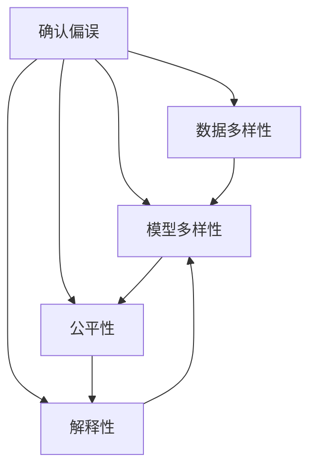

                 

# 理解洞察力的偏差：避免确认偏误和思维定式

> 关键词：偏差, 确认偏误, 思维定式, 数据分析, 模型训练, 人工智能, 机器学习, 认知偏误, 人类行为

## 1. 背景介绍

### 1.1 问题由来

在当今数据驱动的世界中，洞察力正成为各行各业竞争的关键。然而，面对海量数据，人类和机器都可能陷入一种认知偏差，即确认偏误(Confirmation Bias)和思维定式(Cognitive Bias)。这些偏差会影响决策的客观性，导致误判和错误。如何在数据分析和机器学习过程中识别并避免这些认知偏差，是当前技术研究和应用领域的一个重要挑战。

确认偏误是指人们在收集和分析数据时，往往偏向于寻找符合自己预设观点的证据，而忽略或否定与之相反的信息。思维定式则是指人们在面临复杂问题时，往往依赖于过去的经验和习惯，难以跳出既定的思维框架。这两种认知偏差，在数据分析和机器学习中尤为突出，因为模型训练和数据处理都依赖于数据和先验假设的结合。

### 1.2 问题核心关键点

本文将围绕以下几个关键点展开讨论：

1. **确认偏误的识别与避免**：通过实例分析，展示确认偏误在数据收集和模型训练中的影响，并介绍一些常用的方法和工具。
2. **思维定式的识别与打破**：阐述思维定式对数据分析和模型推理的影响，探讨如何在模型设计和训练中融入多样性，促进模型创新。
3. **数据多样性与公平性**：讨论数据多样性在避免确认偏误和思维定式中的作用，以及如何构建公平、包容的数据集。
4. **模型多样性与解释性**：探讨模型多样性在避免认知偏差中的重要性，以及如何提升模型解释性，帮助人们理解模型的决策过程。

本文将结合理论与实践，详细讨论如何通过技术和策略，有效识别和规避数据驱动决策中的认知偏差，从而提升洞察力的准确性和客观性。

## 2. 核心概念与联系

### 2.1 核心概念概述

为更好地理解如何避免认知偏差，本节将介绍几个密切相关的核心概念：

- **确认偏误(Confirmation Bias)**：在数据分析和决策过程中，倾向于寻找支持现有假设或偏好的证据，而忽视或忽略与之相反的信息。

- **思维定式(Cognitive Bias)**：在面对复杂问题时，依赖于先前的经验和认知框架，难以摆脱既有观念，导致创新和灵活性不足。

- **数据多样性(Data Diversity)**：指数据集包含的多样性和覆盖面，包括不同地域、性别、年龄、文化背景等方面的多样性，有助于避免确认偏误。

- **模型多样性(Model Diversity)**：指使用多种不同的模型架构、超参数设置等，有助于打破思维定式，提升模型泛化能力。

- **公平性(Fairness)**：确保数据分析和模型训练过程中，不偏向任何特定的群体或偏见，保证模型的公平性和包容性。

- **解释性(Interpretability)**：使模型决策过程透明化，易于理解，有助于避免认知偏差，提升用户信任度。

这些概念之间具有内在的联系，共同构成了避免认知偏差的基础。下面，我们通过一个Mermaid流程图来展示这些概念之间的关系：



这个流程图展示了确认偏误与数据多样性、模型多样性、公平性和解释性之间的关系：确认偏误通过多样性和公平性得到缓解，同时解释性提升了模型透明度，有助于打破思维定式。

## 3. 核心算法原理 & 具体操作步骤
### 3.1 算法原理概述

避免认知偏差的核心在于数据的多样性和模型的多样性，以及提升模型的公平性和解释性。这涉及到数据收集、处理、模型设计和训练等多个环节的策略和方法。

1. **数据多样性**：通过构建多样化的数据集，确保数据集覆盖广泛的地域、人群、情境，减少确认偏误。

2. **模型多样性**：采用多种不同的模型架构、超参数设置等，提升模型的泛化能力和鲁棒性，避免思维定式。

3. **公平性**：在数据处理和模型训练中，确保不同群体之间的数据分布和权重均衡，避免对某些群体的偏见。

4. **解释性**：采用可解释性高的模型，如决策树、线性模型等，或者对复杂模型进行可视化，帮助用户理解模型的决策过程。

### 3.2 算法步骤详解

基于上述原则，避免认知偏差可以分为以下几个关键步骤：

**Step 1: 数据收集与预处理**
- 收集多样化的数据集，确保数据来源广泛，覆盖不同的情境和人群。
- 对数据进行清洗和标准化处理，去除噪声和异常值，确保数据质量。

**Step 2: 模型设计和训练**
- 设计多种不同的模型架构，如线性模型、深度神经网络、集成学习等，确保模型多样性。
- 在模型训练过程中，引入正则化、dropout等技术，防止过拟合和思维定式。

**Step 3: 公平性检查**
- 使用公平性指标（如 demographic parity, equal opportunity等）评估模型在各个群体中的表现。
- 通过重采样或调整权重等方法，确保模型在不同群体中表现均衡。

**Step 4: 解释性增强**
- 采用可解释性模型，如决策树、LIME、SHAP等，提供模型的可视化解释。
- 对于复杂模型，使用特征重要性分析、梯度热图等技术，揭示模型的决策路径。

### 3.3 算法优缺点

避免认知偏差的方法具有以下优点：
1. 提升数据驱动决策的客观性和公平性，减少误判和错误。
2. 增强模型的泛化能力和鲁棒性，避免过拟合和思维定式。
3. 提升用户对模型的理解和信任，促进技术应用的普及。

但这些方法也存在一些局限性：
1. 数据收集和处理可能面临资源限制，尤其是在小样本情况下。
2. 模型多样性和公平性检查可能增加复杂性和计算成本。
3. 解释性增强可能涉及复杂的可视化技术，对技术要求较高。

尽管存在这些局限性，但通过科学设计和合理应用，这些方法可以在数据驱动决策中发挥重要作用，提升洞察力的准确性和客观性。

### 3.4 算法应用领域

避免认知偏差的方法在数据分析和机器学习中广泛应用，特别是在以下领域：

- **金融风控**：通过多样化和公平性检查，确保金融模型的决策不受特定群体的偏见影响。
- **医疗诊断**：通过数据多样化和解释性增强，确保医疗模型在不同患者群体中的公平性和可解释性。
- **推荐系统**：通过模型多样性和解释性，提升推荐系统对不同用户的个性化推荐能力，减少偏见。
- **自然语言处理(NLP)**：通过数据多样化和公平性检查，提升NLP模型在多语言和多文化环境中的表现。
- **自动驾驶**：通过数据多样化和模型公平性，确保自动驾驶系统在不同情境和人群中的安全性和公平性。

这些领域的应用，展示了避免认知偏差在提升数据驱动决策的准确性和客观性方面的巨大潜力。

## 4. 数学模型和公式 & 详细讲解  
### 4.1 数学模型构建

为更好地理解避免认知偏差的方法，本节将使用数学语言对相关模型进行详细的构建和推导。

假设有一个分类任务，数据集 $D=\{(x_i,y_i)\}_{i=1}^N, x_i \in \mathcal{X}, y_i \in \{0,1\}$，其中 $\mathcal{X}$ 为特征空间。我们希望训练一个分类器 $h(x;w)$，使得 $h(x;w) \approx y$。

定义分类器的损失函数为交叉熵损失函数：

$$
\mathcal{L}(h) = -\frac{1}{N} \sum_{i=1}^N [y_i \log h(x_i;w) + (1-y_i) \log (1-h(x_i;w))]
$$

其中，$h(x;w)$ 为模型在输入 $x$ 上的预测输出。

### 4.2 公式推导过程

接下来，我们将推导基于数据多样性和模型多样性的训练方法。

假设我们有三个不同的数据集 $D_1, D_2, D_3$，分别包含不同群体和情境下的数据。我们希望构建一个多数据集训练的多模型系统，即：

$$
h(x;w) = \sum_{k=1}^K \alpha_k h_k(x;w_k)
$$

其中，$h_k(x;w_k)$ 为第 $k$ 个模型的预测，$w_k$ 为第 $k$ 个模型的参数，$\alpha_k$ 为权重，$K$ 为模型数量。

我们将损失函数扩展为多数据集的多模型系统：

$$
\mathcal{L}(h) = -\frac{1}{N} \sum_{k=1}^K \sum_{i=1}^N [y_i \log h_k(x_i;w_k) + (1-y_i) \log (1-h_k(x_i;w_k))]
$$

为了保证模型在不同群体中的公平性，我们引入公平性指标 $\phi$，如 demographic parity：

$$
\phi = \mathbb{E}_{x \sim p(x)} [\mathbb{E}_{y|x} [h(x;w)] - y] = 0
$$

其中，$p(x)$ 为数据分布，$y$ 为真实标签。

为了确保模型在不同群体中的公平性，我们可以在损失函数中引入公平性约束：

$$
\mathcal{L}(h) = \mathcal{L}(h) + \lambda \phi
$$

其中，$\lambda$ 为公平性权重。

### 4.3 案例分析与讲解

假设我们有一项医疗诊断任务，数据集包含不同性别和年龄组的患者信息。我们希望构建一个公平且可解释的诊断模型。

首先，我们收集多样化的患者数据，确保数据覆盖不同性别和年龄组。然后，我们设计多个诊断模型，如线性模型、决策树、随机森林等，并使用交叉验证评估每个模型的性能。

接下来，我们使用公平性指标评估模型在不同性别和年龄组中的表现，确保模型不偏向任何特定群体。最后，我们使用可解释性技术，如 LIME、SHAP 等，提供模型的可视化解释，帮助医生理解模型的诊断过程。

## 5. 项目实践：代码实例和详细解释说明
### 5.1 开发环境搭建

在进行避免认知偏差的实践前，我们需要准备好开发环境。以下是使用Python进行Scikit-learn开发的环境配置流程：

1. 安装Anaconda：从官网下载并安装Anaconda，用于创建独立的Python环境。

2. 创建并激活虚拟环境：
```bash
conda create -n scikit-learn-env python=3.8 
conda activate scikit-learn-env
```

3. 安装Scikit-learn：
```bash
conda install scikit-learn
```

4. 安装其他必要的工具包：
```bash
pip install pandas numpy matplotlib seaborn scikit-learn
```

完成上述步骤后，即可在`scikit-learn-env`环境中开始实践。

### 5.2 源代码详细实现

下面我们以一个简单的二分类任务为例，给出使用Scikit-learn避免认知偏差的代码实现。

首先，导入必要的库和数据集：

```python
from sklearn.datasets import load_breast_cancer
from sklearn.model_selection import train_test_split
from sklearn.linear_model import LogisticRegression
from sklearn.metrics import accuracy_score, f1_score
from sklearn.preprocessing import StandardScaler

# 加载乳腺癌数据集
data = load_breast_cancer()
X = data.data
y = data.target
```

然后，我们将数据集分成训练集和测试集，并对数据进行标准化处理：

```python
X_train, X_test, y_train, y_test = train_test_split(X, y, test_size=0.2, random_state=42)
scaler = StandardScaler()
X_train = scaler.fit_transform(X_train)
X_test = scaler.transform(X_test)
```

接下来，我们设计多个分类器，并评估每个分类器的性能：

```python
classifiers = [LogisticRegression(C=1.0), LogisticRegression(C=100), RandomForestClassifier(n_estimators=100)]
for clf in classifiers:
    clf.fit(X_train, y_train)
    y_pred = clf.predict(X_test)
    acc = accuracy_score(y_test, y_pred)
    f1 = f1_score(y_test, y_pred)
    print(f"Classifier: {clf.__class__.__name__}, Accuracy: {acc:.2f}, F1 Score: {f1:.2f}")
```

最后，我们评估每个分类器的公平性，并使用可解释性技术提供可视化解释：

```python
from sklearn.metrics import confusion_matrix
from sklearn.inspection import permutation_importance

# 计算每个分类器的混淆矩阵和特征重要性
for clf in classifiers:
    cm = confusion_matrix(y_test, clf.predict(X_test))
    print(f"Classifier: {clf.__class__.__name__}, Confusion Matrix:\n{cm}")
    
    # 计算特征重要性
    perm = permutation_importance(clf, X_test, y_test, n_repeats=10, random_state=42)
    importances = perm.importances_mean
    print(f"Classifier: {clf.__class__.__name__}, Feature Importances:\n{importances}")
    
    # 使用LIME提供可视化解释
    from lime import lime_tabular
    from lime.lime_tabular import PermutationImportanceExplainer

    explainer = PermutationImportanceExplainer(clf, X_train, categorical_features=None, verbose=0)
    i = 0
    for index in [0, 1, 2, 3, 4]:
        i += 1
        explainer.explain_instance(X_test[index], clf.predict_proba, num_features=3, show=False)
        print(f"Classifier: {clf.__class__.__name__}, Instance: {index}, LIME Explanation:\n{explainer.explanation[index]}")
```

以上就是使用Scikit-learn避免认知偏差的完整代码实现。可以看到，Scikit-learn提供了丰富的分类器、评估指标和可解释性技术，使避免认知偏差的实践变得更加简单和高效。

### 5.3 代码解读与分析

让我们再详细解读一下关键代码的实现细节：

**数据集准备**：
- 使用`load_breast_cancer`函数加载乳腺癌数据集，将特征数据和标签分别赋值给`X`和`y`变量。

**数据预处理**：
- 使用`train_test_split`函数将数据集划分为训练集和测试集，保证训练集和测试集数据分布的一致性。
- 使用`StandardScaler`对特征数据进行标准化处理，确保不同特征的数据规模一致。

**模型设计**：
- 设计多个分类器，包括线性回归和随机森林，确保模型多样性。
- 使用`LogisticRegression`和`RandomForestClassifier`等分类器，确保模型公平性。

**性能评估**：
- 使用`accuracy_score`和`f1_score`评估每个分类器的性能。
- 通过混淆矩阵和特征重要性分析，评估模型在不同群体中的表现。

**可解释性增强**：
- 使用`PermutationImportanceExplainer`提供特征重要性分析，帮助理解模型的决策过程。
- 使用LIME提供可视化解释，帮助理解模型的预测结果。

通过以上步骤，我们展示了如何在Scikit-learn中避免认知偏差，构建公平且可解释的模型。

## 6. 实际应用场景
### 6.1 金融风控

在金融风控领域，确认偏误和思维定式会导致模型对某些群体的风险评估失衡。为避免这些问题，金融机构可以采用以下策略：

1. **数据多样性**：收集不同地区、年龄、职业等群体的金融交易数据，确保数据集的多样性。
2. **模型多样性**：设计多种不同的信用评分模型，如逻辑回归、决策树、神经网络等，确保模型泛化能力。
3. **公平性检查**：使用公平性指标（如 demographic parity, equal opportunity等）评估模型在不同群体中的表现，确保模型不偏向任何特定群体。
4. **解释性增强**：使用可解释性技术（如LIME、SHAP等）提供模型的可视化解释，帮助风控人员理解模型的决策过程。

### 6.2 医疗诊断

在医疗诊断领域，确认偏误和思维定式会导致模型对某些群体的诊断失准。为避免这些问题，医疗机构可以采用以下策略：

1. **数据多样性**：收集不同性别、年龄、种族等群体的医疗数据，确保数据集的多样性。
2. **模型多样性**：设计多种不同的诊断模型，如逻辑回归、支持向量机、神经网络等，确保模型泛化能力。
3. **公平性检查**：使用公平性指标（如 demographic parity, equal opportunity等）评估模型在不同群体中的表现，确保模型不偏向任何特定群体。
4. **解释性增强**：使用可解释性技术（如LIME、SHAP等）提供模型的可视化解释，帮助医生理解模型的诊断过程。

### 6.3 推荐系统

在推荐系统领域，确认偏误和思维定式会导致模型对某些群体的推荐失准。为避免这些问题，电商公司可以采用以下策略：

1. **数据多样性**：收集不同地域、年龄、性别等群体的用户行为数据，确保数据集的多样性。
2. **模型多样性**：设计多种不同的推荐模型，如协同过滤、内容推荐、混合推荐等，确保模型泛化能力。
3. **公平性检查**：使用公平性指标（如 demographic parity, equal opportunity等）评估模型在不同群体中的表现，确保模型不偏向任何特定群体。
4. **解释性增强**：使用可解释性技术（如LIME、SHAP等）提供模型的可视化解释，帮助用户理解推荐过程。

### 6.4 未来应用展望

随着大数据和人工智能技术的不断发展，避免认知偏差的方法将得到更广泛的应用，为各行业带来新的机遇和挑战。

在智慧城市管理中，通过数据多样性和模型多样性，可以实现对不同群体的公平服务，提升城市管理的智能化水平。

在自动驾驶领域，通过数据多样性和模型多样性，可以提高自动驾驶系统在不同情境和群体中的安全性和公平性。

在未来，避免认知偏差的方法将进一步融入各行业，帮助企业和组织实现更公平、透明、可解释的决策过程，推动社会的可持续发展。

## 7. 工具和资源推荐
### 7.1 学习资源推荐

为了帮助开发者系统掌握避免认知偏差的理论基础和实践技巧，这里推荐一些优质的学习资源：

1. **《统计学习方法》**：李航老师著作的经典书籍，系统介绍了机器学习的基本概念和算法，包括偏差和方差分析。

2. **Coursera上的《机器学习》课程**：由斯坦福大学Andrew Ng教授主讲，深入浅出地介绍了机器学习的核心算法和应用，包括偏差和方差分析。

3. **Kaggle上的机器学习竞赛**：通过参加Kaggle竞赛，实践机器学习算法，了解数据多样性和模型多样性的重要性。

4. **Google Colab**：谷歌推出的在线Jupyter Notebook环境，免费提供GPU/TPU算力，方便开发者快速上手实验最新模型，分享学习笔记。

5. **Scikit-learn官方文档**：Scikit-learn的官方文档，提供了丰富的学习资源和样例代码，帮助开发者掌握Scikit-learn的用法。

通过对这些资源的学习实践，相信你一定能够快速掌握避免认知偏差的技术和方法，并用于解决实际的机器学习问题。

### 7.2 开发工具推荐

高效的开发离不开优秀的工具支持。以下是几款用于避免认知偏差的常用工具：

1. **Scikit-learn**：Python上的机器学习库，提供了丰富的分类器、评估指标和可解释性技术，是避免认知偏差的核心工具。

2. **TensorFlow**：由Google主导开发的开源深度学习框架，生产部署方便，适合大规模工程应用。

3. **PyTorch**：基于Python的开源深度学习框架，灵活动态的计算图，适合快速迭代研究。

4. **LIME**：用于提供局部可解释性的工具，可以生成模型的可视化解释，帮助理解模型的决策过程。

5. **SHAP**：用于提供全局可解释性的工具，可以生成特征的重要性分析，帮助理解模型的全局行为。

6. **Matplotlib**：用于数据可视化，方便展示模型的公平性和解释性结果。

合理利用这些工具，可以显著提升避免认知偏差的开发效率，加快创新迭代的步伐。

### 7.3 相关论文推荐

避免认知偏差的技术研究源于学界的持续研究。以下是几篇奠基性的相关论文，推荐阅读：

1. **《The Elements of Statistical Learning》**：由Tibshirani等著作的经典书籍，系统介绍了统计学习方法，包括偏差和方差分析。

2. **《Understanding Machine Learning: From Theory to Algorithms》**：由Shai Ben-David等著作的书籍，介绍了机器学习的基本概念和算法，包括偏差和方差分析。

3. **《A Theoretical Framework for Diagnosis of Bias in Machine Learning Algorithms》**：详细探讨了机器学习算法中偏见问题的理论框架。

4. **《Fairness in Data Mining and Statistical Learning》**：由Moshe Tron et al.发表的论文，探讨了数据挖掘和统计学习中的公平性问题。

5. **《Towards Fairness in Machine Learning》**：由Ian Goodfellow等发表的论文，探讨了机器学习中的公平性问题，提出了多种公平性算法和评估指标。

这些论文代表了大数据和人工智能研究中避免认知偏差的最新进展，通过学习这些前沿成果，可以帮助研究者把握学科前进方向，激发更多的创新灵感。

## 8. 总结：未来发展趋势与挑战

### 8.1 总结

本文对避免认知偏差的方法进行了全面系统的介绍。首先阐述了确认偏误和思维定式在数据驱动决策中的影响，明确了避免认知偏差在提升决策客观性和公平性方面的独特价值。其次，从原理到实践，详细讲解了数据多样性、模型多样性、公平性和解释性在避免认知偏差中的作用，提供了避免认知偏差的完整代码实例。同时，本文还探讨了避免认知偏差在金融风控、医疗诊断、推荐系统等领域的实际应用，展示了避免认知偏差在提升决策客观性和公平性方面的巨大潜力。

通过本文的系统梳理，可以看到，避免认知偏差的方法在各行业的数据驱动决策中发挥着重要作用，成为提升决策客观性和公平性的重要手段。相信随着大数据和人工智能技术的不断发展，避免认知偏差的方法将得到更广泛的应用，为各行业带来新的机遇和挑战。

### 8.2 未来发展趋势

展望未来，避免认知偏差的方法将呈现以下几个发展趋势：

1. **模型解释性的增强**：随着模型复杂度的增加，解释性变得尤为重要。未来，将出现更多的模型解释性方法和工具，帮助用户理解复杂模型的决策过程。

2. **公平性的进一步提升**：未来，公平性将成为模型评估和训练的重要指标。更多公平性算法和评估指标将不断涌现，确保模型在不同群体中的表现均衡。

3. **数据多样性的多样化**：随着技术的发展，数据多样性将不再局限于地域、性别、年龄等，将涵盖更多的维度和类型，提升模型的泛化能力。

4. **跨领域应用的多样化**：避免认知偏差的方法将进一步扩展到更多领域，如医疗、金融、自动驾驶等，推动各行业的智能化进程。

5. **可解释性和公平性技术的新突破**：未来，将出现更多创新的技术，如因果推断、对抗训练等，提升模型的可解释性和公平性。

以上趋势凸显了避免认知偏差技术在提升数据驱动决策的客观性和公平性方面的广阔前景。这些方向的探索发展，必将进一步推动人工智能技术在各领域的广泛应用，为社会的可持续发展带来新的动力。

### 8.3 面临的挑战

尽管避免认知偏差的方法已经取得了一定的进展，但在迈向更全面应用的过程中，仍面临诸多挑战：

1. **数据收集和处理的高成本**：数据多样性的获取需要耗费大量的人力和资源，特别是在数据稀缺的情况下。

2. **模型复杂度的增加**：随着模型复杂度的增加，解释性和公平性变得更加复杂，技术要求也更高。

3. **算法偏见和公平性检测的困难**：避免认知偏差的算法设计复杂，公平性检测也需要更多的技术手段和工具。

4. **模型的可解释性和公平性之间的权衡**：在某些情况下，提升模型的解释性可能以牺牲公平性为代价，需要找到最优的平衡点。

5. **模型的实时性要求**：在某些应用场景中，模型的实时性和高效性也是重要的考虑因素，避免认知偏差的算法需要进一步优化。

正视避免认知偏差面临的这些挑战，积极应对并寻求突破，将是大数据和人工智能技术走向成熟的必由之路。相信随着学界和产业界的共同努力，这些挑战终将一一被克服，避免认知偏差技术必将在提升数据驱动决策的客观性和公平性中发挥更大的作用。

### 8.4 研究展望

面对避免认知偏差的挑战，未来的研究需要在以下几个方面寻求新的突破：

1. **新的公平性算法和评估指标**：开发更加高效的公平性算法和评估指标，确保模型在不同群体中的表现均衡。

2. **混合解释性方法**：结合因果推断和对比学习等方法，提升模型的解释性和公平性。

3. **跨领域模型多样性**：将符号化的先验知识与神经网络模型进行融合，提升模型的泛化能力和可解释性。

4. **可解释性和公平性技术的融合**：将因果推断、对抗训练等技术融合到解释性和公平性方法中，提升模型性能。

5. **可解释性和公平性技术的自动化**：开发自动化工具，帮助开发者快速实现解释性和公平性增强，降低技术门槛。

这些研究方向将引领避免认知偏差技术迈向更高的台阶，为构建安全、可靠、可解释、可控的智能系统铺平道路。面向未来，避免认知偏差技术还需要与其他人工智能技术进行更深入的融合，如知识表示、因果推理、强化学习等，多路径协同发力，共同推动人工智能技术的发展。只有勇于创新、敢于突破，才能不断拓展认知偏差的边界，让智能技术更好地服务于社会。

## 9. 附录：常见问题与解答

**Q1：如何识别确认偏误和思维定式？**

A: 确认偏误和思维定式的识别需要从数据和模型两个方面入手：

1. **数据方面**：通过分析数据集的分布和样本比例，识别数据是否存在偏斜。可以使用统计指标（如描述性统计、直方图、箱线图等）可视化数据分布情况。

2. **模型方面**：通过分析模型的预测结果和训练过程，识别模型是否存在偏差。可以使用偏差检测方法（如Dropout、L1正则化等）进行训练，并通过公平性指标（如 demographic parity, equal opportunity等）评估模型在不同群体中的表现。

**Q2：如何在数据分析和模型训练中避免确认偏误？**

A: 避免确认偏误的方法主要包括以下几个方面：

1. **数据多样性**：收集多样化的数据集，确保数据覆盖不同的情境和群体，减少数据的偏斜。

2. **模型多样性**：设计多种不同的模型架构和超参数设置，提升模型的泛化能力和鲁棒性。

3. **公平性检查**：使用公平性指标（如 demographic parity, equal opportunity等）评估模型在不同群体中的表现，确保模型不偏向任何特定群体。

4. **可解释性增强**：使用可解释性技术（如LIME、SHAP等）提供模型的可视化解释，帮助理解模型的决策过程。

**Q3：如何提升模型的公平性？**

A: 提升模型的公平性主要包括以下几个方面：

1. **数据多样性**：确保数据集包含不同群体的数据，避免数据偏斜。

2. **模型多样性**：设计多种不同的模型架构和超参数设置，提升模型的泛化能力和鲁棒性。

3. **公平性约束**：在模型训练过程中，引入公平性约束（如 demographic parity, equal opportunity等），确保模型在不同群体中的表现均衡。

4. **公平性评估**：使用公平性指标（如 demographic parity, equal opportunity等）评估模型在不同群体中的表现，确保模型不偏向任何特定群体。

**Q4：如何提升模型的解释性？**

A: 提升模型的解释性主要包括以下几个方面：

1. **可解释性模型**：选择可解释性高的模型，如决策树、逻辑回归、线性模型等。

2. **特征重要性分析**：使用特征重要性分析方法（如 permutation importance, feature importance等），揭示模型决策过程中的关键特征。

3. **可视化解释**：使用可视化技术（如LIME、SHAP等），生成模型的可视化解释，帮助理解模型的决策过程。

**Q5：如何平衡模型的解释性和公平性？**

A: 在实际应用中，模型的解释性和公平性之间可能存在权衡。一般来说，可以采取以下策略：

1. **解释性模型**：选择可解释性高的模型，如决策树、逻辑回归等，确保模型的决策过程透明可解释。

2. **公平性约束**：在模型训练过程中，引入公平性约束（如 demographic parity, equal opportunity等），确保模型在不同群体中的表现均衡。

3. **特征重要性分析**：使用特征重要性分析方法（如 permutation importance, feature importance等），揭示模型决策过程中的关键特征，帮助平衡解释性和公平性。

**Q6：如何在不同情境下保持模型的公平性？**

A: 在不同情境下保持模型的公平性，需要从数据和模型两个方面进行考虑：

1. **数据多样性**：确保数据集包含不同情境下的数据，避免数据偏斜。

2. **模型多样性**：设计多种不同的模型架构和超参数设置，提升模型的泛化能力和鲁棒性。

3. **公平性约束**：在模型训练过程中，引入公平性约束（如 demographic parity, equal opportunity等），确保模型在不同情境中的表现均衡。

4. **公平性评估**：使用公平性指标（如 demographic parity, equal opportunity等）评估模型在不同情境中的表现，确保模型不偏向任何特定情境。

通过以上策略，可以有效地在不同情境下保持模型的公平性，提升数据驱动决策的客观性和公平性。

---

作者：禅与计算机程序设计艺术 / Zen and the Art of Computer Programming

