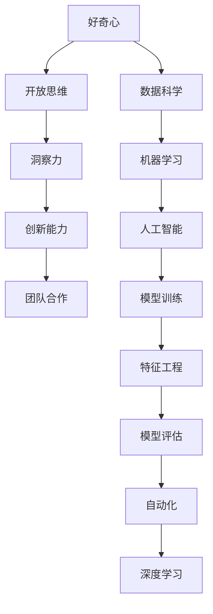

                 

# 理解洞察力的培养：鼓励好奇心和开放思维

> 关键词：洞察力, 好奇心, 开放思维, 数据科学, 机器学习, 人工智能, 模型训练, 特征工程, 自动化, 深度学习, 模型评估

## 1. 背景介绍

### 1.1 问题由来
在信息爆炸的时代，数据和算法的结合为人工智能(AI)的发展提供了广阔的舞台。然而，尽管算法和技术不断进步，AI系统的效能和应用潜力依然受到人类理解和洞察力的限制。数据科学家和工程师必须具备足够的好奇心和开放思维，才能探索未知领域，发现数据背后的洞见，最终实现技术的落地和商业价值的最大化。

### 1.2 问题核心关键点
洞察力在数据科学和AI应用中扮演关键角色，其培养和发挥需要好奇心和开放思维。具体而言：
- **好奇心**：驱动对未知的探索和兴趣，激励持续学习和自我更新。
- **开放思维**：愿意接受不同观点，能够灵活调整策略，适应多变的现实环境。

好奇心和开放思维的融合，可以大大提高数据科学家的洞察力和模型的准确性。他们在项目开发和决策制定中的作用，不仅体现在技术的实现上，更体现在创新能力和团队合作上。

### 1.3 问题研究意义
研究如何培养和激励好奇心与开放思维，对于数据科学家和AI工程师而言，具有重要意义：

1. **提高创新能力**：驱使探索新领域，带来技术突破和应用创新。
2. **增强问题解决能力**：对复杂问题有更强的洞察力，能够迅速找到解决方案。
3. **提升团队合作**：鼓励多元化的视角，促进知识共享和团队协作。
4. **实现长期成功**：建立对行业趋势的敏感度，使个人和团队能够保持领先地位。
5. **促进职业发展**：持续的自我提升和认知更新，确保职业竞争力和适应性。

## 2. 核心概念与联系

### 2.1 核心概念概述

为更好地理解好奇心与开放思维的培养，本节将介绍几个关键概念及其相互关联：

- **好奇心**：对于新事物和未知领域的兴趣和探索欲望，推动知识积累和技能提升。
- **开放思维**：愿意接受新信息和不同观点，愿意尝试和接受失败，从错误中学习。
- **洞察力**：从数据和信息中提取关键模式和关系的能力，是数据分析和机器学习中的核心技能。
- **创新能力**：发现新的方法和解决方案，带来技术突破和商业价值。
- **团队合作**：建立多元化的团队，促进知识分享和协作，共同解决问题。

这些概念之间的逻辑关系可以通过以下Mermaid流程图来展示：



这个流程图展示了好奇心、开放思维、洞察力、创新能力和团队合作如何共同作用，形成高效的数据科学和AI应用。

## 3. 核心算法原理 & 具体操作步骤
### 3.1 算法原理概述

基于好奇心和开放思维的洞察力培养，核心在于构建一个开放式的、鼓励探索的学习和工作环境。以下是这一过程的算法原理：

- **数据收集与清洗**：从多个渠道收集数据，清洗数据以确保质量和一致性。
- **数据探索与预处理**：进行特征工程，提取关键特征，为模型训练做准备。
- **模型选择与训练**：选择适当的模型，通过交叉验证等技术训练模型，并调整超参数。
- **模型评估与优化**：使用不同的评估指标对模型进行评估，并根据反馈不断优化。
- **特征与算法创新**：鼓励尝试新的特征和算法，验证其对模型的贡献。
- **团队协作与反馈**：建立团队文化，鼓励知识共享，及时沟通与反馈。

### 3.2 算法步骤详解

**Step 1: 数据收集与清洗**

1. **数据源选择**：从内部系统、公开数据集、客户反馈等渠道收集数据，确保数据多样性和代表性。
2. **数据预处理**：使用Python等工具，处理缺失值、异常值，进行数据清洗和标准化，保证数据质量。
3. **数据增强**：通过生成合成数据或扩充现有数据，丰富数据集，提升模型泛化能力。

**Step 2: 数据探索与预处理**

1. **数据探索**：使用数据可视化工具如Matplotlib、Seaborn，初步探索数据分布和趋势。
2. **特征工程**：分析特征的重要性和相关性，提取和构建新的特征，为模型训练做准备。
3. **数据分割**：将数据划分为训练集、验证集和测试集，保证模型评估的公正性和可靠性。

**Step 3: 模型选择与训练**

1. **模型选择**：根据任务类型和数据特征，选择适当的机器学习或深度学习模型。
2. **超参数调优**：使用网格搜索或随机搜索，调整模型超参数，优化模型性能。
3. **模型训练**：使用训练集数据，进行模型训练，不断迭代以提升模型准确性。

**Step 4: 模型评估与优化**

1. **性能评估**：使用不同的评估指标如准确率、召回率、F1-score等，评估模型性能。
2. **模型调优**：根据评估结果，调整模型结构、参数或特征，进一步提升模型性能。
3. **模型部署**：将优化后的模型部署到生产环境，进行实时预测和推理。

**Step 5: 特征与算法创新**

1. **特征创新**：尝试新的特征提取方法和特征组合，验证其对模型性能的影响。
2. **算法创新**：引入新的模型架构或算法，验证其是否能够提升模型效果。
3. **创新验证**：通过A/B测试等方法，验证创新方案的效果，形成标准流程。

**Step 6: 团队协作与反馈**

1. **知识共享**：建立开放的沟通渠道，鼓励团队成员分享技术见解和经验。
2. **跨团队合作**：与其他部门协作，整合业务需求和数据分析结果，提升解决方案的全面性。
3. **定期反馈**：定期举行团队会议，分享项目进展和遇到的挑战，及时调整策略。

### 3.3 算法优缺点

**优点**：
1. **提高模型性能**：通过多渠道数据收集和多样化特征提取，提升模型泛化能力和准确性。
2. **促进创新**：鼓励团队成员尝试新的方法，带来技术突破和应用创新。
3. **增强合作**：建立开放的沟通氛围，促进团队协作和知识共享。

**缺点**：
1. **资源消耗**：数据收集和处理需要大量时间和资源。
2. **不确定性**：新方法和算法的引入存在一定风险，可能对模型性能产生负面影响。
3. **学习曲线**：新手需要时间适应新的技术和方法。

### 3.4 算法应用领域

好奇心和开放思维的培养在多个数据科学和AI应用领域具有广泛的应用：

- **金融风控**：通过收集和分析客户交易数据，发现异常行为和潜在风险，提高风控模型准确性。
- **医疗诊断**：收集和处理患者历史数据，提取关键特征，建立更准确的诊断模型。
- **推荐系统**：分析用户行为和商品特征，优化推荐算法，提升用户体验和转化率。
- **客户服务**：收集和分析客户反馈数据，优化服务流程，提升客户满意度。
- **智能制造**：收集和处理生产数据，提取关键指标，优化生产流程，提高生产效率。
- **市场营销**：分析市场数据和用户行为，优化营销策略，提升市场覆盖率和转化率。

## 4. 数学模型和公式 & 详细讲解 & 举例说明

### 4.1 数学模型构建

在数据科学和机器学习中，模型构建的数学基础包括以下几个部分：

- **线性回归模型**：$y = \beta_0 + \beta_1 x_1 + \beta_2 x_2 + \cdots + \beta_n x_n + \epsilon$
  - $y$：预测结果
  - $x_i$：输入特征
  - $\beta_i$：特征系数
  - $\epsilon$：误差项

- **逻辑回归模型**：$P(y|x) = \frac{1}{1 + e^{-\theta^T x}}$
  - $P(y|x)$：预测概率
  - $x$：输入特征向量
  - $\theta$：模型参数

- **支持向量机(SVM)**：$h_\theta(x) = \sum_{i=1}^n \alpha_i y_i \cdot k(x, x_i)$
  - $h_\theta(x)$：预测结果
  - $x$：输入特征
  - $\alpha_i$：权重
  - $y_i$：标签
  - $k(x, x_i)$：核函数

- **随机森林模型**：由多个决策树组成，通过投票或平均值的方式进行预测。
  - $h_\theta(x) = \frac{1}{N} \sum_{i=1}^N h_{T_i}(x)$

- **深度学习模型**：使用神经网络结构进行特征提取和预测。
  - $h_\theta(x) = f_{\theta}(x)$
  - $f_{\theta}$：神经网络模型

### 4.2 公式推导过程

以线性回归模型为例，推导其公式和梯度下降算法：

1. **损失函数**：均方误差损失函数
   $$
   \mathcal{L}(\theta) = \frac{1}{2N} \sum_{i=1}^N (y_i - h_\theta(x_i))^2
   $$
   - $y_i$：实际标签
   - $h_\theta(x_i)$：模型预测结果

2. **梯度下降算法**：求解参数 $\theta$ 的最小值
   $$
   \theta \leftarrow \theta - \eta \nabla_\theta \mathcal{L}(\theta)
   $$
   - $\eta$：学习率
   - $\nabla_\theta \mathcal{L}(\theta)$：损失函数对 $\theta$ 的梯度

### 4.3 案例分析与讲解

假设我们有一个二分类问题，目标是预测用户是否会购买某产品。通过收集历史购买数据，我们可以使用逻辑回归模型进行训练和预测。具体步骤如下：

1. **数据收集与清洗**：收集用户基本信息和购买历史数据，处理缺失值和异常值。
2. **数据探索与预处理**：使用数据可视化工具探索数据分布，进行特征工程，提取用户基本信息、购买频率等特征。
3. **模型选择与训练**：选择逻辑回归模型，使用训练集数据训练模型，调整学习率和正则化系数等超参数。
4. **模型评估与优化**：使用测试集数据评估模型性能，根据评估结果调整模型参数，提高模型准确率。
5. **特征与算法创新**：尝试引入新的特征，如用户搜索记录、社交媒体互动等，验证其对模型性能的影响。
6. **团队协作与反馈**：定期召开项目会议，分享进展和遇到的问题，及时调整策略，提升团队协作效率。

## 5. 项目实践：代码实例和详细解释说明
### 5.1 开发环境搭建

在进行项目实践前，我们需要准备好开发环境。以下是使用Python进行Scikit-learn开发的环境配置流程：

1. 安装Anaconda：从官网下载并安装Anaconda，用于创建独立的Python环境。

2. 创建并激活虚拟环境：
```bash
conda create -n sklearn-env python=3.8 
conda activate sklearn-env
```

3. 安装Scikit-learn：
```bash
conda install scikit-learn scikit-image matplotlib numpy pandas seaborn
```

4. 安装Jupyter Notebook：
```bash
conda install jupyter notebook
```

完成上述步骤后，即可在`sklearn-env`环境中开始项目实践。

### 5.2 源代码详细实现

下面我们以一个简单的线性回归问题为例，给出使用Scikit-learn库进行模型训练的Python代码实现。

```python
from sklearn.datasets import make_regression
from sklearn.model_selection import train_test_split
from sklearn.linear_model import LinearRegression
from sklearn.metrics import mean_squared_error

# 生成随机数据集
X, y = make_regression(n_samples=100, n_features=3, noise=0.1, random_state=0)

# 数据分割
X_train, X_test, y_train, y_test = train_test_split(X, y, test_size=0.3, random_state=0)

# 模型训练
model = LinearRegression()
model.fit(X_train, y_train)

# 模型预测与评估
y_pred = model.predict(X_test)
mse = mean_squared_error(y_test, y_pred)
print(f"MSE: {mse:.3f}")
```

### 5.3 代码解读与分析

让我们再详细解读一下关键代码的实现细节：

**make_regression函数**：
- 生成一个具有指定特征数和噪声水平的正则化线性回归问题。

**train_test_split函数**：
- 将数据集分为训练集和测试集。

**LinearRegression模型**：
- 使用线性回归模型拟合训练数据。

**mean_squared_error函数**：
- 计算测试集上的均方误差。

## 6. 实际应用场景

### 6.1 金融风控

在金融领域，数据分析和风险控制是关键环节。通过收集和分析客户交易数据，可以发现异常行为和潜在风险，提前预警并采取相应措施，降低金融风险。

具体而言，可以构建一个用户行为分析系统，收集客户的交易记录、账户余额、操作时间等数据，使用深度学习模型进行特征提取和异常检测。微调过程包括：
1. **数据收集与清洗**：收集历史交易数据，清洗异常数据。
2. **特征工程**：提取交易频率、交易金额、操作时间等特征。
3. **模型选择与训练**：选择异常检测模型，如SVM、深度神经网络等，进行模型训练和参数调优。
4. **模型评估与优化**：使用测试集评估模型性能，根据评估结果调整模型参数。
5. **特征与算法创新**：引入新的特征，如用户行为数据、第三方支付记录等，验证其对模型性能的影响。
6. **团队协作与反馈**：定期召开风险管理会议，分享模型进展和遇到的问题，及时调整策略。

### 6.2 医疗诊断

医疗诊断是一个复杂且高风险的任务。通过收集和处理患者的历史病历、检查结果、基因数据等，可以建立更准确的诊断模型，提高医疗服务的精准性和及时性。

具体实施中，可以构建一个智能诊断系统，收集患者的基本信息、症状描述、检查结果等数据，使用深度学习模型进行诊断。微调过程包括：
1. **数据收集与清洗**：收集患者病历和检查数据，清洗异常数据。
2. **数据探索与预处理**：使用数据可视化工具探索数据分布，进行特征工程，提取关键特征。
3. **模型选择与训练**：选择分类或回归模型，进行模型训练和参数调优。
4. **模型评估与优化**：使用测试集评估模型性能，根据评估结果调整模型参数。
5. **特征与算法创新**：引入新的特征，如基因数据、电子病历等，验证其对模型性能的影响。
6. **团队协作与反馈**：定期召开医疗团队会议，分享诊断进展和遇到的问题，及时调整策略。

### 6.3 推荐系统

推荐系统是电商和内容平台的重要功能。通过收集和分析用户行为数据，可以优化推荐算法，提高用户体验和转化率。

具体实施中，可以构建一个推荐系统，收集用户浏览、点击、购买等数据，使用深度学习模型进行推荐。微调过程包括：
1. **数据收集与清洗**：收集用户行为数据，清洗异常数据。
2. **数据探索与预处理**：使用数据可视化工具探索数据分布，进行特征工程，提取关键特征。
3. **模型选择与训练**：选择推荐模型，如协同过滤、内容推荐等，进行模型训练和参数调优。
4. **模型评估与优化**：使用测试集评估模型性能，根据评估结果调整模型参数。
5. **特征与算法创新**：引入新的特征，如用户社交网络、商品评论等，验证其对模型性能的影响。
6. **团队协作与反馈**：定期召开推荐团队会议，分享推荐进展和遇到的问题，及时调整策略。

### 6.4 未来应用展望

随着数据科学和AI技术的不断发展，好奇心和开放思维的培养将更加重要。未来，这些技术和方法将广泛应用于各个行业，带来更多的创新和变革。

1. **智慧城市**：通过收集和分析城市数据，构建智能交通、智能安防、智能环保等系统，提升城市管理水平。
2. **智能制造**：通过收集和分析生产数据，优化生产流程，提高生产效率和产品质量。
3. **智能农业**：通过收集和分析农业数据，优化种植、养殖、收获等过程，提升农业产量和品质。
4. **智能医疗**：通过收集和分析医疗数据，优化诊疗流程，提升医疗服务的精准性和及时性。
5. **智能教育**：通过收集和分析学生数据，优化教学内容和方法，提升教育效果和公平性。

## 7. 工具和资源推荐

### 7.1 学习资源推荐

为了帮助开发者系统掌握数据科学和AI技术，这里推荐一些优质的学习资源：

1. 《Python数据分析与可视化》：Python数据分析的经典入门书籍，涵盖NumPy、Pandas、Matplotlib等基础工具的使用。
2. 《机器学习实战》： hands-on 的机器学习实战指南，包含Scikit-learn、TensorFlow等主流工具的详细使用案例。
3. 《深度学习》：深度学习领域的经典教材，涵盖深度学习的基本原理和经典算法。
4. 《Kaggle入门到精通》：Kaggle竞赛的实用指南，涵盖数据预处理、模型训练、结果分析等实战技巧。
5. 《TensorFlow官方文档》：TensorFlow的官方文档，包含详细的使用教程和API文档。
6. 《PyTorch官方文档》：PyTorch的官方文档，包含详细的使用教程和API文档。

通过这些学习资源，相信你一定能够快速掌握数据科学和AI技术的精髓，并用于解决实际的业务问题。

### 7.2 开发工具推荐

高效的开发离不开优秀的工具支持。以下是几款用于数据科学和AI开发常用的工具：

1. Jupyter Notebook：一款强大的交互式开发环境，支持Python、R等多种编程语言，便于数据探索和模型训练。
2. TensorBoard：TensorFlow的可视化工具，用于实时监测模型训练状态，提供丰富的图表呈现方式。
3. Weights & Biases：模型训练的实验跟踪工具，记录和可视化模型训练过程中的各项指标，方便对比和调优。
4. GitHub：代码托管平台，便于团队协作和代码共享，支持问题追踪和版本控制。
5. Anaconda：Python环境的打包工具，便于创建和管理Python环境，支持多种Python版本和依赖库。

合理利用这些工具，可以显著提升数据科学和AI开发效率，加快创新迭代的步伐。

### 7.3 相关论文推荐

数据科学和AI技术的发展源于学界的持续研究。以下是几篇奠基性的相关论文，推荐阅读：

1. **"Deep Learning" by Ian Goodfellow, Yoshua Bengio, and Aaron Courville**：深度学习领域的经典教材，涵盖深度学习的基本原理和经典算法。
2. **"Introduction to Statistical Learning" by Gareth James, Daniela Witten, Trevor Hastie, and Robert Tibshirani**：统计学习领域的经典教材，涵盖统计学基础和机器学习算法。
3. **"Machine Learning Yearning" by Andrew Ng**：Andrew Ng撰写的实用指南，涵盖机器学习的理论、实践和工程细节。
4. **"Deep Learning for Healthcare" by Mark Yashkin**：深度学习在医疗领域的应用指南，涵盖医疗数据分析、疾病预测等实际案例。
5. **"Hands-On Machine Learning with Scikit-Learn, Keras, and TensorFlow" by Aurélien Géron**：机器学习实战指南，涵盖Scikit-Learn、Keras、TensorFlow等主流工具的详细使用案例。

这些论文代表了大数据科学和AI技术的发展脉络。通过学习这些前沿成果，可以帮助研究者把握学科前进方向，激发更多的创新灵感。

## 8. 总结：未来发展趋势与挑战

### 8.1 总结

本文对基于好奇心和开放思维的洞察力培养方法进行了全面系统的介绍。首先阐述了好奇心、开放思维和洞察力在数据科学和AI应用中的重要性，明确了这些特质在技术实现和决策制定中的关键作用。其次，从原理到实践，详细讲解了如何构建开放式的、鼓励探索的学习和工作环境。同时，本文还广泛探讨了这些技术和方法在金融风控、医疗诊断、推荐系统等多个行业领域的应用前景，展示了好奇心和开放思维的巨大潜力。

通过本文的系统梳理，可以看到，好奇心和开放思维是数据科学家和AI工程师成功的重要因素。这些特质的培养和发挥，可以大大提高模型的准确性和业务价值，为数据科学和AI技术的长期发展提供坚实基础。

### 8.2 未来发展趋势

展望未来，好奇心和开放思维的培养将呈现以下几个发展趋势：

1. **数据民主化**：数据获取和处理的门槛将进一步降低，更多人能够参与到数据科学和AI的创新中来。
2. **AI伦理化**：随着AI技术的普及，如何确保技术的安全、公平和透明性，将成为研究热点。
3. **跨领域应用**：好奇心和开放思维将不断拓展到更多领域，如医疗、教育、农业等，带来跨学科的创新。
4. **自动化与智能化**：自动化工具和智能决策将进一步提升数据科学家的效率和洞察力。
5. **融合与协作**：更多的跨领域合作和协作，将带来更多前沿技术和创新突破。
6. **全球化与本地化**：全球化和本地化的结合，将为AI技术带来新的应用场景和挑战。

这些趋势凸显了好奇心和开放思维的广泛前景。这些特质的培养和发展，将为数据科学和AI技术的未来带来更多可能性。

### 8.3 面临的挑战

尽管好奇心和开放思维的培养在数据科学和AI技术中具有重要作用，但面临的挑战仍然存在：

1. **数据获取与处理**：尽管数据获取和处理的门槛降低，但仍然存在数据质量不高、数据隐私和安全等问题。
2. **算法偏见**：算法的偏见问题依然存在，可能带来歧视性和不公平的决策。
3. **伦理与安全**：如何确保AI技术的伦理和安全，防止恶意用途，是研究的重要方向。
4. **模型复杂性**：过于复杂的模型可能会带来可解释性和可控性的问题。
5. **技术普及**：如何普及数据科学和AI技术，让更多人能够参与和贡献，是技术发展的关键。

这些挑战需要研究者和社会各界的共同努力，才能克服障碍，推动数据科学和AI技术的持续进步。

### 8.4 研究展望

面对好奇心和开放思维培养所面临的挑战，未来的研究需要在以下几个方面寻求新的突破：

1. **数据治理与保护**：制定严格的数据治理规范，确保数据质量、隐私和安全。
2. **算法公平与透明**：开发公平和透明的算法，消除偏见，确保决策的公正性。
3. **跨领域创新**：促进跨学科的合作与交流，带来更多的创新和突破。
4. **模型解释性**：提高模型的可解释性，增强用户信任和应用可靠性。
5. **智能辅助决策**：引入智能决策支持系统，提升决策效率和准确性。
6. **开放源代码与社区建设**：推广开源数据和模型，建立开放的社区，促进技术和知识的共享。

这些研究方向的探索，必将引领数据科学和AI技术的未来发展，为构建更加智能、安全和公平的社会提供技术支持。面向未来，数据科学和AI技术还需要与其他学科和技术进行更深入的融合，共同推动人类认知智能的进化。只有勇于创新、敢于突破，才能不断拓展AI技术的边界，让人工智能更好地服务于人类社会。

## 9. 附录：常见问题与解答

**Q1：数据科学家和AI工程师如何培养好奇心和开放思维？**

A: 数据科学家和AI工程师可以通过以下方式培养好奇心和开放思维：
1. **终身学习**：保持对新知识和新技术的持续学习和探索。
2. **跨领域交流**：与其他领域的专家交流，拓展知识面，激发新想法。
3. **团队合作**：与团队成员合作，分享知识，共同解决问题。
4. **实验与探索**：不断尝试新的方法和技术，验证其效果。
5. **反馈与反思**：及时反思项目进展和遇到的问题，从中学习经验。

**Q2：如何在实际项目中应用好奇心和开放思维？**

A: 在实际项目中，数据科学家和AI工程师可以应用好奇心和开放思维如下：
1. **探索新数据源**：尝试收集和分析新的数据源，丰富数据集。
2. **尝试新算法**：引入新的算法和模型，验证其效果。
3. **跨领域应用**：将已有技术和方法应用于其他领域，带来新的突破。
4. **实验设计**：设计更科学、更全面的实验，验证假设和理论。
5. **持续优化**：根据项目进展和反馈，持续优化模型和流程。

**Q3：如何处理数据偏见和公平性问题？**

A: 数据偏见和公平性问题是AI应用中的重要问题，可以通过以下方式处理：
1. **数据治理**：制定严格的数据治理规范，确保数据质量、隐私和安全。
2. **模型公平性**：开发公平和透明的算法，消除偏见，确保决策的公正性。
3. **多维度分析**：从多个维度分析数据和模型，确保全面性和公正性。
4. **公开透明**：公开算法和模型，接受外部监督和反馈，提升透明度。
5. **伦理审查**：建立伦理审查机制，确保技术应用符合伦理规范。

**Q4：如何确保AI技术的伦理和安全？**

A: 确保AI技术的伦理和安全，可以通过以下方式：
1. **伦理导向**：在模型训练和应用过程中，引入伦理导向的评估指标。
2. **透明度**：确保模型的决策过程和输出可解释，增强用户信任。
3. **安全性**：采用加密和安全算法，保护数据和模型安全。
4. **责任归属**：明确模型的责任归属，确保对用户负责。
5. **法律规范**：遵守相关法律法规，确保技术应用的合法性。

这些问题的解答可以帮助数据科学家和AI工程师在实际项目中更好地应用好奇心和开放思维，确保技术应用的伦理和安全。

---

作者：禅与计算机程序设计艺术 / Zen and the Art of Computer Programming

