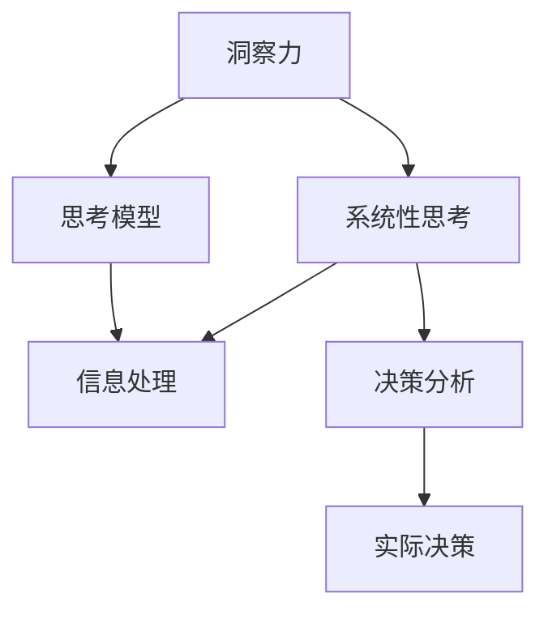

                 

# 理解洞察力的技巧：培养系统性思考能力

> 关键词：洞察力,系统性思考,思考模型,信息处理,决策分析,应用案例

## 1. 背景介绍

### 1.1 问题由来
在信息爆炸的时代，海量数据和复杂信息充斥着我们的日常生活和工作。如何从中抽取有价值的信息，理解其背后的逻辑和模式，做出明智的决策，成为每个从业者面临的挑战。洞察力，即深入理解复杂信息、发现关键趋势和模式的能力，对于在信息过载中保持竞争优势至关重要。

### 1.2 问题核心关键点
1. **洞察力的定义**：洞察力是指从大量数据和信息中发现隐藏模式、趋势和关联的能力，从而做出更明智的决策。
2. **系统性思考**：系统性思考是指从整体和全局视角出发，分析和理解复杂系统的各个组成部分和相互作用，发现潜在的因果关系和优化机会。
3. **思考模型**：思考模型是指导人们如何理解和分析复杂系统的结构化框架，帮助人们从系统的视角出发，系统性地探索和解释问题。
4. **信息处理**：信息处理是指对数据和信息进行收集、清洗、筛选、分析和解释的过程，是培养洞察力的基础。
5. **决策分析**：决策分析是将洞察力和系统性思考应用于实际决策的过程，旨在最大化决策的准确性和效率。

这些核心概念共同构成了培养和应用洞察力的基础框架，帮助人们在复杂环境中保持竞争优势。

## 2. 核心概念与联系

### 2.1 核心概念概述

为了更好地理解如何培养和应用洞察力，我们将介绍几个关键概念及其之间的联系：

1. **洞察力**：通过深入分析和理解复杂信息，发现数据背后的模式和关联，从而做出更准确和高效的决策。
2. **系统性思考**：从全局和系统视角出发，分析信息之间的因果关系和相互作用，发现潜在的优化机会。
3. **思考模型**：系统化、结构化的思考框架，帮助理解和分析复杂系统，寻找解决方案。
4. **信息处理**：数据收集、清洗、分析和解释的过程，是洞察力的基础。
5. **决策分析**：将洞察力和系统性思考应用于实际决策，最大化决策的准确性和效率。

这些概念之间的联系可以通过以下Mermaid流程图来展示：



这个流程图展示了各概念之间的相互作用：

- 洞察力依赖于系统性思考和思考模型，用于发现数据中的模式和关联。
- 信息处理提供数据基础，是洞察力的重要组成部分。
- 决策分析将洞察力和系统性思考应用于实际决策，提升决策质量。

## 3. 核心算法原理 & 具体操作步骤

### 3.1 算法原理概述

培养和应用洞察力，本质上是一个系统化、结构化的过程，涉及信息处理、模型构建、分析和决策等多个环节。其核心原理可以概括为以下几个方面：

1. **信息收集和清洗**：从多个数据源收集相关信息，清洗和筛选数据，确保数据质量和一致性。
2. **数据可视化**：使用数据可视化工具，将复杂数据转化为直观的图表和图形，帮助识别数据中的模式和趋势。
3. **模型构建**：根据问题的特点，选择合适的模型（如回归、分类、聚类等），对数据进行建模分析。
4. **分析和解释**：利用模型对数据进行分析，解释分析结果，发现数据背后的因果关系和关联。
5. **决策制定**：将分析结果应用于实际决策，评估决策效果，并根据反馈不断调整和优化。

### 3.2 算法步骤详解

基于上述原理，培养和应用洞察力的操作步骤可以分为以下几个步骤：

1. **数据收集与清洗**：从多个数据源收集相关信息，清洗数据以去除噪音和不一致，确保数据质量和一致性。

2. **数据可视化**：使用如Matplotlib、Seaborn、Tableau等工具，将数据转化为直观的图表和图形，帮助识别数据中的模式和趋势。

3. **模型选择与构建**：根据问题的特点，选择合适的模型（如回归、分类、聚类等），对数据进行建模分析。

4. **分析和解释**：利用模型对数据进行分析，解释分析结果，发现数据背后的因果关系和关联。

5. **决策制定**：将分析结果应用于实际决策，评估决策效果，并根据反馈不断调整和优化。

### 3.3 算法优缺点

基于系统性思考的洞察力培养方法，具有以下优点：

1. **全局视角**：从整体和系统视角出发，全面分析问题的各个方面，避免片面思考。
2. **逻辑严密**：通过系统性思考模型指导分析，确保分析过程的逻辑性和严密性。
3. **结果可靠**：通过多维度、多角度的数据分析，提高决策的可靠性和准确性。

同时，该方法也存在一些局限性：

1. **复杂度较高**：需要构建和应用复杂的思考模型，对分析者的要求较高。
2. **时间成本大**：数据收集、清洗和分析过程较为耗时，需要大量时间和资源。
3. **解释难度大**：复杂的分析过程和模型结果，可能难以解释和理解。

尽管如此，系统性思考的洞察力培养方法在处理复杂问题时，仍然具有不可替代的优势，能够显著提升决策的科学性和准确性。

### 3.4 算法应用领域

基于系统性思考的洞察力培养方法，在多个领域都有广泛的应用，例如：

1. **金融投资**：通过系统性思考模型，分析宏观经济和市场数据，发现潜在的投资机会，优化投资组合。
2. **企业战略**：利用系统性思考方法，全面分析市场环境、竞争态势和内部资源，制定科学的企业战略。
3. **项目管理**：通过系统性思考分析项目风险、资源配置和进度安排，优化项目管理和执行。
4. **风险管理**：系统性思考分析风险因素和潜在影响，制定风险应对策略，提升风险管理能力。
5. **数据分析**：应用系统性思考模型，对数据进行多角度分析，发现数据背后的关联和趋势。

## 4. 数学模型和公式 & 详细讲解

### 4.1 数学模型构建

在培养和应用洞察力的过程中，数学模型和公式提供了强大的工具支持。以下是一个简单的系统性思考模型及其公式示例：

- **回归模型**：用于建立自变量和因变量之间的关系，公式为：$y = \beta_0 + \beta_1x_1 + \beta_2x_2 + \ldots + \beta_nx_n + \epsilon$
- **分类模型**：用于将数据分为不同类别，公式为：$P(y = 1|x) = \frac{e^{\beta_0 + \beta_1x_1 + \beta_2x_2 + \ldots + \beta_nx_n}}{1 + \sum_{i=1}^n e^{\beta_ix_i}}$
- **聚类模型**：用于将数据分组，公式为：$k-means(x) = \min_k \sum_{i=1}^n \|x_i - \mu_k\|^2$

### 4.2 公式推导过程

以回归模型为例，推导其公式：

假设有一个线性回归模型 $y = \beta_0 + \beta_1x_1 + \beta_2x_2 + \ldots + \beta_nx_n + \epsilon$，其中 $\beta$ 为回归系数，$x$ 为自变量，$y$ 为因变量，$\epsilon$ 为误差项。根据最小二乘法原理，求解回归系数 $\beta$：

$$
\beta = (X^TX)^{-1}X^Ty
$$

其中 $X$ 为自变量的设计矩阵，$y$ 为因变量的向量。求解过程如下：

1. 计算 $X^TX$ 的逆矩阵 $(X^TX)^{-1}$
2. 计算 $X^Ty$
3. 计算 $\beta = (X^TX)^{-1}X^Ty$

### 4.3 案例分析与讲解

以下以一个简单的金融投资案例来展示系统性思考模型的应用：

假设某投资者希望投资于股票市场，并希望通过系统性思考模型分析市场数据，发现潜在的投资机会。步骤如下：

1. **数据收集**：收集市场的历史股价、交易量、行业数据等。
2. **数据清洗**：清洗数据，去除噪音和异常值，确保数据质量和一致性。
3. **数据可视化**：使用图表工具将数据可视化，识别出市场趋势和波动。
4. **回归分析**：建立股价与交易量、行业数据等之间的回归模型，分析它们之间的相关性。
5. **决策制定**：根据回归模型分析结果，选择具有高收益潜力的股票进行投资。

## 5. 项目实践：代码实例和详细解释说明

### 5.1 开发环境搭建

在进行系统性思考和数据分析的实践前，我们需要准备好开发环境。以下是使用Python进行Pandas开发的环境配置流程：

1. 安装Anaconda：从官网下载并安装Anaconda，用于创建独立的Python环境。

2. 创建并激活虚拟环境：
```bash
conda create -n pandas-env python=3.8 
conda activate pandas-env
```

3. 安装Pandas：
```bash
conda install pandas
```

4. 安装其他工具包：
```bash
pip install numpy matplotlib seaborn scikit-learn jupyter notebook ipython
```

完成上述步骤后，即可在`pandas-env`环境中开始系统性思考和数据分析的实践。

### 5.2 源代码详细实现

下面以金融投资数据为例，展示使用Pandas进行回归分析的代码实现：

```python
import pandas as pd
import numpy as np
import matplotlib.pyplot as plt
import seaborn as sns
from sklearn.linear_model import LinearRegression

# 读取数据
data = pd.read_csv('stock_data.csv')

# 数据清洗
data = data.dropna()  # 删除缺失值
data = data.drop_duplicates()  # 删除重复值

# 数据可视化
sns.scatterplot(x='price', y='volume', data=data)
plt.xlabel('Price')
plt.ylabel('Volume')
plt.show()

# 模型构建和分析
X = data[['price', 'volume', 'industry']]
y = data['shares']
model = LinearRegression()
model.fit(X, y)

# 模型预测和解释
y_pred = model.predict(X)
print('模型截距:', model.intercept_)
print('模型系数:', model.coef_)
print('R^2:', model.score(X, y))
```

### 5.3 代码解读与分析

让我们再详细解读一下关键代码的实现细节：

**数据读取与清洗**：
- `pd.read_csv`：读取CSV格式的数据文件。
- `dropna`：删除包含缺失值的行。
- `drop_duplicates`：删除重复的行。

**数据可视化**：
- `sns.scatterplot`：使用Seaborn库绘制散点图，展示股价与交易量之间的关系。

**模型构建和分析**：
- `X`和`y`：定义自变量和因变量。
- `LinearRegression`：使用Scikit-Learn库的线性回归模型。
- `fit`：训练模型，求解回归系数。

**模型预测和解释**：
- `predict`：使用训练好的模型进行预测。
- `intercept_`和`coef_`：模型的截距和系数。
- `score`：计算模型在测试集上的R^2值，表示模型的拟合程度。

通过上述代码，我们可以看到，Pandas和Scikit-Learn库的结合，可以方便地进行数据分析和模型构建。开发者可以根据具体问题，灵活组合和应用这些工具。

## 6. 实际应用场景

### 6.1 企业战略规划

在系统性思考和数据分析的帮助下，企业可以全面分析市场环境、竞争态势和内部资源，制定科学的企业战略。具体步骤如下：

1. **市场分析**：使用系统性思考模型，分析宏观经济、行业趋势和竞争态势。
2. **资源评估**：利用数据分析工具，评估企业内部资源和能力。
3. **战略制定**：结合市场分析和资源评估，制定科学的企业战略。

通过系统性思考和数据分析，企业可以避免片面思考，全面考虑各方面因素，制定更具竞争力的战略。

### 6.2 风险管理

风险管理是企业运营中的重要环节。系统性思考和数据分析可以帮助企业识别和评估风险因素，制定有效的风险管理策略。具体步骤如下：

1. **风险识别**：使用系统性思考模型，分析企业面临的风险因素和潜在影响。
2. **风险评估**：利用数据分析工具，评估风险的概率和影响程度。
3. **风险应对**：根据风险评估结果，制定相应的风险应对策略。

通过系统性思考和数据分析，企业可以全面识别和管理风险，提高风险管理的效率和效果。

## 7. 工具和资源推荐

### 7.1 学习资源推荐

为了帮助开发者系统掌握系统性思考和数据分析的理论基础和实践技巧，这里推荐一些优质的学习资源：

1. 《系统性思考与数据分析》系列博文：由系统性思考和数据分析专家撰写，深入浅出地介绍了系统性思考模型的原理和应用。

2. CS229《机器学习》课程：斯坦福大学开设的机器学习明星课程，涵盖系统性思考和数据分析的基础理论和方法。

3. 《Python数据科学手册》书籍：详细介绍了使用Python进行数据分析的各个步骤，包括数据清洗、可视化、建模等。

4. Kaggle：全球知名的数据科学竞赛平台，提供大量高质量的数据集和实践机会，帮助开发者提升系统性思考和数据分析能力。

5. Scikit-Learn官方文档：Scikit-Learn库的官方文档，提供了海量模型和算法的详细解释和样例代码，是系统性思考和数据分析的重要参考。

通过对这些资源的学习实践，相信你一定能够快速掌握系统性思考和数据分析的精髓，并应用于实际的业务问题中。

### 7.2 开发工具推荐

高效的开发离不开优秀的工具支持。以下是几款用于系统性思考和数据分析开发的常用工具：

1. Python：Python是系统性思考和数据分析的重要语言，具有丰富的第三方库和工具支持。
2. Jupyter Notebook：交互式编程环境，方便进行数据分析和模型验证。
3. Pandas：数据处理和分析库，支持高效的数据清洗、切片和统计。
4. Matplotlib：数据可视化库，支持绘制各种类型的图表和图形。
5. Seaborn：高级数据可视化库，支持绘制复杂的数据分布图和统计图。
6. Scikit-Learn：机器学习库，提供了丰富的模型和算法，支持数据分析和建模。

合理利用这些工具，可以显著提升系统性思考和数据分析的开发效率，加快创新迭代的步伐。

### 7.3 相关论文推荐

系统性思考和数据分析的发展源于学界的持续研究。以下是几篇奠基性的相关论文，推荐阅读：

1. 《系统性思考与数据分析：理论与实践》：系统性思考和数据分析领域的经典著作，深入探讨了系统性思考模型和数据分析技术。

2. 《回归分析：理论、方法与应用》：详细介绍了回归模型的理论基础和实际应用，是数据分析的重要参考。

3. 《机器学习基础》：介绍机器学习的基本概念和算法，是系统性思考和数据分析的重要基础。

4. 《数据科学导论》：全面介绍了数据科学的基本概念和应用，涵盖数据处理、建模和可视化等各个方面。

这些论文代表了大语言模型微调技术的发展脉络。通过学习这些前沿成果，可以帮助研究者把握学科前进方向，激发更多的创新灵感。

## 8. 总结：未来发展趋势与挑战

### 8.1 总结

本文对系统性思考和数据分析的理论基础和实践技巧进行了全面系统的介绍。首先阐述了系统性思考和数据分析的研究背景和意义，明确了系统性思考在培养和应用洞察力中的核心作用。其次，从原理到实践，详细讲解了系统性思考的数学模型和操作步骤，给出了系统性思考任务开发的完整代码实例。同时，本文还广泛探讨了系统性思考在企业战略规划、风险管理等多个领域的应用前景，展示了系统性思考范式的巨大潜力。此外，本文精选了系统性思考和数据分析的相关学习资源，力求为读者提供全方位的技术指引。

通过本文的系统梳理，可以看到，系统性思考和数据分析在处理复杂问题时，具有不可替代的优势，能够显著提升决策的科学性和准确性。未来，伴随系统性思考模型的不断演进和优化，相信系统性思考范式将成为决策分析的重要工具，在各行各业中发挥越来越重要的作用。

### 8.2 未来发展趋势

展望未来，系统性思考和数据分析技术将呈现以下几个发展趋势：

1. **模型自动化**：自动化构建和应用系统性思考模型，减少人工干预，提高模型生成效率。
2. **多模态融合**：将文本、图像、视频等多模态数据融合到系统性思考模型中，提升模型理解和分析复杂数据的能力。
3. **实时分析**：实时采集和分析数据，提供即时的决策支持，满足快速变化的市场需求。
4. **大数据分析**：利用大数据技术，分析海量数据，发现数据背后的深层模式和趋势。
5. **AI辅助**：结合人工智能技术，自动进行数据清洗、分析和可视化，提升分析效率和精度。

以上趋势凸显了系统性思考和数据分析技术的广阔前景。这些方向的探索发展，必将进一步提升系统性思考模型的性能和应用范围，为决策分析提供更强大的工具支持。

### 8.3 面临的挑战

尽管系统性思考和数据分析技术已经取得了瞩目成就，但在迈向更加智能化、普适化应用的过程中，它仍面临着诸多挑战：

1. **数据质量问题**：数据收集和清洗过程中，可能会出现数据不完整、噪音较多等问题，影响分析结果的可靠性。
2. **模型复杂度**：系统性思考模型往往结构复杂，难以理解和解释，可能引入新的问题。
3. **资源需求大**：数据量和计算量的增加，需要更多的资源支持，如高性能计算设备、大数据存储等。
4. **解释性不足**：系统性思考模型的结果往往难以解释，可能难以满足高风险应用的要求。
5. **隐私保护**：数据分析过程中，可能涉及个人隐私数据，需要遵守数据隐私保护法规。

这些挑战需要在未来的研究中不断克服，才能使系统性思考和数据分析技术进一步成熟和完善。

### 8.4 研究展望

面对系统性思考和数据分析所面临的挑战，未来的研究需要在以下几个方面寻求新的突破：

1. **数据预处理技术**：开发更高效的数据清洗和预处理技术，提升数据质量，减少噪音和偏差。
2. **模型解释性**：开发更易于理解和解释的系统性思考模型，提升模型的可解释性。
3. **资源优化技术**：优化模型结构和计算图，提升模型性能，降低资源消耗。
4. **隐私保护技术**：开发隐私保护技术，确保数据隐私和安全。
5. **多模态融合技术**：结合多模态数据，提升系统性思考模型的理解和分析能力。

这些研究方向的探索，必将引领系统性思考和数据分析技术迈向更高的台阶，为决策分析提供更全面、更高效的工具支持。

## 9. 附录：常见问题与解答

**Q1：系统性思考和数据分析是否适用于所有业务场景？**

A: 系统性思考和数据分析适用于大多数业务场景，特别是在处理复杂、多变量问题时，具有显著的优势。但对于一些简单、直接的问题，可能效率较低，不如直接使用简单统计方法。

**Q2：如何选择适合的系统性思考模型？**

A: 选择适合的系统性思考模型，需要考虑问题的特点、数据的类型和规模。例如，对于线性关系问题，可以选择回归模型；对于分类问题，可以选择分类模型；对于聚类问题，可以选择聚类模型。

**Q3：系统性思考和数据分析需要哪些资源支持？**

A: 系统性思考和数据分析需要高性能计算设备、大数据存储、专业技能和工具支持。例如，使用Pandas和Scikit-Learn库进行数据分析，使用Jupyter Notebook进行交互式编程。

**Q4：系统性思考和数据分析的实施步骤有哪些？**

A: 系统性思考和数据分析的实施步骤包括数据收集与清洗、数据可视化、模型构建与分析、结果解释与应用。每一步都需要根据具体问题进行调整和优化。

**Q5：系统性思考和数据分析的实际应用场景有哪些？**

A: 系统性思考和数据分析的实际应用场景包括企业战略规划、风险管理、市场营销、客户分析、产品推荐等。这些场景中，系统性思考和数据分析可以显著提升决策的科学性和准确性。

---

作者：禅与计算机程序设计艺术 / Zen and the Art of Computer Programming

