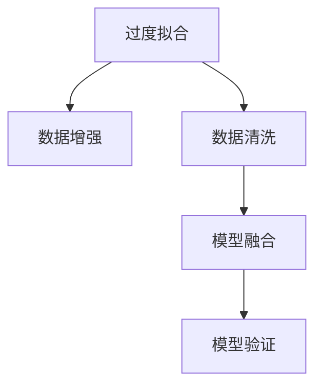

                 

# 理解洞察力的误区：避免跳跃式结论

在探索人工智能的旅程中，洞察力是一个不可或缺的组成部分。它指的是我们如何从数据中提取有用的信息，并基于这些信息做出合理的决策。然而，当我们的洞察力受到误区的干扰时，就容易陷入错误或者跳跃式的结论，导致决策失误。本文将深入探讨洞察力的误区，并提出一些避免跳跃式结论的方法。

## 1. 背景介绍

### 1.1 问题由来

在人工智能的各个领域，洞察力都是至关重要的。它不仅能够帮助我们理解和预测数据，还能指导我们如何优化模型和算法。然而，人类对数据的理解并非总是准确的。很多时候，我们的洞察力会因为一些误区而被误导，导致错误的决策。

这些误区通常包括过度拟合、数据偏差、选择性偏差等。过度拟合是指模型在训练数据上表现出色，但在新数据上却表现不佳。数据偏差则是指模型所依赖的数据存在偏见，无法代表真实世界的情况。选择性偏差则是指模型只关注某些数据，而忽略了其他重要的信息。

### 1.2 问题核心关键点

洞察力的误区通常源于我们对数据的错误理解。为了更好地理解这些误区，我们需要对数据进行深入的分析和处理。例如，通过数据增强、数据清洗等方法，可以提高数据的质量，减少数据偏差。此外，使用模型融合、模型验证等方法，可以帮助我们避免过度拟合。

## 2. 核心概念与联系

### 2.1 核心概念概述

为了更好地理解洞察力的误区，我们需要掌握一些关键的概念：

- **过度拟合**：指的是模型在训练数据上表现出色，但在新数据上却表现不佳。
- **数据偏差**：指的是模型所依赖的数据存在偏见，无法代表真实世界的情况。
- **选择性偏差**：指的是模型只关注某些数据，而忽略了其他重要的信息。
- **数据增强**：指的是通过增加数据量、改变数据分布等方法，提高模型的泛化能力。
- **数据清洗**：指的是通过去除噪声、处理缺失值等方法，提高数据的质量。
- **模型融合**：指的是将多个模型的结果进行组合，以提高整体的性能。
- **模型验证**：指的是通过验证集对模型的性能进行评估，避免过度拟合。

这些概念之间的逻辑关系可以通过以下Mermaid流程图来展示：



这个流程图展示了解洞察力的误区和应对方法之间的联系：

1. 过度拟合可以通过数据增强和数据清洗等方法来解决。
2. 数据偏差需要更深入的数据分析和处理。
3. 选择性偏差需要通过更全面的数据采集和分析来避免。

## 3. 核心算法原理 & 具体操作步骤

### 3.1 算法原理概述

避免洞察力的误区，需要从算法和数据处理两个方面进行考虑。在算法方面，我们通常使用正则化、Dropout等技术来避免过度拟合。在数据处理方面，我们需要进行数据增强、数据清洗等操作，以提高数据的质量。

### 3.2 算法步骤详解

**Step 1: 准备数据**

- 收集尽可能多的数据，并对其进行预处理，包括数据清洗、归一化等。
- 使用数据增强技术，增加数据量和改变数据分布。

**Step 2: 选择模型**

- 选择适合当前问题的模型，并进行超参数调优。
- 使用模型融合技术，将多个模型的结果进行组合。

**Step 3: 训练模型**

- 使用正则化技术，避免过度拟合。
- 使用模型验证技术，评估模型的性能。

**Step 4: 部署模型**

- 将模型部署到实际应用中，并进行监控和评估。

### 3.3 算法优缺点

- **优点**：
  - 避免过度拟合，提高模型的泛化能力。
  - 提高数据质量，减少数据偏差。
  - 通过模型融合，提高整体的性能。

- **缺点**：
  - 数据增强和数据清洗可能需要大量的时间和计算资源。
  - 模型融合可能导致模型复杂度增加，影响性能。

### 3.4 算法应用领域

避免洞察力的误区的方法在人工智能的各个领域都有广泛的应用，包括自然语言处理、计算机视觉、强化学习等。例如：

- 在自然语言处理中，可以使用数据增强、数据清洗等方法，提高语言模型的泛化能力。
- 在计算机视觉中，可以使用数据增强、模型融合等方法，提高图像识别的准确率。
- 在强化学习中，可以使用模型验证、数据增强等方法，提高策略的稳定性和泛化能力。

## 4. 数学模型和公式 & 详细讲解

### 4.1 数学模型构建

避免洞察力的误区的核心思想是通过正则化、Dropout等技术，减少模型对训练数据的依赖，提高泛化能力。常见的正则化方法包括L1正则化、L2正则化等。

### 4.2 公式推导过程

以L2正则化为例，其公式如下：

$$
\mathcal{L}(\theta) = \frac{1}{N}\sum_{i=1}^N \ell(y_i, \hat{y}_i) + \frac{\lambda}{2}\sum_{i=1}^d \theta_i^2
$$

其中，$\theta$ 为模型的参数，$\ell(y_i, \hat{y}_i)$ 为损失函数，$\lambda$ 为正则化参数。

### 4.3 案例分析与讲解

**案例1: 文本分类**

假设我们有一个文本分类任务，模型在训练集上表现出色，但在测试集上表现不佳。此时，我们需要通过正则化技术来避免过度拟合。

我们可以使用L2正则化技术，公式如下：

$$
\mathcal{L}(\theta) = \frac{1}{N}\sum_{i=1}^N \ell(y_i, \hat{y}_i) + \frac{\lambda}{2}\sum_{i=1}^d \theta_i^2
$$

其中，$d$ 为模型的参数个数，$\lambda$ 为正则化参数。通过调整 $\lambda$ 的值，可以控制模型的复杂度，从而避免过度拟合。

## 5. 项目实践：代码实例和详细解释说明

### 5.1 开发环境搭建

在进行项目实践前，我们需要准备好开发环境。以下是使用Python进行TensorFlow开发的环境配置流程：

1. 安装Anaconda：从官网下载并安装Anaconda，用于创建独立的Python环境。

2. 创建并激活虚拟环境：
```bash
conda create -n tf-env python=3.8 
conda activate tf-env
```

3. 安装TensorFlow：根据CUDA版本，从官网获取对应的安装命令。例如：
```bash
pip install tensorflow
```

4. 安装各类工具包：
```bash
pip install numpy pandas scikit-learn matplotlib tqdm jupyter notebook ipython
```

完成上述步骤后，即可在`tf-env`环境中开始项目实践。

### 5.2 源代码详细实现

下面我们以文本分类任务为例，给出使用TensorFlow对模型进行正则化处理的PyTorch代码实现。

```python
import tensorflow as tf
from tensorflow.keras.layers import Input, Dense, Dropout
from tensorflow.keras.models import Model

def create_model(input_dim, num_classes):
    inputs = Input(shape=(input_dim,))
    x = Dense(128, activation='relu')(inputs)
    x = Dropout(0.5)(x)
    x = Dense(64, activation='relu')(x)
    x = Dropout(0.5)(x)
    outputs = Dense(num_classes, activation='softmax')(x)
    
    model = Model(inputs=inputs, outputs=outputs)
    return model

model = create_model(input_dim=100, num_classes=10)
model.compile(optimizer='adam', loss='categorical_crossentropy', metrics=['accuracy'])

# 训练模型
model.fit(X_train, y_train, validation_data=(X_val, y_val), epochs=10, batch_size=32)

# 评估模型
model.evaluate(X_test, y_test)
```

在这个例子中，我们使用TensorFlow的Keras API来定义模型。模型中包含两个Dense层和一个Dropout层，用于正则化。

### 5.3 代码解读与分析

让我们再详细解读一下关键代码的实现细节：

**create_model函数**：
- 定义模型的输入、隐藏层和输出层。
- 使用Dropout层对模型进行正则化，减少过度拟合的风险。
- 定义模型的优化器、损失函数和评估指标。

**模型训练和评估**：
- 使用fit函数对模型进行训练，并在验证集上进行评估。
- 使用evaluate函数对模型进行测试，评估模型的性能。

## 6. 实际应用场景

### 6.1 智能推荐系统

在智能推荐系统中，避免洞察力的误区是非常重要的。推荐系统需要根据用户的历史行为和当前需求，推荐最合适的商品或内容。然而，由于推荐系统依赖于用户的历史数据，如果数据偏差或者选择性偏差严重，推荐系统就可能出现错误。

**案例**：
假设我们有一个推荐系统，发现推荐结果总是偏向于高销售额的商品，而忽略了用户的实际需求。此时，我们需要对数据进行清洗和分析，以减少数据偏差和选择性偏差。

**解决方法**：
- 使用数据清洗技术，去除噪音和异常值。
- 使用数据增强技术，增加用户的历史行为数据，减少选择性偏差。

### 6.2 图像识别

在图像识别任务中，避免洞察力的误区同样重要。图像识别模型依赖于大量的图像数据，如果数据偏差或者选择性偏差严重，模型的性能就会受到影响。

**案例**：
假设我们有一个图像识别模型，发现对于某些特定类别（如动物）的识别率较低。此时，我们需要对数据进行清洗和分析，以减少数据偏差和选择性偏差。

**解决方法**：
- 使用数据清洗技术，去除低质量的图像数据。
- 使用数据增强技术，增加特定类别的图像数据，减少选择性偏差。

## 7. 工具和资源推荐

### 7.1 学习资源推荐

为了帮助开发者系统掌握避免洞察力误区的理论基础和实践技巧，这里推荐一些优质的学习资源：

1. 《Python机器学习》系列博文：由TensorFlow和Keras的官方文档撰写，深入浅出地介绍了正则化、Dropout等技术。

2. Coursera《机器学习》课程：由斯坦福大学Andrew Ng教授主讲，系统介绍了机器学习的基本概念和算法。

3. 《深度学习》书籍：由Goodfellow等人撰写，全面介绍了深度学习的理论基础和实践技巧。

4. Kaggle数据集和竞赛：Kaggle提供了丰富的数据集和竞赛，是练习和验证模型的理想平台。

通过对这些资源的学习实践，相信你一定能够快速掌握避免洞察力误区的精髓，并用于解决实际的NLP问题。

### 7.2 开发工具推荐

高效的开发离不开优秀的工具支持。以下是几款用于避免洞察力误区的开发工具：

1. TensorFlow：由Google主导开发的深度学习框架，适合大规模工程应用。同样有丰富的预训练语言模型资源。

2. PyTorch：基于Python的开源深度学习框架，灵活动态的计算图，适合快速迭代研究。大部分预训练语言模型都有PyTorch版本的实现。

3. Keras：高层次的深度学习API，使用简单，适合初学者和快速原型开发。

4. Weights & Biases：模型训练的实验跟踪工具，可以记录和可视化模型训练过程中的各项指标，方便对比和调优。

5. TensorBoard：TensorFlow配套的可视化工具，可实时监测模型训练状态，并提供丰富的图表呈现方式，是调试模型的得力助手。

合理利用这些工具，可以显著提升避免洞察力误区的开发效率，加快创新迭代的步伐。

### 7.3 相关论文推荐

避免洞察力误区的研究源于学界的持续研究。以下是几篇奠基性的相关论文，推荐阅读：

1. Dropout: A Simple Way to Prevent Neural Networks from Overfitting（Dropout论文）：提出Dropout技术，通过随机失活神经元，减少模型对训练数据的依赖，提高泛化能力。

2. Batch Normalization: Accelerating Deep Network Training by Reducing Internal Covariate Shift（批标准化论文）：提出批标准化技术，通过标准化网络层输出，加速训练过程，减少数据偏差。

3. Regularization of Neural Networks using DropConnect（DropConnect论文）：提出DropConnect技术，通过随机失活网络权重，减少模型复杂度，提高泛化能力。

4. Early Stopping: A Simple Rule for Setting the Number of Epochs in the Training of a Neural Network（Early Stopping论文）：提出Early Stopping技术，通过监控验证集误差，避免过度拟合。

这些论文代表了大语言模型避免洞察力误区的发展脉络。通过学习这些前沿成果，可以帮助研究者把握学科前进方向，激发更多的创新灵感。

## 8. 总结：未来发展趋势与挑战

### 8.1 总结

本文对避免洞察力误区的原理进行了深入探讨，并提出了一些具体的操作方法。首先阐述了洞察力误区的定义和常见形式，明确了误区的潜在危害。其次，从算法和数据处理两个方面，详细讲解了避免误区的核心技术，包括正则化、Dropout、数据增强等。最后，本文还探讨了避免洞察力误区的应用场景，并推荐了相关的学习资源和开发工具。

通过本文的系统梳理，可以看到，避免洞察力误区的技术在人工智能的各个领域都有广泛的应用。无论是智能推荐系统、图像识别，还是其他类型的NLP任务，这些技术都能够显著提高模型的泛化能力和性能。未来，随着这些技术的不断演进，相信AI系统将能够更好地理解和应用人类的需求和行为，从而提升整体的智能化水平。

### 8.2 未来发展趋势

展望未来，避免洞察力误区的技术将呈现以下几个发展趋势：

1. 更加智能的数据清洗和增强技术：随着深度学习技术的发展，数据清洗和增强技术将变得更加智能，能够自动识别和处理数据偏差和选择性偏差。

2. 更加高效的模型融合和组合技术：模型融合和组合技术将变得更加高效，能够自动选择最优的模型组合，提高整体的性能。

3. 更加精细的正则化和Dropout技术：正则化和Dropout技术将变得更加精细，能够自动调整超参数，提高模型的泛化能力。

4. 更加全面的模型验证和评估方法：模型验证和评估方法将变得更加全面，能够自动检测和避免各种洞察力误区的风险。

这些趋势凸显了避免洞察力误区的技术的广阔前景。这些方向的探索发展，必将进一步提升AI系统的性能和应用范围，为人类认知智能的进化带来深远影响。

### 8.3 面临的挑战

尽管避免洞察力误区的技术已经取得了瞩目成就，但在迈向更加智能化、普适化应用的过程中，它仍面临着诸多挑战：

1. 数据获取的难度：避免洞察力误区的技术需要大量的数据支持，而获取高质量的数据可能非常困难。

2. 算力成本的限制：许多避免洞察力误区的技术需要高性能的计算资源，这可能会增加算力成本。

3. 模型的可解释性：避免洞察力误区的技术通常使用黑盒模型，难以解释其内部工作机制。

4. 模型的泛化能力：避免洞察力误区的技术需要保证模型的泛化能力，以适应不同的数据分布。

5. 模型的稳定性：避免洞察力误区的技术需要保证模型的稳定性，避免在极端情况下出现错误。

这些挑战都需要在未来的研究中加以解决，才能使得避免洞察力误区的技术更加实用和高效。

### 8.4 研究展望

未来，避免洞察力误区的技术需要从以下几个方面进行进一步研究：

1. 自动化的数据清洗和增强：开发更加智能的数据清洗和增强技术，能够自动识别和处理数据偏差和选择性偏差。

2. 可解释的模型结构：开发更加可解释的模型结构，方便解释模型的决策过程。

3. 跨模态数据的融合：探索如何将跨模态数据（如文本、图像、音频等）与深度学习模型进行结合，提高模型的泛化能力。

4. 动态调整的超参数：开发能够动态调整超参数的算法，以适应不同的数据分布和任务需求。

这些研究方向的探索，必将引领避免洞察力误区的技术迈向更高的台阶，为构建安全、可靠、可解释、可控的智能系统铺平道路。面向未来，避免洞察力误区的技术还需要与其他人工智能技术进行更深入的融合，如知识表示、因果推理、强化学习等，多路径协同发力，共同推动自然语言理解和智能交互系统的进步。只有勇于创新、敢于突破，才能不断拓展语言模型的边界，让智能技术更好地造福人类社会。

## 9. 附录：常见问题与解答

**Q1：避免洞察力误区的技术是否适用于所有NLP任务？**

A: 避免洞察力误区的技术在大多数NLP任务上都能取得不错的效果，特别是对于数据量较小的任务。但对于一些特定领域的任务，如医学、法律等，仅仅依靠通用语料预训练的模型可能难以很好地适应。此时需要在特定领域语料上进一步预训练，再进行微调，才能获得理想效果。此外，对于一些需要时效性、个性化很强的任务，如对话、推荐等，避免洞察力误区的技术也需要针对性的改进优化。

**Q2：如何选择合适的学习率？**

A: 避免洞察力误区的技术通常使用较小的学习率，以避免破坏模型权重。一般建议从0.001开始调参，逐步减小学习率，直至收敛。也可以使用warmup策略，在开始阶段使用较小的学习率，再逐渐过渡到预设值。需要注意的是，不同的优化器(如AdamW、Adafactor等)以及不同的学习率调度策略，可能需要设置不同的学习率阈值。

**Q3：避免洞察力误区的技术在落地部署时需要注意哪些问题？**

A: 将避免洞察力误区的技术转化为实际应用，还需要考虑以下因素：

1. 模型裁剪：去除不必要的层和参数，减小模型尺寸，加快推理速度。

2. 量化加速：将浮点模型转为定点模型，压缩存储空间，提高计算效率。

3. 服务化封装：将模型封装为标准化服务接口，便于集成调用。

4. 弹性伸缩：根据请求流量动态调整资源配置，平衡服务质量和成本。

5. 监控告警：实时采集系统指标，设置异常告警阈值，确保服务稳定性。

6. 安全防护：采用访问鉴权、数据脱敏等措施，保障数据和模型安全。

合理利用这些工具，可以显著提升避免洞察力误区的开发效率，加快创新迭代的步伐。

