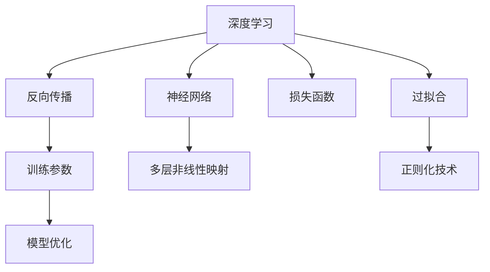

                 

## 1. 背景介绍

### 1.1 问题由来

近年来，机器学习技术的快速发展让AI领域逐渐走入公众视野，从简单的图像识别到复杂的自然语言处理，机器学习在各个领域的应用越来越广泛。然而，传统机器学习（ML）方法主要依赖特征工程，需要人工设计合适的特征，而深度学习（DL）的出现，使得机器学习模型可以直接从原始数据中自动学习到表示，解决了特征工程复杂度高、耗时长的痛点。

### 1.2 问题核心关键点

深度学习，特别是卷积神经网络（CNN）和循环神经网络（RNN）的提出，极大地提高了机器学习的自动化水平，从传统的“浅层学习”发展到“深度学习”，开启了AI新的时代。但是，深度学习仍然面临诸多挑战，如过拟合、训练时间长、参数过多等。

本文将从深度学习的核心概念出发，详细讲解深度学习的原理和应用，探讨如何从表层学习到深度学习的转变，从而帮助读者深入理解深度学习技术，掌握实际应用中的关键技巧。

### 1.3 问题研究意义

深度学习技术的迅速发展，为人工智能的各个领域带来了革命性的变革，提升了处理复杂问题的能力。然而，深度学习的复杂性和计算需求也带来了新的挑战。如何在有限的计算资源下，提高模型的性能和泛化能力，是当前深度学习研究的重要课题。

本文将对深度学习的核心算法、模型结构和应用场景进行深入探讨，并结合实际项目实践，阐述如何有效地进行深度学习模型的开发和优化。通过系统性地理解深度学习的原理和应用，能够更好地应对未来AI技术发展中的挑战，推动人工智能技术的创新和应用。

## 2. 核心概念与联系

### 2.1 核心概念概述

为更好地理解深度学习的原理和应用，本节将介绍几个密切相关的核心概念：

- 深度学习（Deep Learning）：一种基于神经网络的机器学习方法，通过多层非线性映射，自动学习数据的复杂特征表示，解决传统机器学习中的特征工程问题。
- 神经网络（Neural Network）：由大量人工神经元（或称节点）和连接组成的计算图，用于模拟人类神经元间的信息传递和处理。
- 反向传播（Backpropagation）：一种训练神经网络的方法，通过反向传播误差来更新网络参数，使得网络输出更接近目标值。
- 损失函数（Loss Function）：用于衡量模型预测值与真实值之间的差距，训练过程中通过最小化损失函数来优化模型参数。
- 过拟合（Overfitting）：指模型在训练数据上表现良好，但在测试数据上表现较差的现象，通常通过正则化技术来解决。

这些核心概念之间的逻辑关系可以通过以下Mermaid流程图来展示：



这个流程图展示了大语言模型的核心概念及其之间的关系：

1. 深度学习是一种基于神经网络的机器学习方法。
2. 神经网络由多层非线性映射组成，用于自动学习数据的表示。
3. 反向传播用于训练神经网络，通过反向传播误差更新网络参数。
4. 损失函数用于衡量模型预测值与真实值之间的差距。
5. 过拟合需要通过正则化技术来解决，确保模型泛化能力。

这些概念共同构成了深度学习的学习框架，使得深度学习模型能够在复杂的任务中取得优异的性能。

## 3. 核心算法原理 & 具体操作步骤
### 3.1 算法原理概述

深度学习算法主要基于神经网络模型，通过多层非线性变换，从原始数据中自动学习到高层次的表示，从而提升模型的泛化能力。深度学习的核心思想是利用多层神经网络模拟人类神经元间的信息传递和处理，通过反向传播算法不断调整网络参数，最小化损失函数，使得模型输出更加接近目标值。

### 3.2 算法步骤详解

深度学习的训练通常分为以下几个关键步骤：

1. **数据准备**：收集和预处理训练数据，确保数据的多样性和完备性。
2. **模型定义**：定义神经网络结构，包括输入层、隐藏层和输出层，确定网络参数的初始值。
3. **前向传播**：将输入数据通过网络层进行正向传递，计算预测输出。
4. **损失计算**：计算模型预测输出与真实值之间的误差，使用损失函数进行量化。
5. **反向传播**：通过反向传播误差，更新网络参数，使得模型输出更加接近真实值。
6. **模型评估**：在测试集上评估模型性能，通过误差指标衡量模型泛化能力。

这些步骤通过迭代训练，不断优化模型参数，提升模型性能。

### 3.3 算法优缺点

深度学习算法具有以下优点：

- 自动化特征提取：不需要手动设计特征，可以自动学习到数据的高层次表示。
- 模型表达能力强大：多层非线性映射使得深度学习模型可以处理非常复杂的输入和输出。
- 泛化能力强：通过反向传播算法调整参数，使得模型可以适应新的数据。

但同时，深度学习算法也存在一些缺点：

- 计算需求高：大规模的神经网络和反向传播算法需要大量计算资源和时间。
- 过拟合风险高：如果训练数据不足或模型复杂度过高，容易出现过拟合现象。
- 模型可解释性差：深度学习模型通常被称为"黑盒"，难以解释其内部工作机制。

### 3.4 算法应用领域

深度学习技术在多个领域都有广泛应用，包括但不限于：

- 计算机视觉：如图像识别、物体检测、图像生成等。
- 自然语言处理：如文本分类、机器翻译、情感分析等。
- 语音识别：如语音识别、语音合成等。
- 游戏与推荐系统：如游戏AI、推荐算法等。
- 机器人学：如机器人控制、目标检测等。

深度学习技术的发展为这些领域带来了革命性的变革，推动了AI技术的不断进步。

## 4. 数学模型和公式 & 详细讲解 & 举例说明

### 4.1 数学模型构建

深度学习模型的核心是神经网络，其数学模型可以表示为：

$$
y = \sigma\left(W^T x + b\right)
$$

其中，$y$ 是模型输出，$x$ 是输入数据，$W$ 是权重矩阵，$b$ 是偏置向量，$\sigma$ 是激活函数。

### 4.2 公式推导过程

以最简单的全连接神经网络为例，进行公式推导：

设输入数据为 $x = [x_1, x_2, ..., x_n]$，权重矩阵为 $W = [w_{11}, w_{12}, ..., w_{1n}; w_{21}, w_{22}, ..., w_{2n}; ..., w_{m1}, w_{m2}, ..., w_{mn}]$，偏置向量为 $b = [b_1, b_2, ..., b_m]$，激活函数为 $\sigma$，则输出 $y$ 为：

$$
y = \sigma\left(W^T x + b\right) = \sigma\left(\sum_{i=1}^m \sum_{j=1}^n w_{ij}x_j + \sum_{i=1}^m b_i\right)
$$

反向传播算法的基本思想是，将误差从输出层反向传播回输入层，计算每个参数的梯度。设损失函数为 $L$，输出误差为 $\delta$，则误差传播公式为：

$$
\delta^{(i)} = \frac{\partial L}{\partial y^{(i)}} \sigma'(x^{(i)})
$$

其中，$\sigma'$ 是激活函数的导数。

### 4.3 案例分析与讲解

以卷积神经网络（CNN）为例，进行案例分析。

卷积神经网络主要用于图像处理任务，其核心思想是通过卷积操作提取图像的特征。CNN模型通常由多个卷积层和池化层组成，每层都有相应的权重矩阵和偏置向量。以LeNet模型为例，其数学模型可以表示为：

$$
y = \sigma\left(W_{conv}^T x_{conv} + b_{conv}\right)
$$

其中，$x_{conv}$ 是卷积层的输入，$W_{conv}$ 是卷积核权重矩阵，$b_{conv}$ 是偏置向量。

在LeNet模型中，卷积层通过滑动窗口对输入数据进行卷积操作，提取特征。池化层则对卷积层的输出进行下采样，减少计算量。通过多层卷积和池化操作，LeNet模型可以逐步提取图像的低级特征和高级特征，最终输出分类结果。

## 5. 项目实践：代码实例和详细解释说明

### 5.1 开发环境搭建

在进行深度学习项目实践前，我们需要准备好开发环境。以下是使用Python进行TensorFlow开发的环境配置流程：

1. 安装Anaconda：从官网下载并安装Anaconda，用于创建独立的Python环境。

2. 创建并激活虚拟环境：
```bash
conda create -n tf-env python=3.8 
conda activate tf-env
```

3. 安装TensorFlow：根据CUDA版本，从官网获取对应的安装命令。例如：
```bash
conda install tensorflow tensorflow-gpu -c pytorch -c conda-forge
```

4. 安装各类工具包：
```bash
pip install numpy pandas scikit-learn matplotlib tqdm jupyter notebook ipython
```

完成上述步骤后，即可在`tf-env`环境中开始深度学习项目的开发。

### 5.2 源代码详细实现

下面我们以图像分类任务为例，给出使用TensorFlow对LeNet模型进行训练的代码实现。

首先，定义LeNet模型：

```python
import tensorflow as tf

class LeNet(tf.keras.Model):
    def __init__(self):
        super(LeNet, self).__init__()
        self.conv1 = tf.keras.layers.Conv2D(6, 5, activation='relu')
        self.pool1 = tf.keras.layers.MaxPooling2D(2, 2)
        self.conv2 = tf.keras.layers.Conv2D(16, 5, activation='relu')
        self.pool2 = tf.keras.layers.MaxPooling2D(2, 2)
        self.flatten = tf.keras.layers.Flatten()
        self.fc1 = tf.keras.layers.Dense(120, activation='relu')
        self.fc2 = tf.keras.layers.Dense(84, activation='relu')
        self.fc3 = tf.keras.layers.Dense(10, activation='softmax')

    def call(self, x):
        x = self.conv1(x)
        x = self.pool1(x)
        x = self.conv2(x)
        x = self.pool2(x)
        x = self.flatten(x)
        x = self.fc1(x)
        x = self.fc2(x)
        return self.fc3(x)
```

然后，定义数据集和加载器：

```python
(train_images, train_labels), (test_images, test_labels) = tf.keras.datasets.mnist.load_data()

train_images = train_images.reshape((60000, 28, 28, 1))
train_images = train_images / 255.0

test_images = test_images.reshape((10000, 28, 28, 1))
test_images = test_images / 255.0
```

接着，定义训练和评估函数：

```python
def train_step(images, labels):
    with tf.GradientTape() as tape:
        logits = model(images)
        loss = tf.keras.losses.sparse_categorical_crossentropy(labels, logits)
    gradients = tape.gradient(loss, model.trainable_variables)
    optimizer.apply_gradients(zip(gradients, model.trainable_variables))

def evaluate_step(images, labels):
    logits = model(images)
    predictions = tf.argmax(logits, axis=1)
    accuracy = tf.metrics.sparse_categorical_accuracy(labels, predictions)
    return accuracy
```

最后，启动训练流程并在测试集上评估：

```python
model = LeNet()

optimizer = tf.keras.optimizers.SGD(learning_rate=0.1)

epochs = 10

for epoch in range(epochs):
    for i in range(0, 60000, 100):
        train_step(train_images[i:i+100], train_labels[i:i+100])
    accuracy = evaluate_step(test_images, test_labels)
    print(f'Epoch {epoch+1}, accuracy: {accuracy.numpy()}')
```

以上就是使用TensorFlow对LeNet模型进行图像分类任务训练的完整代码实现。可以看到，TensorFlow提供了强大的API支持，使得模型定义、数据加载、训练过程等都可以用简洁的代码完成。

### 5.3 代码解读与分析

让我们再详细解读一下关键代码的实现细节：

**LeNet类**：
- `__init__`方法：定义了LeNet模型的多个层次，包括卷积层、池化层和全连接层，并设置了激活函数和参数初始值。
- `call`方法：定义了LeNet模型的前向传播过程，即将输入数据通过各层计算得到输出。

**训练和评估函数**：
- `train_step`方法：定义了反向传播和参数更新的过程，通过梯度下降算法更新模型参数。
- `evaluate_step`方法：定义了模型在测试集上的评估过程，通过计算准确率评估模型性能。

**训练流程**：
- 定义了训练的轮数，在每个epoch内对训练集进行迭代训练。
- 在每个batch上调用训练函数，更新模型参数。
- 在每个epoch结束后，调用评估函数在测试集上评估模型性能，输出准确率。

可以看到，TensorFlow使得深度学习模型的开发和训练变得异常简洁和高效。开发者可以将更多精力放在模型设计和参数调整上，而不必过多关注底层实现细节。

当然，工业级的系统实现还需考虑更多因素，如模型保存和部署、超参数自动搜索、多卡训练等。但核心的训练范式基本与此类似。

## 6. 实际应用场景

### 6.1 图像识别

深度学习技术在图像识别任务上取得了显著的进展。通过卷积神经网络（CNN）对图像进行特征提取和分类，可以识别出复杂的物体、场景和人物。

在实际应用中，深度学习模型已经广泛应用于医疗影像诊断、自动驾驶、视频监控等领域。例如，在医疗影像诊断中，通过对病人的CT、MRI等医学影像进行分类，可以辅助医生进行疾病诊断，提高诊断的准确性和效率。

### 6.2 自然语言处理

深度学习技术在自然语言处理（NLP）任务上也取得了突破性的进展。通过循环神经网络（RNN）和长短期记忆网络（LSTM）等模型，可以对自然语言进行分类、生成和翻译。

在实际应用中，深度学习模型已经广泛应用于机器翻译、情感分析、文本摘要等领域。例如，在机器翻译中，通过将源语言文本输入到深度学习模型中，自动生成目标语言文本，可以显著提升翻译的速度和质量。

### 6.3 语音识别

深度学习技术在语音识别领域也取得了显著的进展。通过卷积神经网络（CNN）和循环神经网络（RNN）等模型，可以对语音信号进行特征提取和分类，实现语音识别和语音合成。

在实际应用中，深度学习模型已经广泛应用于智能音箱、语音助手、电话客服等领域。例如，在智能音箱中，通过对用户的语音指令进行识别和理解，可以自动执行相应的操作，提升用户体验。

### 6.4 未来应用展望

随着深度学习技术的不断发展，深度学习技术的应用场景将更加广泛，推动人工智能技术的不断进步。

在智慧医疗领域，深度学习模型可以辅助医生进行疾病诊断、药物研发等任务，提升医疗服务的智能化水平。

在智能教育领域，深度学习模型可以用于个性化推荐、自动批改作业等任务，因材施教，促进教育公平，提高教学质量。

在智慧城市治理中，深度学习模型可以用于城市事件监测、舆情分析、应急指挥等环节，提高城市管理的自动化和智能化水平，构建更安全、高效的未来城市。

此外，在企业生产、社会治理、文娱传媒等众多领域，深度学习技术也将不断涌现，为经济社会发展注入新的动力。

## 7. 工具和资源推荐
### 7.1 学习资源推荐

为了帮助开发者系统掌握深度学习的理论基础和实践技巧，这里推荐一些优质的学习资源：

1. 《深度学习》（Ian Goodfellow）：深度学习的经典教材，系统介绍了深度学习的基本原理、算法和应用。
2. CS231n《卷积神经网络》课程：斯坦福大学开设的深度学习课程，重点讲解卷积神经网络，覆盖图像分类、目标检测等任务。
3. CS224n《自然语言处理》课程：斯坦福大学开设的NLP课程，涵盖深度学习在自然语言处理中的应用，包括文本分类、机器翻译等任务。
4. CS239《深度学习与语音识别》课程：斯坦福大学开设的语音识别课程，涵盖深度学习在语音识别中的应用，包括语音识别、语音合成等任务。
5. DeepLearning.ai：Andrew Ng创办的深度学习在线课程平台，提供多门深度学习相关课程，适合初学者和进阶学习者。

通过对这些资源的学习实践，相信你一定能够快速掌握深度学习的精髓，并用于解决实际的深度学习问题。
###  7.2 开发工具推荐

高效的开发离不开优秀的工具支持。以下是几款用于深度学习开发的常用工具：

1. TensorFlow：由Google主导开发的深度学习框架，功能丰富，支持GPU加速，适合大规模工程应用。
2. PyTorch：由Facebook开发的深度学习框架，动态计算图，适合快速迭代研究。
3. Keras：高层API，提供简单易用的接口，支持TensorFlow、Theano等多种深度学习框架。
4. Caffe：由Berkeley Vision and Learning Center开发的深度学习框架，适合计算机视觉任务。
5. MXNet：由Apache开发的深度学习框架，支持多语言和多设备，适合分布式计算。

合理利用这些工具，可以显著提升深度学习项目的开发效率，加快创新迭代的步伐。

### 7.3 相关论文推荐

深度学习技术的发展源于学界的持续研究。以下是几篇奠基性的相关论文，推荐阅读：

1. AlexNet: ImageNet Classification with Deep Convolutional Neural Networks（ImageNet分类：使用深度卷积神经网络的图像识别）：提出AlexNet模型，开启深度学习在图像识别领域的革命。
2. ImageNet Classification with Deep Convolutional Neural Networks（AlexNet论文）：介绍AlexNet模型和反向传播算法的应用，推动深度学习在计算机视觉领域的应用。
3. Deep Speech 2: End-to-End Speech Recognition in English and Mandarin（Deep Speech 2：中英文端到端语音识别）：提出Deep Speech 2模型，推动深度学习在语音识别领域的应用。
4. Attention is All You Need（Transformer原论文）：提出Transformer模型，推动深度学习在自然语言处理领域的应用。
5. Sequence to Sequence Learning with Neural Networks（Seq2Seq论文）：提出Seq2Seq模型，推动深度学习在机器翻译、文本生成等任务中的应用。

这些论文代表了大深度学习技术的发展脉络。通过学习这些前沿成果，可以帮助研究者把握学科前进方向，激发更多的创新灵感。

## 8. 总结：未来发展趋势与挑战

### 8.1 总结

本文对深度学习的核心概念和应用进行了全面系统的介绍。首先阐述了深度学习的背景和研究意义，明确了深度学习在自动化特征提取和复杂问题处理中的重要作用。其次，从算法原理到实际操作，详细讲解了深度学习的数学模型和训练过程，给出了深度学习模型开发的完整代码实例。同时，本文还广泛探讨了深度学习在多个领域的实际应用，展示了深度学习技术的多样性和广泛性。

通过本文的系统梳理，可以看到，深度学习技术正在各个领域带来革命性的变革，为人工智能技术的发展提供了强大的动力。未来，伴随深度学习技术的不断进步，深度学习技术的应用将更加广泛，推动人工智能技术的不断创新和进步。

### 8.2 未来发展趋势

展望未来，深度学习技术将呈现以下几个发展趋势：

1. 模型规模持续增大。随着算力成本的下降和数据规模的扩张，深度学习模型的参数量还将持续增长。超大规模模型蕴含的丰富特征表示，有望支撑更加复杂多变的任务处理。
2. 模型可解释性增强。通过可解释性研究，提升深度学习模型的透明性和可理解性，便于进行模型调试和优化。
3. 模型通用性提升。在更广泛的领域和任务上，深度学习模型的泛化能力和泛用性将不断增强。
4. 模型效率优化。通过模型裁剪、量化等技术，提高深度学习模型的推理速度和资源效率，提升模型在实际应用中的性能。
5. 模型自动化设计。通过自动化模型设计和优化技术，降低深度学习项目开发和部署的门槛，提升工作效率。

以上趋势凸显了深度学习技术的广阔前景。这些方向的探索发展，必将进一步提升深度学习模型的性能和应用范围，为人工智能技术的发展带来新的突破。

### 8.3 面临的挑战

尽管深度学习技术已经取得了显著成就，但在迈向更加智能化、普适化应用的过程中，它仍面临诸多挑战：

1. 计算资源需求高。大规模的深度学习模型需要大量的计算资源和时间，对硬件设备的依赖性强。
2. 数据需求量大。深度学习模型需要大量的标注数据进行训练，数据获取和标注成本高。
3. 模型可解释性差。深度学习模型通常被称为"黑盒"，难以解释其内部工作机制和决策逻辑。
4. 过拟合风险高。如果训练数据不足或模型复杂度过高，容易出现过拟合现象。
5. 应用场景复杂。不同领域的深度学习应用场景复杂多样，需要根据具体需求进行模型设计和优化。

### 8.4 研究展望

面对深度学习面临的挑战，未来的研究需要在以下几个方面寻求新的突破：

1. 无监督学习。探索无监督学习算法，减少对标注数据的需求，提高深度学习模型的泛化能力。
2. 迁移学习。通过迁移学习，利用已有模型的知识，加速新任务上的模型训练，提高模型泛化能力。
3. 自适应学习。通过自适应学习算法，动态调整模型参数，适应不同数据分布和任务需求。
4. 多模态学习。将视觉、语音、文本等多种模态的信息融合，提升深度学习模型的感知能力。
5. 分布式训练。通过分布式训练技术，提高深度学习模型的训练效率，适应大规模数据处理需求。

这些研究方向将推动深度学习技术不断进步，提升深度学习模型的性能和应用范围，为人工智能技术的未来发展提供更多可能。总之，深度学习技术的发展前景广阔，相信在学界和产业界的共同努力下，深度学习技术将不断突破，推动人工智能技术的全面落地应用。

## 9. 附录：常见问题与解答

**Q1：深度学习中的反向传播算法是什么？**

A: 反向传播算法是深度学习模型训练的核心算法之一，通过反向传播误差，更新网络参数，使得模型输出更接近真实值。反向传播算法的基本思想是，将误差从输出层反向传播回输入层，计算每个参数的梯度，并通过梯度下降算法更新模型参数。

**Q2：深度学习中的过拟合现象是如何解决的？**

A: 过拟合是深度学习模型训练中常见的问题，可以通过以下方法进行解决：
1. 数据增强：通过对训练数据进行随机变换，增加数据的多样性，减少模型过拟合风险。
2. 正则化：通过L2正则化、Dropout等方法，限制模型的复杂度，减少过拟合风险。
3. 早停：在训练过程中，通过监控验证集误差，及时停止训练，避免模型过拟合。
4. 模型裁剪：通过裁剪模型的某些层，减小模型规模，提高模型泛化能力。

**Q3：深度学习中的激活函数有哪些？**

A: 深度学习中常用的激活函数包括：
1. Sigmoid函数：将输出值映射到[0,1]之间，常用于二分类任务。
2. ReLU函数：在输入为正数时返回输入值，在输入为负数时返回0，常用于全连接层和卷积层。
3. Tanh函数：将输出值映射到[-1,1]之间，常用于全连接层和循环神经网络。
4. Leaky ReLU函数：在输入为负数时返回一个小的斜率，减少ReLU函数的“死亡神经元”问题。

**Q4：深度学习中的损失函数有哪些？**

A: 深度学习中常用的损失函数包括：
1. 均方误差（MSE）：常用于回归任务，衡量预测值与真实值之间的差异。
2. 交叉熵（Cross Entropy）：常用于分类任务，衡量预测值与真实值之间的差异。
3. 对数似然损失（Log Likelihood）：常用于二分类任务，衡量预测值与真实值之间的差异。
4. KL散度（KL Divergence）：常用于生成任务，衡量两个概率分布之间的差异。

**Q5：深度学习中的模型裁剪是什么？**

A: 模型裁剪（Model Pruning）是一种参数高效的深度学习优化技术，通过去除冗余的参数，减小模型规模，提高模型泛化能力。常见的模型裁剪方法包括权重裁剪和结构裁剪，可以大幅降低模型的计算资源需求，同时提升模型的性能和效率。

通过本文的系统梳理，相信读者已经深入理解了深度学习的核心概念和应用，掌握了深度学习模型的开发和优化技巧。希望本文能为读者提供有价值的参考，助其在深度学习项目中取得更好的成果。

