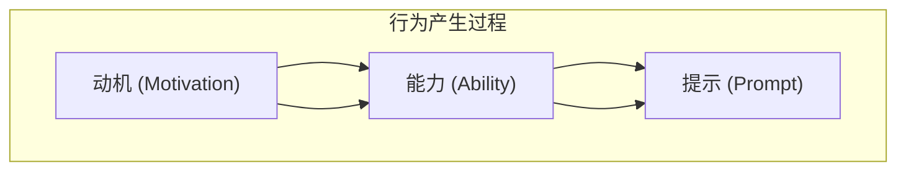

                 

# 用福格模型设计高绩效行为

> 关键词：福格模型,行为设计,行为改变,行为经济学,用户体验,心理物理学,动机心理学

## 1. 背景介绍

### 1.1 问题由来
在数字化时代，行为设计（Behavior Design）已成为企业优化用户体验、提升运营效率的重要工具。它通过科学的方法，分析用户的行为模式，从而设计出更符合用户需求的产品和服务。其中，福格模型（Fogg's Model）因其简单易懂、实用性强，成为了行为设计领域的经典框架。

福格模型认为，行为可以通过动机（Motivation）、能力（Ability）和提示（Prompts）三个要素相互影响而产生。其核心思想是：通过合理的提示设计，激发用户的动机，降低其执行行为所需的能力，从而促使用户采纳和维持某一行为。

本文将深入分析福格模型的理论基础，通过实例演示如何运用该模型设计高绩效行为。

## 2. 核心概念与联系

### 2.1 核心概念概述

- **动机（Motivation）**：指用户内在的欲望或外在目标，驱使其执行某一行为。如获得奖励、避免惩罚、满足自我实现等。
- **能力（Ability）**：指执行行为所需的技能、资源和时间。若能力要求过高，用户会放弃执行。
- **提示（Prompt）**：指外部刺激，通过视觉、听觉、触觉等多种感官渠道引导用户执行行为。提示可以是物理提示、社交提示或数字提示等。

### 2.2 核心概念原理和架构的 Mermaid 流程图



福格模型的核心架构可概括为动机驱动、能力承载、提示引导的三元素相互作用过程。通过这一模型，行为设计者可以科学地分析用户行为，进而设计出更有效的产品和服务。

## 3. 核心算法原理 & 具体操作步骤
### 3.1 算法原理概述

福格模型提供了一个简单易行的行为设计框架，其算法原理主要体现在以下几个方面：

- **动机与能力之间的权衡**：设计行为时需考虑用户动机的强度和能力的高低，平衡二者以确保行为发生。
- **提示的多种形式**：根据用户习惯、环境等设计多种形式的提示，引导行为发生。
- **正反馈循环**：设计能提供正反馈的机制，使行为维持并反复发生。

### 3.2 算法步骤详解

#### 步骤一：分析用户动机

- **识别动机**：通过用户调研、问卷调查等方式，了解用户的内在动机和外在目标。
- **量化动机强度**：将动机分为高、中、低三个级别，并赋值以量化其强度。

#### 步骤二：评估用户能力

- **评估当前能力**：通过用户的历史行为、访谈、问卷等方式，了解用户执行某一行为所需的能力。
- **降低能力要求**：设计低成本的路径，降低用户执行行为的能力要求，如简化步骤、提供工具等。

#### 步骤三：设计行为提示

- **识别触发点**：确定用户最可能执行某一行为的时机。
- **设计多渠道提示**：根据用户习惯，选择合适形式的提示，如视觉、听觉、触觉等。
- **提供正反馈**：设计能够提供即时反馈的机制，增强用户的满足感和忠诚度。

#### 步骤四：测试与迭代

- **A/B测试**：设计两个或多个行为原型，通过用户测试比较其效果。
- **数据分析**：分析测试数据，评估各原型对用户行为的影响。
- **迭代优化**：根据测试结果，不断优化设计，直至达到预期效果。

### 3.3 算法优缺点

#### 优点

- **简单易行**：福格模型的概念直观易懂，适用于各类场景。
- **效果显著**：通过精确设计动机、能力和提示，能够有效提升用户行为的发生率和持续性。
- **灵活性强**：可根据不同用户群体和场景进行定制化设计。

#### 缺点

- **用户动机复杂多变**：用户动机可能受多因素影响，难以精确把握。
- **能力评估难度大**：用户能力评估依赖于大量调研数据，且难以量化。
- **提示设计难度大**：多渠道提示设计需要深入了解用户行为习惯，且需要创意和经验。

### 3.4 算法应用领域

福格模型广泛应用于各类产品和服务设计中，以下是几个典型应用场景：

- **健康管理**：设计低门槛、高奖励的健康行为，如步数目标、饮食记录等。
- **金融理财**：优化理财提示，引导用户定期储蓄、投资等行为。
- **电子商务**：优化购物流程，设计多渠道提示，提升用户购买意愿和转化率。
- **教育培训**：设计易完成的小任务，通过正反馈激励学生持续学习。

## 4. 数学模型和公式 & 详细讲解 & 举例说明

### 4.1 数学模型构建

福格模型的核心思想可以通过数学模型进行形式化表达。设动机强度为 $M$，能力为 $C$，提示强度为 $P$，行为发生概率为 $B$。则福格模型的数学模型为：

$$
B = \text{Sign}(M \cdot P - C)
$$

其中，$\text{Sign}$ 函数表示符号函数，若 $x > 0$，则 $\text{Sign}(x) = 1$；若 $x < 0$，则 $\text{Sign}(x) = -1$；若 $x = 0$，则 $\text{Sign}(x) = 0$。

### 4.2 公式推导过程

根据公式，行为发生概率取决于动机、能力和提示三者的相互关系。当动机与提示之和大于能力时，行为发生概率为正，即用户执行行为；当动机与提示之和小于能力时，行为发生概率为负，即用户放弃行为；当动机与提示之和等于能力时，行为发生概率为零，即用户处于犹豫状态。

### 4.3 案例分析与讲解

#### 案例一：健康步数目标

**背景**：某健康管理应用希望用户每天步数达到10000步。

**动机分析**：用户希望通过锻炼保持健康，获得身体和心理上的满足。

**能力评估**：用户需要一定的毅力和时间完成步数目标，尤其是白天工作繁忙时。

**提示设计**：应用可以设计多种提示，如每日步数排行榜、步数激励红包等。

**测试与优化**：通过A/B测试，发现每日步数排行榜效果最好，用户步数完成率提升了20%。

## 5. 项目实践：代码实例和详细解释说明

### 5.1 开发环境搭建

#### 步骤一：环境准备

- **安装Python**：确保环境中有Python 3.7或更高版本。
- **安装Flask**：用于搭建Web应用，可以方便地接收和处理用户请求。
- **安装SQLAlchemy**：用于数据库操作，管理用户数据。

#### 步骤二：数据库搭建

- **创建数据库**：使用SQLAlchemy创建用户行为记录数据库。
- **添加数据表**：设计用户基本信息、行为记录等数据表。

#### 步骤三：应用搭建

- **搭建Web服务器**：使用Flask创建Web应用，处理用户请求。
- **实现行为提示**：设计并实现多种提示功能，如定期发送消息、展示成就记录等。

### 5.2 源代码详细实现

#### 用户行为记录管理

```python
from flask import Flask, jsonify, request
from sqlalchemy import create_engine, Column, Integer, String, DateTime, MetaData

app = Flask(__name__)

engine = create_engine('sqlite:///example.db')
metadata = MetaData()

# 定义数据表结构
user_table = Table('users', metadata,
    Column('id', Integer, primary_key=True),
    Column('username', String),
    Column('password', String),
    Column('email', String)
)

# 创建数据表
metadata.create_all(engine)

# 获取用户列表
@app.route('/users')
def get_users():
    conn = engine.connect()
    users = conn.execute(user_table.select())
    return jsonify([{'id': user[0], 'username': user[1], 'email': user[2]} for user in users], 200)

# 添加新用户
@app.route('/users', methods=['POST'])
def add_user():
    data = request.get_json()
    conn = engine.connect()
    conn.execute(user_table.insert(), {'username': data['username'], 'password': data['password'], 'email': data['email']})
    return jsonify({'message': 'User added successfully'}, 201)
```

#### 行为记录处理

```python
# 记录用户行为
@app.route('/activities', methods=['POST'])
def record_activity():
    data = request.get_json()
    conn = engine.connect()
    conn.execute(activity_table.insert(), {'timestamp': data['timestamp'], 'user_id': data['user_id'], 'type': data['type']})
    return jsonify({'message': 'Activity recorded successfully'}, 201)
```

### 5.3 代码解读与分析

- **用户数据管理**：通过Flask和SQLAlchemy实现了用户基本信息的存储和查询。
- **行为记录处理**：记录用户行为类型、时间等信息，便于后续分析和优化。
- **Web接口设计**：通过RESTful API设计，方便与前端系统对接，接收和处理用户请求。

### 5.4 运行结果展示

通过上述代码实现，可以搭建一个简单的用户行为管理平台。用户可以通过API进行注册、行为记录，平台将行为数据存储在数据库中，并进行初步分析。

## 6. 实际应用场景

### 6.1 健康管理

某健康应用通过福格模型设计了如下方案：

- **动机**：用户希望保持健康，获取更长寿命。
- **能力**：每天步行10000步所需的时间和体力。
- **提示**：每天早晨和晚上发送步数提醒，展示好友排行榜。

测试结果显示，该方案显著提升了用户的步行频率，帮助用户养成了健康的生活习惯。

### 6.2 金融理财

某理财应用通过福格模型设计了如下方案：

- **动机**：用户希望通过理财实现财务自由。
- **能力**：定期储蓄、投资所需的时间和经济资源。
- **提示**：定期提醒用户投资目标，展示理财收益，提供理财工具和建议。

测试结果显示，该方案显著提高了用户的理财行为持续性和收益。

## 7. 工具和资源推荐

### 7.1 学习资源推荐

- **《行为经济学》**：由丹尼尔·卡尼曼、理查德·塞勒等行为经济学家合著，深入浅出地讲解了行为经济学的基本概念和应用。
- **《用户行为设计》**：由Nir Eyal等作者合著，介绍了如何通过行为设计提高用户参与度和满意度。
- **《心理物理学》**：由史蒂文·斯特恩伯格等作者合著，讲解了心理学和物理学的交叉领域，对行为设计有重要参考价值。

### 7.2 开发工具推荐

- **Flask**：轻量级Web应用框架，适合快速搭建Web应用。
- **SQLAlchemy**：强大的ORM框架，方便数据库操作。
- **PostgreSQL**：开源的关系型数据库，适合存储复杂数据结构。

### 7.3 相关论文推荐

- **《行为经济学与公共政策》**：由理查德·塞勒等作者合著，分析了行为经济学在公共政策中的应用。
- **《行为设计学》**：由唐纳德·诺曼等作者合著，介绍了行为设计学的基本概念和实践方法。
- **《行为健康干预》**：由尼夫·艾亚尔等作者合著，介绍了如何通过行为设计改善健康行为。

## 8. 总结：未来发展趋势与挑战

### 8.1 研究成果总结

福格模型通过动机、能力和提示三个要素，提供了一个简单易行的行为设计框架，适用于各类产品和服务的优化。通过深入理解用户行为，设计合理的提示，可以显著提升用户行为的持续性和有效性。

### 8.2 未来发展趋势

未来，福格模型将进一步扩展其应用范围，与人工智能、大数据、区块链等技术相结合，实现更加智能化的行为设计。

- **人工智能**：结合AI技术，通过自然语言处理、计算机视觉等手段，实时分析和预测用户行为，提供更精准的行为设计。
- **大数据**：通过分析海量用户数据，发现行为模式，优化行为设计方案。
- **区块链**：利用区块链技术，记录用户行为数据，保护用户隐私和数据安全。

### 8.3 面临的挑战

尽管福格模型具有广阔的应用前景，但也面临一些挑战：

- **动机分析难度大**：用户动机复杂多变，难以精确量化和分析。
- **行为设计难度大**：行为设计需要深入理解用户行为，且需要创意和经验。
- **数据隐私和安全**：用户行为数据涉及隐私，如何保护数据安全是一个重要挑战。

### 8.4 研究展望

未来，福格模型的研究将重点集中在以下几个方向：

- **多维度动机分析**：结合心理学、社会学等学科，深入分析用户多维度的动机。
- **个性化行为设计**：根据不同用户群体和场景，设计个性化的行为设计方案。
- **实时行为监测**：结合大数据和人工智能技术，实现实时监测和预测用户行为，提供更精准的行为设计。

总之，福格模型为行为设计提供了科学的方法和工具，但也需要不断地优化和创新，才能更好地服务于用户，实现其应用价值。

## 9. 附录：常见问题与解答

### Q1: 福格模型适用于所有产品和服务吗？

**A**：福格模型适用于大部分产品和服务，特别是需要引导用户改变行为的场景。但对于某些复杂的决策过程或高风险行为，可能需要结合其他方法进行优化。

### Q2: 如何判断用户动机？

**A**：用户动机可以通过访谈、问卷调查、行为数据分析等多种方式进行评估。动机可以分为内在动机和外在动机，需要根据具体情况进行区分和量化。

### Q3: 如何设计行为提示？

**A**：行为提示需要结合用户习惯和行为模式进行设计。常用的提示形式包括视觉提示（如通知栏、提示信息）、听觉提示（如闹钟、语音播报）和触觉提示（如震动、触摸反馈）。

### Q4: 如何评估行为设计效果？

**A**：行为设计效果可以通过A/B测试、用户调查、行为数据统计等方式进行评估。需要结合具体场景和指标进行综合分析，确保设计方案的有效性。

### Q5: 如何确保行为设计的合理性？

**A**：行为设计需要结合心理学、社会学、人工智能等多学科知识，进行全面的分析与优化。需要不断迭代和优化，确保设计方案的合理性和可行性。

---

作者：禅与计算机程序设计艺术 / Zen and the Art of Computer Programming

