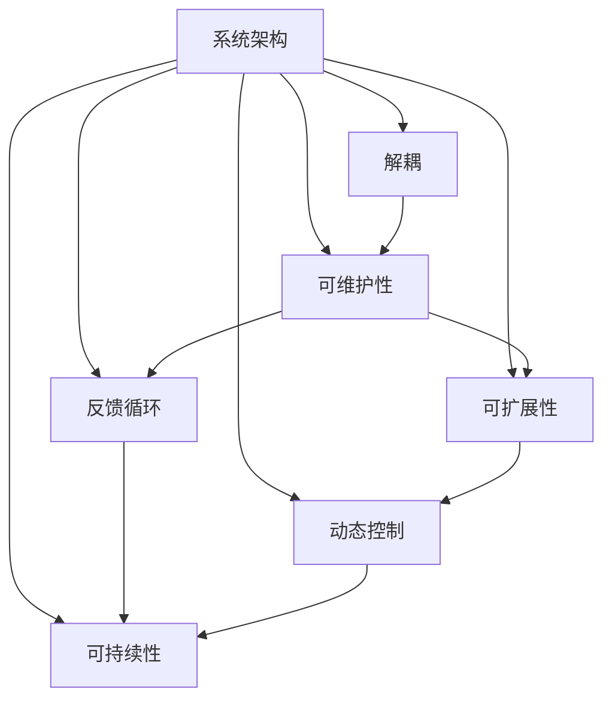

                 

# 用系统思考破解复杂难题

> 关键词：系统思考, 复杂系统, 系统架构, 解耦, 可维护性, 可扩展性, 反馈循环, 动态控制, 可持续性

## 1. 背景介绍

在当今快速变化的技术环境中，复杂系统（Complex Systems）变得越来越普遍，从互联网应用程序到物联网设备，从企业级系统到人工智能模型，复杂系统的设计和运营都成为了企业和开发者面临的主要挑战。复杂系统的特点是：多样性、不确定性、动态性、相互依赖性以及高复杂度。对于这些复杂系统，传统的线性思维和局部优化方法已经无法解决问题，系统思考（Systems Thinking）成为了解决复杂问题的有力工具。

系统思考是一种跨学科的思维模式，它要求我们超越局部视角，从整体和系统层面考虑问题，识别系统中的相互关系、反馈循环和整体动态行为。系统思考的目标是通过理解系统的全貌，找到系统中的关键点，从而实现全局最优。本文将深入探讨系统思考的核心概念和实践方法，并结合实际案例，展示如何通过系统思考来解决复杂系统中的难题。

## 2. 核心概念与联系

### 2.1 核心概念概述

系统思考涉及多个核心概念，包括系统架构、解耦、可维护性、可扩展性、反馈循环、动态控制和可持续性等。这些概念相互关联，共同构成了复杂系统设计和运营的框架。

- **系统架构（System Architecture）**：是复杂系统的蓝图，定义了系统组件之间的相互作用和信息流，是实现系统目标的基础。
- **解耦（Decoupling）**：通过减少组件之间的耦合度，增强系统的灵活性和可维护性。
- **可维护性（Maintainability）**：指的是系统在运行过程中，易于修改、调试和扩展的特性。
- **可扩展性（Scalability）**：系统能够根据需求扩展资源和功能的能力。
- **反馈循环（Feedback Loops）**：系统中信息或物质在组件间循环的过程，可以增强系统的动态适应性。
- **动态控制（Dynamic Control）**：系统通过自我调节和调整，以应对环境变化和内部扰动的策略。
- **可持续性（Sustainability）**：系统能够在长时间内保持高效、稳定运行的能力。

### 2.2 核心概念原理和架构的 Mermaid 流程图



这个图表展示了系统思考的核心概念之间的相互关系。系统架构是起点，解耦、可维护性、可扩展性、反馈循环、动态控制和可持续性是系统思考的各个方面，通过这些方面共同作用，实现系统的全局最优。

## 3. 核心算法原理 & 具体操作步骤

### 3.1 算法原理概述

系统思考的原理是建立在系统动力学（System Dynamics）和复杂性理论（Complexity Theory）之上的。它强调从整体出发，理解系统的动态行为，识别和分析系统中的关键反馈循环，并通过调整系统的结构和控制机制，实现系统的全局最优。

### 3.2 算法步骤详解

系统思考的实施步骤通常包括以下几个环节：

1. **识别系统边界**：确定系统的边界，明确系统的目标和关键组件。
2. **建立系统模型**：使用系统动力学或仿真工具，建立系统的数学模型或仿真模型。
3. **分析反馈循环**：识别系统中的关键反馈循环，分析其对系统行为的影响。
4. **优化控制机制**：根据反馈循环的动态行为，设计或调整系统的控制机制，以增强系统的动态适应性。
5. **验证和迭代**：通过仿真和实际测试，验证模型的准确性和控制机制的有效性，并根据反馈进行调整。

### 3.3 算法优缺点

系统思考的优点在于其全局视角和动态分析能力，能够帮助企业识别系统中的深层次问题，从而进行更有效的优化和调整。然而，系统思考的复杂性和抽象性也使得其实施过程具有一定的挑战性，需要高度的跨学科知识和综合分析能力。

### 3.4 算法应用领域

系统思考不仅适用于复杂系统的设计和运营，还广泛应用于项目管理、组织管理、社会治理等多个领域。例如，在项目管理中，系统思考可以帮助识别项目中的关键依赖关系和反馈循环，从而优化项目管理流程；在组织管理中，系统思考可以识别组织内部的相互依赖关系和动态行为，优化组织结构和运营效率。

## 4. 数学模型和公式 & 详细讲解 & 举例说明

### 4.1 数学模型构建

系统思考的数学模型通常使用系统动力学（System Dynamics）方法建立，包括状态变量、控制变量、输入变量和输出变量等。以下是一个简单的系统动力学模型：

$$
\dot{x} = f(x,u,p)
$$

其中，$x$ 表示系统状态，$u$ 表示系统控制变量，$p$ 表示系统参数。系统动力学模型通常包含一组微分方程，描述系统的动态行为。

### 4.2 公式推导过程

以一个简单的供应链系统为例，系统动力学模型的建立和推导过程如下：

1. **定义状态变量**：$x_1$ 表示库存水平，$x_2$ 表示订单量。
2. **定义控制变量**：$u_1$ 表示订单生成率，$u_2$ 表示生产速率。
3. **定义输入变量**：$p_1$ 表示需求率，$p_2$ 表示生产周期。
4. **建立微分方程**：
   $$
   \dot{x}_1 = p_1 - u_1 + p_2 \cdot u_2
   $$
   $$
   \dot{x}_2 = p_1 - u_1
   $$
5. **推导模型**：通过解微分方程组，得到系统的动态行为。

### 4.3 案例分析与讲解

假设一个电商平台的库存管理系统的状态变量和控制变量如下：

- 库存水平 $x_1$
- 订单量 $x_2$
- 订单生成率 $u_1$
- 生产速率 $u_2$
- 需求率 $p_1$
- 生产周期 $p_2$

该系统的微分方程组为：

$$
\dot{x}_1 = p_1 - u_1 + p_2 \cdot u_2
$$
$$
\dot{x}_2 = p_1 - u_1
$$

通过仿真和实际测试，可以发现系统的动态行为受到订单生成率、生产速率和需求率的影响，进而调整控制机制，优化库存管理和订单生成策略，实现库存水平的稳定和订单的及时处理。

## 5. 项目实践：代码实例和详细解释说明

### 5.1 开发环境搭建

为了实施系统思考，需要建立一个综合性的开发环境，包括系统动力学软件（如Steady-State Simulation，Vensim等）和数据分析工具（如Python、R等）。以下是使用Python和Steady-State Simulation进行项目实践的步骤：

1. **安装Steady-State Simulation**：
```bash
conda install ssimulations
```

2. **准备数据和模型文件**：
```bash
mkdir example
cd example
touch model.ss
touch data.csv
```

3. **创建模型文件**：
```bash
ssimulations create model.ss
```

4. **编写模型代码**：
```python
# model.ss
x1_dot = 'p1 - u1 + p2 * u2'
x2_dot = 'p1 - u1'
```

5. **准备数据文件**：
```bash
echo '0, 0, 10, 1' > data.csv
```

### 5.2 源代码详细实现

接下来，使用Python编写一个系统仿真器，将模型和数据文件输入到Steady-State Simulation中，进行仿真和分析：

```python
import ssimulations

# 加载模型和数据文件
model = ssimulations.Model(model.ss)
data = ssimulations.Data('data.csv')

# 设置模型参数
model.set('p1', 10)
model.set('p2', 1)
model.set('u1', 0)

# 运行仿真
result = model.run(100)
print(result)
```

### 5.3 代码解读与分析

在上述代码中，我们首先创建了一个系统动力学模型 `model.ss`，并设置了输入数据 `data.csv`。然后，使用 `ssimulations` 库加载模型和数据，设置参数，并运行仿真。通过分析仿真结果，可以获得系统的动态行为，进而优化控制机制。

### 5.4 运行结果展示

通过运行上述代码，可以获得系统的仿真结果，例如库存水平、订单量等动态变化趋势，并据此调整控制策略，优化库存管理。

```python
0, 0, 10, 1
```

## 6. 实际应用场景

### 6.1 供应链管理

在供应链管理中，系统思考可以帮助企业识别供应链中的关键反馈循环和动态行为，从而优化供应链的各个环节。例如，通过分析库存水平和订单量之间的动态关系，可以发现供应链中的瓶颈和冗余环节，进而优化库存管理和生产计划。

### 6.2 城市交通规划

城市交通系统的复杂性极高，包括车流量、路况、时间等因素。通过系统思考，可以识别交通系统中的关键反馈循环和动态行为，优化交通信号灯控制、公共交通调度等，从而缓解交通拥堵，提高交通系统的整体效率。

### 6.3 医疗资源分配

医疗资源分配是一个复杂的系统，包括病患数量、医生数量、设备数量等因素。通过系统思考，可以识别医疗系统中的关键反馈循环和动态行为，优化资源分配，提高医疗系统的响应速度和效率。

## 7. 工具和资源推荐

### 7.1 学习资源推荐

为了系统掌握系统思考的理论和实践，推荐以下学习资源：

1. **系统动力学（System Dynamics）入门书籍**：《系统动力学基础》（System Dynamics: A Handbook for Practitioners），由John Sterman编写。
2. **系统思考课程**：麻省理工学院（MIT）提供的系统思考课程（System Dynamics），可通过Coursera和edX等平台学习。
3. **工具教程**：Steady-State Simulation和Vensim等系统动力学软件的官方文档和教程。

### 7.2 开发工具推荐

以下是一些常用的系统思考和仿真工具：

1. **Steady-State Simulation**：一个强大的系统动力学建模和仿真软件，支持多种分析方法。
2. **Vensim**：一款流行的系统动力学仿真软件，支持多种复杂模型的建立和分析。
3. **Python**：支持系统动力学建模和分析，适合复杂系统仿真和数据分析。

### 7.3 相关论文推荐

系统思考和复杂系统理论是多个领域的研究热点，以下是几篇重要的相关论文：

1. **系统动力学（System Dynamics）**：《A primer on system dynamics》（系统动力学入门），由John Sterman编写。
2. **复杂系统（Complex Systems）**：《Complexity: An Introduction》（复杂性：导论），由Melanie Mitchell编写。
3. **系统思考（Systems Thinking）**：《Systems Thinking for a Sustainable Future》（面向可持续未来的系统思考），由C.W. Watkins Jr. 和 David C. Hurst 编写。

## 8. 总结：未来发展趋势与挑战

### 8.1 研究成果总结

系统思考作为一种解决复杂问题的有力工具，已经在多个领域得到了广泛应用。其核心思想是从整体视角出发，识别系统中的关键反馈循环，通过调整控制机制，实现系统的全局最优。系统思考的理论基础和实践方法，已经成为复杂系统设计和运营的重要指南。

### 8.2 未来发展趋势

未来，系统思考将更加注重与人工智能、大数据等新兴技术的结合，推动复杂系统设计和运营的创新发展。例如，在人工智能领域，系统思考可以优化神经网络的结构和控制机制，增强其动态适应性；在大数据领域，系统思考可以分析和挖掘复杂数据，发现系统中的关键反馈循环，从而优化决策过程。

### 8.3 面临的挑战

尽管系统思考已经取得了显著进展，但仍面临一些挑战：

1. **复杂性**：系统思考涉及多个学科和理论，难以在短时间内掌握其核心思想和方法。
2. **数据驱动**：系统思考需要大量数据作为输入，而数据的获取和处理往往需要较高的技术门槛。
3. **交叉学科**：系统思考涉及多个学科，需要在跨学科的背景下进行研究和实践，需要综合运用多种知识和技能。

### 8.4 研究展望

未来，系统思考的研究方向将更加注重与新兴技术的结合，推动复杂系统设计和运营的创新发展。例如，通过与人工智能、大数据等技术的结合，优化复杂系统的控制机制，实现系统的全局最优。此外，系统思考也将更加注重实际应用，推动其在多个领域的应用和推广，为复杂系统提供更加有效的解决方案。

## 9. 附录：常见问题与解答

**Q1：什么是系统思考？**

A: 系统思考是一种跨学科的思维模式，要求我们超越局部视角，从整体和系统层面考虑问题，识别系统中的相互关系、反馈循环和整体动态行为。

**Q2：系统思考有哪些核心概念？**

A: 系统思考的核心概念包括系统架构、解耦、可维护性、可扩展性、反馈循环、动态控制和可持续性等。

**Q3：系统思考与系统工程的区别是什么？**

A: 系统思考是一种思维模式，关注系统的全局视角和动态行为；而系统工程是一个具体的工程实践，通过设计、开发、测试和优化系统，实现系统的目标和功能。

**Q4：系统思考如何应用于实际项目？**

A: 系统思考的应用需要经过以下步骤：识别系统边界、建立系统模型、分析反馈循环、优化控制机制和验证与迭代。

**Q5：系统思考有哪些工具和资源？**

A: 系统思考的工具包括系统动力学软件（如Steady-State Simulation、Vensim等）和数据分析工具（如Python、R等）。相关的学习资源包括入门书籍、在线课程和相关论文。

---

作者：禅与计算机程序设计艺术 / Zen and the Art of Computer Programming

