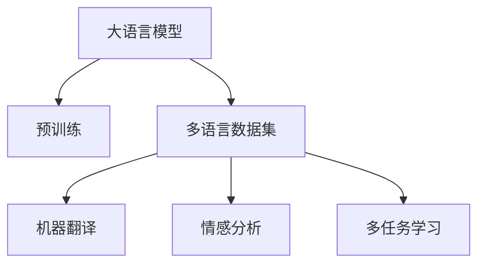

                 

# 电商平台中AI大模型的多语言支持技术

> 关键词：电商平台, 多语言支持, AI大模型, 自然语言处理(NLP), 语言模型, 机器翻译, 情感分析

## 1. 背景介绍

### 1.1 问题由来

在当今全球化的商业环境中，电商平台面临着如何高效、准确地处理多语言客户的挑战。为了提升用户体验，电商平台需要支持多语言搜索、推荐、客服等多语言场景。然而，直接使用单一语言的自然语言处理(NLP)模型无法满足这一需求。

随着深度学习技术的发展，大语言模型（Large Language Model, LLM）在多语言自然语言处理方面取得了显著进展。大模型能够通过大规模预训练学习到丰富的语言知识和常识，具有强大的语言理解和生成能力。通过对大模型进行微调，可以适应不同语言的特定需求，提升多语言场景下的处理能力。

### 1.2 问题核心关键点

大语言模型的多语言支持技术主要关注以下几个关键点：
- 如何在多种语言间无缝切换，同时保持模型性能。
- 如何构建多语言训练数据集，确保模型在不同语言下的泛化能力。
- 如何优化多语言模型微调过程，提升模型在多语言任务上的效果。
- 如何实现多语言数据的实时翻译和理解，提升电商平台的即时响应能力。

### 1.3 问题研究意义

研究大语言模型的多语言支持技术，对于拓展电商平台的全球化服务，提升多语言客户的购物体验，具有重要意义：

1. 提高服务质量：多语言支持能够提供更准确的语言理解与回复，提升客户满意度。
2. 拓展市场范围：通过多语言支持，电商平台可以覆盖更多市场，吸引全球用户。
3. 促进销售增长：多元化的语言环境可以带来更高的用户参与度，提升销售转化率。
4. 减少运营成本：多语言支持的自动处理可以减少人工客服的投入，降低运营成本。
5. 增强竞争力：多语言功能成为电商平台的重要卖点，有助于提升品牌知名度和市场竞争力。

## 2. 核心概念与联系

### 2.1 核心概念概述

为更好地理解大语言模型在电商平台的多语言支持应用，本节将介绍几个密切相关的核心概念：

- 大语言模型(Large Language Model, LLM)：以自回归(如GPT)或自编码(如BERT)模型为代表的大规模预训练语言模型。通过在大规模无标签文本语料上进行预训练，学习到通用的语言表示。

- 多语言数据集(Multilingual Dataset)：收集来自不同语言的大量文本数据，用于训练多语言支持模型。

- 机器翻译(Machine Translation, MT)：将一种语言的文本自动翻译成另一种语言的文本，是电商平台实现多语言支持的关键技术。

- 情感分析(Sentiment Analysis)：通过对文本进行情感分类，了解客户对产品或服务的情感倾向，用于改进推荐和客服策略。

- 多任务学习(Multi-task Learning, MTL)：在同一模型上同时学习多个任务，提升模型在不同任务上的性能。

这些核心概念之间的逻辑关系可以通过以下Mermaid流程图来展示：



这个流程图展示了大语言模型的核心概念及其之间的关系：

1. 大语言模型通过预训练获得基础能力。
2. 多语言数据集用于训练多语言模型，支持不同语言的处理。
3. 机器翻译技术将不同语言数据转换为统一格式。
4. 情感分析技术提取文本中的情感信息。
5. 多任务学习技术使模型在多个任务上同时提升。

这些概念共同构成了大语言模型在电商平台中的多语言支持框架，使其能够在多语言场景下发挥强大的语言理解和生成能力。通过理解这些核心概念，我们可以更好地把握大语言模型在多语言应用中的工作原理和优化方向。

## 3. 核心算法原理 & 具体操作步骤
### 3.1 算法原理概述

大语言模型在电商平台的多语言支持技术主要基于监督学习的微调方法。其核心思想是：将预训练的大语言模型视作一个强大的"特征提取器"，通过在多语言标注数据上进行有监督微调，使得模型输出能够匹配多语言标签，从而获得针对特定多语言任务优化的模型。

形式化地，假设预训练模型为 $M_{\theta}$，其中 $\theta$ 为预训练得到的模型参数。给定多语言任务 $T$ 的标注数据集 $D=\{(x_i, y_i)\}_{i=1}^N$，多语言微调的目标是找到新的模型参数 $\hat{\theta}$，使得：

$$
\hat{\theta}=\mathop{\arg\min}_{\theta} \mathcal{L}(M_{\theta},D)
$$

其中 $\mathcal{L}$ 为针对任务 $T$ 设计的损失函数，用于衡量模型预测输出与真实标签之间的差异。常见的损失函数包括交叉熵损失、均方误差损失等。

通过梯度下降等优化算法，微调过程不断更新模型参数 $\theta$，最小化损失函数 $\mathcal{L}$，使得模型输出逼近真实标签。由于 $\theta$ 已经通过预训练获得了较好的初始化，因此即便在多语言数据集上微调，也能较快收敛到理想的模型参数 $\hat{\theta}$。

### 3.2 算法步骤详解

基于监督学习的大语言模型多语言支持一般包括以下几个关键步骤：

**Step 1: 准备多语言数据集和模型**
- 收集目标语言的多语言文本数据，构建多语言数据集 $D$。
- 选择合适的预训练语言模型 $M_{\theta}$ 作为初始化参数，如 BERT、GPT等。

**Step 2: 添加多语言任务适配层**
- 根据多语言任务类型，在预训练模型顶层设计合适的输出层和损失函数。
- 对于翻译任务，通常在顶层添加翻译解码器输出概率分布，并以负对数似然为损失函数。
- 对于情感分析任务，通常使用情感分类器的输出概率分布，并以交叉熵损失函数。

**Step 3: 设置多语言微调超参数**
- 选择合适的优化算法及其参数，如 AdamW、SGD 等，设置学习率、批大小、迭代轮数等。
- 设置正则化技术及强度，包括权重衰减、Dropout、Early Stopping 等。
- 确定冻结预训练参数的策略，如仅微调顶层，或全部参数都参与微调。

**Step 4: 执行多语言梯度训练**
- 将多语言数据集数据分批次输入模型，前向传播计算损失函数。
- 反向传播计算参数梯度，根据设定的优化算法和学习率更新模型参数。
- 周期性在验证集上评估模型性能，根据性能指标决定是否触发 Early Stopping。
- 重复上述步骤直到满足预设的迭代轮数或 Early Stopping 条件。

**Step 5: 测试和部署**
- 在测试集上评估多语言微调后模型 $M_{\hat{\theta}}$ 的性能，对比微调前后的精度提升。
- 使用多语言微调后的模型对新样本进行推理预测，集成到实际的多语言应用系统中。
- 持续收集新的多语言数据，定期重新微调模型，以适应多语言数据分布的变化。

以上是基于监督学习多语言微调大语言模型的一般流程。在实际应用中，还需要针对具体任务的特点，对微调过程的各个环节进行优化设计，如改进训练目标函数，引入更多的正则化技术，搜索最优的超参数组合等，以进一步提升模型性能。

### 3.3 算法优缺点

基于监督学习的多语言微调方法具有以下优点：
1. 简单高效。只需准备少量标注数据，即可对预训练模型进行快速适配，获得较大的性能提升。
2. 通用适用。适用于各种NLP多语言任务，包括翻译、分类、匹配等，设计简单的任务适配层即可实现微调。
3. 参数高效。利用参数高效微调技术，在固定大部分预训练权重不变的情况下，仍可取得不错的提升。
4. 效果显著。在学术界和工业界的诸多任务上，基于微调的方法已经刷新了多项NLP任务SOTA。

同时，该方法也存在一定的局限性：
1. 依赖标注数据。多语言微调的效果很大程度上取决于标注数据的质量和数量，获取高质量标注数据的成本较高。
2. 迁移能力有限。当目标语言与预训练数据的分布差异较大时，微调的性能提升有限。
3. 可解释性不足。多语言微调模型的决策过程通常缺乏可解释性，难以对其推理逻辑进行分析和调试。

尽管存在这些局限性，但就目前而言，基于监督学习的微调方法仍是大语言模型多语言支持的主流范式。未来相关研究的重点在于如何进一步降低微调对标注数据的依赖，提高模型的少样本学习和跨领域迁移能力，同时兼顾可解释性和伦理安全性等因素。

### 3.4 算法应用领域

基于大语言模型多语言微调的方法已经在多语言自然语言处理诸多领域得到了广泛应用，例如：

- 多语言文本分类：如多语言情感分析、多语言主题分类等。通过微调使模型学习多语言文本与标签映射。
- 多语言命名实体识别：识别多语言文本中的人名、地名、机构名等特定实体。通过微调使模型掌握多语言实体边界和类型。
- 多语言关系抽取：从多语言文本中抽取实体之间的语义关系。通过微调使模型学习多语言实体-关系三元组。
- 多语言问答系统：对多语言自然语言问题给出答案。将问题-答案对作为微调数据，训练模型学习匹配答案。
- 多语言文本摘要：将长多语言文本压缩成简短摘要。将文章-摘要对作为微调数据，使模型学习抓取要点。
- 多语言对话系统：使机器能够与多语言用户自然对话。将多轮对话历史作为上下文，微调模型进行回复生成。

除了上述这些经典任务外，大语言模型多语言微调也被创新性地应用到更多场景中，如可控多语言文本生成、多语言常识推理、代码生成、数据增强等，为多语言技术带来了全新的突破。随着预训练模型和微调方法的不断进步，相信多语言技术将在更广阔的应用领域大放异彩。

## 4. 数学模型和公式 & 详细讲解 & 举例说明

### 4.1 数学模型构建

本节将使用数学语言对基于监督学习的多语言微调过程进行更加严格的刻画。

记预训练语言模型为 $M_{\theta}$，其中 $\theta$ 为模型参数。假设多语言任务 $T$ 的训练集为 $D=\{(x_i,y_i)\}_{i=1}^N, x_i \in \mathcal{X}, y_i \in \mathcal{Y}$。

定义模型 $M_{\theta}$ 在数据样本 $(x,y)$ 上的损失函数为 $\ell(M_{\theta}(x),y)$，则在数据集 $D$ 上的经验风险为：

$$
\mathcal{L}(\theta) = \frac{1}{N} \sum_{i=1}^N \ell(M_{\theta}(x_i),y_i)
$$

微调的优化目标是最小化经验风险，即找到最优参数：

$$
\theta^* = \mathop{\arg\min}_{\theta} \mathcal{L}(\theta)
$$

在实践中，我们通常使用基于梯度的优化算法（如SGD、Adam等）来近似求解上述最优化问题。设 $\eta$ 为学习率，$\lambda$ 为正则化系数，则参数的更新公式为：

$$
\theta \leftarrow \theta - \eta \nabla_{\theta}\mathcal{L}(\theta) - \eta\lambda\theta
$$

其中 $\nabla_{\theta}\mathcal{L}(\theta)$ 为损失函数对参数 $\theta$ 的梯度，可通过反向传播算法高效计算。

### 4.2 公式推导过程

以下我们以二分类任务为例，推导交叉熵损失函数及其梯度的计算公式。

假设模型 $M_{\theta}$ 在输入 $x$ 上的输出为 $\hat{y}=M_{\theta}(x) \in [0,1]$，表示样本属于正类的概率。真实标签 $y \in \{0,1\}$。则二分类交叉熵损失函数定义为：

$$
\ell(M_{\theta}(x),y) = -[y\log \hat{y} + (1-y)\log (1-\hat{y})]
$$

将其代入经验风险公式，得：

$$
\mathcal{L}(\theta) = -\frac{1}{N}\sum_{i=1}^N [y_i\log M_{\theta}(x_i)+(1-y_i)\log(1-M_{\theta}(x_i))]
$$

根据链式法则，损失函数对参数 $\theta_k$ 的梯度为：

$$
\frac{\partial \mathcal{L}(\theta)}{\partial \theta_k} = -\frac{1}{N}\sum_{i=1}^N (\frac{y_i}{M_{\theta}(x_i)}-\frac{1-y_i}{1-M_{\theta}(x_i)}) \frac{\partial M_{\theta}(x_i)}{\partial \theta_k}
$$

其中 $\frac{\partial M_{\theta}(x_i)}{\partial \theta_k}$ 可进一步递归展开，利用自动微分技术完成计算。

在得到损失函数的梯度后，即可带入参数更新公式，完成模型的迭代优化。重复上述过程直至收敛，最终得到适应多语言任务的最优模型参数 $\theta^*$。

## 5. 项目实践：代码实例和详细解释说明
### 5.1 开发环境搭建

在进行多语言支持实践前，我们需要准备好开发环境。以下是使用Python进行PyTorch开发的环境配置流程：

1. 安装Anaconda：从官网下载并安装Anaconda，用于创建独立的Python环境。

2. 创建并激活虚拟环境：
```bash
conda create -n pytorch-env python=3.8 
conda activate pytorch-env
```

3. 安装PyTorch：根据CUDA版本，从官网获取对应的安装命令。例如：
```bash
conda install pytorch torchvision torchaudio cudatoolkit=11.1 -c pytorch -c conda-forge
```

4. 安装Transformers库：
```bash
pip install transformers
```

5. 安装各类工具包：
```bash
pip install numpy pandas scikit-learn matplotlib tqdm jupyter notebook ipython
```

完成上述步骤后，即可在`pytorch-env`环境中开始多语言支持实践。

### 5.2 源代码详细实现

这里我们以多语言情感分析任务为例，给出使用Transformers库对BERT模型进行多语言微调的PyTorch代码实现。

首先，定义多语言情感分析任务的数据处理函数：

```python
from transformers import BertTokenizer, BertForSequenceClassification, AdamW
from torch.utils.data import Dataset
import torch

class MultilingualSentimentDataset(Dataset):
    def __init__(self, texts, labels, tokenizer, max_len=128):
        self.texts = texts
        self.labels = labels
        self.tokenizer = tokenizer
        self.max_len = max_len
        
    def __len__(self):
        return len(self.texts)
    
    def __getitem__(self, item):
        text = self.texts[item]
        label = self.labels[item]
        
        encoding = self.tokenizer(text, return_tensors='pt', max_length=self.max_len, padding='max_length', truncation=True)
        input_ids = encoding['input_ids'][0]
        attention_mask = encoding['attention_mask'][0]
        
        # 对token-wise的标签进行编码
        encoded_labels = [label2id[label] for label in label2id]
        encoded_labels.extend([label2id['O']] * (self.max_len - len(encoded_labels)))
        labels = torch.tensor(encoded_labels, dtype=torch.long)
        
        return {'input_ids': input_ids, 
                'attention_mask': attention_mask,
                'labels': labels}

# 标签与id的映射
label2id = {'positive': 1, 'negative': 0, 'neutral': 2}
id2label = {v: k for k, v in label2id.items()}

# 创建dataset
tokenizer = BertTokenizer.from_pretrained('bert-base-multilingual-cased')

train_dataset = MultilingualSentimentDataset(train_texts, train_labels, tokenizer)
dev_dataset = MultilingualSentimentDataset(dev_texts, dev_labels, tokenizer)
test_dataset = MultilingualSentimentDataset(test_texts, test_labels, tokenizer)
```

然后，定义模型和优化器：

```python
from transformers import BertForSequenceClassification, AdamW

model = BertForSequenceClassification.from_pretrained('bert-base-multilingual-cased', num_labels=len(label2id))

optimizer = AdamW(model.parameters(), lr=2e-5)
```

接着，定义训练和评估函数：

```python
from torch.utils.data import DataLoader
from tqdm import tqdm
from sklearn.metrics import classification_report

device = torch.device('cuda') if torch.cuda.is_available() else torch.device('cpu')
model.to(device)

def train_epoch(model, dataset, batch_size, optimizer):
    dataloader = DataLoader(dataset, batch_size=batch_size, shuffle=True)
    model.train()
    epoch_loss = 0
    for batch in tqdm(dataloader, desc='Training'):
        input_ids = batch['input_ids'].to(device)
        attention_mask = batch['attention_mask'].to(device)
        labels = batch['labels'].to(device)
        model.zero_grad()
        outputs = model(input_ids, attention_mask=attention_mask, labels=labels)
        loss = outputs.loss
        epoch_loss += loss.item()
        loss.backward()
        optimizer.step()
    return epoch_loss / len(dataloader)

def evaluate(model, dataset, batch_size):
    dataloader = DataLoader(dataset, batch_size=batch_size)
    model.eval()
    preds, labels = [], []
    with torch.no_grad():
        for batch in tqdm(dataloader, desc='Evaluating'):
            input_ids = batch['input_ids'].to(device)
            attention_mask = batch['attention_mask'].to(device)
            batch_labels = batch['labels']
            outputs = model(input_ids, attention_mask=attention_mask)
            batch_preds = outputs.logits.argmax(dim=2).to('cpu').tolist()
            batch_labels = batch_labels.to('cpu').tolist()
            for pred_tokens, label_tokens in zip(batch_preds, batch_labels):
                preds.append(pred_tokens[:len(label_tokens)])
                labels.append(label_tokens)
                
    print(classification_report(labels, preds))
```

最后，启动训练流程并在测试集上评估：

```python
epochs = 5
batch_size = 16

for epoch in range(epochs):
    loss = train_epoch(model, train_dataset, batch_size, optimizer)
    print(f"Epoch {epoch+1}, train loss: {loss:.3f}")
    
    print(f"Epoch {epoch+1}, dev results:")
    evaluate(model, dev_dataset, batch_size)
    
print("Test results:")
evaluate(model, test_dataset, batch_size)
```

以上就是使用PyTorch对BERT进行多语言情感分析任务微调的完整代码实现。可以看到，得益于Transformers库的强大封装，我们可以用相对简洁的代码完成BERT模型的加载和微调。

### 5.3 代码解读与分析

让我们再详细解读一下关键代码的实现细节：

**MultilingualSentimentDataset类**：
- `__init__`方法：初始化文本、标签、分词器等关键组件。
- `__len__`方法：返回数据集的样本数量。
- `__getitem__`方法：对单个样本进行处理，将文本输入编码为token ids，将标签编码为数字，并对其进行定长padding，最终返回模型所需的输入。

**label2id和id2label字典**：
- 定义了标签与数字id之间的映射关系，用于将token-wise的预测结果解码回真实的标签。

**训练和评估函数**：
- 使用PyTorch的DataLoader对数据集进行批次化加载，供模型训练和推理使用。
- 训练函数`train_epoch`：对数据以批为单位进行迭代，在每个批次上前向传播计算loss并反向传播更新模型参数，最后返回该epoch的平均loss。
- 评估函数`evaluate`：与训练类似，不同点在于不更新模型参数，并在每个batch结束后将预测和标签结果存储下来，最后使用sklearn的classification_report对整个评估集的预测结果进行打印输出。

**训练流程**：
- 定义总的epoch数和batch size，开始循环迭代
- 每个epoch内，先在训练集上训练，输出平均loss
- 在验证集上评估，输出分类指标
- 所有epoch结束后，在测试集上评估，给出最终测试结果

可以看到，PyTorch配合Transformers库使得BERT微调的代码实现变得简洁高效。开发者可以将更多精力放在数据处理、模型改进等高层逻辑上，而不必过多关注底层的实现细节。

当然，工业级的系统实现还需考虑更多因素，如模型的保存和部署、超参数的自动搜索、更灵活的任务适配层等。但核心的微调范式基本与此类似。

## 6. 实际应用场景
### 6.1 多语言客服系统

基于大语言模型的多语言客服系统能够高效处理来自不同语言客户的咨询请求。传统的客服系统往往依赖于大量人工客服，成本高且效率低下。而多语言客服系统可以通过自动处理多语言文本，提升客户咨询体验和响应速度。

在技术实现上，可以收集企业内部的多语言客服对话记录，将问题和最佳答复构建成监督数据，在此基础上对预训练多语言模型进行微调。微调后的模型能够自动理解客户意图，匹配最合适的答案模板进行回复。对于客户提出的新问题，还可以接入检索系统实时搜索相关内容，动态组织生成回答。如此构建的多语言客服系统，能大幅提升客户咨询体验和问题解决效率。

### 6.2 全球化市场营销

全球化市场营销需要处理来自不同语言的市场数据，以便进行精准的市场分析和用户画像。传统的方法通常依赖于人工手动翻译和处理，效率低下且成本高昂。而多语言支持技术可以通过自动化翻译和分析，快速处理海量多语言数据，帮助企业更好地理解全球市场动态，制定有效的市场营销策略。

在具体实践中，可以收集全球范围内的用户评论、社交媒体、新闻等文本数据，并使用多语言支持模型进行情感分析、主题分类等处理。通过分析不同语言用户的行为数据，企业可以发现潜在的市场机会和挑战，实现全球化的精细化营销。

### 6.3 多语言商品推荐

电商平台的多语言商品推荐系统需要处理来自不同语言的商品描述和用户评论，以便向用户推荐合适的商品。传统的推荐系统往往只依赖于用户历史行为数据，难以全面了解用户的多语言偏好。

通过多语言支持技术，推荐系统可以处理多语言商品描述和评论，理解用户的多语言购买意图。对于不同语言的用户，推荐系统可以根据其多语言历史行为数据，推荐符合其多语言偏好的商品。通过分析多语言用户的互动数据，推荐系统可以构建更全面、精准的用户画像，提升推荐效果。

### 6.4 未来应用展望

随着多语言支持技术的不断进步，基于大语言模型的多语言应用将在更多领域得到广泛应用，为全球化数字化转型注入新的动力。

在智慧城市治理中，多语言支持技术可以帮助构建多语言的城市管理平台，提升城市的国际化水平。在跨文化交流和教育中，多语言支持技术可以提供多语言的学习资源和教学工具，促进不同语言人群的交流和学习。在企业生产、社会治理、文娱传媒等众多领域，多语言技术也将不断涌现，为全球化智能系统的构建提供强大的支持。

未来，随着多语言支持技术的深入研究和广泛应用，大语言模型将在更广泛的场景下发挥其强大的语言处理能力，推动全球化智能技术的跨越式发展。

## 7. 工具和资源推荐
### 7.1 学习资源推荐

为了帮助开发者系统掌握大语言模型在多语言场景下的应用，这里推荐一些优质的学习资源：

1. 《多语言NLP: A Survey》系列博文：由多语言NLP专家撰写，深入浅出地介绍了多语言NLP的各个研究方向和技术进展。

2. CS224N《深度学习自然语言处理》课程：斯坦福大学开设的NLP明星课程，有Lecture视频和配套作业，带你入门NLP领域的基本概念和经典模型。

3. 《Natural Language Processing with Transformers》书籍：Transformers库的作者所著，全面介绍了如何使用Transformers库进行多语言任务开发，包括多语言微调在内的诸多范式。

4. Weights & Biases：模型训练的实验跟踪工具，可以记录和可视化模型训练过程中的各项指标，方便对比和调优。与主流深度学习框架无缝集成。

5. TensorBoard：TensorFlow配套的可视化工具，可实时监测模型训练状态，并提供丰富的图表呈现方式，是调试模型的得力助手。

6. Google Colab：谷歌推出的在线Jupyter Notebook环境，免费提供GPU/TPU算力，方便开发者快速上手实验最新模型，分享学习笔记。

通过对这些资源的学习实践，相信你一定能够快速掌握大语言模型在多语言应用中的精髓，并用于解决实际的NLP问题。
### 7.2 开发工具推荐

高效的开发离不开优秀的工具支持。以下是几款用于多语言支持开发的常用工具：

1. PyTorch：基于Python的开源深度学习框架，灵活动态的计算图，适合快速迭代研究。大部分预训练语言模型都有PyTorch版本的实现。

2. TensorFlow：由Google主导开发的开源深度学习框架，生产部署方便，适合大规模工程应用。同样有丰富的预训练语言模型资源。

3. Transformers库：HuggingFace开发的NLP工具库，集成了众多SOTA语言模型，支持PyTorch和TensorFlow，是进行多语言任务开发的利器。

4. Weights & Biases：模型训练的实验跟踪工具，可以记录和可视化模型训练过程中的各项指标，方便对比和调优。与主流深度学习框架无缝集成。

5. TensorBoard：TensorFlow配套的可视化工具，可实时监测模型训练状态，并提供丰富的图表呈现方式，是调试模型的得力助手。

6. Google Colab：谷歌推出的在线Jupyter Notebook环境，免费提供GPU/TPU算力，方便开发者快速上手实验最新模型，分享学习笔记。

合理利用这些工具，可以显著提升大语言模型在多语言场景下的开发效率，加快创新迭代的步伐。

### 7.3 相关论文推荐

多语言支持技术的发展源于学界的持续研究。以下是几篇奠基性的相关论文，推荐阅读：

1. Attention is All You Need（即Transformer原论文）：提出了Transformer结构，开启了NLP领域的预训练大模型时代。

2. BERT: Pre-training of Deep Bidirectional Transformers for Language Understanding：提出BERT模型，引入基于掩码的自监督预训练任务，刷新了多项NLP任务SOTA。

3. Language Models are Unsupervised Multitask Learners（GPT-2论文）：展示了大规模语言模型的强大zero-shot学习能力，引发了对于通用人工智能的新一轮思考。

4. Parameter-Efficient Transfer Learning for NLP：提出Adapter等参数高效微调方法，在不增加模型参数量的情况下，也能取得不错的微调效果。

5. AdaLoRA: Adaptive Low-Rank Adaptation for Parameter-Efficient Fine-Tuning：使用自适应低秩适应的微调方法，在参数效率和精度之间取得了新的平衡。

6. Multi-lingual Neural Machine Translation with Weakly Supervised Out-of-vocabulary Handling：提出多语言神经机器翻译方法，在处理多语言数据时，能够利用弱监督信号，提升翻译效果。

这些论文代表了大语言模型多语言支持技术的发展脉络。通过学习这些前沿成果，可以帮助研究者把握学科前进方向，激发更多的创新灵感。

## 8. 总结：未来发展趋势与挑战

### 8.1 总结

本文对基于监督学习的大语言模型多语言支持方法进行了全面系统的介绍。首先阐述了大语言模型在多语言场景下的应用背景和研究意义，明确了多语言支持在拓展电商平台全球化服务中的重要性。其次，从原理到实践，详细讲解了多语言微调的数学原理和关键步骤，给出了多语言任务开发的完整代码实例。同时，本文还广泛探讨了多语言支持技术在多语言客服、全球化市场营销、多语言商品推荐等多个行业领域的应用前景，展示了多语言支持范式的巨大潜力。此外，本文精选了多语言支持技术的各类学习资源，力求为读者提供全方位的技术指引。

通过本文的系统梳理，可以看到，基于大语言模型的多语言支持技术正在成为电商平台全球化服务的重要手段，极大地拓展了电商平台的全球化服务能力。得益于大规模语料的预训练和多语言微调，多语言技术能够在多语言场景下发挥强大的语言处理能力，提升用户购物体验，促进全球化经济的发展。未来，伴随多语言支持技术的持续演进，基于大语言模型的多语言应用必将在更多领域大放异彩，深刻影响全球化智能系统的构建。

### 8.2 未来发展趋势

展望未来，大语言模型多语言支持技术将呈现以下几个发展趋势：

1. 模型规模持续增大。随着算力成本的下降和数据规模的扩张，预训练语言模型的参数量还将持续增长。超大规模语言模型蕴含的丰富语言知识，有望支撑更加复杂多变的多语言任务微调。

2. 多语言数据集质量提升。随着数据采集技术的进步，多语言数据集的质量将进一步提高。高质量的多语言数据集将使多语言模型在更多领域实现高性能。

3. 多语言模型泛化能力增强。未来的多语言模型将更加关注多语言间的通用性，通过跨语言迁移学习，提升模型在不同语言下的泛化能力。

4. 多语言微调方法多样。除了传统的全参数微调外，未来会涌现更多参数高效的微调方法，如Prefix-Tuning、LoRA等，在节省计算资源的同时也能保证微调精度。

5. 多语言模型鲁棒性提升。未来的多语言模型将具备更强的鲁棒性，能够应对不同语言数据的多样性和变化性。

6. 多语言情感分析精度提升。多语言情感分析技术将进一步提升情感分类的准确性和鲁棒性，为电商平台的个性化推荐和情感管理提供有力支持。

7. 多语言对话系统智能化。多语言对话系统将变得更加智能，能够理解不同语言用户的语义意图，提供更加自然流畅的对话体验。

8. 多语言知识图谱构建。未来的多语言知识图谱将更加丰富和精细，能够为多语言任务提供强大的知识支撑。

以上趋势凸显了大语言模型多语言支持技术的广阔前景。这些方向的探索发展，必将进一步提升多语言技术在电商平台的应用效果，为全球化数字化转型注入新的动力。

### 8.3 面临的挑战

尽管大语言模型多语言支持技术已经取得了瞩目成就，但在迈向更加智能化、普适化应用的过程中，它仍面临着诸多挑战：

1. 标注成本瓶颈。多语言微调的效果很大程度上取决于标注数据的质量和数量，获取高质量标注数据的成本较高。如何进一步降低微调对标注样本的依赖，将是一大难题。

2. 模型鲁棒性不足。当前多语言模型面对域外数据时，泛化性能往往大打折扣。对于测试样本的微小扰动，多语言模型的预测也容易发生波动。如何提高多语言模型的鲁棒性，避免灾难性遗忘，还需要更多理论和实践的积累。

3. 推理效率有待提高。大规模语言模型虽然精度高，但在实际部署时往往面临推理速度慢、内存占用大等效率问题。如何在保证性能的同时，简化模型结构，提升推理速度，优化资源占用，将是重要的优化方向。

4. 可解释性亟需加强。当前多语言微调模型的决策过程通常缺乏可解释性，难以对其推理逻辑进行分析和调试。对于医疗、金融等高风险应用，算法的可解释性和可审计性尤为重要。如何赋予多语言模型更强的可解释性，将是亟待攻克的难题。

5. 安全性有待保障。预训练语言模型难免会学习到有偏见、有害的信息，通过多语言模型传递到下游任务，产生误导性、歧视性的输出，给实际应用带来安全隐患。如何从数据和算法层面消除模型偏见，避免恶意用途，确保输出的安全性，也将是重要的研究课题。

6. 知识整合能力不足。现有的多语言模型往往局限于任务内数据，难以灵活吸收和运用更广泛的先验知识。如何让多语言模型更好地与外部知识库、规则库等专家知识结合，形成更加全面、准确的信息整合能力，还有很大的想象空间。

正视多语言支持技术面临的这些挑战，积极应对并寻求突破，将是大语言模型多语言支持走向成熟的必由之路。相信随着学界和产业界的共同努力，这些挑战终将一一被克服，大语言模型多语言支持必将在构建全球化智能系统方面发挥更大的作用。

### 8.4 研究展望

面向未来，大语言模型多语言支持技术需要在以下几个方面寻求新的突破：

1. 探索无监督和半监督多语言微调方法。摆脱对大规模标注数据的依赖，利用自监督学习、主动学习等无监督和半监督范式，最大限度利用非结构化数据，实现更加灵活高效的多语言微调。

2. 研究参数高效和多语言高效的微调范式。开发更加参数高效的多语言微调方法，在固定大部分预训练参数的同时，只更新极少量的任务相关参数。同时优化多语言模型的计算图，减少前向传播和反向传播的资源消耗，实现更加轻量级、实时性的部署。

3. 融合因果和对比学习范式。通过引入因果推断和对比学习思想，增强多语言模型建立稳定因果关系的能力，学习更加普适、鲁棒的语言表征，从而提升模型泛化性和抗干扰能力。

4. 引入更多先验知识。将符号化的先验知识，如知识图谱、逻辑规则等，与神经网络模型进行巧妙融合，引导多语言模型学习更准确、合理的语言模型。同时加强不同模态数据的整合，实现视觉、语音等多模态信息与文本信息的协同建模。

5. 结合因果分析和博弈论工具。将因果分析方法引入多语言模型，识别出模型决策的关键特征，增强输出解释的因果性和逻辑性。借助博弈论工具刻画人机交互过程，主动探索并规避模型的脆弱点，提高系统稳定性。

6. 纳入伦理道德约束。在模型训练目标中引入伦理导向的评估指标，过滤和惩罚有偏见、有害的输出倾向。同时加强人工干预和审核，建立模型行为的监管机制，确保输出符合人类价值观和伦理道德。

这些研究方向的探索，必将引领大语言模型多语言支持技术迈向更高的台阶，为构建安全、可靠、可解释、可控的智能系统铺平道路。面向未来，大语言模型多语言支持技术还需要与其他人工智能技术进行更深入的融合，如知识表示、因果推理、强化学习等，多路径协同发力，共同推动多语言技术的发展。只有勇于创新、敢于突破，才能不断拓展语言模型的边界，让智能技术更好地造福全球用户。

## 9. 附录：常见问题与解答

**Q1：大语言模型多语言支持是否适用于所有多语言场景？**

A: 大语言模型多语言支持在大多数多语言场景上都能取得不错的效果，特别是对于多语言数据量较大的场景。但对于一些特定领域的多语言场景，如医学、法律等，仅仅依靠通用语料预训练的模型可能难以很好地适应。此时需要在特定领域语料上进一步预训练，再进行多语言微调，才能获得理想效果。此外，对于一些需要时效性、个性化很强的多语言场景，如对话、推荐等，多语言支持方法也需要针对性的改进优化。

**Q2：多语言微调过程中如何选择合适的学习率？**

A: 多语言微调的学习率一般要比预训练时小1-2个数量级，如果使用过大的学习率，容易破坏预训练权重，导致过拟合。一般建议从1e-5开始调参，逐步减小学习率，直至收敛。也可以使用warmup策略，在开始阶段使用较小的学习率，再逐渐过渡到预设值。需要注意的是，不同的优化器(如AdamW、Adafactor等)以及不同的学习率调度策略，可能需要设置不同的学习率阈值。

**Q3：多语言微调过程中如何缓解过拟合问题？**

A: 过拟合是多语言微调面临的主要挑战，尤其是在标注数据不足的情况下。常见的缓解策略包括：
1. 数据增强：通过回译、近义替换等方式扩充训练集
2. 正则化：使用L2正则、Dropout、Early Stopping等避免过拟合
3. 对抗训练：引入对抗样本，提高模型鲁棒性
4. 参数高效微调：只调整少量参数(如Adapter、Prefix等)，减小过拟合风险
5. 多模型集成：训练多个多语言微调模型，取平均输出，抑制过拟合

这些策略往往需要根据具体任务和数据特点进行灵活组合。只有在数据、模型、训练、推理等各环节进行全面优化，才能最大限度地发挥大语言模型多语言支持的威力。

**Q4：多语言微调模型在落地部署时需要注意哪些问题？**

A: 将多语言微调模型转化为实际应用，还需要考虑以下因素：
1. 模型裁剪：去除不必要的层和参数，减小模型尺寸，加快推理速度
2. 量化加速：将浮点模型转为定点模型，压缩存储空间，提高计算效率
3. 服务化封装：将模型封装为标准化服务接口，便于集成调用
4. 弹性伸缩：根据请求流量动态调整资源配置，平衡服务质量和成本
5. 监控告警：实时采集系统指标，设置异常告警阈值，确保服务稳定性
6. 安全防护：采用访问鉴权、数据脱敏等措施，保障数据和模型安全

大语言模型多语言支持为电商平台全球化服务带来了广阔的应用前景，但如何将强大的性能转化为稳定、高效、安全的业务价值，还需要工程实践的不断打磨。唯有从数据、算法、工程、业务等多个维度协同发力，才能真正实现人工智能技术在多语言场景下的落地。总之，多语言支持需要开发者根据具体任务，不断迭代和优化模型、数据和算法，方能得到理想的效果。

---

作者：禅与计算机程序设计艺术 / Zen and the Art of Computer Programming

