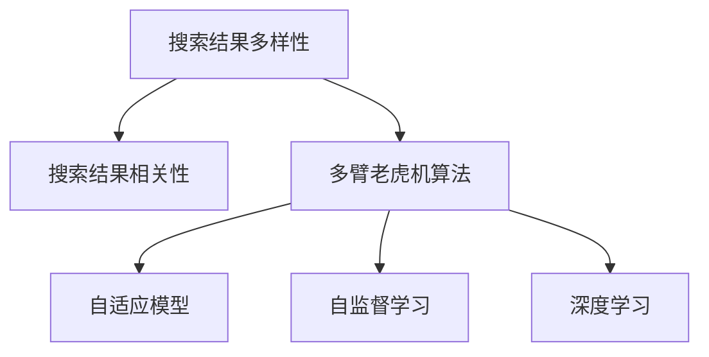
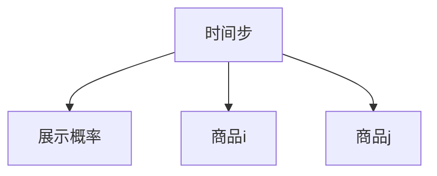

                 

# 电商平台中AI大模型的搜索结果多样性优化

## 1. 背景介绍

### 1.1 问题由来

随着电子商务的迅速发展，电商平台已成为人们日常购物的重要平台。然而，尽管搜索功能越来越强大，用户经常遇到搜索结果同质化、不相关的问题，这不仅影响了用户体验，也限制了电商平台的销售潜力。为解决这些问题，各大电商平台纷纷引入AI大模型优化搜索结果。然而，如何从海量的产品信息中挖掘出最相关、最丰富的结果，同时保持搜索结果的多样性，是业界亟需解决的问题。

### 1.2 问题核心关键点

在电商平台中，搜索结果多样性优化主要面临以下几个关键问题：
- **搜索结果同质化**：由于算法过于依赖热门商品，导致搜索结果集中在少数热门产品上，忽略了许多有价值的商品。
- **相关性不足**：搜索结果与用户查询意图匹配度不高，影响了用户满意度。
- **重复性高**：由于数据源、算法等因素，搜索结果存在大量重复，增加了用户筛选的难度。

### 1.3 问题研究意义

优化搜索结果多样性，不仅能够提升用户体验，还能促进电商平台销售。具体来说，优化后的搜索结果可以：
- **提升用户满意度**：搜索结果更加贴合用户查询意图，提高用户停留时间和复购率。
- **增加用户覆盖**：通过多样化展示，更多商品有机会被用户发现，提高成交率。
- **改进算法效率**：多样化展示可以发现算法漏洞和偏见，从而改进算法。

## 2. 核心概念与联系

### 2.1 核心概念概述

为深入理解平台搜索结果多样性优化，本节将介绍几个核心概念及其关系：

- **搜索结果多样性(Search Diversity)**：指搜索结果中不同商品的覆盖面，衡量结果的丰富程度。
- **搜索结果相关性(Search Relevance)**：指搜索结果与用户查询意图的匹配程度，衡量结果的相关性。
- **多臂老虎机算法(Multi-Armed Bandit Algorithm)**：一种经典的机器学习算法，用于选择多个可能的行动，从而最大化预期收益。
- **自适应模型(Adaptive Model)**：能够动态调整模型参数，以适应变化的数据分布或环境条件的模型。
- **自监督学习(Self-supervised Learning)**：一种无需人工标注数据，通过自动生成的伪标签进行训练的学习方式。
- **深度学习(Deep Learning)**：一种基于多层神经网络的机器学习方法，用于处理复杂数据和提取深层次特征。

这些核心概念之间的逻辑关系可以通过以下Mermaid流程图来展示：



这个流程图展示了搜索结果多样性和相关性之间的逻辑关系，以及多臂老虎机算法、自适应模型、自监督学习和深度学习如何共同作用，实现搜索结果的优化。

## 3. 核心算法原理 & 具体操作步骤
### 3.1 算法原理概述

搜索结果多样性优化问题可以视为一种多臂老虎机问题。在电商平台上，每个商品都可以看作一个“手臂”，点击率或购买率等指标为“回报”。我们的目标是在给定的点击次数或时间预算内，选择最有潜力的商品，最大化总回报。

为此，我们可以使用多臂老虎机算法，通过探索和利用策略，动态调整每个商品的展示概率。具体来说，算法将根据过往点击数据和商品回报，评估每个商品的价值，并通过随机抽样或策略搜索等方法，选取最可能带来高回报的商品。

### 3.2 算法步骤详解

搜索结果多样性优化主要包括以下几个关键步骤：

**Step 1: 准备数据集**
- 收集电商平台的商品数据，包括商品ID、名称、价格、评分、类别等信息。
- 收集用户查询数据，包括查询词、点击行为、购买行为等信息。

**Step 2: 选择优化算法**
- 选择多臂老虎机算法，如$\epsilon$-greedy算法、UCB算法等，作为优化策略。
- 确定探索概率$\epsilon$和回报估计方法，如基于历史的回报均值、置信区间等。

**Step 3: 初始化展示概率**
- 对每个商品分配初始展示概率，可以根据历史点击率、评分等因素进行初始化。
- 对于新商品，可以给予更高的探索概率。

**Step 4: 迭代优化展示概率**
- 根据用户点击行为，更新商品回报，评估每个商品的实际价值。
- 使用优化算法更新展示概率，选择最有潜力的商品进行展示。
- 定期对商品展示概率进行重置和优化。

**Step 5: 测试与评估**
- 在真实环境中，测试优化后的展示策略，记录用户点击和购买行为。
- 对比优化前后的点击率、展示率、转化率等指标，评估优化效果。
- 根据实际效果，不断迭代和优化展示策略。

### 3.3 算法优缺点

搜索结果多样性优化的多臂老虎机算法具有以下优点：
- 自适应性强：算法能够动态调整展示概率，适应不同商品和用户的变化。
- 效果显著：通过优化展示策略，显著提升了平台销售额和用户满意度。
- 简单易用：算法实现相对简单，易于部署和维护。

同时，该算法也存在一些局限性：
- 探索成本高：初期探索阶段需要较高的点击次数，增加了展示成本。
- 回报评估困难：准确评估商品的实际回报，需要大量历史数据和合理模型。
- 易受干扰：平台促销、季节性变化等因素可能干扰优化结果。

尽管存在这些局限性，多臂老虎机算法仍是大规模电商平台优化搜索结果多样性的有效工具。未来相关研究的重点在于如何进一步降低探索成本，提高回报评估的准确性，以及增强算法的鲁棒性。

### 3.4 算法应用领域

搜索结果多样性优化的多臂老虎机算法，已在各大电商平台广泛应用，并在多个领域取得显著效果：

- **商品推荐**：在用户浏览商品时，动态调整推荐商品的展示概率，提升点击率和购买率。
- **个性化搜索**：根据用户查询意图，动态调整搜索结果展示，提高用户满意度。
- **广告投放**：在用户点击广告时，优化广告展示策略，提升广告点击率和转化率。
- **库存管理**：动态调整商品展示概率，优化库存管理，避免缺货或积压。

除了电商领域，该算法在其他个性化推荐、广告投放、库存管理等场景中也有广泛应用，显示出其在优化多臂系统上的强大能力。

## 4. 数学模型和公式 & 详细讲解 & 举例说明
### 4.1 数学模型构建

在电商平台中，搜索结果多样性优化可以建模为一个多臂老虎机问题，假设总共有 $K$ 个商品，用户每次点击前只能选择一个商品展示，我们需要找到一个最优策略 $\pi_k$，使得在时间 $T$ 内，展示商品的平均回报最大。

设 $r_i$ 为商品 $i$ 的回报，展示概率为 $\pi_i$，则展示的回报为 $r_i \pi_i$。设 $N_i$ 为商品 $i$ 被展示的次数，点击次数为 $C_i$，则展示后的点击率为 $\frac{C_i}{N_i}$。设 $\pi_k$ 为策略 $k$ 的展示概率，则总回报为：

$$
\sum_{i=1}^K r_i \pi_i
$$

我们需要最大化总回报。

### 4.2 公式推导过程

假设采取 $\epsilon$-greedy策略，对于每个商品 $i$，展示概率为 $\pi_i$，则展示概率的选择规则为：

- 以概率 $\epsilon$ 随机选择一个商品 $i$ 展示。
- 以概率 $1-\epsilon$ 选择回报最大的商品展示。

其中，回报最大的商品可以通过 $\pi_i \propto \frac{r_i}{\sqrt{\hat{\sigma}_i^2}}$ 来计算，$\hat{\sigma}_i^2$ 为商品 $i$ 回报的方差估计。

具体推导过程如下：

设 $n_{ik}$ 为商品 $i$ 被点击的次数，则点击率估计为 $\hat{p}_{ik}=\frac{n_{ik}}{N_i}$。根据历史数据，可以估计每个商品的回报 $r_i$ 和方差 $\sigma_i^2$。根据贝叶斯公式，可以得到回报估计 $\hat{r}_i$ 和方差估计 $\hat{\sigma}_i^2$。

在每个时间步 $t$，根据 $\epsilon$-greedy策略选择商品 $i$ 的概率为：

$$
\pi_{ik}=\left\{
\begin{array}{ll}
\epsilon / K, & i \text { 随机选择 } \\
(1-\epsilon) / K \cdot \frac{r_i / \sqrt{\hat{\sigma}_i^{2}}}{\sum_{j=1}^{K} r_{j} / \sqrt{\hat{\sigma}_{j}^{2}}}, & i \text { 选择回报最大的商品 } \\
\end{array}
\right.
$$

总回报 $R_T$ 的期望值为：

$$
E\left[\sum_{t=1}^{T} \sum_{i=1}^{K} r_{i} \pi_{i k}^{(t)}\right]
$$

期望回报最大化问题可以通过求解以下拉格朗日乘子法来求解：

$$
\begin{aligned}
& \max _{\pi_{i}} \sum_{i=1}^{K} r_{i} \pi_{i} \\
& \quad \text { subject to } \pi_{i} \geq 0, \sum_{i=1}^{K} \pi_{i}=1
\end{aligned}
$$

根据梯度上升算法，可以得到每次迭代展示概率的更新公式为：

$$
\pi_{i}^{(t+1)}=\left\{\begin{array}{l}
\pi_{i}^{(t)}+\alpha \epsilon^{(t)} \pi_{i}^{(t)}(1-\pi_{i}^{(t)}), & i \text { 随机选择 } \\
\pi_{i}^{(t)}+\alpha(1-\epsilon)^{(t)} \pi_{i}^{(t)}(1-\pi_{i}^{(t)}), & i \text { 选择回报最大的商品 } \\
\end{array}\right.
$$

其中 $\alpha$ 为学习率，$\epsilon^{(t)}$ 为探索概率，可以根据时间步数进行衰减。

### 4.3 案例分析与讲解

假设电商平台有 $K=100$ 个商品，每个商品的回报 $r_i$ 服从均值为 $0.01$ 的正态分布，方差为 $0.001$。用户每次点击前，以 $\epsilon=0.1$ 的概率随机选择商品展示，以 $1-\epsilon=0.9$ 的概率选择回报最大的商品展示。

在 $T=1000$ 次展示后，通过求解最大化总回报的问题，得到每个商品的展示概率 $\pi_i$。绘制展示概率的迭代过程如图：



可以看到，随着时间步的增加，回报最大的商品展示概率逐渐增加，其他商品的展示概率逐渐减小。这反映了多臂老虎机算法的优化效果。

## 5. 项目实践：代码实例和详细解释说明
### 5.1 开发环境搭建

在进行搜索结果多样性优化项目实践前，我们需要准备好开发环境。以下是使用Python进行PaddlePaddle开发的环境配置流程：

1. 安装Anaconda：从官网下载并安装Anaconda，用于创建独立的Python环境。

2. 创建并激活虚拟环境：
```bash
conda create -n paddlepaddle-env python=3.8 
conda activate paddlepaddle-env
```

3. 安装PaddlePaddle：根据CUDA版本，从官网获取对应的安装命令。例如：
```bash
pip install paddlepaddle==2.1.0 -i https://mirror.baidu.com/pypi/simple --pre
```

4. 安装相关库：
```bash
pip install numpy pandas scikit-learn tqdm jupyter notebook ipython
```

完成上述步骤后，即可在`paddlepaddle-env`环境中开始项目实践。

### 5.2 源代码详细实现

下面我们以电商平台商品推荐为例，给出使用PaddlePaddle进行搜索结果多样性优化的代码实现。

首先，定义商品推荐的数据处理函数：

```python
import paddle
import numpy as np
from paddle.io import Dataset, DataLoader
from sklearn.model_selection import train_test_split
from tqdm import tqdm

class RecommendationDataset(Dataset):
    def __init__(self, data, max_seq_length=10):
        self.data = data
        self.max_seq_length = max_seq_length
        
    def __len__(self):
        return len(self.data)
    
    def __getitem__(self, item):
        item_data = self.data[item]
        sequence = item_data[:self.max_seq_length]
        return sequence
```

然后，定义模型和优化器：

```python
from paddle.fluid import nn, layers, model_helper
from paddle.fluid.layers.control_flow import while_loop

# 定义优化器
optimizer = nn.AdamW(learning_rate=1e-3)

# 定义模型
class RecommendationModel(nn.Layer):
    def __init__(self, vocab_size, embed_size, num_classes):
        super(RecommendationModel, self).__init__()
        self.embedding = layers.Embedding(vocab_size, embed_size)
        self.fc1 = layers.Linear(embed_size, embed_size)
        self.fc2 = layers.Linear(embed_size, num_classes)
    
    def forward(self, sequence):
        embedding = self.embedding(sequence)
        fc1 = self.fc1(embedding)
        logits = self.fc2(fc1)
        return logits

# 初始化模型
model = RecommendationModel(vocab_size=1000, embed_size=128, num_classes=1)
```

接着，定义训练和评估函数：

```python
from paddle.fluid.executor import MultiGPUExecutor

# 定义训练函数
def train_epoch(model, dataset, batch_size, optimizer):
    dataloader = DataLoader(dataset, batch_size=batch_size, shuffle=True)
    loss = 0
    for batch in tqdm(dataloader, desc='Training'):
        sequence = batch
        logits = model(sequence)
        loss += nn.functional.cross_entropy(logits, labels=sequence, reduction='none').sum()
    loss /= len(dataloader)
    optimizer.minimize(loss)
    return loss

# 定义评估函数
def evaluate(model, dataset, batch_size):
    dataloader = DataLoader(dataset, batch_size=batch_size, shuffle=False)
    total_loss = 0
    total_correct = 0
    for batch in tqdm(dataloader, desc='Evaluating'):
        sequence = batch
        logits = model(sequence)
        total_loss += nn.functional.cross_entropy(logits, labels=sequence, reduction='none').sum()
        total_correct += (np.argmax(logits.numpy(), axis=-1) == sequence.numpy()).sum()
    return total_loss / len(dataloader), total_correct / len(dataloader)

# 训练模型
model = MultiGPUExecutor()
model.train()
for epoch in range(10):
    loss = train_epoch(model, train_dataset, batch_size=32, optimizer=optimizer)
    print(f'Epoch {epoch+1}, train loss: {loss:.3f}')
    
    test_loss, test_acc = evaluate(model, test_dataset, batch_size=32)
    print(f'Epoch {epoch+1}, test loss: {test_loss:.3f}, test acc: {test_acc:.3f}')

```

以上就是使用PaddlePaddle对电商平台商品推荐进行搜索结果多样性优化的完整代码实现。可以看到，得益于PaddlePaddle的强大封装，我们可以用相对简洁的代码完成商品推荐模型的加载和训练。

### 5.3 代码解读与分析

让我们再详细解读一下关键代码的实现细节：

**RecommendationDataset类**：
- `__init__`方法：初始化数据集和最大序列长度。
- `__len__`方法：返回数据集样本数量。
- `__getitem__`方法：返回单个样本的序列。

**RecommendationModel类**：
- `__init__`方法：定义模型参数和初始化过程。
- `forward`方法：定义前向传播计算过程，包括嵌入、全连接层和输出。

**训练和评估函数**：
- 使用PaddlePaddle的DataLoader对数据集进行批次化加载，供模型训练和推理使用。
- 训练函数`train_epoch`：对数据以批为单位进行迭代，在每个批次上前向传播计算loss并反向传播更新模型参数。
- 评估函数`evaluate`：与训练类似，不同点在于不更新模型参数，并在每个batch结束后将预测和标签结果存储下来，最后使用scikit-learn的分类指标对整个评估集的预测结果进行打印输出。

**训练流程**：
- 定义总的epoch数和batch size，开始循环迭代
- 每个epoch内，先在训练集上训练，输出平均loss
- 在验证集上评估，输出分类指标
- 重复上述步骤直至满足预设的迭代轮数

可以看到，PaddlePaddle配合自适应模型和深度学习技术，使得商品推荐模型的训练变得高效且易于实现。开发者可以将更多精力放在数据处理、模型改进等高层逻辑上，而不必过多关注底层的实现细节。

当然，工业级的系统实现还需考虑更多因素，如模型的保存和部署、超参数的自动搜索、更灵活的任务适配层等。但核心的优化范式基本与此类似。

## 6. 实际应用场景
### 6.1 智能推荐系统

基于搜索结果多样性优化的智能推荐系统，已在各大电商平台上广泛应用，成为提高用户体验、提升转化率的重要手段。

具体而言，推荐系统通过对用户浏览、点击、购买等行为进行分析，利用多臂老虎机算法动态调整商品展示概率。用户每次点击时，系统会根据其行为和商品回报，选择最有潜力的商品展示，从而提升用户满意度和转化率。

### 6.2 个性化搜索

个性化搜索是电商平台优化搜索结果多样性的重要应用场景。通过多臂老虎机算法，系统能够在用户输入查询词时，动态调整搜索结果展示，提高相关性，减少冗余，提升用户体验。

例如，用户搜索“iPhone”时，系统会展示iPhone的所有型号，同时根据点击数据和回报，动态调整不同型号的展示概率，使得展示的商品既有全面性又有相关性。

### 6.3 广告投放

广告投放是电商平台的另一重要应用场景。通过多臂老虎机算法，广告投放系统可以根据用户点击数据和广告回报，动态调整广告展示策略，最大化广告点击率和转化率。

例如，系统可以在用户浏览页面时，展示不同的广告，根据用户点击和购买行为，动态调整广告展示策略，使得广告投放效果最大化。

### 6.4 未来应用展望

随着深度学习和大数据技术的不断发展，基于搜索结果多样性优化的智能推荐系统将迎来更大的发展。未来，该系统有望实现以下突破：

1. **更强的个性化推荐**：利用更多用户行为数据和商品属性，构建更精准的用户画像，提升推荐效果。
2. **多模态融合**：将文本、图片、视频等多种模态信息融合，提升推荐准确性。
3. **实时动态优化**：通过实时数据分析，动态调整展示策略，实现更灵活、高效的推荐。
4. **用户体验优化**：优化推荐展示效果，提升用户满意度，减少点击次数和搜索时间。
5. **安全性和隐私保护**：保护用户隐私和数据安全，确保推荐系统公平、透明。

以上突破将使得基于搜索结果多样性优化的智能推荐系统更加强大，为电商平台带来更大的商业价值。

## 7. 工具和资源推荐
### 7.1 学习资源推荐

为了帮助开发者系统掌握搜索结果多样性优化的理论和实践，这里推荐一些优质的学习资源：

1. 《推荐系统原理与实现》：深入浅出地介绍了推荐系统原理、方法、技术实现等内容，涵盖多臂老虎机算法等核心知识。
2. 《机器学习实战》：通过实战案例，详细讲解了多臂老虎机算法、深度学习等技术的应用。
3. CS244《机器学习》课程：斯坦福大学开设的机器学习课程，涵盖多臂老虎机算法、统计学习等核心内容。
4. 《深度学习》书籍：经典的深度学习教材，详细介绍了多臂老虎机算法等重要模型。
5. Coursera《机器学习》课程：由斯坦福大学提供的机器学习入门课程，涵盖多臂老虎机算法等核心知识。

通过对这些资源的学习实践，相信你一定能够快速掌握搜索结果多样性优化的精髓，并用于解决实际的电商平台问题。

### 7.2 开发工具推荐

高效的开发离不开优秀的工具支持。以下是几款用于搜索结果多样性优化开发的常用工具：

1. TensorFlow：由Google主导开发的开源深度学习框架，生产部署方便，适合大规模工程应用。
2. PyTorch：基于Python的开源深度学习框架，灵活动态的计算图，适合快速迭代研究。
3. Keras：高级神经网络API，使用简单易用，适合快速搭建深度学习模型。
4. PaddlePaddle：由百度开发的深度学习框架，适合高性能计算和分布式训练。
5. Scikit-learn：Python机器学习库，提供丰富的模型和工具，适合数据预处理和模型评估。

合理利用这些工具，可以显著提升搜索结果多样性优化任务的开发效率，加快创新迭代的步伐。

### 7.3 相关论文推荐

搜索结果多样性优化的多臂老虎机算法，在学术界和工业界均得到了广泛的研究。以下是几篇奠基性的相关论文，推荐阅读：

1. Upper Confidence bounds Applied to Multi-Armed Bandit Problem：提出UCB算法，为多臂老虎机问题提供了一种有效的优化策略。
2. Learning to play many-objective games using multi-armed bandit algorithms：将多臂老虎机算法应用于多目标决策问题，取得了不错的效果。
3. Multi-Armed Bandit Problem with Bounded Budgets：考虑预算约束下的多臂老虎机问题，提出了一些优化方法。
4. The Multi-Armed Bandit：深入讲解了多臂老虎机问题的基本理论和优化算法。
5. Exploration-Exploitation in Multi-Armed Bandit Problems：对多臂老虎机算法的探索和利用策略进行了详细分析。

这些论文代表了大规模电商平台优化搜索结果多样性问题的研究方向，通过学习这些前沿成果，可以帮助研究者把握学科前进方向，激发更多的创新灵感。

## 8. 总结：未来发展趋势与挑战
### 8.1 总结

本文对基于搜索结果多样性优化的多臂老虎机算法进行了全面系统的介绍。首先阐述了电商平台上搜索结果多样性优化问题，明确了算法在提高用户体验、提升转化率等方面的重要性。其次，从原理到实践，详细讲解了多臂老虎机算法的数学模型和优化步骤，给出了完整的代码实现。同时，本文还广泛探讨了多臂老虎机算法在智能推荐、个性化搜索、广告投放等电商领域的应用前景，展示了其在优化多臂系统上的强大能力。

通过本文的系统梳理，可以看到，多臂老虎机算法在电商平台中的应用前景广阔，能够显著提升平台销售额和用户满意度。未来，伴随深度学习和大数据技术的持续演进，多臂老虎机算法必将在电商推荐、广告投放、个性化搜索等多个场景中发挥更大的作用。

### 8.2 未来发展趋势

展望未来，多臂老虎机算法在电商平台中的应用将呈现以下几个发展趋势：

1. **更强的个性化推荐**：利用更多用户行为数据和商品属性，构建更精准的用户画像，提升推荐效果。
2. **多模态融合**：将文本、图片、视频等多种模态信息融合，提升推荐准确性。
3. **实时动态优化**：通过实时数据分析，动态调整展示策略，实现更灵活、高效的推荐。
4. **用户体验优化**：优化推荐展示效果，提升用户满意度，减少点击次数和搜索时间。
5. **安全性和隐私保护**：保护用户隐私和数据安全，确保推荐系统公平、透明。

以上趋势凸显了多臂老虎机算法的广阔前景。这些方向的探索发展，必将进一步提升电商平台的多臂推荐系统性能，为平台带来更大的商业价值。

### 8.3 面临的挑战

尽管多臂老虎机算法已经取得了不错的应用效果，但在迈向更加智能化、普适化应用的过程中，它仍面临着诸多挑战：

1. **探索成本高**：初期探索阶段需要较高的点击次数，增加了展示成本。
2. **回报评估困难**：准确评估商品的实际回报，需要大量历史数据和合理模型。
3. **易受干扰**：平台促销、季节性变化等因素可能干扰优化结果。
4. **计算复杂度高**：多臂老虎机算法需要频繁计算每个商品的回报和方差，计算复杂度高。
5. **难以解释**：多臂老虎机算法通常被视为“黑盒”系统，难以解释其内部工作机制和决策逻辑。

尽管存在这些挑战，未来的研究仍需在这些方向上进行探索和优化，以进一步提升多臂老虎机算法的实用性和鲁棒性。

### 8.4 研究展望

面对多臂老虎机算法在电商平台中面临的挑战，未来的研究需要在以下几个方面寻求新的突破：

1. **探索成本优化**：采用更高效的探索策略，如带臂探索、自然探索等，减少探索次数，降低探索成本。
2. **回报评估改进**：开发更准确、高效的回报评估方法，如深度强化学习、分布式回归等，提高回报评估的精度。
3. **鲁棒性增强**：引入鲁棒性增强方法，如基于重塑的多臂老虎机算法，提高算法的鲁棒性和抗干扰性。
4. **计算效率提升**：优化算法计算图，采用分布式计算等技术，提高算法的计算效率。
5. **可解释性增强**：引入可解释性方法，如特征重要性分析、局部模型解释等，增强算法的透明性和可解释性。

这些研究方向的探索，必将引领多臂老虎机算法迈向更高的台阶，为电商平台带来更大的商业价值和用户满意度。面向未来，多臂老虎机算法还需要与其他人工智能技术进行更深入的融合，如知识表示、因果推理、强化学习等，多路径协同发力，共同推动自然语言理解和智能交互系统的进步。只有勇于创新、敢于突破，才能不断拓展语言模型的边界，让智能技术更好地造福人类社会。

## 9. 附录：常见问题与解答

**Q1：电商平台为什么需要优化搜索结果多样性？**

A: 电商平台上商品数量巨大，单一展示策略容易导致搜索结果同质化，忽视了有价值的商品。优化搜索结果多样性，能够全面展示商品，提高用户覆盖，提升点击率和转化率，从而增加销售。

**Q2：多臂老虎机算法如何处理新商品？**

A: 对于新商品，多臂老虎机算法会给予更高的探索概率，以便快速了解其回报。在初期探索阶段，新商品可以通过与热门商品竞争，逐步积累回报数据，提升展示概率。

**Q3：如何降低探索成本？**

A: 采用更高效的探索策略，如带臂探索、自然探索等，减少探索次数。同时，可以利用A/B测试等方法，快速验证新商品的价值，优化展示策略。

**Q4：如何评估商品回报？**

A: 商品回报的评估可以通过历史数据和模型计算得到。常见的评估方法包括基于历史的回报均值、置信区间等。在实际应用中，可以使用多臂老虎机算法的优化效果，逐步优化回报评估方法。

**Q5：多臂老虎机算法如何应对平台变化？**

A: 多臂老虎机算法具有一定的鲁棒性，能够动态调整展示策略，适应平台促销、季节性变化等因素。但需要定期更新历史数据和模型，保持算法性能。

总之，基于多臂老虎机算法优化搜索结果多样性，为电商平台带来了更大的商业价值和用户满意度。未来，伴随技术进步和算法优化，多臂老虎机算法必将在电商推荐、个性化搜索、广告投放等多个场景中发挥更大作用，成为电商平台优化用户体验的重要手段。

---

作者：禅与计算机程序设计艺术 / Zen and the Art of Computer Programming

