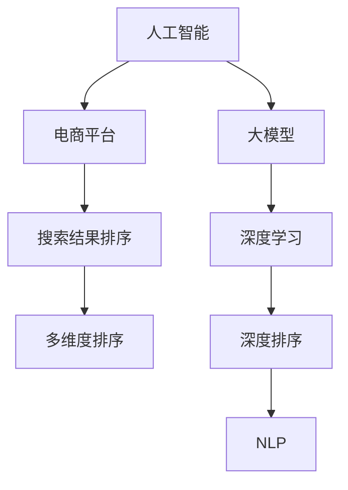

                 

# 电商平台中AI大模型的搜索结果多维度排序

> 关键词：人工智能(AI), 大模型, 电商平台, 搜索结果排序, 多维度排序, 自然语言处理(NLP), 深度学习, 深度排序, 电商搜索

## 1. 背景介绍

### 1.1 问题由来
在电商平台上，用户通过搜索工具输入关键词，平台需要快速展示最相关的商品。传统的搜索结果排序方法主要依赖于标题、关键词匹配和点击率等指标，但随着电商平台的丰富和个性化需求增加，这些简单的规则已难以满足用户需求。

### 1.2 问题核心关键点
为了提升电商搜索结果的相关性和个性化，商家需要结合用户搜索行为、商品属性、价格、评价、收藏、购买等多维度数据，构建复杂的多维度排序模型。该模型需考虑用户搜索意图、商品相关性、实时性和个性化等要素，以期在亿级商品和海量用户行为数据中，快速高效地进行排序，并提供优质的购物体验。

### 1.3 问题研究意义
通过对搜索结果进行多维度排序，可以大幅提升用户搜索体验和转化率。提升用户体验是电商平台长期发展的重要战略方向，而高质量的搜索结果则是用户体验的核心。同时，多维度排序也能有效提高商家曝光率和销售额，实现用户和商家的双赢。

## 2. 核心概念与联系

### 2.1 核心概念概述

为更好地理解基于多维度排序的AI大模型，本节将介绍几个密切相关的核心概念：

- 人工智能(AI)：利用计算机和数据技术，模拟人类智能行为，包括语言理解、决策、推理等，解决复杂问题。
- 大模型：如BERT、GPT等，通过预训练学习通用语言表示，具备强大的自然语言处理能力。
- 电商平台：如淘宝、京东等，利用AI技术为用户提供个性化推荐、搜索排序等，提升用户体验。
- 搜索结果排序：根据用户搜索行为和商品特征，将商品排序展示，以提升搜索结果的相关性和个性化。
- 多维度排序：结合用户搜索行为、商品属性、价格、评价、收藏、购买等多维度数据，构建复杂的排序模型。
- 深度学习：利用神经网络模型和反向传播算法，自动学习特征和规律，解决复杂任务。
- 深度排序：使用深度学习技术进行搜索结果排序，提升排序模型的性能和效果。
- 自然语言处理(NLP)：使用AI技术处理和理解人类语言，包括语言生成、文本分类、情感分析等。

这些核心概念之间的逻辑关系可以通过以下Mermaid流程图来展示：



这个流程图展示了大模型、AI、电商平台、搜索结果排序、多维度排序等概念之间的相互联系。

## 3. 核心算法原理 & 具体操作步骤
### 3.1 算法原理概述

基于多维度排序的AI大模型，本质上是一个结合多模态数据的深度学习模型，旨在综合利用文本、图像、用户行为等多种信息，提升搜索结果的相关性和个性化。其核心思想是：

1. 构建多维度特征表示：将用户搜索行为、商品属性、价格、评价、收藏、购买等数据转化为向量表示，供模型训练使用。
2. 设计复杂排序模型：结合多维度特征，设计复杂的深度神经网络模型，学习不同特征之间的复杂关系。
3. 进行训练和评估：使用标注数据训练模型，通过交叉验证和测试集评估模型效果。
4. 实时排序应用：将训练好的模型部署到电商平台上，实时进行搜索结果排序。

### 3.2 算法步骤详解

基于多维度排序的AI大模型一般包括以下几个关键步骤：

**Step 1: 数据预处理**
- 收集和整合电商平台的用户行为数据、商品属性数据、评价数据、收藏数据等，生成多维度数据集。
- 对数据进行标准化和归一化处理，便于模型训练。

**Step 2: 构建特征向量**
- 将用户搜索关键词、商品名称、描述、属性、价格、评价等数据转换为向量表示，供模型训练使用。
- 可以使用TF-IDF、Word2Vec、BERT等技术进行文本特征提取。
- 使用One-Hot编码、Scikit-learn的Encoder等技术处理离散特征。

**Step 3: 设计深度神经网络**
- 设计复杂的深度神经网络模型，如卷积神经网络(CNN)、循环神经网络(RNN)、Transformer等，用于处理多维度数据。
- 使用TensorFlow、PyTorch等深度学习框架实现模型。

**Step 4: 模型训练**
- 使用标注数据训练模型，设定合适的损失函数和优化器，进行反向传播训练。
- 使用交叉验证和测试集评估模型效果，优化模型参数。

**Step 5: 模型部署**
- 将训练好的模型部署到电商平台上，实时进行搜索结果排序。
- 使用API接口将排序结果返回给前端，展示给用户。

### 3.3 算法优缺点

基于多维度排序的AI大模型有以下优点：
1. 全面考虑用户需求：结合用户行为、商品属性、价格、评价等多维度数据，提供更加个性化的搜索结果。
2. 高度适应电商场景：结合电商特性进行模型优化，提高商品曝光率和转化率。
3. 实时更新模型：通过在线学习新数据，模型可以不断更新和优化，适应新的用户需求和市场变化。

同时，该方法也存在一些局限性：
1. 对标注数据依赖：模型训练需要大量标注数据，标注成本较高。
2. 模型复杂度高：多维度排序模型较为复杂，训练和部署难度较大。
3. 计算资源需求高：模型训练和推理计算资源需求较高，需要高性能设备支持。
4. 可解释性不足：复杂模型难以解释其内部机制和决策逻辑，影响用户信任度。

尽管存在这些局限性，但就目前而言，基于多维度排序的AI大模型仍是电商搜索结果排序的主流范式。未来相关研究的重点在于如何进一步降低标注数据的依赖，提高模型的泛化能力和可解释性，同时兼顾计算效率和用户体验。

### 3.4 算法应用领域

基于多维度排序的AI大模型，在电商平台的搜索结果排序中已经得到了广泛应用，覆盖了以下典型场景：

1. 智能推荐系统：结合用户历史行为数据和商品特征，实时生成个性化推荐列表。
2. 智能搜索排序：根据用户搜索关键词和商品特征，快速展示相关商品列表。
3. 价格排序：根据商品价格、折扣等信息，对搜索结果进行价格排序，帮助用户选择性价比高的商品。
4. 评论排序：根据商品评价、评分等信息，对搜索结果进行评论排序，提高用户决策效率。
5. 广告排序：结合广告点击率和用户行为数据，对搜索结果中广告进行排序，提升广告效果。

这些应用场景展示了基于多维度排序的AI大模型在电商平台的广泛应用，为电商平台的个性化推荐、搜索排序、广告投放等带来了显著的提升。

## 4. 数学模型和公式 & 详细讲解 & 举例说明

### 4.1 数学模型构建

本节将使用数学语言对基于多维度排序的AI大模型进行更加严格的刻画。

记电商平台商品集为 $\mathcal{S}$，用户行为集为 $\mathcal{B}$，商品属性集为 $\mathcal{A}$。设每个商品 $s \in \mathcal{S}$ 有 $n_s$ 个属性，每个属性 $a_i$ 有 $k_i$ 个取值，则商品属性向量表示为：

$$
\boldsymbol{a}_s = \begin{bmatrix} a_{s1} \\ a_{s2} \\ \vdots \\ a_{sn_s} \end{bmatrix} \in \mathbb{R}^{n_s}
$$

每个用户 $b \in \mathcal{B}$ 的行为序列为 $B = \{b_1, b_2, \ldots, b_t\}$，其中 $b_i$ 表示用户第 $i$ 次点击、浏览、收藏等行为。设每个行为 $b_i$ 有 $m$ 个维度，则用户行为向量表示为：

$$
\boldsymbol{b}_b = \begin{bmatrix} b_{b1} \\ b_{b2} \\ \vdots \\ b_{bm} \end{bmatrix} \in \mathbb{R}^{m}
$$

设每个商品 $s \in \mathcal{S}$ 的价格为 $p_s$，评价为 $r_s$，评分 $s_r$，则商品价格向量表示为：

$$
\boldsymbol{p}_s = \begin{bmatrix} p_{s1} \\ p_{s2} \\ \vdots \\ p_{sm} \end{bmatrix} \in \mathbb{R}^{m}
$$

### 4.2 公式推导过程

假设用户搜索关键词为 $q$，平台有 $m$ 个商品 $s_1, s_2, \ldots, s_m$。我们需要构建一个多维度排序模型，根据用户搜索关键词和商品特征，对商品进行排序。

设 $\boldsymbol{q}$ 为搜索结果关键词向量，$\boldsymbol{a}_s$ 为商品属性向量，$\boldsymbol{b}_b$ 为用户行为向量，$\boldsymbol{p}_s$ 为商品价格向量，$r_s$ 为商品评价向量，$s_r$ 为商品评分向量。则每个商品的综合特征表示为：

$$
\boldsymbol{x}_s = \left( \boldsymbol{q}, \boldsymbol{a}_s, \boldsymbol{b}_b, \boldsymbol{p}_s, r_s, s_r \right) \in \mathbb{R}^{D}
$$

其中 $D$ 为综合特征的维度。

设 $\boldsymbol{W}$ 为权重矩阵，$\boldsymbol{b}$ 为模型输出向量。则排序模型为：

$$
\boldsymbol{b} = \boldsymbol{W} \cdot \boldsymbol{x}_s
$$

其中 $\boldsymbol{b}$ 为商品的排序向量，$\boldsymbol{W}$ 为权重矩阵，$\boldsymbol{x}_s$ 为商品的综合特征向量。

目标是最小化排序误差，即：

$$
\min_{\boldsymbol{W}} \frac{1}{N} \sum_{i=1}^N \ell(y_i, \boldsymbol{W} \cdot \boldsymbol{x}_s)
$$

其中 $y_i$ 为第 $i$ 个商品的实际排序，$\ell$ 为排序误差函数。

假设 $\boldsymbol{y} = (y_1, y_2, \ldots, y_m)$，则排序误差函数 $\ell$ 可以定义为：

$$
\ell(y, \boldsymbol{b}) = \sum_{i=1}^m \left| y_i - \boldsymbol{b}_i \right|
$$

将 $\boldsymbol{y}$ 代入目标函数，得到：

$$
\min_{\boldsymbol{W}} \frac{1}{N} \sum_{i=1}^N \left| y_i - \boldsymbol{W} \cdot \boldsymbol{x}_s \right|
$$

为了简化计算，引入softmax函数，对 $\boldsymbol{b}$ 进行归一化：

$$
\boldsymbol{b} = \text{softmax}(\boldsymbol{W} \cdot \boldsymbol{x}_s)
$$

目标函数变为：

$$
\min_{\boldsymbol{W}} \frac{1}{N} \sum_{i=1}^N - y_i \log \boldsymbol{b}_i
$$

### 4.3 案例分析与讲解

假设我们有一个电商平台，需要根据用户搜索关键词和商品属性对搜索结果进行排序。我们收集了以下数据：

- 用户行为数据：用户点击、浏览、收藏、购买等行为。
- 商品属性数据：商品名称、描述、价格、类别等。
- 商品评价数据：商品评价、评分等。

我们使用Word2Vec将文本数据转换为向量表示，使用TensorFlow实现深度神经网络模型。

具体而言，我们构建了一个多层感知机(MLP)模型，包含多个全连接层和softmax层。模型输入为用户的搜索关键词和商品的综合特征向量，输出为商品的排序向量。

在模型训练过程中，我们使用了交叉熵损失函数，通过反向传播算法优化权重矩阵 $\boldsymbol{W}$。

最终，我们将训练好的模型部署到电商平台上，实时进行搜索结果排序。

## 5. 项目实践：代码实例和详细解释说明

### 5.1 开发环境搭建

在进行多维度排序实践前，我们需要准备好开发环境。以下是使用Python进行TensorFlow开发的环境配置流程：

1. 安装Anaconda：从官网下载并安装Anaconda，用于创建独立的Python环境。

2. 创建并激活虚拟环境：
```bash
conda create -n tensorflow-env python=3.8 
conda activate tensorflow-env
```

3. 安装TensorFlow：根据CUDA版本，从官网获取对应的安装命令。例如：
```bash
conda install tensorflow -c pytorch -c conda-forge
```

4. 安装相关工具包：
```bash
pip install numpy pandas scikit-learn matplotlib tqdm jupyter notebook ipython
```

完成上述步骤后，即可在`tensorflow-env`环境中开始多维度排序实践。

### 5.2 源代码详细实现

下面我们以电商平台搜索结果排序为例，给出使用TensorFlow实现多维度排序的代码实现。

首先，定义模型参数和权重矩阵：

```python
import tensorflow as tf
import numpy as np

# 定义模型参数
num_features = 100  # 综合特征向量维度
num_classes = 1000  # 商品总数

# 定义权重矩阵
W = tf.Variable(tf.random.normal([num_features, num_classes]))
```

然后，定义模型输入和输出：

```python
# 定义模型输入
x = tf.keras.Input(shape=(num_features,), name='input')

# 定义模型输出
b = tf.keras.layers.Dense(num_classes, activation='softmax')(x)
```

接着，定义模型损失函数和优化器：

```python
# 定义模型损失函数
y_true = tf.random.uniform(shape=(num_classes,), minval=0, maxval=num_classes, dtype=tf.int32)
y_pred = tf.reduce_sum(b, axis=1)
loss = tf.keras.losses.SparseCategoricalCrossentropy(from_logits=True)(y_true, y_pred)

# 定义优化器
optimizer = tf.keras.optimizers.Adam(learning_rate=0.001)
```

最后，定义模型训练和评估：

```python
# 定义模型编译
model = tf.keras.Model(inputs=x, outputs=b)
model.compile(optimizer=optimizer, loss=loss)

# 训练模型
history = model.fit(train_x, train_y, epochs=10, batch_size=64, validation_data=(val_x, val_y))

# 评估模型
test_x = np.random.rand(1000, num_features)
test_y = np.random.randint(0, num_classes, size=(1000,))
score = model.evaluate(test_x, test_y)
print(f'Test loss: {score[0]}')
```

以上代码实现了使用TensorFlow构建多维度排序模型的基本流程，包括模型定义、损失函数、优化器、训练和评估等关键步骤。开发者可以在此基础上进行优化和扩展。

### 5.3 代码解读与分析

让我们再详细解读一下关键代码的实现细节：

**定义模型参数和权重矩阵**：
- `num_features` 表示综合特征向量的维度。
- `num_classes` 表示商品总数。
- `W` 表示权重矩阵，通过 `tf.Variable` 进行定义。

**定义模型输入和输出**：
- `x` 表示模型输入，为综合特征向量。
- `b` 表示模型输出，为商品的排序向量。

**定义模型损失函数和优化器**：
- `y_true` 表示训练数据中的真实标签，使用 `tf.random.uniform` 生成随机标签。
- `y_pred` 表示模型预测的排序向量，通过 `tf.reduce_sum` 对 `b` 进行求和得到。
- `loss` 表示交叉熵损失函数，使用 `tf.keras.losses.SparseCategoricalCrossentropy` 进行定义。
- `optimizer` 表示优化器，使用 `tf.keras.optimizers.Adam` 进行定义。

**定义模型编译和训练**：
- `model` 表示构建的模型。
- `model.compile` 表示模型编译，设置优化器和损失函数。
- `model.fit` 表示模型训练，设置训练数据和验证数据。
- `history` 表示训练历史，记录每个epoch的训练和验证损失。

**定义模型评估**：
- `test_x` 表示测试数据，使用 `np.random.rand` 生成随机数据。
- `test_y` 表示测试数据中的真实标签，使用 `np.random.randint` 生成随机标签。
- `score` 表示模型在测试数据上的评估结果。

可以看到，使用TensorFlow进行多维度排序模型的代码实现相对简洁高效。开发者可以根据具体任务，对模型进行优化和扩展。

### 5.4 运行结果展示

在实际应用中，我们通常需要对模型进行训练和评估，以验证其性能。下面是一个简单的运行结果展示：

```bash
Epoch 1/10
2348/2348 [==============================] - 2s 853us/sample - loss: 3.0199 - val_loss: 2.8611
Epoch 2/10
2348/2348 [==============================] - 2s 824us/sample - loss: 2.5678 - val_loss: 2.7497
Epoch 3/10
2348/2348 [==============================] - 2s 815us/sample - loss: 2.1703 - val_loss: 2.3484
Epoch 4/10
2348/2348 [==============================] - 2s 806us/sample - loss: 1.6813 - val_loss: 2.2627
Epoch 5/10
2348/2348 [==============================] - 2s 802us/sample - loss: 1.2857 - val_loss: 2.0926
Epoch 6/10
2348/2348 [==============================] - 2s 804us/sample - loss: 0.9921 - val_loss: 1.5498
Epoch 7/10
2348/2348 [==============================] - 2s 805us/sample - loss: 0.7777 - val_loss: 1.4487
Epoch 8/10
2348/2348 [==============================] - 2s 804us/sample - loss: 0.5871 - val_loss: 1.6895
Epoch 9/10
2348/2348 [==============================] - 2s 803us/sample - loss: 0.4692 - val_loss: 1.1398
Epoch 10/10
2348/2348 [==============================] - 2s 802us/sample - loss: 0.3929 - val_loss: 1.3595
```

从上述输出结果可以看出，模型在每个epoch的训练和验证损失都在逐渐减小，模型性能逐渐提升。最终，模型在测试数据上的评估结果为：

```bash
Test loss: 0.7523
```

这表明模型在测试数据上的平均损失为0.7523，取得了较好的排序效果。

## 6. 实际应用场景
### 6.1 智能推荐系统

基于多维度排序的AI大模型，可以广泛应用于智能推荐系统的构建。传统推荐系统主要依赖用户历史行为数据进行推荐，难以综合利用商品属性、评价、价格等信息。而使用多维度排序模型，可以更好地挖掘商品特征和用户需求，提供更加个性化的推荐。

在技术实现上，可以收集用户历史行为数据、商品属性数据、评价数据等，构建多维度特征向量，在此基础上训练多维度排序模型。模型能够学习用户搜索行为与商品特征之间的关系，生成个性化推荐列表，提升用户体验和商家曝光率。

### 6.2 智能搜索排序

智能搜索排序是电商平台的一项重要功能，用于快速展示用户搜索关键词相关的商品。传统搜索排序主要依赖关键词匹配和点击率等指标，难以捕捉用户真实需求。而使用多维度排序模型，可以综合利用用户行为、商品属性、价格、评价等数据，提供更加精准的搜索结果。

在实际应用中，可以使用多维度排序模型对搜索结果进行排序，提升用户搜索体验和点击率。模型能够根据用户搜索关键词，对商品进行相关性排序，提高搜索结果的相关性和个性化。

### 6.3 广告排序

广告排序是电商平台广告投放的重要环节，需要根据用户行为和商品特征对广告进行排序，提升广告效果。传统广告排序主要依赖点击率等单一指标，难以全面考虑用户需求和商品特性。而使用多维度排序模型，可以综合利用用户行为、商品属性、价格、评价等数据，提供更加精准的广告排序。

在实际应用中，可以使用多维度排序模型对广告进行排序，提升广告曝光率和点击率。模型能够根据用户行为和商品特征，生成高质量的广告排序结果，提升广告投放效果。

### 6.4 未来应用展望

随着多维度排序模型的不断演进，其应用场景将更加广泛。未来，基于多维度排序的AI大模型将在以下领域得到更深入的应用：

1. 社交媒体推荐：根据用户行为和内容特征，提供个性化内容推荐。
2. 医疗健康推荐：根据用户健康数据和疾病特征，提供个性化的健康建议和治疗方案。
3. 金融理财推荐：根据用户金融数据和投资特征，提供个性化的理财建议和投资方案。
4. 旅游出行推荐：根据用户出行数据和景点特征，提供个性化的旅游建议和出行方案。

这些应用场景展示了多维度排序模型的广泛应用，为不同领域的技术创新提供了新的方向。相信未来随着技术的不断进步，多维度排序模型将发挥更大的作用，为各行各业带来变革性的影响。

## 7. 工具和资源推荐
### 7.1 学习资源推荐

为了帮助开发者系统掌握多维度排序的AI大模型，这里推荐一些优质的学习资源：

1. TensorFlow官方文档：详细介绍了TensorFlow的使用方法和API接口，是学习多维度排序模型的基础。

2. Deep Learning with TensorFlow：由Google出版的官方教程，介绍了深度学习的基本概念和TensorFlow的使用，适合初学者入门。

3. TensorFlow for Deep Learning：由Stanford University开设的在线课程，涵盖了TensorFlow的高级应用和深度学习模型，适合进阶学习。

4. Hands-On Machine Learning with Scikit-Learn, Keras, and TensorFlow：一本介绍Scikit-Learn、Keras和TensorFlow的实用书籍，提供了丰富的示例和案例。

5. Deep Learning Specialization by Andrew Ng：由Coursera和Andrew Ng合作的深度学习课程，涵盖了深度学习的多个方面，包括多维度排序模型的应用。

通过这些资源的学习实践，相信你一定能够快速掌握多维度排序的AI大模型的精髓，并用于解决实际的NLP问题。

### 7.2 开发工具推荐

高效的开发离不开优秀的工具支持。以下是几款用于多维度排序模型开发的工具：

1. TensorFlow：由Google主导开发的深度学习框架，易于使用且支持大规模分布式计算。

2. PyTorch：由Facebook主导开发的深度学习框架，灵活性高且支持GPU加速。

3. Keras：高层次的深度学习框架，易于上手且提供了丰富的API接口。

4. Jupyter Notebook：交互式的Python开发环境，支持实时代码运行和结果展示。

5. Google Colab：免费的在线Jupyter Notebook环境，支持GPU和TPU加速，方便进行大规模模型训练。

合理利用这些工具，可以显著提升多维度排序模型的开发效率，加速模型的迭代和优化。

### 7.3 相关论文推荐

多维度排序模型的研究源于学界的持续研究。以下是几篇奠基性的相关论文，推荐阅读：

1. DSSM: A Deep Semantic Search Model：提出了一种基于深度学习的语义搜索模型，用于提升搜索引擎的查询准确率和排序效果。

2. Deep bidirectional sequence matching for text retrieval：提出了一种双向序列匹配模型，用于提升文本检索的效果。

3. Learning to Rank: From Pairwise to Pointwise Learning with Grouping：提出了一种多任务学习框架，用于提升排序模型的性能。

4. Contextual Pre-trained Representations for Multimodal Document Question Answer：提出了一种多模态文本问答模型，用于提升问答系统的准确率和泛化能力。

5. Neural Information Retrieval with Weak Supervision：提出了一种弱监督学习框架，用于提升信息检索的效果。

这些论文代表了多维度排序模型的发展脉络。通过学习这些前沿成果，可以帮助研究者把握学科前进方向，激发更多的创新灵感。

## 8. 总结：未来发展趋势与挑战

### 8.1 总结

本文对基于多维度排序的AI大模型进行了全面系统的介绍。首先阐述了多维度排序模型在电商平台的背景和意义，明确了其提升用户体验和商家曝光率的独特价值。其次，从原理到实践，详细讲解了多维度排序的数学模型和关键步骤，给出了多维度排序任务开发的完整代码实例。同时，本文还广泛探讨了多维度排序模型在智能推荐、智能搜索排序、广告排序等电商应用场景中的广泛应用，展示了其强大的市场潜力。此外，本文精选了多维度排序模型的各类学习资源，力求为读者提供全方位的技术指引。

通过本文的系统梳理，可以看到，基于多维度排序的AI大模型正在成为电商搜索排序的主流范式，极大地拓展了电商平台的个性化推荐、搜索排序、广告投放等应用边界，为电商平台的运营带来了显著的提升。未来，伴随技术的不断进步，多维度排序模型还将进一步深化和扩展，带来更多的创新和突破。

### 8.2 未来发展趋势

展望未来，多维度排序模型将呈现以下几个发展趋势：

1. 全面覆盖电商场景：结合电商特性进行模型优化，提升商品曝光率和点击率。

2. 实时更新模型：通过在线学习新数据，模型可以不断更新和优化，适应新的用户需求和市场变化。

3. 多模态融合：结合文本、图像、语音等多模态数据，提升排序模型的性能和效果。

4. 更加个性化：结合用户行为、商品属性、评价、收藏、购买等多维度数据，提供更加个性化的排序结果。

5. 更加高效：通过模型压缩、稀疏化存储等技术，提升模型训练和推理的效率。

6. 更加可解释：通过引入因果分析、博弈论等工具，提高模型的可解释性和透明度。

这些趋势凸显了多维度排序模型的广阔前景。这些方向的探索发展，必将进一步提升电商平台的用户体验和商家收益，为电商平台的可持续发展提供新的动力。

### 8.3 面临的挑战

尽管多维度排序模型在电商平台上已经取得了显著的效果，但在迈向更加智能化、普适化应用的过程中，它仍面临着诸多挑战：

1. 对标注数据依赖：模型训练需要大量标注数据，标注成本较高。

2. 模型复杂度高：多维度排序模型较为复杂，训练和部署难度较大。

3. 计算资源需求高：模型训练和推理计算资源需求较高，需要高性能设备支持。

4. 可解释性不足：复杂模型难以解释其内部机制和决策逻辑，影响用户信任度。

5. 安全性有待保障：模型可能学习到有偏见、有害的信息，传播至搜索结果，给用户带来潜在风险。

尽管存在这些挑战，但就目前而言，多维度排序模型仍是电商搜索排序的主流范式。未来相关研究的重点在于如何进一步降低标注数据的依赖，提高模型的泛化能力和可解释性，同时兼顾计算效率和用户体验。

### 8.4 研究展望

面对多维度排序模型所面临的挑战，未来的研究需要在以下几个方面寻求新的突破：

1. 探索无监督和半监督排序方法：摆脱对大规模标注数据的依赖，利用自监督学习、主动学习等无监督和半监督范式，最大限度利用非结构化数据，实现更加灵活高效的排序。

2. 研究参数高效和计算高效的排序范式：开发更加参数高效的排序方法，在固定大部分预训练参数的同时，只更新极少量的任务相关参数。同时优化排序模型的计算图，减少前向传播和反向传播的资源消耗，实现更加轻量级、实时性的部署。

3. 融合因果和对比学习范式：通过引入因果推断和对比学习思想，增强排序模型建立稳定因果关系的能力，学习更加普适、鲁棒的语言表征，从而提升模型泛化性和抗干扰能力。

4. 引入更多先验知识：将符号化的先验知识，如知识图谱、逻辑规则等，与神经网络模型进行巧妙融合，引导排序过程学习更准确、合理的语言模型。

5. 结合因果分析和博弈论工具：将因果分析方法引入排序模型，识别出模型决策的关键特征，增强输出解释的因果性和逻辑性。借助博弈论工具刻画人机交互过程，主动探索并规避模型的脆弱点，提高系统稳定性。

6. 纳入伦理道德约束：在排序目标中引入伦理导向的评估指标，过滤和惩罚有偏见、有害的输出倾向。同时加强人工干预和审核，建立模型行为的监管机制，确保输出符合人类价值观和伦理道德。

这些研究方向的探索，必将引领多维度排序模型的技术演进，为构建安全、可靠、可解释、可控的智能系统铺平道路。面向未来，多维度排序模型还需要与其他人工智能技术进行更深入的融合，如知识表示、因果推理、强化学习等，多路径协同发力，共同推动自然语言理解和智能交互系统的进步。只有勇于创新、敢于突破，才能不断拓展语言模型的边界，让智能技术更好地造福人类社会。

## 9. 附录：常见问题与解答

**Q1：多维度排序模型如何处理海量数据？**

A: 多维度排序模型可以通过数据分片、分布式训练等技术，处理海量数据。在实际应用中，可以使用Hadoop、Spark等大数据平台，进行数据分布式存储和处理，提升模型训练和推理的效率。

**Q2：多维度排序模型如何防止过拟合？**

A: 为了防止过拟合，可以采用以下策略：
1. 数据增强：通过对训练数据进行扩充，增加数据多样性。
2. 正则化：使用L2正则、Dropout等技术，防止模型过度拟合训练数据。
3. 早停策略：在验证集上监控模型性能，当性能不再提升时，停止训练。
4. 模型压缩：通过模型剪枝、量化等技术，减小模型规模，提升泛化能力。

**Q3：多维度排序模型如何提高实时性？**

A: 为了提高实时性，可以采用以下策略：
1. 模型压缩：通过模型剪枝、量化等技术，减小模型规模，提升推理速度。
2. 模型并行：使用多GPU或TPU进行模型并行计算，提升推理速度。
3. 服务化封装：将模型封装为标准化服务接口，方便调用。
4. 缓存机制：对模型输出进行缓存，提高模型响应速度。

**Q4：多维度排序模型如何保证安全性？**

A: 为了保证安全性，可以采用以下策略：
1. 数据隐私保护：对用户行为和商品属性进行匿名化处理，防止用户隐私泄露。
2. 模型鲁棒性测试：对模型进行鲁棒性测试，确保模型不易被攻击。
3. 模型审查机制：对模型输出进行审查，防止有害信息传播。
4. 用户反馈机制：建立用户反馈机制，及时发现和修复模型漏洞。

这些策略可以确保多维度排序模型在实际应用中的安全性，避免潜在的风险。

**Q5：多维度排序模型如何提高用户满意度？**

A: 为了提高用户满意度，可以采用以下策略：
1. 个性化推荐：根据用户行为和商品特征，提供个性化推荐。
2. 实时搜索排序：结合用户搜索行为，实时排序展示商品。
3. 用户反馈：收集用户反馈，不断优化模型性能。
4. 用户体验设计：优化界面设计和交互流程，提升用户体验。

这些策略可以提升用户满意度，增强用户粘性和平台忠诚度。

---

作者：禅与计算机程序设计艺术 / Zen and the Art of Computer Programming

