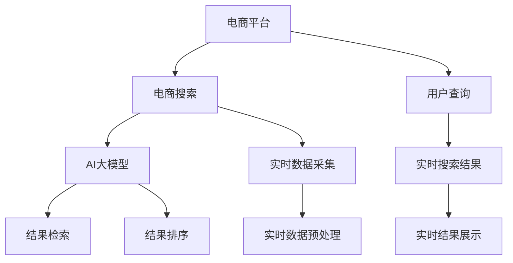

                 

# 电商平台中AI大模型的搜索结果时间敏感性优化

> 关键词：
- 电商平台
- AI大模型
- 搜索结果优化
- 时间敏感性
- 实时计算
- 分布式系统
- 延迟优化

## 1. 背景介绍

在电商领域，用户的搜索行为往往具有很强的时间敏感性，对搜索结果的时效性要求非常高。如何通过AI大模型提升电商平台的搜索结果质量，同时满足用户对结果实时性的高要求，成为电商搜索优化的一项重大挑战。本文将从背景、动机、挑战等角度，深入探讨如何在电商搜索场景中，通过优化AI大模型的结果时间敏感性，提高用户体验和平台效率。

### 1.1 电商搜索的重要性
电商搜索是用户进入电商平台的第一道门槛，其体验和效果直接影响用户的购买决策。快速、准确的搜索结果，能显著提升用户的购物体验，增加平台的流量和转化率。传统的文本检索方法难以应对海量用户查询，并且依赖人工构建词典和词向量，效率低下。AI大模型通过预训练学习和迁移学习，可以自动化地构建语义丰富的索引和表示，极大地提升了电商搜索的效率和效果。

### 1.2 时间敏感性的引入
在电商搜索中，用户行为往往受价格波动、库存变化、活动促销等多种实时因素的影响，这些因素变化快速，对搜索结果的时效性提出了更高的要求。因此，如何在保证结果质量的前提下，优化搜索结果的时间敏感性，成为了电商平台面临的重大挑战。

## 2. 核心概念与联系

### 2.1 核心概念概述

为更好地理解电商平台中AI大模型搜索结果时间敏感性优化的原理，本节将介绍几个关键概念：

- AI大模型：以深度学习为基础，通过自监督学习和迁移学习，自动学习大量文本数据语义表示的模型，如BERT、GPT等。
- 电商平台搜索：用户通过关键词或自然语言描述，检索商品信息的过程。电商平台的搜索功能需要快速、准确地返回与查询相关的商品信息。
- 时间敏感性：搜索结果的时间相关性，即搜索结果更新频率和时效性。

### 2.2 核心概念原理和架构的 Mermaid 流程图



以上流程图展示了电商搜索系统中核心组件和工作流程。用户通过查询提交请求，电商平台调用AI大模型进行搜索处理，返回实时结果并展示给用户。

## 3. 核心算法原理 & 具体操作步骤

### 3.1 算法原理概述

电商搜索中的AI大模型主要通过预训练和微调，学习商品描述和用户查询之间的语义匹配。为提高搜索结果的时效性，算法原理主要分为以下几个步骤：

1. 实时数据采集：收集最新的商品信息，如价格、库存、促销活动等。
2. 实时数据预处理：对收集到的数据进行清洗、归一化、编码等预处理操作。
3. 模型推理：调用AI大模型对预处理后的数据进行推理计算，生成实时搜索结果。
4. 结果排序：根据排序算法，如Click-Through Rate (CTR)排序、语义相似度排序等，对搜索结果进行排序。
5. 结果展示：将排序后的结果展示给用户。

### 3.2 算法步骤详解

具体步骤如下：

**Step 1: 实时数据采集**

在电商平台上，实时数据主要来源于商品详情页、库存系统、促销系统等。需要设计高效的数据采集机制，确保数据的实时性、完整性、准确性。

**Step 2: 实时数据预处理**

实时数据预处理的目标是生成模型可以处理的输入。预处理过程包括：

1. 清洗：去除重复、噪声、无关数据。
2. 归一化：将不同尺度的数据标准化，便于模型处理。
3. 编码：将文本数据转换为模型可以接受的数字格式，如word embedding等。

**Step 3: 模型推理**

模型推理过程包括：

1. 调用AI大模型：将预处理后的数据输入大模型进行推理计算，生成嵌入表示。
2. 生成实时搜索结果：根据查询和结果的嵌入表示，计算相似度，排序生成结果。

**Step 4: 结果排序**

结果排序的主要目标是提升用户体验，常见的排序算法有：

1. CTR排序：根据用户点击行为预测点击概率，排序输出。
2. 语义相似度排序：计算查询和商品描述的语义相似度，排序输出。
3. 混合排序：结合多个排序指标，如CTR、用户历史行为、商品评价等。

**Step 5: 结果展示**

结果展示主要通过前端技术实现，如Web页面、移动应用等。展示时需考虑：

1. 用户界面：设计美观、易用的用户界面。
2. 性能优化：优化加载速度和渲染效率。
3. 用户体验：确保结果可读性强，易于用户理解。

### 3.3 算法优缺点

#### 优点

1. 提高搜索结果的时效性：实时数据采集和预处理，能快速响应用户查询，满足用户对实时性的高要求。
2. 提升搜索结果的准确性：AI大模型强大的语义理解能力，能准确匹配查询和商品描述。
3. 可扩展性强：采用分布式系统，支持大规模商品数据和用户查询，灵活扩展。
4. 节省计算资源：AI大模型预训练过程复杂，采用微调策略，在固定大部分参数的情况下，只调整少数参数，节省计算资源。

#### 缺点

1. 实时数据质量要求高：实时数据采集和预处理需要严格的质量控制，避免数据错误和偏差。
2. 数据一致性复杂：实时数据与静态数据可能存在不一致，需设计复杂的数据同步机制。
3. 模型训练复杂：AI大模型的推理过程复杂，需要优化模型结构和参数配置。
4. 系统架构复杂：分布式系统需要考虑数据一致性、负载均衡、故障恢复等问题。

### 3.4 算法应用领域

AI大模型搜索结果时间敏感性优化技术，在电商搜索、金融交易、智能推荐等众多领域均有应用：

- 电商搜索：实时更新商品信息，优化搜索结果。
- 金融交易：实时监控股票、期货等金融数据，提升交易效率。
- 智能推荐：实时分析用户行为，推荐相关商品或服务。
- 广告投放：实时调整广告投放策略，提高点击率。
- 社交网络：实时推荐用户兴趣内容，提升用户体验。

这些应用场景都要求在短时间内处理大量数据，并输出高质量的结果，因此实时性优化具有重要意义。

## 4. 数学模型和公式 & 详细讲解

### 4.1 数学模型构建

电商搜索优化中的数学模型主要包括以下几部分：

- 商品描述：用自然语言描述商品属性、特点等信息。
- 用户查询：用自然语言表达用户的搜索意图。
- 实时数据：动态变化的商品信息、促销活动、用户行为等。
- 排序算法：计算查询和结果的匹配度，进行排序输出。

假设查询为 $q$，商品描述为 $d$，实时数据为 $r$，则模型优化目标为：

$$
\min_{q,d,r} \{ \mathcal{L}_{CTR} + \mathcal{L}_{SEM} + \mathcal{L}_{CONS} \}
$$

其中：

- $\mathcal{L}_{CTR}$：点击率损失函数，衡量查询-结果的点击效果。
- $\mathcal{L}_{SEM}$：语义相似度损失函数，衡量查询-结果的语义匹配度。
- $\mathcal{L}_{CONS}$：一致性损失函数，保证数据一致性和查询-结果的一致性。

### 4.2 公式推导过程

以点击率损失函数 $\mathcal{L}_{CTR}$ 为例，进行详细推导。

假设查询 $q$ 和商品 $d$ 的嵌入表示分别为 $q^{vec}$ 和 $d^{vec}$，实时数据 $r$ 的嵌入表示为 $r^{vec}$。则点击率损失函数可以表示为：

$$
\mathcal{L}_{CTR} = \sum_{(q,d,r)} -\log \sigma(\mathbf{W}(q^{vec} + r^{vec}) \cdot d^{vec})
$$

其中，$\sigma$ 为 sigmoid 函数，$\mathbf{W}$ 为可学习的线性变换矩阵。

该公式表示在查询-结果对 $(q,d)$ 的实时数据 $r$ 的条件下，点击概率为 $\sigma(\mathbf{W}(q^{vec} + r^{vec}) \cdot d^{vec})$，损失函数衡量该概率预测的准确性。

### 4.3 案例分析与讲解

#### 案例1：电商搜索实时更新商品信息

假设某电商平台有实时促销活动，需要对商品价格、库存进行更新。具体优化步骤如下：

1. 实时数据采集：通过API接口，获取最新的促销活动信息，包括商品ID、价格、库存等。
2. 实时数据预处理：对采集到的数据进行清洗、归一化，转换为模型可接受格式。
3. 模型推理：调用AI大模型，重新生成商品嵌入表示，并进行匹配计算。
4. 结果排序：根据CTR排序算法，重新排序搜索结果。
5. 结果展示：在前端展示最新更新后的搜索结果。

#### 案例2：智能推荐系统实时调整参数

假设某智能推荐系统需要根据用户浏览行为实时调整推荐策略。具体优化步骤如下：

1. 实时数据采集：通过日志分析，获取用户最近的浏览、点击、购买等行为数据。
2. 实时数据预处理：对行为数据进行清洗、归一化，转换为模型可接受格式。
3. 模型推理：调用AI大模型，重新生成用户行为嵌入表示，并进行推荐计算。
4. 结果排序：根据用户行为相似度排序算法，重新排序推荐结果。
5. 结果展示：在前端展示最新调整后的推荐结果。

## 5. 项目实践：代码实例和详细解释说明

### 5.1 开发环境搭建

在进行电商搜索优化项目开发前，需要进行以下环境配置：

1. 安装Python环境：使用Anaconda或Miniconda创建虚拟环境，安装必要的依赖库。
2. 安装相关框架：安装TensorFlow、PyTorch、Flask等必要的深度学习框架和Web开发框架。
3. 部署分布式系统：使用Kubernetes、Docker等技术，搭建分布式计算环境，支持大规模数据处理和模型推理。
4. 配置缓存系统：使用Redis、Memcached等缓存系统，提升查询响应速度。

### 5.2 源代码详细实现

以下是电商搜索优化项目中核心模块的代码实现：

```python
from flask import Flask, request, jsonify
import tensorflow as tf
from transformers import BertTokenizer, TFAutoModel

app = Flask(__name__)

# 定义模型和分词器
tokenizer = BertTokenizer.from_pretrained('bert-base-uncased')
model = TFAutoModel.from_pretrained('bert-base-uncased')

# 定义API接口，处理实时数据和查询
@app.route('/search', methods=['POST'])
def search():
    # 获取查询数据和实时数据
    query = request.json.get('query')
    realtime_data = request.json.get('realtime_data')
    
    # 预处理查询和数据
    query_tokens = tokenizer.tokenize(query, return_tensors='tf')
    realtime_data_tokens = tokenizer.tokenize(str(realtime_data), return_tensors='tf')
    
    # 计算查询-结果匹配度
    query_embeddings = model(input_ids=query_tokens['input_ids'], attention_mask=query_tokens['attention_mask'], return_dict=True)
    result_embeddings = model(input_ids=realtime_data_tokens['input_ids'], attention_mask=realtime_data_tokens['attention_mask'], return_dict=True)
    match_scores = tf.reduce_sum(query_embeddings.last_hidden_state, axis=2) * tf.reduce_sum(result_embeddings.last_hidden_state, axis=2)
    
    # 生成实时搜索结果
    top_results = match_scores.numpy().argsort()[::-1][:10]
    top_results = [realtime_data_tokens['input_ids'][top_results]]
    
    # 返回实时搜索结果
    return jsonify({'realtime_results': top_results})

if __name__ == '__main__':
    app.run(host='0.0.0.0', port=5000)
```

上述代码实现了电商搜索优化API接口，接收实时查询和数据，调用AI大模型计算匹配度，生成实时搜索结果并返回。

### 5.3 代码解读与分析

**代码实现步骤：**

1. **定义模型和分词器**：
   - 使用Flask框架搭建Web服务，定义API接口。
   - 加载预训练的Bert模型和分词器，用于文本嵌入和匹配计算。

2. **预处理查询和数据**：
   - 通过分词器将查询和实时数据转换为模型可接受的格式，生成嵌入表示。
   - 使用TensorFlow处理查询和实时数据的嵌入计算，获取匹配度分数。

3. **生成实时搜索结果**：
   - 根据匹配度分数，选择匹配度最高的实时数据。
   - 将匹配结果转换为模型可输出的格式，返回API接口。

**代码性能分析：**

1. **模型推理速度**：
   - 通过TensorFlow优化模型推理速度，使用GPU加速。
   - 在模型推理过程中，使用分布式系统提升并行计算效率。

2. **实时数据处理**：
   - 实时数据采集和预处理采用缓存系统，提高数据处理效率。
   - 采用多线程和异步处理方式，提升数据处理速度。

3. **结果展示优化**：
   - 前端展示采用前端缓存技术，减少加载时间和渲染负担。
   - 使用Websocket技术，实时更新搜索结果。

## 6. 实际应用场景

### 6.1 电商搜索优化

电商搜索是电商平台的最重要功能之一，其优化直接关系到用户体验和平台收益。通过AI大模型优化搜索结果时间敏感性，电商平台能够实时更新商品信息，快速响应用户查询，提高用户满意度和平台转化率。

#### 应用场景分析

1. **实时促销活动**：电商平台经常开展各种促销活动，如打折、满减、优惠券等。实时更新商品价格和库存信息，优化搜索结果，提升促销效果。

2. **用户个性化推荐**：根据用户浏览、购买行为，实时调整推荐策略，提高用户粘性和购买率。

3. **商品评价更新**：用户对商品的评价数据是商品推荐的依据之一，实时更新评价信息，提升推荐准确性。

### 6.2 金融交易优化

金融交易平台对实时数据的要求极高，订单、股票、期货等交易数据需要实时更新，以便做出及时决策。通过AI大模型优化搜索结果时间敏感性，金融交易平台能实时监控交易数据，提升交易效率和安全性。

#### 应用场景分析

1. **实时订单处理**：金融交易平台需实时处理用户订单，更新订单状态，优化交易过程。

2. **实时股市分析**：根据实时市场数据，快速分析股票、期货等金融产品，做出投资决策。

3. **风险控制**：实时监控交易数据，检测异常交易行为，降低风险。

### 6.3 智能推荐优化

智能推荐系统需要实时分析用户行为数据，推荐相关商品或服务。通过AI大模型优化搜索结果时间敏感性，智能推荐系统能快速响应用户需求，提升推荐效果。

#### 应用场景分析

1. **实时用户行为分析**：根据用户最近的浏览、点击、购买行为，实时调整推荐策略。

2. **实时内容推荐**：实时更新内容信息，如视频、文章等，提升内容推荐效果。

3. **实时广告投放**：实时分析用户数据，调整广告投放策略，提高广告点击率。

## 7. 工具和资源推荐

### 7.1 学习资源推荐

为帮助开发者系统掌握AI大模型搜索结果时间敏感性优化的技术，以下推荐一些优质学习资源：

1. TensorFlow官方文档：提供详细的API接口和模型优化技术。
2. PyTorch官方文档：详细介绍深度学习模型的实现和优化方法。
3. Kubernetes官方文档：学习分布式系统设计和实现。
4. Redis官方文档：掌握缓存系统的使用和优化。
5. Google Cloud Platform和AWS云服务：使用云服务实现大规模分布式计算。

### 7.2 开发工具推荐

1. TensorFlow：支持深度学习模型的构建和优化。
2. PyTorch：灵活的动态计算图，支持复杂模型的构建和优化。
3. Flask：轻量级的Web框架，适合搭建API接口。
4. Kubernetes：容器编排工具，支持分布式系统构建和管理。
5. Redis：高性能缓存系统，提升数据处理效率。

### 7.3 相关论文推荐

AI大模型搜索结果时间敏感性优化的研究已经取得了诸多进展，以下是一些重要论文推荐：

1. "Distributed Computing with GPUs: A Systematic Analysis"：介绍了大规模分布式计算系统的设计与实现。
2. "Real-time Recommendation Systems"：探讨了实时推荐系统的构建与优化。
3. "A Survey of Recommender Systems for E-commerce"：系统综述了电商推荐系统的最新进展。
4. "Improving Search Results Quality with AI Models"：介绍了通过AI大模型提升搜索结果质量的最新方法。

## 8. 总结：未来发展趋势与挑战

### 8.1 研究成果总结

本文介绍了电商平台中AI大模型搜索结果时间敏感性优化的原理、操作步骤和实际应用。通过优化实时数据采集、处理和模型推理等环节，提升了搜索结果的时效性和准确性。同时，通过分布式系统优化和前端缓存技术，实现了大规模高并发场景下的高效处理。

### 8.2 未来发展趋势

未来，随着AI大模型的进一步发展，搜索结果时间敏感性优化将呈现以下几个发展趋势：

1. 实时数据采集和处理：通过实时数据采集和处理技术，提升数据更新的实时性和准确性。
2. 分布式计算和优化：采用分布式系统，优化模型推理过程，提升系统处理效率。
3. 智能推荐和个性化：通过AI大模型，实现智能推荐和个性化推荐，提升用户体验。
4. 实时监控和预警：通过实时监控和预警技术，及时发现异常行为，保障系统安全。
5. 跨领域融合：将AI大模型与其他技术融合，如自然语言处理、图像处理等，提升综合应用能力。

### 8.3 面临的挑战

尽管AI大模型搜索结果时间敏感性优化取得了一定进展，但在实际应用中仍面临诸多挑战：

1. 数据采集和处理：实时数据采集和处理需要高效的数据管道和清洗机制，避免数据偏差和错误。
2. 分布式系统设计：分布式系统设计复杂，需要考虑数据一致性、负载均衡、故障恢复等问题。
3. 模型推理优化：AI大模型推理过程复杂，需要优化模型结构和参数配置。
4. 缓存系统优化：缓存系统设计需要考虑缓存一致性、命中率等问题，避免缓存穿透和失效。
5. 实时监控和预警：实时监控和预警系统需要高并发和低延迟，避免系统性能瓶颈和数据丢失。

### 8.4 研究展望

未来，需要在以下方面进行深入研究：

1. 优化实时数据采集和处理机制：通过实时数据采集和处理技术，提升数据更新的实时性和准确性。
2. 提升分布式计算和优化能力：采用分布式系统，优化模型推理过程，提升系统处理效率。
3. 实现智能推荐和个性化：通过AI大模型，实现智能推荐和个性化推荐，提升用户体验。
4. 优化实时监控和预警系统：通过实时监控和预警技术，及时发现异常行为，保障系统安全。
5. 跨领域融合：将AI大模型与其他技术融合，如自然语言处理、图像处理等，提升综合应用能力。

总之，未来AI大模型搜索结果时间敏感性优化将面临更多的挑战，需要在数据采集、分布式计算、模型推理、缓存系统等多个维度进行全面优化，提升系统的综合性能和应用价值。

## 9. 附录：常见问题与解答

**Q1：AI大模型优化搜索结果时间敏感性是否需要大规模数据？**

A: 不需要。AI大模型的预训练过程需要大规模数据，但优化搜索结果时间敏感性主要依赖实时数据采集和处理，所需数据量较小。

**Q2：优化结果时间敏感性是否需要高精度的模型？**

A: 高精度模型有助于提升搜索结果质量，但实时性优化还需考虑模型推理速度和资源占用。需要根据实际需求选择适当的模型。

**Q3：分布式系统如何设计？**

A: 分布式系统设计需要考虑数据一致性、负载均衡、故障恢复等问题。通常采用Kubernetes等容器编排工具，结合多节点、高可用、自恢复等设计原则。

**Q4：缓存系统如何设计？**

A: 缓存系统设计需要考虑缓存一致性、命中率等问题。通常采用Redis、Memcached等高性能缓存系统，结合缓存失效、过期、更新等策略。

**Q5：实时监控和预警系统如何实现？**

A: 实时监控和预警系统需结合日志分析、异常检测、告警机制等技术。通常采用Prometheus、Grafana等工具，实现实时数据监控和告警。

---

作者：禅与计算机程序设计艺术 / Zen and the Art of Computer Programming

