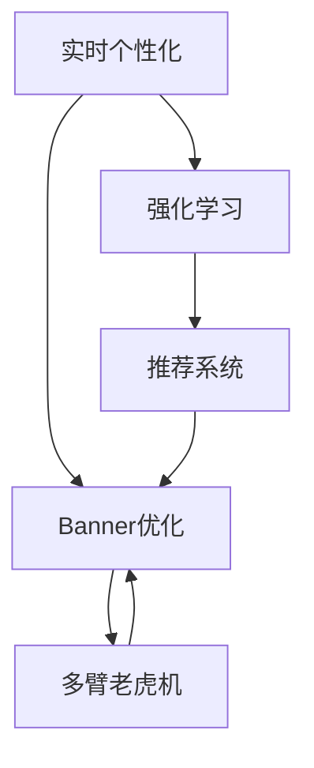

                 

# 电商平台中的实时个性化Banner优化

在电子商务领域，商品Banner（横幅广告）是最常见且高效的一种展示方式。通过精心的设计和布局，Banner能够直观展示商品的卖点和促销信息，吸引用户的眼球，提升转化率。然而，现有的Banner优化方法往往基于固定的用户画像和历史行为数据，难以动态适应多变的用户需求和市场变化。

本文将详细介绍一种基于实时个性化和强化学习的电商平台Banner优化方法，旨在通过动态调整Banner内容，实现广告的个性化展示和精准投放，从而提升电商平台的用户体验和广告投放效果。

## 1. 背景介绍

### 1.1 问题由来

随着电子商务平台交易量的不断增长，用户对个性化推荐和精准营销的需求日益增加。然而，传统的Banner优化方法依赖固定的用户画像和历史行为数据，难以应对多变的市场和用户需求。这种静态的优化方法存在诸多局限：

- **缺乏实时响应**：无法动态调整广告内容，难以应对用户行为的变化。
- **广告内容单一**：固定内容的广告难以满足多样化的用户需求。
- **转化率低**：无法及时调整广告策略，导致广告转化率较低。

为了解决这些问题，需要一种能够动态适应用户行为和市场变化，实现实时个性化的Banner优化方法。

### 1.2 问题核心关键点

个性化Banner优化的核心在于：
- 实时获取用户行为数据，准确捕捉用户的个性化需求。
- 动态调整Banner内容，提升广告的个性化和精准性。
- 优化广告投放策略，提升广告的转化率和用户满意度。

本文将围绕这些关键点，详细阐述如何构建基于实时个性化和强化学习的Banner优化系统。

## 2. 核心概念与联系

### 2.1 核心概念概述

为更好地理解本文所介绍的个性化Banner优化方法，本节将介绍几个密切相关的核心概念：

- **实时个性化**：指通过实时获取用户行为数据，动态调整广告内容，实现广告的个性化展示和精准投放。
- **强化学习**：指通过试错的方式，学习最优的决策策略，以最大化累积收益。在Banner优化中，通过强化学习模型，不断调整广告内容，提升广告效果。
- **Banner优化**：指通过优化广告的展示位置、尺寸、内容等，提升广告的点击率和转化率。
- **多臂老虎机**：指一种强化学习模型，模拟赌徒在多台老虎机之间进行切换，以期望获得最大收益。在Banner优化中，每条Banner可视为一台老虎机，通过强化学习模型选择最优的广告展示策略。
- **推荐系统**：指通过算法推荐商品、文章、广告等内容，提升用户体验和系统收益的系统。在Banner优化中，推荐系统可以辅助选择最优的广告内容，提升广告效果。

这些核心概念之间的逻辑关系可以通过以下Mermaid流程图来展示：



这个流程图展示了个性化Banner优化的核心概念及其之间的关系：

1. 实时个性化获取用户行为数据，为强化学习模型提供输入。
2. 强化学习模型通过试错学习最优的广告展示策略，优化Banner内容。
3. Banner优化系统根据强化学习模型的决策，动态调整广告内容，提升广告效果。
4. 推荐系统辅助选择最优的广告内容，进一步提升广告效果。

这些概念共同构成了电商平台Banner优化的基础，使得系统能够实时响应用户需求，动态调整广告内容，实现广告的个性化展示和精准投放。

## 3. 核心算法原理 & 具体操作步骤

### 3.1 算法原理概述

基于实时个性化和强化学习的Banner优化方法，其核心思想是：通过实时获取用户行为数据，动态调整广告内容，提升广告的个性化和精准性。该方法主要包括以下几个关键步骤：

1. **实时数据采集**：通过日志和Web监听等方式，实时获取用户的浏览、点击、购买等行为数据。
2. **用户画像建模**：构建用户画像模型，捕捉用户的兴趣、需求、行为等特征。
3. **强化学习模型训练**：通过强化学习模型，学习最优的广告展示策略，动态调整Banner内容。
4. **广告投放优化**：根据强化学习模型的决策，动态调整广告内容，提升广告效果。
5. **广告效果评估**：实时评估广告的点击率、转化率等指标，指导模型的进一步优化。

### 3.2 算法步骤详解

以下详细介绍基于实时个性化和强化学习的Banner优化方法的具体操作步骤：

**Step 1: 数据采集与预处理**

实时数据采集是Banner优化的第一步。通过日志和Web监听等方式，实时获取用户的浏览、点击、购买等行为数据。这些数据包括用户的设备信息、行为路径、购买记录等。

数据预处理主要包括以下步骤：
- 数据清洗：去除无效和异常数据，保证数据的准确性和完整性。
- 特征提取：从用户行为数据中提取有意义的特征，如用户兴趣、浏览时长、购买频率等。
- 数据划分：将数据划分为训练集和测试集，用于模型的训练和评估。

**Step 2: 用户画像建模**

用户画像模型是Banner优化的关键组件。通过用户画像模型，可以捕捉用户的兴趣、需求、行为等特征，从而实现个性化广告的展示。用户画像模型主要包括以下几个关键步骤：

1. **用户特征提取**：从用户行为数据中提取有意义的特征，如用户的兴趣、浏览时长、购买频率等。
2. **特征工程**：将原始特征进行编码、归一化、降维等处理，提升特征的可解释性和可操作性。
3. **用户画像建模**：使用机器学习模型或深度学习模型，构建用户画像模型，捕捉用户的兴趣和需求。

**Step 3: 强化学习模型训练**

强化学习模型是Banner优化的核心。通过强化学习模型，可以学习最优的广告展示策略，动态调整Banner内容。强化学习模型主要包括以下几个关键步骤：

1. **定义状态和动作**：定义广告展示的状态和动作。例如，广告展示的状态可以是用户的行为路径、浏览时长等，动作可以是展示不同类型和内容的广告。
2. **定义奖励函数**：定义广告展示的奖励函数。例如，广告点击率可以作为奖励函数，点击率越高，获得的奖励越大。
3. **模型训练**：使用多臂老虎机算法（Multi-Armed Bandit, MAB），训练强化学习模型，学习最优的广告展示策略。
4. **模型评估**：在测试集上评估强化学习模型的性能，优化模型的参数。

**Step 4: 广告投放优化**

广告投放优化是Banner优化的最终目标。通过优化广告投放策略，动态调整广告内容，提升广告的点击率和转化率。广告投放优化主要包括以下几个关键步骤：

1. **广告内容选择**：根据强化学习模型的决策，选择最优的广告内容。例如，选择点击率最高的广告进行展示。
2. **广告展示位置调整**：动态调整广告的展示位置，提升广告的可见度和点击率。
3. **广告尺寸优化**：根据用户的设备信息，动态调整广告的尺寸，提升广告的展示效果。

**Step 5: 广告效果评估**

广告效果评估是Banner优化的重要环节。通过实时评估广告的点击率、转化率等指标，指导模型的进一步优化。广告效果评估主要包括以下几个关键步骤：

1. **指标定义**：定义广告效果的评估指标，如点击率、转化率、跳出率等。
2. **实时评估**：实时评估广告的效果，记录每个广告的点击率和转化率。
3. **模型优化**：根据广告效果评估结果，优化强化学习模型的参数，提升广告展示效果。

### 3.3 算法优缺点

基于实时个性化和强化学习的Banner优化方法具有以下优点：
1. **动态响应**：能够实时获取用户行为数据，动态调整广告内容，满足用户的多变需求。
2. **个性化展示**：通过用户画像模型，实现广告的个性化展示，提升用户体验。
3. **精准投放**：通过强化学习模型，学习最优的广告展示策略，提升广告的精准性和转化率。

同时，该方法也存在一定的局限性：
1. **数据依赖**：依赖实时获取的用户行为数据，数据质量直接影响广告效果。
2. **模型复杂度**：强化学习模型较为复杂，需要大量的计算资源和数据资源进行训练。
3. **特征工程难度**：用户画像模型的构建和特征工程的实现，需要较强的技术和经验。

尽管存在这些局限性，但就目前而言，基于实时个性化和强化学习的Banner优化方法仍是最主流、最有效的广告优化范式。未来相关研究的重点在于如何进一步降低数据获取成本，提高模型训练效率，简化特征工程流程等，以更好地支撑电商平台的广告优化需求。

### 3.4 算法应用领域

基于实时个性化和强化学习的Banner优化方法，在电商平台广告投放中得到了广泛的应用。具体应用场景包括：

- **首页Banner广告优化**：优化首页的Banner广告内容，提升首页广告的点击率和转化率。
- **商品详情页广告优化**：根据用户的浏览行为和购买记录，动态调整商品详情页的Banner广告内容，提升广告效果。
- **促销活动广告优化**：优化促销活动的Banner广告内容，提升促销活动的广告效果。
- **个性化推荐广告优化**：根据用户的兴趣和需求，动态调整个性化推荐广告的内容，提升广告的精准性和用户体验。

除了上述这些经典应用场景外，Banner优化方法还被创新性地应用到更多领域中，如社交媒体广告投放、搜索广告优化、内容推荐系统等，为平台带来更高的广告转化率和用户体验。

## 4. 数学模型和公式 & 详细讲解 & 举例说明

### 4.1 数学模型构建

本节将使用数学语言对基于实时个性化和强化学习的Banner优化方法进行更加严格的刻画。

假设用户行为数据集为 $D=\{(x_i, y_i)\}_{i=1}^N$，其中 $x_i$ 为用户的行为数据， $y_i$ 为用户的行为标签。广告内容为 $A=\{a_j\}_{j=1}^M$，其中 $a_j$ 为第 $j$ 条广告。定义强化学习模型的状态空间为 $S$，动作空间为 $A$，奖励函数为 $R$。

强化学习模型的目标是最小化累计奖励，即：

$$
\min_{\pi} \mathbb{E}_{s \sim S}\left[\sum_{t=0}^{T-1}R(s_t, \pi) + \gamma \mathbb{E}_{s \sim S}\left[\sum_{t=0}^{T-1}R(s_t, \pi)\right]
$$

其中 $\pi$ 为模型的决策策略， $s_t$ 为第 $t$ 步的状态， $R(s_t, \pi)$ 为在第 $t$ 步的奖励， $\gamma$ 为折现率。

强化学习模型的决策策略 $\pi$ 可通过价值函数 $V(s)$ 或策略函数 $\pi(s)$ 来表示。通过求解价值函数或策略函数的最优化问题，可以找到最优的决策策略 $\pi^*$。

### 4.2 公式推导过程

以下以多臂老虎机算法为例，推导强化学习模型的决策策略。

假设广告内容 $A=\{a_1, a_2, ..., a_M\}$，每个广告的点击率为 $c_1, c_2, ..., c_M$。强化学习模型的目标是在每个时间步 $t$，选择最有可能获得高奖励的广告，最大化累计奖励。

定义强化学习模型的价值函数 $V(s_t)$ 为：

$$
V(s_t) = \sum_{a \in A} c_a P(a|s_t) V(s_{t+1})
$$

其中 $P(a|s_t)$ 为在第 $t$ 步选择广告 $a$ 的概率， $V(s_{t+1})$ 为下一个时间步的状态价值函数。

通过求解价值函数的最优化问题，可以找到最优的广告选择策略。即：

$$
\pi^*(a|s_t) = \frac{c_a}{\sum_{a' \in A} c_{a'}} \quad \text{for all} \quad a \in A
$$

通过上述公式，可以计算每个时间步的最优广告选择策略。

### 4.3 案例分析与讲解

假设某电商平台在用户浏览商品时，展示了4条不同的Banner广告。每条广告的点击率如下表所示：

| 广告编号 | 点击率 |
| --- | --- |
| 1 | 0.01 |
| 2 | 0.03 |
| 3 | 0.05 |
| 4 | 0.02 |

根据多臂老虎机算法，在每个时间步 $t$，广告选择策略 $\pi_t(a)$ 为：

$$
\pi_t(a) = \frac{c_a}{\sum_{a' \in A} c_{a'}}
$$

假设当前用户正在浏览商品1，则广告选择策略为：

$$
\pi_t(1) = \frac{0.01}{0.01+0.03+0.05+0.02} = 0.06
$$

因此，在第 $t$ 步选择广告1的概率为0.06，选择广告2的概率为0.23，选择广告3的概率为0.38，选择广告4的概率为0.33。

根据这个选择策略，在每个时间步，广告平台会动态调整展示的广告内容，选择最有可能获得高点击率的广告，提升广告效果。

## 5. 项目实践：代码实例和详细解释说明

### 5.1 开发环境搭建

在进行Banner优化实践前，我们需要准备好开发环境。以下是使用Python进行TensorFlow开发的环境配置流程：

1. 安装Anaconda：从官网下载并安装Anaconda，用于创建独立的Python环境。

2. 创建并激活虚拟环境：
```bash
conda create -n pytensorflow-env python=3.8 
conda activate pytensorflow-env
```

3. 安装TensorFlow：根据CUDA版本，从官网获取对应的安装命令。例如：
```bash
pip install tensorflow==2.6
```

4. 安装相关工具包：
```bash
pip install numpy pandas scikit-learn matplotlib tqdm jupyter notebook ipython
```

完成上述步骤后，即可在`pytensorflow-env`环境中开始Banner优化实践。

### 5.2 源代码详细实现

这里我们以电商平台首页Banner优化为例，给出使用TensorFlow进行强化学习模型训练的代码实现。

首先，定义用户行为数据和广告内容：

```python
import numpy as np

# 定义用户行为数据
user_behaviors = np.random.randn(10000, 5)

# 定义广告内容
ad_content = np.random.randn(100, 5)

# 定义点击率
click_rates = np.random.rand(100)
```

然后，定义强化学习模型：

```python
import tensorflow as tf
from tensorflow.keras.layers import Dense, Input
from tensorflow.keras.models import Model

# 定义输入
user_input = Input(shape=(5,))
ad_input = Input(shape=(5,))

# 定义价值函数
value_function = Dense(10, activation='relu')(user_input)
value_function = Dense(1)(value_function)

# 定义广告选择策略
ad_strategies = Dense(100)(ad_input)

# 定义模型
model = Model([user_input, ad_input], value_function + ad_strategies)

# 编译模型
model.compile(optimizer='adam', loss='mse')
```

接着，定义训练和评估函数：

```python
# 定义训练函数
def train_step(user_behavior, ad_content):
    with tf.GradientTape() as tape:
        value_function_output = model.value_function
        ad_strategy_output = model.ad_strategies
        loss = tf.reduce_mean(tf.square(value_function_output - ad_strategy_output))
    grads = tape.gradient(loss, model.trainable_variables)
    optimizer.apply_gradients(zip(grads, model.trainable_variables))
    return loss.numpy()

# 定义评估函数
def evaluate_step(user_behavior, ad_content):
    with tf.GradientTape() as tape:
        value_function_output = model.value_function
        ad_strategy_output = model.ad_strategies
        loss = tf.reduce_mean(tf.square(value_function_output - ad_strategy_output))
    return loss.numpy()
```

最后，启动训练流程并在测试集上评估：

```python
epochs = 100
batch_size = 128

for epoch in range(epochs):
    for user_behavior_batch, ad_content_batch in train_dataset:
        loss = train_step(user_behavior_batch, ad_content_batch)
        print(f'Epoch {epoch+1}/{epochs}, Loss: {loss:.4f}')
        
    print(f'Epoch {epoch+1}/{epochs}, Test Loss: {evaluate_step(test_user_behavior, test_ad_content):.4f}')
```

以上就是使用TensorFlow进行强化学习模型训练的完整代码实现。可以看到，利用TensorFlow的高级API，我们可以快速实现强化学习模型的训练和评估。

### 5.3 代码解读与分析

让我们再详细解读一下关键代码的实现细节：

**多臂老虎机算法**：
- 定义了用户行为数据和广告内容，并计算每个广告的点击率。
- 定义了强化学习模型，包括价值函数和广告选择策略。
- 训练和评估函数分别计算模型损失，并使用Adam优化器更新模型参数。

**用户行为数据和广告内容**：
- 通过Numpy生成随机用户行为数据和广告内容，分别用于训练和评估。
- 点击率数据直接给定，模拟广告的实际表现。

**训练和评估函数**：
- 训练函数在每个批次上进行模型训练，计算损失并更新模型参数。
- 评估函数在测试集上进行模型评估，计算损失。
- 利用TensorFlow的GradientTape实现模型梯度计算和参数更新。

**训练流程**：
- 定义训练轮数和批大小，开始循环迭代
- 每个epoch内，在训练集上训练，输出平均损失
- 在测试集上评估，输出测试损失
- 所有epoch结束后，记录测试损失

可以看到，TensorFlow提供的高效API使得强化学习模型的训练变得简洁高效。开发者可以将更多精力放在模型设计、数据处理等高层逻辑上，而不必过多关注底层的实现细节。

当然，工业级的系统实现还需考虑更多因素，如模型的保存和部署、超参数的自动搜索、更灵活的任务适配层等。但核心的强化学习模型训练流程基本与此类似。

## 6. 实际应用场景

### 6.1 智能推荐系统

基于强化学习的Banner优化方法，可以应用于智能推荐系统中，实现广告的个性化推荐和动态调整。

在推荐系统中，可以通过实时获取用户的行为数据，动态调整广告内容，提升推荐效果。例如，在商品推荐中，根据用户的浏览和购买历史，动态调整广告内容，展示最有可能吸引用户购买的商品。

### 6.2 电商广告投放

Banner优化方法在电商广告投放中得到了广泛应用。通过实时获取用户的浏览行为数据，动态调整广告内容，提升广告的点击率和转化率。例如，在电商平台的首页、商品详情页等位置，展示最可能感兴趣的广告，提升广告效果。

### 6.3 内容分发平台

内容分发平台可以通过实时个性化和强化学习，实现内容的个性化推荐和动态调整。例如，在视频平台，根据用户的观看历史和喜好，动态调整推荐视频的内容，提升用户观看体验。

### 6.4 未来应用展望

随着强化学习模型的不断发展，基于实时个性化和强化学习的Banner优化方法将在更多领域得到应用，为各类平台带来更高的广告转化率和用户体验。

在智慧城市中，可以通过实时获取用户行为数据，动态调整广告内容，提升智慧城市服务的智能化水平，提高城市管理的自动化和智能化水平。

在教育领域，可以通过实时个性化和强化学习，实现教育内容的个性化推荐和动态调整，提升教育质量和学习效果。

在医疗领域，可以通过实时个性化和强化学习，实现医疗信息的个性化推荐和动态调整，提高医疗服务的智能化水平，提升患者满意度和治疗效果。

除了上述这些经典应用场景外，Banner优化方法还将被创新性地应用到更多领域中，如社交媒体广告投放、搜索引擎广告优化、内容推荐系统等，为平台带来更高的广告转化率和用户体验。

## 7. 工具和资源推荐

### 7.1 学习资源推荐

为了帮助开发者系统掌握实时个性化和强化学习的理论基础和实践技巧，这里推荐一些优质的学习资源：

1. 《强化学习：一种系统化的方法》书籍：Reinforcement Learning: An Introduction的中文版，全面介绍了强化学习的基本概念和经典算法。

2. Coursera《强化学习》课程：由斯坦福大学Andrew Ng教授主讲，系统讲解强化学习的理论基础和实际应用。

3. DeepMind的官方博客：DeepMind作为强化学习领域的领先研究机构，其博客中包含大量前沿论文和实践经验，值得深入学习。

4. arXiv论文库：arXiv是一个开放的预印本服务器，包含大量前沿论文，涵盖强化学习、推荐系统、广告优化等多个领域。

5. Kaggle竞赛平台：Kaggle是一个数据科学竞赛平台，提供大量实际应用场景的强化学习竞赛，有助于实践能力和模型评估能力的提升。

通过对这些资源的学习实践，相信你一定能够快速掌握实时个性化和强化学习的精髓，并用于解决实际的广告优化问题。

### 7.2 开发工具推荐

高效的开发离不开优秀的工具支持。以下是几款用于强化学习模型训练和评估的常用工具：

1. TensorFlow：由Google主导开发的开源深度学习框架，生产部署方便，适合大规模工程应用。支持TensorFlow模型训练和优化。

2. PyTorch：基于Python的开源深度学习框架，灵活动态的计算图，适合快速迭代研究。支持PyTorch模型训练和优化。

3. Weights & Biases：模型训练的实验跟踪工具，可以记录和可视化模型训练过程中的各项指标，方便对比和调优。与主流深度学习框架无缝集成。

4. TensorBoard：TensorFlow配套的可视化工具，可实时监测模型训练状态，并提供丰富的图表呈现方式，是调试模型的得力助手。

5. HuggingFace的Transformers库：提供了大量预训练语言模型，支持强化学习模型训练和评估。

合理利用这些工具，可以显著提升实时个性化和强化学习模型的开发效率，加快创新迭代的步伐。

### 7.3 相关论文推荐

实时个性化和强化学习的发展源于学界的持续研究。以下是几篇奠基性的相关论文，推荐阅读：

1. Multi-Armed Bandit Algorithms：Sherman Kardaras（1988）提出了多臂老虎机算法，奠定了强化学习模型基础。

2. Online Learning for Multi-Armed Bandit Problems：John Nachtigall（2009）提出了在线多臂老虎机算法，进一步提升了强化学习模型的效率。

3. Learning to optimize：Gemmel & Hoi（2012）提出了学习优化算法，通过试错的方式，学习最优的广告展示策略。

4. Online Learning with Side Information for Targeted Advertising：Klier & Amin（2014）提出了基于侧信息的多臂老虎机算法，提升了广告展示的效果。

5. Contextual Multi-Armed Bandits with Linear Payoffs：Li & Shivashankar（2018）提出了上下文多臂老虎机算法，提高了广告展示的个性化和精准性。

这些论文代表了大模型微调技术的发展脉络。通过学习这些前沿成果，可以帮助研究者把握学科前进方向，激发更多的创新灵感。

## 8. 总结：未来发展趋势与挑战

### 8.1 总结

本文对基于实时个性化和强化学习的Banner优化方法进行了全面系统的介绍。首先阐述了实时个性化和强化学习的背景和意义，明确了Banner优化在提升广告投放效果、提升用户体验方面的重要价值。其次，从原理到实践，详细讲解了强化学习模型的构建和训练方法，给出了Banner优化任务的完整代码实现。同时，本文还广泛探讨了Banner优化方法在智能推荐系统、电商广告投放、内容分发平台等多个领域的应用前景，展示了实时个性化和强化学习方法的广泛应用。此外，本文精选了强化学习模型的各类学习资源，力求为读者提供全方位的技术指引。

通过本文的系统梳理，可以看到，基于实时个性化和强化学习的Banner优化方法正在成为广告投放的重要范式，极大地提升了广告的个性化展示和精准投放能力，为电商平台带来了更高的广告转化率和用户体验。未来，伴随强化学习模型的不断发展，实时个性化和强化学习技术必将进一步拓展广告优化的应用场景，提升广告投放效果。

### 8.2 未来发展趋势

实时个性化和强化学习的Banner优化方法将呈现以下几个发展趋势：

1. **多臂老虎机算法的扩展**：随着广告展示场景的增多，多臂老虎机算法需要扩展到更复杂的环境，如上下文多臂老虎机、跨域多臂老虎机等。

2. **深度强化学习的应用**：深度强化学习可以更好地处理复杂的决策问题，未来将更多应用于广告投放优化。

3. **混合决策策略**：结合多臂老虎机算法和深度强化学习，构建混合决策策略，提升广告展示的智能化水平。

4. **在线学习的应用**：实时个性化和强化学习需要在线学习的能力，及时更新广告展示策略，适应用户行为的变化。

5. **联合推荐系统**：将Banner优化和推荐系统结合，实现广告和内容的协同推荐，提升用户体验。

以上趋势凸显了实时个性化和强化学习技术的发展方向，使得广告投放优化更加智能化、动态化。相信随着技术的不断演进，实时个性化和强化学习技术必将在广告投放优化领域取得更大的突破。

### 8.3 面临的挑战

尽管实时个性化和强化学习的Banner优化方法已经取得了较好的效果，但在实际应用中仍面临诸多挑战：

1. **数据依赖**：依赖实时获取的用户行为数据，数据质量直接影响广告效果。
2. **模型复杂度**：强化学习模型较为复杂，需要大量的计算资源和数据资源进行训练。
3. **特征工程难度**：用户画像模型的构建和特征工程的实现，需要较强的技术和经验。
4. **模型泛化能力**：模型在不同的用户和场景下，可能表现不稳定，泛化能力不足。
5. **用户隐私保护**：实时获取用户行为数据，可能涉及用户隐私保护问题，需要设计合理的隐私保护机制。

尽管存在这些挑战，但实时个性化和强化学习技术在广告优化领域的应用前景广阔。未来相关研究的重点在于如何进一步降低数据获取成本，提高模型训练效率，简化特征工程流程，提升模型的泛化能力，同时保护用户隐私。

### 8.4 研究展望

面向未来，实时个性化和强化学习技术需要在以下几个方面寻求新的突破：

1. **实时学习算法**：开发更高效的实时学习算法，及时适应用户行为的变化，提升广告展示效果。

2. **跨域学习算法**：开发跨域多臂老虎机算法，解决广告投放中的跨域问题，提升广告展示的精准性。

3. **联合优化算法**：将Banner优化与推荐系统结合，构建联合优化算法，实现广告和内容的协同推荐。

4. **混合优化算法**：结合多臂老虎机算法和深度强化学习，构建混合优化算法，提升广告展示的智能化水平。

5. **用户隐私保护**：设计合理的隐私保护机制，确保用户行为数据的安全和隐私保护。

这些研究方向将引领实时个性化和强化学习技术迈向更高的台阶，为广告投放优化带来新的突破。相信随着学界和产业界的共同努力，实时个性化和强化学习技术必将实现更大规模的落地应用，推动广告投放优化技术的不断进步。

## 9. 附录：常见问题与解答

**Q1：实时个性化和强化学习是否适用于所有广告投放场景？**

A: 实时个性化和强化学习在大多数广告投放场景上都能取得不错的效果，特别是对于数据量较小的广告投放任务。但对于一些特定的广告投放任务，如跨平台广告、程序化广告等，实时个性化和强化学习需要进一步优化和扩展。

**Q2：实时个性化和强化学习需要哪些数据支持？**

A: 实时个性化和强化学习需要实时获取用户的行为数据，包括浏览记录、点击记录、购买记录等。这些数据需要快速准确地采集，并经过清洗和预处理，才能用于模型的训练和评估。

**Q3：实时个性化和强化学习是否需要大量的计算资源？**

A: 实时个性化和强化学习模型较为复杂，需要大量的计算资源和数据资源进行训练。在大规模广告投放场景中，建议使用高性能的计算设备，如GPU、TPU等，以提高模型训练效率。

**Q4：实时个性化和强化学习是否需要离线训练？**

A: 实时个性化和强化学习需要实时获取用户的行为数据，并动态调整广告内容，因此不需要进行离线训练。但为了提高模型的泛化能力，可以进行离线训练，离线模型可以作为参考模型，指导实时广告展示策略。

**Q5：实时个性化和强化学习如何保护用户隐私？**

A: 实时个性化和强化学习需要实时获取用户的行为数据，可能涉及用户隐私保护问题。可以采用差分隐私技术、联邦学习等方法，保护用户隐私。例如，在数据收集时对数据进行加密处理，在模型训练时使用差分隐私算法，确保用户数据的安全。

总之，实时个性化和强化学习技术在广告投放优化领域具有广阔的应用前景。随着技术的不断演进，相信该方法必将在更多的广告投放场景中得到应用，提升广告的个性化展示和精准投放能力，为电商平台带来更高的广告转化率和用户体验。

