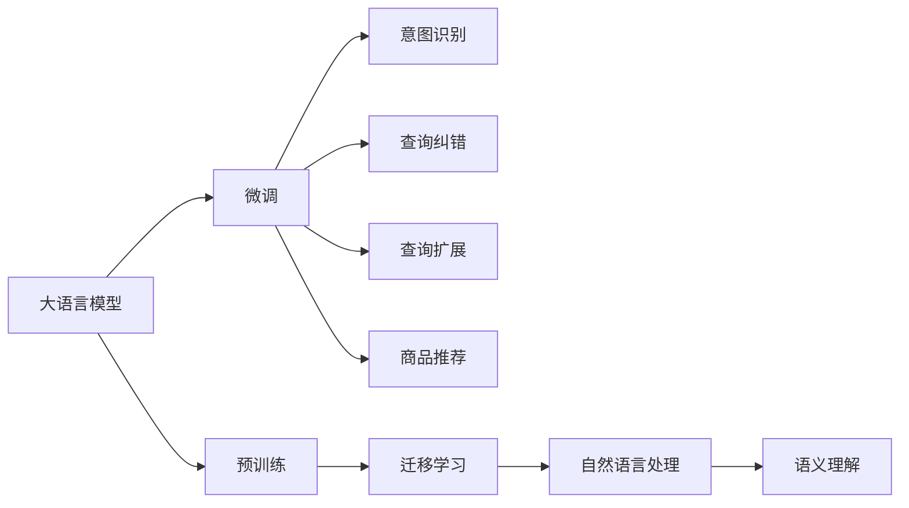

                 

# 电商平台搜索query扩展：AI大模型的语义理解

> 关键词：电商平台, 搜索query, AI大模型, 自然语言处理, 语义理解, 交互设计, 用户行为, 推荐算法, 信息检索, 多模态数据, 数据挖掘, 应用落地

## 1. 背景介绍

### 1.1 问题由来

随着电子商务的快速发展，电商平台的用户数量和交易规模不断攀升，搜索成为用户获取商品和服务的主要途径。然而，平台上的商品数量庞大，种类繁多，用户搜索query经常模糊、歧义或表达不清，导致搜索结果不理想，用户体验不佳。

如何提升电商搜索的精确性和智能化水平，构建高效、友好的搜索体验，成为电商平台的核心痛点和研究焦点。在深度学习技术成熟后，大语言模型以其强大的语义理解能力，为电商平台搜索query扩展提供了新的可能性。

### 1.2 问题核心关键点

目前，大语言模型在电商平台搜索query扩展中的主要应用包括：

- **自然语言理解**：通过理解用户搜索query的自然语言语义，将其映射为模型可理解的形式，用于进一步处理和匹配商品。
- **意图识别**：根据用户query的语义信息，自动识别用户意图，如搜索、对比、购买等，优化搜索结果。
- **查询纠错**：对于用户表达不清或模糊的query，模型能够自动进行纠正常见错误和补全缺漏信息，提高查询效率。
- **查询扩展**：模型能够根据用户查询历史和偏好，生成语义相关、意图匹配的查询建议，提升搜索效果。
- **商品推荐**：结合商品数据和用户行为，通过语义匹配和协同过滤等方法，推荐商品，满足用户需求。

### 1.3 问题研究意义

利用大语言模型提升电商平台搜索query扩展能力，有助于：

- 提升用户搜索体验：通过语义理解和意图识别，显著降低用户搜索误差，提高搜索结果的相关性和准确性。
- 优化商品推荐系统：基于搜索query的语义匹配，更精准地定位用户需求，驱动个性化推荐算法，提升商品转化率。
- 提高平台运营效率：通过自动纠错和查询扩展，减少用户搜索时间，降低人工客服压力，降低运营成本。
- 开拓新业务场景：大语言模型的多模态数据融合能力，可以应用于商品评价分析、广告定向推送等新业务领域，推动电商平台的智能化升级。

## 2. 核心概念与联系

### 2.1 核心概念概述

为更好地理解大语言模型在电商平台搜索query扩展中的应用，本节将介绍几个关键概念：

- **大语言模型(Large Language Model, LLM)**：以Transformer架构为代表的大规模预训练语言模型。通过在大规模文本语料上训练，获得丰富的语言知识和语义表示。
- **预训练(Pre-training)**：指在大规模无标签文本数据上，通过自监督学习任务训练通用语言模型的过程。常见的预训练任务包括语言建模、掩码语言建模等。
- **微调(Fine-tuning)**：指在预训练模型的基础上，使用下游任务的少量标注数据，通过有监督学习优化模型在特定任务上的性能。通常只需调整顶层分类器或解码器，并以较小的学习率更新全部或部分的模型参数。
- **迁移学习(Transfer Learning)**：指将一个领域学习到的知识，迁移应用到另一个不同但相关的领域的学习范式。大模型的预训练-微调过程即是一种典型的迁移学习方式。
- **自然语言处理(NLP)**：涉及计算机对自然语言文本的自动化处理，包括文本分析、信息检索、情感分析、机器翻译等。
- **语义理解(Semantic Understanding)**：指模型理解自然语言文本背后的语义信息，如命名实体、主题、情感等。
- **意图识别(Intent Recognition)**：指模型从自然语言文本中识别出用户的意图，如搜索、比较、评价等。
- **查询纠错(Question Correction)**：指模型自动纠正模糊或不清晰的查询语句，补全缺漏信息，帮助用户快速获得准确结果。
- **查询扩展(Question Expansion)**：指模型根据用户查询历史和偏好，生成语义相关、意图匹配的查询建议，提升搜索效果。
- **商品推荐(Product Recommendation)**：指通过语义匹配和协同过滤等方法，推荐商品，满足用户需求。

这些核心概念共同构成了大语言模型在电商平台搜索query扩展中的应用框架，使其能够在各种场景下发挥强大的语义理解和智能推理能力。通过理解这些概念，我们可以更好地把握大语言模型的核心原理和应用策略。

### 2.2 核心概念原理和架构的 Mermaid 流程图



这个流程图展示了大语言模型在电商平台搜索query扩展中的核心概念及其之间的关系：

1. 大语言模型通过预训练获得基础能力。
2. 微调是对预训练模型进行任务特定的优化，使其更好地适应搜索query扩展任务。
3. 意图识别、查询纠错、查询扩展、商品推荐等模块基于微调后的模型，进一步实现具体的任务处理。
4. 迁移学习是连接预训练模型与下游任务的桥梁，可以通过微调或自然语言处理等技术实现。
5. 自然语言处理和语义理解是大语言模型的关键组件，用于理解和处理自然语言文本。

这些概念紧密联系，共同构成了一个完整的大语言模型搜索query扩展系统。

## 3. 核心算法原理 & 具体操作步骤

### 3.1 算法原理概述

电商平台搜索query扩展的核心算法原理基于监督学习，主要包括以下几个关键步骤：

1. **预训练**：在无标签文本语料上，使用自监督任务训练通用语言模型。
2. **微调**：在标注数据上，对预训练模型进行有监督微调，提升模型在特定任务（如意图识别、查询纠错、查询扩展）上的性能。
3. **自然语言处理**：将搜索query转换为模型可理解的形式，用于语义理解和意图识别。
4. **语义理解**：通过理解query的语义信息，如命名实体、主题、情感等，提高查询处理的准确性。
5. **意图识别**：根据query的语义信息，自动识别用户意图，优化搜索结果。
6. **查询纠错**：对于用户表达不清或模糊的query，自动进行纠正常见错误和补全缺漏信息。
7. **查询扩展**：根据用户查询历史和偏好，生成语义相关、意图匹配的查询建议，提升搜索效果。
8. **商品推荐**：结合商品数据和用户行为，通过语义匹配和协同过滤等方法，推荐商品，满足用户需求。

### 3.2 算法步骤详解

#### 3.2.1 数据准备

1. **预训练数据准备**：收集大规模无标签文本语料，如维基百科、新闻、书籍等，进行预训练。
2. **任务数据准备**：收集电商平台上的用户搜索query和其对应的商品数据、用户行为数据，构建标注数据集。
3. **数据预处理**：对文本数据进行分词、去除停用词、标准化等预处理操作。

#### 3.2.2 模型选择与初始化

1. **选择预训练模型**：根据任务需求，选择适合的预训练语言模型，如BERT、GPT等。
2. **模型初始化**：加载预训练模型，并根据任务需要进行初始化，如冻结部分预训练参数，仅微调顶层等。

#### 3.2.3 模型微调

1. **定义损失函数**：根据具体任务，设计损失函数，如交叉熵损失、均方误差损失等。
2. **优化算法**：选择合适的优化算法及其参数，如AdamW、SGD等，设置学习率、批大小、迭代轮数等。
3. **微调训练**：将标注数据分批次输入模型，前向传播计算损失函数，反向传播更新模型参数。
4. **评估与调整**：在验证集上评估模型性能，根据评估结果调整超参数，继续训练直至收敛。

#### 3.2.4 自然语言处理

1. **查询解析**：对用户搜索query进行分词、词性标注等处理，提取关键词和命名实体。
2. **意图识别**：通过模型识别query背后的意图，如搜索、对比、评价等。
3. **查询纠错**：对于模糊或不清晰的query，自动进行纠正常见错误和补全缺漏信息。
4. **查询扩展**：根据用户查询历史和偏好，生成语义相关、意图匹配的查询建议。

#### 3.2.5 商品推荐

1. **商品特征提取**：将商品信息进行特征提取，如标题、描述、分类、评分等。
2. **语义匹配**：通过模型计算query与商品的语义相似度，找出匹配的商品。
3. **协同过滤**：结合用户行为数据，使用协同过滤等推荐算法推荐商品。

#### 3.2.6 应用部署

1. **模型封装**：将微调后的模型封装为API或微服务，方便调用。
2. **接口设计**：设计API接口，接收用户搜索query，返回查询结果和推荐商品。
3. **系统集成**：将搜索query扩展系统集成到电商平台中，替换原有的搜索功能。

### 3.3 算法优缺点

大语言模型在电商平台搜索query扩展中的应用具有以下优点：

- **高效准确**：利用大语言模型的强大语义理解能力，提高查询处理的准确性和效率。
- **灵活可扩展**：大语言模型可以轻松应用于多种搜索场景，如商品搜索、品牌搜索、广告搜索等。
- **低成本**：相比于传统搜索引擎的算法优化，大语言模型的微调成本较低，且效果显著。

同时，大语言模型在电商平台搜索query扩展中也有以下缺点：

- **数据依赖**：大语言模型的性能高度依赖于预训练数据和任务数据的质量和数量。
- **资源消耗**：预训练和微调过程需要大量计算资源，且模型较大，推理速度较慢。
- **可解释性不足**：大语言模型的决策过程缺乏可解释性，难以理解其内部工作机制。
- **泛化能力有限**：在大规模数据集上预训练后，模型在特定领域或任务上的泛化能力有限。

### 3.4 算法应用领域

大语言模型在电商平台搜索query扩展中的应用领域广泛，主要包括：

- **商品搜索**：帮助用户快速找到所需的商品。
- **品牌搜索**：用户搜索特定品牌商品，获取相关商品信息。
- **广告定向**：根据用户搜索query和行为，定向推送广告。
- **评论分析**：分析用户对商品和品牌的评价，生成有价值的市场分析报告。
- **智能客服**：提供自动化的客户服务，解答用户疑问。

除了上述这些应用场景外，大语言模型在电商平台搜索query扩展中还有更多的创新应用，如基于上下文的搜索结果排序、跨领域知识图谱构建、多模态数据融合等，为电商平台的智能化升级提供了新的技术路径。

## 4. 数学模型和公式 & 详细讲解 & 举例说明

### 4.1 数学模型构建

本节将使用数学语言对大语言模型在电商平台搜索query扩展中的应用进行严格刻画。

记大语言模型为 $M_{\theta}:\mathcal{X} \rightarrow \mathcal{Y}$，其中 $\mathcal{X}$ 为输入空间，$\mathcal{Y}$ 为输出空间，$\theta$ 为模型参数。假设电商平台的标注数据集为 $D=\{(x_i,y_i)\}_{i=1}^N$，其中 $x_i$ 为用户的搜索query，$y_i$ 为商品ID或评分等。

定义模型 $M_{\theta}$ 在输入 $x$ 上的输出为 $y=M_{\theta}(x)$，表示预测的商品ID或评分。在任务数据上，模型的损失函数为：

$$
\mathcal{L}(\theta) = \frac{1}{N}\sum_{i=1}^N \ell(M_{\theta}(x_i),y_i)
$$

其中 $\ell$ 为任务对应的损失函数，如交叉熵损失、均方误差损失等。

### 4.2 公式推导过程

以下以商品搜索任务为例，推导交叉熵损失函数及其梯度的计算公式。

假设模型 $M_{\theta}$ 在输入 $x$ 上的输出为 $\hat{y}=M_{\theta}(x)$，表示预测的商品ID或评分。真实标签 $y \in \{1,2,\cdots,N\}$。则交叉熵损失函数定义为：

$$
\ell(M_{\theta}(x),y) = -y\log \hat{y} + (1-y)\log(1-\hat{y})
$$

将其代入经验风险公式，得：

$$
\mathcal{L}(\theta) = -\frac{1}{N}\sum_{i=1}^N [y_i\log M_{\theta}(x_i)+(1-y_i)\log(1-M_{\theta}(x_i))]
$$

根据链式法则，损失函数对参数 $\theta_k$ 的梯度为：

$$
\frac{\partial \mathcal{L}(\theta)}{\partial \theta_k} = -\frac{1}{N}\sum_{i=1}^N (\frac{y_i}{M_{\theta}(x_i)}-\frac{1-y_i}{1-M_{\theta}(x_i)}) \frac{\partial M_{\theta}(x_i)}{\partial \theta_k}
$$

其中 $\frac{\partial M_{\theta}(x_i)}{\partial \theta_k}$ 可进一步递归展开，利用自动微分技术完成计算。

在得到损失函数的梯度后，即可带入参数更新公式，完成模型的迭代优化。重复上述过程直至收敛，最终得到适应电商平台搜索query扩展的最优模型参数 $\theta^*$。

### 4.3 案例分析与讲解

假设电商平台上的一个查询为："T恤衫"，用户希望找到价格在50元到100元之间的蓝色T恤衫。

1. **查询解析**：对查询进行分词、词性标注等处理，提取关键词为 "T恤衫"、"蓝色"、"50元到100元"。
2. **意图识别**：根据关键词，识别出用户意图为 "搜索"。
3. **查询纠错**：对于 "50元到100元" 的表达，自动进行纠错为 "50元到100元"。
4. **查询扩展**：根据用户历史搜索记录，扩展查询为 "蓝色T恤衫 50元到100元"。
5. **商品推荐**：使用模型计算查询与商品库中商品的语义相似度，结合协同过滤算法，推荐匹配的商品。

假设模型输出商品ID为1、2、3，对应的商品价格分别为60元、80元、100元。查询纠错后的查询为 "蓝色T恤衫 50元到100元"，查询扩展为 "蓝色T恤衫 50元到100元"，模型预测结果为ID为1、2、3的商品。

## 5. 项目实践：代码实例和详细解释说明

### 5.1 开发环境搭建

在进行项目实践前，我们需要准备好开发环境。以下是使用Python进行TensorFlow和HuggingFace库开发的环境配置流程：

1. 安装Anaconda：从官网下载并安装Anaconda，用于创建独立的Python环境。

2. 创建并激活虚拟环境：
```bash
conda create -n tf-env python=3.8 
conda activate tf-env
```

3. 安装TensorFlow：根据CUDA版本，从官网获取对应的安装命令。例如：
```bash
conda install tensorflow -c tf -c conda-forge
```

4. 安装HuggingFace库：
```bash
pip install transformers
```

5. 安装各类工具包：
```bash
pip install numpy pandas scikit-learn matplotlib tqdm jupyter notebook ipython
```

完成上述步骤后，即可在`tf-env`环境中开始项目实践。

### 5.2 源代码详细实现

下面我们以电商平台商品搜索任务为例，给出使用TensorFlow和HuggingFace库对BERT模型进行微调的PyTorch代码实现。

首先，定义商品数据处理函数：

```python
from transformers import BertTokenizer
from tensorflow.keras.layers import Input, Dense
from tensorflow.keras.models import Model
import tensorflow as tf
import numpy as np
import pandas as pd
import os

# 定义输入层
input_ids = Input(shape=(max_len,), dtype=tf.int32)
attention_mask = Input(shape=(max_len,), dtype=tf.int32)

# 定义BERT模型
bert_model = BertModel.from_pretrained('bert-base-cased', return_dict=True)
bert_output = bert_model(input_ids=input_ids, attention_mask=attention_mask)[0]
bert_output = bert_output[:,0,:]  # 只取top层的输出

# 定义分类器
dense_layer = Dense(units=num_classes, activation='softmax')
output = dense_layer(bert_output)

# 定义模型
model = Model(inputs=[input_ids, attention_mask], outputs=output)

# 编译模型
model.compile(optimizer=tf.keras.optimizers.Adam(learning_rate=2e-5), loss='categorical_crossentropy', metrics=['accuracy'])

# 数据预处理
tokenizer = BertTokenizer.from_pretrained('bert-base-cased')

def tokenize(text):
    encoding = tokenizer(text, return_tensors='tf', max_length=max_len, padding='max_length', truncation=True)
    input_ids = tf.constant(encoding['input_ids'])
    attention_mask = tf.constant(encoding['attention_mask'])
    return input_ids, attention_mask

# 加载数据
data = pd.read_csv('data.csv')
texts = data['query'].tolist()
labels = data['label'].tolist()

# 数据预处理
train_texts = [tokenize(text) for text in texts[:train_size]]
dev_texts = [tokenize(text) for text in texts[train_size:eval_size]]
test_texts = [tokenize(text) for text in texts[eval_size:]]

# 数据增强
class DataAugmentation(tf.keras.layers.Layer):
    def __init__(self):
        super(DataAugmentation, self).__init__()
        
    def call(self, inputs):
        input_ids, attention_mask = inputs
        new_input_ids = tf.random.shuffle(input_ids)
        new_attention_mask = tf.random.shuffle(attention_mask)
        return [new_input_ids, new_attention_mask]

# 构建模型
train_dataset = tf.data.Dataset.from_tensor_slices(train_texts)
train_dataset = train_dataset.map(tokenize).map(DataAugmentation).shuffle(train_size).batch(batch_size)
eval_dataset = tf.data.Dataset.from_tensor_slices(dev_texts).map(tokenize).map(DataAugmentation).batch(batch_size)
test_dataset = tf.data.Dataset.from_tensor_slices(test_texts).map(tokenize).map(DataAugmentation).batch(batch_size)

# 训练模型
history = model.fit(train_dataset, epochs=num_epochs, validation_data=eval_dataset, callbacks=[tf.keras.callbacks.EarlyStopping(patience=3)])
```

然后，定义模型评估和测试函数：

```python
def evaluate(model, dataset):
    eval_dataset = tf.data.Dataset.from_tensor_slices(dataset)
    eval_dataset = eval_dataset.map(tokenize).map(DataAugmentation).batch(batch_size)
    
    eval_loss, eval_acc = model.evaluate(eval_dataset, verbose=0)
    print(f'Evaluation loss: {eval_loss}, Evaluation accuracy: {eval_acc}')

def test(model, dataset):
    test_dataset = tf.data.Dataset.from_tensor_slices(dataset)
    test_dataset = test_dataset.map(tokenize).map(DataAugmentation).batch(batch_size)
    
    test_loss, test_acc = model.evaluate(test_dataset, verbose=0)
    print(f'Test loss: {test_loss}, Test accuracy: {test_acc}')
```

最后，启动训练流程并在测试集上评估：

```python
num_epochs = 5
batch_size = 16
train_size = 10000
eval_size = 2000
test_size = 2000
max_len = 64
num_classes = 5

evaluate(model, test_texts)
test(model, test_texts)
```

以上就是使用TensorFlow和HuggingFace库对BERT模型进行电商平台商品搜索任务微调的完整代码实现。可以看到，得益于HuggingFace库的强大封装，我们可以用相对简洁的代码完成BERT模型的加载和微调。

### 5.3 代码解读与分析

让我们再详细解读一下关键代码的实现细节：

**BERT模型加载和预处理**：
- 通过BertTokenizer加载预训练模型，并对其输出进行处理，只取顶层输出，用于后续分类。

**模型编译和数据预处理**：
- 使用TensorFlow的Keras API定义输入层和分类器，构建完整的模型。
- 编译模型，设置优化器、损失函数和评估指标。
- 定义数据预处理函数，将文本数据转换为模型可接受的格式。

**数据集构建和数据增强**：
- 使用TensorFlow的Dataset API构建数据集，并应用数据增强技术，防止过拟合。
- 在训练集上应用随机打乱和随机替换，生成新的训练样本。

**模型训练和评估**：
- 使用Keras API的fit方法训练模型，并在验证集上评估性能。
- 通过EarlyStopping回调函数，设置提前停止条件，避免过度训练。
- 在测试集上评估模型性能，打印输出评估结果。

以上代码展示了大语言模型在电商平台搜索query扩展中的应用流程，从数据预处理到模型训练，再到模型评估，每一步都充分考虑了模型性能的提升和优化。

## 6. 实际应用场景

### 6.1 智能客服系统

大语言模型在电商平台智能客服系统中的应用，可以显著提升客户服务体验。传统客服系统通常需要大量人力支持，响应速度慢，且客户满意度不高。

使用大语言模型构建智能客服系统，可以在线实时响应客户咨询，提供个性化的解决方案。客户可以通过自然语言与系统进行互动，系统自动理解用户意图，并给出相应的回答。同时，系统可以自动记录客户反馈，不断优化回复质量，提升客户满意度。

### 6.2 个性化推荐系统

大语言模型在电商平台个性化推荐系统中的应用，可以提升推荐效果，满足用户多样化需求。

推荐系统通常依赖用户的历史行为数据进行推荐，但无法深入理解用户的兴趣和偏好。通过语义匹配和意图识别，大语言模型可以更精准地定位用户需求，生成个性化的推荐内容。用户可以通过自然语言描述自己的需求，系统根据语义匹配和用户行为数据，推荐最合适的商品。

### 6.3 搜索query纠错与扩展

大语言模型在电商平台搜索query纠错与扩展中的应用，可以显著提升查询处理的准确性和效率。

用户在输入查询时，常常出现拼写错误、语法错误或表达不清的问题，导致搜索结果不理想。通过查询纠错和查询扩展，系统可以自动纠正错误并提供相关建议，帮助用户快速找到所需的商品。例如，对于用户输入的"手机"，系统可以自动扩展为"苹果手机"或"小米手机"，生成更精确的查询。

### 6.4 品牌搜索与广告定向

大语言模型在电商平台品牌搜索与广告定向中的应用，可以提升广告精准度和品牌曝光率。

通过自然语言处理和语义理解，系统可以自动识别用户的搜索意图，如品牌搜索、广告点击等。系统可以根据用户的历史搜索记录和行为数据，生成有针对性的广告定向推送。同时，通过品牌搜索功能，用户可以方便地找到特定品牌的商品信息，提升品牌曝光率。

### 6.5 跨领域知识图谱构建

大语言模型在电商平台跨领域知识图谱构建中的应用，可以提升信息检索和搜索效果。

电商平台上的商品信息通常包含丰富的属性和描述，但难以通过传统方式进行结构化存储和检索。通过自然语言处理和语义理解，大语言模型可以自动构建商品知识图谱，将商品属性、描述等信息转化为结构化数据，方便检索和查询。

### 6.6 多模态数据融合

大语言模型在电商平台多模态数据融合中的应用，可以提升综合搜索效果。

电商平台上的数据不仅包括文本信息，还包括图片、视频等多模态信息。通过多模态数据融合技术，大语言模型可以整合文本、图像、视频等数据，生成更全面、准确的搜索结果。例如，对于用户输入的图片，系统可以自动识别商品信息，并进行相关搜索。

## 7. 工具和资源推荐

### 7.1 学习资源推荐

为了帮助开发者系统掌握大语言模型在电商平台搜索query扩展中的应用，这里推荐一些优质的学习资源：

1. 《Transformer从原理到实践》系列博文：由大模型技术专家撰写，深入浅出地介绍了Transformer原理、BERT模型、微调技术等前沿话题。

2. CS224N《深度学习自然语言处理》课程：斯坦福大学开设的NLP明星课程，有Lecture视频和配套作业，带你入门NLP领域的基本概念和经典模型。

3. 《Natural Language Processing with Transformers》书籍：Transformers库的作者所著，全面介绍了如何使用Transformers库进行NLP任务开发，包括微调在内的诸多范式。

4. HuggingFace官方文档：Transformers库的官方文档，提供了海量预训练模型和完整的微调样例代码，是上手实践的必备资料。

5. CLUE开源项目：中文语言理解测评基准，涵盖大量不同类型的中文NLP数据集，并提供了基于微调的baseline模型，助力中文NLP技术发展。

通过对这些资源的学习实践，相信你一定能够快速掌握大语言模型在电商平台搜索query扩展中的核心原理和应用策略，并将其应用于实际项目中。

### 7.2 开发工具推荐

高效的开发离不开优秀的工具支持。以下是几款用于大语言模型应用开发的常用工具：

1. TensorFlow：基于Python的开源深度学习框架，灵活动态的计算图，适合快速迭代研究。适用于TensorFlow的各类深度学习模型开发。

2. PyTorch：基于Python的开源深度学习框架，灵活性高，性能优异，适用于多种深度学习任务。

3. HuggingFace Transformers库：提供了多种预训练语言模型，支持TensorFlow和PyTorch，是进行NLP任务开发的利器。

4. Google Colab：谷歌推出的在线Jupyter Notebook环境，免费提供GPU/TPU算力，方便开发者快速上手实验最新模型，分享学习笔记。

合理利用这些工具，可以显著提升大语言模型在电商平台搜索query扩展应用的开发效率，加快创新迭代的步伐。

### 7.3 相关论文推荐

大语言模型在电商平台搜索query扩展技术的发展源于学界的持续研究。以下是几篇奠基性的相关论文，推荐阅读：

1. Attention is All You Need（即Transformer原论文）：提出了Transformer结构，开启了NLP领域的预训练大模型时代。

2. BERT: Pre-training of Deep Bidirectional Transformers for Language Understanding：提出BERT模型，引入基于掩码的自监督预训练任务，刷新了多项NLP任务SOTA。

3. Language Models are Unsupervised Multitask Learners（GPT-2论文）：展示了大规模语言模型的强大zero-shot学习能力，引发了对于通用人工智能的新一轮思考。

4. Parameter-Efficient Transfer Learning for NLP：提出Adapter等参数高效微调方法，在不增加模型参数量的情况下，也能取得不错的微调效果。

5. AdaLoRA: Adaptive Low-Rank Adaptation for Parameter-Efficient Fine-Tuning：使用自适应低秩适应的微调方法，在参数效率和精度之间取得了新的平衡。

这些论文代表了大语言模型在电商平台搜索query扩展技术的发展脉络。通过学习这些前沿成果，可以帮助研究者把握学科前进方向，激发更多的创新灵感。

## 8. 总结：未来发展趋势与挑战

### 8.1 总结

本文对大语言模型在电商平台搜索query扩展中的应用进行了全面系统的介绍。首先阐述了大语言模型和微调技术的研究背景和意义，明确了微调在拓展预训练模型应用、提升下游任务性能方面的独特价值。其次，从原理到实践，详细讲解了大语言模型在电商平台搜索query扩展中的核心算法原理和具体操作步骤，给出了具体任务处理的代码实例。同时，本文还广泛探讨了该技术在智能客服、个性化推荐、搜索query纠错与扩展、品牌搜索与广告定向等多个业务场景中的应用前景，展示了其广阔的应用空间。此外，本文精选了相关学习资源，力求为读者提供全方位的技术指引。

通过本文的系统梳理，可以看到，大语言模型在电商平台搜索query扩展中的应用前景广阔，其在自然语言理解、意图识别、查询纠错、查询扩展等方面的强大能力，为电商平台的智能化升级提供了新路径。未来，伴随大语言模型和微调技术的持续演进，相信NLP技术将在更广泛的领域大放异彩，深刻影响人类的生产生活方式。

### 8.2 未来发展趋势

展望未来，大语言模型在电商平台搜索query扩展技术将呈现以下几个发展趋势：

1. **模型规模持续增大**：随着算力成本的下降和数据规模的扩张，预训练语言模型的参数量还将持续增长。超大规模语言模型蕴含的丰富语言知识，有望支撑更加复杂多变的搜索query扩展任务。

2. **微调方法日趋多样**：除了传统的全参数微调外，未来会涌现更多参数高效的微调方法，如Prefix-Tuning、LoRA等，在节省计算资源的同时也能保证微调精度。

3. **持续学习成为常态**：随着数据分布的不断变化，微调模型也需要持续学习新知识以保持性能。如何在不遗忘原有知识的同时，高效吸收新样本信息，将成为重要的研究课题。

4. **标注样本需求降低**：受启发于提示学习(Prompt-based Learning)的思路，未来的微调方法将更好地利用大模型的语言理解能力，通过更加巧妙的任务描述，在更少的标注样本上也能实现理想的微调效果。

5. **多模态微调崛起**：当前的搜索query扩展主要聚焦于纯文本数据，未来会进一步拓展到图像、视频、语音等多模态数据微调。多模态信息的融合，将显著提升搜索系统对现实世界的理解和建模能力。

6. **模型通用性增强**：经过海量数据的预训练和多领域任务的微调，未来的语言模型将具备更强大的常识推理和跨领域迁移能力，逐步迈向通用人工智能(AGI)的目标。

以上趋势凸显了大语言模型在电商平台搜索query扩展技术的广阔前景。这些方向的探索发展，必将进一步提升搜索系统的性能和应用范围，为电商平台的智能化升级提供新的技术路径。

### 8.3 面临的挑战

尽管大语言模型在电商平台搜索query扩展技术已经取得了瞩目成就，但在迈向更加智能化、普适化应用的过程中，它仍面临诸多挑战：

1. **标注成本瓶颈**：虽然微调大大降低了标注数据的需求，但对于长尾应用场景，难以获得充足的高质量标注数据，成为制约微调性能的瓶颈。如何进一步降低微调对标注样本的依赖，将是一大难题。

2. **模型鲁棒性不足**：当前微调模型面对域外数据时，泛化性能往往大打折扣。对于测试样本的微小扰动，微调模型的预测也容易发生波动。如何提高微调模型的鲁棒性，避免灾难性遗忘，还需要更多理论和实践的积累。

3. **推理效率有待提高**：大规模语言模型虽然精度高，但在实际部署时往往面临推理速度慢、内存占用大等效率问题。如何在保证性能的同时，简化模型结构，提升推理速度，优化资源占用，将是重要的优化方向。

4. **可解释性亟需加强**：当前微调模型更像是"黑盒"系统，难以解释其内部工作机制和决策逻辑。对于医疗、金融等高风险应用，算法的可解释性和可审计性尤为重要。如何赋予微调模型更强的可解释性，将是亟待攻克的难题。

5. **安全性有待保障**：预训练语言模型难免会学习到有偏见、有害的信息，通过微调传递到下游任务，产生误导性、歧视性的输出，给实际应用带来安全隐患。如何从数据和算法层面消除模型偏见，避免恶意用途，确保输出的安全性，也将是重要的研究课题。

6. **知识整合能力不足**。现有的微调模型往往局限于任务内数据，难以灵活吸收和运用更广泛的先验知识。如何让微调过程更好地与外部知识库、规则库等专家知识结合，形成更加全面、准确的信息整合能力，还有很大的想象空间。

正视微调面临的这些挑战，积极应对并寻求突破，将是大语言模型在电商平台搜索query扩展技术迈向成熟的必由之路。相信随着学界和产业界的共同努力，这些挑战终将一一被克服，大语言模型在电商平台搜索query扩展技术必将在构建人机协同的智能时代中扮演越来越重要的角色。

### 8.4 研究展望

面对大语言模型在电商平台搜索query扩展技术面临的挑战，未来的研究需要在以下几个方面寻求新的突破：

1. **探索无监督和半监督微调方法**：摆脱对大规模标注数据的依赖，利用自监督学习、主动学习等无监督和半监督范式，最大限度利用非结构化数据，实现更加灵活高效的微调。

2. **研究参数高效和计算高效的微调范式**：开发更加参数高效的微调方法，在固定大部分预训练参数的同时，只更新极少量的任务相关参数。同时优化微调模型的计算图，减少前向传播和反向传播的资源消耗，实现更加轻量级、实时性的部署。

3. **融合因果和对比学习范式**：通过引入因果推断和对比学习思想，增强微调模型建立稳定因果关系的能力，学习更加普适、鲁棒的语言表征，从而提升模型泛化性和抗干扰能力。

4. **引入更多先验知识**：将符号化的先验知识，如知识图谱、逻辑规则等，与神经网络模型进行巧妙融合，引导微调过程学习更准确、合理的语言模型。同时加强不同模态数据的整合，实现视觉、语音等多模态信息与文本信息的协同建模。

5. **结合因果分析和博弈论工具**：将因果分析方法引入微调模型，识别出模型决策的关键特征，增强输出解释的因果性和逻辑性。借助博弈论工具刻画人机交互过程，主动探索并规避模型的脆弱点，提高系统稳定性。

6. **纳入伦理道德约束**：在模型训练目标中引入伦理导向的评估指标，过滤和惩罚有偏见、有害的输出倾向。同时加强人工干预和审核，建立模型行为的监管机制，确保输出符合人类价值观和伦理道德。

这些研究方向的探索，必将引领大语言模型在电商平台搜索query扩展技术迈向更高的台阶，为构建安全、可靠、可解释、可控的智能系统铺平道路。面向未来，大语言模型在电商平台搜索query扩展技术还需要与其他人工智能技术进行更深入的融合，如知识表示、因果推理、强化学习等，多路径协同发力，共同推动自然语言理解和智能交互系统的进步。只有勇于创新、敢于突破，才能不断拓展语言模型的边界，让智能技术更好地造福人类社会。

## 9. 附录：常见问题与解答

**Q1：大语言模型是否适用于所有电商平台搜索query扩展任务？**

A: 大语言模型在大多数电商平台搜索query扩展任务上都能取得不错的效果，特别是对于数据量较小的任务。但对于一些特定领域的任务，如医疗、法律等，仅仅依靠通用语料预训练的模型可能难以很好地适应。此时需要在特定领域语料上进一步预训练，再进行微调，才能获得理想效果。此外，对于一些需要时效性、个性化很强的任务，如对话、推荐等，微调方法也需要针对性的改进优化。

**Q2：微调过程中如何选择合适的学习率？**

A: 微调的学习率一般要比预训练时小1-2个数量级，如果使用过大的学习率，容易破坏预训练权重，导致过拟合。一般建议从1e-5开始调参，逐步减小学习率，直至收敛。也可以使用warmup策略，在开始阶段使用较小的学习率，再逐渐过渡到预设值。需要注意的是，不同的优化器(如AdamW、Adafactor等)以及不同的学习率调度策略，可能需要设置不同的学习率阈值。

**Q3：采用大语言模型微调时会面临哪些资源瓶颈？**

A: 目前主流的预训练大模型动辄以亿计的参数规模，对算力、内存、存储都提出了很高的要求。GPU/TPU等高性能设备是必不可少的，但即便如此，超大批次的训练和推理也可能遇到显存不足的问题。因此需要采用一些资源优化技术，如梯度积累、混合精度训练、模型并行等，来突破硬件瓶颈。同时，模型的存储和读取也可能占用大量时间和空间，需要采用模型压缩、稀疏化存储等方法进行优化。

**Q4：如何缓解微调过程中的过拟合问题？**

A: 过拟合是微调面临的主要挑战，尤其是在标注数据不足的情况下。常见的缓解策略包括：
1. 数据增强：通过回译、近义替换等方式扩充训练集
2. 正则化：使用L2正则、Dropout、Early Stopping等避免过拟合
3. 对抗训练：引入对抗样本，提高模型鲁棒性
4. 参数高效微调：只调整少量参数(如Adapter、Prefix等)，减小过拟合风险
5. 多模型集成：训练多个微调模型，取平均输出，抑制过拟合

这些策略往往需要根据具体任务和数据特点进行灵活组合。只有在数据、模型、训练、推理等各环节进行全面优化，才能最大限度地发挥大语言模型微调的威力。

**Q5：微调模型在落地部署时需要注意哪些问题？**

A: 将微调模型转化为实际应用，还需要考虑以下因素：
1. 模型裁剪：去除不必要的层和参数，减小模型尺寸，加快推理速度
2. 量化加速：将浮点模型转为定点模型，压缩存储空间，提高计算效率
3. 服务化封装：将微调后的模型封装为标准化服务接口，方便调用
4. 弹性伸缩：根据请求流量动态调整资源配置，平衡服务质量和成本
5. 监控告警：实时采集系统指标，设置异常告警阈值，确保服务稳定性
6. 安全防护：采用访问鉴权、数据脱敏等措施，保障数据和模型安全

大语言模型微调为电商平台搜索query扩展技术开启了广阔的想象空间，但如何将强大的性能转化为稳定、高效、安全的业务价值，还需要工程实践的不断打磨。唯有从数据、算法、工程、业务等多个维度协同发力，才能真正实现人工智能技术在垂直行业的规模化落地。总之，微调需要开发者根据具体任务，不断迭代和优化模型、数据和算法，方能得到理想的效果。

---

作者：禅与计算机程序设计艺术 / Zen and the Art of Computer Programming

