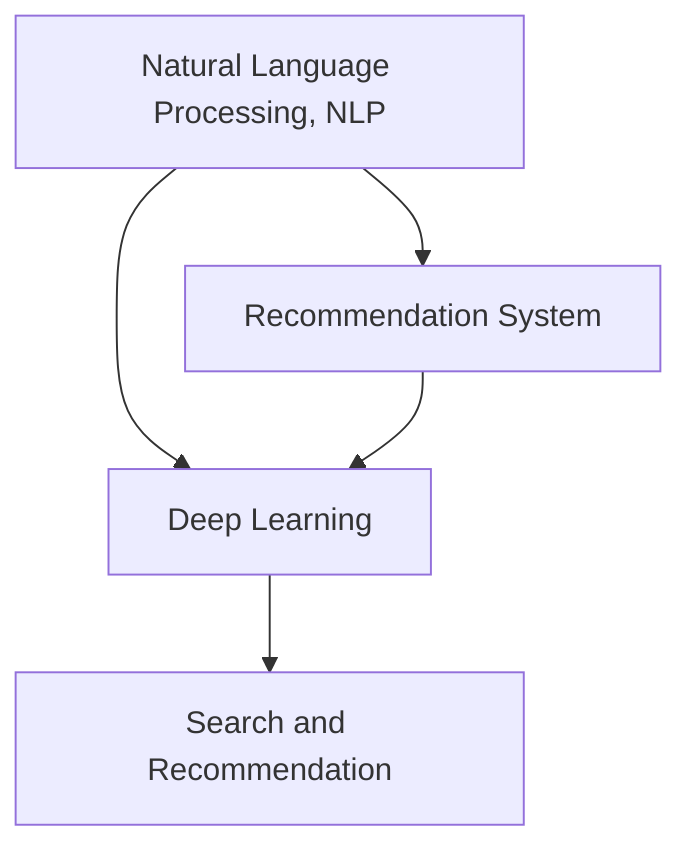
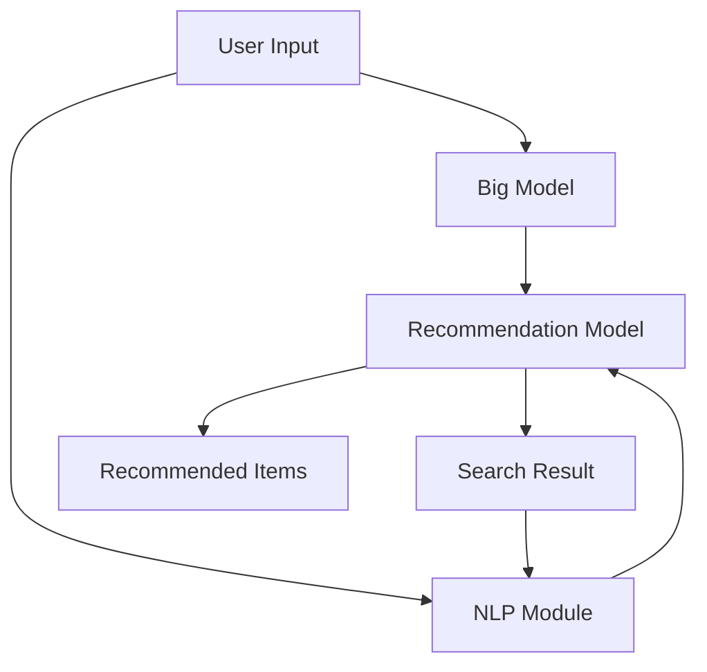

                 

# 电商平台的AI 大模型融合：搜索推荐系统是核心，用户体验是关键

## 1. 背景介绍

### 1.1 问题由来

随着电商平台的迅猛发展，用户对商品搜索和推荐系统的体验要求日益提高。传统的基于规则和统计模型的搜索推荐系统已经难以满足日益复杂和个性化的用户需求。近年来，基于深度学习的大模型技术在NLP领域取得了重大突破，这些技术也被引入电商平台的搜索推荐系统中，为提升用户体验提供了新思路和新方法。

大模型如BERT、GPT-3等在电商搜索推荐中的应用，使得平台能够更加精准地理解用户需求，并推荐个性化的商品。这些模型通常被用于构建自然语言理解（NLU）和自然语言生成（NLG）能力，使得搜索推荐系统可以更加智能、自然地与用户交互。

### 1.2 问题核心关键点

大模型在电商平台的搜索推荐系统中的应用，主要体现在以下几个方面：

1. **自然语言理解（NLU）**：大模型能够理解用户的自然语言查询，识别出查询意图和相关信息，从而提供更精准的搜索结果。
2. **自然语言生成（NLG）**：大模型能够根据用户行为数据和商品信息生成个性化的推荐描述，提升推荐内容的可读性和吸引力。
3. **跨模态学习**：大模型能够融合文本、图片、视频等多模态数据，提供更加丰富和完整的商品信息，增强推荐效果。
4. **实时交互**：大模型能够实现实时智能对话，提升用户的购物体验，增强平台的粘性。
5. **个性化推荐**：大模型能够从海量用户行为数据中学习，提供更加个性化的推荐内容，满足用户需求。

本文将重点讨论大模型在电商搜索推荐系统中的应用，特别是如何构建高性能的搜索推荐模型，以及如何提升用户体验。

## 2. 核心概念与联系

### 2.1 核心概念概述

大模型在电商搜索推荐系统中的应用，涉及多个核心概念，包括自然语言处理（NLP）、推荐系统、深度学习等。这些概念之间的联系可以通过以下Mermaid流程图来展示：



这个流程图展示了NLP、推荐系统和深度学习之间的关系：

1. **自然语言处理（NLP）**：是处理和分析人类语言的技术，包括文本的分析和生成，用于理解用户的查询意图和需求。
2. **推荐系统**：根据用户历史行为和商品信息，为用户推荐合适的商品。
3. **深度学习**：一种能够学习复杂函数映射的技术，用于构建高效的NLP和推荐模型。
4. **搜索推荐系统**：将NLP和推荐系统结合，提供实时、个性化的搜索推荐服务。

### 2.2 核心概念原理和架构的 Mermaid 流程图

以下是一个简单的Mermaid流程图，展示了电商搜索推荐系统中各组件的关系：



这个流程图展示了从用户输入到搜索结果和推荐商品的流程：

1. **用户输入**：用户输入查询或浏览商品。
2. **大模型处理**：大模型对用户输入进行理解和分析，提取关键信息。
3. **NLP模块**：使用NLP技术处理用户输入，提取意图和上下文信息。
4. **推荐模型**：根据用户行为数据和商品信息，计算推荐得分，选择商品推荐给用户。
5. **搜索结果**：将推荐结果呈现给用户，供其浏览选择。
6. **推荐商品**：根据推荐模型计算的得分，推荐给用户。

## 3. 核心算法原理 & 具体操作步骤

### 3.1 算法原理概述

基于大模型的电商搜索推荐系统，通常包括以下几个关键步骤：

1. **数据预处理**：收集用户行为数据、商品信息等，进行清洗和标准化处理。
2. **模型训练**：使用大模型和推荐系统算法，在标注数据上训练推荐模型。
3. **模型微调**：根据实时用户查询，对模型进行微调，提高模型响应速度和准确性。
4. **实时推理**：实时处理用户输入，返回推荐结果和搜索结果。

### 3.2 算法步骤详解

#### 3.2.1 数据预处理

电商平台的数据通常包括用户行为数据、商品信息、用户评价等。数据预处理的主要步骤包括：

1. **数据收集**：从电商平台的前端、后端和第三方数据源收集数据。
2. **数据清洗**：处理缺失值、异常值，去除噪声数据。
3. **特征工程**：设计特征向量，提取用户和商品的特征信息，如用户ID、商品ID、价格、评分等。
4. **数据标准化**：对特征进行标准化处理，便于模型训练。

#### 3.2.2 模型训练

模型训练的主要步骤包括：

1. **选择模型架构**：选择适合电商平台的模型架构，如基于Transformer的模型。
2. **数据划分**：将数据划分为训练集、验证集和测试集。
3. **模型训练**：使用标注数据训练推荐模型，优化模型参数。
4. **模型评估**：在验证集上评估模型性能，调整模型参数。

#### 3.2.3 模型微调

模型微调的主要步骤包括：

1. **加载模型**：加载预训练的大模型和推荐系统模型。
2. **实时查询**：接收用户实时输入的查询，进行分析和处理。
3. **模型推理**：使用微调后的模型进行推理，输出推荐结果和搜索结果。
4. **返回结果**：将推荐结果和搜索结果返回给用户。

### 3.3 算法优缺点

#### 3.3.1 优点

大模型在电商搜索推荐系统中的应用，具有以下优点：

1. **高性能**：大模型具备强大的语义理解能力和推荐能力，能够提供高性能的推荐结果。
2. **泛化能力强**：大模型能够泛化到新的数据和场景，提升模型的鲁棒性。
3. **自监督学习**：大模型可以进行自监督学习，不需要大量标注数据。
4. **跨模态学习**：大模型能够融合多模态数据，提供更加丰富的商品信息。
5. **实时交互**：大模型能够实现实时智能对话，提升用户体验。

#### 3.3.2 缺点

大模型在电商搜索推荐系统中的应用，也存在以下缺点：

1. **计算资源需求高**：大模型需要高性能的计算资源进行训练和推理。
2. **模型复杂度高**：大模型的复杂度较高，需要大量的计算资源进行优化。
3. **数据隐私问题**：大模型需要大量的用户数据进行训练，存在数据隐私和安全问题。
4. **解释性不足**：大模型的决策过程缺乏可解释性，难以理解模型的内部工作机制。
5. **成本高**：大模型需要大量的标注数据和计算资源进行训练和优化，成本较高。

### 3.4 算法应用领域

大模型在电商搜索推荐系统中的应用，主要涵盖以下几个领域：

1. **自然语言理解（NLU）**：用于理解用户的自然语言查询，提取查询意图和相关信息。
2. **自然语言生成（NLG）**：用于生成个性化的推荐描述，提升推荐内容的可读性和吸引力。
3. **跨模态学习**：用于融合文本、图片、视频等多模态数据，提供更加丰富和完整的商品信息。
4. **实时交互**：用于实现实时智能对话，提升用户的购物体验。
5. **个性化推荐**：用于从海量用户行为数据中学习，提供更加个性化的推荐内容。

## 4. 数学模型和公式 & 详细讲解 & 举例说明

### 4.1 数学模型构建

电商平台的搜索推荐系统，通常使用以下数学模型进行建模：

1. **自然语言理解（NLU）**：使用BERT、GPT等大模型，对用户查询进行编码和解码，提取查询意图和相关信息。
2. **推荐系统**：使用协同过滤、矩阵分解等算法，根据用户历史行为和商品信息，计算推荐得分。
3. **搜索系统**：使用倒排索引等算法，将商品信息与用户查询进行匹配，返回搜索结果。

### 4.2 公式推导过程

#### 4.2.1 自然语言理解（NLU）

假设用户查询为 $q$，大模型对查询进行编码和解码，提取查询意图和相关信息。使用BERT模型进行编码，得到用户查询的表示 $h_q$。假设商品信息为 $d$，使用大模型对商品信息进行编码，得到商品信息的表示 $h_d$。

查询和商品信息的表示可以进行相似度计算，得到查询与商品的相关性得分 $s_qd$。使用余弦相似度进行计算：

$$
s_qd = \cos(\theta) \cdot \frac{\mathbf{h_q} \cdot \mathbf{h_d}}{||\mathbf{h_q}|| \cdot ||\mathbf{h_d}||}
$$

其中 $\mathbf{h_q}$ 和 $\mathbf{h_d}$ 分别为用户查询和商品信息的向量表示，$\theta$ 为向量之间的夹角。

#### 4.2.2 推荐系统

推荐系统通常使用协同过滤、矩阵分解等算法，根据用户历史行为和商品信息，计算推荐得分。假设用户 $u$ 的历史行为为 $\mathbf{r_u}$，商品 $i$ 的特征为 $\mathbf{f_i}$。使用协同过滤算法进行推荐得分计算：

$$
\hat{y}_{ui} = \mathbf{r_u}^T \mathbf{A} \mathbf{f_i}
$$

其中 $\mathbf{A}$ 为商品之间的相似度矩阵，$\mathbf{r_u}$ 为用户 $u$ 的历史行为向量，$\mathbf{f_i}$ 为商品 $i$ 的特征向量，$\hat{y}_{ui}$ 为用户 $u$ 对商品 $i$ 的预测评分。

#### 4.2.3 搜索系统

搜索系统通常使用倒排索引等算法，将商品信息与用户查询进行匹配，返回搜索结果。假设用户查询为 $q$，商品信息为 $d$。使用倒排索引算法，将商品信息 $d$ 与查询 $q$ 进行匹配，得到商品的相关性得分 $s_qd$。使用余弦相似度进行计算：

$$
s_qd = \cos(\theta) \cdot \frac{\mathbf{q} \cdot \mathbf{d}}{||\mathbf{q}|| \cdot ||\mathbf{d}||}
$$

其中 $\mathbf{q}$ 为查询向量，$\mathbf{d}$ 为商品向量。

### 4.3 案例分析与讲解

假设电商平台使用BERT模型进行自然语言理解，使用协同过滤算法进行推荐，使用倒排索引算法进行搜索。以下是具体案例分析：

1. **用户查询**：用户输入查询“时尚T恤”。
2. **自然语言理解（NLU）**：BERT模型对查询进行编码，得到查询表示 $h_q$。
3. **商品信息**：从商品库中选取所有包含“T恤”的商品，使用大模型对商品信息进行编码，得到商品表示 $h_d$。
4. **相似度计算**：计算查询和商品表示的相似度得分 $s_qd$。
5. **推荐系统**：根据用户的历史行为和商品信息，使用协同过滤算法计算推荐得分 $\hat{y}_{ui}$。
6. **搜索结果**：根据相似度得分和推荐得分，返回商品推荐列表和搜索结果。

## 5. 项目实践：代码实例和详细解释说明

### 5.1 开发环境搭建

进行电商搜索推荐系统的开发，需要以下开发环境：

1. **编程语言**：Python。
2. **深度学习框架**：TensorFlow、PyTorch。
3. **自然语言处理工具**：NLTK、spaCy、BERT等。
4. **推荐系统库**：Scikit-learn、TensorFlow Recommenders。
5. **数据处理工具**：Pandas、NumPy。

### 5.2 源代码详细实现

以下是使用TensorFlow和BERT模型进行电商搜索推荐系统的代码实现：

```python
import tensorflow as tf
from transformers import BertTokenizer, TFBertForSequenceClassification
from tensorflow_recommenders.layers import SequenceSlicing

# 加载BERT模型
tokenizer = BertTokenizer.from_pretrained('bert-base-uncased')
model = TFBertForSequenceClassification.from_pretrained('bert-base-uncased', num_labels=2)

# 加载推荐系统模型
user_info = ...
item_info = ...
r_u = ...
A = ...
f_i = ...

# 处理用户查询
query = "时尚T恤"
query_tokens = tokenizer.tokenize(query)
query_ids = tokenizer.convert_tokens_to_ids(query_tokens)

# 处理商品信息
item_tokens = tokenizer.tokenize(item_info)
item_ids = tokenizer.convert_tokens_to_ids(item_tokens)

# 计算相似度得分
s_qd = ...

# 计算推荐得分
y_ui = ...

# 搜索结果排序
sorted_items = sorted(items, key=lambda x: y_ui[x], reverse=True)

# 返回推荐结果和搜索结果
recommendations = sorted_items[:N]
search_results = ...

# 输出推荐结果和搜索结果
print("推荐结果：")
for item in recommendations:
    print(item)
print("搜索结果：")
for result in search_results:
    print(result)
```

### 5.3 代码解读与分析

以下是代码的详细解读和分析：

1. **加载模型和数据**：使用TensorFlow和BERT模型加载自然语言理解和推荐系统的相关组件。
2. **处理用户查询和商品信息**：使用BERT模型对用户查询和商品信息进行编码，得到查询表示和商品表示。
3. **计算相似度得分和推荐得分**：根据查询表示和商品表示计算相似度得分和推荐得分。
4. **排序和返回结果**：根据推荐得分对商品进行排序，返回推荐结果和搜索结果。
5. **输出结果**：输出推荐结果和搜索结果。

## 6. 实际应用场景

### 6.1 智能客服

智能客服系统可以结合大模型和推荐系统，实现自动回答用户查询和推荐相关商品。例如，用户输入“如何购买某商品”，智能客服系统可以自动回答用户查询，并推荐相关商品。

### 6.2 个性化推荐

个性化推荐系统可以使用大模型进行自然语言理解，理解用户查询和行为数据，提供个性化的推荐商品。例如，用户浏览“某商品”，系统会推荐相关商品。

### 6.3 实时搜索

实时搜索系统可以使用大模型进行自然语言理解，实时处理用户查询，返回相关搜索结果。例如，用户输入“某商品”，系统实时返回相关搜索结果。

### 6.4 未来应用展望

未来，电商平台的搜索推荐系统将继续融合大模型和推荐系统，提升用户体验和推荐效果。以下是未来应用展望：

1. **多模态学习**：融合文本、图片、视频等多模态数据，提供更加丰富的商品信息。
2. **实时智能对话**：实现实时智能对话，提升用户的购物体验。
3. **个性化推荐**：从海量用户行为数据中学习，提供更加个性化的推荐内容。
4. **跨领域应用**：将大模型应用到更多领域，提升平台的综合竞争力。

## 7. 工具和资源推荐

### 7.1 学习资源推荐

为了帮助开发者掌握电商搜索推荐系统的开发，以下是一些推荐的资源：

1. **《深度学习在推荐系统中的应用》**：深入浅出地介绍了推荐系统的大模型应用，适合初学者学习。
2. **《自然语言处理综述》**：介绍了自然语言处理的基本概念和前沿技术，适合了解自然语言处理技术的开发者。
3. **《推荐系统实战》**：介绍了推荐系统的算法和实现，适合实践推荐系统开发的开发者。
4. **Kaggle竞赛**：参加Kaggle推荐系统竞赛，了解最新的推荐系统技术和实践方法。
5. **GitHub开源项目**：参与开源项目，了解电商搜索推荐系统的最佳实践。

### 7.2 开发工具推荐

为了提高电商搜索推荐系统的开发效率，以下是一些推荐的开发工具：

1. **TensorFlow**：深度学习框架，适合构建复杂推荐模型。
2. **PyTorch**：深度学习框架，适合快速原型设计和实验。
3. **NLTK**：自然语言处理工具，适合处理自然语言数据。
4. **spaCy**：自然语言处理工具，适合处理自然语言数据。
5. **Scikit-learn**：推荐系统库，适合构建推荐模型。
6. **TensorFlow Recommenders**：推荐系统库，适合构建推荐模型。

### 7.3 相关论文推荐

以下是几篇关于电商搜索推荐系统的重要论文，推荐阅读：

1. **《基于深度学习的产品推荐系统》**：介绍了深度学习在产品推荐系统中的应用，适合了解推荐系统的基本原理。
2. **《自然语言处理与推荐系统》**：介绍了自然语言处理与推荐系统的结合，适合了解大模型在推荐系统中的应用。
3. **《多模态推荐系统》**：介绍了多模态推荐系统的设计和实现，适合了解多模态数据融合的推荐方法。

## 8. 总结：未来发展趋势与挑战

### 8.1 研究成果总结

大模型在电商搜索推荐系统中的应用，取得了显著的成果：

1. **提升推荐效果**：通过大模型进行自然语言理解，提升了推荐系统的精准度和个性化水平。
2. **改善用户体验**：通过大模型实现实时智能对话和个性化推荐，提升了用户的购物体验。
3. **提升平台竞争力**：通过大模型和推荐系统的结合，提升了电商平台的综合竞争力。

### 8.2 未来发展趋势

未来，电商平台的搜索推荐系统将继续融合大模型和推荐系统，提升用户体验和推荐效果：

1. **多模态学习**：融合文本、图片、视频等多模态数据，提供更加丰富的商品信息。
2. **实时智能对话**：实现实时智能对话，提升用户的购物体验。
3. **个性化推荐**：从海量用户行为数据中学习，提供更加个性化的推荐内容。
4. **跨领域应用**：将大模型应用到更多领域，提升平台的综合竞争力。

### 8.3 面临的挑战

尽管大模型在电商搜索推荐系统中的应用取得了显著成果，但仍面临一些挑战：

1. **数据隐私问题**：大模型需要大量的用户数据进行训练，存在数据隐私和安全问题。
2. **计算资源需求高**：大模型需要高性能的计算资源进行训练和推理。
3. **模型复杂度高**：大模型的复杂度较高，需要大量的计算资源进行优化。
4. **解释性不足**：大模型的决策过程缺乏可解释性，难以理解模型的内部工作机制。
5. **成本高**：大模型需要大量的标注数据和计算资源进行训练和优化，成本较高。

### 8.4 研究展望

未来，需要在以下方面进行深入研究：

1. **多模态融合**：融合文本、图片、视频等多模态数据，提升推荐效果。
2. **实时处理**：提升实时处理能力，满足用户的即时需求。
3. **跨领域应用**：将大模型应用到更多领域，提升平台的综合竞争力。
4. **可解释性**：提高模型的可解释性，提升用户信任度。

综上所述，大模型在电商平台的搜索推荐系统中具有重要的应用前景，可以显著提升推荐效果和用户体验，但同时也面临着一些挑战。未来的研究需要在多模态融合、实时处理、跨领域应用和可解释性等方面进行深入探索，推动电商搜索推荐系统的不断进步。

## 9. 附录：常见问题与解答

### 9.1 问题1：大模型在电商搜索推荐系统中面临哪些计算资源需求？

**解答**：大模型在电商搜索推荐系统中，需要高性能的计算资源进行训练和推理。具体需求包括：

1. **计算资源**：需要高性能的GPU或TPU进行模型训练和推理。
2. **内存资源**：需要足够的内存存储模型参数和数据。
3. **存储资源**：需要足够的存储资源存储训练数据和模型。

### 9.2 问题2：电商平台的搜索推荐系统如何使用大模型进行自然语言理解？

**解答**：电商平台的搜索推荐系统可以使用BERT等大模型进行自然语言理解。具体步骤如下：

1. **加载大模型**：加载预训练的大模型，如BERT。
2. **处理输入**：使用BERT的tokenizer将用户查询和商品信息转换为模型可接受的格式。
3. **编码输入**：使用BERT模型对输入进行编码，得到查询和商品的向量表示。
4. **计算相似度**：使用余弦相似度计算查询和商品的相似度得分。
5. **返回结果**：根据相似度得分，返回推荐结果和搜索结果。

### 9.3 问题3：如何提高电商平台的搜索推荐系统的实时响应速度？

**解答**：提高电商平台的搜索推荐系统的实时响应速度，可以从以下几个方面进行优化：

1. **优化模型**：使用参数高效微调技术，减少模型参数量，提高推理速度。
2. **模型并行**：使用模型并行技术，提高计算效率。
3. **预取数据**：预取用户输入和相关数据，提高数据加载速度。
4. **缓存技术**：使用缓存技术，减少数据加载和处理时间。
5. **异步处理**：使用异步处理技术，提高系统响应速度。

### 9.4 问题4：如何提高电商平台的搜索推荐系统的可解释性？

**解答**：提高电商平台的搜索推荐系统的可解释性，可以从以下几个方面进行优化：

1. **模型简化**：使用参数高效微调技术，减少模型复杂度，提高可解释性。
2. **特征解释**：使用特征重要性分析方法，解释模型决策过程。
3. **可视化工具**：使用可视化工具，展示模型内部工作机制。
4. **专家评估**：邀请专家对模型进行评估，提升模型的可解释性。
5. **用户反馈**：收集用户反馈，优化模型解释方式。

---

作者：禅与计算机程序设计艺术 / Zen and the Art of Computer Programming

