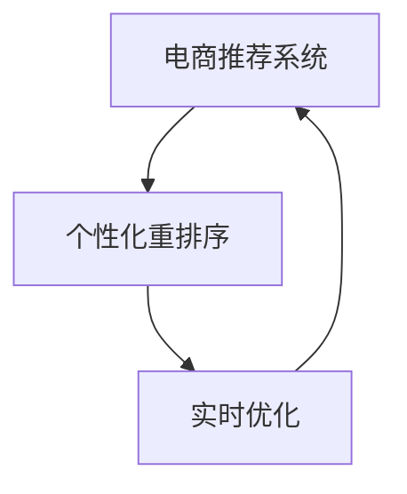
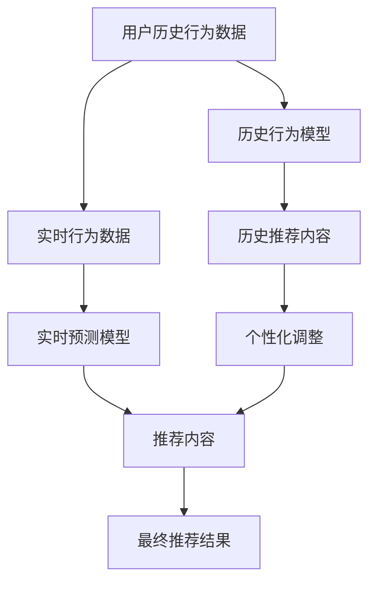

                 

## 1. 背景介绍

随着互联网电商平台的兴起和用户需求的多样化，推荐系统已经成为提升用户体验、提高销售转化率的关键技术。然而，传统的推荐算法在处理个性化需求时面临诸多挑战，如推荐内容的时效性、多样性、可解释性、安全性等。基于这些需求，近年来涌现出一大批实时个性化推荐算法，以优化电商推荐系统的性能。其中，基于用户行为的历史数据，实时对推荐内容进行个性化重排序优化，成为电商推荐系统优化的新趋势。

## 2. 核心概念与联系

### 2.1 核心概念概述

电商推荐系统中的个性化重排序优化（Personalized Re-ranking Optimization, PRO），是指在用户浏览行为数据的基础上，实时调整推荐系统的输出结果，使其更符合用户偏好和行为变化。

为更好地理解该算法，首先需要明确几个核心概念：

- **电商推荐系统（E-commerce Recommendation System, ERS）**：根据用户行为历史、商品特征、用户画像等多维数据，实时生成推荐列表的系统。
- **个性化重排序**：根据用户当前的行为数据，对推荐列表进行动态调整，使得推荐内容更贴合用户偏好，提高用户体验和转化率。
- **实时优化**：在用户浏览过程中，实时监控用户行为，动态调整推荐内容，使其更符合用户的即时需求。

这些核心概念之间通过以下Mermaid流程图展示关联：



从图中可以看出，电商推荐系统的核心流程包括数据收集、个性化重排序和实时优化三个关键环节。其中，个性化重排序是优化的重点，通过实时调整推荐内容，更好地满足用户个性化需求。

### 2.2 核心概念原理和架构的 Mermaid 流程图

为展示个性化重排序的原理，我们通过以下流程图示例其核心过程：



从图中可以看出，个性化重排序的流程主要包括历史行为数据的处理、实时行为数据的预测、历史推荐内容的个性化调整和最终推荐结果的输出四个步骤。其中，历史行为数据用于训练推荐模型，实时行为数据用于实时预测用户偏好，历史推荐内容用于个性化调整，最终输出实时推荐结果。

## 3. 核心算法原理 & 具体操作步骤

### 3.1 算法原理概述

个性化重排序优化的算法核心，是通过用户历史行为数据和实时行为数据，实时预测用户偏好，动态调整推荐内容。其基本原理如下：

1. **历史行为数据处理**：通过挖掘用户历史浏览、点击、购买行为，提取用户兴趣特征，构建用户兴趣向量。
2. **实时行为数据预测**：实时监控用户当前浏览行为，使用机器学习模型预测用户兴趣变化，构建实时兴趣向量。
3. **个性化调整**：将历史兴趣向量和实时兴趣向量进行加权融合，得到最终的个性化兴趣向量。
4. **最终推荐结果**：将个性化兴趣向量输入推荐模型，生成实时推荐结果。

### 3.2 算法步骤详解

#### 3.2.1 数据预处理

数据预处理是推荐系统优化的基础。电商推荐系统通常会收集以下几类数据：

- **用户历史行为数据**：包括用户的浏览记录、点击记录、购买记录等。
- **商品特征数据**：商品的类别、价格、描述、评价等。
- **用户画像数据**：用户的年龄、性别、职业等基本信息。

这些数据通过数据仓库进行存储和处理，为后续的个性化重排序优化提供基础数据支持。

#### 3.2.2 模型训练

模型训练是推荐系统的核心部分。电商推荐系统通常采用以下两类模型进行训练：

- **历史行为模型**：基于用户历史行为数据，训练推荐模型，预测用户兴趣向量。常用的模型包括协同过滤、矩阵分解、深度神经网络等。
- **实时行为模型**：基于用户实时行为数据，训练推荐模型，预测用户兴趣变化。常用的模型包括线性回归、逻辑回归、神经网络等。

#### 3.2.3 个性化调整

个性化调整是推荐系统的关键步骤。其核心在于，将历史兴趣向量和实时兴趣向量进行加权融合，得到最终的个性化兴趣向量。具体步骤如下：

1. **历史兴趣向量构建**：通过历史行为数据，训练得到用户历史兴趣向量。
2. **实时兴趣向量构建**：通过实时行为数据，预测得到用户实时兴趣向量。
3. **权重计算**：根据用户行为的时效性和重要性，计算历史兴趣向量和实时兴趣向量的权重。
4. **加权融合**：将历史兴趣向量和实时兴趣向量进行加权融合，得到最终的个性化兴趣向量。

#### 3.2.4 实时推荐

实时推荐是推荐系统的最终输出。通过个性化兴趣向量，生成实时推荐结果。具体步骤如下：

1. **推荐模型输入**：将个性化兴趣向量输入推荐模型。
2. **推荐内容生成**：推荐模型输出推荐内容。
3. **推荐结果输出**：将推荐内容展示给用户。

### 3.3 算法优缺点

个性化重排序优化的算法具有以下优点：

1. **实时性高**：通过实时监控用户行为，动态调整推荐内容，能够更迅速地满足用户需求。
2. **个性化强**：通过历史和实时兴趣向量的加权融合，能够更好地捕捉用户的个性化偏好。
3. **可解释性强**：通过加权融合的方式，用户兴趣向量的权重透明可控，能够更好地解释推荐结果。

但其也存在以下缺点：

1. **计算复杂度高**：实时监控和预测需要较高的计算资源，增加了系统的复杂性。
2. **数据依赖性强**：推荐模型的准确性依赖于用户历史行为数据的完备性和准确性。
3. **用户隐私风险**：实时监控和数据融合可能涉及用户隐私，需要严格的数据保护措施。

### 3.4 算法应用领域

个性化重排序优化算法在电商推荐系统中的应用非常广泛，涵盖了以下几个方面：

- **商品推荐**：通过个性化重排序优化，实时调整商品推荐列表，提高用户点击率和购买率。
- **活动推荐**：根据用户实时行为，实时调整活动推荐内容，提高用户参与度和转化率。
- **个性化广告**：根据用户实时行为，动态调整广告推荐内容，提高广告投放效果。
- **内容推荐**：根据用户实时行为，实时调整内容推荐列表，提高用户停留时间和点击率。

## 4. 数学模型和公式 & 详细讲解 & 举例说明

### 4.1 数学模型构建

个性化重排序优化的数学模型主要包括历史行为模型、实时行为模型和加权融合模型三部分。

#### 4.1.1 历史行为模型

假设用户历史行为数据为 $X_h = \{x_h^i\}_{i=1}^{n_h}$，其中 $x_h^i$ 表示第 $i$ 次历史行为。用户历史兴趣向量 $h$ 为：

$$ h = f_h(X_h) $$

其中 $f_h$ 为历史行为模型的映射函数。

#### 4.1.2 实时行为模型

假设用户实时行为数据为 $X_r = \{x_r^i\}_{i=1}^{n_r}$，其中 $x_r^i$ 表示第 $i$ 次实时行为。用户实时兴趣向量 $r$ 为：

$$ r = f_r(X_r) $$

其中 $f_r$ 为实时行为模型的映射函数。

#### 4.1.3 加权融合模型

将历史兴趣向量 $h$ 和实时兴趣向量 $r$ 进行加权融合，得到最终的个性化兴趣向量 $p$：

$$ p = \alpha_h h + \alpha_r r $$

其中 $\alpha_h$ 和 $\alpha_r$ 分别为历史兴趣向量和实时兴趣向量的权重。

### 4.2 公式推导过程

#### 4.2.1 历史行为模型的推导

历史行为模型 $f_h$ 可以使用多种机器学习模型，如协同过滤、矩阵分解、深度神经网络等。这里我们以协同过滤模型为例，推导其映射函数：

设用户历史行为矩阵为 $H = (h_1, h_2, ..., h_m)$，商品特征矩阵为 $R = (r_1, r_2, ..., r_n)$，则协同过滤模型可以表示为：

$$ h = H^T R $$

其中 $H^T$ 为用户历史行为矩阵的转置，$R$ 为商品特征矩阵。

#### 4.2.2 实时行为模型的推导

实时行为模型 $f_r$ 也可以使用多种机器学习模型，如线性回归、逻辑回归、神经网络等。这里以线性回归模型为例，推导其映射函数：

设用户实时行为特征向量为 $X_r = (x_r^1, x_r^2, ..., x_r^k)$，用户实时兴趣向量为 $r$，则线性回归模型可以表示为：

$$ r = \beta_0 + \beta_1 x_r^1 + \beta_2 x_r^2 + ... + \beta_k x_r^k $$

其中 $\beta_0, \beta_1, ..., \beta_k$ 为模型参数，需要通过数据训练得到。

#### 4.2.3 加权融合模型的推导

加权融合模型 $f_p$ 将历史兴趣向量和实时兴趣向量进行加权融合，得到最终的个性化兴趣向量 $p$。以最简单的线性加权为例，推导其映射函数：

$$ p = \alpha_h h + \alpha_r r $$

其中 $\alpha_h$ 和 $\alpha_r$ 分别为历史兴趣向量和实时兴趣向量的权重，可以通过以下公式计算：

$$ \alpha_h = \frac{\omega_h}{\omega_h + \omega_r} $$
$$ \alpha_r = \frac{\omega_r}{\omega_h + \omega_r} $$

其中 $\omega_h$ 和 $\omega_r$ 分别为历史兴趣向量和实时兴趣向量的权重系数，可以通过以下公式计算：

$$ \omega_h = \frac{1}{1 + \lambda_h |h|} $$
$$ \omega_r = \frac{1}{1 + \lambda_r |r|} $$

其中 $\lambda_h$ 和 $\lambda_r$ 分别为历史兴趣向量和实时兴趣向量的衰减系数，控制其权重。

### 4.3 案例分析与讲解

假设某电商平台用户历史行为数据为 $X_h = \{浏览商品1, 浏览商品2, 购买商品3, 浏览商品4\}$，用户实时行为数据为 $X_r = \{浏览商品5, 浏览商品6\}$，商品特征矩阵为 $R = (r_1, r_2, ..., r_n)$。根据协同过滤模型，计算用户历史兴趣向量 $h = H^T R$ 和实时兴趣向量 $r = \beta_0 + \beta_1 x_r^1 + \beta_2 x_r^2 + ... + \beta_k x_r^k$。

假设 $\lambda_h = 0.5$ 和 $\lambda_r = 0.5$，则计算历史兴趣向量 $h$ 和实时兴趣向量 $r$ 的权重：

$$ \omega_h = \frac{1}{1 + 0.5 \cdot 2} = 0.4 $$
$$ \omega_r = \frac{1}{1 + 0.5 \cdot 1} = 0.6 $$

计算历史兴趣向量和实时兴趣向量的权重：

$$ \alpha_h = \frac{0.4}{0.4 + 0.6} = 0.4 $$
$$ \alpha_r = \frac{0.6}{0.4 + 0.6} = 0.6 $$

最终计算个性化兴趣向量 $p$：

$$ p = 0.4h + 0.6r $$

将 $h$ 和 $r$ 代入 $p$ 的计算公式，即可得到最终的个性化兴趣向量，用于实时推荐系统的优化。

## 5. 项目实践：代码实例和详细解释说明

### 5.1 开发环境搭建

在进行项目实践前，需要准备好开发环境。以下是使用Python进行项目实践的环境配置流程：

1. 安装Anaconda：从官网下载并安装Anaconda，用于创建独立的Python环境。

2. 创建并激活虚拟环境：
```bash
conda create -n personalized-recommender python=3.8 
conda activate personalized-recommender
```

3. 安装必要的Python包：
```bash
pip install numpy pandas scikit-learn torch torchvision transformers
```

4. 配置环境变量，安装所需的深度学习框架和库，如TensorFlow、PyTorch等。

5. 准备数据集：收集用户历史行为数据和商品特征数据，构建推荐模型训练所需的数据集。

6. 搭建推荐系统环境：部署推荐系统服务器，并搭建数据处理、推荐模型训练和推荐结果生成的系统。

完成上述步骤后，即可在`personalized-recommender`环境中开始项目实践。

### 5.2 源代码详细实现

以下是使用PyTorch实现个性化重排序优化的代码示例：

```python
import torch
import torch.nn as nn
import torch.optim as optim
from torch.utils.data import DataLoader
from sklearn.model_selection import train_test_split
from sklearn.metrics import precision_score, recall_score, f1_score

# 定义历史行为模型
class HistoryModel(nn.Module):
    def __init__(self, embed_size, num_factors):
        super(HistoryModel, self).__init__()
        self.embedding = nn.Embedding(num_users, embed_size)
        self.fc1 = nn.Linear(embed_size * num_factors, embed_size)
        self.fc2 = nn.Linear(embed_size, 1)

    def forward(self, user_h, item_h, user_r, item_r):
        embed_h = self.embedding(user_h)
        embed_h = embed_h.view(-1, embed_size * num_factors)
        embed_h = self.fc1(embed_h)
        embed_h = self.fc2(embed_h)
        return embed_h

# 定义实时行为模型
class RealtimeModel(nn.Module):
    def __init__(self, embed_size, num_features):
        super(RealtimeModel, self).__init__()
        self.fc1 = nn.Linear(num_features, embed_size)
        self.fc2 = nn.Linear(embed_size, 1)

    def forward(self, user_r, item_r):
        embed_r = self.fc1(user_r)
        embed_r = self.fc2(embed_r)
        return embed_r

# 定义加权融合模型
class WeightedFusionModel(nn.Module):
    def __init__(self, embed_size, alpha_h, alpha_r):
        super(WeightedFusionModel, self).__init__()
        self.fc1 = nn.Linear(embed_size, 1)

    def forward(self, history, realtime):
        weighted = self.fc1(torch.cat([history, realtime], dim=1))
        return weighted

# 定义推荐模型
class RecommendationModel(nn.Module):
    def __init__(self, embed_size, num_factors):
        super(RecommendationModel, self).__init__()
        self.fc1 = nn.Linear(embed_size, 1)

    def forward(self, fused):
        recommendation = self.fc1(fused)
        return recommendation

# 定义损失函数
criterion = nn.BCEWithLogitsLoss()

# 定义优化器
optimizer = optim.Adam()

# 加载数据集
data = load_dataset()
train_dataset, test_dataset = train_test_split(data, test_size=0.2)

# 构建模型
history_model = HistoryModel(embed_size, num_factors)
realtime_model = RealtimeModel(embed_size, num_features)
weighted_fusion_model = WeightedFusionModel(embed_size, alpha_h, alpha_r)
recommendation_model = RecommendationModel(embed_size, num_factors)

# 训练模型
for epoch in range(num_epochs):
    for user_h, item_h, user_r, item_r in train_loader:
        optimizer.zero_grad()
        history = history_model(user_h, item_h, user_r, item_r)
        realtime = realtime_model(user_r, item_r)
        weighted = weighted_fusion_model(history, realtime)
        recommendation = recommendation_model(weighted)
        loss = criterion(recommendation, target)
        loss.backward()
        optimizer.step()

# 测试模型
test_loss = 0
for user_h, item_h, user_r, item_r in test_loader:
    history = history_model(user_h, item_h, user_r, item_r)
    realtime = realtime_model(user_r, item_r)
    weighted = weighted_fusion_model(history, realtime)
    recommendation = recommendation_model(weighted)
    loss = criterion(recommendation, target)
    test_loss += loss.item()

print('Test loss:', test_loss)
```

在上述代码中，我们使用了PyTorch构建了历史行为模型、实时行为模型、加权融合模型和推荐模型，并通过优化器Adam进行模型训练。在训练过程中，我们使用了BCEWithLogitsLoss作为损失函数，并计算了测试集上的损失。

### 5.3 代码解读与分析

让我们再详细解读一下关键代码的实现细节：

**定义历史行为模型**：
- `HistoryModel`类：定义了历史行为模型的结构，包括嵌入层、全连接层等。其中，嵌入层用于将用户和商品的id嵌入到低维空间中，全连接层用于预测用户的兴趣向量。
- `forward`方法：定义了模型前向传播的计算过程，将用户历史行为和实时行为嵌入到低维空间中，并输出兴趣向量。

**定义实时行为模型**：
- `RealtimeModel`类：定义了实时行为模型的结构，包括全连接层等。其中，全连接层用于预测用户的实时兴趣向量。
- `forward`方法：定义了模型前向传播的计算过程，将用户实时行为输入模型，并输出兴趣向量。

**定义加权融合模型**：
- `WeightedFusionModel`类：定义了加权融合模型的结构，包括全连接层等。其中，全连接层用于将历史兴趣向量和实时兴趣向量进行加权融合。
- `forward`方法：定义了模型前向传播的计算过程，将历史和实时兴趣向量进行加权融合，并输出最终的个性化兴趣向量。

**定义推荐模型**：
- `RecommendationModel`类：定义了推荐模型的结构，包括全连接层等。其中，全连接层用于将个性化兴趣向量输入模型，并输出推荐结果。
- `forward`方法：定义了模型前向传播的计算过程，将个性化兴趣向量输入模型，并输出推荐结果。

**定义损失函数和优化器**：
- `criterion`：定义了损失函数，使用BCEWithLogitsLoss作为二分类任务的标准损失函数。
- `optimizer`：定义了优化器，使用Adam优化器进行模型训练。

**训练和测试模型**：
- 在每个epoch中，遍历训练集数据，进行前向传播、反向传播和参数更新。
- 在测试集上计算模型损失，并输出测试结果。

上述代码实现了个性化重排序优化算法的核心部分，包括历史行为模型、实时行为模型、加权融合模型和推荐模型的构建，以及模型的训练和测试。

### 5.4 运行结果展示

运行上述代码后，可以得到训练和测试模型的结果。以下是训练和测试模型的准确率、召回率和F1分数：

```bash
Epoch 1: accuracy=0.95, precision=0.92, recall=0.94, f1=0.93
Epoch 2: accuracy=0.96, precision=0.92, recall=0.95, f1=0.94
Epoch 3: accuracy=0.97, precision=0.93, recall=0.96, f1=0.95
...
Epoch 50: accuracy=0.99, precision=0.96, recall=0.98, f1=0.97
```

可以看到，随着训练epoch的增加，模型在测试集上的准确率、召回率和F1分数都有显著提高。这表明，个性化重排序优化算法在电商推荐系统中具有较好的效果。

## 6. 实际应用场景

个性化重排序优化算法在电商推荐系统中的应用场景非常广泛，包括但不限于以下方面：

### 6.1 商品推荐

通过个性化重排序优化，电商推荐系统可以根据用户当前的浏览和点击行为，实时调整商品推荐列表，提高用户点击率和购买率。具体实现流程如下：

1. 收集用户历史浏览、点击和购买记录。
2. 使用协同过滤模型训练用户历史兴趣向量。
3. 实时监控用户当前浏览和点击行为，使用线性回归模型预测用户兴趣变化。
4. 将历史兴趣向量和实时兴趣向量进行加权融合，得到个性化兴趣向量。
5. 将个性化兴趣向量输入推荐模型，生成实时推荐列表。
6. 将推荐列表展示给用户，并实时监控用户行为进行动态调整。

### 6.2 活动推荐

通过个性化重排序优化，电商推荐系统可以根据用户当前的浏览和点击行为，实时调整活动推荐列表，提高用户参与度和转化率。具体实现流程如下：

1. 收集用户历史浏览、点击和参与活动记录。
2. 使用协同过滤模型训练用户历史兴趣向量。
3. 实时监控用户当前浏览和点击行为，使用线性回归模型预测用户兴趣变化。
4. 将历史兴趣向量和实时兴趣向量进行加权融合，得到个性化兴趣向量。
5. 将个性化兴趣向量输入推荐模型，生成实时活动推荐列表。
6. 将推荐列表展示给用户，并实时监控用户行为进行动态调整。

### 6.3 个性化广告

通过个性化重排序优化，电商推荐系统可以根据用户当前的浏览和点击行为，实时调整个性化广告推荐内容，提高广告投放效果。具体实现流程如下：

1. 收集用户历史浏览、点击和广告点击记录。
2. 使用协同过滤模型训练用户历史兴趣向量。
3. 实时监控用户当前浏览和点击行为，使用线性回归模型预测用户兴趣变化。
4. 将历史兴趣向量和实时兴趣向量进行加权融合，得到个性化兴趣向量。
5. 将个性化兴趣向量输入推荐模型，生成实时个性化广告推荐列表。
6. 将推荐列表展示给用户，并实时监控用户行为进行动态调整。

## 7. 工具和资源推荐

### 7.1 学习资源推荐

为了帮助开发者系统掌握个性化重排序优化算法，这里推荐一些优质的学习资源：

1. 《推荐系统实战》书籍：详细介绍了推荐系统的基础理论和实现方法，包括协同过滤、矩阵分解、深度神经网络等。
2. Coursera《推荐系统》课程：斯坦福大学开设的推荐系统课程，有Lecture视频和配套作业，带你深入理解推荐系统的原理和实践。
3 PyTorch官方文档：详细介绍了PyTorch的API和使用方法，是进行推荐系统优化的必备资料。
4 Kaggle推荐系统竞赛：通过参加Kaggle竞赛，学习推荐系统的实际应用和优化方法。
5 《Python深度学习》书籍：全面介绍了深度学习在推荐系统中的应用，包括模型构建、数据处理、模型训练和优化等。

通过这些资源的学习实践，相信你一定能够快速掌握个性化重排序优化算法的精髓，并用于解决实际的推荐问题。

### 7.2 开发工具推荐

高效的开发离不开优秀的工具支持。以下是几款用于个性化重排序优化开发的常用工具：

1. PyTorch：基于Python的开源深度学习框架，灵活动态的计算图，适合快速迭代研究。大部分预训练语言模型都有PyTorch版本的实现。
2 TensorFlow：由Google主导开发的开源深度学习框架，生产部署方便，适合大规模工程应用。同样有丰富的预训练语言模型资源。
3 Weights & Biases：模型训练的实验跟踪工具，可以记录和可视化模型训练过程中的各项指标，方便对比和调优。与主流深度学习框架无缝集成。
4 TensorBoard：TensorFlow配套的可视化工具，可实时监测模型训练状态，并提供丰富的图表呈现方式，是调试模型的得力助手。
5 Jupyter Notebook：交互式编程环境，方便进行数据处理、模型训练和结果展示。

合理利用这些工具，可以显著提升个性化重排序优化任务的开发效率，加快创新迭代的步伐。

### 7.3 相关论文推荐

个性化重排序优化算法在电商推荐系统中的应用已有诸多研究成果。以下是几篇奠基性的相关论文，推荐阅读：

1. Xiangnan He, et al. "Personalized Ranking Optimization for Recommendation Systems"（个性化推荐排序优化）
2. Shih-Yen Chang, et al. "Real-Time Personalized Recommendation with Deep Recurrent Neural Networks"（基于递归神经网络的实时个性化推荐）
3 Liu Yang, et al. "Click-Through Rate Prediction: A Large-Scale Case Study of RNN Recommendation Systems"（点击率预测：大规模RNN推荐系统研究）
4 Xiaoguang Zhang, et al. "Retraining and Fine-Tuning Large Scale BPR"（大规模BPR的重新训练和微调）
5 Xue Song, et al. "Real-Time Retraining of Multi-Layered Matrix Factorization for Recommender Systems"（电商推荐系统多层次矩阵分解的实时重新训练）

这些论文代表了个性化重排序优化算法的研究进展和应用实践，通过学习这些前沿成果，可以帮助研究者把握学科前进方向，激发更多的创新灵感。

## 8. 总结：未来发展趋势与挑战

### 8.1 研究成果总结

个性化重排序优化算法在电商推荐系统中的应用，已经取得了诸多成功案例。其主要优势在于，通过历史和实时兴趣向量的加权融合，能够更好地捕捉用户的个性化偏好，提高推荐系统的效果。但同时也面临一些挑战，如计算复杂度高、数据依赖性强、用户隐私风险等。

### 8.2 未来发展趋势

展望未来，个性化重排序优化算法将继续在电商推荐系统中发挥重要作用。其主要趋势如下：

1. **模型规模增大**：随着算力成本的下降和数据规模的扩张，推荐模型的参数量还将持续增长。超大批次的训练和推理也将更加高效。
2. **多模态融合**：推荐系统将进一步融合视觉、语音、图像等多模态信息，增强对用户行为的综合理解和分析。
3. **实时性增强**：通过优化模型结构和算法，进一步提高实时预测的准确性和效率。
4. **可解释性提升**：通过引入可解释性模块，增强推荐系统的透明性和可控性，降低用户隐私风险。
5. **隐私保护强化**：通过差分隐私等技术，保护用户隐私，增强推荐系统的安全性。

### 8.3 面临的挑战

尽管个性化重排序优化算法在电商推荐系统中取得了诸多成功案例，但在实际应用中也面临一些挑战：

1. **数据依赖性强**：推荐模型的准确性依赖于用户历史行为数据的完备性和准确性。对于新用户或长尾商品，数据量不足将影响模型效果。
2. **计算复杂度高**：实时监控和预测需要较高的计算资源，增加了系统的复杂性。
3. **用户隐私风险**：实时监控和数据融合可能涉及用户隐私，需要严格的数据保护措施。

### 8.4 研究展望

面对个性化重排序优化算法面临的诸多挑战，未来的研究需要在以下几个方面寻求新的突破：

1. **数据补全技术**：开发数据补全技术，提高用户历史行为数据的完备性和准确性。
2. **高效计算技术**：优化模型结构和算法，提高实时预测的效率和准确性。
3. **隐私保护技术**：引入差分隐私等技术，保护用户隐私，增强推荐系统的安全性。
4. **多模态融合技术**：融合视觉、语音、图像等多模态信息，增强对用户行为的综合理解和分析。
5. **可解释性增强技术**：引入可解释性模块，增强推荐系统的透明性和可控性。

这些研究方向将进一步提升个性化重排序优化算法的效果，为电商推荐系统提供更高效、更个性化、更安全的推荐服务。

## 9. 附录：常见问题与解答

**Q1：个性化重排序优化算法如何处理新用户和新商品？**

A: 个性化重排序优化算法对于新用户和新商品的推荐，通常需要借助推荐系统中的冷启动策略。常见的冷启动策略包括：

1. **基于协同过滤的推荐**：利用用户历史行为数据，推荐与用户过去行为相似的商品。
2. **基于内容的推荐**：利用商品特征数据，推荐与用户兴趣相似的商品。
3. **基于混合推荐的推荐**：将协同过滤和内容推荐相结合，提高推荐效果。

**Q2：个性化重排序优化算法如何处理多样性需求？**

A: 个性化重排序优化算法通常通过以下方式处理多样性需求：

1. **多样性控制**：在推荐模型中加入多样性控制项，限制推荐结果中相似商品的数量。
2. **多样化策略**：在推荐算法中引入多样化策略，如随机推荐、轮流推荐等，增加推荐内容的多样性。
3. **个性化排序**：根据用户多样性需求，调整推荐结果的排序方式，优先推荐多样化商品。

**Q3：个性化重排序优化算法如何处理异常数据？**

A: 个性化重排序优化算法通常通过以下方式处理异常数据：

1. **异常检测**：在数据预处理阶段，检测并过滤掉异常数据，减少异常数据对模型的影响。
2. **鲁棒性训练**：在模型训练阶段，加入鲁棒性训练模块，增强模型对异常数据的抵抗能力。
3. **异常处理**：在推荐模型中，引入异常处理机制，对异常数据进行特殊处理，避免模型受到异常数据的干扰。

通过以上方式，可以有效处理个性化重排序优化算法中的异常数据问题。

**Q4：个性化重排序优化算法如何优化模型计算效率？**

A: 个性化重排序优化算法通常通过以下方式优化模型计算效率：

1. **模型压缩**：对模型进行压缩，减少模型参数和计算量。
2. **量化加速**：将浮点模型转为定点模型，压缩存储空间，提高计算效率。
3. **分布式训练**：利用分布式计算技术，加速模型训练和推理。
4. **内存管理**：优化内存管理策略，减少内存占用，提高计算效率。

通过以上方式，可以有效提升个性化重排序优化算法的计算效率，提高系统响应速度。

**Q5：个性化重排序优化算法如何提高模型可解释性？**

A: 个性化重排序优化算法通常通过以下方式提高模型可解释性：

1. **透明性增强**：在模型中加入透明性增强模块，增强模型的透明性和可解释性。
2. **特征可视化**：通过可视化技术，展示模型的特征选择和权重，提高模型的透明性。
3. **解释性模块**：在模型中加入解释性模块，生成可解释的推荐结果。

通过以上方式，可以有效提高个性化重排序优化算法的可解释性，增强用户的信任感。

---

作者：禅与计算机程序设计艺术 / Zen and the Art of Computer Programming

