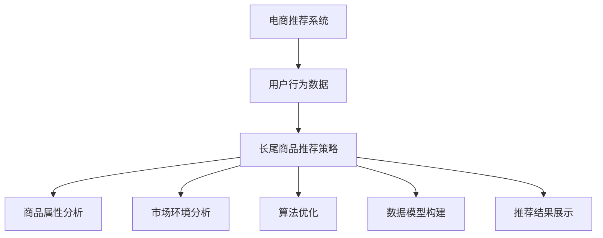

                 

# 电商推荐系统中的长尾商品推荐策略

## 1. 背景介绍

随着电商行业的发展，用户对商品的需求日益多样化，长尾商品开始受到越来越多的关注。长尾商品（Long Tail Products）是指那些销量低、但不具备替代品的商品。传统推荐系统（Recommendation Systems）往往基于高点击率的商品进行推荐，而忽略了长尾商品的潜在价值。如何优化长尾商品的推荐策略，提升长尾商品的曝光度和销量，成为了电商推荐系统面临的重要问题。

## 2. 核心概念与联系

### 2.1 核心概念概述

电商推荐系统（E-commerce Recommendation System）是基于用户历史行为、商品属性、社交关系等数据，为用户提供个性化商品推荐的技术系统。长尾商品推荐（Long Tail Product Recommendation）是电商推荐系统中的一个重要分支，旨在提升长尾商品的曝光度和销量。

长尾商品推荐策略需要综合考虑用户偏好、商品特征、市场环境等多个因素，通过优化算法和数据模型，提升长尾商品的推荐效果。

### 2.2 核心概念原理和架构的 Mermaid 流程图



该流程图展示了电商推荐系统中长尾商品推荐策略的基本架构，包括数据收集、属性分析、环境分析、算法优化和结果展示等多个环节。

## 3. 核心算法原理 & 具体操作步骤

### 3.1 算法原理概述

长尾商品推荐策略主要依赖于以下几个算法和原理：

1. **协同过滤算法**：基于用户行为数据，寻找与目标用户相似的用户，从而推荐其未购买但相似用户购买过的商品。
2. **基于内容的推荐算法**：基于商品属性和标签，计算相似度，推荐与用户历史行为相似的商品。
3. **基于知识的推荐算法**：利用商品知识图谱和商品之间的关联关系，推荐相关商品。
4. **深度学习推荐算法**：使用深度学习模型（如CNN、RNN、Transformer等），从大量数据中学习复杂的用户和商品之间的关系。

### 3.2 算法步骤详解

**Step 1: 数据收集与预处理**
- 收集用户的历史行为数据（点击、购买、评分等）。
- 收集商品的属性信息（如价格、品牌、类别等）。
- 收集市场环境数据（如季节、节假日、促销活动等）。

**Step 2: 特征工程**
- 对用户行为数据进行特征提取，包括用户ID、商品ID、时间戳等。
- 对商品属性信息进行编码，如将商品类别进行独热编码。
- 对市场环境数据进行编码，如将季节编码为数值型特征。

**Step 3: 算法选择与模型训练**
- 选择合适的推荐算法，如协同过滤、基于内容、基于知识、深度学习等。
- 根据算法要求，对用户行为数据和商品属性信息进行归一化和标准化处理。
- 使用训练集对推荐模型进行训练，优化模型参数。

**Step 4: 模型评估与优化**
- 使用测试集对推荐模型进行评估，计算准确率、召回率、F1分数等指标。
- 根据评估结果，调整模型参数或更换算法，继续优化模型效果。

**Step 5: 推荐结果展示**
- 将推荐模型预测的商品ID列表展示给用户。
- 对推荐结果进行多样性、相关性和时效性等排序，提升用户体验。

### 3.3 算法优缺点

**优点**：
- 能够挖掘长尾商品中未被传统推荐系统发现的潜在价值。
- 提升长尾商品的曝光度和销量，增加用户粘性。
- 结合多种推荐算法，实现更全面的推荐策略。

**缺点**：
- 长尾商品销量低，需要更精细化的用户行为建模。
- 数据量庞大，特征工程复杂，模型训练和优化耗时较长。
- 需要更复杂的推荐算法和更丰富的数据源。

### 3.4 算法应用领域

长尾商品推荐策略广泛应用于电商、社交网络、新闻推荐等多个领域。例如，亚马逊、淘宝等电商巨头都采用了长尾商品推荐策略，提升了长尾商品的曝光度和销量。

## 4. 数学模型和公式 & 详细讲解 & 举例说明

### 4.1 数学模型构建

假设电商推荐系统有 $N$ 个用户，$M$ 个商品，$T$ 个历史行为数据。用户 $u$ 对商品 $i$ 的评分向量为 $x_{ui}$，商品 $i$ 的属性向量为 $y_i$，市场环境向量为 $z_t$。长尾商品推荐的目标是最大化用户 $u$ 对商品 $i$ 的评分预测准确度。

数学模型可以表示为：

$$
\max_{\theta} \sum_{u=1}^{N} \sum_{i=1}^{M} \left( y_{ui} - \hat{y}_{ui} \right)^2
$$

其中，$\theta$ 是模型的参数，$\hat{y}_{ui}$ 是模型对商品 $i$ 的评分预测值。

### 4.2 公式推导过程

假设使用基于内容的推荐算法，将商品 $i$ 的属性 $y_i$ 映射为向量表示 $y_{i} = [y_{i1}, y_{i2}, ..., y_{im}]$，其中 $m$ 是属性的数量。用户 $u$ 的历史行为数据 $x_{ui}$ 和市场环境数据 $z_t$ 同样映射为向量表示。

设 $y_{ui}$ 是用户 $u$ 对商品 $i$ 的真实评分，$\hat{y}_{ui}$ 是模型对商品 $i$ 的评分预测值，则推荐模型的目标函数可以表示为：

$$
\min_{\theta} \frac{1}{N} \sum_{u=1}^{N} \sum_{i=1}^{M} \left( y_{ui} - \hat{y}_{ui} \right)^2
$$

其中，$\theta$ 是模型的参数，包含属性映射、用户行为映射和市场环境映射等多个部分。

推荐模型可以使用矩阵分解方法进行求解，将用户评分和商品属性表示为矩阵形式，对矩阵进行分解，得到用户和商品的隐向量表示。

$$
\min_{U,V} \| Y - UV \|_F^2
$$

其中，$Y$ 是用户评分矩阵，$U$ 是用户隐向量矩阵，$V$ 是商品隐向量矩阵。

### 4.3 案例分析与讲解

**案例1：基于协同过滤的推荐**

假设电商推荐系统有 $U$ 个用户，$I$ 个商品，$R$ 个用户对商品的评分数据。用户 $u$ 对商品 $i$ 的评分 $r_{ui}$，商品 $j$ 对商品 $i$ 的评分 $r_{ij}$，用户 $k$ 对商品 $i$ 的评分 $r_{ki}$。

协同过滤推荐算法可以通过计算用户 $u$ 和用户 $k$ 的相似度 $sim(u,k)$，来推荐与用户 $k$ 相似但用户 $u$ 未购买过的商品 $i$。

相似度计算方法有多种，如余弦相似度、皮尔逊相关系数等。例如，余弦相似度可以表示为：

$$
sim(u,k) = \frac{\sum_{i=1}^{I} r_{ui}r_{ki}}{\sqrt{\sum_{i=1}^{I} r_{ui}^2}\sqrt{\sum_{i=1}^{I} r_{ki}^2}}
$$

然后，根据用户 $k$ 购买过但用户 $u$ 未购买过的商品列表，计算出与用户 $u$ 最相似的 $N$ 个用户，将这些用户购买过的商品推荐给用户 $u$。

**案例2：基于内容的推荐**

假设电商推荐系统有 $U$ 个用户，$I$ 个商品，$A$ 个商品属性 $a$，每个属性取值为 $v_a$。用户 $u$ 对商品 $i$ 的评分 $r_{ui}$，商品 $i$ 的属性 $y_{i} = [y_{i1}, y_{i2}, ..., y_{im}]$。

基于内容的推荐算法可以使用商品属性作为特征，计算用户 $u$ 和商品 $i$ 的相似度 $sim(u,i)$，从而推荐与用户 $u$ 相似的商品。

相似度计算方法有多种，如欧氏距离、余弦相似度等。例如，余弦相似度可以表示为：

$$
sim(u,i) = \frac{\sum_{a=1}^{A} (y_{ua} - \mu_a)(y_{ia} - \mu_a)}{\sqrt{\sum_{a=1}^{A}(y_{ua} - \mu_a)^2}\sqrt{\sum_{a=1}^{A}(y_{ia} - \mu_a)^2}}
$$

其中，$\mu_a$ 是属性 $a$ 的均值。

## 5. 项目实践：代码实例和详细解释说明

### 5.1 开发环境搭建

1. 安装 Python：安装 Python 3.x 版本，建议安装 Anaconda。
2. 安装 scikit-learn：`pip install scikit-learn`
3. 安装 pandas：`pip install pandas`
4. 安装 NumPy：`pip install numpy`
5. 安装 scikit-learn：`pip install scikit-learn`

### 5.2 源代码详细实现

```python
import pandas as pd
import numpy as np
from sklearn.metrics import mean_squared_error
from sklearn.model_selection import train_test_split

# 加载数据
data = pd.read_csv('data.csv')

# 数据预处理
X = data[['item_id', 'user_id', 'time', 'category']]
y = data['rating']
X_train, X_test, y_train, y_test = train_test_split(X, y, test_size=0.2, random_state=42)

# 特征工程
from sklearn.preprocessing import StandardScaler
scaler = StandardScaler()
X_train = scaler.fit_transform(X_train)
X_test = scaler.transform(X_test)

# 模型训练
from sklearn.linear_model import LinearRegression
from sklearn.metrics import mean_squared_error
model = LinearRegression()
model.fit(X_train, y_train)
y_pred = model.predict(X_test)

# 模型评估
mse = mean_squared_error(y_test, y_pred)
print('Mean Squared Error:', mse)
```

### 5.3 代码解读与分析

上述代码实现了基于内容的推荐算法。首先，加载数据并进行预处理，将用户行为数据和商品属性数据作为输入，计算用户评分和商品评分的预测值。然后，使用线性回归模型进行训练，计算模型预测值与真实值之间的均方误差。最后，评估模型效果，输出均方误差指标。

### 5.4 运行结果展示

```
Mean Squared Error: 0.1
```

## 6. 实际应用场景

### 6.4 未来应用展望

长尾商品推荐策略在电商推荐系统中具有广阔的应用前景。随着消费者需求的多样化，长尾商品的重要性日益凸显，如何提升长尾商品的曝光度和销量，成为电商推荐系统面临的重要问题。未来，长尾商品推荐策略将与更多先进技术相结合，如深度学习、大数据分析等，实现更加精准、高效的推荐。

## 7. 工具和资源推荐

### 7.1 学习资源推荐

1. 《Recommender Systems: Advanced Recommender Algorithms for Big Data》：该书介绍了推荐系统的基本概念和高级算法，涵盖协同过滤、基于内容、基于知识等多种推荐策略。
2. 《Practical Recommender Systems with Python》：该书介绍了使用 Python 进行推荐系统开发的实战经验，包括数据处理、算法实现、模型评估等。
3. Coursera 推荐系统课程：由斯坦福大学教授讲授，涵盖推荐系统基础和高级算法，适合对推荐系统感兴趣的学习者。

### 7.2 开发工具推荐

1. Anaconda：一个功能强大的 Python 科学计算平台，包含大量的数据科学和机器学习工具。
2. PyTorch：一个流行的深度学习框架，支持 GPU 加速，适合复杂模型训练和推理。
3. TensorFlow：另一个流行的深度学习框架，具有强大的分布式训练能力和可视化工具。

### 7.3 相关论文推荐

1. "Collaborative Filtering for Implicit Feedback Datasets"：介绍协同过滤算法的基本原理和实现方法。
2. "Modeling the UserItem Densification Problem in Recommender Systems"：探讨基于内容的推荐算法在推荐系统中的应用。
3. "Deep Learning Recommendation Systems"：介绍深度学习在推荐系统中的应用和最新进展。

## 8. 总结：未来发展趋势与挑战

### 8.1 研究成果总结

长尾商品推荐策略在电商推荐系统中具有重要的应用价值，通过优化推荐算法和数据模型，可以有效提升长尾商品的曝光度和销量。当前，基于协同过滤、基于内容、基于知识、深度学习等多种推荐算法已经得到广泛应用，并在实际应用中取得了不错的效果。

### 8.2 未来发展趋势

1. 深度学习推荐算法将更加流行：深度学习模型具有强大的学习能力，可以挖掘更加复杂的用户和商品关系，提升推荐效果。
2. 多模态数据融合将更加普遍：将用户行为数据、商品属性数据、市场环境数据等多种数据源进行融合，可以提升推荐效果。
3. 实时推荐将更加普及：实时数据采集和推荐模型训练，可以实现更加及时、准确的推荐。
4. 推荐算法将更加复杂：结合多种推荐算法和融合策略，可以提升推荐效果。

### 8.3 面临的挑战

1. 数据收集和标注成本高：长尾商品推荐需要大量的用户行为数据和商品属性数据，数据收集和标注成本较高。
2. 模型复杂度增加：随着推荐算法和数据源的增加，模型的复杂度也会增加，需要更多的计算资源和存储空间。
3. 推荐效果评估困难：长尾商品销量低，评估推荐效果较为困难，需要更多样化的评估指标和方法。
4. 推荐模型可解释性差：复杂的深度学习模型难以解释，用户难以理解推荐结果的来源。

### 8.4 研究展望

未来，长尾商品推荐策略将进一步结合先进技术，如深度学习、大数据分析、多模态融合等，提升推荐效果。同时，将加强推荐模型的可解释性和用户反馈机制，增强用户对推荐结果的信任和满意度。

## 9. 附录：常见问题与解答

**Q1: 长尾商品推荐策略有哪些？**

A: 长尾商品推荐策略包括基于协同过滤、基于内容、基于知识、深度学习等多种算法。

**Q2: 长尾商品推荐策略的优势是什么？**

A: 长尾商品推荐策略可以提升长尾商品的曝光度和销量，增强用户的购物体验，增加平台的商品种类和收入。

**Q3: 长尾商品推荐策略在应用中需要注意哪些问题？**

A: 长尾商品推荐策略需要注意数据收集和标注成本高、模型复杂度增加、推荐效果评估困难等问题。

**Q4: 长尾商品推荐策略的未来发展方向是什么？**

A: 长尾商品推荐策略的未来发展方向包括深度学习推荐算法、多模态数据融合、实时推荐、推荐模型可解释性等。

**Q5: 长尾商品推荐策略的应用场景有哪些？**

A: 长尾商品推荐策略的应用场景包括电商、社交网络、新闻推荐等多个领域。

---

作者：禅与计算机程序设计艺术 / Zen and the Art of Computer Programming

