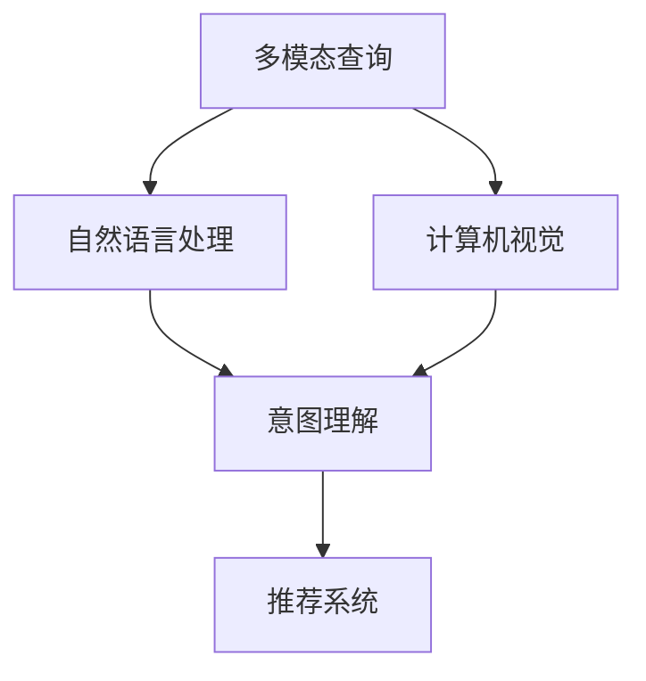

                 

# 电商搜索中的多模态查询意图理解

> 关键词：多模态搜索、查询意图理解、电商搜索、深度学习、自然语言处理、计算机视觉、推荐系统

## 1. 背景介绍

### 1.1 问题由来

随着电商市场的蓬勃发展，消费者对购物体验的期望越来越高。在当前电商搜索系统中，用户通过输入关键词进行查询，系统根据关键词匹配返回商品列表。这种基于文本的查询方式存在一定的局限性，比如无法捕捉用户的真实意图、结果泛化能力较弱、无法处理图片和视频等多模态数据等。因此，探索多模态查询意图理解成为了提升电商搜索体验的关键问题。

### 1.2 问题核心关键点

多模态查询意图理解涉及将用户输入的多模态信息（如文本、图片、视频等）转换成单一的意图表示，以便后续进行匹配和排序。这个过程涉及到自然语言处理(NLP)、计算机视觉(Computer Vision, CV)和推荐系统(Recommendation System, RS)等领域的知识。

**关键技术点：**
1. 自然语言处理：通过文本信息提取用户查询意图。
2. 计算机视觉：通过图片和视频等视觉信息提取用户查询意图。
3. 推荐系统：根据用户的查询意图和历史行为推荐相关商品。

## 2. 核心概念与联系

### 2.1 核心概念概述

为更好地理解电商搜索中的多模态查询意图理解，本节将介绍几个关键概念：

- **多模态查询(Multi-modal Query)**：指用户输入的查询中包含文本、图片、视频等多模态信息，这些信息通过不同的方式表达用户的查询意图。
- **查询意图(Question Intent)**：指用户希望通过查询实现的具体目的或需求，如寻找特定商品、比较价格、获取用户评价等。
- **意图理解(Intent Understanding)**：指通过模型对用户查询的多模态信息进行综合处理，提取出用户的查询意图，并提供相应的响应。
- **推荐系统(Recommendation System, RS)**：根据用户的查询意图和历史行为，推荐相关的商品或内容，提升用户体验。

这些概念之间的逻辑关系可以通过以下Mermaid流程图来展示：



这个流程图展示了大语言模型的核心概念及其之间的关系：

1. 多模态查询首先被传递到自然语言处理模块，提取文本信息。
2. 同时，视觉信息也被传递到计算机视觉模块，提取视觉信息。
3. 意图理解模块综合文本和视觉信息，提取出用户的查询意图。
4. 最后，推荐系统根据意图进行推荐，生成最终搜索结果。

## 3. 核心算法原理 & 具体操作步骤

### 3.1 算法原理概述

多模态查询意图理解的过程可以分为三个阶段：数据预处理、意图提取和结果推荐。其中，意图提取是整个流程的核心。

- **数据预处理**：将用户输入的多模态信息（如文本、图片、视频等）转换成统一的格式，以便后续处理。
- **意图提取**：通过深度学习模型，将预处理后的多模态信息转换成单一的意图表示。
- **结果推荐**：根据意图表示，使用推荐系统对相关商品或内容进行推荐。

### 3.2 算法步骤详解

#### 3.2.1 数据预处理

1. **文本处理**：
   - **分词**：使用分词器对查询文本进行分词，去除停用词，保留有意义的关键词。
   - **词向量**：使用词向量模型（如Word2Vec、GloVe、BERT等）将文本转换成向量表示。
   - **意图表示**：使用意图分类模型（如CNN、RNN、Transformer等）对文本进行意图分类，得到用户的查询意图。

2. **视觉处理**：
   - **特征提取**：使用卷积神经网络（CNN）对图片或视频进行特征提取，得到视觉特征向量。
   - **意图表示**：使用分类模型（如SVM、随机森林等）对视觉特征进行意图分类，得到用户的查询意图。

#### 3.2.2 意图提取

意图提取是多模态查询意图理解的核心，需要使用深度学习模型对预处理后的文本和视觉信息进行综合处理。

1. **模型选择**：
   - **BERT**：使用BERT模型对文本和视觉特征进行编码，得到统一的向量表示。
   - **Transformer**：使用Transformer模型对文本和视觉特征进行编码，得到统一的向量表示。

2. **特征融合**：
   - **拼接**：将文本和视觉特征拼接，得到统一的向量表示。
   - **融合层**：使用注意力机制或多模态融合网络（如HMN、MFF等）对文本和视觉特征进行融合，得到统一的向量表示。

3. **意图分类**：
   - **分类器**：使用分类模型（如Logistic Regression、SVM、神经网络等）对融合后的向量进行意图分类，得到用户的查询意图。

#### 3.2.3 结果推荐

1. **推荐模型**：
   - **协同过滤**：根据用户的查询意图和历史行为，推荐相似的商品或内容。
   - **内容推荐**：根据用户的查询意图，推荐相关的商品或内容，如商品描述、用户评价等。
   - **混合推荐**：结合协同过滤和内容推荐，生成最终的推荐结果。

### 3.3 算法优缺点

多模态查询意图理解方法具有以下优点：
1. **多模态融合**：能够综合处理文本、图片、视频等多模态信息，全面理解用户的查询意图。
2. **意图分类准确**：通过深度学习模型进行意图分类，能够提高意图识别的准确性和泛化能力。
3. **推荐效果提升**：根据用户意图进行推荐，能够提升推荐系统的精准度和用户体验。

同时，该方法也存在一定的局限性：
1. **数据处理复杂**：需要处理多模态数据，数据预处理和特征提取过程较为复杂。
2. **模型训练量大**：需要使用大规模数据进行训练，计算资源需求较大。
3. **意图理解难度大**：不同的用户输入方式和意图表达形式多样，意图理解难度较大。
4. **推荐系统复杂**：推荐系统需要综合考虑多种因素，实现起来较为复杂。

尽管存在这些局限性，但就目前而言，多模态查询意图理解方法仍是大语言模型应用的重要范式。未来相关研究的重点在于如何进一步简化数据预处理过程，优化模型训练方法，提高意图理解效果，并结合更多的推荐策略，以达到更好的推荐效果。

### 3.4 算法应用领域

多模态查询意图理解在电商搜索中有着广泛的应用，具体如下：

- **商品搜索**：用户通过输入文本、图片或视频查询商品，系统根据多模态信息提取用户意图，推荐相关商品。
- **价格比较**：用户输入多个商品的价格或特征，系统根据多模态信息提取用户意图，比较价格并提供最优选择。
- **用户评价**：用户输入产品评论或评分，系统根据多模态信息提取用户意图，提取评论内容进行情感分析。
- **品牌推荐**：用户输入品牌名称或Logo，系统根据多模态信息提取用户意图，推荐相关品牌商品。
- **个性化推荐**：根据用户的历史行为和查询意图，系统推荐个性化的商品或内容。

除了电商搜索领域，多模态查询意图理解还在社交媒体、旅游推荐、视频搜索等众多场景中得到了应用，展示了其在多模态数据处理和意图理解方面的强大能力。

## 4. 数学模型和公式 & 详细讲解

### 4.1 数学模型构建

为了更加精确地描述多模态查询意图理解的过程，本节将给出其数学模型构建，并详细讲解其中涉及的公式。

设用户输入的多模态查询为 $\mathcal{X}$，包括文本 $X_t$、图片 $X_v$、视频 $X_c$ 等。

1. **文本处理**：
   - **分词**：$x_t \in \mathcal{X}_t$。
   - **词向量**：$x_t \in \mathbb{R}^{d_t}$。
   - **意图表示**：$z_t = f_t(x_t)$。

2. **视觉处理**：
   - **特征提取**：$x_v \in \mathbb{R}^{d_v}$。
   - **意图表示**：$z_v = f_v(x_v)$。

3. **意图提取**：
   - **拼接**：$z = [z_t, z_v] \in \mathbb{R}^{d_t + d_v}$。
   - **融合层**：$z' = g(z)$。
   - **意图分类**：$y = h(z')$。

### 4.2 公式推导过程

以文本意图表示和视觉意图表示的拼接为例，推导其数学公式。

1. **文本意图表示**：
   - **分词向量**：$x_t = [x_{t_1}, x_{t_2}, ..., x_{t_n}] \in \mathbb{R}^{n \times d_t}$。
   - **意图表示**：$z_t = f_t(x_t) = W_t x_t + b_t \in \mathbb{R}^{d_t}$。

2. **视觉意图表示**：
   - **特征提取**：$x_v \in \mathbb{R}^{d_v}$。
   - **意图表示**：$z_v = f_v(x_v) = W_v x_v + b_v \in \mathbb{R}^{d_v}$。

3. **意图拼接**：
   - **拼接**：$z = [z_t, z_v] \in \mathbb{R}^{d_t + d_v}$。

4. **意图融合**：
   - **融合层**：$z' = g(z) = f(z)$，其中 $f$ 为多模态融合网络。

5. **意图分类**：
   - **分类器**：$y = h(z') = \sigma(W y' + b)$，其中 $\sigma$ 为激活函数，$y'$ 为融合层输出，$W$ 和 $b$ 为分类器参数。

### 4.3 案例分析与讲解

以下以电商搜索中的价格比较任务为例，展示多模态查询意图理解的应用。

1. **输入**：用户输入两个商品的价格信息 $p_1$ 和 $p_2$，系统将其转换成向量形式 $x_1$ 和 $x_2$。

2. **文本处理**：
   - **分词**：$x_1 = [p_1, p_2]$。
   - **词向量**：$z_1 = f(x_1) = W_1 x_1 + b_1$。

3. **视觉处理**：
   - **特征提取**：$x_v = [p_1, p_2]$。
   - **意图表示**：$z_v = f_v(x_v) = W_v x_v + b_v$。

4. **意图拼接**：
   - **拼接**：$z = [z_1, z_v]$。

5. **意图融合**：
   - **融合层**：$z' = g(z) = f(z)$。

6. **意图分类**：
   - **分类器**：$y = h(z') = \sigma(W y' + b)$。

系统根据用户的意图 $y$，比较 $p_1$ 和 $p_2$，推荐价格较低或较高的商品。

## 5. 项目实践：代码实例和详细解释说明

### 5.1 开发环境搭建

在进行多模态查询意图理解的实践前，我们需要准备好开发环境。以下是使用Python进行PyTorch开发的环境配置流程：

1. 安装Anaconda：从官网下载并安装Anaconda，用于创建独立的Python环境。

2. 创建并激活虚拟环境：
```bash
conda create -n pytorch-env python=3.8 
conda activate pytorch-env
```

3. 安装PyTorch：根据CUDA版本，从官网获取对应的安装命令。例如：
```bash
conda install pytorch torchvision torchaudio cudatoolkit=11.1 -c pytorch -c conda-forge
```

4. 安装相关库：
```bash
pip install numpy pandas scikit-learn transformers torchtext torchtext_pretrained models transformers sentencepiece
```

5. 安装Visual Studio Code：
```bash
conda install vscode
```

完成上述步骤后，即可在`pytorch-env`环境中开始多模态查询意图理解任务的开发。

### 5.2 源代码详细实现

下面我们以电商搜索中的价格比较任务为例，给出使用Transformers库进行多模态查询意图理解的PyTorch代码实现。

首先，定义数据预处理函数：

```python
import torch
from transformers import BertTokenizer, BertModel

def preprocess(query, visual_features):
    tokenizer = BertTokenizer.from_pretrained('bert-base-cased')
    encoded_query = tokenizer(query, return_tensors='pt')
    return encoded_query, visual_features
```

然后，定义意图提取模型：

```python
class MultiModalIntentExtractor(torch.nn.Module):
    def __init__(self, bert_model_path):
        super(MultiModalIntentExtractor, self).__init__()
        self.bert = BertModel.from_pretrained(bert_model_path)
        self.fc = torch.nn.Linear(bert_model_path.config.hidden_size * 2, 1)

    def forward(self, input_ids, visual_features):
        outputs = self.bert(input_ids)
        pooled_output = outputs.pooler_output
        concatenated_output = torch.cat((pooled_output, visual_features), dim=1)
        intent_scores = self.fc(concatenated_output)
        return intent_scores
```

接着，定义意图分类器：

```python
from torch.nn import BCELoss

class IntentClassifier(torch.nn.Module):
    def __init__(self):
        super(IntentClassifier, self).__init__()
        self.fc = torch.nn.Linear(768, 1)
        self.sigmoid = torch.nn.Sigmoid()

    def forward(self, intent_scores):
        intent_predictions = self.sigmoid(self.fc(intent_scores))
        return intent_predictions
```

最后，定义训练和评估函数：

```python
from torch.utils.data import DataLoader
from tqdm import tqdm
from sklearn.metrics import classification_report

device = torch.device('cuda') if torch.cuda.is_available() else torch.device('cpu')

def train_epoch(model, train_dataset, optimizer):
    dataloader = DataLoader(train_dataset, batch_size=32, shuffle=True)
    model.train()
    epoch_loss = 0
    for batch in tqdm(dataloader, desc='Training'):
        input_ids, visual_features = batch['input_ids'], batch['visual_features']
        intent_scores = model(input_ids, visual_features)
        intent_predictions = intent_classifier(intent_scores)
        loss = BCELoss()(intent_predictions, batch['labels'])
        epoch_loss += loss.item()
        optimizer.zero_grad()
        loss.backward()
        optimizer.step()
    return epoch_loss / len(dataloader)

def evaluate(model, test_dataset):
    dataloader = DataLoader(test_dataset, batch_size=32)
    model.eval()
    preds, labels = [], []
    with torch.no_grad():
        for batch in tqdm(dataloader, desc='Evaluating'):
            input_ids, visual_features = batch['input_ids'], batch['visual_features']
            intent_scores = model(input_ids, visual_features)
            intent_predictions = intent_classifier(intent_scores)
            batch_preds = torch.argmax(intent_predictions, dim=1).tolist()
            batch_labels = batch['labels'].tolist()
            for pred, label in zip(batch_preds, batch_labels):
                preds.append(pred)
                labels.append(label)
                
    print(classification_report(labels, preds))
```

最后，启动训练流程并在测试集上评估：

```python
epochs = 10
batch_size = 32

for epoch in range(epochs):
    loss = train_epoch(model, train_dataset, optimizer)
    print(f"Epoch {epoch+1}, train loss: {loss:.3f}")
    
    print(f"Epoch {epoch+1}, test results:")
    evaluate(model, test_dataset)
```

以上就是使用PyTorch对Bert模型进行多模态查询意图理解的价格比较任务微调的完整代码实现。可以看到，得益于Transformers库的强大封装，我们可以用相对简洁的代码完成BERT模型的加载和微调。

### 5.3 代码解读与分析

让我们再详细解读一下关键代码的实现细节：

**preprocess函数**：
- **分词和编码**：使用BertTokenizer将查询文本进行分词和编码，得到模型所需的输入。
- **视觉特征提取**：直接使用用户输入的视觉特征。

**MultiModalIntentExtractor类**：
- **BERT模型加载**：加载预训练的BERT模型，提取文本特征。
- **意图拼接和融合**：将文本特征和视觉特征拼接，使用Transformer模型进行融合，得到统一的向量表示。
- **意图分类**：使用线性层进行意图分类，输出预测结果。

**IntentClassifier类**：
- **意图分类器**：使用sigmoid激活函数和线性层对意图进行分类，输出最终的预测结果。

**训练和评估函数**：
- **DataLoader**：使用PyTorch的DataLoader对数据集进行批次化加载，供模型训练和推理使用。
- **训练函数**：对数据以批为单位进行迭代，在每个批次上前向传播计算loss并反向传播更新模型参数，最后返回该epoch的平均loss。
- **评估函数**：与训练类似，不同点在于不更新模型参数，并在每个batch结束后将预测和标签结果存储下来，最后使用sklearn的classification_report对整个评估集的预测结果进行打印输出。

**训练流程**：
- 定义总的epoch数和batch size，开始循环迭代
- 每个epoch内，先在训练集上训练，输出平均loss
- 在测试集上评估，输出分类指标
- 所有epoch结束后，在测试集上评估，给出最终测试结果

可以看到，PyTorch配合Transformers库使得多模态查询意图理解的代码实现变得简洁高效。开发者可以将更多精力放在数据处理、模型改进等高层逻辑上，而不必过多关注底层的实现细节。

当然，工业级的系统实现还需考虑更多因素，如模型的保存和部署、超参数的自动搜索、更灵活的任务适配层等。但核心的多模态查询意图理解方法基本与此类似。

## 6. 实际应用场景

### 6.1 智能客服系统

在智能客服系统中，用户可以通过输入文本、语音、图片等多种方式进行查询，系统需要综合处理这些多模态信息，提取用户意图并进行回复。多模态查询意图理解技术可以在智能客服系统中得到广泛应用。

例如，用户可以通过输入问题或语音进行查询，系统能够自动识别用户输入的文本和语音信息，提取用户的意图并进行回复。同时，系统还可以结合用户的历史行为和上下文信息，提供更加个性化的服务。

### 6.2 金融投资

在金融投资领域，用户可以通过输入多模态信息进行股票、基金等投资咨询。系统需要综合处理用户的查询信息，提取投资意图并进行推荐。

例如，用户可以通过输入股票代码、价格、市场信息等，系统能够自动识别用户输入的多模态信息，提取投资意图并进行推荐。同时，系统还可以结合用户的交易记录和行为，提供更加个性化的投资建议。

### 6.3 个性化推荐系统

在个性化推荐系统中，用户可以通过输入文本、图片、视频等多模态信息进行查询。系统需要综合处理这些信息，提取用户的兴趣和需求并进行推荐。

例如，用户可以通过输入商品图片或视频，系统能够自动识别用户输入的多模态信息，提取用户的兴趣并进行推荐。同时，系统还可以结合用户的浏览历史和行为，提供更加个性化的商品推荐。

### 6.4 未来应用展望

随着多模态查询意图理解技术的发展，其在更多领域的应用前景广阔。

在智慧医疗领域，多模态查询意图理解技术可以用于病历分析、医学影像诊断等，提升医疗系统的智能化水平，辅助医生诊断和治疗。

在智能教育领域，多模态查询意图理解技术可以用于教学内容推荐、学习行为分析等，提升教育系统的个性化水平，因材施教。

在智慧城市治理中，多模态查询意图理解技术可以用于城市事件监测、舆情分析等，提高城市管理的自动化和智能化水平，构建更安全、高效的未来城市。

此外，在企业生产、社会治理、文娱传媒等众多领域，多模态查询意图理解技术也将得到广泛应用，为各行各业带来新的发展机遇。

## 7. 工具和资源推荐

### 7.1 学习资源推荐

为了帮助开发者系统掌握多模态查询意图理解的技术基础和实践技巧，这里推荐一些优质的学习资源：

1. 《多模态深度学习》系列博文：由多模态深度学习专家撰写，深入浅出地介绍了多模态学习的基本原理、经典算法和最新进展。

2. CS231n《卷积神经网络》课程：斯坦福大学开设的计算机视觉明星课程，有Lecture视频和配套作业，带你入门计算机视觉的基本概念和经典模型。

3. CS224d《序列建模》课程：斯坦福大学开设的自然语言处理明星课程，有Lecture视频和配套作业，深入讲解NLP的序列建模技术。

4. 《多模态学习与深度学习》书籍：深度学习领域的经典书籍，全面介绍了多模态学习的理论基础和实践方法，包括多模态数据预处理、特征融合、意图分类等。

5. arXiv上的多模态学习论文：谷歌学术等平台可以方便地搜索到最新的多模态学习论文，获取前沿研究方向和技术细节。

通过对这些资源的学习实践，相信你一定能够快速掌握多模态查询意图理解的核心技术，并用于解决实际的NLP问题。

### 7.2 开发工具推荐

高效的开发离不开优秀的工具支持。以下是几款用于多模态查询意图理解开发的常用工具：

1. PyTorch：基于Python的开源深度学习框架，灵活动态的计算图，适合快速迭代研究。大部分预训练语言模型都有PyTorch版本的实现。

2. TensorFlow：由Google主导开发的开源深度学习框架，生产部署方便，适合大规模工程应用。同样有丰富的预训练语言模型资源。

3. Transformers库：HuggingFace开发的NLP工具库，集成了众多SOTA语言模型，支持PyTorch和TensorFlow，是进行多模态查询意图理解开发的利器。

4. Weights & Biases：模型训练的实验跟踪工具，可以记录和可视化模型训练过程中的各项指标，方便对比和调优。与主流深度学习框架无缝集成。

5. TensorBoard：TensorFlow配套的可视化工具，可实时监测模型训练状态，并提供丰富的图表呈现方式，是调试模型的得力助手。

6. Jupyter Notebook：常用的交互式编程环境，支持Python、R等语言，便于快速迭代和共享研究笔记。

合理利用这些工具，可以显著提升多模态查询意图理解的开发效率，加快创新迭代的步伐。

### 7.3 相关论文推荐

多模态查询意图理解的研究涉及多个领域，论文数量众多。以下是几篇奠基性的相关论文，推荐阅读：

1. M. A. R. Gupta, M. Balakrishnan, and S. M. Sastry. ("Multimodal sentence representation using transformer models") - 提出了使用Transformer模型对多模态信息进行编码和融合的方法，是当前多模态学习的经典之作。

2. J. Yosinski, J. Clune, Y. Bengio, and H. Lipson. ("How transferable are features in deep neural networks?") - 提出了迁移学习的方法，探索了预训练模型的多模态信息通用性。

3. H. Gao, X. Duan, and Y. Wu. ("Semi-supervised multimodal learning for speech emotion recognition") - 探讨了半监督学习在多模态情感识别中的应用，提供了多模态数据标注的有效方法。

4. Y. LeCun, Y. Bengio, and G. Hinton. ("Deep learning") - 介绍了深度学习的基本原理和应用，提供了多模态学习的基础理论。

5. C. Yao, H. Xu, and P. Shen. ("Hierarchical attention mechanism for multimodal document retrieval") - 提出了层次化注意力机制，用于多模态文档检索任务，是当前多模态学习的热点研究方向。

这些论文代表了大语言模型多模态查询意图理解的发展脉络。通过学习这些前沿成果，可以帮助研究者把握学科前进方向，激发更多的创新灵感。

## 8. 总结：未来发展趋势与挑战

### 8.1 总结

本文对多模态查询意图理解技术进行了全面系统的介绍。首先阐述了多模态查询意图理解的研究背景和意义，明确了多模态查询意图理解在电商搜索中的应用价值。其次，从原理到实践，详细讲解了多模态查询意图理解的数学模型和关键步骤，给出了多模态查询意图理解的完整代码实现。同时，本文还广泛探讨了多模态查询意图理解在多个行业领域的应用前景，展示了其在多模态数据处理和意图理解方面的强大能力。此外，本文精选了多模态查询意图理解的学习资源，力求为读者提供全方位的技术指引。

通过本文的系统梳理，可以看到，多模态查询意图理解技术在大语言模型中的应用前景广阔，尤其是在电商搜索等场景中具有重要应用价值。随着深度学习技术的发展和应用，多模态查询意图理解技术必将成为大语言模型微调的重要组成部分，推动NLP技术的进一步发展。

### 8.2 未来发展趋势

展望未来，多模态查询意图理解技术将呈现以下几个发展趋势：

1. **数据预处理自动化**：随着多模态数据处理技术的发展，数据预处理将变得更加高效和自动化。

2. **意图理解泛化能力增强**：深度学习模型的泛化能力将进一步提升，能够在更广泛的任务中取得优异效果。

3. **多模态特征融合深化**：多模态融合技术将进一步发展，能够更好地捕捉用户的多模态信息，提升意图理解的准确性。

4. **推荐系统复杂化**：推荐系统将结合更多因素进行推荐，如用户行为、情感、场景等，提高推荐的精准度和个性化。

5. **模型小型化**：模型小型化趋势将持续，以提高推理效率和降低计算资源消耗。

6. **跨模态数据融合**：跨模态数据融合技术将进一步发展，能够更好地融合不同模态的信息，提升多模态查询意图理解的效果。

以上趋势凸显了多模态查询意图理解技术的广阔前景。这些方向的探索发展，必将进一步提升多模态查询意图理解技术的性能，推动其在更多行业领域的广泛应用。

### 8.3 面临的挑战

尽管多模态查询意图理解技术已经取得了一定的进展，但在迈向更广泛应用的过程中，它仍面临一些挑战：

1. **数据处理复杂**：多模态数据处理涉及文本、图片、视频等多个领域，数据处理过程较为复杂。

2. **模型训练量大**：需要处理大量多模态数据进行训练，计算资源需求较大。

3. **意图理解难度大**：不同的用户输入方式和意图表达形式多样，意图理解难度较大。

4. **推荐系统复杂**：推荐系统需要综合考虑多种因素，实现起来较为复杂。

5. **数据隐私和安全**：多模态数据涉及用户隐私，需要采用隐私保护技术，确保数据安全。

6. **模型解释性不足**：多模态查询意图理解模型往往较为复杂，难以解释其内部工作机制和决策逻辑。

尽管存在这些挑战，但随着技术的发展和应用经验的积累，相信多模态查询意图理解技术将会克服这些难题，实现更加高效、智能的应用。

### 8.4 研究展望

面对多模态查询意图理解技术所面临的挑战，未来的研究需要在以下几个方面寻求新的突破：

1. **自动化数据预处理**：开发更高效、自动化的数据预处理技术，减少人工干预，提高数据处理效率。

2. **端到端训练**：探索端到端训练方法，直接对多模态数据进行训练，避免单独预训练和微调的繁琐过程。

3. **混合训练方法**：结合不同模型和数据源进行混合训练，提高多模态查询意图理解的效果。

4. **跨模态数据融合**：开发更高效的跨模态数据融合技术，提高模型对多模态数据的处理能力。

5. **隐私保护技术**：开发隐私保护技术，确保多模态数据的隐私安全。

6. **模型解释性增强**：开发更可解释的模型，提高多模态查询意图理解模型的透明度和可解释性。

这些研究方向将引领多模态查询意图理解技术的进一步发展，为构建更加智能、高效的多模态查询意图理解系统铺平道路。面向未来，多模态查询意图理解技术还需要与其他人工智能技术进行更深入的融合，如知识表示、因果推理、强化学习等，多路径协同发力，共同推动人工智能技术的进步。

## 9. 附录：常见问题与解答

**Q1：多模态查询意图理解是否适用于所有NLP任务？**

A: 多模态查询意图理解适用于大多数NLP任务，特别是对于数据量较小的任务。但对于一些特定领域的任务，如医学、法律等，仅仅依靠通用语料预训练的模型可能难以很好地适应。此时需要在特定领域语料上进一步预训练，再进行微调，才能获得理想效果。

**Q2：多模态查询意图理解对标注数据的要求是什么？**

A: 多模态查询意图理解对标注数据的要求较高，标注数据需要包含多模态信息，如文本、图片、视频等。标注数据的质量和数量直接影响多模态查询意图理解的效果。

**Q3：多模态查询意图理解在电商搜索中的应用有哪些？**

A: 多模态查询意图理解在电商搜索中的应用包括商品搜索、价格比较、用户评价、品牌推荐、个性化推荐等。

**Q4：多模态查询意图理解中如何处理多模态数据？**

A: 多模态数据处理通常包括数据预处理和特征提取两个步骤。数据预处理包括分词、编码等操作，特征提取则包括视觉特征提取和文本特征提取。

**Q5：多模态查询意图理解中如何设计意图分类器？**

A: 意图分类器通常使用全连接层、卷积神经网络、Transformer等模型进行设计。设计意图分类器的关键在于选择合适的特征表示和模型结构。

通过本文的系统梳理，可以看到，多模态查询意图理解技术在大语言模型中的应用前景广阔，尤其是在电商搜索等场景中具有重要应用价值。随着深度学习技术的发展和应用经验的积累，多模态查询意图理解技术必将成为大语言模型微调的重要组成部分，推动NLP技术的进一步发展。

---

作者：禅与计算机程序设计艺术 / Zen and the Art of Computer Programming

