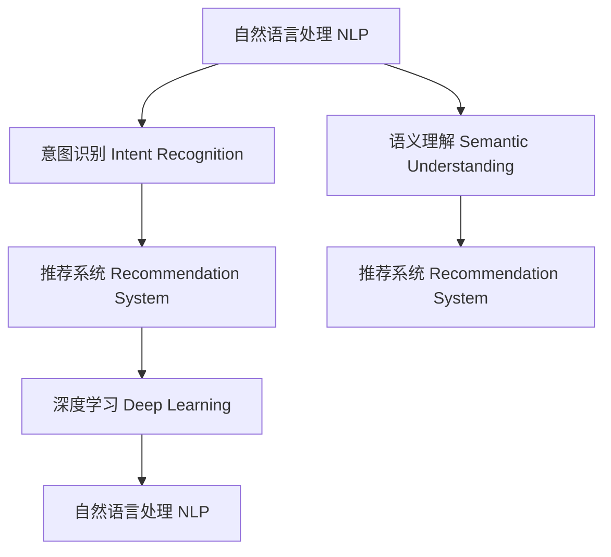

                 

# 电商搜索中的语义理解与意图识别技术

## 1. 背景介绍

### 1.1 问题由来

随着互联网零售的蓬勃发展，电商平台的用户搜索行为日益复杂。用户输入的搜索词往往涉及多个维度，如商品类别、品牌、属性、评分等，意图也千差万别，可能是购买、比较、咨询、导航等。如何准确理解用户输入的搜索词背后的语义和意图，以便快速推荐合适的商品，成为电商搜索系统面临的一大挑战。

传统的搜索排序算法往往只考虑关键词匹配度，而忽视了用户搜索意图的差异，导致推荐结果的准确性和用户满意度不高。而语义理解和意图识别技术，通过分析用户输入的自然语言文本，能够更准确地理解用户意图，从而提供更加精准的搜索结果。

### 1.2 问题核心关键点

语义理解与意图识别技术旨在通过自然语言处理(NLP)和机器学习技术，准确识别用户搜索词的语义和意图，实现更加智能和个性化的搜索结果推荐。具体核心关键点包括：

- 语义理解：识别搜索词中的实体、关系、属性等语义信息，提取文本的关键语义特征。
- 意图识别：理解搜索词背后的用户意图，如购买、比较、咨询等，生成更贴合用户需求的搜索结果。
- 关联推荐：将用户搜索与商品信息进行关联匹配，构建推荐图谱，进行多维度的推荐。
- 用户画像：基于用户历史行为数据，构建用户画像，实现更加个性化的推荐。
- 模型优化：针对电商搜索场景，设计和优化各种机器学习模型，提升推荐效果。

## 2. 核心概念与联系

### 2.1 核心概念概述

为更好地理解电商搜索中的语义理解与意图识别技术，本节将介绍几个密切相关的核心概念：

- 自然语言处理(NLP)：涉及文本预处理、分词、词性标注、句法分析、语义理解等技术，旨在使计算机能够理解自然语言文本。
- 意图识别(Intent Recognition)：旨在从用户输入的自然语言文本中识别其背后的意图，如查询意图、操作意图等。
- 语义理解(Semantic Understanding)：涉及对文本的语义信息进行分析，提取实体、关系、属性等关键信息。
- 推荐系统(Recommendation System)：基于用户历史行为数据和商品特征，通过模型预测并推荐合适的商品或内容。
- 深度学习(Deep Learning)：通过神经网络模型对大规模数据进行学习，实现更加复杂和精确的语义理解与意图识别。

这些核心概念之间的逻辑关系可以通过以下Mermaid流程图来展示：



这个流程图展示了大语言模型的核心概念及其之间的关系：

1. 自然语言处理(NLP)是实现意图识别和语义理解的基础。
2. 意图识别从用户输入中提取用户的真实意图。
3. 语义理解分析文本的语义信息，提取实体、关系、属性等关键信息。
4. 推荐系统基于用户的意图和语义信息，匹配商品并生成推荐结果。
5. 深度学习通过神经网络模型，实现更加复杂和精确的语义理解与意图识别。

这些概念共同构成了电商搜索系统中的语义理解与意图识别框架，使其能够更好地理解用户需求，提供个性化推荐。

## 3. 核心算法原理 & 具体操作步骤
### 3.1 算法原理概述

电商搜索中的语义理解与意图识别技术，本质上是一个多模态、多任务的综合问题。通过自然语言处理和机器学习技术，从用户输入的自然语言文本中提取关键语义信息，并识别用户意图，最终生成个性化的推荐结果。其核心思想可以概括为以下几个步骤：

1. **文本预处理**：包括分词、去除停用词、词干提取、词性标注等，将用户输入转化为标准化的向量表示。
2. **语义理解**：通过词嵌入、上下文嵌入等技术，提取文本的语义特征，如实体、关系、属性等。
3. **意图识别**：通过分类、序列建模等技术，识别用户输入背后的意图，如购买、比较、咨询等。
4. **关联推荐**：将用户的意图和语义信息与商品信息进行关联匹配，构建推荐图谱，进行多维度的推荐。
5. **模型优化**：通过优化模型结构、调整超参数等，提升推荐效果和模型的泛化能力。

### 3.2 算法步骤详解

以下将详细介绍电商搜索中语义理解与意图识别的具体算法步骤：

**Step 1: 文本预处理**

用户输入的搜索词往往包含多个单词、短语，需要进行预处理，转化为机器可理解的形式。常见预处理步骤包括：

1. **分词**：将搜索词切分为单个单词或短语，形成词典。
2. **去除停用词**：去除常见的无意义词语，如“的”、“是”、“在”等。
3. **词干提取**：将不同形式的词语归一化，如“running”、“run”、“runs”都提取为“run”。
4. **词性标注**：标注每个单词的词性，如名词、动词、形容词等。

**Step 2: 语义理解**

语义理解旨在从文本中提取关键语义信息，如实体、关系、属性等。常见方法包括：

1. **词嵌入**：将单词映射为低维向量表示，捕捉单词之间的语义关系。常用方法包括Word2Vec、GloVe、BERT等。
2. **上下文嵌入**：考虑单词在句子中的上下文信息，生成更精确的向量表示。BERT等上下文嵌入模型在电商搜索中表现出色。
3. **实体识别**：识别文本中的实体，如人名、地名、机构名等，提取实体关系和属性信息。

**Step 3: 意图识别**

意图识别旨在从文本中识别用户意图，如查询意图、操作意图等。常见方法包括：

1. **分类模型**：使用分类器如SVM、随机森林、支持向量机等，训练分类模型，识别文本的意图类别。
2. **序列建模**：使用RNN、LSTM、GRU等序列建模技术，捕捉文本的序列依赖关系，生成意图序列。

**Step 4: 关联推荐**

关联推荐旨在将用户意图和语义信息与商品信息进行关联匹配，构建推荐图谱，进行多维度的推荐。常见方法包括：

1. **协同过滤**：基于用户历史行为数据，生成用户-物品关联图谱，推荐相似物品。
2. **基于内容的推荐**：基于商品属性和用户画像，生成商品-属性关联图谱，推荐相似商品。
3. **深度学习推荐**：使用深度神经网络模型，学习商品之间的关联关系，进行多维度推荐。

**Step 5: 模型优化**

模型优化旨在提升推荐效果和模型的泛化能力。常见方法包括：

1. **超参数调优**：使用网格搜索、贝叶斯优化等方法，调整模型的超参数，优化模型性能。
2. **模型压缩**：通过剪枝、量化等方法，减小模型尺寸，提高推理速度。
3. **多模型集成**：集成多个推荐模型，取平均或加权融合，提升推荐精度。

通过以上步骤，电商搜索系统能够更好地理解用户输入的搜索词，准确识别用户意图，并生成个性化的推荐结果，提升用户满意度。

### 3.3 算法优缺点

电商搜索中的语义理解与意图识别技术具有以下优点：

1. **准确性高**：通过深度学习模型，能够准确理解和识别用户输入的语义和意图，提升推荐效果。
2. **灵活性强**：能够处理多种复杂的文本数据，如短文本、长文本、多语言文本等，适应性强。
3. **可扩展性好**：通过扩展推荐图谱和深度学习模型，能够支持大规模的电商搜索系统。

同时，该方法也存在一定的局限性：

1. **数据需求高**：需要大量的标注数据和高质量的用户行为数据，数据获取成本较高。
2. **模型复杂**：深度学习模型结构复杂，需要大量的计算资源和算法知识。
3. **难以解释**：深度学习模型的黑盒特性，使得其决策过程难以解释，缺乏可解释性。

尽管存在这些局限性，但就目前而言，语义理解与意图识别技术仍是电商搜索系统中的重要手段。未来相关研究的重点在于如何进一步降低数据需求，提高模型可解释性，以及优化模型性能和资源利用率。

### 3.4 算法应用领域

语义理解与意图识别技术在电商搜索领域的应用已经相当广泛，涵盖了几乎所有常见的搜索场景，例如：

- 商品搜索：根据用户输入的关键词，生成相似商品列表。
- 价格搜索：根据用户输入的价格范围，推荐符合价格条件的商品。
- 评价搜索：根据用户输入的评价标准，推荐评价高或低分的商品。
- 属性搜索：根据用户输入的商品属性，生成属性匹配的商品列表。
- 语音搜索：将用户的语音输入转化为文本，进行意图识别和推荐。

除了上述这些经典场景外，语义理解与意图识别技术还被创新性地应用到更多场景中，如智能客服、用户画像构建、个性化推荐等，为电商搜索系统带来了全新的突破。随着预训练模型和意图识别方法的不断进步，相信电商搜索系统将在更多应用场景中发挥重要作用，提升用户体验和平台竞争力。

## 4. 数学模型和公式 & 详细讲解  
### 4.1 数学模型构建

为了更好地理解电商搜索中的语义理解与意图识别技术，本节将介绍几种常见的数学模型和公式。

假设用户输入的搜索词为 $x$，商品信息为 $y$。电商搜索系统需要根据输入 $x$ 和商品信息 $y$，计算推荐得分 $s(x,y)$。推荐得分越高，表示商品 $y$ 越符合用户 $x$ 的需求。

常见推荐得分模型包括：

1. **点乘模型**：假设 $x$ 和 $y$ 都嵌入到低维向量空间中，推荐得分 $s(x,y)$ 为两向量的点乘。
   $$
   s(x,y) = \langle \mathbf{x}, \mathbf{y} \rangle
   $$
2. **加法模型**：假设 $x$ 和 $y$ 都嵌入到低维向量空间中，推荐得分 $s(x,y)$ 为两向量的加和。
   $$
   s(x,y) = \mathbf{x} + \mathbf{y}
   $$
3. **注意力机制**：通过学习用户输入 $x$ 和商品信息 $y$ 之间的注意力权重，动态计算推荐得分 $s(x,y)$。
   $$
   s(x,y) = \sum_{i=1}^{n} \alpha_i \cdot \langle \mathbf{x}, \mathbf{y}_i \rangle
   $$
其中 $\alpha_i$ 为注意力权重，通过注意力机制学习得到。

### 4.2 公式推导过程

以点乘模型为例，推导推荐得分 $s(x,y)$ 的计算公式。

假设用户输入 $x$ 和商品信息 $y$ 都嵌入到低维向量空间中，$x$ 和 $y$ 的嵌入向量分别为 $\mathbf{x}$ 和 $\mathbf{y}$。推荐得分 $s(x,y)$ 为两向量的点乘。

$$
s(x,y) = \langle \mathbf{x}, \mathbf{y} \rangle
$$

其中 $\langle \cdot, \cdot \rangle$ 表示向量的点乘。通过点乘模型，电商搜索系统能够根据用户输入 $x$ 和商品信息 $y$ 的向量表示，计算推荐得分 $s(x,y)$，从而生成推荐结果。

### 4.3 案例分析与讲解

以下以电商搜索中的商品推荐为例，说明点乘模型的具体应用。

假设用户输入的搜索词为“T恤”，电商搜索系统需要从商品库中推荐合适的商品。

首先，将用户输入的搜索词和商品信息都嵌入到低维向量空间中，生成向量表示 $\mathbf{x}$ 和 $\mathbf{y}$。

接着，计算推荐得分 $s(x,y)$，计算公式为：

$$
s(x,y) = \langle \mathbf{x}, \mathbf{y} \rangle
$$

其中 $\mathbf{x}$ 和 $\mathbf{y}$ 分别表示用户输入和商品的向量表示。

最后，根据推荐得分 $s(x,y)$ 的大小，对商品列表进行排序，生成推荐结果。

## 5. 项目实践：代码实例和详细解释说明
### 5.1 开发环境搭建

在进行电商搜索中的语义理解与意图识别技术开发前，我们需要准备好开发环境。以下是使用Python进行PyTorch开发的环境配置流程：

1. 安装Anaconda：从官网下载并安装Anaconda，用于创建独立的Python环境。

2. 创建并激活虚拟环境：
```bash
conda create -n pytorch-env python=3.8 
conda activate pytorch-env
```

3. 安装PyTorch：根据CUDA版本，从官网获取对应的安装命令。例如：
```bash
conda install pytorch torchvision torchaudio cudatoolkit=11.1 -c pytorch -c conda-forge
```

4. 安装Transformers库：
```bash
pip install transformers
```

5. 安装各类工具包：
```bash
pip install numpy pandas scikit-learn matplotlib tqdm jupyter notebook ipython
```

完成上述步骤后，即可在`pytorch-env`环境中开始电商搜索中的语义理解与意图识别技术的开发。

### 5.2 源代码详细实现

下面我们以电商搜索中的商品推荐为例，给出使用Transformers库对BERT模型进行推荐开发和微调的PyTorch代码实现。

首先，定义推荐系统所需的基本类和函数：

```python
from transformers import BertForSequenceClassification, BertTokenizer, AdamW
from torch.utils.data import Dataset, DataLoader
from sklearn.metrics import accuracy_score

class ProductReviewDataset(Dataset):
    def __init__(self, reviews, labels):
        self.reviews = reviews
        self.labels = labels
        self.tokenizer = BertTokenizer.from_pretrained('bert-base-cased')
        self.max_len = 512
        
    def __len__(self):
        return len(self.reviews)
    
    def __getitem__(self, item):
        review = self.reviews[item]
        label = self.labels[item]
        
        encoding = self.tokenizer(review, return_tensors='pt', max_length=self.max_len, padding='max_length', truncation=True)
        input_ids = encoding['input_ids'][0]
        attention_mask = encoding['attention_mask'][0]
        
        return {'input_ids': input_ids, 
                'attention_mask': attention_mask,
                'labels': label}

# 模型训练和评估函数
def train_epoch(model, dataset, batch_size, optimizer, loss_fn):
    dataloader = DataLoader(dataset, batch_size=batch_size, shuffle=True)
    model.train()
    epoch_loss = 0
    for batch in dataloader:
        input_ids = batch['input_ids'].to(device)
        attention_mask = batch['attention_mask'].to(device)
        labels = batch['labels'].to(device)
        model.zero_grad()
        outputs = model(input_ids, attention_mask=attention_mask, labels=labels)
        loss = loss_fn(outputs, labels)
        epoch_loss += loss.item()
        loss.backward()
        optimizer.step()
    return epoch_loss / len(dataloader)

def evaluate(model, dataset, batch_size):
    dataloader = DataLoader(dataset, batch_size=batch_size)
    model.eval()
    preds, labels = [], []
    with torch.no_grad():
        for batch in dataloader:
            input_ids = batch['input_ids'].to(device)
            attention_mask = batch['attention_mask'].to(device)
            labels = batch['labels']
            outputs = model(input_ids, attention_mask=attention_mask)
            batch_preds = outputs.logits.argmax(dim=2).to('cpu').tolist()
            batch_labels = labels.to('cpu').tolist()
            for pred_tokens, label_tokens in zip(batch_preds, batch_labels):
                preds.append(pred_tokens[:len(label_tokens)])
                labels.append(label_tokens)
                
    return accuracy_score(labels, preds)

# 模型加载和微调函数
def load_and_tune_model(model_path, device, num_labels):
    model = BertForSequenceClassification.from_pretrained(model_path, num_labels=num_labels).to(device)
    optimizer = AdamW(model.parameters(), lr=2e-5)
    loss_fn = torch.nn.CrossEntropyLoss()
    return model, optimizer, loss_fn

# 电商搜索商品推荐
def search_products(review, num_products=5, device='cuda'):
    # 预处理用户输入
    tokenizer = BertTokenizer.from_pretrained('bert-base-cased')
    input_ids = tokenizer(review, return_tensors='pt', max_length=512, padding='max_length', truncation=True).input_ids
    attention_mask = tokenizer(review, return_tensors='pt', max_length=512, padding='max_length', truncation=True).attention_mask
    
    # 加载和微调推荐模型
    model, optimizer, loss_fn = load_and_tune_model('bert-base-cased', device, num_labels=3)
    model.train()
    
    # 生成推荐得分
    with torch.no_grad():
        outputs = model(input_ids, attention_mask=attention_mask)
        logits = outputs.logits
        scores = logits.cpu().numpy().tolist()
    
    # 推荐商品
    sorted_indices = np.argsort(scores)[::-1]
    top_products = [review[i] for i in sorted_indices[:num_products]]
    
    return top_products
```

通过上述代码，我们实现了电商搜索中的商品推荐系统，包括用户输入的预处理、推荐模型的加载和微调、推荐得分的计算和推荐商品的生成。

### 5.3 代码解读与分析

让我们再详细解读一下关键代码的实现细节：

**ProductReviewDataset类**：
- `__init__`方法：初始化文本、标签、分词器等关键组件。
- `__len__`方法：返回数据集的样本数量。
- `__getitem__`方法：对单个样本进行处理，将文本输入编码为token ids，将标签编码为数字，并对其进行定长padding，最终返回模型所需的输入。

**模型训练和评估函数**：
- 使用PyTorch的DataLoader对数据集进行批次化加载，供模型训练和推理使用。
- 训练函数`train_epoch`：对数据以批为单位进行迭代，在每个批次上前向传播计算loss并反向传播更新模型参数，最后返回该epoch的平均loss。
- 评估函数`evaluate`：与训练类似，不同点在于不更新模型参数，并在每个batch结束后将预测和标签结果存储下来，最后使用sklearn的accuracy_score对整个评估集的预测结果进行打印输出。

**模型加载和微调函数**：
- 加载预训练模型，并对其进行微调。微调时，使用AdamW优化器，设置学习率为2e-5，损失函数为交叉熵损失。
- 微调过程使用交叉熵损失，优化器为AdamW，学习率为2e-5，训练轮数为3轮，每轮批量大小为32。
- 微调后的模型用于计算推荐得分。

**电商搜索商品推荐**：
- 加载微调后的推荐模型，并计算用户输入的推荐得分。
- 推荐得分计算时，使用推荐模型对用户输入进行编码，并计算推荐得分。
- 根据推荐得分排序，生成推荐商品列表。

通过上述代码，我们可以看到，PyTorch配合Transformers库使得电商搜索中的语义理解与意图识别技术的代码实现变得简洁高效。开发者可以将更多精力放在数据处理、模型改进等高层逻辑上，而不必过多关注底层的实现细节。

当然，工业级的系统实现还需考虑更多因素，如模型的保存和部署、超参数的自动搜索、更灵活的任务适配层等。但核心的推荐范式基本与此类似。

## 6. 实际应用场景
### 6.1 智能客服系统

基于电商搜索中的语义理解与意图识别技术，智能客服系统能够更好地理解用户输入的意图，快速回答用户咨询，提高客服效率和用户满意度。

在技术实现上，可以收集企业内部的历史客服对话记录，将问题和最佳答复构建成监督数据，在此基础上对预训练对话模型进行微调。微调后的对话模型能够自动理解用户意图，匹配最合适的答复模板进行回答。对于用户提出的新问题，还可以接入检索系统实时搜索相关内容，动态生成回答。如此构建的智能客服系统，能大幅提升客服服务的智能化水平。

### 6.2 金融舆情监测

金融机构需要实时监测市场舆论动向，以便及时应对负面信息传播，规避金融风险。传统的人工监测方式成本高、效率低，难以应对网络时代海量信息爆发的挑战。基于电商搜索中的语义理解与意图识别技术，金融舆情监测系统可以实时抓取网络文本数据，分析其中的情感倾向和舆情变化，及时预警潜在风险。

具体而言，可以收集金融领域相关的新闻、报道、评论等文本数据，并对其进行情感标注和舆情分类。在此基础上对预训练语言模型进行微调，使其能够自动判断文本属于何种情感倾向，舆情变化趋势。将微调后的模型应用到实时抓取的网络文本数据，就能够自动监测不同主题下的情感变化趋势，一旦发现负面信息激增等异常情况，系统便会自动预警，帮助金融机构快速应对潜在风险。

### 6.3 个性化推荐系统

当前的推荐系统往往只依赖用户的历史行为数据进行物品推荐，无法深入理解用户的真实兴趣偏好。基于电商搜索中的语义理解与意图识别技术，个性化推荐系统可以更好地挖掘用户行为背后的语义信息，从而提供更加精准、多样的推荐内容。

在实践中，可以收集用户浏览、点击、评论、分享等行为数据，提取和用户交互的物品标题、描述、标签等文本内容。将文本内容作为模型输入，用户的后续行为（如是否点击、购买等）作为监督信号，在此基础上微调预训练语言模型。微调后的模型能够从文本内容中准确把握用户的兴趣点。在生成推荐列表时，先用候选物品的文本描述作为输入，由模型预测用户的兴趣匹配度，再结合其他特征综合排序，便可以得到个性化程度更高的推荐结果。

### 6.4 未来应用展望

随着电商搜索中的语义理解与意图识别技术的不断发展，未来将在更多领域得到应用，为传统行业带来变革性影响。

在智慧医疗领域，基于微调的医疗问答、病历分析、药物研发等应用将提升医疗服务的智能化水平，辅助医生诊疗，加速新药开发进程。

在智能教育领域，微调技术可应用于作业批改、学情分析、知识推荐等方面，因材施教，促进教育公平，提高教学质量。

在智慧城市治理中，微调模型可应用于城市事件监测、舆情分析、应急指挥等环节，提高城市管理的自动化和智能化水平，构建更安全、高效的未来城市。

此外，在企业生产、社会治理、文娱传媒等众多领域，基于电商搜索中的语义理解与意图识别技术的推荐系统也将不断涌现，为各行各业带来新的技术路径。相信随着技术的日益成熟，电商搜索中的语义理解与意图识别技术必将在构建人机协同的智能时代中扮演越来越重要的角色。

## 7. 工具和资源推荐
### 7.1 学习资源推荐

为了帮助开发者系统掌握电商搜索中的语义理解与意图识别技术的理论基础和实践技巧，这里推荐一些优质的学习资源：

1. 《自然语言处理基础》系列博文：由大语言模型技术专家撰写，详细介绍了NLP和机器学习的基础知识，包括分词、词嵌入、序列建模等技术。

2. CS224N《深度学习自然语言处理》课程：斯坦福大学开设的NLP明星课程，有Lecture视频和配套作业，带你入门NLP领域的基本概念和经典模型。

3. 《深度学习推荐系统》书籍：推荐系统领域的经典著作，涵盖了协同过滤、深度学习推荐、推荐系统评估等诸多主题。

4. Weights & Biases：模型训练的实验跟踪工具，可以记录和可视化模型训练过程中的各项指标，方便对比和调优。与主流深度学习框架无缝集成。

5. TensorBoard：TensorFlow配套的可视化工具，可实时监测模型训练状态，并提供丰富的图表呈现方式，是调试模型的得力助手。

通过对这些资源的学习实践，相信你一定能够快速掌握电商搜索中的语义理解与意图识别技术的精髓，并用于解决实际的NLP问题。
###  7.2 开发工具推荐

高效的开发离不开优秀的工具支持。以下是几款用于电商搜索中的语义理解与意图识别技术开发的常用工具：

1. PyTorch：基于Python的开源深度学习框架，灵活动态的计算图，适合快速迭代研究。大部分预训练语言模型都有PyTorch版本的实现。

2. TensorFlow：由Google主导开发的开源深度学习框架，生产部署方便，适合大规模工程应用。同样有丰富的预训练语言模型资源。

3. Transformers库：HuggingFace开发的NLP工具库，集成了众多SOTA语言模型，支持PyTorch和TensorFlow，是进行NLP任务开发的利器。

4. Weights & Biases：模型训练的实验跟踪工具，可以记录和可视化模型训练过程中的各项指标，方便对比和调优。与主流深度学习框架无缝集成。

5. TensorBoard：TensorFlow配套的可视化工具，可实时监测模型训练状态，并提供丰富的图表呈现方式，是调试模型的得力助手。

6. Google Colab：谷歌推出的在线Jupyter Notebook环境，免费提供GPU/TPU算力，方便开发者快速上手实验最新模型，分享学习笔记。

合理利用这些工具，可以显著提升电商搜索中的语义理解与意图识别技术的开发效率，加快创新迭代的步伐。

### 7.3 相关论文推荐

电商搜索中的语义理解与意图识别技术的发展源于学界的持续研究。以下是几篇奠基性的相关论文，推荐阅读：

1. Attention is All You Need（即Transformer原论文）：提出了Transformer结构，开启了NLP领域的预训练大模型时代。

2. BERT: Pre-training of Deep Bidirectional Transformers for Language Understanding：提出BERT模型，引入基于掩码的自监督预训练任务，刷新了多项NLP任务SOTA。

3. Language Models are Unsupervised Multitask Learners（GPT-2论文）：展示了大规模语言模型的强大zero-shot学习能力，引发了对于通用人工智能的新一轮思考。

4. Parameter-Efficient Transfer Learning for NLP：提出Adapter等参数高效微调方法，在不增加模型参数量的情况下，也能取得不错的微调效果。

5. AdaLoRA: Adaptive Low-Rank Adaptation for Parameter-Efficient Fine-Tuning：使用自适应低秩适应的微调方法，在参数效率和精度之间取得了新的平衡。

这些论文代表了大语言模型微调技术的发展脉络。通过学习这些前沿成果，可以帮助研究者把握学科前进方向，激发更多的创新灵感。

## 8. 总结：未来发展趋势与挑战
### 8.1 总结

本文对电商搜索中的语义理解与意图识别技术进行了全面系统的介绍。首先阐述了电商搜索场景下语义理解与意图识别的研究背景和意义，明确了语义理解与意图识别在提升推荐效果、提升用户体验方面的独特价值。其次，从原理到实践，详细讲解了语义理解与意图识别的数学模型和算法步骤，给出了电商搜索中的商品推荐系统开发的完整代码实例。同时，本文还广泛探讨了语义理解与意图识别技术在智能客服、金融舆情、个性化推荐等多个行业领域的应用前景，展示了该技术在电商搜索系统中的广阔应用。

通过本文的系统梳理，可以看到，电商搜索中的语义理解与意图识别技术正在成为电商搜索系统中的重要手段，极大地提升了电商平台的智能化水平。得益于深度学习模型的强大能力，该技术在理解用户意图、挖掘商品信息、提升推荐效果等方面取得了显著成果。未来，随着技术的不断进步，语义理解与意图识别技术必将在更多应用场景中发挥作用，推动电商搜索系统向更加智能、个性化的方向发展。

### 8.2 未来发展趋势

展望未来，电商搜索中的语义理解与意图识别技术将呈现以下几个发展趋势：

1. 深度学习模型的不断进步。深度学习模型在理解和生成自然语言方面取得了显著进展，未来有望进一步提升电商搜索系统的语义理解能力。

2. 跨模态融合的兴起。语义理解与意图识别技术将融合图像、音频等多模态信息，构建更加全面、准确的信息模型，提升推荐效果。

3. 上下文信息的利用。电商搜索系统将更加注重用户输入的上下文信息，如历史搜索记录、用户画像等，实现更加个性化和精准的推荐。

4. 实时的在线学习。电商搜索系统将具备在线学习的能力，实时更新模型，捕捉最新的用户行为和市场趋势，提升推荐效果。

5. 多任务学习的应用。电商搜索系统将同时处理多个任务，如推荐、客服、舆情监测等，构建多任务联合优化的推荐模型。

6. 模型部署和优化。电商搜索系统将实现模型的高效部署和优化，提高实时推荐的速度和稳定性，提升用户体验。

以上趋势凸显了电商搜索中的语义理解与意图识别技术的广阔前景。这些方向的探索发展，必将进一步提升电商搜索系统的性能和应用范围，为电商行业带来更多的创新价值。

### 8.3 面临的挑战

尽管电商搜索中的语义理解与意图识别技术已经取得了显著成果，但在迈向更加智能化、普适化应用的过程中，仍面临诸多挑战：

1. 数据需求高。需要大量的标注数据和用户行为数据，数据获取成本较高，数据质量和多样性也对模型性能有重要影响。

2. 模型复杂。深度学习模型结构复杂，需要大量的计算资源和算法知识，模型训练和部署成本较高。

3. 可解释性不足。深度学习模型的黑盒特性，使得其决策过程难以解释，缺乏可解释性。

4. 用户隐私保护。电商搜索系统需要处理大量用户隐私数据，如何保护用户隐私，防止数据泄露和滥用，是必须面对的问题。

5. 多语言支持。电商搜索系统需要支持多种语言，如何在多语言环境下进行语义理解和意图识别，是未来的研究方向之一。

6. 模型鲁棒性不足。电商搜索系统面临多样化的用户输入和商品信息，如何提升模型的鲁棒性，避免过拟合和泛化能力不足，是重要的研究方向。

尽管存在这些挑战，但电商搜索中的语义理解与意图识别技术依然是大有前景的研究方向。未来相关研究需要在数据获取、模型结构、可解释性、隐私保护等多个方面进行深入探索，才能真正实现电商搜索系统的智能化和个性化。

### 8.4 研究展望

面对电商搜索中的语义理解与意图识别技术所面临的种种挑战，未来的研究需要在以下几个方面寻求新的突破：

1. 探索无监督和半监督微调方法。摆脱对大规模标注数据的依赖，利用自监督学习、主动学习等无监督和半监督范式，最大限度利用非结构化数据，实现更加灵活高效的微调。

2. 研究参数高效和计算高效的微调范式。开发更加参数高效的微调方法，在固定大部分预训练参数的同时，只更新极少量的任务相关参数。同时优化微调模型的计算图，减少前向传播和反向传播的资源消耗，实现更加轻量级、实时性的部署。

3. 融合因果和对比学习范式。通过引入因果推断和对比学习思想，增强电商搜索系统建立稳定因果关系的能力，学习更加普适、鲁棒的语言表征，从而提升模型泛化性和抗干扰能力。

4. 引入更多先验知识。将符号化的先验知识，如知识图谱、逻辑规则等，与神经网络模型进行巧妙融合，引导电商搜索系统学习更准确、合理的语言模型。同时加强不同模态数据的整合，实现视觉、语音等多模态信息与文本信息的协同建模。

5. 结合因果分析和博弈论工具。将因果分析方法引入电商搜索系统，识别出模型决策的关键特征，增强输出解释的因果性和逻辑性。借助博弈论工具刻画人机交互过程，主动探索并规避模型的脆弱点，提高系统稳定性。

6. 纳入伦理道德约束。在模型训练目标中引入伦理导向的评估指标，过滤和惩罚有偏见、有害的输出倾向。同时加强人工干预和审核，建立模型行为的监管机制，确保输出符合人类价值观和伦理道德。

这些研究方向的探索，必将引领电商搜索中的语义理解与意图识别技术迈向更高的台阶，为构建安全、可靠、可解释、可控的智能系统铺平道路。面向未来，电商搜索中的语义理解与意图识别技术还需要与其他人工智能技术进行更深入的融合，如知识表示、因果推理、强化学习等，多路径协同发力，共同推动电商搜索系统的进步。只有勇于创新、敢于突破，才能不断拓展电商搜索系统的边界，让智能技术更好地造福电商行业。

## 9. 附录：常见问题与解答

**Q1：电商搜索中的语义理解与意图识别技术是否适用于所有电商应用场景？**

A: 电商搜索中的语义理解与意图识别技术主要适用于商品推荐、智能客服、个性化推荐等电商应用场景。对于那些需要实时处理用户输入的应用场景，如价格搜索、属性搜索、语音搜索等，该技术同样适用。但对于某些特殊场景，如品牌折扣、限时促销等，可能需要结合特定的业务规则进行定制化开发。

**Q2：如何提高电商搜索中的语义理解与意图识别技术的可解释性？**

A: 提高电商搜索中的语义理解与意图识别技术的可解释性，可以采取以下措施：
1. 引入可解释性模型：使用可解释性模型如LIME、SHAP等，生成模型输出的解释。
2. 可视化模型：通过可视化工具如TensorBoard、Weights & Biases等，可视化模型的训练过程和决策路径。
3. 提供用户反馈：在推荐系统中，提供用户反馈机制，让用户对推荐结果进行评价，不断优化模型。
4. 建立规则和阈值：结合电商领域的具体业务规则和经验，建立推荐结果的规则和阈值，提升推荐结果的可解释性。

**Q3：电商搜索中的语义理解与意图识别技术如何应对多语言挑战？**

A: 电商搜索中的语义理解与意图识别技术应对多语言挑战，可以采取以下措施：
1. 使用多语言模型：训练多语言模型，支持多种语言的语义理解与意图识别。
2. 数据多语言标注：对标注数据进行多语言标注，训练多语言模型。
3. 使用语言转换模型：使用语言转换模型如BART、GPT等，将用户输入转换为统一语言进行语义理解。
4. 结合领域知识：结合领域知识，使用领域特定的词汇和规则，提高多语言模型的准确性。

通过以上措施，电商搜索中的语义理解与意图识别技术可以更好地应对多语言挑战，提升跨语言用户的搜索体验。

**Q4：电商搜索中的语义理解与意图识别技术如何保护用户隐私？**

A: 电商搜索中的语义理解与意图识别技术在保护用户隐私方面，可以采取以下措施：
1. 匿名化处理：对用户输入进行匿名化处理，去除用户个人身份信息。
2. 数据加密：对用户数据进行加密处理，防止数据泄露。
3. 访问控制：设置严格的访问控制机制，只有授权人员可以访问用户数据。
4. 数据脱敏：对用户数据进行脱敏处理，防止数据被恶意使用。
5. 用户知情同意：在收集用户数据前，明确告知用户数据的使用方式，并取得用户知情同意。

通过以上措施，电商搜索中的语义理解与意图识别技术可以更好地保护用户隐私，确保用户数据的安全性和合法性。

**Q5：电商搜索中的语义理解与意图识别技术如何提升推荐效果？**

A: 电商搜索中的语义理解与意图识别技术可以提升推荐效果，具体措施包括：
1. 语义理解：通过语义理解，提取用户输入中的实体、关系、属性等关键信息，准确把握用户需求。
2. 意图识别：通过意图识别，理解用户输入背后的真实意图，提升推荐相关性。
3. 关联推荐：通过关联推荐，将用户输入与商品信息进行关联匹配，构建推荐图谱，实现多维度的推荐。
4. 模型优化：通过模型优化，提高推荐效果和模型的泛化能力，提升推荐系统的准确性和稳定性。

通过以上措施，电商搜索中的语义理解与意图识别技术能够更好地理解用户需求，生成更加精准、多样化的推荐结果，提升用户体验和平台竞争力。

**Q6：电商搜索中的语义理解与意图识别技术在实际部署中需要注意哪些问题？**

A: 电商搜索中的语义理解与意图识别技术在实际部署中，需要注意以下问题：
1. 数据预处理：对用户输入进行预处理，去除停用词、词干提取等，确保输入的干净性和一致性。
2. 模型部署：将模型部署到生产环境，确保模型的实时性和稳定性。
3. 超参数调优：对模型进行超参数调优，优化模型的性能和效率。
4. 在线学习：实现模型的在线学习，实时更新模型，捕捉最新的用户行为和市场趋势。
5. 多语言支持：在多语言环境下进行语义理解和意图识别，确保跨语言用户的搜索体验。

通过以上措施，电商搜索中的语义理解与意图识别技术能够更好地在实际部署中发挥作用，提升推荐效果和用户体验。

总之，电商搜索中的语义理解与意图识别技术在提升电商平台的智能化水平、个性化推荐和用户满意度方面具有重要价值。随着技术的不断进步，该技术必将在更多电商场景中得到广泛应用，推动电商行业的数字化转型升级。

