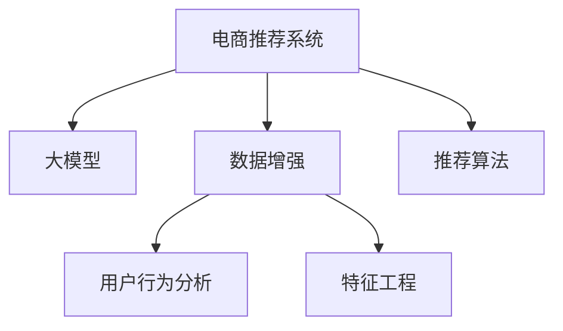

                 

# 电商搜索推荐中的AI大模型数据增强技术应用最佳实践指南

> 关键词：电商搜索推荐, 大模型, 数据增强, 用户行为分析, 特征工程, 推荐算法

## 1. 背景介绍

### 1.1 问题由来
在现代电商平台上，个性化推荐系统已成为提升用户体验、增加用户粘性和提高转化率的关键。通过分析用户的历史行为和兴趣，推荐系统可以精准推送商品信息，提升用户的购物体验。然而，传统的推荐系统通常依赖于固定规模的用户行为数据进行训练和测试，难以应对不断变化的市场需求和多样化的用户兴趣。随着人工智能技术的发展，越来越多的电商企业开始采用基于大模型的推荐系统，利用预训练语言模型学习用户和商品之间的复杂语义关系，以更高效的模型、更智能的策略，实现更准确的商品推荐。

### 1.2 问题核心关键点
大模型在电商推荐中的应用，核心在于如何充分利用有限的标注数据，最大化地提取用户行为信息，并在此基础上进行推荐模型的微调。面对数据稀缺、实时性要求高等挑战，大模型的数据增强技术显得尤为重要。数据增强旨在通过构建多样化、高质量的数据集，提升模型对多变场景的适应能力，从而在有限的标注数据条件下，实现高性能的电商推荐。

### 1.3 问题研究意义
研究电商搜索推荐中的大模型数据增强技术，对于提升电商推荐系统的精准度、鲁棒性和可扩展性，具有重要意义：

1. **提升推荐效果**：通过数据增强，推荐模型能够学习到更多样化的用户行为模式，预测更准确的推荐结果。
2. **增强模型泛化能力**：多样化的数据集有助于模型泛化，减少模型在新场景下的过拟合风险。
3. **提高模型实时性**：数据增强可以生成即时的模拟数据，加速模型推理和更新。
4. **降低成本**：数据增强技术可以降低对标注数据的依赖，减少标注成本。
5. **实现跨领域迁移**：利用大模型的跨领域迁移能力，可以在不同的电商场景中快速部署和应用推荐系统。

## 2. 核心概念与联系

### 2.1 核心概念概述

为更好地理解电商推荐中大模型数据增强技术的应用，本节将介绍几个密切相关的核心概念：

- **电商推荐系统**：通过分析用户行为数据，预测用户偏好并推荐商品的系统。
- **大模型**：如GPT、BERT等基于深度学习的预训练语言模型，具备强大的语义理解和生成能力。
- **数据增强**：通过对原始数据进行变换或合成，生成更丰富多样化的训练数据集，提升模型泛化能力。
- **用户行为分析**：通过分析用户在电商平台上的一系列行为（如浏览、点击、购买等），挖掘用户偏好和兴趣，用于推荐模型的训练。
- **特征工程**：选择、构建和优化用于推荐模型的特征，提升模型的解释性和预测能力。
- **推荐算法**：用于模型训练和推理的算法，如协同过滤、内容推荐、混合推荐等。

这些核心概念之间的逻辑关系可以通过以下Mermaid流程图来展示：



这个流程图展示了电商推荐系统构建的核心环节：

1. 电商推荐系统通过大模型获取用户和商品之间的语义关系。
2. 数据增强技术丰富训练数据集，提升模型泛化能力。
3. 用户行为分析从用户行为中挖掘兴趣和偏好，用于模型训练。
4. 特征工程选择、构建和优化特征，提升模型的解释性和预测能力。
5. 推荐算法根据用户行为和商品特征，生成推荐结果。

## 3. 核心算法原理 & 具体操作步骤

### 3.1 算法原理概述

电商推荐中的大模型数据增强技术，主要是指在大模型的预训练语料和用户行为数据的基础上，通过数据增强技术构建更多的模拟数据，增加模型训练数据量，提升模型的泛化能力和预测准确性。这一过程通常包括以下几个关键步骤：

1. **数据预处理**：将原始用户行为数据和商品特征转换为模型可以接受的输入格式。
2. **数据增强策略设计**：选择或设计适合于电商推荐场景的数据增强策略，生成高质量的模拟数据。
3. **模型微调**：利用增强后的数据集，对大模型进行微调，提升模型对电商场景的适应能力。
4. **结果评估**：对微调后的模型进行评估和测试，确保其在真实场景中的表现。

### 3.2 算法步骤详解

**Step 1: 数据预处理**

电商推荐系统常用的数据预处理方法包括：

1. **特征提取**：将用户行为数据和商品特征提取为数值型或向量型特征，供模型处理。例如，将用户的浏览记录转换为表示用户兴趣的向量，将商品描述转换为表示商品特性的向量。
2. **数据标准化**：对数据进行标准化处理，使不同特征在同一尺度上，避免因数据量级差异导致的权重偏差。
3. **缺失值处理**：处理数据中的缺失值，使用均值、中位数或插值法填充缺失值。

**Step 2: 数据增强策略设计**

电商推荐系统中的数据增强策略主要包括以下几种：

1. **标签生成策略**：为原始数据生成新的标签，丰富训练集的多样性。例如，对用户浏览记录生成点击标签，对商品特征生成销售标签。
2. **数据合成策略**：利用生成对抗网络（GAN）、自编码器等生成模型，合成新的用户行为数据和商品特征数据。例如，使用GAN生成新的用户浏览记录和商品描述。
3. **数据变换策略**：对原始数据进行变换，生成新的数据样本。例如，对用户浏览记录进行时间滑动窗口操作，生成不同时间点的浏览记录。

**Step 3: 模型微调**

大模型的微调通常包括以下步骤：

1. **选择模型**：选择合适的预训练大模型，如BERT、GPT等，作为推荐系统的基础。
2. **微调目标**：设计合适的微调目标，例如预测用户对商品的评分或点击概率。
3. **微调过程**：使用增强后的数据集，对大模型进行微调。通常使用小批次、低学习率进行更新，以避免破坏预训练权重。
4. **优化策略**：使用正则化、Dropout、Early Stopping等策略，避免模型过拟合。

**Step 4: 结果评估**

评估推荐模型的性能通常包括以下指标：

1. **精度**：如准确率、召回率、F1分数等，用于评估模型预测的正确性。
2. **多样性**：如多样性指数、互信息等，用于评估推荐结果的多样性。
3. **新颖性**：如新颖性得分、隐向量化等，用于评估推荐结果的新颖性。

### 3.3 算法优缺点

大模型在电商推荐中的应用，数据增强技术具有以下优点：

1. **提升泛化能力**：通过丰富训练数据集，提升模型对多变场景的适应能力，减少在新场景下的过拟合风险。
2. **降低标注成本**：利用数据增强技术，可以在有限的标注数据条件下，生成高质量的训练数据，减少标注成本。
3. **增强实时性**：通过数据生成技术，可以快速生成新的模拟数据，加速模型推理和更新。
4. **提高多样性**：利用数据增强策略，可以生成多样化的用户行为数据，提升推荐结果的多样性和准确性。

同时，数据增强技术也存在一定的局限性：

1. **数据质量依赖**：数据增强的效果高度依赖于原始数据的质量，低质量的数据可能无法生成高质量的增强数据。
2. **生成数据不真实**：利用生成模型生成的数据可能存在一定的偏差，无法完全模拟真实场景。
3. **算法复杂度高**：数据增强策略设计复杂，需要根据具体场景进行优化，存在一定的算法复杂度。

尽管存在这些局限性，但数据增强技术在电商推荐中的应用，仍为模型性能的提升提供了重要手段。

### 3.4 算法应用领域

基于大模型的电商推荐系统，数据增强技术可以应用于以下多个领域：

1. **个性化推荐**：利用数据增强技术，提升推荐模型对用户行为的理解，生成个性化的商品推荐。
2. **新商品推荐**：通过生成新的商品特征数据，对新商品进行预测和推荐。
3. **跨领域推荐**：利用数据增强技术，对不同领域的用户行为数据进行建模，实现跨领域推荐。
4. **实时推荐**：通过数据生成技术，实时生成推荐结果，提升用户体验。
5. **推荐算法优化**：利用增强后的数据集，优化推荐算法的参数，提升推荐效果。

## 4. 数学模型和公式 & 详细讲解 & 举例说明

### 4.1 数学模型构建

电商推荐系统中的大模型通常基于预训练语言模型，如BERT、GPT等，在电商推荐场景下进行微调。假设模型为 $M_{\theta}(x)$，其中 $x$ 为输入的用户行为数据和商品特征数据，$\theta$ 为模型参数。微调的目标函数为：

$$
\mathcal{L}(\theta) = \sum_{i=1}^{N} \ell_i(M_{\theta}(x_i), y_i)
$$

其中 $N$ 为数据集大小，$\ell_i$ 为每个样本的损失函数，$y_i$ 为样本的实际标签。

### 4.2 公式推导过程

电商推荐系统中的推荐算法，如协同过滤、内容推荐等，通常需要预测用户对商品的评分或点击概率。以协同过滤算法为例，假设用户对商品 $i$ 的评分向量为 $\mathbf{r}_i$，商品 $i$ 的评分向量为 $\mathbf{s}_i$，则用户 $u$ 对商品 $i$ 的评分可以表示为：

$$
\hat{r}_{ui} = \mathbf{r}_u^T \mathbf{s}_i
$$

其中 $\mathbf{r}_u$ 为用户 $u$ 的评分向量，$\mathbf{s}_i$ 为商品 $i$ 的评分向量。

在微调过程中，可以通过数据增强技术丰富训练数据集。例如，假设原始数据集为 $D_0$，增强后的数据集为 $D_1$，则微调过程可以表示为：

$$
\hat{\theta} = \mathop{\arg\min}_{\theta} \mathcal{L}(M_{\theta}(D_1), D_1)
$$

其中 $\mathcal{L}$ 为微调损失函数，$D_1$ 为增强后的数据集。

### 4.3 案例分析与讲解

以商品推荐为例，假设原始数据集 $D_0$ 包含用户对商品 $i$ 的评分 $r_{ui}$，商品 $i$ 的评分 $s_i$，原始评分向量为 $\mathbf{r}_u$ 和 $\mathbf{s}_i$。为了提升模型的泛化能力，可以通过生成新的评分数据 $D_1$，并对其进行微调。假设使用数据增强策略生成的新评分数据为 $D_1'$，则微调过程可以表示为：

$$
\hat{\theta} = \mathop{\arg\min}_{\theta} \mathcal{L}(M_{\theta}(D_1'), D_1')
$$

在微调过程中，可以采用以下策略提升数据增强效果：

1. **标签生成**：为原始数据生成新的标签，丰富训练集的多样性。例如，对用户浏览记录生成点击标签，对商品特征生成销售标签。
2. **数据合成**：利用生成对抗网络（GAN）、自编码器等生成模型，合成新的用户行为数据和商品特征数据。例如，使用GAN生成新的用户浏览记录和商品描述。
3. **数据变换**：对原始数据进行变换，生成新的数据样本。例如，对用户浏览记录进行时间滑动窗口操作，生成不同时间点的浏览记录。

## 5. 项目实践：代码实例和详细解释说明

### 5.1 开发环境搭建

在进行电商推荐系统的大模型微调实践前，我们需要准备好开发环境。以下是使用Python进行PyTorch开发的环境配置流程：

1. 安装Anaconda：从官网下载并安装Anaconda，用于创建独立的Python环境。

2. 创建并激活虚拟环境：
```bash
conda create -n ecomm-env python=3.8 
conda activate ecomm-env
```

3. 安装PyTorch：根据CUDA版本，从官网获取对应的安装命令。例如：
```bash
conda install pytorch torchvision torchaudio cudatoolkit=11.1 -c pytorch -c conda-forge
```

4. 安装Transformers库：
```bash
pip install transformers
```

5. 安装各类工具包：
```bash
pip install numpy pandas scikit-learn matplotlib tqdm jupyter notebook ipython
```

完成上述步骤后，即可在`ecomm-env`环境中开始电商推荐系统的开发和实践。

### 5.2 源代码详细实现

下面我们以协同过滤推荐系统为例，给出使用Transformers库对BERT模型进行电商推荐微调的PyTorch代码实现。

首先，定义协同过滤推荐系统的数据处理函数：

```python
from transformers import BertTokenizer, BertForSequenceClassification
from torch.utils.data import Dataset
import torch

class EcommDataset(Dataset):
    def __init__(self, texts, labels, tokenizer, max_len=128):
        self.texts = texts
        self.labels = labels
        self.tokenizer = tokenizer
        self.max_len = max_len
        
    def __len__(self):
        return len(self.texts)
    
    def __getitem__(self, item):
        text = self.texts[item]
        label = self.labels[item]
        
        encoding = self.tokenizer(text, return_tensors='pt', max_length=self.max_len, padding='max_length', truncation=True)
        input_ids = encoding['input_ids'][0]
        attention_mask = encoding['attention_mask'][0]
        
        # 将标签转换为独热编码形式
        label = torch.tensor(label, dtype=torch.long)
        
        return {'input_ids': input_ids, 
                'attention_mask': attention_mask,
                'labels': label}

# 定义标签与数字id的映射
label2id = {0: 'neg', 1: 'pos'}
id2label = {v: k for k, v in label2id.items()}

# 创建dataset
tokenizer = BertTokenizer.from_pretrained('bert-base-cased')

train_dataset = EcommDataset(train_texts, train_labels, tokenizer)
dev_dataset = EcommDataset(dev_texts, dev_labels, tokenizer)
test_dataset = EcommDataset(test_texts, test_labels, tokenizer)
```

然后，定义模型和优化器：

```python
from transformers import AdamW

model = BertForSequenceClassification.from_pretrained('bert-base-cased', num_labels=len(label2id))

optimizer = AdamW(model.parameters(), lr=2e-5)
```

接着，定义训练和评估函数：

```python
from torch.utils.data import DataLoader
from tqdm import tqdm
from sklearn.metrics import accuracy_score, precision_recall_fscore_support

device = torch.device('cuda') if torch.cuda.is_available() else torch.device('cpu')
model.to(device)

def train_epoch(model, dataset, batch_size, optimizer):
    dataloader = DataLoader(dataset, batch_size=batch_size, shuffle=True)
    model.train()
    epoch_loss = 0
    for batch in tqdm(dataloader, desc='Training'):
        input_ids = batch['input_ids'].to(device)
        attention_mask = batch['attention_mask'].to(device)
        labels = batch['labels'].to(device)
        model.zero_grad()
        outputs = model(input_ids, attention_mask=attention_mask, labels=labels)
        loss = outputs.loss
        epoch_loss += loss.item()
        loss.backward()
        optimizer.step()
    return epoch_loss / len(dataloader)

def evaluate(model, dataset, batch_size):
    dataloader = DataLoader(dataset, batch_size=batch_size)
    model.eval()
    preds, labels = [], []
    with torch.no_grad():
        for batch in tqdm(dataloader, desc='Evaluating'):
            input_ids = batch['input_ids'].to(device)
            attention_mask = batch['attention_mask'].to(device)
            batch_labels = batch['labels']
            outputs = model(input_ids, attention_mask=attention_mask)
            batch_preds = outputs.logits.argmax(dim=1).to('cpu').tolist()
            batch_labels = batch_labels.to('cpu').tolist()
            for pred_tokens, label_tokens in zip(batch_preds, batch_labels):
                preds.append(pred_tokens[:len(label_tokens)])
                labels.append(label_tokens)
                
    return accuracy_score(labels, preds)
```

最后，启动训练流程并在测试集上评估：

```python
epochs = 5
batch_size = 16

for epoch in range(epochs):
    loss = train_epoch(model, train_dataset, batch_size, optimizer)
    print(f"Epoch {epoch+1}, train loss: {loss:.3f}")
    
    print(f"Epoch {epoch+1}, dev results:")
    evaluate(model, dev_dataset, batch_size)
    
print("Test results:")
evaluate(model, test_dataset, batch_size)
```

以上就是使用PyTorch对BERT进行电商推荐微调的完整代码实现。可以看到，得益于Transformers库的强大封装，我们可以用相对简洁的代码完成BERT模型的加载和微调。

### 5.3 代码解读与分析

让我们再详细解读一下关键代码的实现细节：

**EcommDataset类**：
- `__init__`方法：初始化文本、标签、分词器等关键组件。
- `__len__`方法：返回数据集的样本数量。
- `__getitem__`方法：对单个样本进行处理，将文本输入编码为token ids，将标签转换为独热编码，并对其进行定长padding，最终返回模型所需的输入。

**label2id和id2label字典**：
- 定义了标签与数字id之间的映射关系，用于将预测结果解码回真实标签。

**训练和评估函数**：
- 使用PyTorch的DataLoader对数据集进行批次化加载，供模型训练和推理使用。
- 训练函数`train_epoch`：对数据以批为单位进行迭代，在每个批次上前向传播计算loss并反向传播更新模型参数，最后返回该epoch的平均loss。
- 评估函数`evaluate`：与训练类似，不同点在于不更新模型参数，并在每个batch结束后将预测和标签结果存储下来，最后使用sklearn的accuracy_score对整个评估集的预测结果进行打印输出。

**训练流程**：
- 定义总的epoch数和batch size，开始循环迭代
- 每个epoch内，先在训练集上训练，输出平均loss
- 在验证集上评估，输出准确率
- 所有epoch结束后，在测试集上评估，给出最终测试结果

可以看到，PyTorch配合Transformers库使得BERT微调的代码实现变得简洁高效。开发者可以将更多精力放在数据处理、模型改进等高层逻辑上，而不必过多关注底层的实现细节。

当然，工业级的系统实现还需考虑更多因素，如模型的保存和部署、超参数的自动搜索、更灵活的任务适配层等。但核心的微调范式基本与此类似。

## 6. 实际应用场景
### 6.1 智能客服系统

基于大语言模型微调的推荐系统，可以广泛应用于智能客服系统的构建。传统客服往往需要配备大量人力，高峰期响应缓慢，且一致性和专业性难以保证。而使用微调后的推荐系统，可以7x24小时不间断服务，快速响应客户咨询，用个性化的商品推荐提升客户满意度。

在技术实现上，可以收集企业内部的历史客服对话记录，将问题和最佳推荐商品构建成监督数据，在此基础上对预训练推荐模型进行微调。微调后的推荐系统能够自动理解用户意图，匹配最合适的商品进行推荐。对于客户提出的新问题，还可以接入检索系统实时搜索相关商品，动态组织生成推荐结果。如此构建的智能客服系统，能大幅提升客户咨询体验和推荐准确性。

### 6.2 个性化推荐系统

当前的推荐系统往往只依赖用户的历史行为数据进行训练和测试，难以应对不断变化的市场需求和多样化的用户兴趣。基于大语言模型微调的推荐系统，可以更好地挖掘用户行为背后的语义信息，从而提供更精准、多样的推荐内容。

在实践中，可以收集用户浏览、点击、购买等行为数据，提取和用户交互的物品标题、描述、标签等文本内容。将文本内容作为模型输入，用户的后续行为（如是否点击、购买等）作为监督信号，在此基础上微调预训练语言模型。微调后的模型能够从文本内容中准确把握用户的兴趣点。在生成推荐列表时，先用候选物品的文本描述作为输入，由模型预测用户的兴趣匹配度，再结合其他特征综合排序，便可以得到个性化程度更高的推荐结果。

### 6.3 未来应用展望

随着大语言模型微调技术的不断发展，基于微调范式将在更多领域得到应用，为传统行业带来变革性影响。

在智慧医疗领域，基于微调的推荐系统可以推荐个性化的医疗方案，辅助医生诊疗，加速新药开发进程。在智能教育领域，微调技术可应用于作业批改、学情分析、知识推荐等方面，因材施教，促进教育公平，提高教学质量。

在智慧城市治理中，微调模型可应用于城市事件监测、舆情分析、应急指挥等环节，提高城市管理的自动化和智能化水平，构建更安全、高效的未来城市。

此外，在企业生产、社会治理、文娱传媒等众多领域，基于大模型微调的人工智能应用也将不断涌现，为经济社会发展注入新的动力。相信随着技术的日益成熟，微调方法将成为人工智能落地应用的重要范式，推动人工智能技术在垂直行业的规模化落地。总之，微调需要开发者根据具体任务，不断迭代和优化模型、数据和算法，方能得到理想的效果。

## 7. 工具和资源推荐
### 7.1 学习资源推荐

为了帮助开发者系统掌握大语言模型微调的理论基础和实践技巧，这里推荐一些优质的学习资源：

1. 《Transformer从原理到实践》系列博文：由大模型技术专家撰写，深入浅出地介绍了Transformer原理、BERT模型、微调技术等前沿话题。

2. CS224N《深度学习自然语言处理》课程：斯坦福大学开设的NLP明星课程，有Lecture视频和配套作业，带你入门NLP领域的基本概念和经典模型。

3. 《Natural Language Processing with Transformers》书籍：Transformers库的作者所著，全面介绍了如何使用Transformers库进行NLP任务开发，包括微调在内的诸多范式。

4. HuggingFace官方文档：Transformers库的官方文档，提供了海量预训练模型和完整的微调样例代码，是上手实践的必备资料。

5. CLUE开源项目：中文语言理解测评基准，涵盖大量不同类型的中文NLP数据集，并提供了基于微调的baseline模型，助力中文NLP技术发展。

通过对这些资源的学习实践，相信你一定能够快速掌握大语言模型微调的精髓，并用于解决实际的NLP问题。
###  7.2 开发工具推荐

高效的开发离不开优秀的工具支持。以下是几款用于大语言模型微调开发的常用工具：

1. PyTorch：基于Python的开源深度学习框架，灵活动态的计算图，适合快速迭代研究。大部分预训练语言模型都有PyTorch版本的实现。

2. TensorFlow：由Google主导开发的开源深度学习框架，生产部署方便，适合大规模工程应用。同样有丰富的预训练语言模型资源。

3. Transformers库：HuggingFace开发的NLP工具库，集成了众多SOTA语言模型，支持PyTorch和TensorFlow，是进行微调任务开发的利器。

4. Weights & Biases：模型训练的实验跟踪工具，可以记录和可视化模型训练过程中的各项指标，方便对比和调优。与主流深度学习框架无缝集成。

5. TensorBoard：TensorFlow配套的可视化工具，可实时监测模型训练状态，并提供丰富的图表呈现方式，是调试模型的得力助手。

6. Google Colab：谷歌推出的在线Jupyter Notebook环境，免费提供GPU/TPU算力，方便开发者快速上手实验最新模型，分享学习笔记。

合理利用这些工具，可以显著提升大语言模型微调任务的开发效率，加快创新迭代的步伐。

### 7.3 相关论文推荐

大语言模型和微调技术的发展源于学界的持续研究。以下是几篇奠基性的相关论文，推荐阅读：

1. Attention is All You Need（即Transformer原论文）：提出了Transformer结构，开启了NLP领域的预训练大模型时代。

2. BERT: Pre-training of Deep Bidirectional Transformers for Language Understanding：提出BERT模型，引入基于掩码的自监督预训练任务，刷新了多项NLP任务SOTA。

3. Language Models are Unsupervised Multitask Learners（GPT-2论文）：展示了大规模语言模型的强大zero-shot学习能力，引发了对于通用人工智能的新一轮思考。

4. Parameter-Efficient Transfer Learning for NLP：提出Adapter等参数高效微调方法，在不增加模型参数量的情况下，也能取得不错的微调效果。

5. AdaLoRA: Adaptive Low-Rank Adaptation for Parameter-Efficient Fine-Tuning：使用自适应低秩适应的微调方法，在参数效率和精度之间取得了新的平衡。

这些论文代表了大语言模型微调技术的发展脉络。通过学习这些前沿成果，可以帮助研究者把握学科前进方向，激发更多的创新灵感。

## 8. 总结：未来发展趋势与挑战

### 8.1 总结

本文对基于大模型的电商搜索推荐系统中的数据增强技术进行了全面系统的介绍。首先阐述了电商推荐系统和大语言模型微调的背景，明确了微调在提升推荐系统性能方面的独特价值。其次，从原理到实践，详细讲解了电商推荐系统中的大模型微调方法，给出了微调任务开发的完整代码实例。同时，本文还探讨了微调技术在智能客服、个性化推荐等多个领域的实际应用，展示了微调范式的巨大潜力。最后，本文精选了微调技术的各类学习资源，力求为读者提供全方位的技术指引。

通过本文的系统梳理，可以看到，基于大模型的电商推荐系统中的数据增强技术，在提升推荐效果、增强模型泛化能力、降低标注成本等方面，具有显著的优势。未来，伴随大模型技术的不断发展，基于数据增强的电商推荐系统必将发挥更大的作用，推动电商行业数字化转型的进程。

### 8.2 未来发展趋势

展望未来，电商推荐系统中的大模型数据增强技术将呈现以下几个发展趋势：

1. **模型规模持续增大**：随着算力成本的下降和数据规模的扩张，预训练语言模型的参数量还将持续增长。超大规模语言模型蕴含的丰富语言知识，有望支撑更加复杂多变的电商推荐场景。

2. **数据增强策略多样化**：未来的数据增强技术将更加多样化，除了标签生成、数据合成等策略外，将更多地引入迁移学习、自监督学习等方法，提升数据增强的效果。

3. **实时性增强**：随着模型的推理优化和硬件的发展，电商推荐系统中的数据增强技术将进一步提高实时性，支持即时的推荐生成和更新。

4. **跨领域迁移能力提升**：利用大模型的跨领域迁移能力，可以在不同电商场景中快速部署和应用推荐系统，提升电商推荐系统的适应性和泛化能力。

5. **用户行为数据的多样化**：未来的电商推荐系统将更加关注用户的多样化行为数据，通过丰富多样的用户行为数据，提升模型的预测准确性和个性化推荐能力。

6. **推荐算法的智能化**：未来的推荐算法将更加智能化，结合大模型的语言理解和生成能力，引入更多AI算法和技术，提升推荐系统的智能化水平。

以上趋势凸显了电商推荐系统中的大模型数据增强技术的广阔前景。这些方向的探索发展，必将进一步提升电商推荐系统的性能和用户体验，推动电商行业的持续发展。

### 8.3 面临的挑战

尽管电商推荐系统中的大模型数据增强技术已经取得了显著的进步，但在迈向更加智能化、普适化应用的过程中，它仍面临着诸多挑战：

1. **标注成本高昂**：电商推荐系统需要大量的标注数据进行微调，但标注数据的获取成本较高，尤其是在新电商场景中。如何降低标注成本，成为亟待解决的问题。

2. **数据质量问题**：电商推荐系统中的数据标注往往存在质量问题，标注数据的不一致和不准确会影响模型的性能。如何提升数据标注的质量，是未来需要关注的重点。

3. **模型鲁棒性不足**：电商推荐系统中的数据增强技术面对多变场景时，泛化性能可能不足。如何提高模型的鲁棒性，减少在新场景下的性能下降，是未来的研究方向。

4. **计算资源需求高**：电商推荐系统中的数据增强技术需要大规模的计算资源进行模型训练和推理，如何降低计算资源的消耗，提高算法的效率，是未来需要解决的问题。

5. **可解释性不足**：电商推荐系统中的大模型微调过程较为复杂，模型的输出往往缺乏可解释性，难以理解模型的决策逻辑。如何增强模型的可解释性，是未来的重要研究方向。

6. **安全性问题**：电商推荐系统中的大模型可能存在数据泄露和滥用风险，如何保障用户数据安全，防止数据滥用，是未来的重要任务。

正视这些挑战，积极应对并寻求突破，将是大模型数据增强技术在未来发展中必须解决的问题。相信随着学界和产业界的共同努力，这些挑战终将一一被克服，大模型数据增强技术必将在电商推荐系统中发挥更大的作用。

### 8.4 研究展望

面对大模型数据增强技术面临的种种挑战，未来的研究需要在以下几个方面寻求新的突破：

1. **无监督和半监督学习方法的探索**：摆脱对大规模标注数据的依赖，利用无监督和半监督学习方法，最大化地利用电商推荐系统中的非结构化数据，实现更加灵活高效的微调。

2. **参数高效和计算高效的微调方法**：开发更加参数高效和计算高效的微调方法，在固定大部分预训练参数的情况下，只更新极少量的任务相关参数。

3. **因果分析和博弈论工具的引入**：将因果分析和博弈论工具引入电商推荐系统中的数据增强技术，增强模型的稳定性和因果推理能力。

4. **知识表示与融合**：结合电商推荐系统中的商品标签和用户行为数据，引入符号化的先验知识，增强模型的跨领域迁移能力。

5. **模型安全性和可解释性的提升**：在模型训练目标中引入伦理导向的评估指标，过滤和惩罚有偏见、有害的输出倾向，增强模型的可解释性和安全性。

这些研究方向的探索，必将引领大模型数据增强技术迈向更高的台阶，为构建安全、可靠、可解释、可控的电商推荐系统提供新的思路和方法。面向未来，大模型数据增强技术还需要与其他人工智能技术进行更深入的融合，如知识表示、因果推理、强化学习等，多路径协同发力，共同推动电商推荐系统的进步。只有勇于创新、敢于突破，才能不断拓展语言模型的边界，让智能技术更好地造福电商行业。

## 9. 附录：常见问题与解答

**Q1：电商推荐系统中的数据增强技术是否适用于所有推荐任务？**

A: 数据增强技术在电商推荐系统中的应用具有较强的普适性，能够提升推荐模型的泛化能力和预测准确性。然而，对于一些特定类型的推荐任务，如视频推荐、新闻推荐等，可能需要根据具体情况进行调整和优化。例如，视频推荐系统可能需要考虑视频的时长、帧率等因素，而新闻推荐系统可能需要引入更多的上下文信息。

**Q2：数据增强技术的最佳实践有哪些？**

A: 电商推荐系统中的数据增强技术，以下是一些最佳实践：

1. **标签生成策略**：为原始数据生成新的标签，丰富训练集的多样性。例如，对用户浏览记录生成点击标签，对商品特征生成销售标签。

2. **数据合成策略**：利用生成对抗网络（GAN）、自编码器等生成模型，合成新的用户行为数据和商品特征数据。例如，使用GAN生成新的用户浏览记录和商品描述。

3. **数据变换策略**：对原始数据进行变换，生成新的数据样本。例如，对用户浏览记录进行时间滑动窗口操作，生成不同时间点的浏览记录。

4. **迁移学习策略**：利用大模型的跨领域迁移能力，在不同电商场景中快速部署和应用推荐系统。

5. **半监督学习策略**：利用电商推荐系统中的非结构化数据进行半监督学习，提升模型泛化能力。

这些策略可以结合使用，以最大化地提升电商推荐系统中的大模型微调效果。

**Q3：电商推荐系统中的数据增强技术如何影响模型的泛化能力？**

A: 电商推荐系统中的数据增强技术通过丰富训练数据集，提升模型的泛化能力。具体来说，数据增强技术可以通过以下方式提升模型的泛化能力：

1. **数据多样性提升**：数据增强技术可以生成更多的训练样本，增加数据集的多样性，提升模型对不同场景的适应能力。

2. **对抗样本生成**：通过生成对抗样本，增强模型对噪声和异常数据的鲁棒性，提升模型的泛化能力。

3. **多视角数据融合**：数据增强技术可以通过引入多视角的数据，帮助模型更全面地理解用户行为和商品特性，提升模型的泛化能力。

4. **模型复杂度降低**：数据增强技术可以通过减少模型参数量，降低模型的复杂度，提升模型的泛化能力。

总之，数据增强技术通过提升数据多样性和模型鲁棒性，可以有效提升电商推荐系统中的大模型微调效果，提高模型的泛化能力。

**Q4：电商推荐系统中的数据增强技术有哪些注意事项？**

A: 电商推荐系统中的数据增强技术虽然可以显著提升模型的泛化能力，但在使用过程中也需要注意一些事项：

1. **数据质量问题**：数据增强技术的效果高度依赖于原始数据的质量，低质量的数据可能无法生成高质量的增强数据，因此需要保证原始数据的准确性和一致性。

2. **生成数据不真实**：利用生成模型生成的数据可能存在一定的偏差，无法完全模拟真实场景，因此需要评估生成数据的真实性和有效性。

3. **算法复杂度高**：数据增强策略设计复杂，需要根据具体场景进行优化，存在一定的算法复杂度，因此需要合理选择和组合数据增强策略。

4. **模型鲁棒性不足**：数据增强技术面对多变场景时，泛化性能可能不足，因此需要评估模型的鲁棒性，并采取相应的优化措施。

5. **计算资源需求高**：电商推荐系统中的数据增强技术需要大规模的计算资源进行模型训练和推理，因此需要评估计算资源需求，并采取相应的优化措施。

这些注意事项需要在具体应用中加以考虑，以保证数据增强技术在电商推荐系统中的效果。

---

作者：禅与计算机程序设计艺术 / Zen and the Art of Computer Programming

