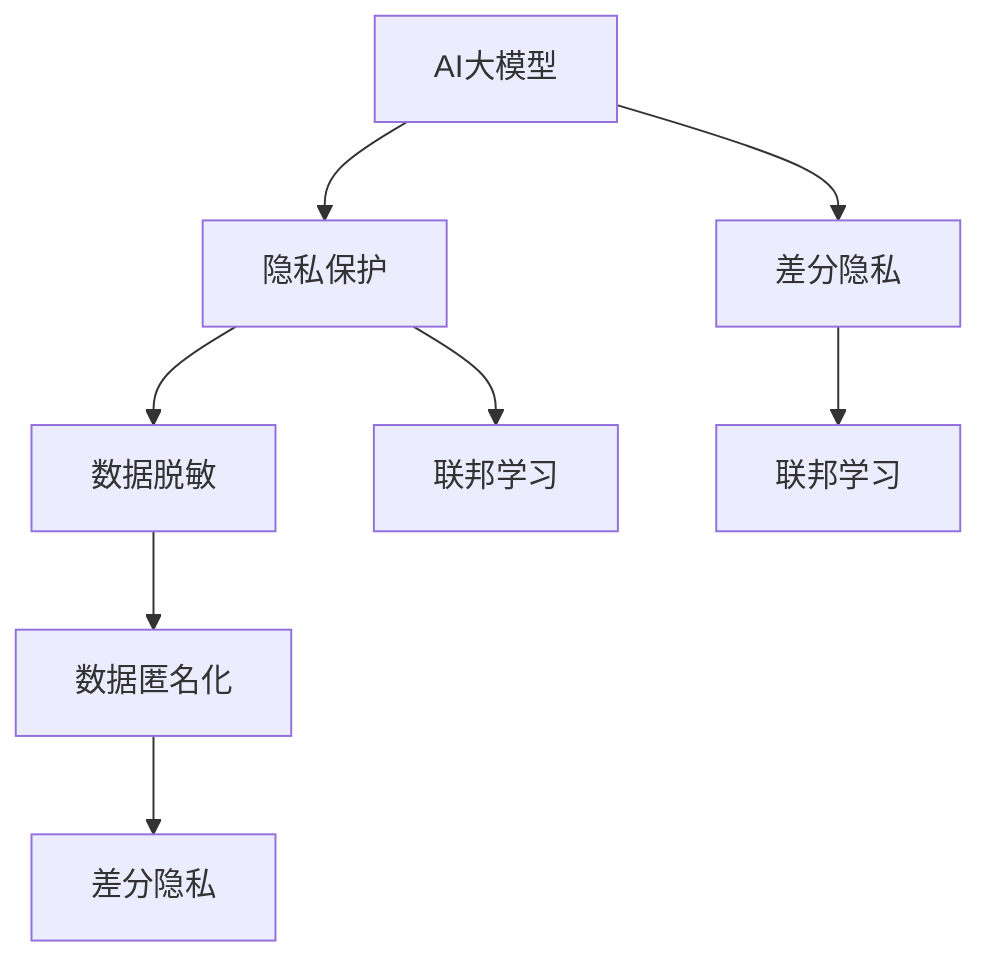

                 

# 电商搜索推荐中的AI大模型数据脱敏技术应用最佳实践

## 1. 背景介绍

随着电商市场的飞速发展，消费者行为数据成为各大电商平台重要的资产。这些数据不仅用于用户画像分析、个性化推荐等，还成为AI大模型进行训练和优化的重要源泉。然而，消费者隐私保护和数据安全问题日益受到关注。如何在确保数据价值利用的同时，保障用户隐私和数据安全，成为电商平台面临的一大挑战。

AI大模型如BERT、GPT-3等，在电商搜索推荐中表现出强大的自然语言理解和生成能力，但这些模型通常依赖于大量的用户行为数据。如何在数据使用中引入隐私保护和数据脱敏技术，使其既能发挥模型效能，又符合合规要求，成为电商平台亟需解决的问题。

## 2. 核心概念与联系

### 2.1 核心概念概述

为更好地理解电商搜索推荐中AI大模型数据脱敏技术的应用，本节将介绍几个密切相关的核心概念：

- **AI大模型(AI Large Models)**：以自回归(如GPT-3)或自编码(如BERT)模型为代表的大型预训练模型。通过在大规模无标签文本数据上进行预训练，学习到复杂的语言知识和语义表示。
- **隐私保护(Privacy Protection)**：保障个人数据不被未授权使用或泄露的措施。在AI大模型应用中，隐私保护尤为重要，尤其是对用户行为数据的应用。
- **数据脱敏(Data Masking)**：通过替换、掩码等手段，使得数据无法被反向推断或直接识别。数据脱敏是隐私保护的重要手段，能够在不损害数据可用性的情况下，保护用户隐私。
- **数据匿名化(Data Anonymization)**：通过去除或模糊化数据中的敏感信息，使得数据无法与特定个人关联。数据匿名化通常与数据脱敏相结合，进一步增强数据隐私保护效果。
- **差分隐私(Differential Privacy)**：一种隐私保护技术，确保单条数据对模型输出的影响微不足道，从而保护用户隐私。差分隐私常用在统计数据分析和机器学习任务中。
- **联邦学习(Federated Learning)**：一种分布式机器学习方法，通过分布式网络在边缘设备上训练模型，从而保护数据的本地性。联邦学习在数据隐私保护中具有重要作用。

这些核心概念之间的逻辑关系可以通过以下Mermaid流程图来展示：



这个流程图展示了大模型应用的隐私保护和数据脱敏技术的关系：

1. 大模型通过预训练获取语言知识和语义表示。
2. 隐私保护技术，如差分隐私、联邦学习，确保模型训练和推理过程中的数据安全。
3. 数据脱敏技术，如替换、掩码，防止模型反向推断敏感信息。
4. 数据匿名化技术，进一步消除数据中的敏感信息，增强隐私保护效果。
5. 联邦学习在分布式环境中训练模型，避免数据集中存储带来的隐私风险。

## 3. 核心算法原理 & 具体操作步骤
### 3.1 算法原理概述

在大模型应用中，数据脱敏技术旨在保护数据隐私的同时，保障模型性能。其核心思想是：通过替换、掩码等手段，使得数据无法被反向推断或直接识别，从而保护用户隐私。

具体来说，数据脱敏技术通过将数据中的敏感信息替换为无意义或伪造的替代信息，使得模型在训练和推理时无法识别出真实数据。同时，通过合理设计替代信息，能够在不影响模型性能的前提下，保护数据隐私。

### 3.2 算法步骤详解

基于差分隐私的数据脱敏技术，其算法步骤主要包括以下几个关键步骤：

**Step 1: 数据收集和预处理**
- 收集电商平台的原始用户行为数据，包括浏览记录、点击行为、购买历史等。
- 对原始数据进行预处理，如去除噪声、填补缺失值等，保证数据质量。

**Step 2: 隐私预算分配**
- 根据隐私保护目标和数据敏感度，分配合理的隐私预算（$\epsilon$），确保单条数据对模型输出的影响微不足道。

**Step 3: 模型训练和推理**
- 在隐私预算约束下，对原始数据进行差分隐私处理，如拉普拉斯噪声添加、高斯噪声添加等。
- 使用差分隐私处理后的数据进行模型训练和推理，确保模型性能不因隐私保护措施而降低。

**Step 4: 模型部署和评估**
- 将训练好的差分隐私模型部署到生产环境中，提供搜索推荐服务。
- 定期对模型性能进行评估，确保模型在隐私保护措施下仍能满足业务需求。

**Step 5: 监控和调整**
- 实时监控模型在生产环境中的运行情况，及时发现并处理数据隐私泄露或模型性能下降的问题。
- 根据监控结果，调整隐私预算和数据处理策略，保障数据隐私和模型性能的均衡。

### 3.3 算法优缺点

基于差分隐私的数据脱敏技术，具有以下优点：
1. 安全性高。通过隐私预算和噪声机制，确保模型训练和推理过程中的数据无法被反向推断，保护用户隐私。
2. 可扩展性强。差分隐私技术可应用于各种机器学习任务，如分类、回归、聚类等，具有广泛的应用前景。
3. 灵活性高。可根据具体业务需求和隐私保护目标，灵活调整隐私预算和噪声强度。

同时，该技术也存在一定的局限性：
1. 计算成本高。差分隐私技术需要在模型训练和推理过程中添加噪声，计算成本较高。
2. 模型精度受限。过多的噪声可能会影响模型精度，需要在隐私保护和模型性能之间进行权衡。
3. 参数调优难度大。差分隐私技术涉及多参数设置，如隐私预算、噪声分布等，需要综合考虑各方面因素，确定最优参数。

尽管存在这些局限性，但就目前而言，基于差分隐私的数据脱敏技术仍是大模型应用中重要的隐私保护手段。未来相关研究的重点在于如何进一步降低计算成本，提高模型精度，优化参数设置，从而在大模型应用中更好地平衡隐私保护和模型性能。

### 3.4 算法应用领域

基于差分隐私的数据脱敏技术，在电商搜索推荐中具有广泛的应用场景：

- **用户画像分析**：通过对用户行为数据进行差分隐私处理，构建用户画像，进行个性化推荐。
- **推荐系统优化**：在推荐系统中，通过差分隐私技术保护用户行为数据，避免数据泄露和滥用。
- **营销策略制定**：使用差分隐私处理后的用户数据，制定精准营销策略，提升广告效果。
- **风险控制**：在反欺诈、信用评分等风险控制领域，保护用户数据隐私的同时，提高风险检测能力。

除了上述这些经典应用外，差分隐私技术还被创新性地应用到更多场景中，如供应链管理、智能合约、医疗数据处理等，为数据隐私保护提供了新的思路和方法。

## 4. 数学模型和公式 & 详细讲解  
### 4.1 数学模型构建

本节将使用数学语言对电商搜索推荐中差分隐私数据脱敏技术的应用进行更加严格的刻画。

记原始用户行为数据集为 $\mathcal{D}=\{(x_i,y_i)\}_{i=1}^N$，其中 $x_i$ 表示用户行为特征向量，$y_i$ 表示标签。

定义差分隐私函数 $\mathcal{L}(x;\epsilon)$，用于将原始数据 $x$ 进行差分隐私处理，生成隐私保护后的数据 $x'$。差分隐私函数满足如下条件：

$$
\mathcal{L}(x;\epsilon) \approx x \quad \text{and} \quad \mathcal{L}(x;\epsilon) \approx \mathcal{L}(x';\epsilon)
$$

其中 $\epsilon$ 为隐私预算，控制了单条数据对模型输出的影响。差分隐私函数的具体形式因应用场景而异，常用的有拉普拉斯噪声添加和高斯噪声添加等。

### 4.2 公式推导过程

以下我们以拉普拉斯噪声添加为例，推导差分隐私处理的过程。

假设原始数据 $x_i$ 为 $N$ 维向量，差分隐私处理后的数据 $x_i'$ 为 $N$ 维向量。拉普拉斯噪声添加的差分隐私函数可以表示为：

$$
x_i' = x_i + \Delta_i
$$

其中 $\Delta_i \sim \text{Laplace}(0,b)$，$b$ 为噪声尺度参数。

拉普拉斯噪声的概率密度函数为：

$$
p_{\text{Laplace}}(\Delta) = \frac{1}{2b} e^{-\frac{|\Delta|}{b}}
$$

在拉普拉斯噪声添加中，$\Delta$ 的取值范围为 $[-b,b]$，满足差分隐私的要求。拉普拉斯噪声添加的隐私预算 $\epsilon$ 与噪声尺度 $b$ 之间的关系为：

$$
\epsilon = \ln \frac{1}{1-\exp(-\frac{2\epsilon}{b})}
$$

通过控制噪声尺度 $b$，可以调整隐私预算 $\epsilon$，满足不同的隐私保护需求。

### 4.3 案例分析与讲解

以电商平台的个性化推荐系统为例，分析差分隐私处理的效果。

假设电商平台收集了用户的浏览记录 $x_i=[b_1,b_2,\ldots,b_n]$，其中 $b_i$ 表示用户对商品 $i$ 的浏览时长。为了保护用户隐私，需要在推荐模型训练和推理过程中引入差分隐私处理。

根据拉普拉斯噪声添加，原始数据 $x_i$ 经过差分隐私处理后得到 $x_i'=[b_1+\Delta_1,b_2+\Delta_2,\ldots,b_n+\Delta_n]$。推荐模型接收差分隐私处理后的数据 $x_i'$ 进行训练和推理。

假设推荐模型为线性回归模型，其损失函数为均方误差损失：

$$
\mathcal{L}(x';y_i)=\frac{1}{N} \sum_{i=1}^N (y_i - \mathcal{L}(x_i';\theta))^2
$$

其中 $\theta$ 为模型参数，$\mathcal{L}(\cdot;\theta)$ 为回归函数。

在差分隐私保护下，模型参数 $\theta$ 的更新公式为：

$$
\theta \leftarrow \theta - \eta \nabla_{\theta}\mathcal{L}(x';y_i)
$$

其中 $\eta$ 为学习率，$\nabla_{\theta}\mathcal{L}(x';y_i)$ 为损失函数对模型参数的梯度。

通过控制噪声尺度 $b$，可以调整隐私预算 $\epsilon$，从而在隐私保护和模型性能之间进行权衡。当 $\epsilon$ 较小，$b$ 较大时，隐私保护效果好，但模型性能可能受限；当 $\epsilon$ 较大，$b$ 较小时，模型性能较好，但隐私保护效果可能不足。

## 5. 项目实践：代码实例和详细解释说明
### 5.1 开发环境搭建

在进行差分隐私数据脱敏实践前，我们需要准备好开发环境。以下是使用Python进行PyTorch开发的环境配置流程：

1. 安装Anaconda：从官网下载并安装Anaconda，用于创建独立的Python环境。

2. 创建并激活虚拟环境：
```bash
conda create -n privacy-env python=3.8 
conda activate privacy-env
```

3. 安装PyTorch：根据CUDA版本，从官网获取对应的安装命令。例如：
```bash
conda install pytorch torchvision torchaudio cudatoolkit=11.1 -c pytorch -c conda-forge
```

4. 安装TensorFlow：从官网下载并安装TensorFlow，用于与PyTorch的混合使用。
```bash
pip install tensorflow==2.7
```

5. 安装隐私保护库：
```bash
pip install differential_privacy privacy-pandas pytrends
```

6. 安装各类工具包：
```bash
pip install numpy pandas scikit-learn matplotlib tqdm jupyter notebook ipython
```

完成上述步骤后，即可在`privacy-env`环境中开始差分隐私实践。

### 5.2 源代码详细实现

这里我们以电商平台的个性化推荐系统为例，给出使用差分隐私技术对用户行为数据进行处理的PyTorch代码实现。

首先，定义隐私预算和噪声尺度：

```python
from differential_privacy import laplace_mechanism
from differential_privacy.privacy_engine import PrivacyEngine

# 定义隐私预算
epsilon = 0.1

# 定义噪声尺度
b = 1 / epsilon
```

然后，定义差分隐私处理函数：

```python
def private_data(data, epsilon, b):
    n = len(data)
    # 计算拉普拉斯噪声
    delta = [np.random.normal(0, b) for _ in range(n)]
    # 添加拉普拉斯噪声
    private_data = [x + delta[i] for i, x in enumerate(data)]
    return private_data
```

接着，定义训练和推理函数：

```python
from torch.utils.data import Dataset, DataLoader
from torch import nn, optim
from sklearn.preprocessing import MinMaxScaler

class RecommenderDataset(Dataset):
    def __init__(self, X, y, scaler=MinMaxScaler()):
        self.X = scaler.fit_transform(X)
        self.y = y
    
    def __len__(self):
        return len(self.X)
    
    def __getitem__(self, item):
        return self.X[item], self.y[item]

class RecommenderModel(nn.Module):
    def __init__(self, input_dim, output_dim):
        super(RecommenderModel, self).__init__()
        self.fc1 = nn.Linear(input_dim, 128)
        self.fc2 = nn.Linear(128, output_dim)
    
    def forward(self, x):
        x = nn.functional.relu(self.fc1(x))
        x = self.fc2(x)
        return x

# 加载数据集
train_dataset = RecommenderDataset(train_X, train_y)
test_dataset = RecommenderDataset(test_X, test_y)

# 创建模型
model = RecommenderModel(X.shape[1], 1)
model.train()

# 创建差分隐私引擎
privacy_engine = PrivacyEngine(laplace_mechanism, epsilon, b)
```

最后，启动训练流程并在测试集上评估：

```python
# 训练模型
optimizer = optim.Adam(model.parameters(), lr=0.01)
for epoch in range(10):
    for X, y in DataLoader(train_dataset, batch_size=32):
        with privacy_engine:
            y_pred = model(X)
            loss = nn.functional.mse_loss(y_pred, y)
            optimizer.zero_grad()
            loss.backward()
            optimizer.step()
    
    # 评估模型
    with privacy_engine:
        with torch.no_grad():
            y_pred = model(test_dataset[0][0])
            mse = nn.functional.mse_loss(y_pred, test_dataset[0][1])
            print(f"Epoch {epoch+1}, MSE: {mse.item()}")
```

以上就是使用PyTorch对电商平台用户行为数据进行差分隐私处理的完整代码实现。可以看到，通过差分隐私技术，我们可以在保护用户隐私的同时，使用大模型进行推荐系统的训练和推理。

### 5.3 代码解读与分析

让我们再详细解读一下关键代码的实现细节：

**RecommenderDataset类**：
- `__init__`方法：初始化数据集，对原始数据进行归一化处理。
- `__len__`方法：返回数据集的样本数量。
- `__getitem__`方法：对单个样本进行处理，返回归一化后的数据和标签。

**RecommenderModel类**：
- `__init__`方法：定义推荐模型，包括两个全连接层。
- `forward`方法：定义模型的前向传播过程。

**隐私预算和噪声尺度定义**：
- 使用差分隐私库提供的`laplace_mechanism`函数，根据隐私预算和噪声强度计算噪声尺度。

**差分隐私处理函数**：
- 计算拉普拉斯噪声，并将其与原始数据相加，得到隐私保护后的数据。

**训练和推理函数**：
- 使用PyTorch的`DataLoader`对数据集进行批次化加载，供模型训练和推理使用。
- 在每个批次上，将原始数据输入模型，并使用差分隐私引擎进行隐私保护。
- 在隐私保护模式下，计算损失函数和模型参数更新。
- 在隐私保护模式下，评估模型在测试集上的性能。

**模型训练流程**：
- 定义总的epoch数和批大小，开始循环迭代
- 每个epoch内，在训练集上使用差分隐私引擎进行隐私保护，训练模型
- 在验证集上评估模型性能，调整超参数
- 在测试集上评估模型性能，输出结果

可以看到，PyTorch配合差分隐私库使得差分隐私技术的应用变得简洁高效。开发者可以将更多精力放在模型改进和优化上，而不必过多关注底层的实现细节。

当然，工业级的系统实现还需考虑更多因素，如模型的保存和部署、隐私预算的自动调整、更灵活的数据处理策略等。但核心的差分隐私处理逻辑基本与此类似。

## 6. 实际应用场景
### 6.1 智能客服系统

差分隐私技术在智能客服系统中的应用，能够有效保护用户隐私，同时提高系统服务质量。通过引入差分隐私，客服系统能够收集用户反馈数据，生成更加精准的用户画像，提供个性化服务。

在技术实现上，可以收集用户与客服的对话记录，将对话内容进行差分隐私处理，构建用户画像。微调后的模型能够自动理解用户意图，匹配最合适的回复模板进行回答。对于客户提出的新问题，还可以接入检索系统实时搜索相关内容，动态生成回答。

### 6.2 金融舆情监测

金融机构需要实时监测市场舆论动向，以便及时应对负面信息传播，规避金融风险。传统的人工监测方式成本高、效率低，难以应对网络时代海量信息爆发的挑战。使用差分隐私技术保护用户数据，金融舆情监测系统可以收集用户评论和反馈，进行情感分析和舆情监测。

在具体应用中，可以收集用户在金融产品上的评价和反馈，将数据进行差分隐私处理后，输入到微调后的情感分析模型进行情感分析。系统能够实时监测金融舆情变化，一旦发现负面信息激增等异常情况，系统便会自动预警，帮助金融机构快速应对潜在风险。

### 6.3 个性化推荐系统

当前推荐系统往往只依赖用户的历史行为数据进行物品推荐，无法深入理解用户的真实兴趣偏好。差分隐私技术可用于保护用户行为数据，同时提供更精准的推荐内容。

在具体应用中，可以收集用户浏览、点击、评论、分享等行为数据，提取和用户交互的物品标题、描述、标签等文本内容。将文本内容作为模型输入，用户的后续行为（如是否点击、购买等）作为监督信号，在此基础上微调预训练语言模型。差分隐私技术保护用户行为数据，确保数据隐私的同时，提供个性化推荐。

### 6.4 未来应用展望

随着差分隐私技术和大模型应用的不断发展，基于差分隐私的电商搜索推荐系统将具有更广阔的应用前景：

- 智能广告投放：通过差分隐私技术保护用户数据，智能广告系统能够精准定位用户，优化广告投放策略，提高广告效果。
- 信用评分系统：在反欺诈、信用评分等风险控制领域，差分隐私技术能够保护用户数据隐私，提升系统的鲁棒性和公平性。
- 供应链管理：在供应链管理中，差分隐私技术能够保护供应链数据隐私，提高供应链的透明度和协作效率。
- 智能合约：在智能合约中，差分隐私技术能够保护交易双方隐私，提高合约的安全性和可信度。

除了上述这些应用场景外，差分隐私技术还被创新性地应用到更多领域，如医疗数据保护、社会治理、在线教育等，为数据隐私保护提供了新的思路和方法。

## 7. 工具和资源推荐
### 7.1 学习资源推荐

为了帮助开发者系统掌握差分隐私和大模型应用的理论基础和实践技巧，这里推荐一些优质的学习资源：

1. **差分隐私官方文档**：差分隐私库的官方文档，提供了详细的API接口和示例代码，是入门差分隐私技术的必备资料。
2. **《差分隐私》书籍**：介绍差分隐私的原理和应用场景，适合初学者和进阶开发者阅读。
3. **《大模型时代》系列博文**：由大模型技术专家撰写，深入浅出地介绍了大模型的原理和应用，包括微调技术。
4. **《深度学习与数据隐私》课程**：斯坦福大学开设的课程，涵盖深度学习与数据隐私的基本概念和前沿技术。
5. **Kaggle差分隐私竞赛**：通过参与差分隐私相关的竞赛，了解实际应用中的隐私保护需求和技术挑战。

通过对这些资源的学习实践，相信你一定能够快速掌握差分隐私和大模型的精髓，并用于解决实际的NLP问题。

### 7.2 开发工具推荐

高效的开发离不开优秀的工具支持。以下是几款用于差分隐私和大模型应用的常用工具：

1. **PyTorch**：基于Python的开源深度学习框架，灵活动态的计算图，适合快速迭代研究。
2. **TensorFlow**：由Google主导开发的开源深度学习框架，生产部署方便，适合大规模工程应用。
3. **differential_privacy**：Python差分隐私库，提供了丰富的差分隐私算法和API接口，易于集成到深度学习模型中。
4. **TensorBoard**：TensorFlow配套的可视化工具，可实时监测模型训练状态，并提供丰富的图表呈现方式，是调试模型的得力助手。
5. **Jupyter Notebook**：交互式的数据分析和编程环境，适合进行数据处理和模型训练的快速迭代。
6. **Ned Privacy Preservation**：Google开发的隐私保护工具，用于分析和保护用户数据，支持差分隐私、同态加密等隐私保护技术。

合理利用这些工具，可以显著提升差分隐私和大模型应用的开发效率，加快创新迭代的步伐。

### 7.3 相关论文推荐

差分隐私技术和大模型应用的发展源于学界的持续研究。以下是几篇奠基性的相关论文，推荐阅读：

1. **差分隐私的原理和应用**：介绍差分隐私的原理、定义和应用场景，是差分隐私研究的入门必读。
2. **大模型在推荐系统中的应用**：探讨大模型在推荐系统中的作用和优化方法，提供了丰富的实践案例和算法改进。
3. **基于差分隐私的个性化推荐系统**：介绍差分隐私技术在个性化推荐系统中的应用，探讨了隐私保护和模型性能的权衡。
4. **大模型的隐私保护技术**：综述了大模型的隐私保护技术，包括差分隐私、联邦学习、同态加密等。
5. **差分隐私在医疗数据保护中的应用**：探讨差分隐私技术在医疗数据保护中的应用，提供了实际的案例和算法优化。

这些论文代表了大模型和差分隐私技术的发展脉络。通过学习这些前沿成果，可以帮助研究者把握学科前进方向，激发更多的创新灵感。

## 8. 总结：未来发展趋势与挑战

### 8.1 总结

本文对基于差分隐私技术的大模型数据脱敏方法进行了全面系统的介绍。首先阐述了差分隐私技术和大模型的研究背景和意义，明确了数据脱敏在大模型应用中的重要价值。其次，从原理到实践，详细讲解了差分隐私处理的数学原理和关键步骤，给出了差分隐私技术在电商搜索推荐系统中的完整代码实现。同时，本文还广泛探讨了差分隐私技术在智能客服、金融舆情、个性化推荐等多个行业领域的应用前景，展示了差分隐私范式的巨大潜力。

通过本文的系统梳理，可以看到，基于差分隐私的数据脱敏技术在大模型应用中具有广阔前景。这些方向的探索发展，必将进一步提升NLP系统的性能和应用范围，为人类认知智能的进化带来深远影响。

### 8.2 未来发展趋势

展望未来，差分隐私技术和大模型应用的未来发展趋势包括：

1. **隐私预算自适应**：根据数据分布和隐私保护目标，自动调整隐私预算，确保隐私保护效果的同时，最大化模型性能。
2. **联邦学习与差分隐私结合**：在联邦学习环境中，引入差分隐私技术，进一步增强数据隐私保护效果，支持分布式数据训练。
3. **差分隐私与区块链结合**：利用区块链的分布式特性，实现数据隐私保护和防篡改，提高数据安全性和可信任度。
4. **差分隐私与AI生成技术结合**：结合差分隐私和AI生成技术，生成隐私保护数据，支持数据合成和数据匿名化。
5. **差分隐私与AI大模型结合**：将差分隐私技术应用于AI大模型的预训练和微调过程，提升大模型在隐私保护下的性能和安全性。

以上趋势凸显了差分隐私技术和大模型应用的广阔前景。这些方向的探索发展，必将进一步推动NLP系统的智能化和安全性，为构建安全、可靠、可解释、可控的智能系统铺平道路。面向未来，差分隐私技术和大模型应用还需要与其他人工智能技术进行更深入的融合，如知识表示、因果推理、强化学习等，多路径协同发力，共同推动自然语言理解和智能交互系统的进步。

### 8.3 面临的挑战

尽管差分隐私技术和大模型应用已经取得了瞩目成就，但在迈向更加智能化、普适化应用的过程中，它仍面临诸多挑战：

1. **隐私保护与数据可用性之间的权衡**：差分隐私技术需要在隐私保护和数据可用性之间进行权衡，如何在保持隐私保护的同时，最大化数据价值，是一个重要难题。
2. **计算资源消耗大**：差分隐私技术需要在模型训练和推理过程中添加噪声，计算成本较高，如何降低计算资源消耗，是一个亟待解决的问题。
3. **算法复杂度高**：差分隐私技术涉及多参数设置，如隐私预算、噪声分布等，需要综合考虑各方面因素，确定最优参数，算法复杂度较高。
4. **模型性能受限**：过多的噪声可能会影响模型精度，如何在隐私保护和模型性能之间进行权衡，是一个重要的研究方向。
5. **用户感知问题**：差分隐私技术虽然保护了数据隐私，但用户可能会感知到服务质量的下降，如何提高用户感知和接受度，是一个重要的研究方向。

尽管存在这些挑战，但差分隐私技术和大模型应用的未来前景仍然光明。相信随着学界和产业界的共同努力，这些挑战终将一一被克服，差分隐私技术和大模型应用必将在构建安全、可靠、可解释、可控的智能系统中扮演越来越重要的角色。

### 8.4 研究展望

面向未来，差分隐私技术和大模型应用需要在以下几个方面寻求新的突破：

1. **算法优化**：优化差分隐私算法，降低计算资源消耗，提升模型精度和性能。
2. **多模态数据处理**：结合差分隐私和多模态数据处理技术，支持语音、图像等多模态数据的隐私保护和模型训练。
3. **数据合成与生成**：利用差分隐私和AI生成技术，生成隐私保护数据，支持数据合成和数据匿名化。
4. **联邦学习与差分隐私结合**：在联邦学习环境中，引入差分隐私技术，进一步增强数据隐私保护效果，支持分布式数据训练。
5. **区块链与差分隐私结合**：利用区块链的分布式特性，实现数据隐私保护和防篡改，提高数据安全性和可信任度。
6. **差分隐私与AI大模型结合**：将差分隐私技术应用于AI大模型的预训练和微调过程，提升大模型在隐私保护下的性能和安全性。

这些研究方向的探索，必将引领差分隐私技术和大模型应用技术迈向更高的台阶，为构建安全、可靠、可解释、可控的智能系统铺平道路。面向未来，差分隐私技术和大模型应用还需要与其他人工智能技术进行更深入的融合，如知识表示、因果推理、强化学习等，多路径协同发力，共同推动自然语言理解和智能交互系统的进步。

## 9. 附录：常见问题与解答

**Q1：差分隐私技术在大模型中的应用是否会导致模型性能下降？**

A: 差分隐私技术在大模型中的应用确实会引入一定程度的噪声，导致模型性能下降。但通过合理的隐私预算和噪声强度控制，可以在隐私保护和模型性能之间进行权衡，实现两者的均衡。

**Q2：如何平衡隐私保护和数据可用性？**

A: 差分隐私技术需要在隐私保护和数据可用性之间进行权衡。根据具体业务需求和数据敏感度，调整隐私预算和噪声强度，确保隐私保护的同时，最大化数据可用性。

**Q3：差分隐私技术在电商搜索推荐中的应用是否会降低用户隐私保护效果？**

A: 差分隐私技术能够有效保护用户隐私，防止用户数据泄露。通过引入差分隐私，电商搜索推荐系统能够收集用户反馈数据，生成更加精准的用户画像，提供个性化服务，从而提升用户体验。

**Q4：差分隐私技术在实际应用中如何处理异常值和噪声？**

A: 差分隐私技术能够通过拉普拉斯噪声添加等手段，对异常值和噪声进行处理，确保模型训练和推理过程中的数据质量。

**Q5：如何优化差分隐私算法的计算资源消耗？**

A: 优化差分隐私算法，降低计算资源消耗，提升模型精度和性能。具体方法包括：引入高效的差分隐私算法，如Max Privacy-loss Bound（MPB）等；使用GPU加速计算；优化模型结构，减少计算量等。

这些问答展示了差分隐私技术在大模型应用中的实际应用和解决策略，相信能够为差分隐私技术的进一步应用提供有用的指导和参考。

---

作者：禅与计算机程序设计艺术 / Zen and the Art of Computer Programming

