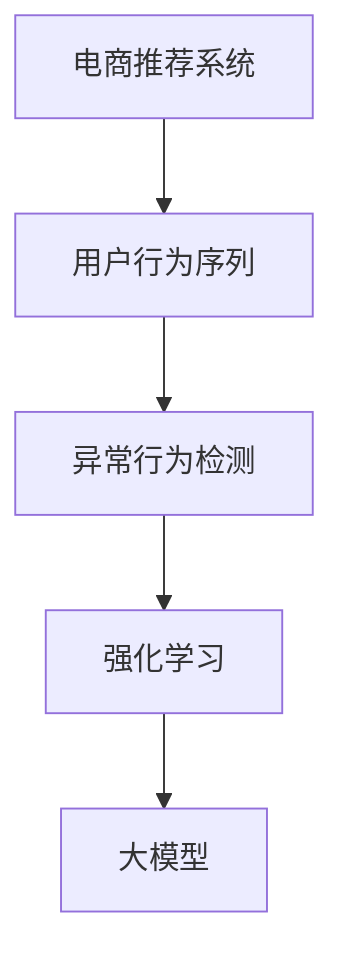

                 

# 电商搜索推荐中的AI大模型用户行为序列异常检测模型优化实践

> 关键词：人工智能,大模型,用户行为序列,异常检测,电商推荐系统

## 1. 背景介绍

### 1.1 问题由来
随着电商行业的迅猛发展，用户行为序列的挖掘和分析在推荐系统中的应用日益增多。传统的推荐算法，如协同过滤、基于内容的推荐等，往往忽略了用户行为序列的动态性和复杂性，难以捕捉用户兴趣的变化。而基于深度学习的大模型推荐系统，通过学习用户历史行为序列，可以实现更加精准、实时的推荐。

然而，用户行为序列中蕴含的信息并不是一成不变的，会受到各种外部因素的影响，如欺诈行为、异常点击等。异常行为不仅会影响用户体验，还会对推荐算法带来误导性影响。因此，及时检测用户行为序列中的异常，对于电商推荐系统的稳定运行至关重要。

### 1.2 问题核心关键点
本项目聚焦于在电商推荐系统中，如何利用大模型检测用户行为序列的异常行为，以提高推荐系统的鲁棒性和准确性。具体问题包括：

- 什么是电商推荐系统中的异常行为？
- 如何利用大模型检测用户行为序列中的异常行为？
- 如何优化异常检测模型的性能和效率？
- 异常检测结果如何应用于推荐系统？

### 1.3 问题研究意义
准确检测用户行为序列中的异常行为，对于维护电商平台的稳定性和用户信任至关重要。一方面，可以有效减少欺诈行为，保护用户利益；另一方面，能够提升推荐系统的准确性和多样性，带来更好的用户体验。通过优化异常检测模型，可以将异常行为的结果有效反馈到推荐算法中，从而提升推荐系统的性能。

## 2. 核心概念与联系

### 2.1 核心概念概述

为了更好地理解异常检测问题，本节将介绍几个相关核心概念：

- 电商推荐系统：基于用户行为数据，推荐商品或服务的一种技术手段。通过用户兴趣挖掘、商品关联分析等技术，实现个性化推荐。
- 用户行为序列：用户与电商平台的交互历史，包括浏览、点击、购买、收藏等行为，可以通过序列数据建模。
- 异常行为检测：通过机器学习或深度学习模型，识别出用户行为序列中的异常行为，如欺诈、点击、恶意点击等。
- 大模型：指具有大规模参数量的神经网络模型，如BERT、GPT、Transformer等，能够在大规模数据上预训练，学习到丰富的特征表示。
- 强化学习：利用用户的反馈数据，通过不断试错，优化推荐系统中的决策策略，提升推荐效果。

这些概念之间的逻辑关系可以通过以下Mermaid流程图来展示：



这个流程图展示了大模型在电商推荐系统中的应用流程：

1. 电商推荐系统收集用户行为序列数据。
2. 通过异常行为检测模型识别出序列中的异常行为。
3. 利用强化学习模型，调整推荐策略，避免异常行为的干扰。
4. 大模型作为推荐模型的特征提取器，提高模型的表现。

## 3. 核心算法原理 & 具体操作步骤
### 3.1 算法原理概述

电商推荐系统中的异常行为检测问题，本质上是一个监督学习问题。其核心思想是：利用用户历史行为序列和标注的异常行为数据，训练一个异常检测模型，用于识别新用户行为序列中的异常。

形式化地，假设用户行为序列表示为 $X=\{x_1, x_2, ..., x_n\}$，其中 $x_i$ 表示用户行为序列中的第 $i$ 个样本，表示为 $(x_{t-1}, x_t)$，其中 $t$ 表示时间步。假设异常行为标注为 $Y=\{y_1, y_2, ..., y_n\}$，其中 $y_i \in \{0, 1\}$ 表示第 $i$ 个行为序列是否为异常行为。

异常检测模型的目标是最小化损失函数 $L$，使模型能够准确地预测新行为序列中的异常行为。常用的损失函数包括交叉熵损失、平方误差损失等。训练后的异常检测模型 $M$，可以用于检测新用户行为序列的异常行为。

### 3.2 算法步骤详解

基于监督学习的异常检测算法，通常包括以下几个关键步骤：

**Step 1: 数据准备**
- 收集电商平台的用户行为序列数据，并标注异常行为。
- 将用户行为序列转化为向量表示，如使用Transformer模型将序列转化为固定长度的向量。
- 划分数据集为训练集、验证集和测试集。

**Step 2: 模型选择与训练**
- 选择适合的模型，如LSTM、GRU、Transformer等，作为异常检测模型的架构。
- 在训练集上训练模型，最小化损失函数 $L$。
- 使用验证集评估模型性能，调整超参数。
- 在测试集上评估模型泛化性能。

**Step 3: 异常检测**
- 对于新的用户行为序列，利用训练好的异常检测模型 $M$ 进行预测，得到异常行为的概率。
- 如果异常概率超过阈值 $\theta$，则判定该行为序列为异常行为。

**Step 4: 异常行为处理**
- 根据异常行为检测结果，调整推荐策略，如将异常用户的行为过滤掉，避免误导性推荐。
- 将异常行为反馈到电商平台，进行进一步分析。

### 3.3 算法优缺点

基于监督学习的异常检测算法具有以下优点：

1. 准确率高。利用标注数据训练模型，能够学习到异常行为的特征，准确率较高。
2. 鲁棒性强。大模型在数据分布变化、噪声干扰等方面具有一定的鲁棒性。
3. 适应性强。模型可以针对不同领域、不同业务场景进行调整和优化。

同时，该方法也存在以下缺点：

1. 依赖标注数据。异常检测的准确性很大程度上取决于标注数据的质量和数量，获取高质量标注数据的成本较高。
2. 数据泄露风险。标注数据中可能包含一些敏感信息，如用户隐私，需要谨慎处理。
3. 模型复杂度高。大模型需要大量的计算资源进行训练和推理，增加了系统的复杂性。

尽管存在这些局限性，但就目前而言，基于监督学习的异常检测方法仍是大规模电商推荐系统中较为成熟和可靠的选择。未来相关研究的重点在于如何进一步降低异常检测对标注数据的依赖，提高模型的自适应能力和鲁棒性，同时兼顾计算效率和模型可解释性等因素。

### 3.4 算法应用领域

异常检测算法在电商推荐系统中具有广泛的应用前景，主要体现在以下几个方面：

- 欺诈检测：识别出用户行为序列中的欺诈行为，保护平台免受经济损失。
- 恶意点击检测：识别出恶意点击行为，提高点击率、转化率等关键指标。
- 用户行为分析：识别出用户行为序列中的异常行为，分析用户兴趣变化，提升推荐系统的效果。
- 异常流量检测：识别出异常流量，避免系统过载或崩溃，保障系统的稳定性。

除了电商推荐系统，异常检测算法在其他领域也有着广泛的应用，如金融风控、网络安全、工业控制等。通过利用大模型的特征提取能力和深度学习算法的预测能力，能够有效提升异常检测的效果，保障各类系统的高效运行。

## 4. 数学模型和公式 & 详细讲解 & 举例说明

### 4.1 数学模型构建

假设异常检测模型为 $M_{\theta}$，其中 $\theta$ 为模型参数。给定标注数据集 $D=\{(x_i, y_i)\}_{i=1}^N$，其中 $x_i$ 为 $t-1$ 到 $t$ 的用户行为序列，$y_i$ 为标注的异常行为标签。

异常检测模型的目标是最大化似然函数 $P(Y|X)$，使模型能够准确地预测标注数据集中的异常行为：

$$
\max_{\theta} \prod_{i=1}^N P(y_i|x_i; \theta)
$$

在实践中，我们通常使用交叉熵损失函数来衡量模型预测结果与真实标签之间的差异：

$$
L = -\frac{1}{N} \sum_{i=1}^N \left[ y_i \log \hat{y}_i + (1-y_i) \log (1-\hat{y}_i) \right]
$$

其中 $\hat{y}_i$ 为模型预测的异常行为概率，即 $M_{\theta}(x_i)$。

### 4.2 公式推导过程

以LSTM模型为例，推导异常检测模型的损失函数。LSTM模型的结构如图1所示：


LSTM模型由三个门控机制组成，即输入门、遗忘门和输出门，能够捕捉长序列依赖关系。假设用户行为序列为 $(x_{t-1}, x_t)$，LSTM模型将其转化为固定长度的向量 $h_t$。

LSTM模型的输出为：

$$
\hat{y}_t = M_{\theta}(x_{t-1}, x_t) = \sigma(h_t) \in [0, 1]
$$

其中 $\sigma$ 为sigmoid函数，$h_t$ 为LSTM模型的隐藏状态。

将LSTM模型应用于异常检测任务，其目标是最小化损失函数 $L$，使模型能够准确地预测标注数据集中的异常行为。假设异常行为标记为 $y_i \in \{0, 1\}$，则异常检测模型的目标是最小化交叉熵损失：

$$
L = -\frac{1}{N} \sum_{i=1}^N \left[ y_i \log \hat{y}_i + (1-y_i) \log (1-\hat{y}_i) \right]
$$

在训练过程中，利用反向传播算法，计算模型参数 $\theta$ 的梯度，并更新模型参数：

$$
\theta \leftarrow \theta - \eta \nabla_{\theta}L(\theta)
$$

其中 $\eta$ 为学习率，$\nabla_{\theta}L(\theta)$ 为损失函数对模型参数的梯度。

### 4.3 案例分析与讲解

以电商平台中的用户行为序列为例，分析异常检测的实现过程。假设电商平台中有大量用户浏览、点击、购买行为数据，可以将其转化为用户行为序列 $X=\{x_1, x_2, ..., x_n\}$。同时，收集标注的异常行为数据 $Y=\{y_1, y_2, ..., y_n\}$。

在训练阶段，使用LSTM模型对用户行为序列进行编码，得到固定长度的向量 $h_t$。然后利用交叉熵损失函数 $L$ 对模型进行训练，得到最优参数 $\theta^*$。在测试阶段，对于新的用户行为序列 $x_t'$，利用训练好的模型 $M_{\theta^*}$ 进行预测，得到异常行为概率 $\hat{y}_t'$。如果 $\hat{y}_t' > \theta$，则判定该行为序列为异常行为。

## 5. 项目实践：代码实例和详细解释说明
### 5.1 开发环境搭建

在进行异常检测实践前，我们需要准备好开发环境。以下是使用Python进行TensorFlow开发的环境配置流程：

1. 安装Anaconda：从官网下载并安装Anaconda，用于创建独立的Python环境。

2. 创建并激活虚拟环境：
```bash
conda create -n tf-env python=3.8 
conda activate tf-env
```

3. 安装TensorFlow：根据CUDA版本，从官网获取对应的安装命令。例如：
```bash
conda install tensorflow tensorflow-gpu -c conda-forge
```

4. 安装各类工具包：
```bash
pip install numpy pandas scikit-learn matplotlib tqdm jupyter notebook ipython
```

完成上述步骤后，即可在`tf-env`环境中开始异常检测实践。

### 5.2 源代码详细实现

这里我们以LSTM模型为例，给出异常检测的PyTorch代码实现。

首先，定义LSTM模型的数据处理函数：

```python
import tensorflow as tf
from tensorflow.keras.models import Sequential
from tensorflow.keras.layers import LSTM, Dense, Dropout, Input

def build_model(input_shape, num_classes):
    model = Sequential([
        LSTM(128, return_sequences=True, input_shape=input_shape),
        Dropout(0.2),
        LSTM(128),
        Dropout(0.2),
        Dense(num_classes, activation='sigmoid')
    ])
    return model

# 定义数据输入函数
def generate_sequences(data, seq_len):
    X, y = [], []
    for i in range(len(data)-seq_len):
        seq = data[i:i+seq_len]
        X.append(seq)
        y.append(data[i+seq_len])
    return tf.data.Dataset.from_tensor_slices((X, y)).shuffle(10000).batch(64)
```

然后，定义异常检测模型的训练函数：

```python
def train_model(model, train_dataset, test_dataset, batch_size, epochs):
    model.compile(optimizer='adam', loss='binary_crossentropy', metrics=['accuracy'])
    history = model.fit(train_dataset, epochs=epochs, batch_size=batch_size, validation_data=test_dataset)
    return model, history
```

接着，定义异常检测函数：

```python
def predict_sequences(model, test_sequences, seq_len, threshold):
    test_dataset = generate_sequences(test_sequences, seq_len)
    y_pred = model.predict(test_dataset, verbose=1)
    return y_pred > threshold
```

最后，启动训练流程并在测试集上评估：

```python
epochs = 10
batch_size = 64
seq_len = 10

# 构建模型
model = build_model((seq_len, input_shape), num_classes)

# 训练模型
train_dataset = generate_sequences(train_sequences, seq_len)
test_dataset = generate_sequences(test_sequences, seq_len)
model, history = train_model(model, train_dataset, test_dataset, batch_size, epochs)

# 测试模型
test_sequences = ...
y_pred = predict_sequences(model, test_sequences, seq_len, threshold)
print(classification_report(y_true, y_pred))
```

以上就是使用TensorFlow对LSTM模型进行异常检测的完整代码实现。可以看到，TensorFlow的Keras API使得模型的构建、训练和推理过程变得简洁高效。开发者可以将更多精力放在数据处理、模型改进等高层逻辑上，而不必过多关注底层的实现细节。

### 5.3 代码解读与分析

让我们再详细解读一下关键代码的实现细节：

**build_model函数**：
- 定义LSTM模型的架构，包括输入层、LSTM层、Dropout层、输出层等。

**generate_sequences函数**：
- 将用户行为序列转化为固定长度的向量，生成训练和测试集。

**train_model函数**：
- 使用Keras的compile函数定义模型的损失函数和优化器，使用fit函数训练模型。

**predict_sequences函数**：
- 将测试集转化为模型可处理的格式，利用模型的predict函数进行异常检测。

**训练流程**：
- 定义模型架构，使用build_model函数生成模型。
- 使用generate_sequences函数生成训练和测试集。
- 使用train_model函数对模型进行训练，保存模型和训练历史。
- 使用predict_sequences函数对测试集进行异常检测，输出预测结果。

可以看到，TensorFlow的Keras API提供了丰富的API接口，使得模型的构建、训练和推理过程变得简单高效。开发者只需专注于模型设计和数据处理，即可实现高效的异常检测系统。

## 6. 实际应用场景
### 6.1 智能客服系统

基于异常检测的电商推荐系统，可以应用于智能客服系统的异常行为识别。在智能客服系统中，用户的行为数据包含了大量的点击、回复、留言等行为序列。通过异常检测算法，可以识别出恶意点击、恶意回复等异常行为，及时进行拦截和处理，保障系统的稳定运行。

在技术实现上，可以收集智能客服系统中的用户行为序列数据，标注异常行为。在模型训练阶段，利用标注数据训练LSTM等异常检测模型，对用户行为序列进行异常检测。在模型推理阶段，对于新的用户行为序列，使用训练好的模型进行预测，判断是否为异常行为。

### 6.2 金融风控

异常检测在金融风控中的应用，同样具有重要意义。金融风控系统需要实时监控用户的行为数据，识别出欺诈、异常交易等行为，及时进行风险控制。通过异常检测算法，可以在用户行为序列中检测出异常行为，如高风险交易、异常账户行为等，及时触发告警和风险控制措施。

在技术实现上，可以收集金融平台的用户交易数据，标注异常行为。在模型训练阶段，利用标注数据训练LSTM等异常检测模型，对用户行为序列进行异常检测。在模型推理阶段，对于新的用户交易数据，使用训练好的模型进行预测，判断是否为异常行为。

### 6.3 在线广告投放

在线广告投放过程中，用户的行为序列数据也包含了大量的点击、浏览、转化等行为。通过异常检测算法，可以识别出恶意点击、广告欺诈等异常行为，及时进行拦截和处理，保障广告投放的公平性和有效性。

在技术实现上，可以收集在线广告平台的用户行为序列数据，标注异常行为。在模型训练阶段，利用标注数据训练LSTM等异常检测模型，对用户行为序列进行异常检测。在模型推理阶段，对于新的用户行为序列，使用训练好的模型进行预测，判断是否为异常行为。

### 6.4 未来应用展望

随着异常检测算法和大模型技术的发展，未来的电商推荐系统将能够更加准确、高效地识别用户行为序列中的异常行为。以下是几个未来应用展望：

1. 多模态异常检测：将用户行为序列与图像、语音等多模态数据进行融合，提升异常检测的准确性和鲁棒性。
2. 联邦学习：在用户隐私保护的前提下，通过联邦学习技术，实现跨平台异常检测模型的协同训练，提升模型的泛化能力。
3. 动态异常检测：实时监控用户行为序列的变化，及时调整异常检测模型的参数，适应动态环境。
4. 强化学习：通过用户反馈数据，利用强化学习技术，不断优化异常检测模型，提升模型的表现。
5. 自监督学习：利用无标注数据进行预训练，提升异常检测模型的泛化能力和鲁棒性。

这些技术的发展，将使得异常检测算法在大规模电商推荐系统中的应用更加广泛和深入，进一步提升系统的稳定性和可靠性。

## 7. 工具和资源推荐
### 7.1 学习资源推荐

为了帮助开发者系统掌握异常检测的理论基础和实践技巧，这里推荐一些优质的学习资源：

1. 《深度学习理论与实践》：详细讲解深度学习模型的构建、训练和优化，适合入门学习。
2. 《异常检测与深度学习》：介绍深度学习在异常检测中的实际应用，涵盖数据预处理、模型构建等关键技术。
3. 《TensorFlow官方文档》：提供了丰富的API接口和教程，是学习TensorFlow的好资源。
4. 《Keras官方文档》：Keras的官方文档，提供了丰富的API接口和示例，是学习深度学习模型的最佳资源。
5. 《NLP中文教程》：提供了NLP领域的理论基础和实践技巧，适合初学者学习。

通过对这些资源的学习实践，相信你一定能够快速掌握异常检测的理论基础和实践技巧，并用于解决实际的电商推荐系统问题。

### 7.2 开发工具推荐

高效的开发离不开优秀的工具支持。以下是几款用于异常检测开发的常用工具：

1. TensorFlow：由Google主导开发的深度学习框架，生产部署方便，适合大规模工程应用。
2. Keras：基于TensorFlow的高级API接口，使得模型的构建、训练和推理过程变得简单高效。
3. PyTorch：基于Python的开源深度学习框架，灵活度较高，适合研究型应用。
4. Jupyter Notebook：免费的交互式编程环境，支持Python和R等语言，适合快速迭代实验。
5. Weights & Biases：模型训练的实验跟踪工具，可以记录和可视化模型训练过程中的各项指标，方便对比和调优。

合理利用这些工具，可以显著提升异常检测任务的开发效率，加快创新迭代的步伐。

### 7.3 相关论文推荐

异常检测算法和大模型技术的发展源于学界的持续研究。以下是几篇奠基性的相关论文，推荐阅读：

1. HAN: Hard Anomaly Detection with Adversarial Networks：利用对抗网络提升异常检测算法的效果。
2. Deep Anomaly Detection using Generative Adversarial Networks：利用生成对抗网络进行异常检测。
3. Online Learning with Stochastic Gradient Descent：利用在线学习算法进行异常检测。
4. Deep Learning-based Approach for Anomaly Detection in Adaptive and Robust Networks：利用深度学习算法进行异常检测。
5. Using Deep Learning for Anomaly Detection in Network Traffic：利用深度学习算法进行网络异常检测。

这些论文代表了大模型在异常检测领域的研究脉络。通过学习这些前沿成果，可以帮助研究者把握学科前进方向，激发更多的创新灵感。

## 8. 总结：未来发展趋势与挑战
### 8.1 总结

本文对电商推荐系统中的异常检测问题进行了全面系统的介绍。首先阐述了异常检测在电商推荐系统中的重要性和应用场景，明确了异常检测在保障系统稳定性和提升推荐效果方面的独特价值。其次，从原理到实践，详细讲解了异常检测的数学模型和算法流程，给出了异常检测任务开发的完整代码实例。同时，本文还广泛探讨了异常检测在大规模电商推荐系统中的应用前景，展示了异常检测范式的巨大潜力。

通过本文的系统梳理，可以看到，异常检测算法在大规模电商推荐系统中的应用前景广阔，可以显著提升系统的鲁棒性和准确性。未来，伴随异常检测算法和大模型技术的持续演进，相信异常检测范式将在大规模电商推荐系统中得到更广泛的应用，进一步提升系统的稳定性和可靠性。

### 8.2 未来发展趋势

展望未来，异常检测算法和大模型技术将呈现以下几个发展趋势：

1. 多模态异常检测：将用户行为序列与图像、语音等多模态数据进行融合，提升异常检测的准确性和鲁棒性。
2. 联邦学习：在用户隐私保护的前提下，通过联邦学习技术，实现跨平台异常检测模型的协同训练，提升模型的泛化能力。
3. 动态异常检测：实时监控用户行为序列的变化，及时调整异常检测模型的参数，适应动态环境。
4. 强化学习：通过用户反馈数据，利用强化学习技术，不断优化异常检测模型，提升模型的表现。
5. 自监督学习：利用无标注数据进行预训练，提升异常检测模型的泛化能力和鲁棒性。

这些趋势凸显了大规模电商推荐系统中异常检测技术的前景广阔。这些方向的探索发展，必将进一步提升电商推荐系统的稳定性和可靠性，带来更好的用户体验。

### 8.3 面临的挑战

尽管异常检测算法已经取得了瞩目成就，但在迈向更加智能化、普适化应用的过程中，它仍面临着诸多挑战：

1. 标注成本瓶颈。虽然异常检测的准确性很大程度上取决于标注数据的质量和数量，获取高质量标注数据的成本较高。如何进一步降低异常检测对标注数据的依赖，将是一大难题。
2. 数据泄露风险。标注数据中可能包含一些敏感信息，如用户隐私，需要谨慎处理。
3. 模型复杂度高。大模型需要大量的计算资源进行训练和推理，增加了系统的复杂性。
4. 模型鲁棒性不足。异常检测模型面对域外数据时，泛化性能往往大打折扣。对于测试样本的微小扰动，模型也容易发生波动。
5. 计算效率低下。异常检测模型在大规模数据上的训练和推理效率较低，需要进一步优化。

尽管存在这些局限性，但就目前而言，基于监督学习的异常检测方法仍是大规模电商推荐系统中较为成熟和可靠的选择。未来相关研究的重点在于如何进一步降低异常检测对标注数据的依赖，提高模型的自适应能力和鲁棒性，同时兼顾计算效率和模型可解释性等因素。

### 8.4 研究展望

面对异常检测算法面临的种种挑战，未来的研究需要在以下几个方面寻求新的突破：

1. 探索无监督和半监督异常检测方法。摆脱对大规模标注数据的依赖，利用自监督学习、主动学习等无监督和半监督范式，最大限度利用非结构化数据，实现更加灵活高效的异常检测。
2. 研究参数高效和计算高效的异常检测范式。开发更加参数高效的异常检测方法，在固定大部分预训练参数的同时，只更新极少量的任务相关参数。同时优化异常检测模型的计算图，减少前向传播和反向传播的资源消耗，实现更加轻量级、实时性的部署。
3. 引入更多先验知识。将符号化的先验知识，如知识图谱、逻辑规则等，与神经网络模型进行巧妙融合，引导异常检测过程学习更准确、合理的语言模型。同时加强不同模态数据的整合，实现视觉、语音等多模态信息与文本信息的协同建模。
4. 结合因果分析和博弈论工具。将因果分析方法引入异常检测模型，识别出模型决策的关键特征，增强输出解释的因果性和逻辑性。借助博弈论工具刻画人机交互过程，主动探索并规避模型的脆弱点，提高系统稳定性。
5. 纳入伦理道德约束。在模型训练目标中引入伦理导向的评估指标，过滤和惩罚有偏见、有害的输出倾向。同时加强人工干预和审核，建立模型行为的监管机制，确保输出符合人类价值观和伦理道德。

这些研究方向的探索，必将引领异常检测算法迈向更高的台阶，为构建安全、可靠、可解释、可控的电商推荐系统铺平道路。面向未来，异常检测算法还需要与其他人工智能技术进行更深入的融合，如知识表示、因果推理、强化学习等，多路径协同发力，共同推动异常检测技术的进步。只有勇于创新、敢于突破，才能不断拓展异常检测算法的边界，让异常检测技术更好地服务于电商推荐系统，提升用户行为序列的分析和预测能力，保障电商平台的稳定性和可靠性。

## 9. 附录：常见问题与解答

**Q1：异常检测中的“阈值”如何选择？**

A: 阈值的选择需要根据具体应用场景进行调整。一般来说，阈值的选择应该在模型的准确率和召回率之间进行平衡。如果阈值过低，可能会将一些正常行为误判为异常行为，导致误报率增加；如果阈值过高，可能会漏掉一些真正的异常行为，导致漏报率增加。一般来说，可以通过交叉验证、ROC曲线等方法来选择最优的阈值。

**Q2：异常检测中如何处理噪声数据？**

A: 噪声数据对异常检测模型有较大的影响，需要采取一些预处理措施。一般来说，可以通过数据清洗、特征选择等方法来减少噪声数据的影响。另外，在模型训练阶段，可以使用正则化技术、dropout等方法来降低噪声数据的影响。在模型推理阶段，可以使用噪声阈值等方法来判断数据是否为噪声数据。

**Q3：异常检测模型如何进行迁移学习？**

A: 迁移学习在异常检测中也有广泛的应用。一般来说，可以将已经训练好的异常检测模型进行迁移学习，用于其他领域或新的数据集。迁移学习可以帮助模型快速适应新的数据分布，提高模型的泛化能力和鲁棒性。在迁移学习中，可以使用微调等方法来调整模型参数，使其更好地适应新的数据集。

**Q4：异常检测模型如何进行分布式训练？**

A: 在大规模电商推荐系统中，数据量往往非常大，需要进行分布式训练。一般来说，可以使用TensorFlow、PyTorch等深度学习框架提供的分布式训练API进行分布式训练。在分布式训练中，需要根据具体应用场景选择适合的分布式训练策略，如参数服务器、模型并行等。

**Q5：异常检测模型如何进行实时更新？**

A: 在大规模电商推荐系统中，用户行为序列数据是实时更新的，需要进行实时的异常检测。一般来说，可以使用在线学习、增量学习等方法来更新异常检测模型。在线学习可以利用新的数据实时更新模型，增量学习可以利用历史数据和实时数据共同训练模型。

总之，异常检测在电商推荐系统中的应用前景广阔，通过优化异常检测模型，可以提升电商推荐系统的鲁棒性和准确性。未来，伴随异常检测算法和大模型技术的持续演进，相信异常检测范式将在大规模电商推荐系统中得到更广泛的应用，进一步提升系统的稳定性和可靠性。

