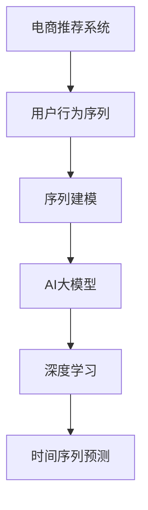

                 

# 电商搜索推荐中的AI大模型用户行为序列预测技术

> 关键词：电商推荐系统, 用户行为序列, AI大模型, 深度学习, 时间序列预测, 序列建模

## 1. 背景介绍

随着电子商务的蓬勃发展，商品品类日趋丰富，电商搜索推荐系统已成为提升用户体验、增加销售的重要手段。传统基于规则、协同过滤、矩阵分解等推荐算法，虽然具有一定的准确性，但在个性化推荐、冷启动问题等方面存在瓶颈。近年来，基于深度学习的大模型推荐技术，通过学习和理解用户历史行为，能够提供更准确、更个性化的推荐，受到了广泛关注。

然而，电商推荐系统的核心在于对用户行为序列的建模，即预测用户未来点击、购买等行为。传统的基于深度学习的序列建模方法，如RNN、LSTM、GRU等，存在计算复杂度高、无法处理长期依赖等问题。而大模型推荐系统，虽然可以通过大规模数据训练得到更准确的特征表示，但在大规模序列预测任务中，模型的参数量和计算复杂度仍然是一个难题。

## 2. 核心概念与联系

为更好地理解电商搜索推荐中的AI大模型用户行为序列预测技术，本节将介绍几个密切相关的核心概念：

- 电商推荐系统(Recommendation System)：基于用户历史行为数据，推荐符合用户兴趣的商品。常见的推荐算法包括基于内容的推荐、协同过滤、深度学习推荐等。

- 用户行为序列(User Behavior Sequence)：用户在电商平台上的一系列操作，如浏览、点击、购买等行为，构成了一个行为序列。

- 序列建模(Sequence Modeling)：通过深度学习等方法，建模用户行为序列的规律和特征，预测用户未来行为。

- AI大模型(AI Large Model)：指在大规模数据上预训练得到的深度学习模型，具备强大的表征能力和泛化能力。常见的预训练模型包括BERT、GPT等。

- 深度学习(Deep Learning)：通过多层神经网络对数据进行非线性建模，提取特征和规律。

- 时间序列预测(Time Series Prediction)：通过序列建模方法，预测时间序列数据的未来值。

这些核心概念之间的逻辑关系可以通过以下Mermaid流程图来展示：



这个流程图展示了大模型在电商推荐系统中的应用框架：

1. 电商推荐系统收集用户行为序列。
2. 通过序列建模方法，对用户行为序列进行建模。
3. 使用AI大模型学习用户行为序列的特征表示。
4. 结合深度学习技术，进行时间序列预测。

## 3. 核心算法原理 & 具体操作步骤

### 3.1 算法原理概述

电商搜索推荐中的用户行为序列预测，本质上是一个时间序列预测问题。即给定用户历史行为序列，预测用户未来的行为。大模型推荐系统通过在电商行为数据上进行预训练，学习到用户行为序列的特征表示，再通过深度学习模型对未来的行为进行预测。

具体而言，假设电商平台有$N$个用户，每个用户有$T$个行为序列，即$D=\{(x_i,y_i)\}_{i=1}^N$，其中$x_i$表示用户$i$的历史行为序列，$y_i$表示用户$i$未来的行为。模型的目标是找到最优的特征表示$z_i$，使得模型能够准确预测用户未来的行为$y_i$。

形式化地，设模型为$f$，则优化目标为：

$$
\min_{f} \sum_{i=1}^N \ell(f(x_i),y_i)
$$

其中$\ell$为预测误差函数，如均方误差、交叉熵等。

### 3.2 算法步骤详解

电商搜索推荐中的AI大模型用户行为序列预测，一般包括以下几个关键步骤：

**Step 1: 准备数据集和预训练模型**

- 收集电商平台上用户的历史行为序列数据，划分为训练集、验证集和测试集。数据通常包含用户ID、商品ID、行为时间戳等特征。
- 选择合适的预训练大模型作为初始化参数，如BERT、GPT等。

**Step 2: 添加任务适配层**

- 根据任务特点，在预训练模型的顶层设计合适的输出层和损失函数。对于点击率预测任务，通常使用二分类交叉熵损失函数；对于购物车加入率预测任务，可以使用二元交叉熵损失函数。
- 对于长序列预测任务，需要在模型中加入序列特征提取层，如GRU、LSTM等。

**Step 3: 设置微调超参数**

- 选择合适的优化算法及其参数，如Adam、SGD等，设置学习率、批大小、迭代轮数等。
- 设置正则化技术及强度，包括权重衰减、Dropout、Early Stopping等。
- 确定冻结预训练参数的策略，如仅微调顶层，或全部参数都参与微调。

**Step 4: 执行梯度训练**

- 将训练集数据分批次输入模型，前向传播计算损失函数。
- 反向传播计算参数梯度，根据设定的优化算法和学习率更新模型参数。
- 周期性在验证集上评估模型性能，根据性能指标决定是否触发Early Stopping。
- 重复上述步骤直到满足预设的迭代轮数或Early Stopping条件。

**Step 5: 测试和部署**

- 在测试集上评估微调后模型 $f_{\hat{\theta}}$ 的性能，对比微调前后的预测准确率等指标提升。
- 使用微调后的模型对新商品进行推荐预测，集成到实际的应用系统中。
- 持续收集新的用户行为数据，定期重新微调模型，以适应数据分布的变化。

以上是电商推荐系统中的大模型用户行为序列预测的一般流程。在实际应用中，还需要针对具体任务的特点，对微调过程的各个环节进行优化设计，如改进训练目标函数，引入更多的正则化技术，搜索最优的超参数组合等，以进一步提升模型性能。

### 3.3 算法优缺点

基于大模型的电商推荐系统具有以下优点：

1. 特征表示能力强。通过在大规模电商数据上进行预训练，大模型能够学习到丰富的用户行为特征，提升推荐的准确性。
2. 模型泛化能力好。大模型的预训练知识可以迁移到新的电商场景中，有效应对电商数据的复杂性和多样性。
3. 可解释性强。大模型的每个参数和结构都有明确的数学解释，便于调试和优化。
4. 数据处理灵活。大模型可以对不同类型的用户行为数据进行处理，提升推荐系统对多种用户场景的适应性。

同时，该方法也存在一定的局限性：

1. 数据量要求高。电商数据通常包含大量冗余信息，需要足够的标注数据进行微调。
2. 计算资源消耗大。大模型参数量巨大，微调和推理过程中需要大量的计算资源。
3. 过拟合风险高。电商数据存在多模态、复杂性高，微调过程容易过拟合电商平台的特定数据分布。
4. 动态特性差。电商数据的时序性较强，但大模型在动态特性上的适应性有待提升。

尽管存在这些局限性，但就目前而言，基于大模型的电商推荐系统仍然是大模型推荐技术中的主流范式。未来相关研究的重点在于如何进一步降低大模型的计算成本，提高微调的泛化能力和鲁棒性，同时兼顾可解释性和动态特性等因素。

### 3.4 算法应用领域

基于大模型的电商推荐系统已经在多个电商平台上得到了应用，如亚马逊、淘宝、京东等。主要应用于以下场景：

- 商品推荐：根据用户历史浏览、点击、购买记录，推荐符合用户兴趣的商品。
- 个性化促销：通过个性化广告、优惠券等形式，提高用户转化率。
- 活动预测：预测电商平台的营销活动效果，优化营销策略。
- 库存管理：预测商品需求量，辅助库存管理，避免缺货或过剩。
- 用户行为分析：分析用户行为序列，挖掘用户兴趣和偏好，提升用户满意度。

除了这些常见应用外，基于大模型的电商推荐系统还被创新性地应用到更多场景中，如推荐系统的冷启动、个性化搜索、智能客服等，为电商平台的智能化运营提供了新的技术手段。

## 4. 数学模型和公式 & 详细讲解  
### 4.1 数学模型构建

本节将使用数学语言对电商搜索推荐中的AI大模型用户行为序列预测过程进行更加严格的刻画。

假设电商平台有$N$个用户，每个用户有$T$个行为序列，即$D=\{(x_i,y_i)\}_{i=1}^N$，其中$x_i$表示用户$i$的历史行为序列，$y_i$表示用户$i$未来的行为。模型的目标是找到最优的特征表示$z_i$，使得模型能够准确预测用户未来的行为$y_i$。

形式化地，设模型为$f$，则优化目标为：

$$
\min_{f} \sum_{i=1}^N \ell(f(x_i),y_i)
$$

其中$\ell$为预测误差函数，如均方误差、交叉熵等。

## 5. 项目实践：代码实例和详细解释说明
### 5.1 开发环境搭建

在进行电商推荐系统的用户行为序列预测实践前，我们需要准备好开发环境。以下是使用Python进行TensorFlow开发的环境配置流程：

1. 安装Anaconda：从官网下载并安装Anaconda，用于创建独立的Python环境。

2. 创建并激活虚拟环境：
```bash
conda create -n tf-env python=3.8 
conda activate tf-env
```

3. 安装TensorFlow：根据CUDA版本，从官网获取对应的安装命令。例如：
```bash
conda install tensorflow -c pytorch -c conda-forge
```

4. 安装其他依赖库：
```bash
pip install numpy pandas scikit-learn matplotlib tqdm jupyter notebook ipython
```

完成上述步骤后，即可在`tf-env`环境中开始电商推荐系统的用户行为序列预测实践。

### 5.2 源代码详细实现

下面我们以电商推荐系统中的点击率预测任务为例，给出使用TensorFlow实现大模型用户行为序列预测的完整代码实现。

首先，定义点击率预测任务的数据处理函数：

```python
import tensorflow as tf
import numpy as np

def load_data():
    # 读取训练集数据
    train_x = np.load('train_x.npy')
    train_y = np.load('train_y.npy')
    
    # 读取验证集数据
    dev_x = np.load('dev_x.npy')
    dev_y = np.load('dev_y.npy')
    
    # 读取测试集数据
    test_x = np.load('test_x.npy')
    test_y = np.load('test_y.npy')
    
    return train_x, train_y, dev_x, dev_y, test_x, test_y

# 加载数据
train_x, train_y, dev_x, dev_y, test_x, test_y = load_data()

# 定义模型参数
batch_size = 32
learning_rate = 0.001
epochs = 10
dropout_rate = 0.5

# 定义模型结构
model = tf.keras.Sequential([
    tf.keras.layers.Dense(512, activation='relu', input_shape=(train_x.shape[1],)),
    tf.keras.layers.Dropout(dropout_rate),
    tf.keras.layers.Dense(256, activation='relu'),
    tf.keras.layers.Dropout(dropout_rate),
    tf.keras.layers.Dense(1, activation='sigmoid')
])
```

然后，定义损失函数和优化器：

```python
# 定义损失函数
def build_loss(y_true, y_pred):
    return tf.keras.losses.BinaryCrossentropy()(y_true, y_pred)

# 定义优化器
optimizer = tf.keras.optimizers.Adam(learning_rate=learning_rate)

# 定义评估指标
metrics = [tf.keras.metrics.BinaryAccuracy('accuracy')]
```

接着，定义训练和评估函数：

```python
def train_model(model, train_x, train_y, dev_x, dev_y, epochs, batch_size, dropout_rate):
    model.compile(optimizer=optimizer, loss=build_loss, metrics=metrics)
    
    # 训练模型
    history = model.fit(train_x, train_y, epochs=epochs, batch_size=batch_size, validation_data=(dev_x, dev_y), callbacks=[tf.keras.callbacks.EarlyStopping(patience=3)])
    
    # 评估模型
    test_loss, test_acc = model.evaluate(test_x, test_y)
    
    return history, test_loss, test_acc

# 训练模型
history, test_loss, test_acc = train_model(model, train_x, train_y, dev_x, dev_y, epochs, batch_size, dropout_rate)
```

最后，启动训练流程并在测试集上评估：

```python
# 打印测试结果
print(f'Test loss: {test_loss:.4f}')
print(f'Test accuracy: {test_acc:.4f}')

# 保存模型
model.save('click_rate_predictor.h5')
```

以上就是使用TensorFlow对电商推荐系统进行点击率预测的完整代码实现。可以看到，TensorFlow的Keras API使得模型定义和训练过程变得简洁高效。开发者可以将更多精力放在数据处理、模型改进等高层逻辑上，而不必过多关注底层的实现细节。

### 5.3 代码解读与分析

让我们再详细解读一下关键代码的实现细节：

**load_data函数**：
- 读取训练集、验证集和测试集的数据，并进行归一化处理。

**定义模型结构**：
- 使用Keras API构建一个包含两个Dense层和一个Dropout层的神经网络模型。
- 第一个Dense层有512个神经元，使用ReLU激活函数。
- 第二个Dense层有256个神经元，使用ReLU激活函数。
- Dropout层用于减少过拟合，设置Dropout率为0.5。
- 输出层为1个神经元，使用Sigmoid激活函数，输出点击率预测值。

**定义损失函数和优化器**：
- 使用二元交叉熵作为损失函数。
- 使用Adam优化器，设置学习率为0.001。
- 设置评估指标为准确率。

**训练和评估函数**：
- 使用Keras的fit方法训练模型，设置训练轮数为10，批次大小为32。
- 使用EarlyStopping回调函数，设置在验证集上3个epoch没有进步就停止训练。
- 在测试集上评估模型性能，输出损失和准确率。

**训练流程**：
- 定义训练集、验证集和测试集的数据。
- 设置模型参数，包括批次大小、学习率、Dropout率等。
- 调用train_model函数，训练模型并返回训练历史和测试损失、准确率。
- 打印测试结果，并保存模型。

可以看到，TensorFlow的Keras API使得电商推荐系统的用户行为序列预测实现变得简单明了。开发者只需关注模型的结构、训练参数的设置和模型的评估，其他底层细节由Keras API自动处理。

当然，工业级的系统实现还需考虑更多因素，如模型的保存和部署、超参数的自动搜索、更灵活的任务适配层等。但核心的序列预测范式基本与此类似。

## 6. 实际应用场景

### 6.1 个性化商品推荐

个性化商品推荐是大模型电商推荐系统的重要应用场景。通过用户行为序列建模，电商平台可以精确预测用户对商品的兴趣和需求，提升推荐系统的准确性和个性化水平。

例如，某电商平台通过收集用户的浏览、点击、购买记录，使用点击率预测模型预测用户对新商品的兴趣。对于高兴趣的商品，平台可以及时推送个性化广告，提高用户转化率。对于低兴趣的商品，平台可以优化推荐算法，避免用户流失。

### 6.2 广告投放优化

电商广告投放的效果直接影响平台的收入和用户体验。通过用户行为序列建模，电商平台可以预测广告点击率、转化率等关键指标，优化广告投放策略。

例如，某电商平台通过点击率预测模型，对每个广告组（如商品、活动）进行评估，筛选出高点击率的商品和广告。在广告投放时，优先选择高点击率的商品，同时考虑广告的曝光时间和位置，实现更高效的广告投放。

### 6.3 库存管理优化

库存管理是电商平台的成本控制和效率提升的重要环节。通过用户行为序列建模，电商平台可以预测商品的需求量和缺货风险，优化库存管理。

例如，某电商平台通过预测商品未来的需求量，调整库存水平，避免缺货或过剩。同时，平台可以根据库存情况，进行灵活的补货和促销策略调整，提高库存周转率。

### 6.4 未来应用展望

随着大模型和序列建模技术的不断发展，电商推荐系统将在更多领域得到应用，为电商平台的智能化运营带来新的变革。

1. 商品分类预测：通过用户行为序列建模，预测商品分类信息，提升商品分类的准确性。
2. 促销效果预测：通过点击率预测模型，预测促销活动的效果，优化促销策略。
3. 个性化搜索推荐：通过用户行为序列建模，推荐符合用户查询意图的商品，提升搜索体验。
4. 智能客服：通过用户行为序列建模，构建智能客服系统，提升用户满意度。
5. 风险预警：通过点击率预测模型，预测用户欺诈行为，提升风险管理能力。

除了这些应用场景外，大模型电商推荐系统还被创新性地应用到更多领域，如社交电商、直播电商等，为电商平台的智能化运营提供了新的技术手段。

## 7. 工具和资源推荐
### 7.1 学习资源推荐

为了帮助开发者系统掌握电商推荐系统的用户行为序列预测技术，这里推荐一些优质的学习资源：

1. TensorFlow官方文档：TensorFlow的官方文档，提供了完整的深度学习模型实现和训练流程，是学习TensorFlow的必备资源。
2. Deep Learning with Python：由深度学习专家François Chollet所著，系统介绍了使用TensorFlow和Keras进行深度学习开发，适合初学者学习。
3. Recommender Systems: The Textbook：由深度学习专家Christopher Manning和Jordan Boyd-Graber合著，介绍了推荐系统的经典算法和前沿技术，适合深度学习爱好者学习。
4. Deep Learning for Recommender Systems: A Survey and Tutorial：由深度学习专家Nicolas Perrone和Francesco Esuli合著，综述了深度学习在推荐系统中的应用，适合研究者阅读。
5. CS229《机器学习》课程：斯坦福大学开设的机器学习课程，系统介绍了机器学习的基础知识和经典算法，是学习深度学习的理论基础。

通过对这些资源的学习实践，相信你一定能够快速掌握电商推荐系统的用户行为序列预测技术，并用于解决实际的推荐问题。

### 7.2 开发工具推荐

高效的开发离不开优秀的工具支持。以下是几款用于电商推荐系统用户行为序列预测开发的常用工具：

1. TensorFlow：由Google主导开发的深度学习框架，灵活易用，支持大规模分布式训练。
2. Keras：基于TensorFlow等框架开发的高级神经网络API，使用简单，易于上手。
3. Jupyter Notebook：轻量级、易用的交互式开发环境，支持Python代码的实时执行和调试。
4. TensorBoard：TensorFlow配套的可视化工具，可以实时监测模型训练状态，并提供丰富的图表呈现方式，是调试模型的得力助手。
5. Git：分布式版本控制系统，便于团队协作和版本控制，是电商推荐系统开发的必备工具。

合理利用这些工具，可以显著提升电商推荐系统用户行为序列预测的开发效率，加快创新迭代的步伐。

### 7.3 相关论文推荐

电商推荐系统的用户行为序列预测技术源于学界的持续研究。以下是几篇奠基性的相关论文，推荐阅读：

1. Matrix Factorization Techniques for Recommender Systems：提出了基于矩阵分解的推荐算法，被广泛应用于电商推荐系统。
2. Context-aware Recommender Systems: A Survey and Tutorial：综述了上下文感知推荐系统的发展，探讨了上下文信息对推荐效果的影响。
3. Deep Interest Networks for Personalized Recommendation：提出了基于深度学习的方法，通过建模用户兴趣进行推荐。
4. Attention-Based Recommender Systems：探讨了注意力机制在推荐系统中的应用，提升了推荐系统的准确性。
5. Self-attention Networks for Recommendation Systems：提出使用自注意力机制进行推荐，提升了推荐系统的效果。

这些论文代表了大模型电商推荐系统的技术发展脉络。通过学习这些前沿成果，可以帮助研究者把握学科前进方向，激发更多的创新灵感。

## 8. 总结：未来发展趋势与挑战

### 8.1 总结

本文对基于大模型的电商推荐系统中的用户行为序列预测方法进行了全面系统的介绍。首先阐述了电商推荐系统和大模型用户行为序列预测的研究背景和意义，明确了大模型在电商推荐系统中的应用价值。其次，从原理到实践，详细讲解了大模型用户行为序列预测的数学原理和关键步骤，给出了电商推荐系统的完整代码实现。同时，本文还广泛探讨了大模型在电商推荐系统中的实际应用场景，展示了其巨大的应用潜力。此外，本文精选了电商推荐系统的各类学习资源，力求为读者提供全方位的技术指引。

通过本文的系统梳理，可以看到，基于大模型的电商推荐系统已经在电商平台上得到了广泛应用，极大地提升了用户体验和电商平台的用户转化率。未来，伴随大模型和序列建模技术的不断发展，电商推荐系统将在更多领域得到应用，为电商平台的智能化运营带来新的变革。

### 8.2 未来发展趋势

展望未来，电商推荐系统中的AI大模型用户行为序列预测技术将呈现以下几个发展趋势：

1. 模型规模持续增大。随着算力成本的下降和数据规模的扩张，电商推荐系统的预训练模型参数量还将持续增长。超大模型能够更好地学习用户行为序列的特征表示，提升推荐系统的准确性和个性化水平。

2. 序列建模技术不断演进。未来的序列建模技术将更加灵活和高效，如引入GNN（图神经网络）等结构化方法，提升对用户行为序列的建模能力。

3. 推荐策略智能化。推荐系统将更加注重个性化和智能化，结合用户行为序列建模，实现更精准的商品推荐和广告投放。

4. 用户行为序列理解。电商推荐系统将更加注重理解用户行为序列的语义和情感，通过自然语言处理技术提升推荐系统的效果。

5. 推荐系统集成化。推荐系统将更加注重与其他系统的集成和协同，如与内容推荐、活动推荐等系统的结合，提升推荐系统的多模态融合能力。

6. 推荐系统可视化。推荐系统将更加注重可视化输出，通过可视化技术提升用户对推荐结果的理解和信任。

以上趋势凸显了大模型电商推荐系统的广阔前景。这些方向的探索发展，必将进一步提升电商推荐系统的性能和应用范围，为电商平台的智能化运营带来新的突破。

### 8.3 面临的挑战

尽管大模型电商推荐系统已经取得了瞩目成就，但在迈向更加智能化、普适化应用的过程中，它仍面临着诸多挑战：

1. 数据量瓶颈。电商推荐系统需要处理大量的用户行为数据，但用户行为数据存在多模态、复杂性高，如何高效地处理和利用这些数据，将是一大难题。

2. 计算资源消耗大。电商推荐系统的预训练模型参数量巨大，微调和推理过程中需要大量的计算资源。如何优化模型结构，提高计算效率，将是重要的优化方向。

3. 过拟合风险高。电商推荐系统容易受到电商平台的特定数据分布影响，微调过程容易过拟合。如何提高模型的泛化能力和鲁棒性，将是重要的研究课题。

4. 动态特性差。电商数据的时序性较强，但大模型在动态特性上的适应性有待提升。如何更好地处理动态数据，将是未来的研究方向。

5. 可解释性不足。大模型的决策过程缺乏可解释性，难以对其推理逻辑进行分析和调试。如何赋予模型更强的可解释性，将是亟待攻克的难题。

6. 安全性有待保障。电商推荐系统可能面临恶意广告、欺诈等安全威胁，如何保障系统的安全性，将是重要的研究课题。

正视电商推荐系统面临的这些挑战，积极应对并寻求突破，将是大模型电商推荐系统走向成熟的必由之路。相信随着学界和产业界的共同努力，这些挑战终将一一被克服，大模型电商推荐系统必将在构建人机协同的智能推荐系统中扮演越来越重要的角色。

### 8.4 研究展望

面对大模型电商推荐系统所面临的种种挑战，未来的研究需要在以下几个方面寻求新的突破：

1. 探索高效的数据处理和建模方法。研究如何更好地处理多模态、复杂性高的电商数据，提高电商推荐系统的处理效率。

2. 开发更加高效、灵活的模型结构。研究如何优化模型结构，减少计算资源消耗，提高推荐系统的效率。

3. 引入更多的先验知识。将符号化的先验知识，如知识图谱、逻辑规则等，与神经网络模型进行巧妙融合，引导微调过程学习更准确、合理的语言模型。

4. 结合因果分析和博弈论工具。将因果分析方法引入电商推荐系统，识别出模型决策的关键特征，增强推荐系统的因果性和稳定性。

5. 纳入伦理道德约束。在模型训练目标中引入伦理导向的评估指标，过滤和惩罚有偏见、有害的输出倾向。同时加强人工干预和审核，建立模型行为的监管机制，确保输出符合人类价值观和伦理道德。

这些研究方向的探索，必将引领电商推荐系统走向更加智能化、普适化的方向，为电商平台的智能化运营带来新的技术突破。面向未来，电商推荐系统还需要与其他人工智能技术进行更深入的融合，如知识表示、因果推理、强化学习等，多路径协同发力，共同推动电商平台的智能化运营进程。只有勇于创新、敢于突破，才能不断拓展电商推荐系统的边界，让智能技术更好地造福电商平台的用户。

## 9. 附录：常见问题与解答

**Q1：电商推荐系统中的大模型用户行为序列预测是否适用于所有电商场景？**

A: 电商推荐系统中的大模型用户行为序列预测，主要适用于具有大规模用户行为数据的电商平台。对于小规模电商平台，由于用户行为数据量有限，可能无法充分发挥大模型的优势。此外，对于实时性要求高的电商场景，如竞价广告、实时推荐等，可能也无法实现实时预测。

**Q2：电商推荐系统中的大模型用户行为序列预测需要哪些数据？**

A: 电商推荐系统中的大模型用户行为序列预测需要收集以下数据：

1. 用户行为数据：如用户的浏览、点击、购买记录，用于训练大模型。
2. 商品数据：如商品的分类、属性、价格等，用于增强推荐系统的特征表示。
3. 用户属性数据：如用户的年龄、性别、地域等，用于刻画用户特征。
4. 广告数据：如广告的展示时间、位置、点击率等，用于预测广告效果。
5. 促销数据：如促销活动的时间、力度、效果等，用于优化促销策略。

这些数据需经过清洗、归一化处理后，才能用于模型训练。

**Q3：电商推荐系统中的大模型用户行为序列预测需要哪些计算资源？**

A: 电商推荐系统中的大模型用户行为序列预测需要以下计算资源：

1. 高性能计算设备：如GPU、TPU等，用于加速模型训练和推理。
2. 大规模存储设备：用于存储大规模用户行为数据和模型参数。
3. 高并发服务：如分布式任务调度系统，用于处理大规模请求。
4. 高效的算法和优化技术：如剪枝、量化、混合精度训练等，用于提升模型效率和性能。

合理利用这些资源，可以显著提升电商推荐系统的处理能力和用户体验。

**Q4：电商推荐系统中的大模型用户行为序列预测有哪些优化策略？**

A: 电商推荐系统中的大模型用户行为序列预测有以下优化策略：

1. 数据增强：通过数据扩充、回译等方法，增强训练集的多样性，减少模型过拟合。
2. 模型压缩：通过剪枝、量化等技术，减小模型参数量，提升模型推理速度。
3. 分布式训练：通过分布式计算框架，加速模型训练和推理。
4. 动态更新：通过增量学习、在线学习等技术，动态更新模型参数，保持模型性能。
5. 模型融合：通过模型集成、融合等方法，提升模型性能和鲁棒性。

这些优化策略可以结合具体场景和需求，灵活应用。

**Q5：电商推荐系统中的大模型用户行为序列预测有哪些应用场景？**

A: 电商推荐系统中的大模型用户行为序列预测有以下应用场景：

1. 个性化商品推荐：通过预测用户对商品的兴趣，提升推荐系统的准确性和个性化水平。
2. 广告投放优化：通过预测广告点击率、转化率等关键指标，优化广告投放策略。
3. 库存管理优化：通过预测商品的需求量和缺货风险，优化库存管理。
4. 个性化搜索推荐：通过预测用户查询意图，提升搜索体验。
5. 智能客服：通过预测用户行为序列，构建智能客服系统，提升用户满意度。

除了这些应用场景外，电商推荐系统还被创新性地应用到更多领域，如社交电商、直播电商等，为电商平台的智能化运营提供了新的技术手段。

---

作者：禅与计算机程序设计艺术 / Zen and the Art of Computer Programming

