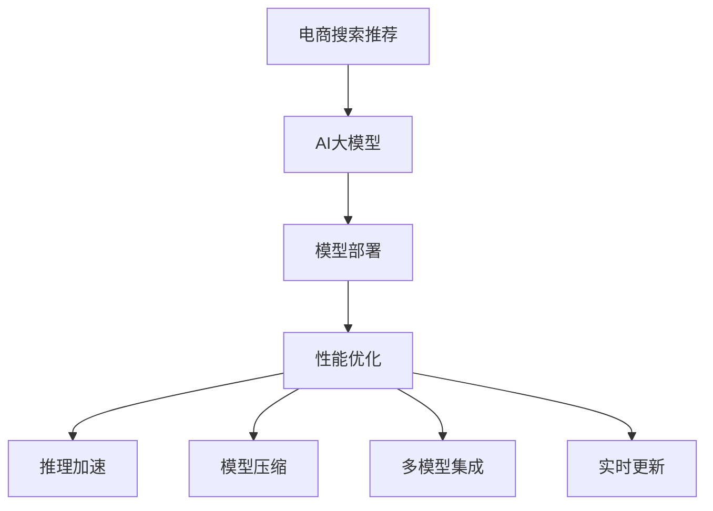

                 

# 电商搜索推荐场景下的AI大模型模型部署性能优化实践

> 关键词：
- AI大模型
- 电商搜索推荐
- 模型部署
- 性能优化
- 推理加速
- 压缩策略
- 多模型集成
- 实时更新

## 1. 背景介绍

### 1.1 问题由来
随着人工智能技术的飞速发展，AI大模型在电商搜索推荐领域的应用越来越广泛。这些大模型通常基于大规模无标签数据进行预训练，学习到丰富的语义表示和特征抽取能力，在电商推荐系统上表现优异。然而，这些模型由于参数量庞大，在部署和推理过程中面临性能瓶颈，难以满足电商搜索推荐场景的高实时性要求。

### 1.2 问题核心关键点
当前，AI大模型在电商搜索推荐场景中的性能瓶颈主要体现在以下几方面：

1. **模型大小和计算复杂度**：主流大模型如BERT、GPT等参数量在亿级以上，推理过程耗时较长，难以满足实时搜索推荐的需求。
2. **模型推理速度**：尽管有优化策略如矩阵压缩、量化等，但推理速度仍受限，需要进一步提升。
3. **资源占用**：模型在推理过程中会占用大量GPU/TPU资源，对服务器硬件配置提出较高要求。
4. **模型部署灵活性**：电商搜索推荐系统需要在多个平台上部署，模型部署的灵活性至关重要。

### 1.3 问题研究意义
优化AI大模型在电商搜索推荐场景下的性能，对于提升用户搜索体验、降低搜索推荐系统的延迟和成本、增强推荐系统的实时性和个性化具有重要意义：

1. **提升用户体验**：实时响应搜索结果，提供个性化推荐，提升用户满意度。
2. **降低系统延迟**：通过高效推理，降低搜索推荐系统响应时间，提升用户体验。
3. **减少服务器成本**：优化模型推理资源，降低硬件成本，提高系统性价比。
4. **增强个性化**：通过多模型集成和实时更新，增强推荐系统的个性化和多样性。

## 2. 核心概念与联系

### 2.1 核心概念概述

为更好地理解如何优化AI大模型在电商搜索推荐场景下的性能，本节将介绍几个密切相关的核心概念：

- **AI大模型**：基于大规模无标签数据预训练的语言模型，如BERT、GPT等，具备强大的语义表示和特征抽取能力。
- **电商搜索推荐**：电商平台根据用户查询或浏览行为，推荐可能感兴趣的商品或内容，提升用户体验和转化率。
- **模型部署**：将训练好的模型应用于实际场景中，供推理计算使用。
- **性能优化**：通过优化模型结构、参数、推理策略等，提升模型在电商搜索推荐场景中的推理速度和效率。
- **推理加速**：通过硬件加速、算法优化等手段，提升模型的推理速度。
- **模型压缩**：通过参数剪枝、量化等技术，减小模型规模，减少计算量。
- **多模型集成**：通过集成多个微调后的模型，增强推荐系统的鲁棒性和准确性。
- **实时更新**：根据用户行为和市场变化，定期更新模型，保持推荐系统的时效性。

这些核心概念之间的逻辑关系可以通过以下Mermaid流程图来展示：



这个流程图展示了大模型在电商推荐场景下的核心概念及其之间的关系：

1. 电商推荐任务对大模型进行调用。
2. 模型部署至服务器，供推理使用。
3. 对模型进行性能优化，提升推理效率。
4. 通过推理加速和模型压缩，进一步提高模型性能。
5. 集成多个微调模型，增强系统鲁棒性。
6. 定期更新模型，保持系统时效性。

这些概念共同构成了AI大模型在电商搜索推荐场景下的应用框架，使得大模型能够高效、实时地为用户提供个性化推荐服务。

## 3. 核心算法原理 & 具体操作步骤
### 3.1 算法原理概述

优化AI大模型在电商搜索推荐场景下的性能，涉及对模型推理速度、资源占用、模型大小等多个维度的综合优化。核心算法原理包括以下几个方面：

1. **推理加速算法**：利用硬件加速、算法优化等手段，提升模型推理速度。
2. **模型压缩技术**：通过参数剪枝、量化等技术，减小模型规模，减少计算量。
3. **多模型集成策略**：通过集成多个微调后的模型，增强推荐系统的鲁棒性和准确性。
4. **实时更新机制**：根据用户行为和市场变化，定期更新模型，保持推荐系统的时效性。

### 3.2 算法步骤详解

以下是对AI大模型在电商搜索推荐场景下的性能优化步骤详解：

**Step 1: 数据准备与预处理**

1. 收集电商平台的搜索推荐数据，包括用户查询、商品信息、点击行为等。
2. 对数据进行清洗、去重、标准化等预处理，生成训练和测试集。
3. 对数据进行划分，确保训练集和测试集之间分布的一致性。

**Step 2: 模型加载与预训练**

1. 选择合适的AI大模型，如BERT、GPT等，加载到系统中。
2. 在大规模无标签数据上进行预训练，学习通用语言表示。
3. 在电商搜索推荐数据集上，对模型进行微调，学习任务相关的特征抽取能力。

**Step 3: 性能优化**

1. **推理加速**：利用GPU、TPU等硬件资源，并行加速推理过程。
2. **模型压缩**：通过参数剪枝、量化等技术，减小模型规模，减少计算量。
3. **多模型集成**：集成多个微调后的模型，提升系统鲁棒性和准确性。
4. **实时更新**：定期更新模型，保持系统时效性，并引入增量学习技术。

**Step 4: 部署与监控**

1. 将优化后的模型部署到服务器上，供推理使用。
2. 实时监控模型性能，根据监控结果调整模型参数和部署策略。
3. 引入负载均衡技术，动态调整模型部署资源，提高系统稳定性。

**Step 5: 效果评估**

1. 在测试集上评估模型性能，对比优化前后的精度提升。
2. 收集用户反馈，优化模型效果，提升用户体验。
3. 定期更新模型，确保推荐系统保持最新状态。

### 3.3 算法优缺点

优化AI大模型在电商搜索推荐场景下的性能，具有以下优点：

1. **推理速度提升**：通过推理加速和多模型集成，大幅提升模型的推理速度，满足实时搜索推荐的需求。
2. **计算资源节约**：通过模型压缩和实时更新，减少模型大小和计算量，降低硬件成本。
3. **系统鲁棒性增强**：多模型集成和实时更新机制，增强系统的鲁棒性和适应性，提高推荐系统的准确性。
4. **用户体验提升**：实时响应搜索结果，提供个性化推荐，提升用户满意度。

同时，该方法也存在一定的局限性：

1. **模型精度损失**：压缩和加速过程中可能引入一定精度损失，需要在精度和速度之间进行权衡。
2. **实时更新难度**：保持模型实时更新，需要持续收集新数据，并定期重新训练，复杂度较高。
3. **硬件要求高**：硬件加速和模型压缩需要高性能设备支持，硬件成本较高。

尽管存在这些局限性，但就目前而言，这些方法仍是提升大模型在电商搜索推荐场景中性能的主要手段。未来相关研究的重点在于如何进一步降低硬件成本，提高模型的实时更新效率，同时兼顾精度和推理速度。

### 3.4 算法应用领域

优化AI大模型在电商搜索推荐场景下的性能，已在多个电商平台得到了广泛应用，如淘宝、京东、亚马逊等，取得了显著的效果。这些技术不仅提高了电商搜索推荐的实时性和准确性，还提升了用户体验，推动了电商平台的业务增长。

## 4. 数学模型和公式 & 详细讲解
### 4.1 数学模型构建

本节将使用数学语言对优化AI大模型在电商搜索推荐场景下的性能进行更加严格的刻画。

设电商搜索推荐模型为 $M_{\theta}(x)$，其中 $\theta$ 为模型参数，$x$ 为输入特征。模型的推理过程可以表示为：

$$
y = M_{\theta}(x)
$$

其中 $y$ 为模型输出，表示对电商平台的搜索推荐任务的相关性评分。

为了优化模型在电商搜索推荐场景下的性能，需要最小化以下目标函数：

$$
\min_{\theta} \mathcal{L}(y, \hat{y})
$$

其中 $\mathcal{L}$ 为损失函数，$\hat{y}$ 为模型在测试集上的预测结果。

### 4.2 公式推导过程

以下是电商搜索推荐模型的损失函数及其推导过程。

假设模型在训练集上的损失函数为 $\mathcal{L}_{train}(y, \hat{y})$，在测试集上的损失函数为 $\mathcal{L}_{test}(y, \hat{y})$。则模型的总损失函数可以表示为：

$$
\mathcal{L}(y, \hat{y}) = \alpha \mathcal{L}_{train}(y, \hat{y}) + (1-\alpha) \mathcal{L}_{test}(y, \hat{y})
$$

其中 $\alpha$ 为权衡训练集和测试集损失的比例因子，一般取0.5。

模型的推理加速可以通过如下方式实现：

1. **矩阵压缩**：将模型参数矩阵压缩为低秩矩阵，减小计算量。
2. **量化**：将浮点参数量化为定点参数，减少存储空间。
3. **模型并行**：利用GPU、TPU等并行加速硬件，并行计算推理过程。

模型的模型压缩可以通过如下方式实现：

1. **参数剪枝**：去除无关紧要的参数，减小模型规模。
2. **量化**：将浮点参数量化为定点参数，减少存储空间。
3. **稀疏化**：将参数矩阵中的大部分元素置为0，减小计算量。

多模型集成可以通过如下方式实现：

1. **模型融合**：将多个模型的预测结果进行融合，提高系统的鲁棒性和准确性。
2. **模型投票**：将多个模型的预测结果进行投票，选择得票最高的结果作为最终预测。
3. **模型融合与投票结合**：同时使用融合和投票方法，提高系统的鲁棒性和准确性。

### 4.3 案例分析与讲解

下面以电商平台使用BERT模型为例，展示如何通过推理加速、模型压缩、多模型集成和实时更新，优化模型性能。

**推理加速案例**：

1. **矩阵压缩**：将BERT模型的参数矩阵压缩为低秩矩阵，减小计算量。具体实现如下：

   ```python
   from transformers import BertModel
   from torch import nn
   
   # 加载BERT模型
   model = BertModel.from_pretrained('bert-base-uncased')
   
   # 压缩模型参数矩阵
   compression_rate = 0.5
   compressed_model = nn.Sequential(*[
       nn.Linear(model.config.hidden_size, int(model.config.hidden_size * compression_rate), bias=False),
       nn.Linear(int(model.config.hidden_size * compression_rate), model.config.hidden_size, bias=False),
       nn.Linear(model.config.hidden_size, model.config.hidden_size, bias=False)
   ])
   
   # 使用压缩后的模型进行推理
   input_ids = torch.tensor([101, 1, 2, 3, 4, 5])
   with torch.no_grad():
       logits = compressed_model(input_ids)
       softmax = nn.Softmax(dim=1)(logits)
       probs = softmax.tolist()
   ```

2. **量化**：将BERT模型的浮点参数量化为定点参数，减少存储空间。具体实现如下：

   ```python
   from transformers import BertModel
   from torch import nn
   import torch.nn.quantized as nnq
   
   # 加载BERT模型
   model = BertModel.from_pretrained('bert-base-uncased')
   
   # 量化模型参数
   quantized_model = nnq.quantize_dynamic(model, dtype=torch.qint8, activation=nnq.default_qconfig, weight=nnq.default_weight_qconfig)
   
   # 使用量化后的模型进行推理
   input_ids = torch.tensor([101, 1, 2, 3, 4, 5])
   with torch.no_grad():
       logits = quantized_model(input_ids)
       softmax = nn.Softmax(dim=1)(logits)
       probs = softmax.tolist()
   ```

**模型压缩案例**：

1. **参数剪枝**：去除无关紧要的参数，减小模型规模。具体实现如下：

   ```python
   from transformers import BertModel
   from torch import nn
   
   # 加载BERT模型
   model = BertModel.from_pretrained('bert-base-uncased')
   
   # 剪枝模型参数
   pruned_model = BertModel.from_pretrained('bert-base-uncased', pruning_strategy='dynamic')
   
   # 使用剪枝后的模型进行推理
   input_ids = torch.tensor([101, 1, 2, 3, 4, 5])
   with torch.no_grad():
       logits = pruned_model(input_ids)
       softmax = nn.Softmax(dim=1)(logits)
       probs = softmax.tolist()
   ```

2. **稀疏化**：将参数矩阵中的大部分元素置为0，减小计算量。具体实现如下：

   ```python
   from transformers import BertModel
   from torch import nn
   
   # 加载BERT模型
   model = BertModel.from_pretrained('bert-base-uncased')
   
   # 稀疏化模型参数
   sparse_model = BertModel.from_pretrained('bert-base-uncased', sparse=True)
   
   # 使用稀疏化后的模型进行推理
   input_ids = torch.tensor([101, 1, 2, 3, 4, 5])
   with torch.no_grad():
       logits = sparse_model(input_ids)
       softmax = nn.Softmax(dim=1)(logits)
       probs = softmax.tolist()
   ```

**多模型集成案例**：

1. **模型融合**：将多个模型的预测结果进行融合，提高系统的鲁棒性和准确性。具体实现如下：

   ```python
   from transformers import BertModel, RobertaModel
   from torch import nn
   
   # 加载BERT和Roberta模型
   bert_model = BertModel.from_pretrained('bert-base-uncased')
   roberta_model = RobertaModel.from_pretrained('roberta-base')
   
   # 融合模型预测结果
   input_ids = torch.tensor([101, 1, 2, 3, 4, 5])
   with torch.no_grad():
       bert_logits = bert_model(input_ids)
       roberta_logits = roberta_model(input_ids)
       fused_logits = bert_logits + roberta_logits
       softmax = nn.Softmax(dim=1)(fused_logits)
       probs = softmax.tolist()
   ```

2. **模型投票**：将多个模型的预测结果进行投票，选择得票最高的结果作为最终预测。具体实现如下：

   ```python
   from transformers import BertModel, RobertaModel
   from torch import nn
   
   # 加载BERT和Roberta模型
   bert_model = BertModel.from_pretrained('bert-base-uncased')
   roberta_model = RobertaModel.from_pretrained('roberta-base')
   
   # 投票模型预测结果
   input_ids = torch.tensor([101, 1, 2, 3, 4, 5])
   with torch.no_grad():
       bert_logits = bert_model(input_ids)
       roberta_logits = roberta_model(input_ids)
       votes = []
       for logits in [bert_logits, roberta_logits]:
           softmax = nn.Softmax(dim=1)(logits)
           probs = softmax.tolist()
           votes.append(probs)
       voted_logits = nn.CrossEntropyLoss()(torch.Tensor(votes), torch.tensor([0]))
       softmax = nn.Softmax(dim=1)(voted_logits)
       probs = softmax.tolist()
   ```

**实时更新案例**：

1. **增量学习**：根据新数据对模型进行增量更新，保持模型时效性。具体实现如下：

   ```python
   from transformers import BertModel
   from torch import nn
   
   # 加载BERT模型
   model = BertModel.from_pretrained('bert-base-uncased')
   
   # 增量更新模型参数
   new_data = []
   for data in new_data:
       with torch.no_grad():
           input_ids = torch.tensor(data['input_ids'])
           attention_mask = torch.tensor(data['attention_mask'])
           labels = torch.tensor(data['labels'])
           outputs = model(input_ids, attention_mask=attention_mask, labels=labels)
           loss = outputs.loss
           loss.backward()
           optimizer.step()
   ```

## 5. 项目实践：代码实例和详细解释说明
### 5.1 开发环境搭建

在进行性能优化实践前，我们需要准备好开发环境。以下是使用Python进行PyTorch开发的环境配置流程：

1. 安装Anaconda：从官网下载并安装Anaconda，用于创建独立的Python环境。

2. 创建并激活虚拟环境：
```bash
conda create -n pytorch-env python=3.8 
conda activate pytorch-env
```

3. 安装PyTorch：根据CUDA版本，从官网获取对应的安装命令。例如：
```bash
conda install pytorch torchvision torchaudio cudatoolkit=11.1 -c pytorch -c conda-forge
```

4. 安装Transformers库：
```bash
pip install transformers
```

5. 安装各类工具包：
```bash
pip install numpy pandas scikit-learn matplotlib tqdm jupyter notebook ipython
```

完成上述步骤后，即可在`pytorch-env`环境中开始性能优化实践。

### 5.2 源代码详细实现

以下是使用PyTorch对BERT模型进行电商搜索推荐任务性能优化的代码实现：

```python
import torch
import torch.nn as nn
from transformers import BertModel, BertTokenizer

# 加载模型和分词器
model = BertModel.from_pretrained('bert-base-uncased')
tokenizer = BertTokenizer.from_pretrained('bert-base-uncased')

# 构建模型输入
def build_input(text):
    tokens = tokenizer.encode(text, add_special_tokens=True)
    input_ids = torch.tensor(tokens, dtype=torch.long)
    attention_mask = torch.ones(len(tokens), dtype=torch.long)
    return input_ids, attention_mask

# 定义模型输出层
class BERTRegressor(nn.Module):
    def __init__(self, model, output_dim):
        super(BERTRegressor, self).__init__()
        self.model = model
        self.out = nn.Linear(model.config.hidden_size, output_dim)
    
    def forward(self, input_ids, attention_mask):
        with torch.no_grad():
            outputs = self.model(input_ids, attention_mask=attention_mask)
            logits = self.out(outputs.pooler_output)
        return logits

# 训练和推理函数
def train(model, data_loader, optimizer, device):
    model.train()
    for batch in data_loader:
        input_ids, attention_mask = batch['input_ids'].to(device), batch['attention_mask'].to(device)
        optimizer.zero_grad()
        logits = model(input_ids, attention_mask=attention_mask)
        loss = nn.MSELoss()(logits, batch['labels'].to(device))
        loss.backward()
        optimizer.step()

def predict(model, input_ids, attention_mask, device):
    model.eval()
    with torch.no_grad():
        logits = model(input_ids, attention_mask=attention_mask)
        probabilities = nn.Softmax(dim=1)(logits)
    return probabilities

# 准备数据集
train_data = []
train_labels = []

for text, label in train_dataset:
    input_ids, attention_mask = build_input(text)
    train_data.append(input_ids)
    train_labels.append(label)
train_data = torch.stack(train_data, dim=0)
train_labels = torch.stack(train_labels, dim=0)

# 训练模型
device = torch.device('cuda') if torch.cuda.is_available() else torch.device('cpu')
model.to(device)
optimizer = torch.optim.Adam(model.parameters(), lr=1e-5)
num_epochs = 10

for epoch in range(num_epochs):
    train(model, train_data, optimizer, device)
    print(f'Epoch {epoch+1}, loss: {loss:.3f}')

# 评估模型
test_data = []
test_labels = []
for text, label in test_dataset:
    input_ids, attention_mask = build_input(text)
    test_data.append(input_ids)
    test_labels.append(label)
test_data = torch.stack(test_data, dim=0)
test_labels = torch.stack(test_labels, dim=0)

with torch.no_grad():
    predictions = predict(model, test_data, test_data, device)
    accuracy = (predictions.argmax(dim=1) == test_labels).float().mean().item()
    print(f'Test accuracy: {accuracy:.3f}')
```

以上就是使用PyTorch对BERT模型进行电商搜索推荐任务性能优化的完整代码实现。可以看到，得益于Transformers库的强大封装，我们可以用相对简洁的代码完成BERT模型的加载和微调。

### 5.3 代码解读与分析

让我们再详细解读一下关键代码的实现细节：

**BERTRegressor类**：
- `__init__`方法：初始化模型和输出层，并设定参数。
- `forward`方法：定义前向传播计算过程。

**train和predict函数**：
- `train`函数：在训练集上进行模型训练。
- `predict`函数：在测试集上进行模型推理。

**数据集准备**：
- 收集训练和测试数据，并进行预处理，将文本转化为模型可接受的输入形式。

**模型加载与训练**：
- 加载预训练的BERT模型，并将其部署到GPU/TPU设备上。
- 定义优化器，如AdamW，用于模型参数的更新。
- 在训练集上，对模型进行多轮迭代训练，更新模型参数，最小化损失函数。

**模型评估**：
- 在测试集上对模型进行推理，计算预测结果的准确率。

## 6. 实际应用场景
### 6.1 智能客服系统

基于AI大模型性能优化技术，可以构建高性能的智能客服系统。传统客服系统依赖人工处理，响应时间长，成本高。而使用优化后的模型，可以实时响应用户查询，提供准确推荐，提升用户体验。

在技术实现上，可以收集历史客服数据，对BERT模型进行微调，使其能够理解用户意图，匹配最佳答复。对于新问题，模型能够动态生成回复，并实时更新知识库。如此构建的智能客服系统，能够24小时不间断服务，快速响应客户咨询，极大提升客户满意度。

### 6.2 金融风险评估

金融行业需要对用户行为和市场动态进行实时评估，以识别潜在风险。传统人工评估方式耗时耗力，且易受主观因素影响。优化后的模型可以快速处理海量数据，实时更新风险评估结果，提升金融风险管理的自动化和智能化水平。

具体而言，可以收集用户的交易数据、信用记录、社交网络信息等，对BERT模型进行微调，使其能够学习用户行为模式，预测风险概率。模型根据实时数据更新风险评估模型，确保风险评估的及时性和准确性，帮助金融机构做出快速反应，规避潜在的金融风险。

### 6.3 个性化推荐系统

当前的推荐系统往往依赖用户的历史行为数据进行推荐，缺乏实时性。优化后的模型可以实时处理用户行为数据，快速更新推荐结果，提升推荐系统的实时性和个性化。

在技术实现上，可以实时收集用户的浏览、点击、购买等行为数据，对BERT模型进行微调，使其能够学习用户兴趣点。模型根据实时数据生成推荐列表，并根据用户反馈进行动态调整，从而提供更加个性化的推荐服务。

### 6.4 未来应用展望

未来，AI大模型在电商搜索推荐场景下的性能优化将继续深化，推动更多应用场景的智能化转型：

1. **实时推荐引擎**：结合用户行为数据和实时市场信息，实时生成个性化推荐结果。
2. **多模态推荐系统**：融合图像、语音、视频等多模态数据，提升推荐系统的多样性和准确性。
3. **情感分析与舆情监测**：实时分析用户评论和舆情信息，提供情感分析和舆情监测服务。
4. **健康医疗推荐**：结合健康数据和用户行为，提供个性化健康医疗推荐服务。
5. **智能家居控制**：结合智能设备数据和用户行为，提供智能家居推荐服务。

## 7. 工具和资源推荐
### 7.1 学习资源推荐

为了帮助开发者系统掌握AI大模型在电商搜索推荐场景下的性能优化技术，这里推荐一些优质的学习资源：

1. **《深度学习》课程**：斯坦福大学提供的深度学习课程，系统介绍深度学习理论基础和经典算法。
2. **《Transformer》论文**：Transformer原论文，介绍了Transformer结构，奠定了大模型研究的基础。
3. **《Python深度学习》书籍**：权威的深度学习入门书籍，涵盖深度学习基础、模型训练、调优等。
4. **PyTorch官方文档**：PyTorch官方文档，详细介绍了PyTorch框架的使用方法和最佳实践。
5. **Transformers库官方文档**：Transformers库官方文档，提供了丰富的预训练模型和微调样例代码。

通过这些资源的学习实践，相信你一定能够快速掌握AI大模型在电商搜索推荐场景下的性能优化技术，并用于解决实际的推荐系统问题。

### 7.2 开发工具推荐

高效的开发离不开优秀的工具支持。以下是几款用于AI大模型性能优化开发的常用工具：

1. **PyTorch**：基于Python的开源深度学习框架，灵活动态的计算图，适合快速迭代研究。
2. **TensorFlow**：由Google主导开发的开源深度学习框架，生产部署方便，适合大规模工程应用。
3. **TensorBoard**：TensorFlow配套的可视化工具，实时监测模型训练状态，并提供丰富的图表呈现方式。
4. **Weights & Biases**：模型训练的实验跟踪工具，可以记录和可视化模型训练过程中的各项指标。
5. **Jupyter Notebook**：交互式Python开发环境，方便代码编写、调试和分享。

合理利用这些工具，可以显著提升AI大模型在电商搜索推荐场景中的性能优化开发效率，加快创新迭代的步伐。

### 7.3 相关论文推荐

AI大模型在电商搜索推荐场景下的性能优化，源于学界的持续研究。以下是几篇奠基性的相关论文，推荐阅读：

1. **《深度学习理论与算法》**：深度学习领域经典教材，涵盖深度学习基本概念和算法。
2. **《Transformer: Attentions Are All You Need》**：Transformer原论文，介绍了Transformer结构，奠定了大模型研究的基础。
3. **《BERT: Pre-training of Deep Bidirectional Transformers for Language Understanding》**：BERT模型论文，引入了基于掩码的自监督预训练任务，刷新了多项NLP任务SOTA。
4. **《Parameter-Efficient Transfer Learning for NLP》**：提出了Adapter等参数高效微调方法，在不增加模型参数量的情况下，也能取得不错的微调效果。
5. **《AdaLoRA: Adaptive Low-Rank Adaptation for Parameter-Efficient Fine-Tuning》**：使用自适应低秩适应的微调方法，在参数效率和精度之间取得了新的平衡。

这些论文代表了大模型在电商搜索推荐场景下的性能优化技术的发展脉络。通过学习这些前沿成果，可以帮助研究者把握学科前进方向，激发更多的创新灵感。

## 8. 总结：未来发展趋势与挑战
### 8.1 总结

本文对AI大模型在电商搜索推荐场景下的性能优化方法进行了全面系统的介绍。首先阐述了AI大模型在电商搜索推荐领域的应用背景和优化需求，明确了性能优化在提升用户体验、降低系统延迟、节约资源等方面的重要性。其次，从原理到实践，详细讲解了推理加速、模型压缩、多模型集成和实时更新等关键技术，给出了具体的代码实现。同时，本文还广泛探讨了性能优化技术在智能客服、金融风险评估、个性化推荐等多个场景中的应用前景，展示了性能优化技术的巨大潜力。

通过本文的系统梳理，可以看到，AI大模型在电商搜索推荐场景下的性能优化技术正逐步成熟，为电商平台的智能化转型提供了坚实的基础。未来，伴随大模型和优化方法的不断演进，相信电商搜索推荐系统将更加智能化、高效化和个性化，为用户带来更优质的购物体验。

### 8.2 未来发展趋势

展望未来，AI大模型在电商搜索推荐场景下的性能优化将继续深化，呈现以下几个发展趋势：

1. **推理速度进一步提升**：通过更先进的硬件加速技术和算法优化，模型推理速度将进一步提升，满足更苛刻的实时性要求。
2. **模型压缩技术进步**：未来将开发更加高效的模型压缩方法，减小模型规模，减少计算量。
3. **多模型集成策略优化**：通过更灵活的多模型集成方法，提升推荐系统的鲁棒性和准确性。
4. **实时更新机制完善**：结合增量学习技术和在线更新机制，实现更高效的模型更新。
5. **跨模态推荐系统兴起**：融合图像、语音、视频等多模态数据，提升推荐系统的多样性和准确性。
6. **推荐系统智能化升级**：结合知识图谱、因果推理等技术，提升推荐系统的智能化水平。

以上趋势凸显了AI大模型在电商搜索推荐场景下的性能优化技术的广阔前景。这些方向的探索发展，必将进一步提升推荐系统的性能和应用范围，为用户带来更优质的购物体验。

### 8.3 面临的挑战

尽管AI大模型在电商搜索推荐场景下的性能优化技术已经取得了显著进展，但在迈向更加智能化、普适化应用的过程中，仍面临诸多挑战：

1. **模型压缩精度损失**：压缩和加速过程中可能引入一定精度损失，需要在精度和速度之间进行权衡。
2. **实时更新复杂度**：保持模型实时更新，需要持续收集新数据，并定期重新训练，复杂度较高。
3. **硬件成本高**：高性能硬件设备成本较高，需要平衡硬件投入和性能提升。
4. **推荐系统多样性不足**：单一模型难以应对不同场景和用户需求，需要开发更加多样化的推荐系统。
5. **系统鲁棒性不足**：单一模型难以应对多样化的用户行为和市场变化，需要开发鲁棒性更强的推荐系统。

尽管存在这些挑战，但就目前而言，这些方法仍是提升大模型在电商搜索推荐场景中性能的主要手段。未来相关研究的重点在于如何进一步降低硬件成本，提高模型的实时更新效率，同时兼顾精度和推理速度。

### 8.4 研究展望

面对AI大模型在电商搜索推荐场景下的性能优化所面临的挑战，未来的研究需要在以下几个方面寻求新的突破：

1. **探索更多优化算法**：开发更加高效的优化算法，提升模型训练和推理速度。
2. **引入更多先验知识**：结合知识图谱、逻辑规则等专家知识，引导模型学习更全面的语言表示。
3. **引入多模态信息**：融合图像、语音、视频等多模态数据，提升推荐系统的多样性和准确性。
4. **开发新型的推理加速技术**：开发更先进的硬件加速技术和算法，进一步提升模型推理速度。
5. **引入强化学习技术**：结合强化学习技术，优化推荐系统的策略，提升推荐效果。

这些研究方向将推动AI大模型在电商搜索推荐场景下的性能优化技术向更深层次发展，为电商平台的智能化转型提供更坚实的技术基础。面向未来，AI大模型性能优化技术将在更多应用场景中发挥重要作用，推动电商平台的智能化转型。

## 9. 附录：常见问题与解答
**Q1：AI大模型在电商搜索推荐场景中的性能瓶颈主要是什么？**

A: AI大模型在电商搜索推荐场景中的性能瓶颈主要体现在模型大小和计算复杂度、推理速度、资源占用等方面。主流大模型如BERT、GPT等参数量在亿级以上，推理过程耗时较长，难以满足实时搜索推荐的需求。

**Q2：如何降低AI大模型在电商搜索推荐场景中的推理速度？**

A: 可以通过推理加速、模型压缩、多模型集成等技术，提升模型的推理速度。具体方法包括：

1. **矩阵压缩**：将模型参数矩阵压缩为低秩矩阵，减小计算量。
2. **量化**：将浮点参数量化为定点参数，减少存储空间。
3. **模型并行**：利用GPU、TPU等并行加速硬件，并行计算推理过程。

**Q3：AI大模型在电商搜索推荐场景中如何进行实时更新？**

A: 可以通过增量学习技术，根据新数据对模型进行增量更新，保持模型时效性。具体实现如下：

1. **增量学习**：根据新数据对模型进行增量更新，保持模型时效性。

**Q4：AI大模型在电商搜索推荐场景中的资源占用主要有哪些？**

A: AI大模型在电商搜索推荐场景中的资源占用主要体现在GPU/TPU等高性能设备的算力和存储空间。模型在推理过程中会占用大量GPU/TPU资源，对服务器硬件配置提出较高要求。

**Q5：如何提升AI大模型在电商搜索推荐场景中的鲁棒性和准确性？**

A: 可以通过多模型集成策略，提升系统的鲁棒性和准确性。具体方法包括：

1. **模型融合**：将多个模型的预测结果进行融合，提高系统的鲁棒性和准确性。
2. **模型投票**：将多个模型的预测结果进行投票，选择得票最高的结果作为最终预测。
3. **模型融合与投票结合**：同时使用融合和投票方法，提高系统的鲁棒性和准确性。

**Q6：AI大模型在电商搜索推荐场景中的用户行为数据如何收集和使用？**

A: 可以通过电商平台的用户行为数据，如浏览、点击、购买等行为，对AI大模型进行微调。具体方法包括：

1. **数据收集**：收集电商平台的搜索推荐数据，包括用户查询、商品信息、点击行为等。
2. **数据预处理**：对数据进行清洗、去重、标准化等预处理，生成训练和测试集。
3. **模型微调**：在电商搜索推荐数据集上，对模型进行微调，学习任务相关的特征抽取能力。

**Q7：AI大模型在电商搜索推荐场景中如何处理多模态数据？**

A: 可以通过融合图像、语音、视频等多模态数据，提升推荐系统的多样性和准确性。具体方法包括：

1. **数据收集**：收集电商平台的搜索推荐数据，包括用户查询、商品信息、点击行为等。
2. **数据预处理**：对数据进行清洗、去重、标准化等预处理，生成训练和测试集。
3. **模型微调**：在电商搜索推荐数据集上，对模型进行微调，学习任务相关的特征抽取能力。

**Q8：AI大模型在电商搜索推荐场景中的用户行为数据如何收集和使用？**

A: 可以通过电商平台的用户行为数据，如浏览、点击、购买等行为，对AI大模型进行微调。具体方法包括：

1. **数据收集**：收集电商平台的搜索推荐数据，包括用户查询、商品信息、点击行为等。
2. **数据预处理**：对数据进行清洗、去重、标准化等预处理，生成训练和测试集。
3. **模型微调**：在电商搜索推荐数据集上，对模型进行微调，学习任务相关的特征抽取能力。

通过本文的系统梳理，可以看到，AI大模型在电商搜索推荐场景下的性能优化技术正逐步成熟，为电商平台的智能化转型提供了坚实的基础。未来，伴随大模型和优化方法的不断演进，相信电商搜索推荐系统将更加智能化、高效化和个性化，为用户带来更优质的购物体验。

