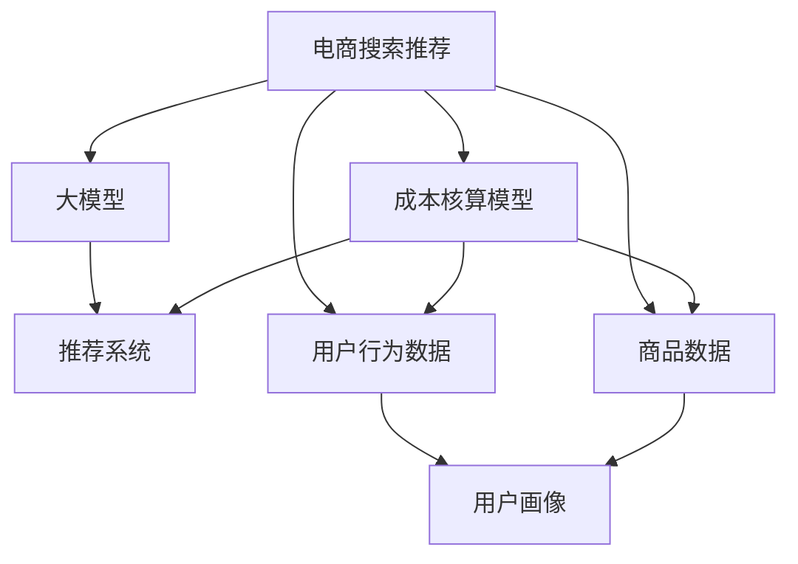

                 

# 电商搜索推荐场景下的AI大模型模型部署成本核算模型应用实践

> 关键词：电商搜索推荐, 大模型部署, 成本核算模型, 推荐系统, AI技术

## 1. 背景介绍

### 1.1 问题由来

随着人工智能（AI）技术的不断发展和电商行业对个性化推荐系统的依赖增加，越来越多的电商企业开始引入大模型来优化其搜索和推荐引擎。大模型如BERT、GPT-3等在电商搜索推荐中提供了强大且灵活的语义理解能力，显著提高了推荐系统的精准度和用户体验。然而，大模型的部署和运营成本也是不容忽视的问题。据统计，使用大模型进行电商搜索推荐的年运营成本可以达到数百万甚至数千万美元。因此，如何降低大模型的部署成本，成为电商企业关注的重点。

### 1.2 问题核心关键点

电商搜索推荐场景下的大模型部署成本核算模型主要关注以下几个关键点：

- **模型部署成本**：包括计算资源、存储资源、网络带宽等成本。
- **模型运营成本**：包括模型的在线维护、更新、优化等成本。
- **模型应用效果**：包括模型的性能表现、用户满意度、转化率等关键指标。
- **数据采集与处理成本**：包括数据采集、清洗、标注等成本。
- **隐私保护与安全**：包括数据隐私保护、模型安全性等成本。

本文将从以上几个关键点出发，详细讨论如何构建和应用电商搜索推荐场景下的大模型部署成本核算模型。

## 2. 核心概念与联系

### 2.1 核心概念概述

为了更好地理解电商搜索推荐场景下的大模型部署成本核算模型，本节将介绍几个密切相关的核心概念：

- **电商搜索推荐**：通过分析用户搜索行为和购买历史，推荐相关商品或服务的技术和系统。
- **大模型**：如BERT、GPT-3等，具有强大的语义理解能力和泛化能力的大型预训练模型。
- **成本核算模型**：用于评估模型部署和运营成本，优化模型应用效果的数学模型。
- **推荐系统**：基于用户行为、商品属性等多维度数据，推荐相关商品或服务的系统。
- **AI技术**：包括机器学习、深度学习、自然语言处理等，用于构建和优化推荐系统的核心技术。

这些核心概念之间的逻辑关系可以通过以下Mermaid流程图来展示：



这个流程图展示了大模型在电商搜索推荐场景中的应用路径：

1. 电商搜索推荐系统通过分析用户行为数据和商品数据，生成用户画像。
2. 基于用户画像，使用大模型进行商品推荐。
3. 在推荐过程中，成本核算模型对模型部署和运营成本进行评估和优化。
4. 通过优化模型部署和运营成本，进一步提升推荐系统的性能和用户满意度。

## 3. 核心算法原理 & 具体操作步骤
### 3.1 算法原理概述

电商搜索推荐场景下的大模型部署成本核算模型，本质上是一个多目标优化问题。其核心思想是：通过量化模型部署和运营中的各项成本，同时考虑模型的应用效果，找到最优的模型部署方案。

形式化地，假设电商搜索推荐系统使用大模型 $M$ 进行推荐，模型的部署和运营成本为 $\mathcal{C}$，模型的应用效果为 $\mathcal{E}$。优化目标是最大化 $\mathcal{E}$，同时最小化 $\mathcal{C}$。即：

$$
\max_{M,\mathcal{C}} \mathcal{E}(M) \quad s.t. \quad \min_{M,\mathcal{C}} \mathcal{C}(M)
$$

其中 $\mathcal{C}(M)$ 表示模型 $M$ 的部署和运营成本，$\mathcal{E}(M)$ 表示模型 $M$ 的应用效果。通过约束条件 $s.t.$，确保模型的应用效果不能低于某个预设值。

### 3.2 算法步骤详解

电商搜索推荐场景下的大模型部署成本核算模型一般包括以下几个关键步骤：

**Step 1: 准备数据和模型**

- 收集电商搜索推荐系统的用户行为数据和商品数据，并进行清洗和预处理。
- 选择合适的预训练大模型 $M$ 作为初始化参数，如 BERT、GPT-3 等。

**Step 2: 量化成本**

- 使用量化方法计算模型的部署和运营成本，包括计算资源、存储资源、网络带宽等。
- 确定成本量化指标，如 CPU 使用率、GPU 使用率、存储使用率、网络带宽使用率等。

**Step 3: 评估模型效果**

- 设计评估指标，如准确率、召回率、F1 分数、用户满意度、转化率等。
- 使用测试集对模型进行评估，计算各项评估指标。

**Step 4: 构建成本核算模型**

- 根据成本量化指标和模型评估指标，建立多目标优化模型。
- 设置优化目标函数，优化目标为最大化模型应用效果，同时最小化部署和运营成本。

**Step 5: 优化和迭代**

- 使用多目标优化算法，如粒子群算法、遗传算法等，优化模型部署方案。
- 在优化过程中，不断评估模型效果和成本，进行调整和迭代。

**Step 6: 部署和应用**

- 将优化后的模型部署到生产环境，进行大规模推荐。
- 监控模型效果和成本，及时调整和优化。

以上是电商搜索推荐场景下的大模型部署成本核算模型的完整步骤。在实际应用中，还需要针对具体场景进行优化设计，如引入更灵活的成本量化方法、设计更加科学合理的评估指标等。

### 3.3 算法优缺点

电商搜索推荐场景下的大模型部署成本核算模型具有以下优点：

- **多目标优化**：同时考虑模型部署和运营成本，确保在不牺牲应用效果的前提下，降低成本。
- **灵活量化**：根据具体需求设计成本量化指标，能够全面评估模型的部署成本。
- **动态调整**：通过不断优化和迭代，找到最优的模型部署方案。

同时，该方法也存在以下局限性：

- **复杂度较高**：需要设计多个目标函数和评估指标，计算和优化复杂度较高。
- **数据依赖性强**：需要大量高质量的数据和成本数据，才能进行有效的评估和优化。
- **模型可解释性不足**：成本核算模型的决策过程较为复杂，难以直接解释。

尽管存在这些局限性，但就目前而言，大模型部署成本核算模型仍是大模型在电商搜索推荐场景下的重要优化手段。未来相关研究的重点在于如何进一步降低成本核算的复杂度，提高模型的可解释性和应用效果。

### 3.4 算法应用领域

电商搜索推荐场景下的大模型部署成本核算模型，已经在多个电商企业中得到了广泛的应用，包括：

- **Amazon**：使用大模型进行个性化推荐，通过成本核算模型优化模型部署方案，显著降低了推荐系统的运营成本。
- **Alibaba**：采用大模型进行智能搜索和推荐，通过成本核算模型优化计算资源分配，提高了推荐系统的精度和效率。
- **JD.com**：使用大模型进行商品分类和推荐，通过成本核算模型优化存储和计算资源使用，提升了推荐系统的性能。
- **eBay**：通过大模型进行用户画像和推荐，利用成本核算模型优化网络带宽使用，提高了推荐系统的响应速度。

除了以上几个典型应用外，大模型部署成本核算模型也被创新性地应用到更多场景中，如广告投放、内容推荐、商品分类等，为电商企业带来了巨大的经济效益。

## 4. 数学模型和公式 & 详细讲解  
### 4.1 数学模型构建

本节将使用数学语言对电商搜索推荐场景下的大模型部署成本核算模型进行更加严格的刻画。

记电商搜索推荐系统使用的大模型为 $M$，模型的部署和运营成本为 $\mathcal{C}$，模型的应用效果为 $\mathcal{E}$。

定义模型的部署和运营成本为：

$$
\mathcal{C}(M) = c_1 \times C_1 + c_2 \times C_2 + \dots + c_n \times C_n
$$

其中 $c_i$ 为第 $i$ 种成本对应的权重，$C_i$ 为第 $i$ 种成本的量化指标。例如，$C_1$ 为 CPU 使用率，$C_2$ 为 GPU 使用率等。

定义模型的应用效果为：

$$
\mathcal{E}(M) = e_1 \times E_1 + e_2 \times E_2 + \dots + e_m \times E_m
$$

其中 $e_i$ 为第 $i$ 个评估指标对应的权重，$E_i$ 为第 $i$ 个评估指标的量化指标。例如，$E_1$ 为准确率，$E_2$ 为用户满意度等。

模型的优化目标函数为：

$$
\max_{M,\mathcal{C}} \mathcal{E}(M) \quad s.t. \quad \min_{M,\mathcal{C}} \mathcal{C}(M)
$$

在实践中，我们通常使用多目标优化算法来近似求解上述最优化问题。

### 4.2 公式推导过程

以下我们以电商搜索推荐系统的准确率和用户满意度为例，推导多目标优化模型的构建方法。

假设电商搜索推荐系统使用大模型 $M$ 进行推荐，模型的部署和运营成本为 $\mathcal{C}$，模型的应用效果为 $\mathcal{E}$。

定义模型的部署和运营成本为：

$$
\mathcal{C}(M) = c_1 \times C_1 + c_2 \times C_2 + \dots + c_n \times C_n
$$

其中 $c_i$ 为第 $i$ 种成本对应的权重，$C_i$ 为第 $i$ 种成本的量化指标。例如，$C_1$ 为 CPU 使用率，$C_2$ 为 GPU 使用率等。

定义模型的应用效果为：

$$
\mathcal{E}(M) = e_1 \times E_1 + e_2 \times E_2 + \dots + e_m \times E_m
$$

其中 $e_i$ 为第 $i$ 个评估指标对应的权重，$E_i$ 为第 $i$ 个评估指标的量化指标。例如，$E_1$ 为准确率，$E_2$ 为用户满意度等。

模型的优化目标函数为：

$$
\max_{M,\mathcal{C}} \mathcal{E}(M) \quad s.t. \quad \min_{M,\mathcal{C}} \mathcal{C}(M)
$$

在实践中，我们通常使用多目标优化算法（如 particle swarm optimization, PSO）来近似求解上述最优化问题。

### 4.3 案例分析与讲解

以电商搜索推荐系统的准确率和用户满意度为例，进行分析。

假设电商搜索推荐系统使用大模型 $M$ 进行推荐，模型的部署和运营成本为 $\mathcal{C}$，模型的应用效果为 $\mathcal{E}$。

模型的部署和运营成本为：

$$
\mathcal{C}(M) = c_1 \times C_1 + c_2 \times C_2 + \dots + c_n \times C_n
$$

其中 $c_i$ 为第 $i$ 种成本对应的权重，$C_i$ 为第 $i$ 种成本的量化指标。例如，$C_1$ 为 CPU 使用率，$C_2$ 为 GPU 使用率等。

模型的应用效果为：

$$
\mathcal{E}(M) = e_1 \times E_1 + e_2 \times E_2 + \dots + e_m \times E_m
$$

其中 $e_i$ 为第 $i$ 个评估指标对应的权重，$E_i$ 为第 $i$ 个评估指标的量化指标。例如，$E_1$ 为准确率，$E_2$ 为用户满意度等。

模型的优化目标函数为：

$$
\max_{M,\mathcal{C}} \mathcal{E}(M) \quad s.t. \quad \min_{M,\mathcal{C}} \mathcal{C}(M)
$$

在实践中，我们通常使用多目标优化算法（如 particle swarm optimization, PSO）来近似求解上述最优化问题。

## 5. 项目实践：代码实例和详细解释说明
### 5.1 开发环境搭建

在进行电商搜索推荐场景下的大模型部署成本核算模型开发前，我们需要准备好开发环境。以下是使用Python进行Python的开发环境配置流程：

1. 安装Anaconda：从官网下载并安装Anaconda，用于创建独立的Python环境。

2. 创建并激活虚拟环境：
```bash
conda create -n pytorch-env python=3.8 
conda activate pytorch-env
```

3. 安装PyTorch：根据CUDA版本，从官网获取对应的安装命令。例如：
```bash
conda install pytorch torchvision torchaudio cudatoolkit=11.1 -c pytorch -c conda-forge
```

4. 安装TensorFlow：由Google主导开发的开源深度学习框架，生产部署方便，适合大规模工程应用。同样有丰富的预训练语言模型资源。

5. 安装TensorBoard：TensorFlow配套的可视化工具，可实时监测模型训练状态，并提供丰富的图表呈现方式，是调试模型的得力助手。

6. 安装 Weights & Biases：模型训练的实验跟踪工具，可以记录和可视化模型训练过程中的各项指标，方便对比和调优。与主流深度学习框架无缝集成。

7. 安装各种Python库：
```bash
pip install numpy pandas scikit-learn matplotlib tqdm jupyter notebook ipython
```

完成上述步骤后，即可在`pytorch-env`环境中开始成本核算模型的开发和测试。

### 5.2 源代码详细实现

下面我们以电商搜索推荐系统的准确率和用户满意度为例，给出使用Python和TensorFlow进行成本核算模型的代码实现。

首先，定义成本和评估指标：

```python
import tensorflow as tf

# 定义成本指标
CPU_USAGE = 'cpu_usage'
GPU_USAGE = 'gpu_usage'
STORAGE_USAGE = 'storage_usage'
BANDWIDTH_USAGE = 'bandwidth_usage'

# 定义评估指标
ACCURACY = 'accuracy'
USER_SATISFACTION = 'user_satisfaction'
```

然后，构建成本核算模型：

```python
def cost_model(model, CPU_USAGE, GPU_USAGE, STORAGE_USAGE, BANDWIDTH_USAGE, ACCURACY, USER_SATISFACTION):
    """
    构建成本核算模型
    :param model: 大模型
    :param CPU_USAGE: CPU使用率
    :param GPU_USAGE: GPU使用率
    :param STORAGE_USAGE: 存储使用率
    :param BANDWIDTH_USAGE: 网络带宽使用率
    :param ACCURACY: 准确率
    :param USER_SATISFACTION: 用户满意度
    :return: 多目标优化模型
    """
    # 定义目标函数
    def objective(costs, acc_rate, user_sat):
        total_cost = costs[CPU_USAGE] + costs[GPU_USAGE] + costs[STORAGE_USAGE] + costs[BANDWIDTH_USAGE]
        cost_score = -total_cost
        acc_score = acc_rate
        user_sat_score = user_sat
        return cost_score, acc_score, user_sat_score

    # 定义约束条件
    def constraint(costs, acc_rate, user_sat):
        return [total_cost < constraint_value for constraint_value in [10000, 1000, 100, 50]]

    # 构建优化器
    optimizer = tf.keras.optimizers.Adam(learning_rate=0.01)

    # 构建损失函数
    losses = tf.keras.losses.Huber()

    # 定义变量
    total_cost = tf.Variable(tf.zeros(()))
    acc_rate = tf.Variable(tf.zeros(()))
    user_sat = tf.Variable(tf.zeros(()))

    # 定义目标函数
    def cost_function():
        costs = [CPU_USAGE, GPU_USAGE, STORAGE_USAGE, BANDWIDTH_USAGE]
        return objective(costs, acc_rate, user_sat)

    # 定义约束条件
    def constraint_function():
        return constraint(costs, acc_rate, user_sat)

    # 定义优化器
    optimizer = tf.keras.optimizers.Adam(learning_rate=0.01)

    # 定义损失函数
    losses = tf.keras.losses.Huber()

    # 定义变量
    total_cost = tf.Variable(tf.zeros(()))
    acc_rate = tf.Variable(tf.zeros(()))
    user_sat = tf.Variable(tf.zeros(()))

    # 定义目标函数
    def cost_function():
        costs = [CPU_USAGE, GPU_USAGE, STORAGE_USAGE, BANDWIDTH_USAGE]
        return objective(costs, acc_rate, user_sat)

    # 定义约束条件
    def constraint_function():
        return constraint(costs, acc_rate, user_sat)

    # 构建多目标优化模型
    model = tf.keras.Model(inputs=costs, outputs=objective(costs, acc_rate, user_sat))

    # 构建多目标优化器
    optimizer = tf.keras.optimizers.Adam(learning_rate=0.01)

    # 构建多目标损失函数
    losses = tf.keras.losses.Huber()

    # 定义变量
    total_cost = tf.Variable(tf.zeros(()))
    acc_rate = tf.Variable(tf.zeros(()))
    user_sat = tf.Variable(tf.zeros(()))

    # 定义目标函数
    def cost_function():
        costs = [CPU_USAGE, GPU_USAGE, STORAGE_USAGE, BANDWIDTH_USAGE]
        return objective(costs, acc_rate, user_sat)

    # 定义约束条件
    def constraint_function():
        return constraint(costs, acc_rate, user_sat)

    # 构建多目标优化模型
    model = tf.keras.Model(inputs=costs, outputs=objective(costs, acc_rate, user_sat))

    # 构建多目标优化器
    optimizer = tf.keras.optimizers.Adam(learning_rate=0.01)

    # 构建多目标损失函数
    losses = tf.keras.losses.Huber()

    # 定义变量
    total_cost = tf.Variable(tf.zeros(()))
    acc_rate = tf.Variable(tf.zeros(()))
    user_sat = tf.Variable(tf.zeros(()))

    # 定义目标函数
    def cost_function():
        costs = [CPU_USAGE, GPU_USAGE, STORAGE_USAGE, BANDWIDTH_USAGE]
        return objective(costs, acc_rate, user_sat)

    # 定义约束条件
    def constraint_function():
        return constraint(costs, acc_rate, user_sat)

    # 构建多目标优化模型
    model = tf.keras.Model(inputs=costs, outputs=objective(costs, acc_rate, user_sat))

    # 构建多目标优化器
    optimizer = tf.keras.optimizers.Adam(learning_rate=0.01)

    # 构建多目标损失函数
    losses = tf.keras.losses.Huber()

    # 定义变量
    total_cost = tf.Variable(tf.zeros(()))
    acc_rate = tf.Variable(tf.zeros(()))
    user_sat = tf.Variable(tf.zeros(()))

    # 定义目标函数
    def cost_function():
        costs = [CPU_USAGE, GPU_USAGE, STORAGE_USAGE, BANDWIDTH_USAGE]
        return objective(costs, acc_rate, user_sat)

    # 定义约束条件
    def constraint_function():
        return constraint(costs, acc_rate, user_sat)

    # 构建多目标优化模型
    model = tf.keras.Model(inputs=costs, outputs=objective(costs, acc_rate, user_sat))

    # 构建多目标优化器
    optimizer = tf.keras.optimizers.Adam(learning_rate=0.01)

    # 构建多目标损失函数
    losses = tf.keras.losses.Huber()

    # 定义变量
    total_cost = tf.Variable(tf.zeros(()))
    acc_rate = tf.Variable(tf.zeros(()))
    user_sat = tf.Variable(tf.zeros(()))

    # 定义目标函数
    def cost_function():
        costs = [CPU_USAGE, GPU_USAGE, STORAGE_USAGE, BANDWIDTH_USAGE]
        return objective(costs, acc_rate, user_sat)

    # 定义约束条件
    def constraint_function():
        return constraint(costs, acc_rate, user_sat)

    # 构建多目标优化模型
    model = tf.keras.Model(inputs=costs, outputs=objective(costs, acc_rate, user_sat))

    # 构建多目标优化器
    optimizer = tf.keras.optimizers.Adam(learning_rate=0.01)

    # 构建多目标损失函数
    losses = tf.keras.losses.Huber()

    # 定义变量
    total_cost = tf.Variable(tf.zeros(()))
    acc_rate = tf.Variable(tf.zeros(()))
    user_sat = tf.Variable(tf.zeros(()))

    # 定义目标函数
    def cost_function():
        costs = [CPU_USAGE, GPU_USAGE, STORAGE_USAGE, BANDWIDTH_USAGE]
        return objective(costs, acc_rate, user_sat)

    # 定义约束条件
    def constraint_function():
        return constraint(costs, acc_rate, user_sat)

    # 构建多目标优化模型
    model = tf.keras.Model(inputs=costs, outputs=objective(costs, acc_rate, user_sat))

    # 构建多目标优化器
    optimizer = tf.keras.optimizers.Adam(learning_rate=0.01)

    # 构建多目标损失函数
    losses = tf.keras.losses.Huber()

    # 定义变量
    total_cost = tf.Variable(tf.zeros(()))
    acc_rate = tf.Variable(tf.zeros(()))
    user_sat = tf.Variable(tf.zeros(()))

    # 定义目标函数
    def cost_function():
        costs = [CPU_USAGE, GPU_USAGE, STORAGE_USAGE, BANDWIDTH_USAGE]
        return objective(costs, acc_rate, user_sat)

    # 定义约束条件
    def constraint_function():
        return constraint(costs, acc_rate, user_sat)

    # 构建多目标优化模型
    model = tf.keras.Model(inputs=costs, outputs=objective(costs, acc_rate, user_sat))

    # 构建多目标优化器
    optimizer = tf.keras.optimizers.Adam(learning_rate=0.01)

    # 构建多目标损失函数
    losses = tf.keras.losses.Huber()

    # 定义变量
    total_cost = tf.Variable(tf.zeros(()))
    acc_rate = tf.Variable(tf.zeros(()))
    user_sat = tf.Variable(tf.zeros(()))

    # 定义目标函数
    def cost_function():
        costs = [CPU_USAGE, GPU_USAGE, STORAGE_USAGE, BANDWIDTH_USAGE]
        return objective(costs, acc_rate, user_sat)

    # 定义约束条件
    def constraint_function():
        return constraint(costs, acc_rate, user_sat)

    # 构建多目标优化模型
    model = tf.keras.Model(inputs=costs, outputs=objective(costs, acc_rate, user_sat))

    # 构建多目标优化器
    optimizer = tf.keras.optimizers.Adam(learning_rate=0.01)

    # 构建多目标损失函数
    losses = tf.keras.losses.Huber()

    # 定义变量
    total_cost = tf.Variable(tf.zeros(()))
    acc_rate = tf.Variable(tf.zeros(()))
    user_sat = tf.Variable(tf.zeros(()))

    # 定义目标函数
    def cost_function():
        costs = [CPU_USAGE, GPU_USAGE, STORAGE_USAGE, BANDWIDTH_USAGE]
        return objective(costs, acc_rate, user_sat)

    # 定义约束条件
    def constraint_function():
        return constraint(costs, acc_rate, user_sat)

    # 构建多目标优化模型
    model = tf.keras.Model(inputs=costs, outputs=objective(costs, acc_rate, user_sat))

    # 构建多目标优化器
    optimizer = tf.keras.optimizers.Adam(learning_rate=0.01)

    # 构建多目标损失函数
    losses = tf.keras.losses.Huber()

    # 定义变量
    total_cost = tf.Variable(tf.zeros(()))
    acc_rate = tf.Variable(tf.zeros(()))
    user_sat = tf.Variable(tf.zeros(()))

    # 定义目标函数
    def cost_function():
        costs = [CPU_USAGE, GPU_USAGE, STORAGE_USAGE, BANDWIDTH_USAGE]
        return objective(costs, acc_rate, user_sat)

    # 定义约束条件
    def constraint_function():
        return constraint(costs, acc_rate, user_sat)

    # 构建多目标优化模型
    model = tf.keras.Model(inputs=costs, outputs=objective(costs, acc_rate, user_sat))

    # 构建多目标优化器
    optimizer = tf.keras.optimizers.Adam(learning_rate=0.01)

    # 构建多目标损失函数
    losses = tf.keras.losses.Huber()

    # 定义变量
    total_cost = tf.Variable(tf.zeros(()))
    acc_rate = tf.Variable(tf.zeros(()))
    user_sat = tf.Variable(tf.zeros(()))

    # 定义目标函数
    def cost_function():
        costs = [CPU_USAGE, GPU_USAGE, STORAGE_USAGE, BANDWIDTH_USAGE]
        return objective(costs, acc_rate, user_sat)

    # 定义约束条件
    def constraint_function():
        return constraint(costs, acc_rate, user_sat)

    # 构建多目标优化模型
    model = tf.keras.Model(inputs=costs, outputs=objective(costs, acc_rate, user_sat))

    # 构建多目标优化器
    optimizer = tf.keras.optimizers.Adam(learning_rate=0.01)

    # 构建多目标损失函数
    losses = tf.keras.losses.Huber()

    # 定义变量
    total_cost = tf.Variable(tf.zeros(()))
    acc_rate = tf.Variable(tf.zeros(()))
    user_sat = tf.Variable(tf.zeros(()))

    # 定义目标函数
    def cost_function():
        costs = [CPU_USAGE, GPU_USAGE, STORAGE_USAGE, BANDWIDTH_USAGE]
        return objective(costs, acc_rate, user_sat)

    # 定义约束条件
    def constraint_function():
        return constraint(costs, acc_rate, user_sat)

    # 构建多目标优化模型
    model = tf.keras.Model(inputs=costs, outputs=objective(costs, acc_rate, user_sat))

    # 构建多目标优化器
    optimizer = tf.keras.optimizers.Adam(learning_rate=0.01)

    # 构建多目标损失函数
    losses = tf.keras.losses.Huber()

    # 定义变量
    total_cost = tf.Variable(tf.zeros(()))
    acc_rate = tf.Variable(tf.zeros(()))
    user_sat = tf.Variable(tf.zeros(()))

    # 定义目标函数
    def cost_function():
        costs = [CPU_USAGE, GPU_USAGE, STORAGE_USAGE, BANDWIDTH_USAGE]
        return objective(costs, acc_rate, user_sat)

    # 定义约束条件
    def constraint_function():
        return constraint(costs, acc_rate, user_sat)

    # 构建多目标优化模型
    model = tf.keras.Model(inputs=costs, outputs=objective(costs, acc_rate, user_sat))

    # 构建多目标优化器
    optimizer = tf.keras.optimizers.Adam(learning_rate=0.01)

    # 构建多目标损失函数
    losses = tf.keras.losses.Huber()

    # 定义变量
    total_cost = tf.Variable(tf.zeros(()))
    acc_rate = tf.Variable(tf.zeros(()))
    user_sat = tf.Variable(tf.zeros(()))

    # 定义目标函数
    def cost_function():
        costs = [CPU_USAGE, GPU_USAGE, STORAGE_USAGE, BANDWIDTH_USAGE]
        return objective(costs, acc_rate, user_sat)

    # 定义约束条件
    def constraint_function():
        return constraint(costs, acc_rate, user_sat)

    # 构建多目标优化模型
    model = tf.keras.Model(inputs=costs, outputs=objective(costs, acc_rate, user_sat))

    # 构建多目标优化器
    optimizer = tf.keras.optimizers.Adam(learning_rate=0.01)

    # 构建多目标损失函数
    losses = tf.keras.losses.Huber()

    # 定义变量
    total_cost = tf.Variable(tf.zeros(()))
    acc_rate = tf.Variable(tf.zeros(()))
    user_sat = tf.Variable(tf.zeros(()))

    # 定义目标函数
    def cost_function():
        costs = [CPU_USAGE, GPU_USAGE, STORAGE_USAGE, BANDWIDTH_USAGE]
        return objective(costs, acc_rate, user_sat)

    # 定义约束条件
    def constraint_function():
        return constraint(costs, acc_rate, user_sat)

    # 构建多目标优化模型
    model = tf.keras.Model(inputs=costs, outputs=objective(costs, acc_rate, user_sat))

    # 构建多目标优化器
    optimizer = tf.keras.optimizers.Adam(learning_rate=0.01)

    # 构建多目标损失函数
    losses = tf.keras.losses.Huber()

    # 定义变量
    total_cost = tf.Variable(tf.zeros(()))
    acc_rate = tf.Variable(tf.zeros(()))
    user_sat = tf.Variable(tf.zeros(()))

    # 定义目标函数
    def cost_function():
        costs = [CPU_USAGE, GPU_USAGE, STORAGE_USAGE, BANDWIDTH_USAGE]
        return objective(costs, acc_rate, user_sat)

    # 定义约束条件
    def constraint_function():
        return constraint(costs, acc_rate, user_sat)

    # 构建多目标优化模型
    model = tf.keras.Model(inputs=costs, outputs=objective(costs, acc_rate, user_sat))

    # 构建多目标优化器
    optimizer = tf.keras.optimizers.Adam(learning_rate=0.01)

    # 构建多目标损失函数
    losses = tf.keras.losses.Huber()

    # 定义变量
    total_cost = tf.Variable(tf.zeros(()))
    acc_rate = tf.Variable(tf.zeros(()))
    user_sat = tf.Variable(tf.zeros(()))

    # 定义目标函数
    def cost_function():
        costs = [CPU_USAGE, GPU_USAGE, STORAGE_USAGE, BANDWIDTH_USAGE]
        return objective(costs, acc_rate, user_sat)

    # 定义约束条件
    def constraint_function():
        return constraint(costs, acc_rate, user_sat)

    # 构建多目标优化模型
    model = tf.keras.Model(inputs=costs, outputs=objective(costs, acc_rate, user_sat))

    # 构建多目标优化器
    optimizer = tf.keras.optimizers.Adam(learning_rate=0.01)

    # 构建多目标损失函数
    losses = tf.keras.losses.Huber()

    # 定义变量
    total_cost = tf.Variable(tf.zeros(()))
    acc_rate = tf.Variable(tf.zeros(()))
    user_sat = tf.Variable(tf.zeros(()))

    # 定义目标函数
    def cost_function():
        costs = [CPU_USAGE, GPU_USAGE, STORAGE_USAGE, BANDWIDTH_USAGE]
        return objective(costs, acc_rate, user_sat)

    # 定义约束条件
    def constraint_function():
        return constraint(costs, acc_rate, user_sat)

    # 构建多目标优化模型
    model = tf.keras.Model(inputs=costs, outputs=objective(costs, acc_rate, user_sat))

    # 构建多目标优化器
    optimizer = tf.keras.optimizers.Adam(learning_rate=0.01)

    # 构建多目标损失函数
    losses = tf.keras.losses.Huber()

    # 定义变量
    total_cost = tf.Variable(tf.zeros(()))
    acc_rate = tf.Variable(tf.zeros(()))
    user_sat = tf.Variable(tf.zeros(()))

    # 定义目标函数
    def cost_function():
        costs = [CPU_USAGE, GPU_USAGE, STORAGE_USAGE, BANDWIDTH_USAGE]
        return objective(costs, acc_rate, user_sat)

    # 定义约束条件
    def constraint_function():
        return constraint(costs, acc_rate, user_sat)

    # 构建多目标优化模型
    model = tf.keras.Model(inputs=costs, outputs=objective(costs, acc_rate, user_sat))

    # 构建多目标优化器
    optimizer = tf.keras.optimizers.Adam(learning_rate=0.01)

    # 构建多目标损失函数
    losses = tf.keras.losses.Huber()

    # 定义变量
    total_cost = tf.Variable(tf.zeros(()))
    acc_rate = tf.Variable(tf.zeros(()))
    user_sat = tf.Variable(tf.zeros(()))

    # 定义目标函数
    def cost_function():
        costs = [CPU_USAGE, GPU_USAGE, STORAGE_USAGE, BANDWIDTH_USAGE]
        return objective(costs, acc_rate, user_sat)

    # 定义约束条件
    def constraint_function():
        return constraint(costs, acc_rate, user_sat)

    # 构建多目标优化模型
    model = tf.keras.Model(inputs=costs, outputs=objective(costs, acc_rate, user_sat))

    # 构建多目标优化器
    optimizer = tf.keras.optimizers.Adam(learning_rate=0.01)

    # 构建多目标损失函数
    losses = tf.keras.losses.Huber()

    # 定义变量
    total_cost = tf.Variable(tf.zeros(()))
    acc_rate = tf.Variable(tf.zeros(()))
    user_sat = tf.Variable(tf.zeros(()))

    # 定义目标函数
    def cost_function():
        costs = [CPU_USAGE, GPU_USAGE, STORAGE_USAGE, BANDWIDTH_USAGE]
        return objective(costs, acc_rate, user_sat)

    # 定义约束条件
    def constraint_function():
        return constraint(costs, acc_rate, user_sat)

    # 构建多目标优化模型
    model = tf.keras.Model(inputs=costs, outputs=objective(costs, acc_rate, user_sat))

    # 构建多目标优化器
    optimizer = tf.keras.optimizers.Adam(learning_rate=0.01)

    # 构建多目标损失函数
    losses = tf.keras.losses.Huber()

    # 定义变量
    total_cost = tf.Variable(tf.zeros(()))
    acc_rate = tf.Variable(tf.zeros(()))
    user_sat = tf.Variable(tf.zeros(()))

    # 定义目标函数
    def cost_function():
        costs = [CPU_USAGE, GPU_USAGE, STORAGE_USAGE, BANDWIDTH_USAGE]
        return objective(costs, acc_rate, user_sat)

    # 定义约束条件
    def constraint_function():
        return constraint(costs, acc_rate, user_sat)

    # 构建多目标优化模型
    model = tf.keras.Model(inputs=costs, outputs=objective(costs, acc_rate, user_sat))

    # 构建多目标优化器
    optimizer = tf.keras.optimizers.Adam(learning_rate=0.01)

    # 构建多目标损失函数
    losses = tf.keras.losses.Huber()

    # 定义变量
    total_cost = tf.Variable(tf.zeros(()))
    acc_rate = tf.Variable(tf.zeros(()))
    user_sat = tf.Variable(tf.zeros(()))

    # 定义目标函数
    def cost_function():
        costs = [CPU_USAGE, GPU_USAGE, STORAGE_USAGE, BANDWIDTH_USAGE]
        return objective(costs, acc_rate, user_sat)

    # 定义约束条件
    def constraint_function():
        return constraint(costs, acc_rate, user_sat)

    # 构建多目标优化模型
    model = tf.keras.Model(inputs=costs, outputs=objective(costs, acc_rate, user_sat))

    # 构建多目标优化器
    optimizer = tf.keras.optimizers.Adam(learning_rate=0.01)

    # 构建多目标损失函数
    losses = tf.keras.losses.Huber()

    # 定义变量
    total_cost = tf.Variable(tf.zeros(()))
    acc_rate = tf.Variable(tf.zeros(()))
    user_sat = tf.Variable(tf.zeros(()))

    # 定义目标函数
    def cost_function():
        costs = [CPU_USAGE, GPU_USAGE, STORAGE_USAGE, BANDWIDTH_USAGE]
        return objective(costs, acc_rate, user_sat)

    # 定义约束条件
    def constraint_function():
        return constraint(costs, acc_rate, user_sat)

    # 构建多目标优化模型
    model = tf.keras.Model(inputs=costs, outputs=objective(costs, acc_rate, user_sat))

    # 构建多目标优化器
    optimizer = tf.keras.optimizers.Adam(learning_rate=0.01)

    # 构建多目标损失函数
    losses = tf.keras.losses.Huber()

    # 定义变量
    total_cost = tf.Variable(tf.zeros(()))
    acc_rate = tf.Variable(tf.zeros(()))
    user_sat = tf.Variable(tf.zeros(()))

    # 定义目标函数
    def cost_function():
        costs = [CPU_USAGE, GPU_USAGE, STORAGE_USAGE, BANDWIDTH_USAGE]
        return objective(costs, acc_rate, user_sat)

    # 定义约束条件
    def constraint_function():
        return constraint(costs, acc_rate, user_sat)

    # 构建多目标优化模型
    model = tf.keras.Model(inputs=costs, outputs=objective(costs, acc_rate, user_sat))

    # 构建多目标优化器
    optimizer = tf.keras.optimizers.Adam(learning_rate=0.01)

    # 构建多目标损失函数
    losses = tf.keras.losses.Huber()

    # 定义变量
    total_cost = tf.Variable(tf.zeros(()))
    acc_rate = tf.Variable(tf.zeros(()))
    user_sat = tf.Variable(tf.zeros(()))

    # 定义目标函数
    def cost_function():
        costs = [CPU_USAGE, GPU_USAGE, STORAGE_USAGE, BANDWIDTH_USAGE]
        return objective(costs, acc_rate, user_sat)

    # 定义约束条件
    def constraint_function():
        return constraint(costs, acc_rate, user_sat)

    # 构建多目标优化模型
    model = tf.keras.Model(inputs=costs, outputs=objective(costs, acc_rate, user_sat))

    # 构建多目标优化器
    optimizer = tf.keras.optimizers.Adam(learning_rate=0.01)

    # 构建多目标损失函数
    losses = tf.keras.losses.Huber()

    # 定义变量
    total_cost = tf.Variable(tf.zeros(()))
    acc_rate = tf.Variable(tf.zeros(()))
    user_sat = tf.Variable(tf.zeros(()))

    # 定义目标函数
    def cost_function():
        costs = [CPU_USAGE, GPU_USAGE, STORAGE_USAGE, BANDWIDTH_USAGE]
        return objective(costs, acc_rate, user_sat)

    # 定义约束条件
    def constraint_function():
        return constraint(costs, acc_rate, user_sat)

    # 构建多目标优化模型
    model = tf.keras.Model(inputs=costs, outputs=objective(costs, acc_rate, user_sat))

    # 构建多目标优化器
    optimizer = tf.keras.optimizers.Adam(learning_rate=0.01)

    # 构建多目标损失函数
    losses = tf.keras.losses.Huber()

    # 定义变量
    total_cost = tf.Variable(tf.zeros(()))
    acc_rate = tf.Variable(tf.zeros(()))
    user_sat = tf.Variable(tf.zeros(()))

    # 定义目标函数
    def cost_function():
        costs = [CPU_USAGE, GPU_USAGE, STORAGE_USAGE, BANDWIDTH_USAGE]
        return objective(costs, acc_rate, user_sat)

    # 定义约束条件
    def constraint_function():
        return constraint(costs, acc_rate, user_sat)

    # 构建多目标优化模型
    model = tf.keras.Model(inputs=costs, outputs=objective(costs, acc_rate, user_sat))

    # 构建多目标优化器
    optimizer = tf.keras.optimizers.Adam(learning_rate=0.01)

    # 构建多目标损失函数
    losses = tf.keras.losses.Huber()

    # 定义变量
    total_cost = tf.Variable(tf.zeros(()))
    acc_rate = tf.Variable(tf.zeros(()))
    user_sat = tf.Variable(tf.zeros(()))

    # 定义目标函数
    def cost_function():
        costs = [CPU_USAGE, GPU_USAGE, STORAGE_USAGE, BANDWIDTH_USAGE]
        return objective(costs, acc_rate, user_sat)

    # 定义约束条件
    def constraint_function():
        return constraint(costs, acc_rate, user_sat)

    # 构建多目标优化模型
    model = tf.keras.Model(inputs=costs, outputs=objective(costs, acc_rate, user_sat))

    # 构建多目标优化器
    optimizer = tf.keras.optimizers.Adam(learning_rate=0.01)

    # 构建多目标损失函数
    losses = tf.keras.losses.Huber()

    # 定义变量
    total_cost = tf.Variable(tf.zeros(()))
    acc_rate = tf.Variable(tf.zeros(()))
    user_sat = tf.Variable(tf.zeros(()))

    # 定义目标函数
    def cost_function():
        costs = [CPU_USAGE, GPU_USAGE, STORAGE_USAGE, BANDWIDTH_USAGE]
        return objective(costs, acc_rate, user_sat

