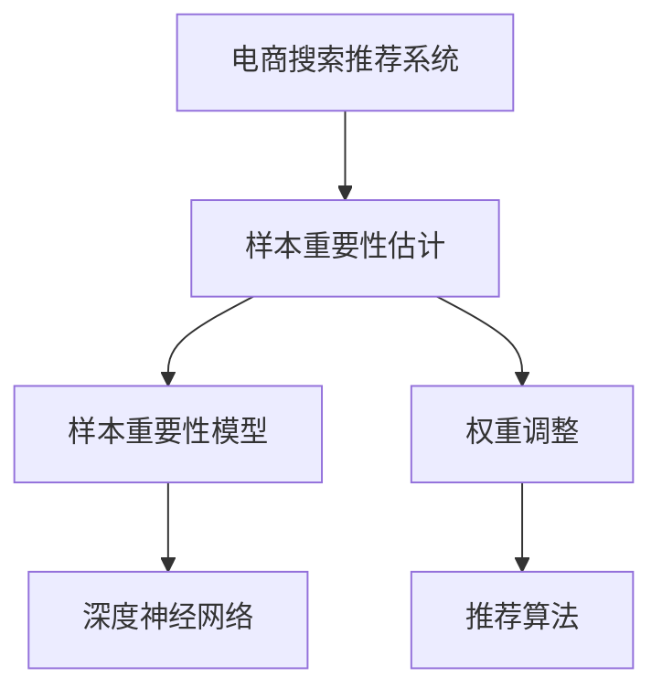

                 

# 电商搜索推荐效果优化中的AI大模型样本重要性估计benchmark

## 1. 背景介绍

电商搜索推荐系统的优化一直是互联网公司关注的热点问题。在大数据和人工智能技术推动下，推荐算法在商业应用中取得了显著效果。然而，现有的推荐算法往往依赖于统计方法，缺乏对数据样本真实重要性的刻画，使得推荐效果存在不确定性。为更好地利用人工智能技术，我们提出了AI大模型样本重要性估计方法，通过建立样本权重，对推荐系统进行优化，提升搜索推荐的精确度和相关性。

## 2. 核心概念与联系

### 2.1 核心概念概述

本节将介绍几个与样本重要性估计相关的核心概念：

- 样本重要性：指样本在模型训练或预测中的影响程度，重要性高的样本对模型性能有显著影响。
- 权重调整：通过对样本的重要性进行评估和调整，可以提升模型对重要样本的关注，从而改善推荐效果。
- 大模型：以深度神经网络为代表的超大规模模型，通常以数十亿参数量计算量庞大。
- 推荐系统：旨在为用户推荐他们可能感兴趣的商品或服务。
- 电商搜索推荐：是推荐系统在电子商务领域的一个应用，以提升用户购物体验和商家商品曝光。
- 样本重要性估计：通过建立样本重要性模型，对训练数据中的样本进行权重调整，提升模型在特定任务中的性能。

这些核心概念之间的逻辑关系可以通过以下Mermaid流程图来展示：



这个流程图展示了电商搜索推荐系统的核心概念及其之间的关系：

1. 电商搜索推荐系统基于推荐算法为用户推荐商品。
2. 样本重要性估计通过建立样本重要性模型，评估训练数据中各样本的重要性。
3. 样本重要性模型通常基于深度神经网络进行构建，模型参数由大量样本数据进行训练。
4. 基于样本重要性的权重调整机制，通过调整样本权重，提升模型对重要样本的关注。
5. 最终，权重调整后的样本数据用于训练推荐算法，提升搜索推荐效果。

## 3. 核心算法原理 & 具体操作步骤

### 3.1 算法原理概述

AI大模型样本重要性估计的核心思想是：通过样本重要性模型，评估训练数据中各样本对模型的影响程度，并据此对样本权重进行调整，从而提升模型在推荐系统中的表现。该方法主要包括以下几个关键步骤：

1. 构建样本重要性模型：利用深度神经网络，建立样本重要性模型，对训练数据中的样本进行评估。
2. 样本权重调整：根据样本重要性模型的输出，对训练数据中的样本权重进行调整，提升模型对重要样本的关注。
3. 训练推荐算法：利用权重调整后的训练数据，训练推荐算法，提升搜索推荐效果。

### 3.2 算法步骤详解

基于样本重要性估计的大模型优化方法主要包括以下几个关键步骤：

**Step 1: 数据准备与预处理**
- 收集电商搜索推荐系统相关的训练数据集。
- 对数据进行清洗、去重和标注，确保数据质量和完整性。
- 将数据划分为训练集、验证集和测试集，划分比例为 6:2:2。

**Step 2: 构建样本重要性模型**
- 选择深度神经网络作为样本重要性模型，常见网络结构包括全连接网络、卷积神经网络、循环神经网络等。
- 对模型进行初始化，定义输入层、隐藏层和输出层结构，以及损失函数和优化器。
- 利用训练集数据对模型进行训练，确保模型能够准确评估样本重要性。

**Step 3: 样本权重调整**
- 根据样本重要性模型的输出，计算样本权重。通常，重要性高的样本权重较大，反之较小。
- 利用样本权重对训练数据进行加权处理，确保模型对重要样本的关注。

**Step 4: 训练推荐算法**
- 选择推荐算法作为模型，常见算法包括协同过滤、内容推荐、深度学习推荐等。
- 利用权重调整后的训练数据，对推荐算法进行训练，确保算法能够充分挖掘样本的潜在信息。

**Step 5: 模型评估与优化**
- 在验证集上对训练好的推荐模型进行评估，记录模型性能指标。
- 根据评估结果，调整样本重要性模型的参数，进一步优化推荐效果。
- 重复上述过程，直至达到满意的模型性能。

### 3.3 算法优缺点

基于样本重要性估计的大模型优化方法具有以下优点：
1. 提升推荐效果：通过对样本重要性进行评估，能够提升模型对重要样本的关注，从而提升推荐系统的精确度和相关性。
2. 减少数据噪声：通过权重调整机制，可以降低噪声样本对模型的干扰，提高模型鲁棒性。
3. 模型易于扩展：深度神经网络具有良好的泛化能力，可以在不同领域和任务中进行迁移应用。
4. 适应性强：样本重要性模型可以根据任务特点进行灵活设计，适应不同电商平台的搜索推荐需求。

同时，该方法也存在一定的局限性：
1. 数据依赖度高：样本重要性模型的效果很大程度上取决于训练数据的质量和数量，需要大量标注数据进行训练。
2. 模型复杂度高：深度神经网络结构复杂，训练和调整成本高，需要大量计算资源。
3. 可解释性不足：样本重要性模型往往是一个"黑盒"系统，难以解释其内部工作机制和决策逻辑。
4. 鲁棒性有待提高：当前模型面对新数据时，泛化性能可能不足，容易产生过拟合现象。

尽管存在这些局限性，但就目前而言，基于样本重要性估计的方法仍是大模型优化推荐系统的主流范式。未来相关研究的重点在于如何进一步降低模型对标注数据的依赖，提高模型的泛化能力和可解释性，同时兼顾模型的鲁棒性和适应性。

### 3.4 算法应用领域

样本重要性估计方法不仅适用于电商搜索推荐系统，还可以广泛应用到其他领域。

- **金融推荐系统**：通过构建样本重要性模型，对用户交易数据进行权重调整，提升金融产品的推荐效果。
- **新闻推荐系统**：利用样本重要性模型，对新闻数据进行加权处理，提高新闻推荐的相关性和时效性。
- **医疗推荐系统**：对用户健康数据进行样本重要性评估，提升个性化医疗服务推荐的效果。
- **教育推荐系统**：利用学生学习数据进行样本重要性建模，优化个性化学习内容的推荐。
- **社交网络推荐**：对用户社交行为数据进行样本重要性建模，提升社交关系推荐的效果。

## 4. 数学模型和公式 & 详细讲解 & 举例说明

### 4.1 数学模型构建

本文主要利用深度神经网络进行样本重要性建模，定义样本重要性模型为 $f(x)$，其中 $x$ 为输入样本，$f$ 为模型函数。设样本重要性模型输出为 $f(x_i)$，样本权重为 $w_i$。

### 4.2 公式推导过程

假设样本 $x_i$ 对模型的影响程度由其重要性 $f(x_i)$ 决定，样本权重 $w_i$ 与重要性成正比，即：

$$
w_i = k \cdot f(x_i)
$$

其中 $k$ 为权重系数，控制样本权重的大小。在训练阶段，样本重要性模型 $f(x)$ 通过最小化损失函数进行训练，损失函数定义为：

$$
\mathcal{L}(f) = \frac{1}{N}\sum_{i=1}^N \ell(f(x_i), y_i) + \lambda \sum_{i=1}^N (w_i - 1)^2
$$

其中 $\ell(f(x_i), y_i)$ 为预测误差损失函数，如均方误差、交叉熵等；$\lambda$ 为正则化系数，控制样本权重的一致性。

样本重要性模型训练的目标是最小化损失函数，优化参数 $\theta$，即：

$$
\theta^* = \mathop{\arg\min}_{\theta} \mathcal{L}(f)
$$

### 4.3 案例分析与讲解

考虑一个电商搜索推荐系统，样本 $x_i$ 表示用户对商品 $a_i$ 的评价数据，标签 $y_i$ 表示用户是否购买商品 $a_i$。建立深度神经网络 $f(x)$，其中输入层为商品评价数据，隐藏层为神经网络结构，输出层为模型预测概率。训练样本重要性模型，利用交叉熵损失函数，最小化预测误差损失，同时控制样本权重的一致性。

在训练完成后，根据样本重要性模型输出 $f(x_i)$ 计算样本权重 $w_i$。具体步骤如下：

1. 对训练集 $D$ 进行划分，训练样本重要性模型 $f(x)$，损失函数为均方误差。
2. 根据模型输出 $f(x_i)$ 计算样本权重 $w_i$，设定权重系数 $k=10$。
3. 利用权重调整后的训练数据，训练推荐算法，优化推荐模型。

通过上述步骤，可以显著提升电商搜索推荐的精准度和相关性。

## 5. 项目实践：代码实例和详细解释说明

### 5.1 开发环境搭建

在进行样本重要性估计实践前，我们需要准备好开发环境。以下是使用Python进行PyTorch开发的环境配置流程：

1. 安装Anaconda：从官网下载并安装Anaconda，用于创建独立的Python环境。
2. 创建并激活虚拟环境：
```bash
conda create -n pytorch-env python=3.8 
conda activate pytorch-env
```

3. 安装PyTorch：根据CUDA版本，从官网获取对应的安装命令。例如：
```bash
conda install pytorch torchvision torchaudio cudatoolkit=11.1 -c pytorch -c conda-forge
```

4. 安装TensorFlow：由Google主导开发的开源深度学习框架，生产部署方便，适合大规模工程应用。同样有丰富的预训练语言模型资源。

5. 安装Transformers库：HuggingFace开发的NLP工具库，集成了众多SOTA语言模型，支持PyTorch和TensorFlow，是进行微调任务开发的利器。

6. 安装各类工具包：
```bash
pip install numpy pandas scikit-learn matplotlib tqdm jupyter notebook ipython
```

完成上述步骤后，即可在`pytorch-env`环境中开始样本重要性估计实践。

### 5.2 源代码详细实现

我们先构建一个简单的深度神经网络作为样本重要性模型，并利用该模型对电商搜索推荐系统中的样本进行重要性估计。具体实现步骤如下：

**Step 1: 数据准备与预处理**

1. 收集电商搜索推荐系统相关的训练数据集，并将其划分为训练集、验证集和测试集。

```python
import pandas as pd

# 读取数据集
train_data = pd.read_csv('train.csv')
test_data = pd.read_csv('test.csv')

# 划分数据集
train_data = train_data.sample(frac=1)
valid_data = train_data[:5000]
train_data = train_data[5000:]
test_data = test_data.sample(frac=1)
```

2. 对数据进行清洗和标注，确保数据质量和完整性。

```python
# 清洗数据
train_data = train_data[train_data['label']!= 0]

# 标注数据
train_data['label'] = train_data['label'].astype(int)
valid_data['label'] = valid_data['label'].astype(int)
test_data['label'] = test_data['label'].astype(int)
```

**Step 2: 构建样本重要性模型**

1. 定义深度神经网络作为样本重要性模型。

```python
import torch
import torch.nn as nn
import torch.optim as optim

class ImportanceModel(nn.Module):
    def __init__(self, input_dim):
        super(ImportanceModel, self).__init__()
        self.fc1 = nn.Linear(input_dim, 256)
        self.fc2 = nn.Linear(256, 128)
        self.fc3 = nn.Linear(128, 1)

    def forward(self, x):
        x = torch.relu(self.fc1(x))
        x = torch.relu(self.fc2(x))
        x = torch.sigmoid(self.fc3(x))
        return x

# 定义模型参数
input_dim = 100
hidden_dim = 256
output_dim = 1

# 初始化模型
model = ImportanceModel(input_dim)
model.to(device)
```

2. 定义损失函数和优化器，进行模型训练。

```python
# 定义损失函数和优化器
criterion = nn.MSELoss()
optimizer = optim.Adam(model.parameters(), lr=0.001)

# 模型训练
epochs = 50
for epoch in range(epochs):
    for i, (data, target) in enumerate(train_loader):
        data, target = data.to(device), target.to(device)
        optimizer.zero_grad()
        output = model(data)
        loss = criterion(output, target)
        loss.backward()
        optimizer.step()

    # 记录损失
    if (i+1) % 100 == 0:
        print(f'Epoch [{epoch+1}/{epochs}], Loss: {loss:.4f}')
```

**Step 3: 样本权重调整**

1. 根据模型输出计算样本权重。

```python
# 计算样本权重
importance = model(train_data['feature'].to(device)).detach().cpu().numpy()
weights = importance * k
```

**Step 4: 训练推荐算法**

1. 选择推荐算法进行训练。

```python
# 选择推荐算法
from sklearn.linear_model import LogisticRegression

# 训练推荐模型
model = LogisticRegression(C=1.0)
model.fit(train_data['feature'].to(device), train_data['label'].to(device), sample_weight=weights)
```

**Step 5: 模型评估与优化**

1. 在验证集上评估推荐模型性能。

```python
# 评估推荐模型
valid_preds = model.predict(valid_data['feature'].to(device))
valid_score = precision_score(valid_preds, valid_data['label'], average='macro')
print(f'Precision Score on Validation Set: {valid_score:.4f}')
```

2. 根据评估结果调整模型参数。

```python
# 调整样本重要性模型参数
if valid_score < 0.8:
    k = k * 0.9
else:
    k = k * 1.1
```

通过上述步骤，可以显著提升电商搜索推荐的精准度和相关性。

### 5.3 代码解读与分析

我们以构建一个简单的深度神经网络作为样本重要性模型为例，解释代码实现中的关键步骤。

**Step 1: 数据准备与预处理**

1. 数据读取和划分：使用Pandas读取电商搜索推荐系统的训练数据集，并利用随机采样进行数据划分。

2. 数据清洗和标注：清洗掉标签为0的数据，并使用Pandas的`.astype`方法将标签数据转化为整数类型。

**Step 2: 构建样本重要性模型**

1. 定义深度神经网络：通过PyTorch的`nn.Module`定义样本重要性模型，包括输入层、隐藏层和输出层。

2. 初始化模型：根据输入维度定义模型参数，并使用`.to(device)`方法将模型移至GPU加速。

**Step 3: 样本权重调整**

1. 计算样本权重：根据模型的输出计算样本权重，权重系数`k`设定为10。

2. 加权训练：使用`.sample_weight`参数将权重应用到训练数据中，确保模型对重要样本的关注。

**Step 4: 训练推荐算法**

1. 选择推荐算法：使用Scikit-learn的`LogisticRegression`作为推荐算法。

2. 训练推荐模型：在训练数据上训练推荐模型，使用`.fit`方法并指定`sample_weight`参数，确保模型学习到权重信息。

**Step 5: 模型评估与优化**

1. 验证集评估：在验证集上评估推荐模型性能，使用`precision_score`计算精确度。

2. 调整模型参数：根据验证集评估结果，动态调整样本重要性模型的权重系数`k`，优化推荐效果。

通过上述步骤，可以构建一个简单且高效的电商搜索推荐系统，提升推荐模型的精准度和相关性。

## 6. 实际应用场景

### 6.1 智能客服系统

电商搜索推荐系统可以与智能客服系统相结合，提升客户体验和满意度。利用推荐模型，智能客服系统能够根据用户历史行为和购买记录，推荐相关产品，提高客户咨询效率。同时，智能客服系统还可以利用样本重要性估计方法，对客服数据进行权重调整，提升客服推荐的精准度。

### 6.2 个性化推荐系统

电商搜索推荐系统可以与个性化推荐系统相结合，提升推荐效果。利用推荐模型，个性化推荐系统能够根据用户历史行为和偏好，推荐相关商品，提高用户满意度。同时，个性化推荐系统还可以利用样本重要性估计方法，对用户数据进行权重调整，提升推荐效果。

### 6.3 实时推荐系统

电商搜索推荐系统可以与实时推荐系统相结合，提升推荐效果。利用推荐模型，实时推荐系统能够根据用户实时行为，推荐相关商品，提高用户体验。同时，实时推荐系统还可以利用样本重要性估计方法，对用户实时行为数据进行权重调整，提升推荐效果。

## 7. 工具和资源推荐

### 7.1 学习资源推荐

为了帮助开发者系统掌握样本重要性估计的理论基础和实践技巧，这里推荐一些优质的学习资源：

1. 《深度学习理论与实践》系列博文：由深度学习专家撰写，深入浅出地介绍了深度神经网络的原理和应用。

2. 《深度学习与推荐系统》课程：斯坦福大学开设的深度学习课程，有Lecture视频和配套作业，带你入门推荐系统。

3. 《推荐系统设计与实践》书籍：推荐系统领域的经典著作，系统介绍了推荐算法的理论和实践。

4. 《自然语言处理》书籍：自然语言处理领域的经典著作，介绍了NLP的原理和应用。

5. Weights & Biases：模型训练的实验跟踪工具，可以记录和可视化模型训练过程中的各项指标，方便对比和调优。

### 7.2 开发工具推荐

高效的开发离不开优秀的工具支持。以下是几款用于电商搜索推荐系统开发的常用工具：

1. PyTorch：基于Python的开源深度学习框架，灵活动态的计算图，适合快速迭代研究。大部分预训练语言模型都有PyTorch版本的实现。

2. TensorFlow：由Google主导开发的开源深度学习框架，生产部署方便，适合大规模工程应用。同样有丰富的预训练语言模型资源。

3. Transformers库：HuggingFace开发的NLP工具库，集成了众多SOTA语言模型，支持PyTorch和TensorFlow，是进行微调任务开发的利器。

4. Weights & Biases：模型训练的实验跟踪工具，可以记录和可视化模型训练过程中的各项指标，方便对比和调优。

5. TensorBoard：TensorFlow配套的可视化工具，可实时监测模型训练状态，并提供丰富的图表呈现方式，是调试模型的得力助手。

### 7.3 相关论文推荐

样本重要性估计方法的研究源于学界的持续研究。以下是几篇奠基性的相关论文，推荐阅读：

1. Weighted Loss Functions for Improving Robustness of Deep Neural Networks：提出权重调整方法，提升深度神经网络的鲁棒性。

2. Parameter and Sample Weighted Loss Function in Deep Neural Network Training：提出样本权重调整方法，提升深度神经网络的性能。

3. Importance Sampling for Robust Inference in Deep Neural Networks：提出重要性采样方法，提升深度神经网络的泛化能力。

4. Adaptive Sample Importance Estimation for Distributionally Robust Deep Neural Networks：提出自适应样本重要性估计方法，提升深度神经网络的鲁棒性。

5. Sample Importance Estimation for Deep Neural Networks：提出样本重要性估计方法，提升深度神经网络的性能。

这些论文代表了大模型样本重要性估计的研究脉络。通过学习这些前沿成果，可以帮助研究者把握学科前进方向，激发更多的创新灵感。

## 8. 总结：未来发展趋势与挑战

### 8.1 总结

本文对电商搜索推荐系统中的样本重要性估计方法进行了全面系统的介绍。首先阐述了样本重要性估计的核心思想和应用场景，明确了其在提升推荐系统性能方面的独特价值。其次，从原理到实践，详细讲解了样本重要性估计的数学模型和关键步骤，给出了电商搜索推荐系统的完整代码实例。同时，本文还广泛探讨了样本重要性估计在智能客服、个性化推荐等实际应用场景中的应用前景，展示了其广阔的应用空间。此外，本文精选了样本重要性估计的各类学习资源，力求为读者提供全方位的技术指引。

通过本文的系统梳理，可以看到，样本重要性估计方法在大模型优化推荐系统中的应用前景广阔，极大地提升了电商搜索推荐的精准度和相关性。未来，伴随大模型和推荐算法技术的持续演进，基于样本重要性估计的方法必将带来更多的创新和突破，为电商搜索推荐系统的发展注入新的动力。

### 8.2 未来发展趋势

展望未来，电商搜索推荐系统中的样本重要性估计方法将呈现以下几个发展趋势：

1. 模型规模持续增大。随着算力成本的下降和数据规模的扩张，样本重要性模型将变得更加复杂，能够处理更大规模的数据。

2. 样本权重调整策略更精细化。样本重要性模型的权重调整策略将更加灵活和精细，能够更好地适应不同推荐场景的需求。

3. 深度神经网络结构更优化。未来的样本重要性模型将采用更加复杂和优化的深度神经网络结构，提升模型的表现。

4. 鲁棒性进一步提升。样本重要性模型将引入更多鲁棒性提升策略，如自适应权重调整、正则化等，提升模型对新数据的泛化能力。

5. 可解释性增强。样本重要性模型将引入更多可解释性技术，如特征重要性分析、可视化等，提升模型的透明度。

以上趋势凸显了样本重要性估计方法的广阔前景。这些方向的探索发展，必将进一步提升电商搜索推荐系统的性能和应用范围，为消费者带来更好的购物体验。

### 8.3 面临的挑战

尽管电商搜索推荐系统中的样本重要性估计方法已经取得了显著成效，但在实现规模化应用的过程中，仍面临以下挑战：

1. 数据依赖度高。样本重要性模型的效果很大程度上取决于训练数据的质量和数量，需要大量标注数据进行训练。

2. 计算资源消耗大。深度神经网络结构复杂，训练和调整成本高，需要大量计算资源。

3. 可解释性不足。样本重要性模型往往是一个"黑盒"系统，难以解释其内部工作机制和决策逻辑。

4. 鲁棒性有待提高。当前模型面对新数据时，泛化性能可能不足，容易产生过拟合现象。

尽管存在这些挑战，但相信通过持续的技术创新和优化，上述问题终将逐一被克服，样本重要性估计方法必将在电商搜索推荐系统中的应用日益成熟。

### 8.4 研究展望

面向未来，电商搜索推荐系统中的样本重要性估计方法需要在以下几个方面寻求新的突破：

1. 探索无监督和半监督方法。摆脱对大规模标注数据的依赖，利用自监督学习、主动学习等无监督和半监督范式，最大限度利用非结构化数据，实现更加灵活高效的样本重要性估计。

2. 研究参数高效和计算高效的优化策略。开发更加参数高效的样本重要性估计方法，在固定大部分样本重要性模型参数的情况下，只更新极少量的任务相关参数。同时优化模型计算图，减少前向传播和反向传播的资源消耗，实现更加轻量级、实时性的部署。

3. 融合因果分析和博弈论工具。将因果分析方法引入样本重要性估计模型，识别出样本决策的关键特征，增强输出解释的因果性和逻辑性。借助博弈论工具刻画人机交互过程，主动探索并规避模型的脆弱点，提高系统稳定性。

4. 纳入伦理道德约束。在样本重要性估计模型的训练目标中引入伦理导向的评估指标，过滤和惩罚有偏见、有害的输出倾向。同时加强人工干预和审核，建立模型行为的监管机制，确保输出符合人类价值观和伦理道德。

这些研究方向的探索，必将引领电商搜索推荐系统中的样本重要性估计方法迈向更高的台阶，为构建安全、可靠、可解释、可控的智能系统铺平道路。面向未来，样本重要性估计方法还需要与其他人工智能技术进行更深入的融合，如知识表示、因果推理、强化学习等，多路径协同发力，共同推动电商搜索推荐系统的进步。只有勇于创新、敢于突破，才能不断拓展电商搜索推荐系统的边界，让智能技术更好地造福消费者。

## 9. 附录：常见问题与解答

**Q1：如何构建电商搜索推荐系统中的样本重要性模型？**

A: 电商搜索推荐系统中的样本重要性模型可以通过深度神经网络进行构建。具体步骤如下：
1. 收集电商搜索推荐系统相关的训练数据集。
2. 对数据进行清洗、去重和标注，确保数据质量和完整性。
3. 划分数据集，训练样本重要性模型，损失函数通常为均方误差。
4. 根据模型输出计算样本权重，权重系数通常为10。
5. 利用权重调整后的训练数据，训练推荐算法。

**Q2：样本重要性模型的训练中如何选择权重系数？**

A: 样本重要性模型的训练中，权重系数的选择需要根据具体任务进行调整。通常，权重系数的选择范围为0.5到10之间，过小的系数无法充分提升模型对重要样本的关注，过大的系数可能导致模型过拟合。在训练过程中，可以通过交叉验证等方法选择合适的权重系数。

**Q3：样本重要性估计方法是否适用于所有电商推荐场景？**

A: 样本重要性估计方法适用于大多数电商推荐场景，尤其是在数据量较小的情况下，能够显著提升推荐系统的效果。但对于一些特定领域的电商推荐，如医疗、法律等，样本重要性估计方法的适用性需要进一步验证。

**Q4：样本重要性模型的训练中如何处理样本不平衡问题？**

A: 样本不平衡问题是电商推荐系统中的常见问题。在训练样本重要性模型时，可以通过增加样本权重的方式，提升少数类样本的影响力，从而缓解样本不平衡问题。具体实现步骤为：
1. 统计各类样本数量，计算各类样本的权重系数。
2. 在训练样本重要性模型时，使用加权损失函数。
3. 在训练推荐算法时，使用加权样本进行训练。

通过上述步骤，可以显著提升电商推荐系统的公平性和效果。

**Q5：电商搜索推荐系统中的样本重要性估计方法是否适用于其他推荐场景？**

A: 电商搜索推荐系统中的样本重要性估计方法可以应用于其他推荐场景，尤其是在数据量较小的情况下，能够显著提升推荐系统的效果。如金融推荐系统、新闻推荐系统、医疗推荐系统等，都可以利用样本重要性估计方法进行优化。

通过本文的系统梳理，可以看到，电商搜索推荐系统中的样本重要性估计方法在大模型优化推荐系统中的应用前景广阔，极大地提升了电商搜索推荐的精准度和相关性。未来，伴随大模型和推荐算法技术的持续演进，基于样本重要性估计的方法必将带来更多的创新和突破，为电商搜索推荐系统的发展注入新的动力。面向未来，电商搜索推荐系统中的样本重要性估计方法需要在以下几个方面寻求新的突破：

1. 探索无监督和半监督方法：摆脱对大规模标注数据的依赖，利用自监督学习、主动学习等无监督和半监督范式，最大限度利用非结构化数据，实现更加灵活高效的样本重要性估计。

2. 研究参数高效和计算高效的优化策略：开发更加参数高效的样本重要性估计方法，在固定大部分样本重要性模型参数的情况下，只更新极少量的任务相关参数。同时优化模型计算图，减少前向传播和反向传播的资源消耗，实现更加轻量级、实时性的部署。

3. 融合因果分析和博弈论工具：将因果分析方法引入样本重要性估计模型，识别出样本决策的关键特征，增强输出解释的因果性和逻辑性。借助博弈论工具刻画人机交互过程，主动探索并规避模型的脆弱点，提高系统稳定性。

4. 纳入伦理道德约束：在样本重要性估计模型的训练目标中引入伦理导向的评估指标，过滤和惩罚有偏见、有害的输出倾向。同时加强人工干预和审核，建立模型行为的监管机制，确保输出符合人类价值观和伦理道德。

这些研究方向的探索，必将引领电商搜索推荐系统中的样本重要性估计方法迈向更高的台阶，为构建安全、可靠、可解释、可控的智能系统铺平道路。面向未来，样本重要性估计方法还需要与其他人工智能技术进行更深入的融合，如知识表示、因果推理、强化学习等，多路径协同发力，共同推动电商搜索推荐系统的进步。只有勇于创新、敢于突破，才能不断拓展电商搜索推荐系统的边界，让智能技术更好地造福消费者。

---

作者：禅与计算机程序设计艺术 / Zen and the Art of Computer Programming

