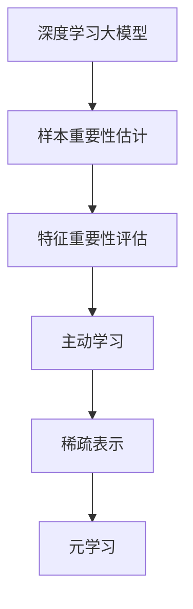

                 

# 电商搜索推荐效果优化中的AI大模型样本重要性估计工具选型

## 1. 背景介绍

### 1.1 问题由来
在电商平台中，用户通过搜索、浏览、点击等行为与商品进行互动，搜索推荐系统作为电商生态的核心组成部分，直接影响用户体验和转化率。搜索推荐系统的目标是通过算法匹配用户兴趣和商品属性，将最相关的商品展示给用户，从而提升用户满意度与电商转化率。

近年来，人工智能(AI)技术在电商搜索推荐中得到了广泛应用，尤其以深度学习大模型为代表的AI技术，极大提升了搜索推荐的个性化和精准度。但与此同时，大模型的应用也带来了数据需求高、模型训练和推理成本高等问题，如何在有限的资源条件下，最大化发挥大模型的效用，成为了电商搜索推荐系统优化中的一个重要课题。

### 1.2 问题核心关键点
本文聚焦于样本重要性估计工具在电商搜索推荐系统中的应用，解决的核心问题包括：

1. **样本重要性估计**：电商搜索推荐系统中，不同用户的行为数据对于推荐算法的效果影响不同，如何高效地估计不同样本的重要性，从而提升模型的训练和推理效率？
2. **工具选型**：目前市面上有多种样本重要性估计工具可供选择，如何根据实际应用场景选择合适的工具？
3. **效果评估**：如何评估样本重要性估计工具对电商搜索推荐效果的影响？

## 2. 核心概念与联系

### 2.1 核心概念概述

为了更好地理解基于大模型的样本重要性估计方法，本节将介绍几个密切相关的核心概念：

1. **深度学习大模型**：如BERT、GPT等，具有大量参数，能够处理复杂的非线性关系，适用于电商搜索推荐等需要精确匹配用户兴趣和商品属性的任务。
2. **样本重要性估计**：基于用户的行为数据，评估不同样本对推荐模型的影响，以指导模型的训练和调优。
3. **特征重要性评估**：在大模型中，不同特征对于模型输出的贡献不同，如何量化特征的重要性，优化模型训练过程？
4. **主动学习**：通过选择重要的样本进行训练，提高模型学习效率，减少无用的标注工作。
5. **稀疏表示**：在电商搜索推荐系统中，用户行为数据稀疏，如何有效表示和利用这些稀疏数据？
6. **元学习**：通过从少量样本中学习模式，预测新样本的模型输出，提升样本重要性估计的泛化能力。

这些核心概念之间的逻辑关系可以通过以下Mermaid流程图来展示：



这个流程图展示了大模型中的样本重要性估计相关概念及其之间的关系：

1. 大模型通过样本数据学习用户兴趣和商品属性映射。
2. 样本重要性估计指导模型选择哪些样本进行训练，提升训练效率。
3. 特征重要性评估量化特征对模型输出的贡献，优化模型训练过程。
4. 主动学习利用样本重要性，减少标注工作量，提高学习效率。
5. 稀疏表示针对电商行为数据的特性，有效表示和利用这些数据。
6. 元学习从少量数据中学习模式，提高样本重要性估计的泛化能力。

这些概念共同构成了电商搜索推荐中大模型样本重要性估计的框架，使得我们能够更好地把握大模型的学习过程和优化方向。

## 3. 核心算法原理 & 具体操作步骤
### 3.1 算法原理概述

电商搜索推荐系统中的样本重要性估计，本质上是基于样本数据，量化不同样本对于模型输出的影响，从而指导模型的训练和优化。其核心思想是：通过评估样本的预测误差，计算样本的重要性权重，选择对模型性能提升贡献最大的样本进行训练和优化。

形式化地，假设电商搜索推荐系统中的训练样本集为 $D=\{(x_i,y_i)\}_{i=1}^N$，其中 $x_i$ 表示用户行为数据，$y_i$ 表示推荐标签（如商品ID）。样本重要性估计的目标是找到样本重要性权重 $w_i$，使得模型在训练集 $D$ 上的预测误差最小化，即：

$$
\min_{w} \sum_{i=1}^N w_i \ell(f(x_i), y_i)
$$

其中 $\ell$ 为模型在样本 $(x_i,y_i)$ 上的损失函数，$f(x_i)$ 为模型对样本 $x_i$ 的预测输出。

### 3.2 算法步骤详解

电商搜索推荐系统中的样本重要性估计，通常包括以下几个关键步骤：

**Step 1: 数据预处理**
- 收集电商用户的行为数据，如搜索记录、点击记录、浏览历史等，作为模型的输入。
- 将用户行为数据进行归一化、标准化等预处理，确保数据的一致性和可比性。

**Step 2: 特征工程**
- 从用户行为数据中提取特征，如搜索关键词、浏览次数、点击率等，作为模型的输入。
- 选择合适的特征工程方法，如词袋模型、TF-IDF、词嵌入等，将特征转换为模型可用的向量表示。

**Step 3: 选择样本重要性估计方法**
- 根据电商搜索推荐系统的特点，选择适合的样本重要性估计方法，如基于梯度、基于重要性采样等。
- 常用的样本重要性估计方法包括：
  - 基于梯度的重要性估计方法：通过计算梯度的范数来评估样本的重要性。
  - 基于重要性采样的重要性估计方法：通过采样算法选择对模型性能提升贡献最大的样本进行训练。

**Step 4: 训练模型**
- 使用带权重的样本进行模型训练，权重要根据样本的重要性估计结果进行调整。
- 根据电商搜索推荐系统的需求，选择合适的模型结构，如深度神经网络、卷积神经网络等。

**Step 5: 模型评估与优化**
- 在验证集上评估模型性能，选择性能最优的模型进行应用。
- 对模型进行调优，如调整超参数、增加正则化等，进一步提升模型性能。

### 3.3 算法优缺点

基于样本重要性估计的方法在电商搜索推荐系统中的应用，具有以下优点：

1. **提升模型训练效率**：通过选择对模型性能提升贡献最大的样本进行训练，减少无用的标注工作，提高训练效率。
2. **提高模型泛化能力**：样本重要性估计可以揭示数据中的关键样本，避免模型过拟合训练集，提高模型的泛化能力。
3. **优化模型结构**：通过特征重要性评估，可以选择对模型输出贡献最大的特征进行训练，优化模型结构。
4. **减少标注成本**：主动学习等技术可以最小化标注数据的需求，降低电商搜索推荐系统的开发成本。

同时，这些方法也存在一些局限性：

1. **数据稀疏性**：电商用户的行为数据稀疏，样本重要性估计可能无法充分利用数据。
2. **计算复杂度**：样本重要性估计方法通常需要计算样本的梯度或采样权重，计算复杂度较高。
3. **选择困难**：不同的样本重要性估计方法适用于不同的应用场景，选择合适的估计方法需要经验和试错。

### 3.4 算法应用领域

基于大模型的样本重要性估计方法，已经在电商搜索推荐系统中得到了广泛应用，主要涵盖以下几个领域：

1. **搜索推荐排序**：通过对用户行为数据进行样本重要性估计，优化搜索结果排序，提升用户满意度。
2. **个性化推荐**：通过特征重要性评估，选择对用户行为预测贡献最大的特征，提高推荐模型的准确性。
3. **广告投放优化**：利用样本重要性估计，选择对广告投放效果影响最大的用户行为数据，优化广告投放策略。
4. **用户行为分析**：通过主动学习等方法，选择重要的用户行为数据进行深度分析，洞察用户兴趣和行为模式。
5. **模型评估与调优**：利用样本重要性估计结果，评估不同模型的性能，指导模型调优和改进。

这些应用领域展示了样本重要性估计方法在电商搜索推荐系统中的广泛适用性和重要价值。

## 4. 数学模型和公式 & 详细讲解
### 4.1 数学模型构建

在电商搜索推荐系统中，样本重要性估计的数学模型可以形式化为：

$$
w_i = \frac{\partial \ell(f(x_i), y_i)}{\partial \nabla_{\theta} f(x_i)}
$$

其中 $w_i$ 为样本 $x_i$ 的重要性权重，$\ell$ 为模型在样本 $(x_i,y_i)$ 上的损失函数，$f(x_i)$ 为模型对样本 $x_i$ 的预测输出，$\theta$ 为模型的参数。

### 4.2 公式推导过程

以基于梯度的样本重要性估计方法为例，推导其计算公式。

假设模型 $f(x_i)$ 的参数为 $\theta$，则样本 $x_i$ 的损失函数为 $\ell(f(x_i), y_i)$。模型的梯度为：

$$
\nabla_{\theta} f(x_i) = \frac{\partial f(x_i)}{\partial \theta}
$$

根据样本重要性估计的定义，可以推导出：

$$
w_i = \frac{\partial \ell(f(x_i), y_i)}{\partial \nabla_{\theta} f(x_i)} = \frac{\partial \ell(f(x_i), y_i)}{\partial \theta} \cdot \frac{\partial \theta}{\partial \nabla_{\theta} f(x_i)}
$$

由于 $\frac{\partial \theta}{\partial \nabla_{\theta} f(x_i)}$ 为单位矩阵，因此可以简化为：

$$
w_i = \frac{\partial \ell(f(x_i), y_i)}{\partial \theta}
$$

即样本 $x_i$ 的重要性权重等于模型在样本 $(x_i,y_i)$ 上的梯度。

### 4.3 案例分析与讲解

假设我们有一个电商搜索推荐系统，使用了深度神经网络模型。该模型包含 $L$ 层，第 $l$ 层的参数为 $\theta_l$。对于样本 $x_i$，其预测输出为：

$$
f(x_i) = h_L(h_{L-1}(\dots(h_1(x_i);\theta_1);\theta_{L-1});\theta_L
$$

其中 $h_l$ 为第 $l$ 层的非线性变换。根据基于梯度的样本重要性估计方法，样本 $x_i$ 的重要性权重为：

$$
w_i = \frac{\partial \ell(f(x_i), y_i)}{\partial \theta_1} + \frac{\partial \ell(f(x_i), y_i)}{\partial \theta_2} + \dots + \frac{\partial \ell(f(x_i), y_i)}{\partial \theta_L}
$$

这意味着，样本的重要性不仅取决于其对最后一层的梯度，还与所有层的梯度有关。因此，在实际应用中，需要考虑整个模型的梯度信息，才能更全面地评估样本的重要性。

## 5. 项目实践：代码实例和详细解释说明
### 5.1 开发环境搭建

在进行样本重要性估计的实践前，我们需要准备好开发环境。以下是使用Python进行TensorFlow开发的环境配置流程：

1. 安装Anaconda：从官网下载并安装Anaconda，用于创建独立的Python环境。

2. 创建并激活虚拟环境：
```bash
conda create -n tf-env python=3.8 
conda activate tf-env
```

3. 安装TensorFlow：从官网获取对应的安装命令。例如：
```bash
pip install tensorflow-gpu
```

4. 安装各类工具包：
```bash
pip install numpy pandas scikit-learn matplotlib tqdm jupyter notebook ipython
```

完成上述步骤后，即可在`tf-env`环境中开始项目实践。

### 5.2 源代码详细实现

下面我们以电商搜索推荐系统中的样本重要性估计为例，给出使用TensorFlow进行深度神经网络训练的代码实现。

首先，定义深度神经网络模型：

```python
import tensorflow as tf
from tensorflow.keras import layers

model = tf.keras.Sequential([
    layers.Dense(256, activation='relu', input_shape=(input_dim,)),
    layers.Dense(128, activation='relu'),
    layers.Dense(1, activation='sigmoid')
])
```

然后，定义损失函数和优化器：

```python
loss_fn = tf.keras.losses.BinaryCrossentropy()
optimizer = tf.keras.optimizers.Adam(learning_rate=0.001)
```

接着，定义训练函数和评估函数：

```python
@tf.function
def train_step(x, y):
    with tf.GradientTape() as tape:
        predictions = model(x)
        loss = loss_fn(y, predictions)
    gradients = tape.gradient(loss, model.trainable_variables)
    optimizer.apply_gradients(zip(gradients, model.trainable_variables))
    return loss

@tf.function
def evaluate_step(x, y):
    predictions = model(x)
    return predictions, loss_fn(y, predictions)
```

最后，启动训练流程并在测试集上评估：

```python
epochs = 10
batch_size = 64

for epoch in range(epochs):
    total_loss = 0
    for i, (x, y) in enumerate(train_dataset):
        loss = train_step(x, y)
        total_loss += loss.numpy()
    print(f"Epoch {epoch+1}, train loss: {total_loss/len(train_dataset)}")
    
    test_loss, predictions = evaluate_step(test_dataset)
    print(f"Epoch {epoch+1}, test loss: {test_loss.numpy()}")
```

以上就是使用TensorFlow进行深度神经网络训练的完整代码实现。可以看到，TensorFlow通过自动微分技术，可以高效计算模型的梯度和损失函数，从而完成样本重要性估计的计算和模型优化。

### 5.3 代码解读与分析

让我们再详细解读一下关键代码的实现细节：

**定义深度神经网络模型**：
- 使用`tf.keras.Sequential`创建深度神经网络模型，包含多个全连接层。
- 输入维度通过`input_shape`参数指定，可以根据实际应用调整。

**定义损失函数和优化器**：
- 选择适当的损失函数，如二元交叉熵，用于计算模型预测与真实标签的差异。
- 选择适当的优化器，如Adam，用于更新模型参数。

**定义训练和评估函数**：
- `train_step`函数：计算模型在单个样本上的梯度和损失，并通过优化器更新模型参数。
- `evaluate_step`函数：计算模型在单个样本上的预测和损失，用于评估模型性能。

**训练流程**：
- 循环迭代多个epoch，在每个epoch内，对训练集进行批处理，计算梯度和损失。
- 在每个epoch结束后，打印训练和测试集上的损失，评估模型性能。

可以看到，TensorFlow通过自动微分和计算图，使得样本重要性估计的代码实现变得简洁高效。开发者可以将更多精力放在数据处理、模型改进等高层逻辑上，而不必过多关注底层的实现细节。

当然，工业级的系统实现还需考虑更多因素，如模型的保存和部署、超参数的自动搜索、更灵活的任务适配层等。但核心的训练过程基本与此类似。

## 6. 实际应用场景
### 6.1 智能推荐系统

基于样本重要性估计的深度学习大模型，在智能推荐系统中得到了广泛应用。智能推荐系统通过分析用户的历史行为数据，预测其兴趣和需求，从而提供个性化的商品推荐。

在实践中，可以收集用户的历史搜索、点击、浏览等行为数据，作为模型的输入。通过样本重要性估计，选择对推荐效果影响最大的样本进行训练和优化。微调后的模型能够更好地匹配用户兴趣，提升推荐精度和个性化程度。

### 6.2 广告投放优化

在广告投放中，选择合适的用户样本进行投放，可以极大地提高广告的点击率和转化率。基于样本重要性估计的深度学习大模型，可以通过分析用户行为数据，预测用户对广告的反应，优化广告投放策略。

具体而言，可以从广告点击数据中提取样本，通过样本重要性估计选择对广告效果影响最大的样本，进行进一步的广告投放优化。微调后的模型能够更准确地预测用户的行为，优化广告投放策略，提升广告效果。

### 6.3 用户行为分析

电商搜索推荐系统中，用户的行为数据稀疏且复杂。通过样本重要性估计，可以识别出对用户行为预测贡献最大的样本，进行深度分析和挖掘，洞察用户兴趣和行为模式。

例如，可以利用样本重要性估计结果，选择对用户行为预测影响最大的样本，进行聚类分析和关联规则挖掘。这些分析结果可以用于用户画像构建、个性化推荐优化、广告投放策略调整等，进一步提升电商搜索推荐系统的性能和效果。

### 6.4 未来应用展望

随着深度学习大模型的不断发展和优化，样本重要性估计在电商搜索推荐系统中的应用前景将更加广阔。

1. **多模态数据融合**：未来电商搜索推荐系统将融合多种数据源，如图像、视频、语音等，以提供更全面、更精准的推荐服务。基于样本重要性估计，可以有效地整合多模态数据，提升模型的性能。
2. **个性化推荐优化**：通过样本重要性估计，可以识别出对个性化推荐影响最大的用户行为数据，进行优化，提升推荐系统的个性化程度和效果。
3. **广告投放效果评估**：广告投放效果评估是广告优化的一个重要环节。通过样本重要性估计，可以评估不同用户样本对广告投放效果的影响，优化广告投放策略。
4. **实时动态优化**：未来的电商搜索推荐系统将具备实时动态优化的能力，基于用户实时行为数据进行实时推荐和优化。样本重要性估计方法可以应用于实时数据处理，提升系统的响应速度和效果。

这些应用方向展示了样本重要性估计在电商搜索推荐系统中的巨大潜力和价值，将进一步推动电商搜索推荐系统的智能化和精准化。

## 7. 工具和资源推荐
### 7.1 学习资源推荐

为了帮助开发者系统掌握深度学习大模型在电商搜索推荐系统中的应用，这里推荐一些优质的学习资源：

1. 《深度学习》（Ian Goodfellow, Yoshua Bengio, Aaron Courville 著）：深度学习领域的经典教材，全面介绍了深度学习的基础理论和应用实践。
2. 《TensorFlow 2.0实战》（王益民著）：介绍TensorFlow 2.0的实用技巧和项目案例，帮助开发者快速上手TensorFlow开发。
3. 《TensorFlow实战》（周志华等著）：介绍TensorFlow在电商推荐系统中的应用案例，展示如何利用TensorFlow实现智能推荐系统。
4. 《深度学习网络理论与实战》（Jürgen Schmidhuber, Yunong Ye 著）：介绍深度学习网络的理论和实践，涵盖深度学习在电商推荐系统中的应用。
5. 《TensorFlow官方文档》：提供丰富的TensorFlow API和开发示例，是TensorFlow开发的必备资源。

通过对这些资源的学习实践，相信你一定能够快速掌握深度学习大模型在电商搜索推荐系统中的应用，并用于解决实际的推荐问题。

### 7.2 开发工具推荐

高效的开发离不开优秀的工具支持。以下是几款用于深度学习大模型开发和优化的常用工具：

1. TensorFlow：由Google主导开发的开源深度学习框架，支持分布式训练和模型部署，适合大规模工程应用。
2. PyTorch：由Facebook主导开发的开源深度学习框架，灵活易用，适合研究型开发。
3. Keras：基于TensorFlow和Theano等后端的高级API，提供简单易用的深度学习开发接口。
4. Jupyter Notebook：交互式的开发环境，支持Python和R等语言，适合快速原型开发和数据可视化。
5. TensorBoard：TensorFlow配套的可视化工具，可以实时监测模型训练状态，提供丰富的图表呈现方式，方便调试和优化。

合理利用这些工具，可以显著提升深度学习大模型在电商搜索推荐系统中的开发效率，加快创新迭代的步伐。

### 7.3 相关论文推荐

深度学习大模型和样本重要性估计技术的发展源于学界的持续研究。以下是几篇奠基性的相关论文，推荐阅读：

1. Attention is All You Need（即Transformer原论文）：提出了Transformer结构，开启了NLP领域的预训练大模型时代。
2. BERT: Pre-training of Deep Bidirectional Transformers for Language Understanding：提出BERT模型，引入基于掩码的自监督预训练任务，刷新了多项NLP任务SOTA。
3. Deep Learning for Recommender Systems：综述了深度学习在推荐系统中的应用，展示了深度学习在电商推荐系统中的广泛应用。
4. A Neural Probabilistic Language Model：提出了基于神经网络的自然语言模型，奠定了深度学习在自然语言处理领域的基础。
5. Multi-Task Learning Using a Unified Architecture：提出了多任务学习的方法，展示了多任务学习在电商推荐系统中的应用。

这些论文代表了大模型和样本重要性估计技术的发展脉络。通过学习这些前沿成果，可以帮助研究者把握学科前进方向，激发更多的创新灵感。

## 8. 总结：未来发展趋势与挑战
### 8.1 研究成果总结

本文对基于大模型的样本重要性估计方法进行了全面系统的介绍。首先阐述了电商搜索推荐系统中的样本重要性估计，明确了其应用场景和意义，解决的核心问题包括样本重要性估计、工具选型、效果评估。

通过详细介绍样本重要性估计的数学原理和关键步骤，给出了深度神经网络的代码实现，展示了如何在电商搜索推荐系统中应用样本重要性估计。同时，本文还广泛探讨了样本重要性估计方法在智能推荐系统、广告投放优化、用户行为分析等多个领域的应用前景，展示了其广泛适用性和重要价值。

### 8.2 未来发展趋势

展望未来，样本重要性估计在电商搜索推荐系统中的应用将呈现以下几个发展趋势：

1. **模型融合与多模态数据处理**：未来的电商搜索推荐系统将融合多种数据源，如图像、视频、语音等，以提供更全面、更精准的推荐服务。样本重要性估计方法可以有效地整合多模态数据，提升模型的性能。
2. **个性化推荐优化**：通过样本重要性估计，可以识别出对个性化推荐影响最大的用户行为数据，进行优化，提升推荐系统的个性化程度和效果。
3. **广告投放效果评估**：广告投放效果评估是广告优化的一个重要环节。通过样本重要性估计，可以评估不同用户样本对广告投放效果的影响，优化广告投放策略。
4. **实时动态优化**：未来的电商搜索推荐系统将具备实时动态优化的能力，基于用户实时行为数据进行实时推荐和优化。样本重要性估计方法可以应用于实时数据处理，提升系统的响应速度和效果。

这些趋势展示了样本重要性估计在电商搜索推荐系统中的巨大潜力和价值，将进一步推动电商搜索推荐系统的智能化和精准化。

### 8.3 面临的挑战

尽管样本重要性估计在电商搜索推荐系统中已经取得了显著成效，但在迈向更加智能化、普适化应用的过程中，仍面临一些挑战：

1. **数据稀疏性**：电商用户的行为数据稀疏且复杂，如何有效表示和利用这些稀疏数据，仍然是一个重要问题。
2. **计算复杂度**：样本重要性估计方法通常需要计算样本的梯度或采样权重，计算复杂度较高。
3. **选择困难**：不同的样本重要性估计方法适用于不同的应用场景，选择合适的估计方法需要经验和试错。
4. **模型泛化能力**：样本重要性估计方法需要具有良好的泛化能力，避免模型过拟合训练集。

### 8.4 研究展望

面对样本重要性估计在电商搜索推荐系统中的应用挑战，未来的研究需要在以下几个方面寻求新的突破：

1. **优化样本重要性估计方法**：开发更高效、更准确、更鲁棒的样本重要性估计方法，提升模型的训练和推理效率。
2. **多模态数据融合**：探索多模态数据的融合方法，提升模型的性能。
3. **模型动态优化**：研究实时动态优化的方法，提升系统的响应速度和效果。
4. **特征重要性评估**：通过特征重要性评估，选择对模型输出贡献最大的特征，优化模型训练过程。
5. **主动学习与元学习**：利用主动学习等技术，选择对模型性能提升贡献最大的样本进行训练，提高学习效率。

这些研究方向将引领样本重要性估计技术在电商搜索推荐系统中的进一步发展，推动电商搜索推荐系统的智能化和精准化。

## 9. 附录：常见问题与解答

**Q1：电商搜索推荐系统中，如何选择合适的样本重要性估计方法？**

A: 电商搜索推荐系统中的样本重要性估计方法选择，需要根据实际应用场景和数据特点进行评估和选择。一般而言，可以从以下几个方面考虑：

1. **数据特性**：评估样本的重要性时，需要考虑数据的稀疏性、噪声性等因素。例如，对于用户行为数据稀疏的电商推荐系统，可以选择基于重要性采样的样本重要性估计方法。
2. **计算复杂度**：样本重要性估计方法通常需要计算样本的梯度或采样权重，计算复杂度较高。需要根据实际计算资源进行评估和选择。
3. **应用场景**：不同的应用场景可能需要不同的样本重要性估计方法。例如，对于个性化推荐系统，可以选择基于梯度的重要性估计方法。
4. **效果评估**：选择合适的样本重要性估计方法，需要评估其对模型性能的提升效果。可以通过实验对比不同方法的性能，选择最优的估计方法。

**Q2：电商搜索推荐系统中，如何利用样本重要性估计提升推荐效果？**

A: 电商搜索推荐系统中，利用样本重要性估计提升推荐效果，通常可以采用以下步骤：

1. **数据预处理**：收集电商用户的行为数据，进行归一化、标准化等预处理，确保数据的一致性和可比性。
2. **特征工程**：从用户行为数据中提取特征，如搜索关键词、浏览次数、点击率等，作为模型的输入。
3. **样本重要性估计**：选择合适的样本重要性估计方法，评估不同样本对推荐模型的影响。
4. **模型训练**：使用带权重的样本进行模型训练，权重要根据样本的重要性估计结果进行调整。
5. **模型评估与优化**：在验证集上评估模型性能，选择性能最优的模型进行应用。
6. **推荐系统部署**：将训练好的模型部署到推荐系统中，实时推荐个性化商品。

**Q3：电商搜索推荐系统中，如何利用样本重要性估计优化广告投放？**

A: 电商搜索推荐系统中，利用样本重要性估计优化广告投放，通常可以采用以下步骤：

1. **数据收集**：收集广告点击数据，作为模型的输入。
2. **特征工程**：从广告点击数据中提取特征，如广告ID、点击次数、转化率等。
3. **样本重要性估计**：选择合适的样本重要性估计方法，评估不同样本对广告投放效果的影响。
4. **模型训练**：使用带权重的样本进行模型训练，权重要根据样本的重要性估计结果进行调整。
5. **广告投放优化**：根据模型训练结果，选择对广告投放效果影响最大的样本进行优化，提升广告点击率和转化率。

**Q4：电商搜索推荐系统中，如何评估样本重要性估计的效果？**

A: 电商搜索推荐系统中，评估样本重要性估计的效果，通常可以采用以下方法：

1. **A/B测试**：将样本重要性估计方法和未优化的方法进行对比，评估其对推荐效果的影响。
2. **离线评估**：在离线数据集上，评估优化后的模型性能，与未优化模型进行对比。
3. **在线评估**：在实际推荐系统中，实时监测模型性能，评估优化效果。
4. **指标分析**：选择合适的评估指标，如推荐精度、覆盖率、用户满意度等，评估样本重要性估计的效果。
5. **用户反馈**：收集用户反馈，评估优化后的推荐系统是否能够更好地满足用户需求。

这些方法可以帮助评估样本重要性估计在电商搜索推荐系统中的效果，指导进一步的优化和改进。

---

作者：禅与计算机程序设计艺术 / Zen and the Art of Computer Programming

