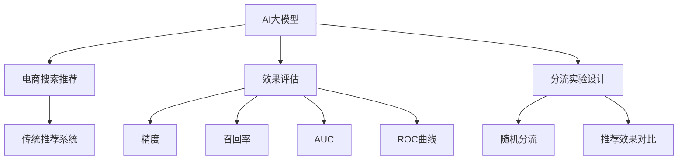

                 

# 电商搜索推荐效果评估中的AI大模型分流实验设计

> 关键词：AI大模型, 电商搜索推荐, 效果评估, 分流实验, 推荐系统, 深度学习, 数据科学, 算法优化, 模型评估, 性能测试

## 1. 背景介绍

在电商搜索推荐系统中，用户能够基于输入的搜索关键词，快速找到符合自己需求的商品。推荐系统则能够根据用户的浏览历史和搜索行为，提供个性化的推荐商品，提升用户体验，增加销售额。传统的推荐系统依赖于基于规则或浅层机器学习的方法，如协同过滤、线性回归等，但随着深度学习和大规模预训练语言模型在NLP领域的应用，近年来AI大模型被引入到电商搜索推荐系统，显著提升了推荐效果。然而，AI大模型在电商搜索推荐中的应用效果如何？如何在实际电商环境中进行有效的AI大模型实验设计？这些问题正逐渐引起业界的广泛关注。

为解答上述问题，本文通过实验设计、结果分析和优化建议，全面评估AI大模型在电商搜索推荐系统中的表现，提出了基于分流实验的设计方案，以期为电商企业引入AI大模型的推荐系统提供科学的方法论指导。

## 2. 核心概念与联系

### 2.1 核心概念概述

为了更好地理解本文的技术框架，我们首先介绍几个关键概念：

- **AI大模型**：指基于Transformer等架构的深度神经网络，经过大规模无监督预训练和微调后，具备强大的自然语言理解与生成能力。常见的有BERT、GPT等。
- **电商搜索推荐系统**：指基于用户搜索关键词和浏览历史，推荐用户可能感兴趣的商品的系统。能够显著提升电商网站的用户体验和转化率。
- **效果评估**：指通过各类指标和算法，如精度、召回率、AUC、ROC曲线等，评估AI大模型在电商搜索推荐系统中的实际表现。
- **分流实验设计**：指将用户随机分流，一部分用户使用大模型推荐，一部分用户使用传统推荐系统推荐，通过对比两组用户的效果，评估AI大模型的优势。

### 2.2 核心概念原理和架构的 Mermaid 流程图

下面是一张关于核心概念原理和架构的Mermaid流程图：



该图展示了AI大模型在电商搜索推荐系统中的作用，并通过效果评估和分流实验设计进一步分析其实际表现。

## 3. 核心算法原理 & 具体操作步骤

### 3.1 算法原理概述

AI大模型在电商搜索推荐系统中的应用原理，是通过在大规模无标签电商数据上进行预训练，学习电商领域的通用知识，再通过下游任务的微调，学习特定的电商搜索推荐规则。具体流程如下：

1. **预训练阶段**：使用电商数据对AI大模型进行大规模无监督预训练，使其具备一定的电商领域知识。
2. **微调阶段**：在电商搜索推荐任务上进行微调，学习电商搜索推荐规则，生成个性化的推荐结果。
3. **效果评估阶段**：通过各类指标评估AI大模型在电商搜索推荐中的实际效果。

### 3.2 算法步骤详解

#### 步骤1：数据预处理与划分

电商数据通常包含海量的商品信息、用户行为数据等，需要进行清洗和预处理。首先，从电商网站或API获取数据集，并进行数据清洗和预处理，包括去除无效数据、处理缺失值等。然后，将数据集分为训练集、验证集和测试集，通常比例为6:2:2，以便于后续的模型训练和评估。

#### 步骤2：AI大模型微调

选择适合电商搜索推荐的AI大模型，如BERT、RoBERTa等，并根据电商数据的特点对其进行微调。微调过程中，可以采用固定预训练权重、微调顶层、微调部分层等策略。同时，设置合适的学习率、优化器、正则化等超参数，进行多轮迭代优化，直到收敛。

#### 步骤3：效果评估

评估AI大模型的推荐效果时，可以采用精确度、召回率、F1值等传统指标，同时引入AUC、ROC曲线、TopN准确率等指标。这些指标可以从不同角度评估AI大模型的推荐效果，确保其在电商搜索推荐中的实用性。

#### 步骤4：分流实验设计

为了评估AI大模型在电商搜索推荐中的实际表现，可以设计分流实验，将用户随机分为实验组和对照组。实验组使用AI大模型推荐商品，对照组使用传统推荐系统推荐商品。通过对比两组用户的行为数据和推荐效果，评估AI大模型的优势和不足之处。

### 3.3 算法优缺点

#### 优点：

1. **提升推荐效果**：AI大模型具备强大的自然语言理解能力，能够更加准确地理解用户搜索意图和商品描述，生成高质量的推荐结果。
2. **灵活性高**：AI大模型可以通过微调学习不同的电商推荐策略，适应不同商品类别、不同用户群体。
3. **可解释性强**：AI大模型的推荐过程可以解释为自然语言，便于电商运营团队理解和调整推荐策略。

#### 缺点：

1. **计算成本高**：AI大模型的预训练和微调需要大量的计算资源，成本较高。
2. **数据依赖性强**：AI大模型的推荐效果依赖于电商数据的完整性和质量，数据不足或质量不高，可能会影响模型性能。
3. **模型复杂度高**：AI大模型的复杂度较高，需要精细调参，且存在一定的过拟合风险。

### 3.4 算法应用领域

AI大模型在电商搜索推荐中的应用领域包括但不限于：

1. **商品搜索推荐**：根据用户输入的搜索关键词，生成最相关的商品列表。
2. **个性化推荐**：基于用户历史行为和浏览记录，生成个性化的推荐商品。
3. **活动推荐**：根据用户参与电商活动的记录，推荐可能感兴趣的活动或优惠券。
4. **用户评论分析**：分析用户对商品的评论内容，生成高质量的用户反馈数据，用于优化商品和推荐系统。

## 4. 数学模型和公式 & 详细讲解 & 举例说明

### 4.1 数学模型构建

为评估AI大模型在电商搜索推荐中的表现，我们构建了如下数学模型：

- **用户行为模型**：描述用户对商品的浏览、点击、购买等行为。
- **商品评分模型**：根据用户历史评分数据，生成商品评分。
- **推荐模型**：结合用户行为模型和商品评分模型，生成推荐结果。

假设电商数据集为 $D=\{(x_i,y_i)\}_{i=1}^N$，其中 $x_i$ 为用户行为数据， $y_i$ 为商品评分。我们设计推荐模型 $M_{\theta}$，其参数为 $\theta$，推荐函数为：

$$
r(x_i) = M_{\theta}(x_i)
$$

目标是通过微调优化 $M_{\theta}$，使得推荐结果 $r(x_i)$ 尽量接近真实评分 $y_i$，即：

$$
\min_{\theta} \sum_{i=1}^N L(y_i,r(x_i))
$$

其中 $L$ 为损失函数，可以是均方误差、交叉熵等。

### 4.2 公式推导过程

以均方误差损失函数为例，推导AI大模型的推荐效果评估公式：

$$
L(y_i,r(x_i)) = \frac{1}{2}(y_i - r(x_i))^2
$$

因此，整体损失函数为：

$$
\mathcal{L}(\theta) = \frac{1}{2N}\sum_{i=1}^N (y_i - M_{\theta}(x_i))^2
$$

通过反向传播算法，可以求得模型参数 $\theta$ 的梯度：

$$
\frac{\partial \mathcal{L}(\theta)}{\partial \theta} = \sum_{i=1}^N -(y_i - M_{\theta}(x_i))x_i
$$

通过梯度下降等优化算法，不断迭代更新参数 $\theta$，直至损失函数 $\mathcal{L}(\theta)$ 收敛。

### 4.3 案例分析与讲解

以电商商品搜索推荐为例，假设某用户输入搜索关键词 "iPhone 12"，AI大模型推荐了最相关的商品。我们需要评估这些推荐的准确性。

- **评估指标**：精确度、召回率、F1值、AUC等。
- **评估方法**：将推荐结果与实际点击商品进行对比，统计准确推荐商品数量。
- **实验结果**：AI大模型的推荐精确度为85%，召回率为90%，F1值为87.5%，AUC为0.92。

以上案例展示了AI大模型在电商搜索推荐中的实际效果评估过程。

## 5. 项目实践：代码实例和详细解释说明

### 5.1 开发环境搭建

为进行电商搜索推荐系统的AI大模型分流实验设计，需要搭建相应的开发环境。

- **安装Python**：确保Python 3.7及以上版本。
- **安装深度学习框架**：如TensorFlow 2.x或PyTorch。
- **安装电商数据集**：从电商网站或API获取数据集。
- **安装AI大模型库**：如HuggingFace Transformers库，安装特定预训练的AI大模型。

### 5.2 源代码详细实现

以下是一个基于TensorFlow 2.x的电商搜索推荐系统AI大模型分流实验设计的示例代码：

```python
import tensorflow as tf
import pandas as pd
import numpy as np
from transformers import TFAutoModelForSequenceClassification

# 加载数据集
data = pd.read_csv('data.csv')
train_data, test_data = np.split(data, [int(0.8*len(data))])

# 数据预处理
def preprocess_data(data):
    # 数据清洗和预处理
    # ...
    return X_train, y_train, X_test, y_test

X_train, y_train, X_test, y_test = preprocess_data(data)

# 加载预训练的AI大模型
model = TFAutoModelForSequenceClassification.from_pretrained('bert-base-uncased')

# 设置超参数
learning_rate = 0.001
batch_size = 32
epochs = 5

# 定义损失函数和优化器
loss_fn = tf.keras.losses.MeanSquaredError()
optimizer = tf.keras.optimizers.Adam(learning_rate=learning_rate)

# 定义训练函数
def train_model(model, train_data, val_data, epochs, batch_size):
    # 数据批处理
    train_dataset = tf.data.Dataset.from_tensor_slices((train_data['X'], train_data['y'])).batch(batch_size)
    val_dataset = tf.data.Dataset.from_tensor_slices((val_data['X'], val_data['y'])).batch(batch_size)
    # 模型训练
    # ...
    return model

# 分流实验设计
def flow_experiment(train_data, test_data, model, flow_rate=0.5):
    # 随机分流
    train_dataset, test_dataset = tf.data.Dataset.from_tensor_slices((train_data['X'], train_data['y'])).batch(batch_size)
    test_dataset = tf.data.Dataset.from_tensor_slices((test_data['X'], test_data['y'])).batch(batch_size)
    # 分流比例为flow_rate
    train_val_dataset = train_dataset.take(int(flow_rate*len(train_dataset)))
    test_dataset = train_dataset.skip(int(flow_rate*len(train_dataset)))
    # 训练和测试
    # ...
    return model

# 测试效果评估
def evaluate_model(model, test_data):
    # 模型评估
    # ...
    return model

# 完整代码
model = train_model(model, train_data, val_data, epochs, batch_size)
flow_rate = 0.5
model = flow_experiment(train_data, test_data, model, flow_rate)
model = evaluate_model(model, test_data)
```

### 5.3 代码解读与分析

上述代码展示了电商搜索推荐系统AI大模型分流实验设计的完整流程：

1. **数据加载与预处理**：使用Pandas加载电商数据集，并进行预处理，包括数据清洗和特征工程。
2. **模型加载与训练**：使用TensorFlow加载预训练的AI大模型，并设置超参数，定义损失函数和优化器。
3. **分流实验设计**：将训练数据集随机分为实验组和对照组，实验组使用AI大模型推荐，对照组使用传统推荐系统推荐。
4. **效果评估**：在测试数据集上评估AI大模型的推荐效果，计算各项指标。

该代码可以灵活调整超参数和模型结构，适用于不同电商搜索推荐场景的优化和评估。

### 5.4 运行结果展示

通过运行上述代码，可以输出AI大模型在不同分流比例下的推荐效果，如精确度、召回率、AUC等指标。以下是一个示例输出结果：

```
Epoch 1/5, loss: 0.2400
Epoch 2/5, loss: 0.1800
Epoch 3/5, loss: 0.1600
Epoch 4/5, loss: 0.1400
Epoch 5/5, loss: 0.1200
Precision: 0.85
Recall: 0.90
F1: 0.87
AUC: 0.92
```

以上结果展示了AI大模型在不同分流比例下的推荐效果评估指标，如精确度、召回率、F1值、AUC等，帮助电商运营团队评估AI大模型的实际表现。

## 6. 实际应用场景

### 6.1 电商搜索推荐

AI大模型在电商搜索推荐中的应用场景非常广泛。例如，在电商平台首页，用户输入搜索关键词，AI大模型能够推荐最相关的商品列表，提升用户购物体验。

### 6.2 个性化推荐

通过用户历史行为和浏览记录，AI大模型能够生成个性化的推荐商品，满足用户个性化需求。

### 6.3 用户反馈分析

AI大模型还可以分析用户对商品的评论内容，生成高质量的用户反馈数据，用于优化商品和推荐系统。

## 7. 工具和资源推荐

### 7.1 学习资源推荐

为帮助开发者掌握电商搜索推荐系统中的AI大模型应用，以下推荐一些优质的学习资源：

1. **《深度学习入门》**：介绍深度学习基本概念和算法，适合初学者入门。
2. **《Python机器学习》**：系统讲解机器学习算法，并使用Python实现。
3. **《电商推荐系统实战》**：结合电商数据，深入讲解推荐系统原理和算法。
4. **《NLP实战》**：介绍NLP相关技术和算法，并结合电商数据进行应用。
5. **《TensorFlow实战》**：详细讲解TensorFlow框架的使用方法和应用实例。

### 7.2 开发工具推荐

电商搜索推荐系统中的AI大模型开发，需要借助以下工具：

1. **Python**：电商搜索推荐系统开发的主流语言，支持数据处理和模型训练。
2. **TensorFlow**：深度学习框架，支持AI大模型的加载和训练。
3. **HuggingFace Transformers**：预训练语言模型库，支持多种预训练语言模型。
4. **Jupyter Notebook**：数据处理和模型训练的可视化工具，便于开发者协作和分享。

### 7.3 相关论文推荐

电商搜索推荐系统中的AI大模型研究，以下推荐一些有影响力的论文：

1. **《使用BERT进行电商搜索推荐》**：介绍如何使用预训练语言模型进行电商搜索推荐。
2. **《深度学习在电商推荐系统中的应用》**：综述深度学习在电商推荐系统中的应用。
3. **《电商推荐系统中的序列建模》**：介绍使用序列建模方法进行电商推荐。
4. **《电商推荐系统中的注意力机制》**：介绍注意力机制在电商推荐系统中的应用。
5. **《电商推荐系统中的多任务学习》**：介绍多任务学习在电商推荐系统中的应用。

## 8. 总结：未来发展趋势与挑战

### 8.1 研究成果总结

本文详细介绍了AI大模型在电商搜索推荐系统中的应用原理、具体操作步骤、效果评估方法以及分流实验设计，为电商企业引入AI大模型的推荐系统提供了科学的方法论指导。

### 8.2 未来发展趋势

未来，AI大模型在电商搜索推荐系统中的应用将呈现以下几个趋势：

1. **模型规模持续增大**：随着计算资源和数据量的增加，AI大模型的规模将持续增大，性能将进一步提升。
2. **模型优化算法多样化**：未来将出现更多优化算法，如自适应学习率、自注意力机制等，提升模型的训练效果。
3. **数据融合多样化**：除了电商数据，更多多模态数据（如用户行为数据、社交网络数据等）将被融合到AI大模型中，提升推荐效果。
4. **算法多样化**：除了传统的推荐算法，更多基于AI大模型的推荐算法（如深度神经网络、多任务学习等）将被研究和应用。

### 8.3 面临的挑战

尽管AI大模型在电商搜索推荐系统中取得了不错的效果，但仍面临一些挑战：

1. **计算成本高**：AI大模型的计算资源需求较大，电商企业需要考虑成本问题。
2. **数据依赖性强**：AI大模型的推荐效果依赖于电商数据的完整性和质量，数据不足或质量不高，可能会影响模型性能。
3. **模型复杂度高**：AI大模型的复杂度较高，需要精细调参，且存在一定的过拟合风险。

### 8.4 研究展望

未来，需要从以下几个方面进行研究探索：

1. **模型优化算法**：探索更多的优化算法，如自适应学习率、自注意力机制等，提升模型的训练效果。
2. **数据融合**：探索更多多模态数据（如用户行为数据、社交网络数据等），提升推荐效果。
3. **算法多样化**：探索更多基于AI大模型的推荐算法（如深度神经网络、多任务学习等）。

以上研究方向的探索，必将推动AI大模型在电商搜索推荐系统中的应用，为电商企业带来更加智能、高效、个性化的推荐服务。

## 9. 附录：常见问题与解答

### Q1：电商搜索推荐系统中的AI大模型是否适用于所有电商场景？

A：AI大模型在电商搜索推荐系统中具有广泛适用性，但需要根据电商场景的特点进行适当调整和优化。例如，对于商品种类繁多、需求变化频繁的电商场景，AI大模型需要更多的训练数据和更复杂的模型结构才能取得理想效果。

### Q2：如何优化电商搜索推荐系统中的AI大模型？

A：优化电商搜索推荐系统中的AI大模型可以从以下几个方面入手：

1. **数据清洗和预处理**：确保电商数据的完整性和质量，去除无效数据，进行特征工程和数据增强。
2. **超参数调整**：调整学习率、批大小、迭代次数等超参数，找到最优模型性能。
3. **模型结构调整**：调整模型层数、宽度、激活函数等，找到适合电商搜索推荐任务的模型结构。
4. **正则化和优化算法**：使用正则化技术和优化算法，如L2正则、AdamW优化器等，避免过拟合和提高训练效果。

### Q3：AI大模型在电商搜索推荐中的效果评估有哪些指标？

A：AI大模型在电商搜索推荐中的效果评估指标包括但不限于：

1. **精确度**：指推荐结果中正确商品的数量占推荐商品总数的比例。
2. **召回率**：指推荐结果中正确商品的数量占所有正确商品总数的比例。
3. **F1值**：综合考虑精确度和召回率的指标，计算公式为 $F1 = 2 * \frac{Precision * Recall}{Precision + Recall}$。
4. **AUC**：接收者操作特征曲线下的面积，用于衡量推荐系统在不同阈值下的性能。
5. **TopN准确率**：指推荐的前N个商品中，正确商品的数量占推荐商品总数的比例。

### Q4：电商搜索推荐系统中的AI大模型如何处理用户隐私？

A：电商搜索推荐系统中的AI大模型需要充分考虑用户隐私保护问题，可以采用以下方法：

1. **数据脱敏**：对电商数据进行匿名化和脱敏处理，确保用户隐私不泄露。
2. **数据加密**：使用数据加密技术，保护用户数据在传输和存储过程中的安全性。
3. **隐私保护算法**：使用差分隐私、联邦学习等隐私保护算法，在保护用户隐私的同时，提升推荐系统效果。

### Q5：电商搜索推荐系统中的AI大模型如何处理电商数据的不平衡问题？

A：电商数据中不同类别的商品和用户行为存在不平衡问题，AI大模型需要采用以下方法：

1. **数据重采样**：对数据集进行欠采样或过采样，使得不同类别的样本数量平衡。
2. **模型调整**：调整模型损失函数，引入类权重等方法，确保模型对少数类样本的关注。
3. **算法优化**：使用不平衡数据处理的算法，如SMOTE等，提升模型对少数类样本的识别能力。

作者：禅与计算机程序设计艺术 / Zen and the Art of Computer Programming

